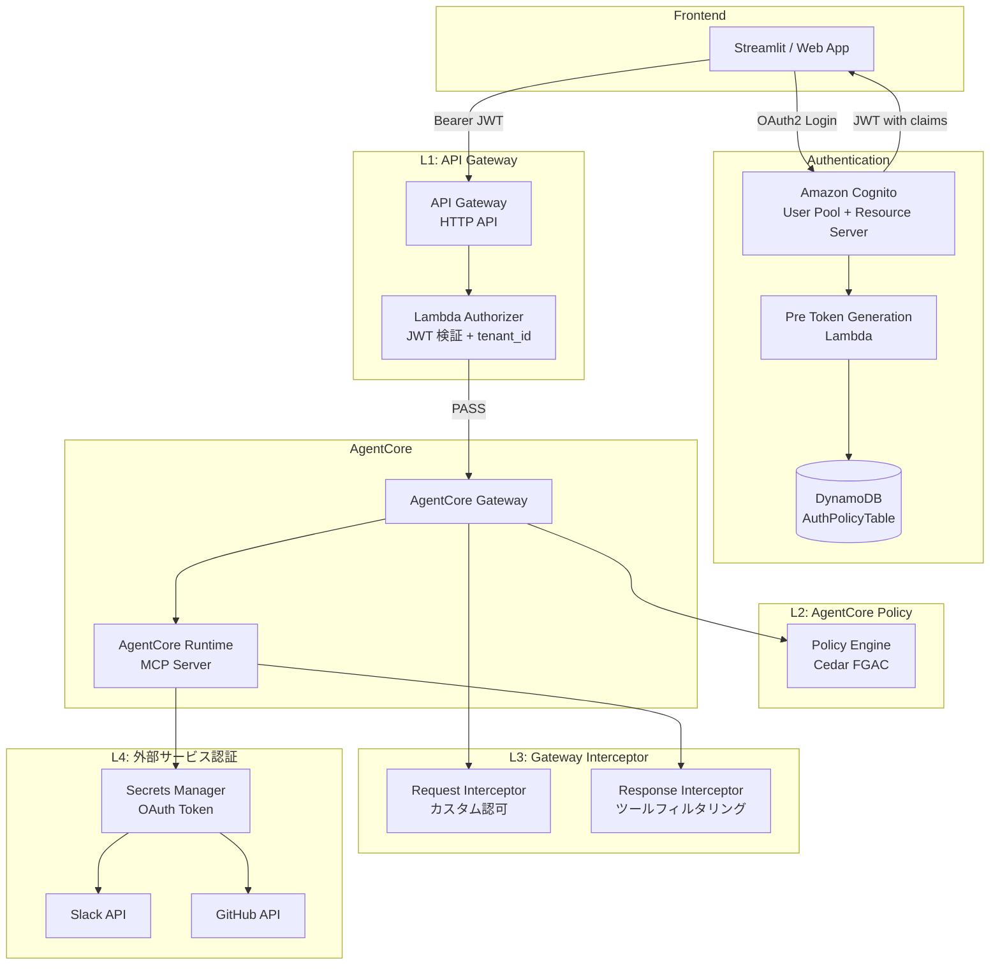
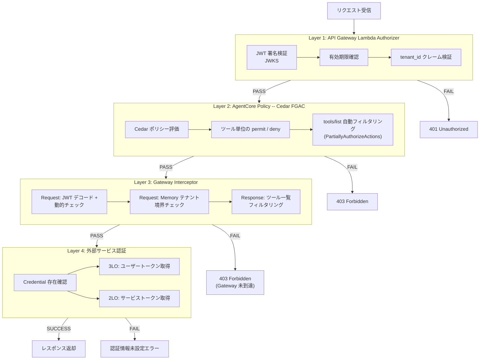
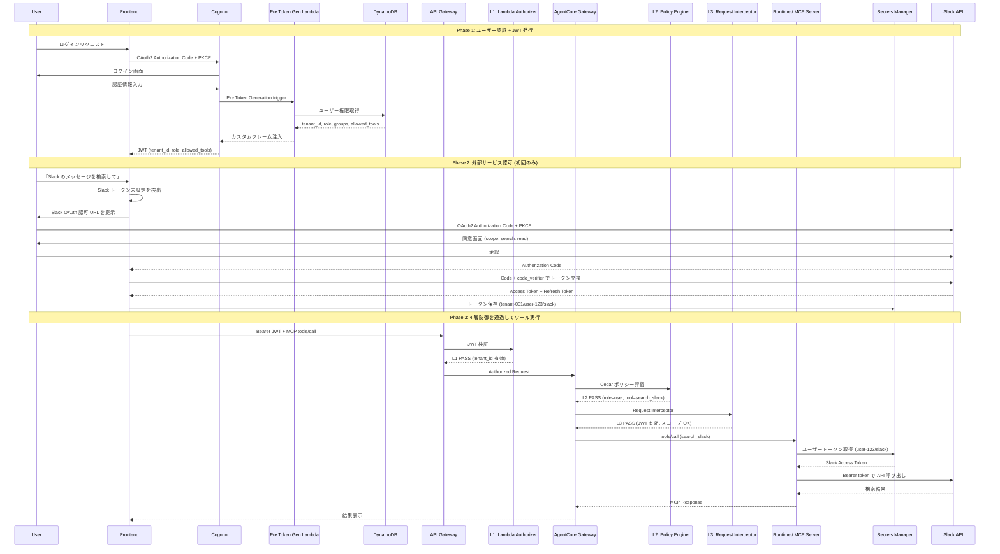
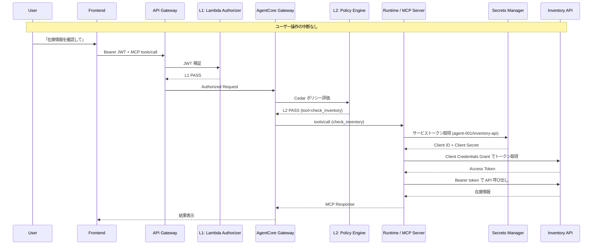

## 5. 4 層 Defense in Depth アーキテクチャ

前章で紹介した 3 つのアクセス制御手法を**組み合わせる**ことで、多層防御（Defense in Depth）アーキテクチャを構築できます。本章では、API Gateway から外部サービスまでの 4 層を統合した設計を、コードサンプル付きで解説します。

### 5.1 全体アーキテクチャ図

まず、4 層防御を含むシステム全体のアーキテクチャを示します。



各コンポーネントの役割を整理します。

| コンポーネント | AWS サービス | 層 | 役割 |
|-------------|------------|-----|------|
| Cognito + Pre Token Lambda | Cognito User Pool | -- | ユーザー認証、JWT カスタムクレーム注入 |
| Lambda Authorizer | API Gateway | L1 | JWT 検証、テナント認可 |
| Policy Engine | AgentCore Policy | L2 | Cedar ポリシーによるツール単位 FGAC |
| Request / Response Interceptor | Lambda | L3 | カスタム認可、ツールフィルタリング |
| Secrets Manager + 外部 API | Secrets Manager | L4 | 3LO/2LO トークン取得と外部 API 呼び出し |

### 5.2 4 層 Defense in Depth フローチャート

リクエストが各層を順に通過する流れを示します。いずれかの層で FAIL となった場合、リクエストは即座に拒否されます。



:::message
Layer 3 の Request Interceptor で拒否した場合、リクエストは AgentCore Gateway に到達しません。そのため、Gateway の CloudWatch Logs にも記録されない点に注意してください。監査ログが必要な場合は、Interceptor 内で独自のログ出力を実装する必要があります。
:::

### 5.2.1 JWT カスタムクレーム構造

4 層防御の各層は、Cognito が発行する JWT のカスタムクレームを参照して認可判定を行います。

| クレーム | 型 | 参照する層 | 用途 |
|---------|-----|----------|------|
| `sub` | String | L1, L3 | ユーザー識別子 |
| `tenant_id` | String | L1, L2, L3 | テナント分離 |
| `role` | String | L2, L3 | ロールベース制御 (admin / user / guest) |
| `groups` | String (JSON) | L2 | グループベース制御 |
| `allowed_tools` | String (JSON) | L3 | 動的ツール制限（外部 DB 連携時） |
| `scope` | String | L3 | OAuth2 スコープ（Interceptor でのツール認可） |

JWT の具体例:

```json
{
  "sub": "user-123",
  "token_use": "access",
  "scope": "agentcore-demo/rag-server: retrieve_doc",
  "exp": 1739712000,
  "iat": 1739708400,
  "client_id": "agentcore-app-client-id",
  "tenant_id": "tenant-001",
  "role": "user",
  "groups": "[\"engineering\", \"ml-team\"]",
  "allowed_tools": "[\"retrieve_doc\", \"search_memory\"]"
}
```

### 5.2.2 Pre Token Generation Lambda

JWT にカスタムクレームを注入する Pre Token Generation Lambda の実装です。Cognito のトリガーとして動作し、DynamoDB からユーザーの権限情報を読み込んでアクセストークンに追加します。

::::details Pre Token Generation Lambda（Python 完全版）

```python
import json
import os

import boto3

TABLE_NAME = os.environ["AUTH_POLICY_TABLE"]
RESOURCE_SERVER_ID = os.environ["RESOURCE_SERVER_ID"]
TARGET_NAME = os.environ["TARGET_NAME"]

dynamodb = boto3.resource("dynamodb")
table = dynamodb.Table(TABLE_NAME)


def get_user_permissions(tenant_id, user_id):
    """DynamoDB から tenant_id + user_id のポリシーを取得"""
    response = table.get_item(
        Key={
            "PK": f"TENANT#{tenant_id}",
            "SK": f"USER#{user_id}",
        }
    )
    item = response.get("Item", {})
    return {
        "role": item.get("role", "guest"),
        "groups": item.get("groups", []),
        "allowed_tools": item.get("allowed_tools", []),
    }


def build_scopes(allowed_tools):
    """ツール名リストを OAuth2 scope 形式に変換"""
    scopes = []
    for tool in allowed_tools:
        if tool == "*":
            scopes.append(f"{RESOURCE_SERVER_ID}/{TARGET_NAME}")
            return scopes
        scopes.append(f"{RESOURCE_SERVER_ID}/{TARGET_NAME}: {tool}")
    return scopes


def lambda_handler(event, context):
    user_attrs = event["request"]["userAttributes"]
    email = user_attrs.get("email", "")
    tenant_id = user_attrs.get("custom: tenant_id", "")
    user_id = event["userName"]

    permissions = get_user_permissions(tenant_id, user_id)

    scopes = build_scopes(permissions["allowed_tools"])

    event["response"] = {
        "claimsAndScopeOverrideDetails": {
            "accessTokenGeneration": {
                "claimsToAddOrOverride": {
                    "tenant_id": tenant_id,
                    "role": permissions["role"],
                    "groups": json.dumps(permissions["groups"]),
                    "allowed_tools": json.dumps(
                        permissions["allowed_tools"]
                    ),
                },
                "scopesToAdd": scopes,
            }
        }
    }

    return event
```

::::

### 5.3 Layer 1: API Gateway Lambda Authorizer

Layer 1 は**テナント / ネットワークレベル**のゲートキーパーです。JWT の署名を検証し、`tenant_id` クレームの存在と有効性を確認します。ここでは認可の粒度は粗く、「このテナントは Gateway にアクセスしてよいか?」のみを判定します。

特徴:

- 全リクエストの最初の関門であるため、**レイテンシーが最も小さい**（~570ms）
- JWKS を Lambda のグローバル変数でキャッシュし、署名検証のオーバーヘッドを最小化
- PASS 時にコンテキスト（`tenant_id`, `role`, `user_id`）を下流に伝播

:::message
**Lambda Authorizer のレスポンス形式**: Lambda Authorizer のレスポンスフォーマットは、API Gateway のタイプによって異なります。

- **HTTP API (v2.0)**: 簡易形式（`isAuthorized: true/false`, `context: {...}`）
- **REST API (v1.0)**: IAM Policy 形式（`principalId`, `policyDocument: {...}`）

以下のコード例は **REST API (v1.0)** 形式です。HTTP API を使用する場合は、以下の形式に変更してください：

```python
# HTTP API (v2.0) 形式
return {
    "isAuthorized": True,
    "context": {
        "tenant_id": tenant_id,
        "role": role,
        "user_id": user_id
    }
}
```

AgentCore Gateway は REST API ベースのため、本記事では REST API 形式を採用しています。
:::

::::details Lambda Authorizer（Python 完全版）

```python
import json
import os
import re
import urllib.request

import jwt

COGNITO_USER_POOL_ID = os.environ["COGNITO_USER_POOL_ID"]
COGNITO_REGION = os.environ["COGNITO_REGION"]
COGNITO_APP_CLIENT_ID = os.environ["COGNITO_APP_CLIENT_ID"]
ALLOWED_TENANTS = json.loads(os.environ.get("ALLOWED_TENANTS", "[]"))

# tenant_id の形式バリデーション: 英小文字・数字・ハイフンのみ許可
# ARN インジェクション防止（'/', ':', '*' 等の特殊文字を拒否）
TENANT_ID_PATTERN = re.compile(r"^[a-z0-9][a-z0-9-]{0,62}$")

JWKS_URL = (
    f"https://cognito-idp.{COGNITO_REGION}.amazonaws.com"
    f"/{COGNITO_USER_POOL_ID}/.well-known/jwks.json"
)

# Lambda グローバル変数で JWKS クライアントをキャッシュ
_jwks_client = None


def get_jwks_client():
    global _jwks_client
    if _jwks_client is None:
        _jwks_client = jwt.PyJWKClient(JWKS_URL)
    return _jwks_client


def lambda_handler(event, context):
    token = event.get("authorizationToken", "").replace("Bearer ", "")

    try:
        # JWT 署名検証（JWKS キャッシュ利用）
        jwks_client = get_jwks_client()
        signing_key = jwks_client.get_signing_key_from_jwt(token)

        claims = jwt.decode(
            token,
            signing_key.key,
            algorithms=["RS256"],
            options={
                "verify_aud": False,
                "require": ["exp", "sub", "client_id", "token_use"]
            },
        )

        # token_use が access であることを確認
        if claims.get("token_use") != "access":
            raise jwt.InvalidTokenError("Invalid token_use")

        # client_id を手動検証（Cognito Access Token は aud を含まないため）
        if claims.get("client_id") != COGNITO_APP_CLIENT_ID:
            raise jwt.InvalidTokenError("Invalid client_id")

        # tenant_id クレームの存在確認
        tenant_id = claims.get("tenant_id")
        if not tenant_id:
            raise jwt.InvalidTokenError("Missing tenant_id claim")

        # tenant_id の形式バリデーション（ARN インジェクション防止）
        if not TENANT_ID_PATTERN.match(tenant_id):
            raise jwt.InvalidTokenError("Invalid tenant_id format")

        # テナント許可リストの確認（設定されている場合）
        if ALLOWED_TENANTS and tenant_id not in ALLOWED_TENANTS:
            raise jwt.InvalidTokenError("Tenant not allowed")

        # PASS: コンテキストを下流に伝播
        return generate_policy(
            claims["sub"],
            "Allow",
            event["methodArn"],
            context={
                "tenant_id": tenant_id,
                "role": claims.get("role", "guest"),
                "user_id": claims["sub"],
            },
        )

    except Exception as e:
        # FAIL: 401 Unauthorized
        return generate_policy(
            "unauthorized", "Deny", event["methodArn"]
        )


def generate_policy(principal_id, effect, resource, context=None):
    policy = {
        "principalId": principal_id,
        "policyDocument": {
            "Version": "2012-10-17",
            "Statement": [
                {
                    "Action": "execute-api: Invoke",
                    "Effect": effect,
                    "Resource": resource,
                }
            ],
        },
    }
    if context:
        policy["context"] = context
    return policy
```

::::

:::message alert
**tenant_id の入力バリデーション**: 上記の Lambda Authorizer コードでは `TENANT_ID_PATTERN` による正規表現バリデーション（`^[a-z0-9][a-z0-9-]{0,62}$`）を実装しています。`tenant_id` が ARN や IAM ポリシーの変数展開（`${aws:PrincipalTag/tenant_id}`）で使用される場合、`/`、`:`、`*` 等の特殊文字が含まれると **ARN インジェクション**のリスクがあります。

例えば、`tenant_id` に `../../` が含まれると意図しない ARN パスが構成され、`*` が含まれるとワイルドカードとして解釈される可能性があります。バリデーションは**最も入口に近い Layer 1** で行い、不正な形式のテナント ID を早期に排除してください。
:::

### 5.4 Layer 2: AgentCore Policy（Cedar FGAC）

Layer 2 は**ツール単位のアクセス制御**を担います。AWS マネージドの Policy Engine が Cedar ポリシーを評価し、ユーザーのロールに応じて利用可能なツールを制御します。Lambda の実装は不要で、宣言的なポリシー定義のみで運用できます。

特徴:

- マネージドサービスのため運用負荷が低い（~704ms）
- `PartiallyAuthorizeActions` により `tools/list` の結果が自動フィルタリングされる
- `LOG_ONLY` モードでの段階的導入が可能（検証後に `ENFORCE` へ移行）

Cedar ポリシーでは、JWT のカスタムクレームが `principal` のタグとしてマッピングされます。`hasTag` / `getTag` でクレームの存在確認と値の取得が可能です。

**Admin 用ポリシー**（全ツール許可）:

```cedar
permit (
  principal is AgentCore::OAuthUser,
  action,
  resource == AgentCore::Gateway::"<gateway-arn>"
)
when {
  principal.hasTag("role") &&
  principal.getTag("role") == "admin" &&
  principal.hasTag("tenant_id")
};
```

**User 用ポリシー**（特定ツールのみ許可）:

```cedar
permit (
  principal is AgentCore::OAuthUser,
  action in [
    AgentCore::Action::"rag-server___retrieve_doc",
    AgentCore::Action::"memory-server___search_memory"
  ],
  resource == AgentCore::Gateway::"<gateway-arn>"
)
when {
  principal.hasTag("role") &&
  principal.getTag("role") == "user" &&
  principal.hasTag("tenant_id")
};
```

:::message
`PartiallyAuthorizeActions` は `tools/list` の結果のみをフィルタリングします。Semantic Search の結果はフィルタリングされないため、Semantic Search を使用する場合は Layer 3 の Response Interceptor が必要です。
:::

### 5.5 Layer 3: Gateway Interceptor（Request / Response Lambda）

Layer 3 は**最も柔軟なカスタム認可層**です。Lambda 関数として実装するため、外部 DB 連携、パラメータレベルの認可チェック、レスポンスの加工など、Cedar ポリシーだけでは実現できないロジックを実装できます。

:::message
Gateway Interceptor の実装形式は AWS 公式の仕様です。詳細は第 4 章の注記および [AWS Japan の公式記事](https://zenn.dev/aws_japan/articles/002-bedrock-agentcore-interceptor) を参照してください。
:::

特徴:

- 完全なカスタムロジックを実装可能（~777ms）
- Request Interceptor で拒否すると Gateway に到達しない（コスト削減効果あり）
- Response Interceptor は Request Interceptor の結果に関わらず**常に実行**される
- MCP ライフサイクルメソッド（`initialize`, `notifications/initialized` 等）は認可チェックをバイパスする必要がある

#### 5.5.1 Request Interceptor

ツール呼び出し時のカスタム認可チェックを担当します。JWT の署名検証、スコープ検証、Memory ツールのテナント境界チェック、および監査ログ出力を実装します。

::::details Request Interceptor Lambda（Python 完全版）

```python
import json
import logging
import os

import jwt

TARGET_NAME = os.environ["TARGET_NAME"]
JWKS_URL = os.environ["JWKS_URL"]
CLIENT_ID = os.environ["CLIENT_ID"]

# JWKS クライアントをグローバル変数でキャッシュ
jwks_client = jwt.PyJWKClient(JWKS_URL)

# 監査ログ用ロガー
logger = logging.getLogger()
logger.setLevel(logging.INFO)

# MCP ライフサイクルメソッド（認可チェックをバイパス）
MCP_LIFECYCLE_METHODS = {
    "initialize",
    "notifications/initialized",
    "ping",
    "tools/list",
}

# AgentCore システムツール（自動許可）
SYSTEM_TOOLS = {"x_amz_bedrock_agentcore_search"}

# Memory 操作ツール（監査ログ対象）
MEMORY_TOOLS = {"search_memory", "store_memory", "delete_memory"}


def verify_jwt_signature(token):
    """JWT 署名検証（JWKS）とクレーム抽出

    PyJWKClient で Cognito JWKS エンドポイントから署名キーを取得し、
    RS256 アルゴリズムで署名を検証した上でクレームを返す。
    署名検証なしのデコード（jwt.decode without key）は使用しない。
    """
    signing_key = jwks_client.get_signing_key_from_jwt(token)
    claims = jwt.decode(
        token,
        signing_key.key,
        algorithms=["RS256"],
        options={
            "require": ["exp", "client_id", "token_use"]
        },
    )
    if claims.get("client_id") != CLIENT_ID:
        raise jwt.InvalidTokenError("Invalid client_id")
    if claims.get("token_use") != "access":
        raise jwt.InvalidTokenError("Invalid token_use")
    return claims


def extract_tool_name(body):
    """MCP リクエストボディからツール名を抽出
    ツール名は {target}___{toolName} 形式で受信される"""
    name = body.get("params", {}).get("name", "")
    return name.split("___")[-1] if "___" in name else name


def log_memory_access(claims, tool_name, arguments, authorized):
    """Memory 操作の監査ログを CloudWatch Logs に出力

    Request Interceptor で拒否した場合、Gateway の CloudWatch Logs
    には記録されないため、Interceptor 内で明示的に監査ログを出力する。
    """
    log_entry = {
        "event_type": "memory_access",
        "tenant_id": claims.get("tenant_id"),
        "user_id": claims.get("sub"),
        "role": claims.get("role"),
        "tool_name": tool_name,
        "target_actor_id": arguments.get("actor_id"),
        "authorized": authorized,
    }
    logger.info(json.dumps(log_entry))


def check_memory_access(claims, body):
    """Memory ツール呼び出し時のテナント境界チェック

    actorId が "{tenant_id}: {user_id}" 形式であることを前提に、
    JWT クレームの tenant_id / sub と照合する。
    """
    tool_name = extract_tool_name(body)
    if tool_name not in MEMORY_TOOLS:
        return True

    tenant_id = claims.get("tenant_id")
    user_id = claims.get("sub")
    role = claims.get("role", "user")
    arguments = body.get("params", {}).get("arguments", {})
    target_actor_id = arguments.get("actor_id", "")

    # テナント境界の検証: actorId はテナント ID で始まる必要がある
    if target_actor_id and not target_actor_id.startswith(
        f"{tenant_id}: "
    ):
        log_memory_access(claims, tool_name, arguments, False)
        return False

    # ユーザー境界の検証: 一般ユーザーは自分の記憶のみアクセス可
    if role != "admin":
        expected_actor_id = f"{tenant_id}: {user_id}"
        if (
            target_actor_id
            and target_actor_id != expected_actor_id
        ):
            log_memory_access(
                claims, tool_name, arguments, False
            )
            return False

    log_memory_access(claims, tool_name, arguments, True)
    return True


def build_error_response(message, body):
    """MCP 形式のエラーレスポンスを構築
    Gateway には到達せず、直接クライアントに返却される

    セキュリティ注意: message には内部情報を含めない
    - OK: "Unauthorized", "Invalid token", "Access denied"
    - NG: "DynamoDB query failed", "IAM Role not found", "Exception: ..."
    詳細は CloudWatch Logs に記録し、クライアントには一般的なメッセージのみ返す
    """
    return {
        "interceptorOutputVersion": "1.0",
        "mcp": {
            "transformedGatewayResponse": {
                "statusCode": 403,
                "headers": {"Content-Type": "application/json"},
                "body": {
                    "jsonrpc": "2.0",
                    "id": body.get("id"),
                    "error": {
                        "code": -32000,
                        "message": message,
                    },
                },
            }
        },
    }


def build_pass_through(body):
    """リクエストをそのまま Gateway に転送"""
    return {
        "interceptorOutputVersion": "1.0",
        "mcp": {
            "transformedGatewayRequest": {
                "headers": {
                    "Content-Type": "application/json"
                },
                "body": body,
            }
        },
    }


def lambda_handler(event, context):
    mcp = event.get("mcp", {})
    req = mcp.get("gatewayRequest", {})
    headers = req.get("headers", {})
    body = req.get("body", {})
    auth = headers.get("Authorization", "")

    if not auth.startswith("Bearer "):
        return build_error_response("No token provided", body)

    try:
        token = auth.replace("Bearer ", "")
        claims = verify_jwt_signature(token)
        method = body.get("method", "")

        # MCP ライフサイクルメソッドはバイパス
        if method in MCP_LIFECYCLE_METHODS:
            return build_pass_through(body)

        # tools/call 以外はパススルー
        if method != "tools/call":
            return build_pass_through(body)

        tool_name = extract_tool_name(body)

        # システムツールは自動許可
        if tool_name in SYSTEM_TOOLS:
            return build_pass_through(body)

        # Memory ツールのテナント境界チェック（監査ログ付き）
        if not check_memory_access(claims, body):
            return build_error_response(
                "Cross-tenant memory access denied", body
            )

        return build_pass_through(body)

    except Exception as e:
        return build_error_response(
            f"Authorization failed: {e}", body
        )
```

::::

実装のポイントを補足します。

**MCP ライフサイクルメソッドのバイパス**: MCP クライアントは接続確立時に `initialize` と `notifications/initialized` を自動的に送信します。これらはツール実行ではなくプロトコルのハンドシェイクなので、認可チェックをバイパスする必要があります。バイパスしない場合、MCP 接続自体が確立できません。

**ツール名の形式**: AgentCore Gateway は `{target}___{toolName}` 形式でツール名を受信します。例えば `rag-server___retrieve_doc` のように、ターゲット名とツール名が `___`（アンダースコア 3 つ）で連結されます。

**Memory テナント境界チェック + 監査ログ**: `check_memory_access` 関数は、Memory 操作ツール（`search_memory`, `store_memory`, `delete_memory`）が呼び出された際に、リクエストパラメータの `actor_id` が JWT クレームのテナント ID と一致するかを検証します。これにより、テナント間の Memory 漏洩を防止します。認可結果（許可/拒否）は `log_memory_access` で CloudWatch Logs に記録されます。Request Interceptor で拒否した場合は Gateway の CloudWatch Logs に記録されないため、この監査ログが唯一の記録になります。

#### 5.5.2 Response Interceptor

`tools/list` や Semantic Search の結果からユーザーの権限外のツール情報を除去します。

::::details Response Interceptor Lambda（Python 完全版）

```python
import json
import os

import jwt

JWKS_URL = os.environ["JWKS_URL"]
CLIENT_ID = os.environ["CLIENT_ID"]

# JWKS クライアントをグローバル変数でキャッシュ
jwks_client = jwt.PyJWKClient(JWKS_URL)

# ロール別の許可ツール定義
# 本番環境では DynamoDB 等の外部 DB から取得することを推奨
ROLE_PERMISSIONS = {
    "admin": ["*"],
    "user": ["retrieve_doc", "search_memory"],
    "guest": [],
}


def verify_jwt_signature(token):
    """JWT 署名検証（JWKS）とクレーム抽出"""
    signing_key = jwks_client.get_signing_key_from_jwt(token)
    claims = jwt.decode(
        token,
        signing_key.key,
        algorithms=["RS256"],
        options={
            "require": ["exp", "client_id", "token_use"]
        },
    )
    return claims


def filter_tools(tools, role):
    """ロールに基づいてツールリストをフィルタリング"""
    allowed = ROLE_PERMISSIONS.get(role, [])
    if not allowed:
        return []
    if "*" in allowed:
        return tools
    filtered = []
    for tool in tools:
        name = tool.get("name", "")
        # {target}___{toolName} 形式からツール名を抽出
        tool_name = (
            name.split("___")[-1] if "___" in name else name
        )
        if tool_name in allowed:
            filtered.append(tool)
    return filtered


def lambda_handler(event, context):
    mcp = event.get("mcp", {})
    resp = mcp.get("gatewayResponse", {})
    headers = resp.get("headers", {})
    body = resp.get("body") or {}
    auth = headers.get("Authorization", "")

    result = body.get("result", {})

    # list_tools と Semantic Search でレスポンス構造が異なる
    tools = result.get("tools", []) or result.get(
        "structuredContent", {}
    ).get("tools", [])

    if not tools:
        # ツール一覧を含まないレスポンスはそのまま返却
        filtered_body = body
    else:
        try:
            token = (
                auth.replace("Bearer ", "")
                if auth.startswith("Bearer ")
                else ""
            )
            claims = verify_jwt_signature(token)
            role = claims.get("role", "guest")
            filtered = filter_tools(tools, role)

            # レスポンス構造に応じてフィルタリング結果を格納
            filtered_body = body.copy()
            if "structuredContent" in filtered_body.get(
                "result", {}
            ):
                # Semantic Search レスポンス
                filtered_body["result"]["structuredContent"][
                    "tools"
                ] = filtered
                filtered_body["result"]["content"] = [
                    {
                        "type": "text",
                        "text": json.dumps(
                            {"tools": filtered}
                        ),
                    }
                ]
            else:
                # list_tools レスポンス
                filtered_body["result"]["tools"] = filtered
        except Exception:
            # Fail-closed: JWT 検証失敗時は空のツールリストを返す
            filtered_body = body.copy()
            if "structuredContent" in filtered_body.get("result", {}):
                filtered_body["result"]["structuredContent"]["tools"] = []
                filtered_body["result"]["content"] = [
                    {"type": "text", "text": json.dumps({"tools": []})}
                ]
            else:
                if "result" in filtered_body:
                    filtered_body["result"]["tools"] = []

    return {
        "interceptorOutputVersion": "1.0",
        "mcp": {
            "transformedGatewayResponse": {
                "statusCode": 200,
                "headers": {
                    "Content-Type": "application/json"
                },
                "body": filtered_body,
            }
        },
    }
```

::::

:::message alert
Response Interceptor は Request Interceptor の結果に関わらず**常に実行**されます。そのため、Response Interceptor でも独立して JWT を検証する必要があります。Request Interceptor の検証結果に依存してはいけません。
:::

:::message
**JWT 二重検証が意図的設計である理由**: Layer 1（Lambda Authorizer）、Layer 3（Request Interceptor / Response Interceptor）の各層が独立して JWT 署名検証を行うのは、Defense in Depth の設計原則に基づく意図的な設計です。各層が前段の検証結果に依存しないことで、いずれかの層がバイパスされたり障害を起こした場合でも、後続の層が独立して防御を維持できます。

JWT 署名検証のオーバーヘッドを最小化するには、各 Lambda で JWKS クライアントをグローバル変数にキャッシュし、鍵の再取得を抑制することが重要です（本章のコード例では `jwks_client = jwt.PyJWKClient(JWKS_URL)` をモジュールレベルで定義しています）。PyJWKClient は内部的に JWKS レスポンスをキャッシュするため、Lambda の Warm 起動時には追加のネットワーク呼び出しなしで署名検証が行えます。
:::

### 5.6 Layer 4: 外部サービス認証（3LO / 2LO トークン取得）

Layer 4 は MCP サーバーが外部サービスの API を呼び出す際の認証です。3LO（ユーザー管理型）と 2LO（サービス管理型）で、Secrets Manager からトークンを取得するキーが異なります。

| 認証パターン | トークン取得キー | 保管パス例 |
|------------|---------------|-----------|
| 3LO（ユーザー管理型） | `(tenant_id, user_id, provider_id)` | `{tenant_id}/{user_id}/slack/access_token` |
| 2LO（サービス管理型） | `(tenant_id, agent_id, provider_id)` | `{tenant_id}/{agent_id}/inventory-api/service_token` |

### 5.7 3LO フロー全体シーケンス

ユーザー個人の権限で外部サービスにアクセスするパターンの全体シーケンスです。個人の Slack DM 検索やプライベートリポジトリ操作などに使用します。



### 5.8 2LO フロー全体シーケンス

管理者が一元管理するサービスアカウントで外部サービスにアクセスするパターンです。共有ナレッジベース検索や在庫確認など、ユーザー個人の権限が不要な操作に使用します。ユーザーによる外部サービスへの認可操作が不要なため、3LO と比べてフローがシンプルです。



### 5.9 各層の比較

最後に、4 層の特性を比較表にまとめます。

| 層 | レイテンシー | 制御粒度 | 実装方法 | 主な役割 | カスタマイズ性 |
|----|-----------|---------|---------|---------|------------|
| L1: Lambda Authorizer | ~570ms | テナント単位 | Lambda (Python) | JWT 検証、テナント認可 | 低（定型処理） |
| L2: AgentCore Policy | ~704ms | ツール単位 | Cedar ポリシー | ロールベース FGAC | 中（宣言的） |
| L3: Gateway Interceptor | ~777ms | パラメータ単位 | Lambda (Python) | カスタムロジック、Memory 境界チェック | 高（自由実装） |
| L4: 外部サービス認証 | 変動 | API 呼び出し単位 | Runtime + Secrets Manager | トークン取得と外部 API 呼び出し | -- |

:::message
4 層全てを最初から実装する必要はありません。Phase 1 で L1（Lambda Authorizer）から導入し、段階的に L2（Cedar Policy）、L3（Interceptor）、L4（外部サービス認証）を追加していく段階的導入が推奨されます。詳細は第 9 章の実装ロードマップを参照してください。
:::

---

### 実装例

本章で解説した 4 層 Defense in Depth アーキテクチャの実装例は、bedrock-agentcore-cookbook で公開しています。

- **4 層 Defense in Depth の完全実装**: [examples/10-auth-cookbook/](https://github.com/littlemex/bedrock-agentcore-cookbook/tree/main/examples/10-auth-cookbook)
  - Lambda Authorizer (JWT 検証)
  - Cedar Policy (ツール単位 FGAC)
  - Gateway Interceptor (Request/Response Lambda)
  - Pre Token Generation Lambda

- **AuthPolicyTable の設計と実装**: [examples/13-auth-policy-table/](https://github.com/littlemex/bedrock-agentcore-cookbook/tree/main/examples/13-auth-policy-table)
  - Email Primary Key + TenantId GSI
  - Pre Token Generation Lambda でのクレーム生成
  - E2E テストスクリプト付き
