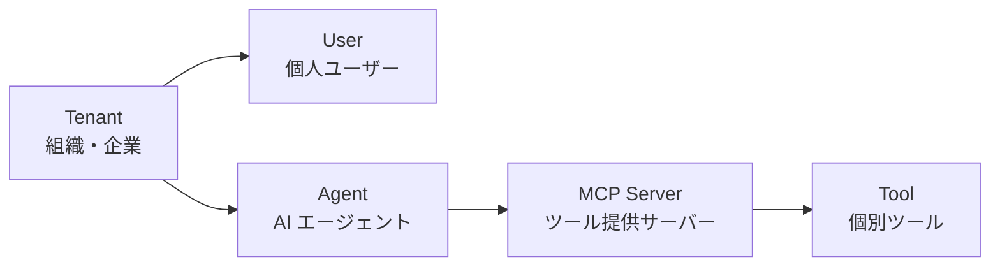
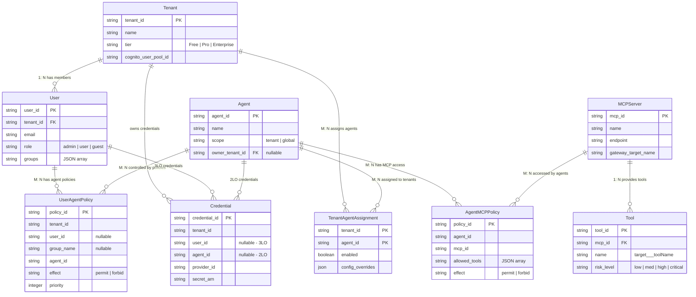
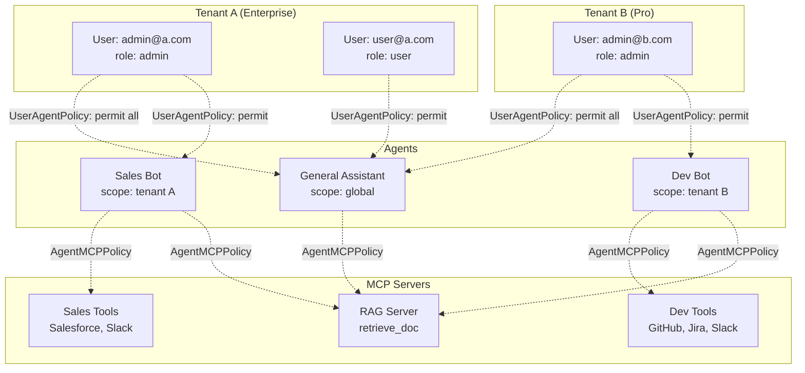

## 6. エンティティ関係設計と DynamoDB Single Table Design

前章までで 4 層 Defense in Depth の各レイヤーを解説しました。本章では、これらの認可判定を支える**データモデル**に焦点を当てます。AI Agent の認証認可では、Tenant（テナント）、User（ユーザー）、Agent（AI エージェント）、MCP Server、Tool という 5 つのエンティティが複雑な M: N 関係を形成します。この関係をどうモデル化し、DynamoDB でどう表現するかが、スケーラブルな認可基盤の鍵です。

### 6.1 5 つの主要エンティティ

まず、認証認可に関わる 5 つのエンティティとその役割を整理します。



#### Tenant（テナント）

マルチテナント SaaS におけるデータ分離の**最上位境界**です。組織や企業に対応し、プラン（Free / Pro / Enterprise）によってアクセスできる機能が異なります。

| 属性 | 型 | 説明 |
|------|-----|------|
| `tenant_id` | String (PK) | テナント一意識別子 |
| `name` | String | テナント名（組織名） |
| `tier` | Enum | Free / Pro / Enterprise |
| `cognito_user_pool_id` | String | 紐づく Cognito User Pool ID |

`tenant_id` は STS AssumeRole のセッションタグとして伝播され、S3 ABAC や Memory のテナント分離に使用されます。

#### User（ユーザー）

テナントに所属する個人です。Cognito の認証主体（Principal）として機能し、JWT カスタムクレームの `role` と `groups` に基づいて認可判定が行われます。

| 属性 | 型 | 説明 |
|------|-----|------|
| `user_id` | String (PK) | ユーザー一意識別子（Cognito sub） |
| `tenant_id` | String (FK) | 所属テナント |
| `email` | String | メールアドレス |
| `role` | Enum | admin / user / guest |
| `groups` | List[String] | 所属グループ一覧 |

`role` は Cedar ポリシーの `principal.getTag("role")` でアクセスされ、`groups` はグループベースのポリシー評価に使用されます。

#### Agent（AI エージェント）

AI エージェントの定義です。**テナント固有**（特定テナント専用）と**グローバル**（複数テナントで共有）の 2 種類があります。

| 属性 | 型 | 説明 |
|------|-----|------|
| `agent_id` | String (PK) | エージェント一意識別子 |
| `name` | String | エージェント名 |
| `scope` | Enum | tenant（固有） / global（共有） |
| `owner_tenant_id` | String (nullable) | 所有テナント（global の場合は null） |

`scope` 属性により、「全テナントに提供する汎用アシスタント」と「特定テナント専用の営業ボット」の双方をモデル化できます。

#### MCP Server（MCP サーバー）

ツール群を提供する MCP サーバーです。AgentCore Gateway のターゲットとして登録されます。

| 属性 | 型 | 説明 |
|------|-----|------|
| `mcp_id` | String (PK) | MCP サーバー一意識別子 |
| `name` | String | サーバー名 |
| `endpoint` | String | 接続エンドポイント URL |
| `gateway_target_name` | String | AgentCore Gateway ターゲット名 |

`gateway_target_name` は Interceptor のスコープ形式（`{RESOURCE_SERVER_ID}/{TARGET_NAME}`）で使用されます。

#### Tool（ツール）

MCP サーバーが提供する個別のツールです。FGAC の**最小制御単位**であり、Cedar ポリシーのアクション定義に直接対応します。

| 属性 | 型 | 説明 |
|------|-----|------|
| `tool_id` | String (PK) | ツール一意識別子 |
| `mcp_id` | String (FK) | 所属 MCP サーバー |
| `name` | String | ツール名（`{target}___{toolName}` 形式） |
| `risk_level` | Enum | low / medium / high / critical |

ツール名の `{target}___{toolName}` 形式は AgentCore Gateway の命名規則であり、Cedar ポリシーでは `AgentCore::Action::"rag-server___retrieve_doc"` のように指定します。

### 6.2 M: N 関係の設計

5 つのエンティティ間の関係は以下のとおりです。1: N 関係は外部キーで表現できますが、M: N 関係には**中間テーブル**が必要です。

```
Tenant ─── 1: N ──── User
  |                   |
  | M: N               | M: N
  |                   |
  v                   v
Agent ─── M: N ──── MCP Server ─── 1: N ──── Tool
```

#### 1: N 関係（中間テーブル不要）

- **Tenant -> User**: 1 テナントに複数ユーザーが所属。User テーブルの `tenant_id` 外部キーで表現
- **MCP Server -> Tool**: 1 つの MCP サーバーが複数ツールを提供。Tool テーブルの `mcp_id` 外部キーで表現

#### M: N 関係（中間テーブルが必要）

3 つの M: N 関係に対して、それぞれ**認可ポリシーを兼ねた中間テーブル**を設計します。単なるリレーションテーブルではなく、アクセス制御の属性を持つ点がポイントです。

**[1] TenantAgentAssignment（Tenant <-> Agent）**

テナントへのエージェント割り当てを管理します。グローバルエージェントは複数テナントに割り当てられるため、M: N 関係が発生します。

| 属性 | 型 | 説明 |
|------|-----|------|
| `tenant_id` | String (PK) | テナント ID |
| `agent_id` | String (PK) | エージェント ID |
| `enabled` | Boolean | このテナントでの有効/無効 |
| `config_overrides` | JSON | テナント固有の設定上書き |

**[2] UserAgentPolicy（User <-> Agent）**

第 1 章の 4 層チェックフローにおける「チェック 1: User -> Agent 認可」に対応します。ユーザー個人またはグループ単位で、どのエージェントを利用できるかを定義します。

| 属性 | 型 | 説明 |
|------|-----|------|
| `policy_id` | String (PK) | ポリシー ID |
| `tenant_id` | String | テナント ID（スコープ制限） |
| `user_id` | String (nullable) | ユーザー ID（個人ポリシー） |
| `group_name` | String (nullable) | グループ名（グループポリシー） |
| `agent_id` | String | 対象エージェント ID |
| `effect` | Enum | permit / forbid |
| `priority` | Integer | 評価優先度 |

`user_id` と `group_name` の一方を指定する設計により、個人ポリシー（UserAgentPolicy）とグループポリシー（GroupAgentPolicy）の両方を 1 つのテーブルで表現できます。`effect` フィールドは Cedar の `permit` / `forbid` に直接対応します。

**[3] AgentMCPPolicy（Agent <-> MCP Server）**

「チェック 2: Agent -> MCP 認可」に対応します。エージェントがどの MCP サーバーのどのツールを利用できるかを定義します。

| 属性 | 型 | 説明 |
|------|-----|------|
| `policy_id` | String (PK) | ポリシー ID |
| `agent_id` | String | エージェント ID |
| `mcp_id` | String | MCP サーバー ID |
| `allowed_tools` | List[String] | 許可ツール一覧（`*` で全許可） |
| `denied_tools` | List[String] | 明示的な拒否ツール一覧 |
| `effect` | Enum | permit / forbid |

`allowed_tools` にツール名のリストを格納し、`*` で全ツール許可を表現します。Cedar ポリシーの `action in [AgentCore::Action::"target___tool1", ...]` に変換される設計です。

さらに、認証情報を管理する **Credential** テーブルも認可判定に不可欠です。

**[4] Credential（認証情報）**

「チェック 4: 認証情報確認」に対応します。3LO（ユーザー管理型）と 2LO（サービス管理型）の両方をカバーします。

| 属性 | 型 | 説明 |
|------|-----|------|
| `credential_id` | String (PK) | 認証情報 ID |
| `tenant_id` | String | テナント ID |
| `user_id` | String (nullable) | ユーザー ID（3LO の場合） |
| `agent_id` | String (nullable) | エージェント ID（2LO の場合） |
| `provider_id` | String | 外部サービス識別子（slack, github 等） |
| `secret_arn` | String | Secrets Manager の ARN |

`user_id` が設定されていれば 3LO（ユーザー管理型）、`agent_id` が設定されていれば 2LO（サービス管理型）として機能します。

### 6.3 ER 図

全エンティティの関係を ER 図で表現します。



この ER 図の特徴は、**中間テーブルが認可ポリシーを兼ねている**点です。TenantAgentAssignment はエージェントの割り当て管理、UserAgentPolicy はユーザー -> エージェント認可、AgentMCPPolicy はエージェント -> MCP 認可を、それぞれデータモデルとして表現しています。

#### マルチテナント環境でのデータフロー

具体的なシナリオで M: N 関係がどう機能するかを見てみます。



このシナリオでは:

- **General Assistant**（global）は Tenant A と Tenant B の両方に割り当てられ、RAG Server のみ利用可能
- **Sales Bot**（tenant A 固有）は Sales Tools と RAG Server を利用可能だが、Tenant B のユーザーはアクセス不可
- **Dev Bot**（tenant B 固有）は Dev Tools と RAG Server を利用可能だが、Tenant A のユーザーはアクセス不可

### 6.4 DynamoDB Single Table Design

5 つのエンティティと 4 つの中間テーブル / 認証情報テーブルを、**1 つの DynamoDB テーブル**に集約します。Single Table Design により、認可判定に必要なデータを最小限のクエリ数で取得できます。

#### メインテーブル: AuthPolicyTable

パーティションキー（PK）とソートキー（SK）の組み合わせで、全エンティティを表現します。

| PK | SK | 格納データ |
|-----|-----|----------|
| `TENANT#{tenant_id}` | `METADATA` | テナント情報（name, tier） |
| `TENANT#{tenant_id}` | `USER#{user_id}` | ユーザー情報（email, role, groups） |
| `TENANT#{tenant_id}` | `AGENT_ASSIGN#{agent_id}` | エージェント割り当て（enabled, config） |
| `TENANT#{tenant_id}` | `CREDENTIAL#{credential_id}` | 認証情報（provider_id, secret_arn） |
| `AGENT#{agent_id}` | `METADATA` | エージェント情報（name, scope） |
| `AGENT#{agent_id}` | `MCP_POLICY#{mcp_id}` | MCP ポリシー（allowed_tools, effect） |
| `MCP#{mcp_id}` | `METADATA` | MCP サーバー情報（name, endpoint） |
| `MCP#{mcp_id}` | `TOOL#{tool_id}` | ツール情報（name, risk_level） |
| `POLICY#{policy_id}` | `USER_AGENT` | ユーザー-エージェントポリシー |

設計のポイントは以下の 3 点です。

**テナント分離**: `TENANT#` プレフィックスのパーティションに、ユーザー、エージェント割り当て、認証情報をまとめることで、テナント単位のデータアクセスが 1 つの PK で完結します。

**エージェント中心のクエリ**: `AGENT#` プレフィックスのパーティションに MCP ポリシーを格納し、エージェントの MCP 認可判定（L3）が `begins_with` クエリで効率的に実行できます。

**MCP サーバー中心のクエリ**: `MCP#` プレフィックスのパーティションにツール情報を格納し、ツール存在確認（チェック 3）が高速に実行できます。

#### GSI（Global Secondary Index）設計

M: N 関係の**逆方向のクエリ**を効率的に実行するため、3 つの GSI を設定します。

| GSI | PK | SK | 用途 |
|-----|-----|-----|------|
| GSI1 | `agent_id` | `tenant_id` | エージェントが割り当てられている全テナントの取得 |
| GSI2 | `user_id` | `agent_id` | ユーザーの全 Agent ポリシーの取得（L2 評価のメインクエリ） |
| GSI3 | `mcp_id` | `tool_id` | MCP サーバーの全ツール取得 |

GSI2 が最も重要で、L2（User -> Agent 認可）の判定時に使用されます。ユーザーがツール呼び出しをリクエストした際、`GSI2: PK=user_id, SK=agent_id` で即座に認可判定が可能です。

:::message
**マルチテナント環境での注意**: GSI2 でクエリする際、`user_id` だけでなく `tenant_id` による追加フィルタリングが必要です。これにより、同じ `user_id` を持つ別テナントのデータが混入することを防ぎます。

```python
# GSI2 クエリ時の tenant_id フィルタリング例
response = table.query(
    IndexName="GSI2",
    KeyConditionExpression="user_id = :uid",
    FilterExpression="tenant_id = :tid",  # 追加フィルタ
    ExpressionAttributeValues={
        ":uid": user_id,
        ":tid": tenant_id  # JWT の custom:tenant_id から取得
    }
)
```

`tenant_id` は JWT の `custom:tenant_id` クレームから取得し、クエリ時に必ず照合してください。
:::

#### 容量見積もり

テナント規模別のアイテム数概算です。

| テナント規模 | ユーザー数 | Agent 数 | MCP 数 | ツール数 | ポリシー数 | 月間コスト目安 |
|------------|----------|---------|--------|---------|----------|-------------|
| Small (Free) | ~10 | 2-3 | 1-2 | ~10 | ~30 | ~$1 |
| Medium (Pro) | ~100 | 5-10 | 3-5 | ~50 | ~500 | ~$5 |
| Large (Enterprise) | ~1,000 | 10-50 | 10-20 | ~200 | ~10,000 | ~$25 |

DynamoDB のオンデマンドキャパシティモードでは、Small テナントのコストはほぼ無視できるレベルです。Large テナントでもポリシーデータのサイズは小さいため、コスト面での懸念は低いです。

### 6.5 ポリシー評価順序と DynamoDB クエリの対応

4 層 Defense in Depth の各レイヤーが、DynamoDB のどのクエリを実行するかを対応表にまとめます。

| レイヤー | 認可判定の内容 | DynamoDB クエリ |
|---------|-------------|---------------|
| **L1**: Tenant-Level | テナントが有効か? | `PK=TENANT#{tid}, SK=METADATA` |
| **L1**: Tenant-Level | エージェントがテナントに割り当てられているか? | `PK=TENANT#{tid}, SK=AGENT_ASSIGN#{aid}` |
| **L2**: User-Level | ユーザーがエージェントを利用できるか? | `GSI2: PK=user_id, SK=agent_id` |
| **L3**: Agent-Level | エージェントが MCP ツールを利用できるか? | `PK=AGENT#{aid}, SK=MCP_POLICY#{mid}` |
| **L3**: Agent-Level | 指定されたツールが MCP サーバーに存在するか? | `PK=MCP#{mid}, SK=TOOL#{tid}` |
| **L4**: Tool-Level | ユーザーの外部サービス認証情報が存在するか?（3LO） | `PK=TENANT#{tid}, SK begins_with CREDENTIAL#`, filter `user_id` |
| **L4**: Tool-Level | エージェントの外部サービス認証情報が存在するか?（2LO） | `PK=TENANT#{tid}, SK begins_with CREDENTIAL#`, filter `agent_id` |

:::message
L1 と L2 の認可判定は、実際には Pre Token Generation Lambda の段階で DynamoDB を参照し、JWT カスタムクレームに結果を埋め込みます。そのため、リクエスト時の L1/L2 評価では DynamoDB への直接クエリは不要で、JWT のクレームのみで判定できます。DynamoDB クエリが発生するのは JWT 発行時（認証時）のみです。
:::

この設計により、**認可判定のホットパス**（リクエストごとに実行される L1-L3 の評価）では DynamoDB クエリを最小限に抑えつつ、**管理操作**（ポリシー追加・変更）は Single Table Design の柔軟性を活用できます。L4 の認証情報確認のみがリクエスト時に Secrets Manager へのアクセスを必要としますが、これは実際のツール実行時にのみ発生するため、パフォーマンスへの影響は限定的です。
