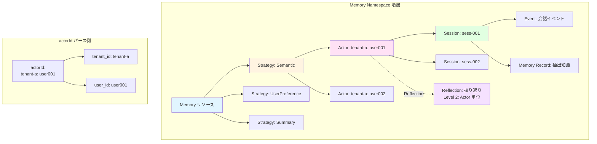

<!-- prettier-ignore-start -->
## 7. AgentCore Memory の権限制御

AI Agent が会話のコンテキストやユーザーの嗜好を「記憶」する機能は、パーソナライズされた体験を提供するうえで不可欠です。しかし、この記憶データ（Memory）は個人情報を含みうるため、適切なアクセス制御が求められます。

本章では、AgentCore Memory の Namespace 階層を起点に、IAM Condition Keys、Cedar ポリシー、Interceptor を組み合わせた **Memory 専用の 4 層防御** を設計します。

---

### 7.1 Memory の Namespace 階層

AgentCore Memory は以下の階層構造で組織化されています。



上図の左側は Memory の階層構造を、右側は actorId の命名規則とパース方法を示しています。

- **Memory リソース**: テナントごとに作成（推奨）
- **Strategy**: 4 種類（Semantic / UserPreference / Summary / Episodic）
- **Actor**: テナント + ユーザーの組み合わせ（命名規則: `{tenant_id}: {user_id}`）
- **Session**: Actor の個別会話
- **Reflection**: Episodic Memory の振り返りデータ（Actor 単位で保存）

この階層は **Namespace パス** としてアクセス制御に利用できます。

| レベル | Namespace パス | 粒度 | 用途 |
|--------|---------------|------|------|
| Level 1（最細粒度） | `/strategies/{strategyId}/actors/{actorId}/sessions/{sessionId}` | セッション単位 | 1 会話内の記憶 |
| Level 2 | `/strategies/{strategyId}/actors/{actorId}` | Actor 単位 | ユーザーの全記憶 |
| Level 3 | `/strategies/{strategyId}` | Strategy 単位 | 戦略ごとの全記憶 |
| Level 4（Global） | `/` | 全体 | Memory 全体 |

Memory Strategy は用途別に 4 種類が提供されています。

| Strategy | 機能 |
|----------|------|
| Semantic Memory | 事実・知識の抽出 |
| User Preference Memory | ユーザーの好みの抽出 |
| Summary Memory | 会話要約の生成 |
| Episodic Memory | 経験からの学習（Reflection 機能あり） |

Episodic Memory の Reflection（振り返り）データは Level 2（Actor 単位）に配置されます。セッションを跨いだ学習結果であるため、個別セッションより浅い階層で管理されるという点に留意してください。

:::message
AgentCore はセッションとユーザーのマッピングを強制しません（"AgentCore does not enforce session-to-user mappings"）。actorId と sessionId をどのユーザーに紐づけるかは、**アプリケーション側の責任** です。この設計判断は、後述するテナント分離に大きく影響します。
:::

---

### 7.2 IAM Condition Keys による細粒度制御

AgentCore Memory は IAM ポリシーの Condition Keys で細粒度のアクセス制御が可能です。まず、利用可能な Condition Keys を整理します。

| Condition Key | 型 | 対象アクション | 用途 |
|--------------|-----|-------------|------|
| `bedrock-agentcore: namespace` | String | BatchCreateMemoryRecords, BatchUpdateMemoryRecords, ListMemoryRecords, RetrieveMemoryRecords | Namespace パスによるフィルタリング |
| `bedrock-agentcore: strategyId` | String | ListMemoryRecords, RetrieveMemoryRecords, StartMemoryExtractionJob | Strategy 単位の制御 |
| `bedrock-agentcore: sessionId` | String | CreateEvent, DeleteEvent, GetEvent, ListEvents, StartMemoryExtractionJob | Session 単位の制御 |
| `bedrock-agentcore: actorId` | String | CreateEvent, DeleteEvent, GetEvent, ListEvents, ListSessions, StartMemoryExtractionJob | Actor 単位の制御 |
| `bedrock-agentcore: KmsKeyArn` | String | CreateMemory | 暗号化キーの指定 |
| `aws: ResourceTag/${TagKey}` | String | Memory リソース操作全般 | タグベースの制御 |

:::message
[検証済み] 上記の Condition Keys は AWS IAM Service Authorization Reference で実在性を確認済みです（2026-02-19）。
:::

#### 追加の有用な Condition Keys

Memory 操作以外にも、JWT クレームベースの細粒度制御が可能です。

| Condition Key | 型 | 用途 |
|--------------|-----|------|
| `bedrock-agentcore: userid` | String | User ID でアクセスをフィルタ |
| `bedrock-agentcore: InboundJwtClaim/iss` | String | JWT issuer でフィルタ（発行者検証） |
| `bedrock-agentcore: InboundJwtClaim/sub` | String | JWT subject でフィルタ（ユーザー ID） |
| `bedrock-agentcore: InboundJwtClaim/aud` | String | JWT audience でフィルタ（対象クライアント） |
| `bedrock-agentcore: InboundJwtClaim/scope` | String | JWT scope でフィルタ（OAuth スコープ） |
| `bedrock-agentcore: InboundJwtClaim/client_id` | String | JWT client_id でフィルタ（クライアント識別） |

`InboundJwtClaim/*` ファミリーは、Gateway が受信した JWT のクレームを直接 IAM Condition として利用できる強力な機能です。MCP 認証との統合で有用です。

注目すべきは、**Condition Key ごとに対象アクションが異なる** 点です。例えば `namespace` は Memory Record 操作には使えますが、Event 操作には使えません。Event 操作には `actorId` と `sessionId` を使います。

この対応関係をまとめると、以下のようになります。

| 操作カテゴリ | 主要アクション | 利用可能な Condition Key | 推奨権限設計 |
|------------|--------------|------------------------|------------|
| Event 操作 | CreateEvent, GetEvent, ListEvents | `actorId`, `sessionId` | 自ユーザーのセッションのみ |
| Event 削除 | DeleteEvent | `actorId`, `sessionId` | Admin のみ |
| Memory Record 読み取り | ListMemoryRecords, RetrieveMemoryRecords | `namespace`, `strategyId` | 自テナント + 自ユーザー Namespace |
| Memory Record 書き込み | BatchCreateMemoryRecords, BatchUpdateMemoryRecords | `namespace` | 自ユーザー Namespace のみ |
| Memory Record 削除 | BatchDeleteMemoryRecords, DeleteMemoryRecord | - | Admin のみ |
| 抽出ジョブ | StartMemoryExtractionJob | `strategyId`, `actorId`, `sessionId` | 自ユーザーのセッションのみ |

#### Namespace ベースのアクセス制限

特定ユーザーの Namespace 配下のみ読み書きを許可する IAM ポリシー例です。

::::details Namespace 制約の IAM ポリシー実装例

```json
{
  "Version": "2012-10-17",
  "Statement": [
    {
      "Sid": "AllowMemoryRecordAccessByNamespace",
      "Effect": "Allow",
      "Action": [
        "bedrock-agentcore: ListMemoryRecords",
        "bedrock-agentcore: RetrieveMemoryRecords",
        "bedrock-agentcore: BatchCreateMemoryRecords",
        "bedrock-agentcore: BatchUpdateMemoryRecords"
      ],
      "Resource": "arn:aws:bedrock-agentcore:us-east-1:123456789012: memory/*",
      "Condition": {
        "StringLike": {
          "bedrock-agentcore: namespace": "/strategies/*/actors/actor-user001/*"
        }
      }
    }
  ]
}
```

::::

`StringLike` を使ってワイルドカードマッチすることで、特定 Actor 配下の全 Strategy・全 Session にアクセスを許可しています。

---

### 7.3 テナント分離: リソースタグ + STS セッションタグ

Memory のテナント分離には 2 つのパターンがあります。

| パターン | 概要 | テナント分離の強度 | 管理コスト |
|---------|------|----------------|----------|
| **パターン A（推奨）** | テナントごとに Memory リソースを作成 | 高（リソースレベル分離） | テナント数に比例 |
| **パターン B** | 共有 Memory + actorId 命名規則で分離 | 中（IAM + アプリ層依存） | 低 |

#### パターン A: テナントごとの Memory リソース分離（推奨）

テナントごとに専用の Memory リソースを作成し、リソースタグでテナントを識別します。

```
Tenant-A → arn:aws:bedrock-agentcore:us-east-1:123456789012: memory/mem-tenantA
             タグ: tenant_id=tenant-a

Tenant-B → arn:aws:bedrock-agentcore:us-east-1:123456789012: memory/mem-tenantB
             タグ: tenant_id=tenant-b
```

さらに、actorId の命名規則を統一します。

```python
def get_actor_id(tenant_id: str, user_id: str) -> str:
    """一貫した actorId 生成"""
    return f"{tenant_id}: {user_id}"

# 例: tenant-a: user-001
```

この命名規則により、actorId からテナント境界を判定できるようになります。

#### STS セッションタグによる動的なテナント分離

ユーザー認証後に STS AssumeRole でセッションタグを付与し、IAM ポリシーの Condition で照合する方法です。これにより、テナントごとに別々の IAM ポリシーを作成する必要がなくなります。

```python
import boto3

sts = boto3.client("sts")

response = sts.assume_role(
    RoleArn="arn:aws:iam::123456789012: role/AgentCoreMemoryRole",
    RoleSessionName=f"tenant-{tenant_id}-user-{user_id}",
    Tags=[
        {"Key": "tenant_id", "Value": tenant_id},
        {"Key": "user_id", "Value": user_id},
    ],
)
```

#### Trust Policy での `sts:TagSession` 許可（CRITICAL）

STS セッションタグを使用する場合、AssumeRole を実行する呼び出し元（Lambda 実行ロール等）の Trust Policy に **`sts:TagSession` アクションを明示的に許可する必要があります**。この設定がないと、以下のエラーで AssumeRole が失敗します。

```
AccessDenied: User: arn:aws:sts::123456789012: assumed-role/LambdaExecutionRole/...
is not authorized to perform: sts:TagSession on resource: arn:aws:iam::123456789012: role/AgentCoreMemoryRole
```

Trust Policy の正しい設定例を示します。

```json
{
  "Version": "2012-10-17",
  "Statement": [
    {
      "Effect": "Allow",
      "Principal": {
        "AWS": "arn:aws:iam::123456789012: role/LambdaExecutionRole"
      },
      "Action": [
        "sts: AssumeRole",
        "sts:TagSession"
      ]
    }
  ]
}
```

`sts:TagSession` を欠いた場合、AssumeRole の呼び出し自体が拒否されるため、テナント分離の仕組み全体が機能しなくなります。ABAC 設計においては、この Trust Policy の設定が前提条件となります。

:::message alert
`sts:TagSession` は AssumeRole される**ターゲットロール**（AgentCoreMemoryRole）の Trust Policy で、呼び出し元（Lambda 実行ロール等）を Principal として許可する必要があります。呼び出し元ロールの Identity-Based Policy に `sts: AssumeRole` を許可するだけでは不十分です。ターゲットロールの Trust Policy で `sts:TagSession` アクションが明示的に許可されていない場合、セッションタグ付きの AssumeRole は拒否されます。

加えて、呼び出し元ロールの Identity-Based Policy にも `sts: AssumeRole` と `sts:TagSession` の許可が必要です（IAM では Trust Policy と Identity-Based Policy の両方が Allow でなければアクセスは許可されません）。
:::

::::details STS セッションタグを使った ABAC ポリシーの完全な実装例

対応する IAM ポリシーでは、`${aws: PrincipalTag/...}` を使ってセッションタグの値を動的に参照します。

```json
{
  "Version": "2012-10-17",
  "Statement": [
    {
      "Sid": "AllowMemoryAccessBySessionTag",
      "Effect": "Allow",
      "Action": [
        "bedrock-agentcore: ListMemoryRecords",
        "bedrock-agentcore: RetrieveMemoryRecords",
        "bedrock-agentcore: BatchCreateMemoryRecords"
      ],
      "Resource": "arn:aws:bedrock-agentcore:us-east-1:123456789012: memory/*",
      "Condition": {
        "StringEquals": {
          "aws: ResourceTag/tenant_id": "${aws: PrincipalTag/tenant_id}"
        }
      }
    },
    {
      "Sid": "AllowEventAccessBySessionTag",
      "Effect": "Allow",
      "Action": [
        "bedrock-agentcore: CreateEvent",
        "bedrock-agentcore: GetEvent",
        "bedrock-agentcore: ListEvents"
      ],
      "Resource": "arn:aws:bedrock-agentcore:us-east-1:123456789012: memory/*",
      "Condition": {
        "StringEquals": {
          "aws: ResourceTag/tenant_id": "${aws: PrincipalTag/tenant_id}"
        },
        "StringLike": {
          "bedrock-agentcore: actorId": "${aws: PrincipalTag/tenant_id}: ${aws: PrincipalTag/user_id}"
        }
      }
    }
  ]
}
```

このポリシーのポイントは 2 つあります。

1. **Memory Record 操作**: `aws: ResourceTag/tenant_id` と `aws: PrincipalTag/tenant_id` の一致を要求 -- 自テナントの Memory リソースのみアクセス可能
2. **Event 操作**: 上記に加え、`bedrock-agentcore: actorId` がセッションタグの `tenant_id: user_id` と一致することを要求 -- 自分自身のイベントのみ操作可能

::::

さらに、Cross-Tenant アクセスを明示的に拒否する Deny ポリシーを追加します。

::::details Cross-Tenant アクセスを拒否する Deny ポリシー

```json
{
  "Version": "2012-10-17",
  "Statement": [
    {
      "Sid": "DenyCrossTenantMemoryAccess",
      "Effect": "Deny",
      "Action": "bedrock-agentcore: *",
      "Resource": "arn:aws:bedrock-agentcore:*:123456789012: memory/*",
      "Condition": {
        "StringNotEquals": {
          "aws: ResourceTag/tenant_id": "${aws: PrincipalTag/tenant_id}"
        }
      }
    }
  ]
}
```

::::

IAM の評価ロジックでは **Deny は常に Allow より優先** されるため、たとえ他のポリシーで Allow が付与されていても、テナント ID が一致しなければアクセスは拒否されます。

---

### 7.4 Cedar ポリシーとの統合（Memory 操作ツールの認可）

IAM ポリシーは AWS API レベルのアクセス制御を担当しますが、MCP ツールとして公開された Memory 操作（`search_memory`, `store_memory` 等）の認可は **Cedar ポリシー**（AgentCore Policy）で制御します。

::::details Memory ツール用の Cedar ポリシー実装例

#### Admin: Memory の全操作ツールを許可

```cedar
permit (
  principal is AgentCore::OAuthUser,
  action in [
    AgentCore::Action::"mcp-target___search_memory",
    AgentCore::Action::"mcp-target___store_memory",
    AgentCore::Action::"mcp-target___delete_memory"
  ],
  resource == AgentCore::Gateway::"arn:aws:bedrock-agentcore:us-east-1:123456789012: gateway/gw-001"
)
when {
  principal.hasTag("role") &&
  principal.getTag("role") == "admin"
};
```

#### 一般ユーザー: Memory の検索のみ許可

```cedar
permit (
  principal is AgentCore::OAuthUser,
  action == AgentCore::Action::"mcp-target___search_memory",
  resource == AgentCore::Gateway::"arn:aws:bedrock-agentcore:us-east-1:123456789012: gateway/gw-001"
)
when {
  principal.hasTag("role") &&
  principal.getTag("role") == "user"
};
```

#### テナント別の Cedar ポリシー

テナントごとに別の Cedar ポリシーを定義することで、Gateway レベルでのテナント分離も可能です。

```cedar
permit (
  principal is AgentCore::OAuthUser,
  action in [
    AgentCore::Action::"mcp-target___search_memory",
    AgentCore::Action::"mcp-target___store_memory"
  ],
  resource == AgentCore::Gateway::"arn:aws:bedrock-agentcore:us-east-1:123456789012: gateway/gw-001"
)
when {
  principal.hasTag("tenant_id") &&
  principal.getTag("tenant_id") == "tenant-a" &&
  principal.hasTag("role") &&
  (principal.getTag("role") == "admin" || principal.getTag("role") == "user")
};
```

::::

Cedar ポリシーは JWT のカスタムクレームを `principal.hasTag()` / `principal.getTag()` で参照します。第 4 章で解説した PartiallyAuthorizeActions 機能により、`tools/list` の結果から権限のないツールが自動除外されるため、一般ユーザーには `delete_memory` ツールが見えなくなります。

ただし、Cedar ポリシーだけでは **ツール呼び出し時のパラメータ（actorId 等）を検証できません**。Cedar が判定するのは「このツールを呼び出せるか」であり、「このパラメータで呼び出してよいか」は判定範囲外です。パラメータレベルの検証は、次節の Interceptor で行います。

---

### 7.5 Interceptor による動的 Memory アクセス制御

Gateway Interceptor（Request Lambda）を使うと、**ツール呼び出しのパラメータを検査** してテナント境界やユーザー境界を動的に検証できます。

::::details Memory Interceptor の実装例（テナント・ユーザー境界チェック）

```python
def lambda_handler(event, context):
    mcp = event.get("mcp", {})
    req = mcp.get("gatewayRequest", {})
    body = req.get("body", {})
    headers = req.get("headers", {})

    # JWT からテナント情報を取得
    token = headers.get("Authorization", "").replace("Bearer ", "")
    claims = verify_jwt_signature(token)
    tenant_id = claims.get("tenant_id")
    user_id = claims.get("sub")

    method = body.get("method", "")
    tool_name = extract_tool_name(body)

    if method == "tools/call" and tool_name in [
        "search_memory", "store_memory", "delete_memory"
    ]:
        # ツールの引数から対象 actorId を取得
        params = body.get("params", {})
        arguments = params.get("arguments", {})
        target_actor_id = arguments.get("actor_id", "")

        # テナント境界チェック
        if not target_actor_id.startswith(f"{tenant_id}: "):
            return build_error_response(
                "Cross-tenant memory access denied", body
            )

        # ユーザー境界チェック（一般ユーザーは自分の記憶のみ）
        role = claims.get("role", "user")
        expected_actor_id = f"{tenant_id}: {user_id}"
        if role != "admin" and target_actor_id != expected_actor_id:
            return build_error_response(
                "Access to other user's memory denied", body
            )

    return build_pass_through(body)
```

::::

この Interceptor が行う検証は 2 段階です。

1. **テナント境界チェック**: `target_actor_id` が `{tenant_id}: ` で始まるか確認。異なるテナントの actorId を指定した場合は 403 を返却
2. **ユーザー境界チェック**: 一般ユーザーの場合、`target_actor_id` が自分の actorId と一致するか確認。Admin は全ユーザーの記憶にアクセス可能

#### Memory の 4 層防御まとめ

Memory アクセスに対する 4 層防御の全体像は以下の通りです。

```
Layer 1: Inbound Authorization（Gateway 入口）
  JWT の tenant_id / role を検証
  → テナントレベルの Gate
  |
  v
Layer 2: AgentCore Policy（Cedar）
  ロールベースの Memory ツール使用許可
  → ツールレベルの FGAC
  |
  v
Layer 3: Gateway Interceptor（Lambda）
  actorId パラメータのテナント境界/ユーザー境界を検証
  → パラメータレベルの動的検証
  |
  v
Layer 4: IAM ポリシー
  Condition Keys (namespace, actorId, sessionId) + ResourceTag による制御
  → AWS リソースレベルの最終防衛線
```

| 層 | 制御対象 | 制御粒度 | 実装方法 |
|----|---------|---------|---------|
| Layer 1 | Gateway アクセス | テナント単位 | JWT customClaims |
| Layer 2 | ツール呼び出し | ロール x ツール | Cedar ポリシー |
| Layer 3 | リクエストパラメータ | ユーザー x actorId | Interceptor Lambda |
| Layer 4 | AWS リソースアクセス | Namespace / Actor / Session | IAM Condition Keys |

各層は独立して動作するため、1 つの層が突破されても次の層で防御できます。

---

### 7.6 GDPR 対応の削除リクエスト処理

Memory に保存されたデータは個人情報を含む可能性があるため、GDPR（一般データ保護規則）等のデータ保護規制への対応が必要です。AgentCore Memory の短期記憶と長期記憶では、削除の仕組みが大きく異なります。

#### 短期記憶（Events）の自動削除

Events には `eventExpiryDuration` パラメータ（1 日 - 365 日）を設定でき、AWS 側が自動的に削除します。コンプライアンス要件に合わせた保持期間を設定しておけば、追加の実装は不要です。

#### 長期記憶（Memory Records）の手動削除

Memory Records には**自動削除機能がありません**。ユーザーからの削除リクエストに対応するには、以下の手順で手動削除する必要があります。

1. 削除リクエストを受領し、DynamoDB 等で管理
2. 対象ユーザーの actorId を特定
3. `ListEvents` + `DeleteEvent` で短期記憶を削除
4. `ListMemoryRecords` + `DeleteMemoryRecord` で長期記憶を削除
5. 削除完了を監査ログに記録

この削除処理専用の IAM ポリシーを用意します。

::::details GDPR データ削除用の IAM ポリシー

```json
{
  "Version": "2012-10-17",
  "Statement": [
    {
      "Sid": "GDPRDataDeletionPolicy",
      "Effect": "Allow",
      "Action": [
        "bedrock-agentcore: ListMemoryRecords",
        "bedrock-agentcore: DeleteMemoryRecord",
        "bedrock-agentcore: BatchDeleteMemoryRecords",
        "bedrock-agentcore: ListEvents",
        "bedrock-agentcore: DeleteEvent"
      ],
      "Resource": "arn:aws:bedrock-agentcore:*:123456789012: memory/*",
      "Condition": {
        "StringEquals": {
          "aws: PrincipalTag/role": "gdpr-processor"
        }
      }
    }
  ]
}
```

::::

`gdpr-processor` ロールを持つ専用の処理プロセスのみが削除権限を持つ設計です。一般ユーザーや Agent には削除権限を付与しません。

:::message alert
`BatchDeleteMemoryRecords` API は存在しますが、削除対象のレコード ID を個別に指定する必要があります。大量のレコードを一括削除するには、`ListMemoryRecords` で対象を列挙してからバッチ処理するワークフローが必要です。
:::

#### 監査ログの記録

Memory 操作の監査は 3 層で構成します。

1. **AWS CloudTrail**: `bedrock-agentcore: CreateEvent`, `DeleteMemoryRecord` 等の API 呼び出しを自動記録
2. **Gateway Interceptor**: ツール呼び出しのカスタムログ（テナント ID、ユーザー ID、対象 actorId、認可結果）
3. **アプリケーション監査ログ**: GDPR 削除リクエストの処理記録

```python
import json
import logging

logger = logging.getLogger()
logger.setLevel(logging.INFO)


def log_memory_access(claims, tool_name, arguments, authorized):
    """Memory 操作の監査ログ"""
    log_entry = {
        "event_type": "memory_access",
        "tenant_id": claims.get("tenant_id"),
        "user_id": claims.get("sub"),
        "role": claims.get("role"),
        "tool_name": tool_name,
        "target_actor_id": arguments.get("actor_id"),
        "authorized": authorized,
    }
    logger.info(json.dumps(log_entry))
```

:::message
Request Interceptor で拒否した場合、AgentCore Gateway の CloudWatch Logs には記録されません。Interceptor 内で明示的に監査ログを出力する設計が重要です。
:::

---

### 実装例

本章で解説した GDPR 対応の長期記憶削除ワークフローの実装例は、bedrock-agentcore-cookbook で公開しています。

- **GDPR Right to Erasure 対応記憶削除ワークフロー**: [examples/12-gdpr-memory-deletion/](https://github.com/littlemex/bedrock-agentcore-cookbook/tree/main/examples/12-gdpr-memory-deletion)
  - BatchDeleteMemoryRecords API によるバッチ削除
  - GDPR Processor IAM ロール（削除のみ許可）
  - 削除完了検証と JSON 監査ログ
  - 削除証明書の自動生成
  - E2E テストスクリプト付き

---

### 本章のまとめ

AgentCore Memory の権限制御で押さえるべきポイントは以下の 5 つです。

1. **Namespace 階層を理解する**: 4 レベルの Namespace パスが IAM Condition Key `namespace` で制御できる
2. **Condition Key ごとに対象アクションが異なる**: Event 操作は `actorId` + `sessionId`、Memory Record 操作は `namespace` + `strategyId` で制御する
3. **テナント分離は Memory リソース分離 + タグベース ABAC**: STS セッションタグの `${aws: PrincipalTag/...}` を活用して動的にテナントを判定する
4. **Cedar + Interceptor の役割分担**: Cedar はツールレベルの FGAC、Interceptor はパラメータレベルの動的検証を担当する
5. **GDPR 対応**: 短期記憶は `eventExpiryDuration` で自動削除、長期記憶は専用ロール（`gdpr-processor`）による手動削除が必須

特に、actorId の命名規則（`{tenant_id}: {user_id}`）は設計の初期段階で決定すべきです。この命名規則がテナント境界の判定ロジックの基盤となるため、後から変更するのは困難です。
<!-- prettier-ignore-end -->
