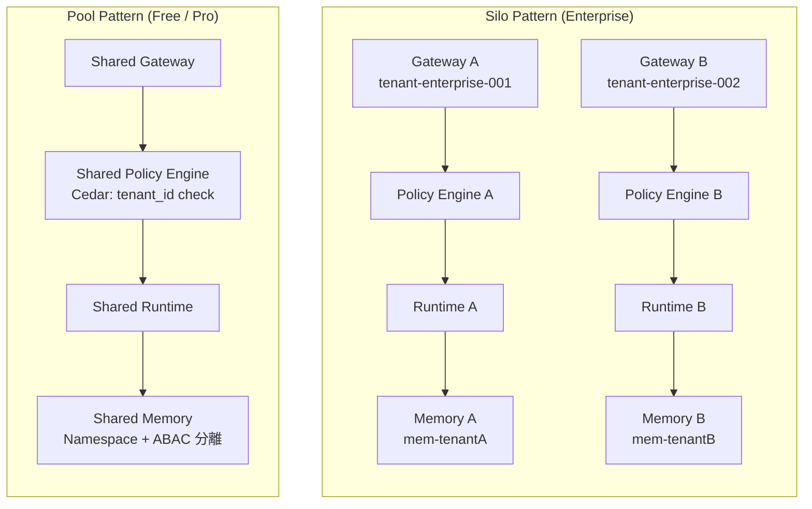
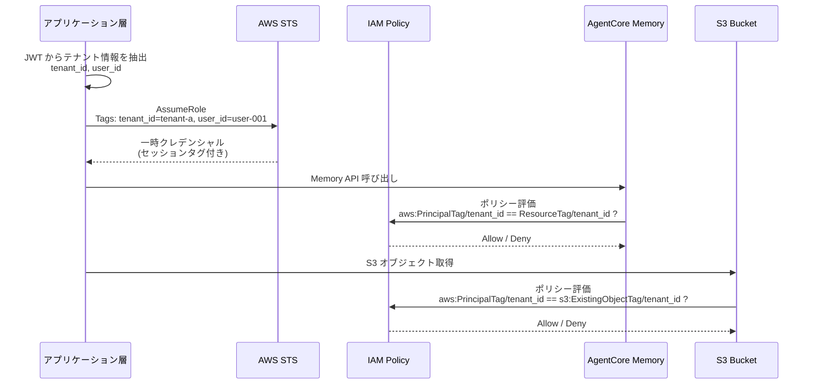

## 8. マルチテナント対応

ここまでの章で、4 層 Defense in Depth、エンティティ関係設計、Memory 権限制御を解説してきました。本章では、これらの設計をマルチテナント SaaS 環境にどう適用するかを掘り下げます。

マルチテナント環境における最大の設計課題は**テナント間のデータ分離**です。あるテナントのユーザーが別テナントのデータ、エージェント、Memory にアクセスできてしまえば、設計全体が破綻します。

### 8.1 テナント分離パターン: Silo / Pool / Bridge

AgentCore 環境でのテナント分離には、3 つの基本パターンがあります。



**Silo パターン**は、テナントごとに Gateway、Policy Engine、Runtime、Memory を完全に分離します。Enterprise テナント向けの最も安全な構成です。テナント間でリソースが一切共有されないため、ノイジーネイバー問題も発生しません。一方、テナント数に比例してインフラコストと管理負荷が増大します。

**Pool パターン**は、すべてのテナントが同一の Gateway、Runtime を共有し、Cedar ポリシーと IAM の Condition Keys でテナント分離を実現します。コスト効率が高く管理も容易ですが、ポリシー設計の不備がテナント間のデータ漏洩に直結するリスクがあります。

**Bridge パターン**は両者の中間で、Gateway は共有しつつ Memory リソースやデータストアをテナントごとに分離する構成です。

| パターン | 構成 | 適用規模 | セキュリティ | コスト | 管理負荷 |
|---------|------|---------|------------|--------|---------|
| **Silo** | テナント専用 Gateway + Runtime + Memory | Enterprise | 最高（完全分離） | 高 | 大 |
| **Pool** | 共有インフラ + ポリシー分離 | Free / Pro | 高（ポリシー依存） | 低 | 小 |
| **Bridge** | 共有 Gateway + テナント専用 Memory | Pro / Enterprise | 高 | 中 | 中 |

:::message
**推奨アプローチ**: Free / Pro テナントは Pool パターンで開始し、Enterprise 要件が出た時点で Silo パターンに移行するのが現実的です。最初から Silo で設計すると、テナント数が少ない段階でのコストが過大になります。ただし、Pool パターンを採用する場合は**セッションタグ伝播を最初から設計に組み込む**ことが重要です。後からテナント分離を追加するのは、データモデルの変更を伴うため困難です。
:::

### 8.2 Cognito User Pool 設計（共有 vs テナント専用）

テナント分離パターンの選択は、Cognito User Pool の設計にも影響します。

#### 共有 User Pool パターン（Free / Pro 向け）

Pool / Bridge パターンでは、全テナントのユーザーを 1 つの Cognito User Pool で管理します。テナント識別は **Pre Token Generation Lambda** による JWT カスタムクレームの注入で実現します。

```
Cognito User Pool (共有)
  |
  |- Resource Server: agentcore-demo
  |    |- Scope: rag-server（全ツール）
  |    |- Scope: rag-server: retrieve_doc（特定ツール）
  |
  |- Pre Token Generation Lambda
  |    |- DynamoDB から tenant_id, role, groups を取得
  |    |- JWT カスタムクレームに注入
  |
  |- App Client: streamlit-app
       |- Allowed OAuth Flows: Authorization Code
       |- Allowed Scopes: openid, profile, agentcore-demo/*
```

Pre Token Generation Lambda は、ユーザーのメールアドレスを DynamoDB の AuthPolicyTable と照合し、テナント情報をトークンに注入します。

```python
import json
import os

import boto3

dynamodb = boto3.resource("dynamodb")
table = dynamodb.Table(os.environ["AUTH_POLICY_TABLE"])


def lambda_handler(event, context):
    """Cognito Pre Token Generation Lambda V2"""
    email = event["request"]["userAttributes"].get("email", "")

    # DynamoDB からユーザーのテナント・ロール情報を取得
    user_info = lookup_user_by_email(email)

    if not user_info:
        # 未登録ユーザーは guest として扱う
        user_info = {"tenant_id": "unknown", "role": "guest", "groups": []}

    # JWT のカスタムクレームを構築
    claims_to_add = {
        "tenant_id": user_info["tenant_id"],
        "role": user_info["role"],
        "groups": json.dumps(user_info.get("groups", [])),
    }

    event["response"] = {
        "claimsAndScopeOverrideDetails": {
            "accessTokenGeneration": {
                "claimsToAddOrOverride": claims_to_add,
            }
        }
    }
    return event


def lookup_user_by_email(email):
    """AuthPolicyTable から email でユーザーを検索"""
    # GSI を使った検索（email -> tenant_id, role）
    response = table.query(
        IndexName="GSI-Email",
        KeyConditionExpression="email = : email",
        ExpressionAttributeValues={": email": email},
        Limit=1,
    )
    items = response.get("Items", [])
    return items[0] if items else None
```

**共有 User Pool パターンのメリット**:

- 管理する User Pool が 1 つだけで済む
- ユーザー登録・パスワードリセット等の運用フローが統一される
- コスト効率が良い（Cognito の MAU 課金がテナント横断で計算される）

**共有 User Pool パターンのデメリット**:

- テナントごとのパスワードポリシーや MFA 設定を変えられない
- 外部 IdP（SAML / OIDC）連携がテナント固有の要件に対応しにくい
- Pre Token Generation Lambda の不具合が全テナントに影響する

#### テナント専用 User Pool パターン（Enterprise 向け）

Silo パターンでは、テナントごとに専用の Cognito User Pool を作成します。

```
Tenant A User Pool
  |- 独自のドメイン設定
  |- 独自の MFA ポリシー（TOTP 必須）
  |- 独自のパスワードポリシー（16 文字以上）

Tenant B User Pool
  |- 独自のドメイン設定
  |- SAML 連携（Azure AD）
  |- 独自のセッション有効期限
```

Enterprise テナントは自社の IdP（Azure AD、Okta 等）との SAML / OIDC 連携を求めるケースが多く、テナント専用 User Pool はこの要件に自然に対応できます。

| 観点 | 共有 User Pool | テナント専用 User Pool |
|------|-------------|------------------|
| 適用パターン | Pool / Bridge | Silo |
| テナント数 | 多数（数百~） | 少数（数十以下） |
| IdP 連携 | 共通設定のみ | テナント固有の SAML / OIDC |
| MFA / パスワードポリシー | 全テナント共通 | テナントごとにカスタマイズ可 |
| 管理負荷 | 低 | 高（User Pool 数に比例） |
| 障害影響範囲 | 全テナント | 該当テナントのみ |

### 8.3 STS セッションタグによるコンテキスト伝播

マルチテナント環境では、認証後に取得したテナント情報を後続のサービス呼び出しに伝播する仕組みが不可欠です。AWS STS の**セッションタグ**がこの役割を担います。

#### セッションタグとは

STS AssumeRole の呼び出し時にキーバリューペアのタグを付与し、取得した一時クレデンシャルにテナント・ユーザーのコンテキストを埋め込む仕組みです。このタグは IAM ポリシーの Condition 句で `${aws:PrincipalTag/タグ名}` として参照できます。



#### 実装例

```python
import boto3

sts = boto3.client("sts")


def assume_tenant_role(tenant_id, user_id, role_name="AgentCoreMemoryRole"):
    """テナント・ユーザーコンテキストを持つ一時クレデンシャルを取得"""
    response = sts.assume_role(
        RoleArn=f"arn:aws:iam::123456789012:role/{role_name}",
        RoleSessionName=f"tenant-{tenant_id}-user-{user_id}",
        Tags=[
            {"Key": "tenant_id", "Value": tenant_id},
            {"Key": "user_id", "Value": user_id},
        ],
    )
    return response["Credentials"]
```

この一時クレデンシャルを使って AgentCore Memory や S3 にアクセスすると、IAM ポリシーの Condition 句で自動的にテナント境界が適用されます。

:::message alert
セッションタグの伝播はアーキテクチャの早い段階で設計に組み込んでください。後から追加する場合、AssumeRole の呼び出し箇所すべてにタグ付与のコードを追加する必要があり、既存データにもタグ付けが必要になります。
:::

#### セッションタグと 4 層防御の関係

セッションタグは、4 層 Defense in Depth の各層で異なる形でテナント分離に貢献します。

| 層 | テナント分離の手段 | セッションタグの役割 |
|----|----------------|-----------------|
| L1: Lambda Authorizer | JWT の tenant_id クレーム検証 | 不使用（JWT 直接参照） |
| L2: Cedar Policy | principal.getTag("tenant_id") | JWT クレームが Cedar タグにマッピング |
| L3: Interceptor | JWT デコード + パラメータ検証 | 不使用（JWT 直接参照） |
| L4: IAM (Memory, S3) | `aws:PrincipalTag/tenant_id` Condition | **セッションタグが IAM ポリシーで評価される** |

L1-L3 は JWT のカスタムクレームを直接参照しますが、L4 の IAM レベルでは STS セッションタグが必要です。これは、AgentCore Runtime が AWS API を呼び出す際に JWT ではなく IAM クレデンシャルが使われるためです。

### 8.4 S3 ABAC によるリソース分離

AI Agent がファイル（PDF、Excel 等）を扱うケースでは、S3 上のファイルもテナント単位で分離する必要があります。S3 の **ABAC（Attribute-Based Access Control）** は、オブジェクトタグとセッションタグを照合することで、テナント分離を IAM ポリシーレベルで実現します。

#### 仕組み

1. S3 オブジェクトにタグを付与: `tenant_id=tenant-a`
2. STS AssumeRole でセッションタグを付与: `tenant_id=tenant-a`
3. IAM ポリシーの Condition で両者を照合

```json
{
  "Version": "2012-10-17",
  "Statement": [
    {
      "Sid": "AllowTenantS3Access",
      "Effect": "Allow",
      "Action": ["s3:GetObject", "s3:PutObject"],
      "Resource": "arn:aws:s3:::agent-files-bucket/*",
      "Condition": {
        "StringEquals": {
          "s3:ExistingObjectTag/tenant_id": "${aws:PrincipalTag/tenant_id}"
        }
      }
    },
    {
      "Sid": "RequireTenantTagOnUpload",
      "Effect": "Allow",
      "Action": "s3:PutObject",
      "Resource": "arn:aws:s3:::agent-files-bucket/*",
      "Condition": {
        "StringEquals": {
          "s3:RequestObjectTag/tenant_id": "${aws:PrincipalTag/tenant_id}"
        }
      }
    }
  ]
}
```

最初の Statement は「自テナントのタグが付いたオブジェクトのみ読み書き可能」、2 番目の Statement は「アップロード時に自テナントのタグを必ず付与する」ことを強制します。

これにより、仮にアプリケーション層にバグがあって他テナントのオブジェクトキーを指定しても、IAM レベルでアクセスが拒否されます。

:::message alert
**セキュリティ上の重要な注意**: S3 ABAC パターンでは、`s3:PutObjectTagging` 権限を持つユーザーがオブジェクトタグ（`tenant_id`）を書き換えることで、Cross-Tenant アクセスが可能になるリスクがあります。

対策として、以下のいずれかを実施してください：

1. **タグ変更を明示的に拒否**（推奨）:
```json
{
  "Sid": "DenyTagModification",
  "Effect": "Deny",
  "Action": ["s3:PutObjectTagging", "s3:DeleteObjectTagging"],
  "Resource": "arn:aws:s3:::agent-files-bucket/*"
}
```

2. **S3 Object Lock でタグを不変化**: Object Lock の Compliance Mode でタグを保護

3. **監査ログで検知**: CloudTrail で `PutObjectTagging` API 呼び出しを監視し、異常なタグ変更を検知

通常、ユーザーには `s3:GetObject` のみ付与し、Admin ロールのみ `s3:PutObject` を許可します。`s3:PutObjectTagging` は特権操作として厳密に管理してください。
:::

#### S3 ABAC と Agent のファイル処理方式

第 5 章の 4 層アーキテクチャで解説した外部サービス認証（Layer 4）は、S3 上のファイル処理にも適用されます。

| ファイル処理方式 | 認可タイミング | S3 ABAC の適用 |
|--------------|-------------|--------------|
| 直接 S3 アクセス（IAM ロール経由） | エージェント実行時 | セッションタグで制御 |
| Presigned URL 経由 | URL 生成時 | URL 生成元の IAM ロールで制御 |
| Bedrock InputFile API | S3 アクセス時 | Bedrock 実行ロールで制御 |
| MCP Resources | Tool 実行時 | Gateway Interceptor + ABAC |

### 8.5 Cedar ポリシーによるテナント制御

第 4 章で解説した AgentCore Policy（Cedar ポリシー）は、テナント分離にも活用できます。JWT に含まれる `tenant_id` カスタムクレームは、Cedar ポリシーでは `principal.getTag("tenant_id")` として参照できます。

#### テナント固有のツール制御

```cedar
// Tenant-A の admin: 全ツール許可
permit (
  principal is AgentCore::OAuthUser,
  action,
  resource == AgentCore::Gateway::"arn:aws:bedrock-agentcore:us-east-1:123456789012:gateway/gw-001"
)
when {
  principal.hasTag("tenant_id") &&
  principal.getTag("tenant_id") == "tenant-a" &&
  principal.hasTag("role") &&
  principal.getTag("role") == "admin"
};

// Tenant-A の user: retrieve_doc のみ
permit (
  principal is AgentCore::OAuthUser,
  action == AgentCore::Action::"rag-server___retrieve_doc",
  resource == AgentCore::Gateway::"arn:aws:bedrock-agentcore:us-east-1:123456789012:gateway/gw-001"
)
when {
  principal.hasTag("tenant_id") &&
  principal.getTag("tenant_id") == "tenant-a" &&
  principal.hasTag("role") &&
  principal.getTag("role") == "user"
};
```

#### Pool パターンでのマルチテナント Cedar 設計

Pool パターン（共有 Gateway）では、1 つの Policy Engine に複数テナントのポリシーを定義します。テナントごとにポリシーを追加していくため、テナント数の増加に伴ってポリシー数が増加する点に注意が必要です。

```
Policy Engine (共有)
  |- Policy: Tenant-A Admin (全ツール許可)
  |- Policy: Tenant-A User (retrieve_doc のみ)
  |- Policy: Tenant-B Admin (全ツール許可)
  |- Policy: Tenant-B User (retrieve_doc + search_memory)
  |- ...
```

テナント数が多い場合やテナント固有のルールが複雑な場合は、Cedar ポリシーだけでは冗長になる可能性があります。その場合は Gateway Interceptor と DynamoDB を組み合わせた動的な認可チェック（第 5 章 Layer 3 を参照）が有効です。

:::message
**Pool パターンでのレート制限設計**: Pool パターン（共有 Gateway / Runtime）では、1 テナントが共有リソースを使い尽くすことで他テナントに影響を与える Noisy Neighbor 問題が発生します。

対策として、以下のレート制限を実装してください：

1. **API Gateway レベルのレート制限**:
   - Usage Plan で `tenant_id` 別に Quota / Throttle を設定
   - API Key を `tenant_id` 単位で発行し、個別にレート制限

2. **Lambda Authorizer でのカスタムレート制限**:
   - DynamoDB または ElastiCache で `tenant_id` 別のリクエストカウンタを管理
   - 制限超過時は HTTP 429（Too Many Requests）を返却

3. **DynamoDB のスループット分離**:
   - GSI2（`tenant_id-user_id-index`）で tenant_id 別にパーティションを分離
   - 1 テナントの大量クエリが他テナントに影響しないよう On-Demand モードを使用

4. **Memory API の名前空間分離**:
   - `bedrock-agentcore:namespace` Condition Key でテナント別に Memory を分離
   - 1 テナントのストレージ使用量が他テナントに影響しないよう監視

レート制限は Pool パターンの運用において**必須の対策**です。初期実装から組み込んでください。
:::

#### 推奨: テナント非依存ユニバーサルポリシーパターン

上記のテナント固有ポリシーでは、テナント数 N x ロール数 R = O(N x R) のポリシーが必要になり、テナント増加に伴ってポリシーが爆発的に増加します。これを回避するために、`tenant_id` の**値**ではなく**存在**のみを検証するユニバーサルポリシーを推奨します。

```cedar
// ユニバーサル Admin ポリシー: 全テナント共通
// tenant_id の「値」ではなく「存在」のみを検証
permit (
  principal is AgentCore::OAuthUser,
  action,
  resource == AgentCore::Gateway::"arn:aws:bedrock-agentcore:us-east-1:123456789012:gateway/gw-001"
)
when {
  principal.hasTag("tenant_id") &&
  principal.hasTag("role") &&
  principal.getTag("role") == "admin"
};

// ユニバーサル User ポリシー: 全テナント共通
permit (
  principal is AgentCore::OAuthUser,
  action == AgentCore::Action::"rag-server___retrieve_doc",
  resource == AgentCore::Gateway::"arn:aws:bedrock-agentcore:us-east-1:123456789012:gateway/gw-001"
)
when {
  principal.hasTag("tenant_id") &&
  principal.hasTag("role") &&
  principal.getTag("role") == "user"
};
```

このパターンでは、ポリシー数がロール数 R のみに依存し O(R) に削減されます。テナント間のデータ分離は Cedar ポリシーではなく、Layer 3（Gateway Interceptor の Memory テナント境界チェック）および Layer 4（IAM ABAC のセッションタグ）で担保します。

:::message
ユニバーサルポリシーパターンでは、Cedar 層はロール x ツールの認可のみを担当し、テナント分離は他の層に委譲します。Cedar 層でテナント分離も行いたい場合は、テナント固有ポリシーを使用してください。どちらのパターンでも、Layer 3 / Layer 4 でのテナント境界チェックは必須です。
:::

#### Silo パターンでのテナント制御

Silo パターンではテナントごとに Gateway と Policy Engine が分離されるため、Cedar ポリシーに `tenant_id` の条件を含める必要はありません。テナント分離はインフラ層で保証され、Cedar ポリシーはロール・ツールの制御に専念できます。

```cedar
// Silo パターン: tenant_id チェック不要
// テナント専用 Gateway の Policy Engine に定義
permit (
  principal is AgentCore::OAuthUser,
  action,
  resource == AgentCore::Gateway::"arn:aws:bedrock-agentcore:us-east-1:123456789012:gateway/gw-tenant-a"
)
when {
  principal.hasTag("role") &&
  principal.getTag("role") == "admin"
};
```

#### パターン選択のまとめ

| 要件 | Pool + Cedar | Pool + Interceptor | Silo |
|------|------------|-------------------|------|
| シンプルなロールベース制御 | 最適 | 過剰 | 過剰 |
| テナント固有の複雑なルール | 冗長 | 最適 | 最適 |
| テナント数が 100 以上 | 管理困難 | 最適 | コスト高 |
| 完全なデータ分離の要求 | ポリシー依存 | ポリシー依存 | 最適 |
| SAML / 外部 IdP 連携が必須 | 困難 | 困難 | 最適 |

Pool パターンで開始する場合でも、DynamoDB のパーティションキーにテナント ID を含め、セッションタグ伝播を最初から組み込んでおけば、後から Silo パターンへの移行が容易になります。第 6 章の DynamoDB Single Table Design（`TENANT#{tenant_id}` をパーティションキーに使用する設計）は、この段階的移行を見据えたものです。

---

### 実装例

本章で解説したマルチテナント設計パターンの実装例は、bedrock-agentcore-cookbook で公開しています。

- **S3 オブジェクトタグベースの ABAC パターン**: [examples/11-s3-abac/](https://github.com/littlemex/bedrock-agentcore-cookbook/tree/main/examples/11-s3-abac)
  - `s3:ExistingObjectTag/tenant_id` と `aws:PrincipalTag/tenant_id` の照合
  - Tenant A/B の 2 テナントでマルチテナント分離を実証
  - クロステナントアクセス拒否の検証
  - E2E テストスクリプト付き

- **Memory ResourceTag ABAC パターン**: [examples/15-memory-resource-tag-abac/](https://github.com/littlemex/bedrock-agentcore-cookbook/tree/main/examples/15-memory-resource-tag-abac)
  - `aws:ResourceTag/tenant_id` Condition Key の検証
  - Null Condition テスト（タグなしリソースへのアクセス拒否）
  - S3 ABAC パターンとの比較
