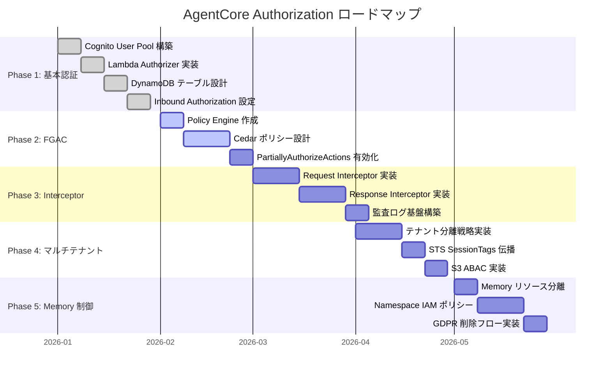

## 9. 実装ロードマップとコスト見積もり

ここまでの章で、AI Agent の認証認可設計を 4 層 Defense in Depth アーキテクチャとして体系的に整理しました。しかし、これらの全てを一度に実装する必要はありません。本章では、段階的な導入計画とコスト見通しを示します。

### 9.1 Phase 1-5 の段階的導入

以下の 5 つの Phase で、認可の粒度を段階的に細かくしていきます。各 Phase は前の Phase の成果の上に構築されるため、順序通りに進めることを推奨します。



上図は各 Phase の実装順序と所要期間の目安を示しています。実際のスケジュールはチームのリソースと要件の複雑さに応じて調整してください。

**重要な依存関係**:

- Phase 2 は Phase 1 の JWT カスタムクレーム設定が前提
- Phase 3 は Phase 2 の Cedar ポリシーと組み合わせて効果を発揮
- Phase 4 のテナント分離は Phase 1-3 のすべてに影響
- Phase 5 は Phase 1-4 の完成後に統合

---

#### Phase 1: 基本認証（Cognito + Inbound Authorization）

**目的**: 最小限の認証基盤を構築し、テナントレベルのアクセス制御を実現する。

**実装内容**:

- Amazon Cognito User Pool の構築
  - Resource Server 定義（スコープ設計）
  - App Client 作成（Authorization Code + PKCE）
- Pre Token Generation Lambda
  - DynamoDB から `tenant_id`、`role` を取得
  - JWT カスタムクレームに注入
- Amazon API Gateway（HTTP API）
  - ストリーム統合対応（最大 900 秒タイムアウト）
  - Lambda Authorizer で JWT 検証 + `tenant_id` チェック
- DynamoDB テーブル作成
  - AuthPolicyTable（Single Table Design）
  - GSI 設計

**アウトプット**: テナント認証済みユーザーが AgentCore Gateway にアクセスできる状態。Layer 1（Inbound Authorization）が機能し、未認証リクエストや不正なテナントからのアクセスがブロックされる。

:::message
Phase 1 だけでも「認証されたユーザーのみが Agent を利用できる」という基本的なセキュリティは確保できます。まずはここから始めて、運用しながら次の Phase に進むことを推奨します。
:::

---

#### Phase 2: ツール単位 FGAC（Policy Engine + Cedar）

**目的**: Cedar ポリシーによるツール単位のアクセス制御を実装する。

**実装内容**:

- AgentCore Policy Engine の作成
  - `LOG_ONLY` モードでテスト開始 -> `ENFORCE` モードに移行
  - Cedar ポリシー定義（ロール別ツール許可）
- AgentCore Gateway に Policy Engine を関連付け
  - Inbound Authorization の `customClaims` 設定
  - PartiallyAuthorizeActions の有効化
- Cedar ポリシーの設計
  - Admin: 全ツール許可
  - User: 特定ツールのみ許可（例: `retrieve_doc`、`search_memory`）
  - Guest: 読み取りツールのみ
- CDK による IaC 化
  - `AwsCustomResource` で Policy Engine 作成
  - `CreatePolicy` API で Cedar ポリシー登録

**アウトプット**: ユーザーのロールに応じて利用可能なツールが自動的に制限される状態。`tools/list` の結果にも PartiallyAuthorizeActions が適用され、ユーザーは自分が使えるツールのみを確認できる。

---

#### Phase 3: カスタム認可（Gateway Interceptor）

**目的**: 外部 DB 連携やパラメータレベルの認可チェックを実装する。

**実装内容**:

- Request Interceptor Lambda
  - JWT デコードと追加クレーム検証
  - Memory ツールのテナント境界チェック（`actorId` の検証）
  - 外部 DB（DynamoDB）からの動的権限取得
- Response Interceptor Lambda
  - `tools/list` + Semantic Search 結果のフィルタリング
  - PII 除去ロジック（必要に応じて）
- 監査ログの実装
  - Interceptor 内のカスタムログ出力
  - CloudWatch Logs への構造化ログ記録

**アウトプット**: パラメータレベルの動的認可とレスポンスフィルタリングが機能する状態。Cedar ポリシーだけではカバーできない入力パラメータの検証（例: Memory の `actorId` がリクエストユーザーのテナントに属するか）が実現される。

:::message alert
Request Interceptor で拒否した場合、AgentCore Gateway の CloudWatch Logs にはリクエストが記録されません。監査要件がある場合は、Interceptor Lambda 内で独自の監査ログを出力してください。
:::

---

#### Phase 4: マルチテナント対応

**目的**: テナント分離を実装し、複数テナントの安全な運用を実現する。

**実装内容**:

- テナント分離戦略の適用
  - Free / Pro: Pool 戦略（共有 Gateway + Cedar ポリシー分離）
  - Enterprise: Silo 戦略（テナント専用 Gateway + Runtime）
- STS AssumeRole + セッションタグ伝播
  - `tenant_id`、`user_id` をセッションタグとして伝播
  - S3 ABAC によるリソース分離（オブジェクトタグとセッションタグの照合）
- Cognito User Pool 設計の拡張
  - 共有 Pool（Free / Pro）vs テナント専用 Pool（Enterprise）
  - SAML / OIDC フェデレーション対応
- DynamoDB データ分離の強化
  - パーティションキー `TENANT#{tenant_id}` によるテナント分離の確認
  - GSI クエリのテナントスコープ制限

**アウトプット**: 複数テナントが安全に分離された状態で運用可能。Enterprise テナントは専用の Gateway / Runtime / Memory を持ち、Free / Pro テナントは共有インフラ上で Cedar ポリシーにより分離される。

---

#### Phase 5: Memory 権限制御

**目的**: AgentCore Memory のアクセス制御を 4 層防御で実装する。

**実装内容**:

- テナント別 Memory リソース作成
  - Memory リソースにテナントタグ（`tenant_id`）を付与
  - IAM ポリシーで `aws: ResourceTag/tenant_id` ベースのアクセス制御
- Namespace ベースの IAM ポリシー
  - `actorId` の命名規則: `{tenant_id}: {user_id}`
  - `sessionId` の命名規則: `{tenant_id}: {user_id}: {timestamp}`
  - IAM Condition Key `bedrock-agentcore: namespace` によるアクセス制限
- Cedar ポリシーで Memory ツールの FGAC
  - `search_memory`、`store_memory`、`delete_memory` の権限制御
  - Admin は全操作、User は検索のみ
- Interceptor で動的 Memory アクセス制御
  - `actorId` のテナント境界チェック
  - ユーザー間の分離チェック（一般ユーザーは自分の記憶のみ）
- GDPR 対応の削除リクエスト処理
  - 短期記憶: `eventExpiryDuration` 設定（1 日 - 365 日）
  - 長期記憶: `ListMemoryRecords` + `DeleteMemoryRecord` のバッチ処理
  - 明示的な Cross-Tenant Deny ポリシー

**アウトプット**: Memory アクセスが 4 層防御（Inbound Auth -> Cedar Policy -> Interceptor -> IAM Condition Keys）で保護される状態。GDPR 対応の削除フローが運用可能。

### 9.2 各 Phase のアウトプット一覧

| Phase | 主な成果物 | 対応する防御層 |
|-------|-----------|-------------|
| Phase 1 | Cognito User Pool, Lambda Authorizer, DynamoDB テーブル, API Gateway | L1: Inbound Authorization |
| Phase 2 | Policy Engine, Cedar ポリシー定義, CDK テンプレート | L2: AgentCore Policy |
| Phase 3 | Request / Response Interceptor Lambda, 監査ログ基盤 | L3: Gateway Interceptor |
| Phase 4 | テナント分離設定, STS セッションタグ, S3 ABAC ポリシー | L1-L3 のマルチテナント拡張 |
| Phase 5 | Memory IAM ポリシー, Namespace 設計, GDPR 削除フロー | L4: Memory IAM + 全層統合 |

### 9.3 コスト見積もり

以下のコスト見積もりは、認証認可基盤に関わる AWS サービスのみを対象としています。AgentCore Gateway、Runtime、Memory 自体の利用料金は AWS の料金体系に従い、別途発生します。

**共通前提**:

- リージョン: us-east-1
- Agent の平均ツール呼び出し回数: 5 回 / セッション
- 月間セッション数: ユーザー数 x 20 セッション / 月
- 価格は 2026 年 2 月時点の目安

#### 小規模（約 100 ユーザー）

| サービス | 月間利用量 | 月額概算 (USD) |
|---------|-----------|--------------|
| Cognito User Pool | 100 MAU | 無料枠内 |
| API Gateway (HTTP API) | 10,000 リクエスト | ~$0.01 |
| Lambda (Authorizer + Interceptor) | 30,000 呼び出し | ~$1 |
| DynamoDB (On-demand) | 100K RCU / 50K WCU | ~$2 |
| Secrets Manager | 50 シークレット x 100K API 呼び出し | ~$25 |
| AgentCore Gateway | 10,000 リクエスト | サービス料金に含む |
| AgentCore Runtime | 2,000 セッション | サービス料金に含む |
| AgentCore Memory | 1 Memory リソース | サービス料金に含む |
| **合計** | | **約 $30-50 / 月** + AgentCore 利用料 |

#### 中規模（約 1,000 ユーザー）

| サービス | 月間利用量 | 月額概算 (USD) |
|---------|-----------|--------------|
| Cognito User Pool | 1,000 MAU | ~$50 |
| API Gateway (HTTP API) | 100,000 リクエスト | ~$0.10 |
| Lambda (Authorizer + Interceptor) | 300,000 呼び出し | ~$10 |
| DynamoDB (On-demand) | 1M RCU / 500K WCU | ~$20 |
| Secrets Manager | 200 シークレット x 1M API 呼び出し | ~$100 |
| ElastiCache (cache.t3.micro) | 1 ノード | ~$15 |
| **合計** | | **約 $200-300 / 月** + AgentCore 利用料 |

#### 大規模（約 10,000 ユーザー）

| サービス | 月間利用量 | 月額概算 (USD) |
|---------|-----------|--------------|
| Cognito User Pool | 10,000 MAU | ~$500 |
| API Gateway (HTTP API) | 1,000,000 リクエスト | ~$1 |
| Lambda (Authorizer + Interceptor) | 3,000,000 呼び出し | ~$50 |
| DynamoDB (On-demand) | 10M RCU / 5M WCU | ~$200 |
| Secrets Manager | 1,000 シークレット x 10M API 呼び出し | ~$500 |
| ElastiCache (cache.r6g.large) | 2 ノード（HA 構成） | ~$300 |
| **合計** | | **約 $1,500-2,000 / 月** + AgentCore 利用料 |

:::message
コスト構造の特徴として、Secrets Manager の API 呼び出しコストが比較的大きな割合を占めます。これはユーザー数 x プロバイダー数 x ツール呼び出し回数でトークン取得が発生するためです。キャッシュレイヤー（ElastiCache / Lambda メモリキャッシュ）の導入により、Secrets Manager への API 呼び出し回数を大幅に削減できます。
:::

---

### 9.4 セキュリティ脅威モデリング

本アーキテクチャに対する主要な脅威を STRIDE モデルで分析します。

#### Spoofing（なりすまし）

| 脅威 | 攻撃シナリオ | 対策レイヤー | 緩和策 |
|------|-------------|-------------|--------|
| JWT トークン偽造 | 攻撃者が偽の Access Token を作成 | Lambda Authorizer (L1) | JWKS による署名検証、`exp` / `client_id` クレーム検証 |
| Cognito User Pool 侵害 | 認証情報の漏洩によるアカウント乗っ取り | 外部（IdP） | MFA 強制、パスワードポリシー強化 |
| Cross-Tenant なりすまし | テナント A のユーザーがテナント B のロールを主張 | Pre Token Lambda | DynamoDB AuthPolicyTable で email → tenant_id を厳密に照合 |

#### Tampering（改ざん）

| 脅威 | 攻撃シナリオ | 対策レイヤー | 緩和策 |
|------|-------------|-------------|--------|
| JWT クレーム改ざん | `custom:tenant_id` や `role` を書き換え | Lambda Authorizer (L1) | 署名検証により改ざんを検知（RS256） |
| MCP Protocol 改ざん | `tools/call` リクエストの `toolName` を書き換え | Request Interceptor (L3) | JWT 検証後に `toolName` を再抽出し Cedar で検証 |
| IAM Policy 改ざん | AssumeRole 時の Session Tags を偽装 | IAM ABAC (L4) | IAM Policy の Condition Key で `aws:RequestTag` と `aws:PrincipalTag` を照合 |

#### Repudiation（否認）

| 脅威 | 攻撃シナリオ | 対策レイヤー | 緩和策 |
|------|-------------|-------------|--------|
| ツール呼び出し履歴の否認 | 「自分は呼び出していない」と主張 | 監査ログ | CloudTrail / CloudWatch Logs に `sub` / `tenant_id` を記録 |
| Memory 記録の削除の否認 | GDPR 削除要求の実行記録がない | Memory API (L2) | `BatchDeleteMemoryRecords` の実行ログを CloudTrail で保管 |

#### Information Disclosure（情報漏洩）

| 脅威 | 攻撃シナリオ | 対策レイヤー | 緩和策 |
|------|-------------|-------------|--------|
| Response Interceptor Fail-Open | JWT 検証失敗時に全ツールリストが公開される | Response Interceptor (L3) | Fail-Closed 設計: 検証失敗時は `{"tools": []}` を返却 |
| Cross-Tenant Memory リーク | テナント A がテナント B の Memory を取得 | IAM ABAC (L4) | `bedrock-agentcore:namespace` Condition Key で名前空間を分離 |
| S3 Cross-Tenant アクセス | テナント A がテナント B の S3 オブジェクトを取得 | IAM ABAC (L4) | `s3:ExistingObjectTag/tenant_id` と `aws:PrincipalTag/tenant_id` を照合 |

#### Denial of Service（サービス拒否）

| 脅威 | 攻撃シナリオ | 対策レイヤー | 緩和策 |
|------|-------------|-------------|--------|
| Lambda Authorizer 過負荷 | 大量の不正リクエストで Authorizer をダウンさせる | API Gateway | WAF Rate Limiting, Lambda 同時実行数制限 |
| Cedar Policy 過負荷 | 複雑なポリシーで評価時間が長期化 | AgentCore Policy (L2) | ポリシーサイズ制限（5MB）、評価タイムアウト設定 |
| Memory API 過負荷 | 1 テナントが Memory ストレージを使い尽くす | Memory API (L2) | DynamoDB Throughput 分離（GSI2 で tenant_id 別に管理）|

#### Elevation of Privilege（権限昇格）

| 脅威 | 攻撃シナリオ | 対策レイヤー | 緩和策 |
|------|-------------|-------------|--------|
| Cedar Policy Bypass | `permit` ルールの条件式の脆弱性を突く | AgentCore Policy (L2) | 最小権限の原則、`forbid` ルールで明示的拒否 |
| IAM Role 横取り | 別テナントの IAM Role を AssumeRole | IAM ABAC (L4) | Trust Policy で External ID 検証、`sts:ExternalId` Condition |
| Response Interceptor Bypass | Gateway Interceptor を迂回して直接 MCP Server にアクセス | ネットワーク層 | MCP Server を Private Subnet に配置、Security Group で制限 |

---

### 9.5 残存リスクと緩和策

本アーキテクチャで**完全には対策できていないリスク**と、それらを受容する判断理由、将来的な改善案を示します。

#### 1. Cedar Policy の複雑性による誤設定リスク

**リスク内容**: Cedar ポリシー言語の学習コストが高く、`permit` / `forbid` の優先順位を誤解すると意図しない権限付与が発生する可能性があります。

**現状の対策**:
- Chapter 3 で `forbid` が `permit` より優先される仕様を明記
- Example 04 で Admin / User ポリシーのリファレンス実装を提供
- `action in [...]` 構文で複数アクションを安全に列挙可能

**残存リスク**: 複雑な条件式（`when`/`unless`）を使う場合、論理エラーが混入するリスクは残存します。

**将来的な改善案**:
- Cedar Policy の静的解析ツール（Cedar Analyzer）による検証自動化
- Policy-as-Code でのテストカバレッジ 100% 達成
- bedrock-agentcore-cookbook に Policy Test Framework を追加

#### 2. Lambda Authorizer の Single Point of Failure

**リスク内容**: Lambda Authorizer がダウンした場合、全リクエストが拒否されます（Fail-Closed）。

**現状の対策**:
- Lambda の同時実行数を Reserved Concurrency で確保
- CloudWatch Alarms で Lambda エラー率を監視
- Multi-AZ 構成で可用性を向上

**残存リスク**: Lambda Cold Start による初回レイテンシ増加（~1-2 秒）は避けられません。

**将来的な改善案**:
- Provisioned Concurrency でウォームスタンバイ
- Lambda SnapStart（Python サポート後）で起動時間を短縮
- API Gateway のキャッシュ機能で一部リクエストを Authorizer 呼び出しなしで処理

#### 3. Memory API の actorId Condition Key 未提供

**リスク内容**: Chapter 7 で説明した通り、Memory API は `bedrock-agentcore:actorId` Condition Key をサポートしていないため、IAM Policy で「自分の記憶のみアクセス可」という制御ができません。

**現状の対策**:
- `bedrock-agentcore:namespace` で tenant_id レベルの分離を実現
- Application レイヤー（Agent Runtime）で `actorId` ベースのフィルタリングを実装

**残存リスク**: 同一テナント内で別ユーザーの記憶にアクセスされるリスクは IAM レベルでは防げません。

**将来的な改善案**:
- AWS に `bedrock-agentcore:actorId` Condition Key の追加を要望（Feature Request）
- Gateway Interceptor で Memory API レスポンスを `actorId` でフィルタリング

#### 4. S3 ABAC でのオブジェクトタグ変更リスク

**リスク内容**: Chapter 8 で説明した S3 ABAC パターンでは、`s3:PutObjectTagging` 権限を持つユーザーがオブジェクトタグ（`tenant_id`）を書き換えることで、Cross-Tenant アクセスが可能になります。

**現状の対策**:
- 通常は `s3:GetObject` のみ許可し、`s3:PutObjectTagging` は付与しない
- S3 Bucket Policy で `s3:PutObjectTagging` を明示的に拒否

**残存リスク**: Admin ロールに `s3:PutObjectTagging` を付与する必要がある場合、タグ改ざんリスクは残存します。

**将来的な改善案**:
- S3 Object Lock でオブジェクトタグを不変化
- AWS Config Rule で「タグ変更イベント」を検知し、自動修復
- CloudTrail で `PutObjectTagging` API 呼び出しを監査ログに記録

#### 5. DynamoDB Pool パターンでのテナント間リーク

**リスク内容**: Chapter 8 の Pool パターン（DynamoDB Single Table）では、GSI2（`tenant_id-user_id-index`）を使ってテナント別にクエリしますが、Application コードでフィルタリングを誤ると Cross-Tenant データが混入する可能性があります。

**現状の対策**:
- DynamoDB の `KeyConditionExpression` で `tenant_id` を必須化
- IAM Policy の `Condition` で `dynamodb:LeadingKeys` を強制

**残存リスク**: Application レイヤーのバグにより `tenant_id` フィルタを忘れるリスクは残存します。

**将来的な改善案**:
- DynamoDB Proxy Layer（Lambda / AppSync）で `tenant_id` を強制的に注入
- Unit Test で Cross-Tenant Query が失敗することを検証（TDD）
- Static Analysis（mypy / TypeScript）で `tenant_id` 必須チェック

#### 6. エラーメッセージからの情報漏洩

**リスク内容**: Lambda Authorizer / Request Interceptor のエラーメッセージに、内部システムの詳細（IAM Role ARN、DynamoDB テーブル名など）が含まれると、攻撃者に情報を提供してしまいます。

**現状の対策**:
- JSON-RPC エラーコード `-32000` で統一的なエラーレスポンス
- `"message": "Unauthorized"` のみ返却

**残存リスク**: CloudWatch Logs に詳細なエラーログが記録されるため、Logs へのアクセス権限を持つユーザーには内部情報が見えてしまいます。

**将来的な改善案**:
- CloudWatch Logs の暗号化（KMS）とアクセス制御強化
- ログのサニタイゼーション処理（PII / 機密情報をマスク）
- エラーログを別の Audit Log Stream に分離

---

## 10. まとめ

### 10.1 設計の 4 つのポイント

本記事で提案した AI Agent 認証認可アーキテクチャの要点を 4 つにまとめます。

**1. 4 層 Defense in Depth（多層防御）**

認証認可を単一のチェックポイントではなく、4 つの層で構成しました。

| 層 | 制御対象 | AWS 実装 |
|----|---------|---------|
| Layer 1 | テナント / ネットワークレベル | API Gateway Lambda Authorizer |
| Layer 2 | ツール単位の FGAC | AgentCore Policy（Cedar） |
| Layer 3 | パラメータレベルのカスタムロジック | Gateway Interceptor（Lambda） |
| Layer 4 | 外部サービス認証 + Memory IAM | Secrets Manager + IAM Condition Keys |

各層は独立して機能し、1 つの層が突破されても次の層で防御できます。また、3 つのアクセス制御手法（Inbound Authorization / AgentCore Policy / Gateway Interceptors）は**併用可能**であり、要件に応じて組み合わせることが推奨されます。

**2. 宣言的（Cedar）+ 命令的（Lambda）の併用**

Cedar ポリシーによる宣言的なルール定義と、Interceptor Lambda による命令的なカスタムロジックを適材適所で使い分けました。

- **Cedar ポリシー**: ロールベースのツール制御、テナント分離、Memory ツールの FGAC など、ルールが明確で監査しやすいケース
- **Interceptor Lambda**: 外部 DB 連携、リクエストパラメータの動的検証、PII 除去、Semantic Search 結果のフィルタリングなど、Cedar だけではカバーできない複雑なロジック

シンプルなロールベース制御は Cedar で始め、要件の複雑化に応じて Interceptor に段階的に移行するアプローチが現実的です。

**3. マネージドサービス優先の設計**

AgentCore Policy Engine、Gateway、Runtime はすべてマネージドサービスとして動作します。認証基盤の運用負荷を最小化し、ビジネスロジックの実装に集中できる設計としました。

- Policy Engine: Cedar ポリシーの評価をマネージドで実行。Lambda 不要
- PartiallyAuthorizeActions: `tools/list` の自動フィルタリングをマネージドで実行
- AgentCore Runtime: microVM ベースで起動 ~50ms、アイドル 15 分で自動停止

**4. 段階的な導入**

Phase 1-5 で段階的に認可の粒度を細かくしていく設計としました。全てを一度に実装する必要はなく、Phase 1（基本認証）だけでもテナントレベルのセキュリティは確保できます。

### 10.2 セキュリティテスト計画

本アーキテクチャの実装時には、以下のセキュリティテストを実施してください。

#### 単体テスト（Unit Tests）

各コンポーネント（Lambda Authorizer、Request / Response Interceptor、Pre Token Lambda）の JWT 検証ロジックを単体テストで検証します。

| テストケース | 期待結果 |
|------------|----------|
| 有効な JWT で認証 | PASS（200 OK） |
| 署名が不正な JWT | FAIL（403 Unauthorized） |
| 期限切れ JWT（`exp` が過去） | FAIL（403 Unauthorized） |
| `client_id` が不一致 | FAIL（403 Unauthorized） |
| `token_use` が `access` 以外 | FAIL（403 Unauthorized） |
| `custom:tenant_id` クレームが欠落 | FAIL（403 Unauthorized） |

#### 統合テスト（Integration Tests）

4 層 Defense in Depth の各層が連携して動作することを検証します。

| テストケース | 期待結果 |
|------------|----------|
| Admin ロールが全ツールを呼び出せる | 全ツールが `tools/list` に含まれる |
| User ロールが許可されたツールのみ呼び出せる | 許可されたツールのみ `tools/list` に含まれる |
| User ロールが未許可ツールを呼び出す | 403 Unauthorized |
| Tenant A のユーザーが Tenant B の Memory にアクセス | IAM Deny（`bedrock-agentcore:namespace` 不一致） |
| Tenant A のユーザーが Tenant B の S3 オブジェクトにアクセス | IAM Deny（`s3:ExistingObjectTag` 不一致） |

#### Cross-Tenant テスト（マルチテナント分離検証）

マルチテナント環境で最も重要なテストは、**テナント間のデータ漏洩がないこと**の検証です。

| テストケース | 期待結果 |
|------------|----------|
| Tenant A が Tenant B の JWT を取得して使用 | Lambda Authorizer で拒否（`tenant_id` 不一致） |
| Tenant A が Tenant B の Gateway にアクセス | Lambda Authorizer で拒否（Gateway ARN 不一致） |
| Tenant A が Tenant B の Memory Namespace にアクセス | IAM Deny（`bedrock-agentcore:namespace` Condition） |
| Tenant A が Tenant B の S3 オブジェクトにアクセス | IAM Deny（`s3:ExistingObjectTag/tenant_id` Condition） |
| Tenant A が Tenant B のユーザーロールを偽装 | Pre Token Lambda で拒否（DynamoDB AuthPolicyTable で `tenant_id` 不一致） |

#### ペネトレーションテスト（攻撃シナリオ検証）

9.4 Threat Modeling で特定した攻撃シナリオを実際に実行し、対策が機能することを検証します。

| 攻撃シナリオ | 検証方法 | 期待結果 |
|-----------|---------|----------|
| JWT トークン偽造 | 自己署名した JWT で認証試行 | Lambda Authorizer で JWKS 検証により拒否 |
| JWT クレーム改ざん | `custom:tenant_id` を書き換えた JWT で認証試行 | 署名検証により拒否 |
| Response Interceptor Fail-Open | JWT 検証失敗をシミュレート | 空のツールリスト `{"tools": []}` を返却（Fail-Closed） |
| Cedar Policy Bypass | `forbid` ルールをスキップして `permit` のみ評価を試みる | `forbid` が優先されて拒否 |
| S3 オブジェクトタグ改ざん | `s3:PutObjectTagging` で `tenant_id` を書き換え | S3 Bucket Policy で拒否（`s3:PutObjectTagging` が Deny） |

#### パフォーマンステスト（レイテンシ検証）

4 層 Defense in Depth の各層のレイテンシが要件を満たすことを検証します。

| レイヤー | 目標レイテンシ | 実測値（目安） | 測定方法 |
|---------|-------------|-------------|---------|
| L1: Lambda Authorizer | < 1000ms | ~570ms | API Gateway ログ（`$context.authorizer.latency`） |
| L2: Cedar Policy | < 100ms | ~21ms | AgentCore Policy 評価ログ |
| L3: Request Interceptor | < 500ms | ~237ms | Lambda Duration ログ |
| L4: IAM ABAC | < 50ms | ~10-30ms | CloudTrail（AssumeRole + Memory API） |

#### セキュリティ監査（Audit）

定期的に以下の監査を実施し、設定ドリフトや脆弱性を検出します。

| 監査項目 | 頻度 | 確認内容 |
|---------|------|---------|
| IAM Policy レビュー | 月次 | Condition Keys が正しく設定されているか |
| Cedar Policy レビュー | 月次 | `forbid` ルールが適切に配置されているか |
| CloudTrail ログ分析 | 週次 | 異常な API 呼び出しパターンの検出 |
| Lambda Authorizer 失敗ログ | 日次 | 不正な JWT 試行の検出 |
| S3 `PutObjectTagging` イベント | リアルタイム | 不正なタグ変更の検出 |

#### テスト自動化

上記テストは CI/CD パイプラインに組み込み、コード変更のたびに自動実行してください。bedrock-agentcore-cookbook では、pytest ベースのテストスイートを提供しています。

```bash
# 例: Example 04 の Cedar ポリシーテスト
cd examples/04-policy-engine
pytest test-phase4.py -v

# 例: Example 05 の 4 層統合テスト
cd examples/05-four-layer-defense
pytest test-four-layer.py -v
```

### 10.3 今後の展望

AI Agent の認証認可は急速に進化している分野です。以下のトレンドに注目しています。

**AgentCore の機能拡充**

AgentCore は 2025 年の GA 以降、継続的に機能が追加されています。Policy Engine の Cedar ポリシー評価、Gateway Interceptor、Memory の Namespace 階層など、認証認可に関する機能は今後さらに充実していくことが期待されます。特に、PartiallyAuthorizeActions の Semantic Search 対応や、Cedar ポリシーでの動的属性評価（外部データソース連携）が実現すれば、Interceptor Lambda への依存を減らすことが可能になります。

**MCP 認証仕様の成熟**

MCP の認証仕様（Protocol Revision: 2025-11-25）は OAuth 2.1 ベースで定義されていますが、認証自体は OPTIONAL（任意）とされています。エンタープライズ環境での採用が進むにつれ、認証の REQUIRED 化や、Dynamic Client Registration の標準化、Third-Party Authorization パターンのベストプラクティス確立が進むでしょう。

**Agent-to-Agent 認証**

現在のモデルは User -> Agent -> MCP -> Provider という直線的なフローですが、今後は Agent が別の Agent を呼び出す Agent-to-Agent のユースケースが増えていくことが予想されます。その際のトークン委任（delegation）やスコープの伝播は、新たな設計課題となります。

**ゼロトラストアーキテクチャとの統合**

AI Agent 環境におけるゼロトラストの実装は、本記事で示した 4 層防御の延長線上にあります。すべてのリクエストを検証し、最小権限の原則を適用し、継続的にポリシーを評価するという原則は、AI Agent 環境でも変わりません。

### 参考資料

本記事は以下の資料を参考に作成しました。

**主要参考記事**

| 記事 | 著者 | 内容 |
|------|------|------|
| [AI Agent の Auth 概観](https://zenn.dev/tosshi/scraps/9eef3c9ab045e5) | tosshi | 4 層チェックフローモデル、エンティティ関係、Cedar ポリシー例 |
| [AgentCore Gateway Interceptors](https://zenn.dev/aws_japan/articles/002-bedrock-agentcore-interceptor) | Kujirada (AWS Japan AI/ML SA) | Interceptor の実装パターン、Request / Response Lambda |
| [AgentCore Policy / FGAC](https://zenn.dev/aws_japan/articles/003-bedrock-agentcore-policy-fgac) | ren8k | Cedar ポリシー設計、パフォーマンスベンチマーク、3 手法比較 |
| [Security of the MCP](https://zenn.dev/tosshi/books/security-of-the-mcp) | tosshi | MCP 認証仕様の整理、OAuth 2.1 フロー |
| [AI Agent でのバイナリファイルの扱い](https://zenn.dev/tosshi/scraps/de427ed5de8a66) | tosshi | S3 ABAC パターン、MCP Resources アクセス制御 |
| [AgentCore Memory ライフサイクル](https://zenn.dev/tosshi/scraps/0ff3b5d96d6a89) | tosshi | Memory 構造、Namespace 階層、Runtime との関係 |

**公式仕様**

| 仕様 | バージョン | 内容 |
|------|---------|------|
| [MCP Authorization Specification](https://modelcontextprotocol.io/specification/2025-11-25/basic/authorization) | 2025-11-25 | OAuth 2.1 認証フロー、Third-Party Authorization、Dynamic Client Registration |
| [MCP Architecture](https://modelcontextprotocol.io/specification/2025-11-25/architecture) | 2025-11-25 | Host-Client-Server モデル、セキュリティ原則 |
| [MCP Transports](https://modelcontextprotocol.io/specification/2025-11-25/basic/transports) | 2025-11-25 | Streamable HTTP、セッション管理、DNS Rebinding 対策 |

**AWS 公式ドキュメント**

- [AWS IAM Service Authorization Reference - bedrock-agentcore](https://docs.aws.amazon.com/service-authorization/latest/reference/list_amazonbedrockagentcore.html)
- [Amazon Bedrock AgentCore Developer Guide](https://docs.aws.amazon.com/bedrock/latest/userguide/agentcore.html)

**GitHub リポジトリ**

| リポジトリ | 内容 |
|-----------|------|
| [aws-agentcore-gateway-interceptors-demo](https://github.com/ren8k/aws-agentcore-gateway-interceptors-demo) | Interceptor の CDK + Python 実装例 |
| [aws-agentcore-policy-fgac](https://github.com/ren8k/aws-agentcore-policy-fgac) | Policy Engine + Cedar FGAC の CDK 実装例 |
