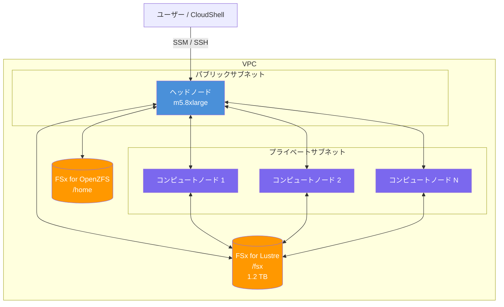

# ワークショップの概要

このワークショップは、[AWS 公式ワークショップ](https://catalog.workshops.aws/ml-on-aws-parallelcluster/en-US) を日本語で補足的な解説をするための資料です。

https://github.com/awslabs/awsome-distributed-training/tree/a3e2166043acf2675dda6aa4e47e352ee1182855

このワークショップの大部分が AWS WWSO ML Frameworks チームが作成した awslabs/awsome-distributed-training のリファレンス実装をベースにまとめられています。ワークショップ内容は随時変更される可能性があるのでご注意ください。

# ワークショップで学べること

- AWS ParallelCluster を使った HPC クラスターの構築
- Slurm によるジョブスケジューリングの基本操作
- CPU インスタンスを使った PyTorch DDP 分散学習
- [Optional、動作未確認] GPU インスタンスを使った Megatron-LM によるトレーニング
- Prometheus と Grafana によるクラスター o11y の実装

:::message
本日本語補足資料では公式ワークショップでは講師が口頭で補足するような説明をまとめます。GPU がなくても実施可能な CPU ベースのワークショップを用いて初学者が ML 学習インフラの環境構築についての理解を深めることを目的とします。
:::

# 2 つの進め方

ワークショップには **AWS 主催イベント** と **自己所有アカウント** の 2 つの進め方があります。AWS が開催してくれるイベント以外では基本的には後者の自己所有アカウントで進めてください。コストが気になる方はワークショップが終わったらリソースを削除するのが良いでしょう。

# 必要なもの

## 共通

- AWS アカウント
- Chrome、Firefox、Safari、Opera、Edge などのブラウザ
- 基本的な Linux コマンドの知識

## 自己所有アカウントの追加要件

- AdministratorAccess 相当の IAM 権限（または以下のサービスへのアクセス権）
  - Amazon EC2（インスタンス起動・停止）
  - AWS CloudFormation（スタック作成・削除）
  - Amazon FSx（ファイルシステム作成・削除）
  - Amazon VPC（VPC・サブネット・セキュリティグループ管理）
  - AWS Systems Manager（Session Manager 経由のアクセス）
- 必要に応じて GPU インスタンスのサービスクォータ引き上げ申請

# アーキテクチャ概要

ワークショップで構築するインフラの全体像を示します。

### 主要コンポーネントの説明

| コンポーネント | 説明 |
|------------|------|
| ヘッドノード | Slurm マスターノード。ジョブ受付・スケジューリングを担当。 |
| コンピュートノード | Slurm ワーカーノード。ジョブ投入時にオンデマンドで起動し、アイドル後に自動削除 |
| FSx for Lustre | 高性能並列ファイルシステム。`/fsx` にマウントされ全ノードで共有 |
| FSx for OpenZFS | `/home` ディレクトリ用の共有ストレージ |
| Slurm | ジョブスケジューラー。`sbatch`・`squeue`・`sinfo` などのコマンドでジョブを管理 |

:::message
ワークショップでは構築が手間なため AWS Console に組み込まれている CloudShell を使っていますがローカル PC や SageMaker のノートブックなど好きに使うことができ、特に接続元の制限はありません。
:::

# Basic01: CPU インスタンスで分散学習体験

## Step 1: Getting Started

まずはインフラを構築します。CloudFormation テンプレートで VPC と FSx を作成し、pcluster CLI をインストールします。

https://catalog.workshops.aws/ml-on-aws-parallelcluster/en-US/01-getting-started

## Step 2: クラスターの作成

クラスター構成を定義した `config.yaml` を作成し、pcluster CLI でクラスターを起動します。Slurm の基本操作も確認します。

https://catalog.workshops.aws/ml-on-aws-parallelcluster/en-US/03-cluster

## Step 3: CPU 分散学習

CPU インスタンスでの PyTorch DDP 分散学習を実行します。

https://catalog.workshops.aws/ml-on-aws-parallelcluster/en-US/04-train-cpu

## Step 4: 可観測性

Self-hosted Grafana ダッシュボードを構築し、クラスターのメトリクスを監視します。

https://catalog.workshops.aws/ml-on-aws-parallelcluster/en-US/06-observability

## Step 5: クリーンアップ

ワークショップ完了後は、コスト削減のためクラスターとインフラを削除しておきましょう。

https://catalog.workshops.aws/ml-on-aws-parallelcluster/en-US/08-cleanup
