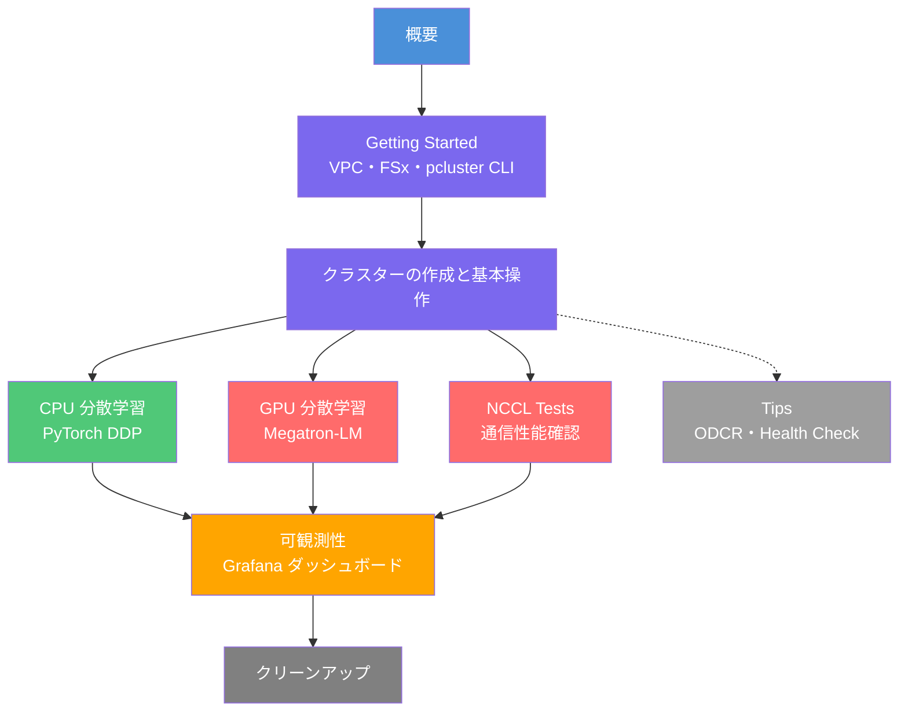
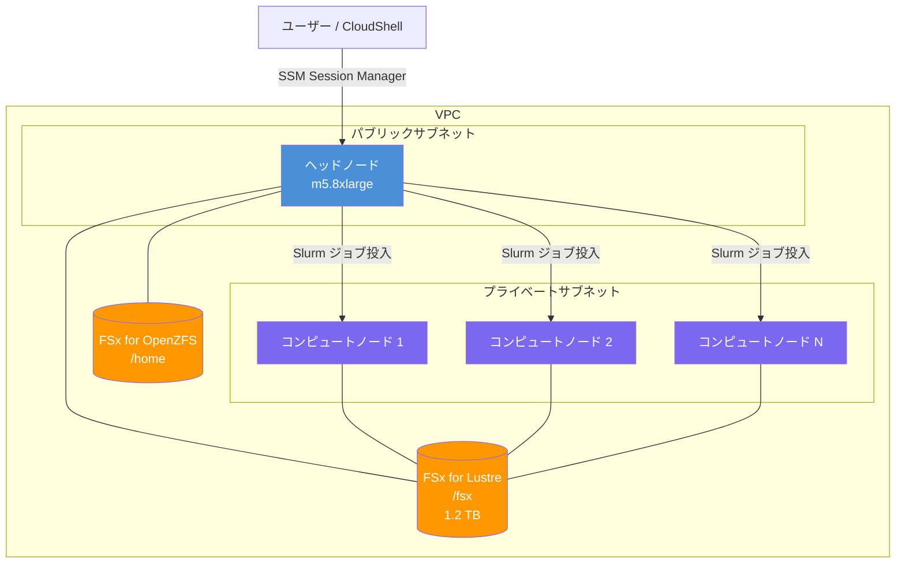

本ワークショップは [AWS 公式ワークショップ "Machine Learning on AWS ParallelCluster"](https://catalog.workshops.aws/ml-on-aws-parallelcluster/en-US) をベースに、日本語でまとめて補足を入れたものです。

# ワークショップの概要

AWS ParallelCluster は AWS が提供する HPC クラスター管理ツールです。Slurm スケジューラーを使って Amazon EC2 インスタンスを柔軟にスケールアウト・スケールインでき、機械学習の分散トレーニング環境を素早く構築できます。

# ワークショップで学べること

- AWS ParallelCluster 3.x を使った HPC クラスターの構築
- CloudFormation による VPC・FSx for Lustre のインフラ自動構築
- Slurm によるジョブスケジューリングの基本操作（`sbatch`、`squeue`、`sinfo`）
- CPU インスタンス（c5.4xlarge）を使った PyTorch DDP 分散学習
- GPU インスタンス（g5.8xlarge / p4d.24xlarge）を使った Megatron-LM による GPT 事前学習
- Prometheus と Grafana によるクラスターの可観測性（Observability）の実装
- On-Demand Capacity Reservation（ODCR）や GPU Health Check などの運用 Tips

# 全体構成

# 事前準備

- AdministratorAccess 相当の IAM 権限（または以下のサービスへのアクセス権）
  - Amazon EC2、AWS CloudFormation、Amazon FSx、Amazon VPC、AWS Systems Manager
- 必要に応じて GPU インスタンス（g5.8xlarge など）のサービスクォータ引き上げ申請

# アーキテクチャ概要

ワークショップで構築するインフラの全体像を示します。

### 主要コンポーネントの説明

| コンポーネント | 説明 |
|------------|------|
| ヘッドノード | Slurm マスターノード。ジョブ受付・スケジューリングを担当 |
| コンピュートノード | Slurm ワーカーノード。ジョブ投入時にオンデマンドで起動し、アイドル後に自動削除 |
| FSx for Lustre | 高性能並列ファイルシステム。`/fsx` にマウントされ全ノードで共有。トレーニングデータやチェックポイントの置き場として使用 |
| FSx for OpenZFS | `/home` ディレクトリ用の共有ストレージ。全ノードで同一のホームディレクトリを参照できる |
| Slurm | ジョブスケジューラー。`sbatch`・`squeue`・`sinfo` などのコマンドでジョブを管理 |