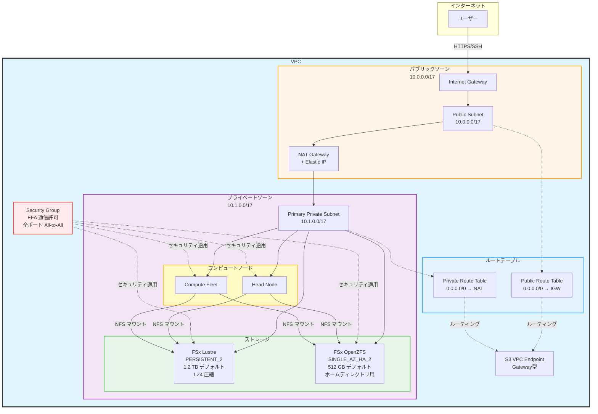
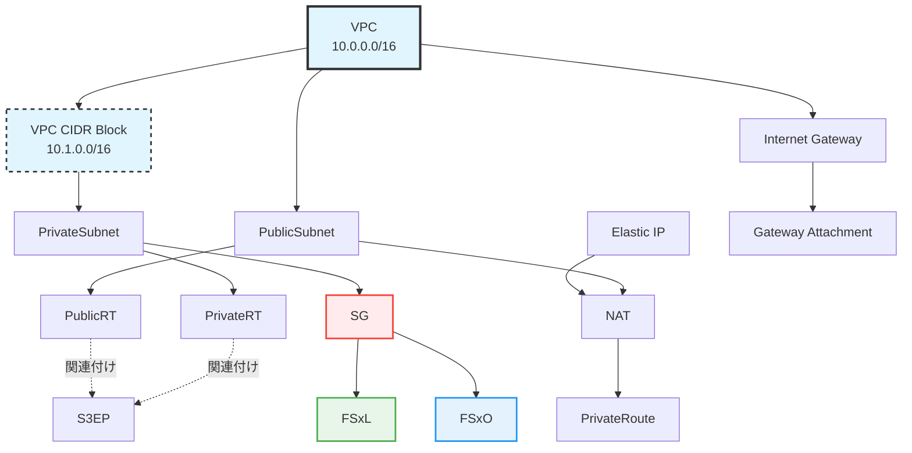
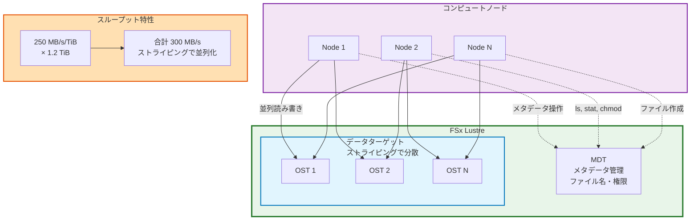

本章では、AWS ParallelCluster ワークショップに必要なインフラを構築します。CloudFormation で VPC と FSx ファイルシステムをデプロイし、CloudShell で pcluster CLI をインストールするまでの手順を説明します。

:::message alert
本資料では `ap-northeast-1` リージョンを使用します。実際には自身で選択したリージョンを使用するようにしっかり確認しながら進めてください。
:::

# 解説

:::message
このステップでは今後の作業で使用する AWS インフラを作成します。主にネットワーク、ストレージ関連のサービスをデプロイします。
:::

## 全体インフラ構成



## リソース作成の依存関係



AWS ParallelCluster Workshop のネットワークアーキテクチャは、HPC ワークロードの特性を深く理解した上で設計されています。

## ネットワークの設計

このテンプレートは VPC に対して `10.0.0.0/16` と `10.1.0.0/16` という 2 つの CIDR ブロックを割り当てています。

第一の CIDR ブロック `10.0.0.0/16` は Public Subnet 専用に予約されています。ここには NAT Gateway や将来的に追加される踏み台サーバー（Bastion Host）が配置されます。Public Subnet に独立した CIDR ブロックを割り当てることで、パブリックに露出するリソースの IP アドレス範囲を明確に区別できます。これは AWS のネットワークセキュリティのベストプラクティスです。

第二の CIDR ブロック `10.1.0.0/16` は完全にプライベートネットワーク専用です。HeadNode、ComputeFleet、そして FSx ファイルシステムはすべてこの CIDR 範囲内に配置されます。この分離により、HPC ワークロードのトラフィックがパブリックネットワークのトラフィックと混在することを防ぎます。

## サブネットマスクの注意点

Public Subnet と Primary Private Subnet はいずれも `/17` のサブネットマスクを使用しています。これは各サブネットに 32,766 個の利用可能な IP アドレスを提供します。この数字は AWS ParallelCluster のオートスケーリング要求を満たすために慎重に選択されています。

ParallelCluster の ComputeFleet は需要に応じて動的にノードを追加します。大規模な機械学習ジョブでは数百台のインスタンスが同時に起動することがあります。各インスタンスには少なくとも 1 つのプライマリ IP アドレスが必要であり、EFA（Elastic Fabric Adapter）を使用する場合はさらに追加の IP アドレスが必要になります。EFA は低レイテンシの RDMA（Remote Direct Memory Access）通信を実現するために、複数のネットワークインターフェースを使用します。

さらに、FSx ファイルシステムも複数の IP アドレスを消費します。FSx Lustre の PERSISTENT_2 デプロイメントタイプは高可用性を実現するために、複数の Elastic Network Interface（ENI）を作成します。FSx OpenZFS の SINGLE_AZ_HA_2 デプロイメントも同様に、フェイルオーバー機能のために複数の ENI を必要とします。

したがって、`/17` というサブネットマスクは、数百台のコンピュートノード、複数の FSx ファイルシステム、そして将来的な拡張に備えた余裕を確保しています。

## Internet Gateway と NAT Gateway

このテンプレートは Internet Gateway と NAT Gateway という 2 つの異なるゲートウェイを配置しています。

Internet Gateway は双方向の通信ゲートウェイです。Public Subnet に配置されたリソースは、Internet Gateway を通じてインターネットからのインバウンド接続を受け入れることができます。これは SSH での HeadNode へのアクセスや、将来的に追加される管理用 Web インターフェースへのアクセスに使用されます。

一方、NAT Gateway は単方向のゲートウェイです。Private Subnet 内のリソースは NAT Gateway を通じてインターネットへのアウトバウンド接続を開始できますが、インターネットからのインバウンド接続は受け付けません。

ComputeFleet ノードはパッケージのダウンロード、Docker イメージの取得、AWS API の呼び出しなど、インターネットへのアクセスが必要です。しかし、これらのノードが直接インターネットからアクセス可能である必要はありません。NAT Gateway を経由することで、ComputeFleet は必要なリソースをダウンロードできる一方で、攻撃者からの直接アクセスを防ぐことができます。

NAT Gateway には Elastic IP が関連付けられています。この固定の IP アドレスは、外部サービスのホワイトリストに登録するために使用できます。例えば、企業のファイアウォールが特定の IP アドレスからのアクセスのみを許可している場合、この Elastic IP をホワイトリストに追加することで、クラスター全体からの安全なアクセスが可能になります。

## Route Table の設計思想

このテンプレートは Public Route Table と Private Route Table という 2 つの独立したルートテーブルを作成します。この分離は単なる論理的な整理以上の意味を持っています。

Public Route Table は `0.0.0.0/0` のデフォルトルートを Internet Gateway に向けています。これにより、Public Subnet 内のすべてのリソースはインターネットへの直接ルートを持ちます。この設定は NAT Gateway 自身にも適用されます。NAT Gateway がインターネットへの接続を提供するためには、まず自分自身がインターネットに接続できなければなりません。

Private Route Table は `0.0.0.0/0` のデフォルトルートを NAT Gateway に向けています。Private Subnet から発信されたパケットは、まず Private Route Table によって NAT Gateway にルーティングされます。NAT Gateway はそのパケットを受け取ると、送信元 IP アドレスを自身の Elastic IP に書き換え、Public Route Table を参照して Internet Gateway にルーティングします。

この二段階のルーティングにより、Private Subnet 内のリソースは自分たちのプライベート IP アドレスを保持したままインターネットにアクセスでき、外部からは単一の Elastic IP からのアクセスとして見えます。これも AWS のベストプラクティスです。

## S3 VPC Endpoint

S3 VPC Endpoint の追加は、このテンプレートの最も重要な最適化の一つです。HPC ワークロードでは、学習データ、チェックポイント、モデルの重みなど、大量のデータを S3 との間で転送します。

通常、VPC 内のリソースが S3 にアクセスする場合、トラフィックは Internet Gateway または NAT Gateway を経由します。これには 2 つの問題があります。第一に、NAT Gateway を経由するデータ転送には料金が発生します。1 GB あたり約 0.045 USD の処理料金に加えて、データ転送料金も発生します。数百 GB から数 TB のデータを転送する機械学習ワークロードでは、この料金が無視できないコストになります。

第二に、Internet Gateway や NAT Gateway を経由するトラフィックは、VPC の外に出てから S3 に到達します。これは物理的なネットワーク経路が長くなり、レイテンシが増加することを意味します。

S3 VPC Endpoint（Gateway 型）を使用すると、これらの問題が解決されます。Gateway 型エンドポイントは Route Table に S3 の Prefix List 向けのルートを追加します。この Prefix List は AWS が管理する S3 の IP アドレス範囲のリストです。S3 へのトラフィックは VPC 内の AWS バックボーンネットワークを経由して直接ルーティングされ、Internet Gateway や NAT Gateway を経由しません。

重要なのは、このエンドポイントが Public Route Table と Private Route Table の両方に関連付けられていることです。これにより、Public Subnet と Private Subnet の両方から、同じ効率的な経路で S3 にアクセスできます。HeadNode がダウンロードしたデータを処理し、ComputeFleet がそれを読み込んで学習を実行し、再びチェックポイントを S3 にアップロードする、という一連のフローがすべて高速かつ低コストで実行されます。

## Security Group と EFA 通信の要求

このテンプレートが作成する Security Group は、同一 Security Group 内のすべてのトラフィック（全プロトコル、全ポート）を許可しています。これは単なる設定の手抜きではなく、EFA の技術的要求に基づいた設計です。

EFA は AWS が開発した高性能ネットワークインターフェースで、MPI や NCCL などの HPC ライブラリが使用する RDMA 通信をサポートします。RDMA は従来の TCP/IP スタックをバイパスして、カーネルの介入なしに直接メモリ間でデータを転送します。

この低レイテンシ通信を実現するために、EFA は複数のネットワークプロトコルとポート範囲を使用します。具体的には、SRD（Scalable Reliable Datagram）というカスタムプロトコルを使用し、動的にポート番号を割り当てます。さらに、RDMA の確立と維持のために、ICMP、UDP、TCP のさまざまなポートが必要になります。

これらのポートとプロトコルを個別に列挙してルールを作成することは可能ですが、EFA のバージョンアップや MPI ライブラリの更新によって要求が変わる可能性があります。したがって、同一 Security Group 内の全通信を許可することで、将来的な変更に対する耐性を確保しています。

重要なのは、この寛容なルールが適用されるのは同一 Security Group 内のリソース間のみであることです。外部からの接続、または他の Security Group に属するリソースからの接続は厳格に制限されています。HeadNode、ComputeFleet、FSx ファイルシステムはすべて同じ Security Group に属しているため、互いに通信できますが、VPC 外部からの不正なアクセスは防止されます。

Egress ルールには 2 つの設定があります。1 つは同一 Security Group 内への Egress、もう 1 つは `0.0.0.0/0` への Egress です。後者は ComputeFleet がパッケージリポジトリや Docker Hub などの外部サービスにアクセスするために必要です。この Egress ルールがなければ、ノードは起動時に必要なソフトウェアをダウンロードできず、クラスターのブートストラップが失敗します。

## ストレージの設計

AWS ParallelCluster における FSx Lustre と FSx OpenZFS の二重ストレージ構成は、HPC ワークロードの異なる要求を満たすための設計です。このテンプレートが 2 つのファイルシステムを並行して展開する理由は、単なる冗長性の確保ではなく、それぞれのファイルシステムが持つ独自の強みを最大限に活用するためです。

## なぜ単一のファイルシステムでは不十分なのか

機械学習の分散学習ワークロードを例に考えてみましょう。学習ジョブは大きく分けて 3 種類のファイルアクセスパターンを持っています。

第一に、学習データの読み込みです。ImageNet のような大規模データセットは数百万の画像ファイルから構成され、総容量は数百 GB から数 TB に達します。これらのファイルは学習の各エポックで繰り返し読み込まれます。重要なのは、データローダーが複数のワーカープロセスで並列にファイルを読み込むため、極めて高いスループットと IOPS が要求されることです。さらに、分散学習では複数のコンピュートノードが同時に同じデータセットにアクセスするため、並列ファイルシステムの能力が性能のボトルネックになりがちです。

第二に、チェックポイントの保存です。大規模モデルの学習では、数時間から数日ごとにモデルの重みを保存します。GPT-3 クラスのモデルでは、単一のチェックポイントが数百 GB に達することもあります。このような大容量ファイルの書き込みは、短時間で完了する必要があります。チェックポイント保存に時間がかかりすぎると、その間 GPU がアイドル状態になり、高価なコンピュートリソースが無駄になるためです。

第三に、ユーザーの設定ファイルやスクリプトの読み書きです。これらは容量としては小さい（数 KB から数 MB）ですが、頻繁にアクセスされます。さらに、POSIX 互換性が求められます。研究者は慣れ親しんだ Unix コマンド（ls、cp、rsync など）を使ってファイルを操作したいと考えます。また、ホームディレクトリの内容は失われてはならないため、自動バックアップが必要です。

これら 3 つの要求を単一のファイルシステムで満たすことは技術的に困難です。高スループット向けに最適化すると、小さなファイルの操作が遅くなります。逆に、小さなファイルの操作を高速化すると、大容量の連続読み書きの効率が低下します。さらに、バックアップ機能を有効にすると、パフォーマンスが犠牲になることがあります。

そこでこのテンプレートは、学習データとチェックポイントには FSx Lustre を、ユーザーファイルには FSx OpenZFS を使用する戦略を採用しています。

## FSx Lustre

FSx Lustre は元々スーパーコンピューターのために開発された並列ファイルシステムです。

テンプレートは `PERSISTENT_2` というデプロイメントタイプを指定しています。FSx Lustre にはいくつかの[デプロイメントタイプ](https://docs.aws.amazon.com/fsx/latest/LustreGuide/using-fsx-lustre.html)があります。`SCRATCH_1` と `SCRATCH_2` は一時的なワークロード向けで、データの永続性を保証しません。ハードウェア障害が発生した場合、データが失われる可能性があります。その代わり、コストが低く、プロビジョニングが高速です。

`PERSISTENT_1` と `PERSISTENT_2` はデータの永続性を保証します。ファイルシステムは自動的にデータを複製し、ハードウェア障害が発生しても自動的にフェイルオーバーします。両者の違いは、レプリケーションの方法とパフォーマンスです。`PERSISTENT_2` は新しいアーキテクチャで、より高いスループットとより低いレイテンシを実現します。

このテンプレートが `PERSISTENT_2` を選択している理由は、機械学習の学習データが貴重であり、失うことができないためです。データセットの準備には数週間から数ヶ月の労力がかかることがあります。ラベル付け、前処理、データ拡張などの作業を経て作成されたデータセットは、企業の重要な資産です。

次に、`PerUnitStorageThroughput` パラメータを見てみましょう。このテンプレートはデフォルトで 250 MB/s/TiB を指定していますが、125、500、1000 の選択肢も提供しています。この数字の意味を理解するには、Lustre のアーキテクチャを知る必要があります。



Lustre は MDT（Metadata Target）と OST（Object Storage Target）という 2 つのコンポーネントで構成されています。MDT はファイル名、ディレクトリ構造、アクセス権限などのメタデータを管理します。OST は実際のファイルデータを保存します。重要なのは、大きなファイルは複数の OST にストライピング（分散）されることです。

例えば、10 GB の学習データファイルがあるとします。このファイルは 4 つの OST に分散され、各 OST が 2.5 GB ずつ保存します。ファイルを読み込む際、Lustre クライアントは 4 つの OST から並列にデータを取得します。したがって、各 OST が 250 MB/s のスループットを提供できる場合、合計で 1000 MB/s（1 GB/s）のスループットが実現されます。

`PerUnitStorageThroughput` のデフォルト設定値の 250 MB/s/TiB は、1 TiB のストレージ容量に対して 250 MB/s のスループットが提供されることを意味します。このテンプレートのデフォルト容量は 1.2 TB（約 1.1 TiB）なので、総スループットは約 275 MB/s になります。しかし、ストライピングの効果により、複数のクライアントが同時にアクセスする場合や、複数のファイルを並列に読み書きする場合、実効スループットはさらに高くなります。

FSx Lustre は透過的なデータ圧縮をサポートしています。LZ4 は高速な圧縮アルゴリズムで、CPU オーバーヘッドが低い一方で、適度な圧縮率を実現します。機械学習の学習データ、特に画像や動画は、既に JPEG や H.264 などで圧縮されていることが多く、さらに圧縮しても効果は限定的です。しかし、テキストデータや CSV ファイル、ログファイルなどは LZ4 で効果的に圧縮されます。

重要なのは、圧縮が透過的に行われることです。アプリケーションは圧縮の存在を意識する必要がありません。ファイルを書き込むと自動的に圧縮され、読み込むと自動的に展開されます。この透過性により、既存のコードを変更することなく、ストレージコストを削減できます。

## FSx OpenZFS

OpenZFS は元々 Sun Microsystems が開発した ZFS ファイルシステムのオープンソース実装で、データの整合性とスナップショット機能に重点を置いています。

このテンプレートが `SINGLE_AZ_HA_2` デプロイメントタイプを選択している理由は、高可用性とコストのバランスです。OpenZFS にはいくつかの[デプロイメントタイプ](https://docs.aws.amazon.com/ja_jp/fsx/latest/APIReference/API_CreateFileSystemOpenZFSConfiguration.html)があります。

FSx OpenZFS にはマルチ AZ 構成があります。ZFS の同期レプリケーションは非常に高いレイテンシ要求を持ちます。異なる AZ 間のネットワークレイテンシは通常数ミリ秒ですが、これは同期レプリケーションにとっては長いです。これらを判断して `MULTI_AZ_1` にするか検討すべきであり、HPC は一般的なウェブサービスのベストプラクティスそのままの考え方は通用しないことがあることを意識しておきましょう。

## スタックの Outputs

テンプレートは以下の情報を出力し、ParallelCluster の設定で参照できます：

| Output | 説明 | 使用例 |
|--------|------|--------|
| `VPC` | VPC ID | `config.yaml` の `VpcId` |
| `PublicSubnet` | Public Subnet ID | HeadNode のサブネット |
| `PrimaryPrivateSubnet` | Private Subnet ID | ComputeFleet のサブネット |
| `SecurityGroup` | Security Group ID | EFA 通信用 SG |
| `FSxLustreFilesystemId` | FSx Lustre ID | `/fsx` マウント設定 |
| `FSxORootVolumeId` | FSx OpenZFS Volume ID | `/home` マウント設定 |

# ワークショップ実施

## インフラのデプロイ

CloudFormation テンプレート `parallelcluster-prerequisites` を使って解説した構成でデプロイします。

## CloudFormation スタックのデプロイ手順

デプロイはローカル PC から実施しても、AWS CloudShell から実行しても構いませんがワークショップでは AWS CloudShell から実行する手順になっています。AWS CloudShell の起動手順については公式ワークショップを確認してください。

https://catalog.workshops.aws/ml-on-aws-parallelcluster/en-US/01-getting-started/02-own-account/03-cloud-shell

:::message alert
**公式ワークショップ手順 [[こちら](https://catalog.workshops.aws/ml-on-aws-parallelcluster/en-US/01-getting-started/02-own-account/02-infra)] を正として進めてください。**
:::

::::details CloudFormation デプロイ手順 

```bash
# 自身の利用するリージョンに合わせて変更してください。
AWS_REGION="ap-northeast-1"
echo "Deploying to region: ${AWS_REGION}"
```

```bash
aws cloudformation create-stack \
  --stack-name parallelcluster-prerequisites \
  --template-url https://awsome-distributed-training.s3.amazonaws.com/templates/parallelcluster-prerequisites.yaml \
  --parameters ParameterKey=PrimarySubnetAZ,ParameterValue=${AWS_REGION}a \
  --capabilities CAPABILITY_IAM \
  --region ${AWS_REGION}

# Wait for completion (~5 minutes)
aws cloudformation wait stack-create-complete \
  --stack-name parallelcluster-prerequisites \
  --region ${AWS_REGION}
echo "Stack deployed successfully"
```
::::

:::message
デプロイには8-10分程度かかります。スタックの状態が `CREATE_COMPLETE` になるまで待ちましょう。
:::

# まとめ

本章では、CloudFormation テンプレート `parallelcluster-prerequisites` で基盤となる ML インフラストラクチャをデプロイしました。

# 参考資料

- [AWS ParallelCluster ワークショップ（公式）](https://catalog.workshops.aws/ml-on-aws-parallelcluster/en-US/01-getting-started)
- [AWS CloudShell ドキュメント](https://docs.aws.amazon.com/cloudshell/latest/userguide/welcome.html)
- [AWS ParallelCluster リリースノート](https://github.com/aws/aws-parallelcluster/releases)
- [parallelcluster-prerequisites CloudFormation テンプレート](https://awsome-distributed-training.s3.amazonaws.com/templates/parallelcluster-prerequisites.yaml)
