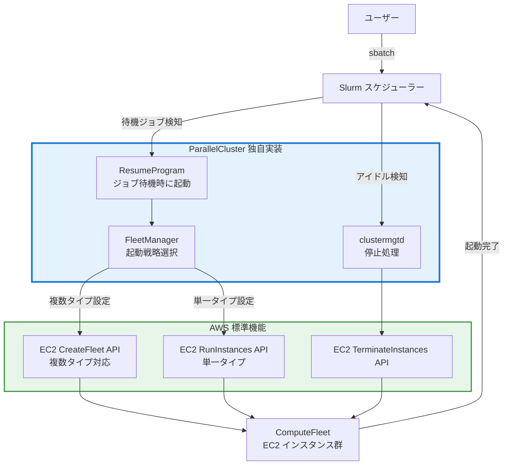
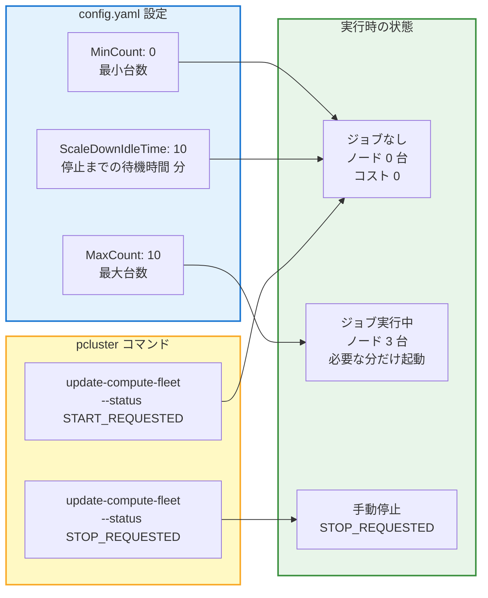
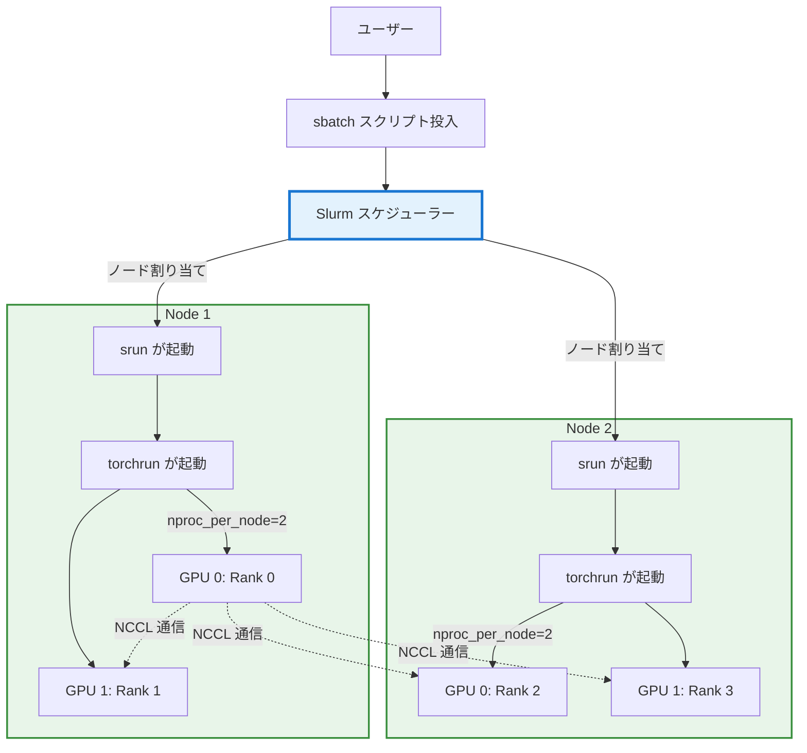
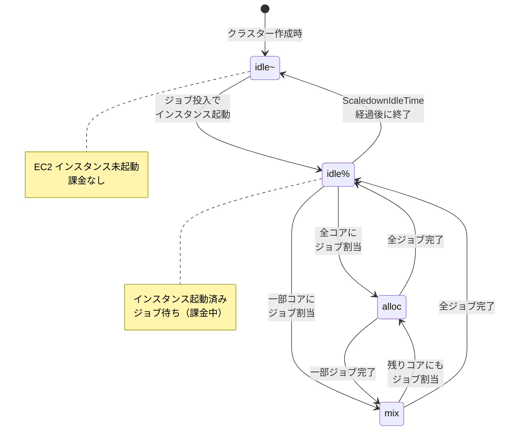

# 解説

AWS ParallelCluster は CLI の `pcluster` コマンドを用いて HPC クラスターを構築・管理できます。

:::message
AWS ParallelCluster 自体は OSS の AWS ソリューションであり実体は Cloudformation テンプレートがデプロイされます。ちゃんと実装を確認していませんがおそらく CLI バージョンごとに対応機能が追加され、バージョンごとに CloudFormation テンプレートが展開されるのだと思います。なので最新インスタンスは古いバージョンでは起動エラーする、というような挙動になっている認識です。
:::

## 主要な機能

pcluster コマンドは 3 つのカテゴリに分かれています。

### クラスター管理

基本的なライフサイクル操作です。

```bash
# クラスター作成
pcluster create-cluster -n ml-cluster -c config.yaml

# 状態確認
pcluster describe-cluster -n ml-cluster

# 設定更新
pcluster update-cluster -n ml-cluster -c config-updated.yaml

# クラスター削除
pcluster delete-cluster -n ml-cluster
```

`create-cluster` は config.yaml を読み込み、CloudFormation テンプレートを生成して AWS リソースを作成します。`update-cluster` は差分を計算し、変更が必要なリソースのみを更新します。ただし、HeadNode のインスタンスタイプ変更など、一部の変更は再作成が必要です。

::::details その他のコマンド

```bash
# HeadNode に SSH 接続
pcluster ssh -n ml-cluster -i ~/.ssh/id_rsa_pcluster

# DCV（GUI デスクトップ）接続
pcluster dcv-connect -n ml-cluster
```

```bash
# ログストリーム一覧
pcluster list-cluster-log-streams -n ml-cluster

# 特定のログを表示
pcluster get-cluster-log-events -n ml-cluster --log-stream-name cfn-init

# ログを tar.gz でエクスポート
pcluster export-cluster-logs -n ml-cluster --output-file logs.tar.gz
```

独自の AMI をビルドできます。

```bash
# AMI ビルド開始
pcluster build-image -c image-config.yaml -i my-custom-ami

# ビルド状態確認
pcluster describe-image -i my-custom-ami

# 公式 AMI 一覧
pcluster list-official-images
```

JSON 出力を `--query` でフィルタリングできます。

```bash
# HeadNode の IP アドレスのみ取得
pcluster describe-cluster -n ml-cluster --query 'headNode.publicIpAddress'

# 実行中のインスタンス数のみ取得
pcluster describe-compute-fleet -n ml-cluster --query 'status'
```
::::

### Slurm とは何か

HPC の世界では、複数のユーザーが限られた計算資源を共有します。GPU インスタンスのように高価なリソースを、誰がいつどれだけ使うかを管理する仕組みが必要です。この役割を担うのがジョブスケジューラーであり、その代表格が **Slurm** です。

Slurm は Linux ベースのクラスターにおけるリソース管理のデファクトスタンダードとなっており、AI/ML の分散学習基盤としても広く使われています。

なぜバッチ処理が必要なのでしょうか。たとえば 4 台の GPU ノードを持つクラスターに、3 人の研究者がそれぞれ 2 台ずつ必要な学習ジョブを投入したとします。全員が同時に実行することはできません。Slurm はジョブをキューに入れ、リソースの空き状況に応じて自動的にスケジューリングします。これにより、研究者はジョブを投入するだけで、あとは Slurm がリソースの割り当てと実行を管理してくれます。

AWS ParallelCluster は、AWS 上にマネージドな HPC クラスターを構築するサービスです。内部のジョブスケジューラーとして Slurm を利用でき、さらにクラウドならではの機能として、ジョブの需要に応じてコンピュートノードを自動的にスケールイン・スケールアウトする仕組みなど便利機能を提供します。

### ComputeFleet の制御

AWS ParallelCluster の ComputeFleet は、AWS の EC2 Fleet 機能を Slurm スケジューラーと統合したものです。

## EC2 Fleet とは

[EC2 Fleet](https://docs.aws.amazon.com/ja_jp/AWSEC2/latest/UserGuide/Fleets.html) は EC2 機能で、複数のインスタンスタイプ、購入オプション（オンデマンド、スポット）、アベイラビリティーゾーンを組み合わせてインスタンス群を起動できます。

主な特徴は以下の通りです。

- **単一 API コール**: `CreateFleet` で複数インスタンスを一括起動
- **柔軟な割り当て戦略**: 最安コスト優先、容量最適化、優先順位指定など
- **オンデマンドとスポットの混在**: オンデマンドとスポット混在で可能
- **追加料金なし**: 起動したインスタンスの料金のみ

EC2 Fleet は大量のインスタンスを効率的に起動する仕組みですが、それ自体には動的スケーリングの機能はありません。起動時に台数と条件を指定するだけです。

## ParallelCluster 3.x の実装

ParallelCluster 3.x は、EC2 Fleet API を Slurm と統合することで動的スケーリングを実現しています。Slurm については後ほど詳細に解説しますがバッチジョブを管理するソフトウェアだと思っておいてください。つまり、Slurm でバッチジョブが投入されるとそれに応じて EC2 Fleet と連携して必要なインスタンスをジョブように起動し、処理が終了したらインスタンスを削除します。



## 用語の整理

**EC2 Fleet** は AWS の標準機能で、インスタンス群の効率的な起動を提供します。**ComputeFleet** は ParallelCluster の用語で、Slurm と EC2 Fleet API を統合した動的スケーリングの仕組みです。

つまり、ComputeFleet は EC2 Fleet という AWS の機能を活用していますが、それに Slurm のジョブスケジューリングと連動する独自のロジックを追加したものです。EC2 Fleet 自体は汎用的な起動機能であり、HPC やジョブスケジューラーとの統合は含まれていません。

**ComputeFleet の設定と制御**




## 設定ファイルの構造と役割

config.yaml は環境変数を展開してから pcluster コマンドに渡されます。これにより、同じテンプレートを異なる環境（開発、ステージング、本番）で再利用できます。

ワークショップの設定は大きく 6 つのセクションに分かれています。Image、HeadNode、Scheduling、SharedStorage、Monitoring、そして Tags です。それぞれが CloudFormation テンプレートの特定のリソースに対応しています。

## HeadNode

```yaml
HeadNode:
  InstanceType: m5.8xlarge
  Networking:
    SubnetId: ${PUBLIC_SUBNET_ID}
    AdditionalSecurityGroups:
      - ${SECURITY_GROUP}
  LocalStorage:
    RootVolume:
      Size: 500
      DeleteOnTermination: true # that's your root and /home volume for users
  Iam:
    AdditionalIamPolicies: # grant ECR, SSM and S3 read access
      - Policy: arn:aws:iam::aws:policy/AmazonSSMManagedInstanceCore
      - Policy: arn:aws:iam::aws:policy/AmazonS3ReadOnlyAccess
      - Policy: arn:aws:iam::aws:policy/AmazonEC2ContainerRegistryReadOnly
      - Policy: arn:aws:iam::aws:policy/AmazonPrometheusRemoteWriteAccess
  CustomActions:
        OnNodeConfigured:
          Sequence:
            - Script: 'https://raw.githubusercontent.com/aws-samples/aws-parallelcluster-post-install-scripts/main/docker/postinstall.sh'
            # NCCL is not needed for CPU-only HeadNode. Uncomment the following lines if you add GPU compute queues:
            # - Script: 'https://raw.githubusercontent.com/nghtm/aws-parallelcluster-post-install-scripts/refs/heads/patch-1/nccl/postinstall.sh'
            - Script: 'https://raw.githubusercontent.com/aws-samples/aws-parallelcluster-post-install-scripts/refs/heads/main/pyxis/postinstall.sh'
  Imds:
    Secured: false
```

HeadNode は `m5.8xlarge` という汎用インスタンスタイプです。32 vCPU と 128 GB メモリを持ち、Root Volume が 500 GB に設定されています。

`AdditionalSecurityGroups` でセキュリティグループを指定していますが、これは CloudFormation テンプレートで作成したセキュリティグループです。HeadNode と ComputeFleet が同じセキュリティグループに属することで、EFA 通信が許可されます。

### CustomActions の仕組み

CustomActions の [OnNodeConfigured](https://docs.aws.amazon.com/ja_jp/parallelcluster/latest/ug/custom-bootstrap-actions-v3.html) は、インスタンスが起動して基本的な設定が完了した後に実行されます。このタイミングで追加ソフトウェアをインストールできます。

Docker の postinstall.sh は、Docker Engine をインストールし、systemd サービスとして起動します。さらに、Slurm ユーザーが Docker コマンドを実行できるように権限を設定します。

Pyxis は Slurm と Docker を統合するプラグインです。通常、Slurm ジョブは実行ファイルを直接起動しますが、Pyxis を使うと Docker コンテナをジョブとして投入できます。これにより、依存関係が複雑な機械学習フレームワークをコンテナにパッケージ化し、環境の再現性を確保できます。

::::details Enroot と Pyxis

Slurm から Docker コンテナを実行するための **Pyxis** と **Enroot** をインストール・設定します。

## Enroot と Pyxis の役割

**Enroot** は NVIDIA が開発した軽量コンテナランタイムで、Docker の代替です。HPC 環境向けに最適化されており、以下の特徴があります。

- **非特権実行**: root 権限不要でユーザーごとに独立したコンテナを実行
- **高速起動**: Docker より軽量で起動が高速
- **HPC 最適化**: MPI、NCCL、InfiniBand/EFA との統合が容易

**Pyxis** は Slurm の SPANK プラグインで、Enroot を Slurm と統合します。

```bash
# Pyxis により、Slurm ジョブでコンテナを指定できる
srun --container-image=nvcr.io/nvidia/pytorch:24.01-py3 python train.py
```

## スクリプトの動作（ParallelCluster 3.11 以降）

ParallelCluster 3.11 以降では、Enroot と Pyxis が **事前インストール済み** です。このスクリプトは設定のみを行います。

### HeadNode での処理

```bash
# Enroot のデータディレクトリ設定
ENROOT_DIR=/tmp/enroot
mkdir -p $ENROOT_DIR/{data,cache}
chmod -R 1777 $ENROOT_DIR

# Pyxis のランタイムディレクトリ
mkdir -p /run/pyxis
chmod 1777 /run/pyxis

# Slurm に Pyxis プラグインを登録
cp /opt/parallelcluster/examples/spank/plugstack.conf /opt/slurm/etc/
cp /opt/parallelcluster/examples/pyxis/pyxis.conf /opt/slurm/etc/plugstack.conf.d/
scontrol reconfigure  # Slurm 設定を再読み込み
```

### ComputeFleet での処理

```bash
# Enroot データをローカルストレージに配置（高速化）
ENROOT_DIR=/local_scratch/enroot
mkdir -p $ENROOT_DIR/{data,cache}

# Ubuntu 24.04 の AppArmor 制限を無効化
# Enroot は unprivileged user namespaces を使用するため
echo "kernel.apparmor_restrict_unprivileged_userns = 0" | tee /etc/sysctl.d/99-pcluster-disable-apparmor-restrict-unprivileged-userns.conf
sysctl --system

# slurmd を再起動して Pyxis プラグインを有効化
systemctl restart slurmd
```

## スクリプトの動作（ParallelCluster 3.10 以前）

古いバージョンでは、Enroot と Pyxis を **ソースからビルド** します。
::::

## Scheduling

```yaml
Scheduling:
  Scheduler: slurm
  SlurmSettings:
    QueueUpdateStrategy: DRAIN
  SlurmQueues:
    - Name: cpu
      CapacityType: ONDEMAND
      Networking:
        SubnetIds:
          - ${PRIVATE_SUBNET_ID}
        PlacementGroup:
          Enabled: true  # set this to false if using a targeted ODCR
        AdditionalSecurityGroups:
          - ${SECURITY_GROUP}
      ComputeSettings:
        LocalStorage:
          RootVolume:
            Size: 200
      JobExclusiveAllocation: true   # GenAI training likes to gobble all GPUs in an instance
      ComputeResources:
        - Name: c5
          InstanceType: c5.4xlarge
          MinCount: 0 # if min = max then capacity is maintained and will
          MaxCount: 4 # not scale down
      CustomActions:
        OnNodeConfigured:
          Sequence:
            - Script: 'https://raw.githubusercontent.com/aws-samples/aws-parallelcluster-post-install-scripts/main/docker/postinstall.sh'
            # NCCL is not needed for CPU-only compute nodes. Uncomment the following line if you need GPU support:
            # - Script: 'https://raw.githubusercontent.com/nghtm/aws-parallelcluster-post-install-scripts/refs/heads/patch-1/nccl/postinstall.sh'
            - Script: 'https://raw.githubusercontent.com/aws-samples/aws-parallelcluster-post-install-scripts/refs/heads/main/pyxis/postinstall.sh'
```

Slurm の SlurmQueues セクションは、コンピュートリソースの種類を定義します。この設定では `cpu` という名前のキューが 1 つだけ定義されています。

`QueueUpdateStrategy: DRAIN` は、クラスターの設定を更新する際の挙動を制御します。DRAIN 戦略では、実行中のジョブは最後まで実行され、新しいジョブは新しい設定のノードに割り当てられます。これにより、実行中のジョブを中断せずに設定を更新できます。

`CapacityType: ONDEMAND` はオンデマンドインスタンスを使用することを意味します。

`PlacementGroup.Enabled: true` は重要な最適化です。プレースメントグループは、インスタンスを物理的に近接した場所に配置します。これにより、ノード間の通信レイテンシが最小化されます。分散学習では、各ステップで勾配を同期する必要があり、ネットワークレイテンシが全体の性能に直結します。

`JobExclusiveAllocation: true` は、1 つのジョブがノード全体を占有することを意味します。c5.4xlarge は 16 vCPU を持ちますが、この設定により、16 vCPU を要求するジョブだけがこのノードに割り当てられます。複数のジョブが同じノードで実行されると、CPU キャッシュの競合やメモリ帯域の競合が発生し、性能が低下します。

`MinCount: 0` と `MaxCount: 4` の組み合わせは、オートスケーリングの動作を定義します。MinCount が 0 なので、アイドル時にはコンピュートノードは存在しません。ジョブが投入されると、最大 4 台まで自動的に起動します。これにより、コストを最小化しながら、必要な時だけリソースを使用できます。

## SharedStorage の二重マウント

```yaml
SharedStorage:
  - Name: HomeDirs
    MountDir: /home
    StorageType: FsxOpenZfs
    FsxOpenZfsSettings:
      VolumeId: ${FSXO_ID}
  - MountDir: /fsx
    Name: fsx
    StorageType: FsxLustre
    FsxLustreSettings:
      FileSystemId: ${FSX_ID}
```

SharedStorage セクションは、FSx OpenZFS を `/home` に、FSx Lustre を `/fsx` にマウントします。この設定により、CloudFormation テンプレートで作成したファイルシステムが、すべてのノードからアクセス可能になります。

`VolumeId` と `FileSystemId` は環境変数から展開されます。これらの ID は CloudFormation スタックの Outputs から取得されます。この参照関係により、ネットワークインフラとクラスターが正しく連携します。

重要なのは、HeadNode と ComputeFleet の両方が同じファイルシステムをマウントすることです。研究者は HeadNode で学習スクリプトを作成し、それを `/fsx` に保存します。Slurm ジョブを投入すると、ComputeFleet ノードが起動し、同じ `/fsx` からスクリプトを読み込んで実行します。データの同期やコピーは不要です。

## Monitoring とデバッグの設定

```yaml
Monitoring:
  DetailedMonitoring: true
  Logs:
    CloudWatch:
      Enabled: true # good for debug
  Dashboards:
    CloudWatch:
      Enabled: true # provide basic dashboards
```

`DetailedMonitoring: true` は、EC2 インスタンスの詳細モニタリングを有効にします。通常、CloudWatch メトリクスは 5 分間隔で収集されますが、詳細モニタリングでは 1 分間隔になります。ジョブのパフォーマンス問題をデバッグする際、この粒度の違いが重要になります。

`CloudWatch.Enabled: true` は、Slurm のログを CloudWatch Logs に送信します。

`/var/log/slurmctld.log`、`/var/log/slurmd.log` などのログがリアルタイムで CloudWatch に転送されます。ノードが停止した後もログが保持されるため、エラーの原因を遡って調査できます。

CloudWatch Dashboards も有効にされています。これにより、クラスターの基本的なメトリクス（CPU 使用率、ディスク I/O、ネットワークトラフィック）が自動的にダッシュボードで可視化されます。

## torchrun と srun

この 2 つのコマンドは異なるレイヤーで動作します。**srun** は Slurm のコマンドで、**どのノードでプロセスを起動するか** を制御します。**torchrun** は PyTorch のコマンドで、**各ノードで分散学習プロセスをどう起動するか** を制御します。



### srun の役割

`srun` は Slurm が提供するジョブ実行コマンドです。以下のように動作します。

**ノード間でのプロセス配置**

```bash
# 2 ノード、各ノード 1 タスク
srun --nodes=2 --ntasks-per-node=1 torchrun train.py
```

このコマンドは、Slurm が割り当てた 2 つのノードでそれぞれ 1 回ずつ `torchrun train.py` を実行します。

**環境変数の自動設定**

`srun` は以下の環境変数を各プロセスに渡します。

- `SLURM_PROCID`: プロセスの通し番号（0, 1, 2, ...）
- `SLURM_NTASKS`: 総タスク数
- `SLURM_NODELIST`: 割り当てられたノードのリスト
- `SLURM_LOCALID`: ノード内でのローカル ID

これらの変数を使って、各ノードが自分の役割を認識できます。

### torchrun の役割

`torchrun` は PyTorch の分散学習の起動ツールです。

**GPU 間でのプロセス起動**

```bash
# 各ノードで 2 つの GPU プロセスを起動
torchrun --nproc_per_node=2 \
         --nnodes=2 \
         --node_rank=$SLURM_PROCID \
         --master_addr=$MASTER_ADDR \
         --master_port=29500 \
         train.py
```

`torchrun` は以下を自動的に行います。

1. **各 GPU にプロセスを割り当て**: `nproc_per_node=2` なら GPU 0 と GPU 1 にそれぞれプロセスを起動
2. **RANK と WORLD_SIZE の設定**: 各プロセスに一意な RANK（0, 1, 2, 3）を割り当て
3. **通信初期化**: PyTorch の分散通信バックエンド（NCCL、Gloo など）を初期化
4. **障害時の自動再起動**: エラー発生時にプロセスを再起動（elastic training）

::::details 実際の使用例

典型的な Slurm バッチスクリプトは以下のようになります。

```bash
#!/bin/bash
#SBATCH --job-name=train
#SBATCH --nodes=2
#SBATCH --ntasks-per-node=1
#SBATCH --cpus-per-task=16
#SBATCH --gres=gpu:2

# マスターノードのアドレスを取得
export MASTER_ADDR=$(scontrol show hostname $SLURM_NODELIST | head -n 1)
export MASTER_PORT=29500

# srun で各ノードに torchrun を起動
srun torchrun \
    --nproc_per_node=2 \
    --nnodes=$SLURM_NNODES \
    --node_rank=$SLURM_PROCID \
    --master_addr=$MASTER_ADDR \
    --master_port=$MASTER_PORT \
    train.py
```

1. **Slurm がノードを割り当て**: 2 台の g5.8xlarge（各 1 GPU）が割り当てられる
2. **srun が各ノードで torchrun を起動**: `--ntasks-per-node=1` なので各ノード 1 回
3. **torchrun が各ノードで GPU プロセスを起動**: `--nproc_per_node=2` なので各ノード 2 プロセス
4. **合計 4 プロセス**: Node 0 で Rank 0, 1、Node 1 で Rank 2, 3
::::

# ワークショップ実施

:::message alert
公式ワークショップ手順 [[こちら](https://catalog.workshops.aws/ml-on-aws-parallelcluster/en-US/03-cluster)] を正として進めてください。
:::

## Install AWS ParallelCluster CLI

ここは詰まるところがないと思います。

https://catalog.workshops.aws/ml-on-aws-parallelcluster/en-US/03-cluster/01-pc-cli-install

::::details CLI インストール
```bash
pip3 install -U "aws-parallelcluster==3.14.2"
pcluster version
```
::::

## Create a Cluster

先ほど解説した設定でクラスターを作成します。大体 10 分くらいで作成が完了します。

https://catalog.workshops.aws/ml-on-aws-parallelcluster/en-US/03-cluster/02-setup-cluster

::::details クラスター作成

すでにデプロイしたインフラの設定情報を収集して環境変数を設定します。

```bash
curl 'https://static.us-east-1.prod.workshops.aws/public/561e775d-8661-42a6-83f0-75aa4d0706c3/static/scripts/create_config.sh' --output create_config.sh
bash create_config.sh
source env_vars
```

```bash
source env_vars
cat > config.yaml << EOF
# Copyright Amazon.com, Inc. or its affiliates. All Rights Reserved.
# SPDX-License-Identifier: MIT-0

Imds:
  ImdsSupport: v1.0
Image:
  Os: ubuntu2204
HeadNode:
  InstanceType: m5.8xlarge
  Networking:
    SubnetId: ${PUBLIC_SUBNET_ID}
    AdditionalSecurityGroups:
      - ${SECURITY_GROUP}
  LocalStorage:
    RootVolume:
      Size: 500
      DeleteOnTermination: true # that's your root and /home volume for users
  Iam:
    AdditionalIamPolicies: # grant ECR, SSM and S3 read access
      - Policy: arn:aws:iam::aws:policy/AmazonSSMManagedInstanceCore
      - Policy: arn:aws:iam::aws:policy/AmazonS3ReadOnlyAccess
      - Policy: arn:aws:iam::aws:policy/AmazonEC2ContainerRegistryReadOnly
      - Policy: arn:aws:iam::aws:policy/AmazonPrometheusRemoteWriteAccess
  CustomActions:
        OnNodeConfigured:
          Sequence:
            - Script: 'https://raw.githubusercontent.com/aws-samples/aws-parallelcluster-post-install-scripts/main/docker/postinstall.sh'
            # NCCL is not needed for CPU-only HeadNode. Uncomment the following lines if you add GPU compute queues:
            # - Script: 'https://raw.githubusercontent.com/nghtm/aws-parallelcluster-post-install-scripts/refs/heads/patch-1/nccl/postinstall.sh'
            - Script: 'https://raw.githubusercontent.com/aws-samples/aws-parallelcluster-post-install-scripts/refs/heads/main/pyxis/postinstall.sh'
  Imds:
    Secured: false
Scheduling:
  Scheduler: slurm
  SlurmSettings:
    QueueUpdateStrategy: DRAIN
  SlurmQueues:
    - Name: cpu
      CapacityType: ONDEMAND
      Networking:
        SubnetIds:
          - ${PRIVATE_SUBNET_ID}
        PlacementGroup:
          Enabled: true  # set this to false if using a targeted ODCR
        AdditionalSecurityGroups:
          - ${SECURITY_GROUP}
      ComputeSettings:
        LocalStorage:
          RootVolume:
            Size: 200
      JobExclusiveAllocation: true   # GenAI training likes to gobble all GPUs in an instance
      ComputeResources:
        - Name: c5
          InstanceType: c5.4xlarge
          MinCount: 0 # if min = max then capacity is maintained and will
          MaxCount: 4 # not scale down
      CustomActions:
        OnNodeConfigured:
          Sequence:
            - Script: 'https://raw.githubusercontent.com/aws-samples/aws-parallelcluster-post-install-scripts/main/docker/postinstall.sh'
            # NCCL is not needed for CPU-only compute nodes. Uncomment the following line if you need GPU support:
            # - Script: 'https://raw.githubusercontent.com/nghtm/aws-parallelcluster-post-install-scripts/refs/heads/patch-1/nccl/postinstall.sh'
            - Script: 'https://raw.githubusercontent.com/aws-samples/aws-parallelcluster-post-install-scripts/refs/heads/main/pyxis/postinstall.sh'
SharedStorage:
  - Name: HomeDirs
    MountDir: /home
    StorageType: FsxOpenZfs
    FsxOpenZfsSettings:
      VolumeId: ${FSXO_ID}
  - MountDir: /fsx
    Name: fsx
    StorageType: FsxLustre
    FsxLustreSettings:
      FileSystemId: ${FSX_ID}
Monitoring:
  DetailedMonitoring: true
  Logs:
    CloudWatch:
      Enabled: true # good for debug
  Dashboards:
    CloudWatch:
      Enabled: true # provide basic dashboards
Tags:
  - Key: 'Grafana'
    Value: 'true'
EOF
```

```bash
pcluster create-cluster -n ml-cluster -c config.yaml
pcluster list-clusters
```
::::

## Connect to the Cluster

作成されたクラスターに接続しましょう。

https://catalog.workshops.aws/ml-on-aws-parallelcluster/en-US/03-cluster/04-connect-cluster

::::details クラスター接続
```bash
# First time: Generate SSH key (if needed) and deploy to HeadNode
[ ! -f ~/.ssh/id_rsa_pcluster ] && ssh-keygen -t rsa -b 4096 -f ~/.ssh/id_rsa_pcluster -N "" || true; instance_id=$(pcluster describe-cluster -n ml-cluster | jq -r '.headNode.instanceId') && pubkey=$(cat ~/.ssh/id_rsa_pcluster.pub) && cmd_id=$(aws ssm send-command --instance-ids "$instance_id" --document-name "AWS-RunShellScript" --parameters "{\"commands\":[\"sudo su - ubuntu -c 'mkdir -p ~/.ssh && chmod 700 ~/.ssh && echo $pubkey >> ~/.ssh/authorized_keys && chmod 600 ~/.ssh/authorized_keys'\"]}" --query 'Command.CommandId' --output text) && echo "Deploying key (ID: $cmd_id)..." && aws ssm wait command-executed --command-id "$cmd_id" --instance-id "$instance_id" && echo "Done!" && pcluster ssh -n ml-cluster -i ~/.ssh/id_rsa_pcluster
```
::::

## Get to know your Cluster

Slurm を操作する上で最初に覚えるべきコマンドは 4 つです。

**sinfo -- パーティションとノードの状態確認**

`sinfo` は、クラスター全体の構成とノードの状態を一覧表示します。パーティション（Partition）とは、ノードをグループ化した論理的な区画です。たとえば CPU 用と GPU 用でパーティションを分けることで、ジョブの種類に応じた適切なリソース割り当てが可能になります。

```bash
$ sinfo
PARTITION   AVAIL  TIMELIMIT  NODES  STATE NODELIST
compute*       up   infinite      2  idle~ compute-dy-g5-8xlarge-[1-2]
```

ここで `compute*` の `*` はデフォルトパーティションであることを示します。`idle~` はノードがまだ起動していない状態です。

**squeue -- ジョブキューの確認**

`squeue` は、現在キューに入っているジョブの一覧を表示します。ジョブの状態（実行中、待機中など）、実行時間、割り当てられたノードを確認できます。

```bash
$ squeue
JOBID PARTITION  NAME     USER  ST   TIME  NODES NODELIST(REASON)
  42   compute  train   ubuntu   R   5:23      2 compute-dy-g5-8xlarge-[1-2]
  43   compute  eval    ubuntu  PD   0:00      1 (Resources)
```

`ST` 列の `R` は Running（実行中）、`PD` は Pending（待機中）を意味します。`CF` は Configuring（設定中）を意味し、ジョブに計算資源（ノード）が割り当てられたものの、そのノードがまだ利用可能になるのを待機している状態です。ポストインストールスクリプト実行中はこのステートになります。

**sbatch -- ジョブの投入**

`sbatch` は、ジョブスクリプトをキューに投入するコマンドです。ジョブスクリプトは通常の bash スクリプトの先頭に `#SBATCH` ディレクティブでリソース要件を記述したものです。

```bash
#!/bin/bash
#SBATCH --job-name=train
#SBATCH --nodes=2
#SBATCH --ntasks-per-node=1
#SBATCH --partition=compute

srun torchrun --nproc_per_node=1 train.py
```

このスクリプトを `sbatch train.sbatch` で投入すると、Slurm は要求されたリソース（2 ノード）が確保でき次第、自動的にジョブを開始します。ParallelCluster 環境では、ノードが起動していなければインスタンスの起動から自動で行われます。

**scancel -- ジョブのキャンセル**

`scancel` は、投入済みのジョブをキャンセルします。`squeue` で確認した JOBID を指定します。

```bash
$ scancel 43
```

実行中のジョブもキャンセル可能です。ParallelCluster では、キャンセルによりノードが不要になった場合、後述する ScaledownIdleTime の経過後にインスタンスが自動的に終了します。

### ノードの状態の意味

ParallelCluster 環境では、ノードの状態がクラウドインスタンスのライフサイクルと連動しています。以下は、主要な状態間の遷移を示します。



**idle~** はインスタンスが起動していない状態です。ParallelCluster のクラスター作成直後は、すべてのコンピュートノードがこの状態になります。EC2 インスタンスが存在しないため、課金は発生しません。ジョブが投入されると、ParallelCluster が自動的にインスタンスを起動し、次の状態に遷移します。

**idle%** はインスタンスが起動済みでジョブを待っている状態です。パーセント記号（`%`）は「起動処理中」または「起動済みだがアイドル」を意味します。この状態ではインスタンスが存在するため課金が発生しますが、計算リソースは使われていません。

**mix** は、ノードが持つ CPU コア（またはリソーススロット）の一部がジョブに割り当てられている状態です。たとえば 16 コアのノードで 8 コア分のジョブが動いている場合、残り 8 コアは別のジョブを受け入れ可能です。

**alloc** は、ノードのすべてのコアがジョブに割り当てられている状態です。このノードに新しいジョブを割り当てることはできません。全ジョブが完了すると idle% に戻ります。

### ScaledownIdleTime

ParallelCluster の大きな特徴は、クラウドインスタンスの自動スケーリングです。その制御パラメータの一つが **ScaledownIdleTime** で、デフォルト値は 10 分です。

この値は、ノードがアイドル状態（idle%）になってからインスタンスを終了するまでの待機時間を意味します。なぜ即座に終了しないのでしょうか。理由は 2 つあります。

第一に、インスタンスの起動には時間がかかります。ParallelCluster では、EC2 インスタンスの起動、OS の初期化、Slurm デーモンの登録を経てノードが利用可能になるまで数分を要します。もしジョブが完了するたびに即座にインスタンスを終了すると、次のジョブ投入時に再度この起動待ちが発生します。連続してジョブを投入するワークフローでは、この起動待ちが大きなオーバーヘッドになります。

第二に、コスト最適化の観点です。AWS の EC2 は秒単位の課金ですが、インスタンスの起動・終了を繰り返すと、起動処理中の無駄な課金時間が累積します。10 分の cooldown 期間を設けることで、短い間隔で連続するジョブを同一インスタンスで処理でき、総合的なコスト効率が向上します。

一方で、ScaledownIdleTime を長く設定しすぎると、使われていないインスタンスが長時間課金され続けるリスクがあります。ワークロードの特性に応じた適切な値の設定が重要です。学習ジョブを頻繁に投入する実験フェーズでは長めに、単発のバッチ処理では短めに設定するのが一般的な指針です。

# まとめ

クラスターを作成して HeadNode にログイン、Slurm コマンドを理解しました。