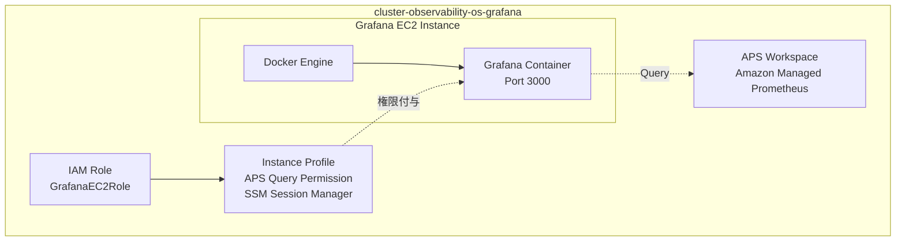
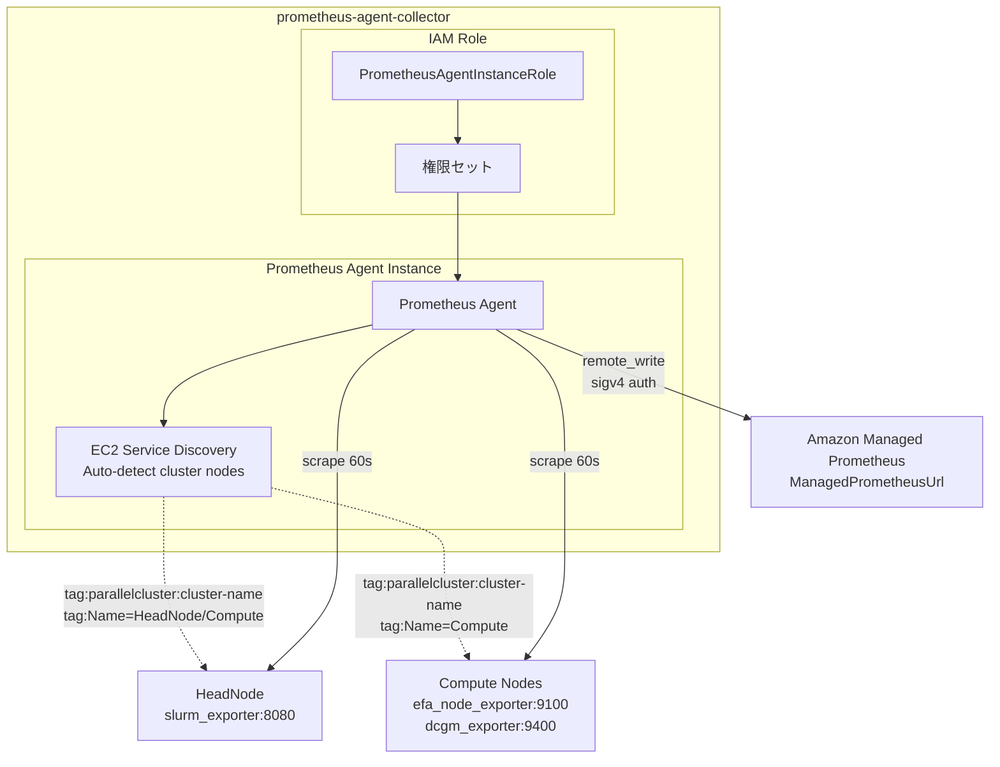

本章では、作成したクラスターの Observability 環境を構築します。

# 解説

## なぜ可観測性が必要なのか

HPC クラスターでは、複数の GPU ノードが協調して動作します。一つのノードで障害が発生すると、分散学習全体が停止することがあります。しかし、どのノードで何が起きたのかを把握できなければ、デバッグに膨大な時間がかかります。

可観測性を設定することで、以下の問題を早期に発見できます。

- GPU のメモリ不足や温度異常
- ネットワーク通信の遅延や切断
- ディスク容量の枯渇
- Slurm ジョブキューの停滞

Observability を設定していてもサイレントな障害を 100% 検知できるとは限りません。しかし、監視なしでクラスター運用することは、高速道路で目隠しをして運転するようなものです。

## アーキテクチャ

このワークショップでは、Amazon Managed Prometheus (AMP) を使った監視スタックを構築します。


:::message
図では SSM Port  Forward で Grafana ダッシュボードにアクセスしていますが、ワークショップでは SSM クライアントの設定が手間なので HTTP 経由でアクセスしておりセキュリティ観点で問題があるため実際のワークロードではそのままでは利用しないでください。
:::


### メトリクスの流れ

1. **収集**: Prometheus Agent が slurm_exporter / node_exporter から 60 秒ごとにメトリクス収集
2. **転送**: Agent が remote_write で AMP に即座に転送
3. **保存**: AMP がマネージド時系列データベースに保存
4. **可視化**: Grafana が AMP に PromQL クエリを実行してダッシュボード表示

## 使用コンポーネント

| コンポーネント | 役割 |
|------------|------|
| Amazon Managed Prometheus | マネージド型 Prometheus |
| OSS Grafana | ダッシュボードの可視化ツール |
| Prometheus Agent | メトリクス収集用の Prometheus エージェント |
| Slurm Exporter | Slurm のジョブキュー・ノード状態を公開 |
| Node Exporter | CPU・メモリ・ディスク使用率を公開 |

## Amazon Managed Prometheus

Amazon Managed Prometheus (AMP) は、Prometheus 互換のマネージドサービスです。従来のセルフホスト型 Prometheus と比較して、以下の利点があります。

**運用負荷の削減**

Prometheus をセルフホストする場合、ストレージ容量の管理、バックアップ、バージョンアップデートが必要です。AMP はこれらをすべて AWS が管理します。

**自動スケーリング**

数百ノードのクラスターでも、AMP は自動的にスケールします。セルフホスト型では、メトリクスの増加に応じて手動でストレージを拡張する必要があります。

## Prometheus Agent モード

Prometheus Agent はメトリクスを収集すると、即座に AMP に転送します。これにより、メモリ使用量が大幅に削減され、t3a.micro のような小さなインスタンスで動作します。

## EC2 Service Discovery

Prometheus Agent は **EC2 Service Discovery** を使って、ParallelCluster のノードを自動検出します。ParallelCluster が EC2 インスタンスに付与するタグを基に、監視対象を動的に発見します。

```yaml
# Prometheus Agent の設定
scrape_configs:
  - job_name: 'slurm-exporter'
    ec2_sd_configs:
      - region: us-east-1
        port: 8080
        filters:
          - name: tag:parallelcluster:cluster-name
            values: [ml-cluster]
          - name: tag:parallelcluster:node-type
            values: [HeadNode]
```

このフィルタにより、Prometheus Agent は自動的に以下を検出します。

- HeadNode の slurm_exporter (port 8080)
- ComputeFleet の node_exporter (port 9100)

ComputeFleet ノードが動的にスケールイン・スケールアウトしても、Prometheus Agent は自動的に監視対象を更新します。手動でターゲットを追加する必要はありません。

# ワークショップ実施

https://catalog.workshops.aws/ml-on-aws-parallelcluster/en-US/06-observability

:::message alert
公式ワークショップ手順を正として進めてください。
:::

CloudShell で以下のコマンドを実行し、2 つの CloudFormation スタックをデプロイします。

## Self-hosted Grafana + AMP のデプロイ

このスタックで、AMP と Grafana EC2 インスタンス（可視化ツール）を作成します。Grafana は Docker コンテナとして t2.medium 上で起動します。

**デプロイされるリソース**



```bash
source ~/env_vars

STACK_PREFIX="ml-obs"
git clone https://github.com/awslabs/awsome-distributed-training.git && cd ~/awsome-distributed-training/4.validation_and_observability/4.prometheus-grafana

aws cloudformation deploy \
  --stack-name ${STACK_PREFIX}-grafana \
  --template-file cluster-observability-os-grafana.yaml \
  --capabilities CAPABILITY_IAM \
  --region ${AWS_REGION}
```

約 2 分でデプロイ完了します。

## Prometheus Agent スタックのデプロイ

このスタックで、ParallelCluster のメトリクスを収集する Prometheus Agent インスタンスを作成します。Agent は EC2 Service Discovery で自動的にノードを検出し、60 秒ごとにメトリクスを収集して AMP に転送します。

**デプロイされるリソース**



**1. Prometheus Agent EC2 インスタンス**

Prometheus を Agent モードで実行します。Agent モードではローカルストレージを使わず、収集したメトリクスを即座に AMP へ転送します。Ubuntu 22.04 上で Prometheus 3.2.1 を systemd サービスとして起動します。

**2. EC2 Service Discovery（自動ノード検出）**

ParallelCluster のノードを自動検出する 3 つの scrape job を持ちます。

- **slurm_exporter**: HeadNode のポート 8080 から Slurm メトリクス（ジョブ数、ノード状態）を収集
- **efa_node_exporter**: Compute ノードのポート 9100 から OS メトリクス（CPU、メモリ、ネットワーク）を収集
- **dcgm_exporter**: GPU インスタンス（p4d、p5、p6 など）のポート 9400 から GPU メトリクス（利用率、温度、メモリ）を収集

検出フィルタは EC2 タグ（`parallelcluster:cluster-name`、`Name=HeadNode/Compute`）とインスタンス状態（running）を使用します。300 秒ごとにリフレッシュします。

**IAM Role と Security Groups**

- **IAM Role**: AMP への remote_write 権限、EC2 ノード検出権限、SSM Parameter からの設定読み込み権限を付与
- **PrometheusAgentSecurityGroup**: ParallelCluster ノードとの通信用。この Security Group を後で ParallelCluster 側にもアタッチします

**デプロイコマンド**

`ManagedPrometheusUrl` パラメータで、前のスタックから AMP の remote_write エンドポイントを取得し、Prometheus Agent に渡します。

```bash
# Deploy Prometheus Agent
aws cloudformation deploy \
  --stack-name ${STACK_PREFIX}-agent \
  --template-file 1click-dashboards-deployment/prometheus-agent-collector.yaml \
  --capabilities CAPABILITY_IAM \
  --parameter-overrides \
    VpcId=${VPC_ID} \
    SubnetId=${PUBLIC_SUBNET_ID} \
    ManagedPrometheusUrl=$(aws cloudformation describe-stacks \
      --stack-name ${STACK_PREFIX}-grafana \
      --region ${AWS_REGION} \
      --query 'Stacks[0].Outputs[?OutputKey==`AMPRemoteWriteURL`].OutputValue' \
      --output text) \
    PCClusterNAME=ml-cluster \
  --region ${AWS_REGION}

# スタック出力の取得
# 以下の情報を取得して環境変数に保存します：
# - AMP_REMOTE_WRITE_URL: Prometheus Agent が使う AMP の書き込み先
# - GRAFANA_INSTANCE_ID: SSM Session Manager でのアクセスに使用
# - PROMETHEUS_SG: ParallelCluster に追加する Security Group ID
# - PROMETHEUS_AGENT_ID: Agent インスタンスの ID

get_stack_output() {
  aws cloudformation describe-stacks \
    --stack-name "$1" \
    --region "${AWS_REGION}" \
    --query "Stacks[0].Outputs[?OutputKey==\`$2\`].OutputValue" \
    --output text
}

AMP_REMOTE_WRITE_URL=$(get_stack_output ${STACK_PREFIX}-grafana AMPRemoteWriteURL)
GRAFANA_INSTANCE_ID=$(get_stack_output ${STACK_PREFIX}-grafana InstanceId)
PROMETHEUS_SG=$(get_stack_output ${STACK_PREFIX}-agent PrometheusClusterSecurityGroup)
PROMETHEUS_AGENT_ID=$(get_stack_output ${STACK_PREFIX}-agent PrometheusAgentInstanceId)

# Save to env_vars
for var in AMP_REMOTE_WRITE_URL GRAFANA_INSTANCE_ID PROMETHEUS_SG PROMETHEUS_AGENT_ID; do
  echo "export ${var}=${!var}" >> ~/env_vars
done

# Display summary
printf "%-25s %s\n" "AMP Remote Write URL:" "$AMP_REMOTE_WRITE_URL"
printf "%-25s %s\n" "Grafana Instance ID:" "$GRAFANA_INSTANCE_ID"
printf "%-25s %s\n" "Prometheus SG:" "$PROMETHEUS_SG"
printf "%-25s %s\n" "Prometheus Agent ID:" "$PROMETHEUS_AGENT_ID"
```

### yq のインストール

YAML ファイルをコマンドラインで編集するツール yq をインストールします。ParallelCluster の設定ファイル（config.yaml）に node_exporter と Security Group を追加するために使用します。

:::message
この辺りは手数が多いので今後減らしたい。。
:::

```bash
YQ_VERSION=$(curl -s https://api.github.com/repos/mikefarah/yq/releases/latest | grep tag_name | cut -d '"' -f 4)
mkdir -p ~/bin
wget -q https://github.com/mikefarah/yq/releases/download/${YQ_VERSION}/yq_linux_amd64 -O ~/bin/yq
chmod +x ~/bin/yq
export PATH=$PATH:~/bin
```

### クラスター設定の更新

ParallelCluster の設定に以下の変更を加えます。

1. **OnNodeConfigured**: Compute ノード起動時に node_exporter をインストールするスクリプトを追加
2. **AdditionalSecurityGroups (Compute)**: Prometheus Agent が node_exporter（ポート 9100）にアクセスできるようにする
3. **AdditionalSecurityGroups (HeadNode)**: Prometheus Agent が slurm_exporter（ポート 8080）にアクセスできるようにする

```bash
source ~/env_vars

INSTALL_SCRIPT="https://raw.githubusercontent.com/awslabs/awsome-distributed-training/main/1.architectures/2.aws-parallelcluster/post-install-scripts/install-node-exporter.sh"

# Add node_exporter install script to the cpu compute queue
INSTALL_SCRIPT=${INSTALL_SCRIPT} yq -i \
  '(.Scheduling.SlurmQueues[0].CustomActions.OnNodeConfigured.Sequence += [{"Script": env(INSTALL_SCRIPT)}])' \
  ~/config.yaml

# Add the Prometheus Agent security group to compute nodes
PROMETHEUS_SG=${PROMETHEUS_SG} yq -i \
  '(.Scheduling.SlurmQueues[0].Networking.AdditionalSecurityGroups += [env(PROMETHEUS_SG)])' \
  ~/config.yaml

# Add the Prometheus Agent security group to HeadNode (for slurm_exporter access)
PROMETHEUS_SG=${PROMETHEUS_SG} yq -i \
  '(.HeadNode.Networking.AdditionalSecurityGroups += [env(PROMETHEUS_SG)])' \
  ~/config.yaml

# Keep one compute node running at all times so demo jobs start without bootstrap wait
yq -i \
  '(.Scheduling.SlurmQueues[0].ComputeResources[0].MinCount = 1)' \
  ~/config.yaml

yq '.Scheduling.SlurmQueues[0].CustomActions, .Scheduling.SlurmQueues[0].Networking.AdditionalSecurityGroups, .HeadNode.Networking.AdditionalSecurityGroups, .Scheduling.SlurmQueues[0].ComputeResources[0].MinCount' ~/config.yaml
```

**クラスター更新の実行**

ParallelCluster の設定変更には、ComputeFleet を一旦停止してから更新する必要があります。以下の 3 ステップで実行します。

```bash
echo "[1/3] Stopping compute fleet..."
pcluster update-compute-fleet --status STOP_REQUESTED -n ml-cluster
while [ "$(pcluster describe-cluster -n ml-cluster | jq -r '.computeFleetStatus')" != "STOPPED" ]; do
  echo "  Status: $(pcluster describe-cluster -n ml-cluster | jq -r '.computeFleetStatus')"
  sleep 10
done
echo "[1/3] Fleet stopped."

echo "[2/3] Updating cluster configuration..."
pcluster update-cluster -n ml-cluster -c ~/config.yaml
while [ "$(pcluster describe-cluster -n ml-cluster | jq -r '.clusterStatus')" != "UPDATE_COMPLETE" ]; do
  echo "  Status: $(pcluster describe-cluster -n ml-cluster | jq -r '.clusterStatus')"
  sleep 15
done
echo "[2/3] Update complete."

echo "[3/3] Starting compute fleet..."
pcluster update-compute-fleet --status START_REQUESTED -n ml-cluster
while [ "$(pcluster describe-cluster -n ml-cluster | jq -r '.computeFleetStatus')" != "RUNNING" ]; do
  echo "  Status: $(pcluster describe-cluster -n ml-cluster | jq -r '.computeFleetStatus')"
  sleep 10
done
echo "[3/3] Fleet running."
```

## HeadNode のセットアップ

HeadNode に slurm_exporter をインストールします。slurm_exporter は Slurm のジョブキュー状態やノード状態を Prometheus メトリクス形式で公開するツールです。

Go 言語で書かれているため、Go をインストールしてからビルドします。ポート 8080 で起動し、Prometheus Agent が 60 秒ごとに収集します。

```bash
pcluster ssh -n ml-cluster -i ~/.ssh/id_rsa_pcluster
```

```bash
sudo bash -c '
set -e

# Install Go
GO_VERSION="1.21.6"
wget -q https://go.dev/dl/go${GO_VERSION}.linux-amd64.tar.gz -O /tmp/go.tar.gz
tar -C /usr/local -xzf /tmp/go.tar.gz
export PATH=$PATH:/usr/local/go/bin

# Build slurm_exporter
cd /tmp
git clone https://github.com/vpenso/prometheus-slurm-exporter.git
cd prometheus-slurm-exporter
/usr/local/go/bin/go build -o /usr/local/bin/prometheus-slurm-exporter .

# Create systemd service
cat > /etc/systemd/system/prometheus-slurm-exporter.service << EOF
[Unit]
Description=Prometheus Slurm Exporter
After=network.target

[Service]
User=nobody
Environment=PATH=/opt/slurm/bin:/usr/local/sbin:/usr/local/bin:/usr/sbin:/usr/bin:/sbin:/bin
ExecStart=/usr/local/bin/prometheus-slurm-exporter
Restart=on-failure

[Install]
WantedBy=multi-user.target
EOF

systemctl daemon-reload
systemctl enable prometheus-slurm-exporter
systemctl start prometheus-slurm-exporter
echo "[OK] Slurm Exporter started on port 8080"
'
```

**slurm_exporter の動作確認**

HeadNode 上で slurm_exporter が正しく起動しているか確認します。`slurm_` で始まるメトリクスが表示されれば成功です。

```bash
curl -s http://localhost:8080/metrics | grep "^slurm_" | head -5
```

**Security Group の設定**

CloudShell に戻ります。

HeadNode の Security Group にポート 8080 の ingress rule を追加し、Prometheus Agent からのアクセスを許可します。

```bash
source ~/env_vars

# HeadNode の Security Group ID を取得
# Prometheus Agent の Security Group からのアクセスを許可
HEAD_NODE_SG=$(aws ec2 describe-instances \
  --filters \
    "Name=tag:parallelcluster:node-type,Values=HeadNode" \
    "Name=tag:parallelcluster:cluster-name,Values=ml-cluster" \
  --query 'Reservations[0].Instances[0].SecurityGroups[0].GroupId' \
  --output text)

aws ec2 authorize-security-group-ingress \
  --group-id ${HEAD_NODE_SG} \
  --protocol tcp \
  --port 8080 \
  --source-group ${PROMETHEUS_SG} 2>/dev/null || echo "[OK] Firewall rule already exists"

echo "[OK] Prometheus Agent will automatically discover the Head Node via EC2 Service Discovery"
```

**Grafana へのアクセス設定**

ブラウザから Grafana にアクセスするため、自分の IP アドレスを確認します。

```
https://checkip.amazonaws.com
```

Grafana の Security Group に、自分の IP アドレスからのポート 3000 へのアクセスを許可します。

:::message alert
本番環境では SSM Session Manager 経由でのアクセスを推奨します。Public IP + ポート開放はワークショップ用の簡易設定です。
:::

```bash
source ~/env_vars

MY_IP="<YOUR_IP>"

GRAFANA_SG=$(aws ec2 describe-instances \
  --instance-ids ${GRAFANA_INSTANCE_ID} \
  --query 'Reservations[0].Instances[0].SecurityGroups[0].GroupId' \
  --output text)

aws ec2 authorize-security-group-ingress \
  --group-id ${GRAFANA_SG} \
  --protocol tcp \
  --port 3000 \
  --cidr ${MY_IP}/32 2>/dev/null || echo "[OK] Rule already exists"

echo "export GRAFANA_SG=${GRAFANA_SG}" >> ~/env_vars
echo "Opened port 3000 for ${MY_IP}"
```

**Grafana URL の取得**

CloudFormation の出力から Grafana の URL を取得します。

```bash
GRAFANA_URL=$(aws cloudformation describe-stacks \
  --stack-name ${STACK_PREFIX}-grafana \
  --query 'Stacks[0].Outputs[?OutputKey==`GrafanaInstanceAddress`].OutputValue' \
  --output text)

echo "Grafana URL: $GRAFANA_URL"
```

出力例: `http://54.123.45.67:3000`

**Grafana へのログイン**

ブラウザで上記 URL を開き、初回ログイン情報を入力します。

- **Username**: admin
- **Password**: admin


初回ログイン後、パスワード変更を求められます。新しいパスワードを設定してください。

:::message
これ以降の作業はインフラ構成の補足説明は特にないため公式ワークショップを見ながら作業を進めてください。
:::

# まとめ

本章では、Amazon Managed Prometheus と Self-managed Grafana を使った可観測性スタックを構築しました。

:::message alert
Basic01 の CPU ベースの分散学習ワークショップはこれで完了です！今後 GPU 版のワークショップなども追加していこうと思います。
:::