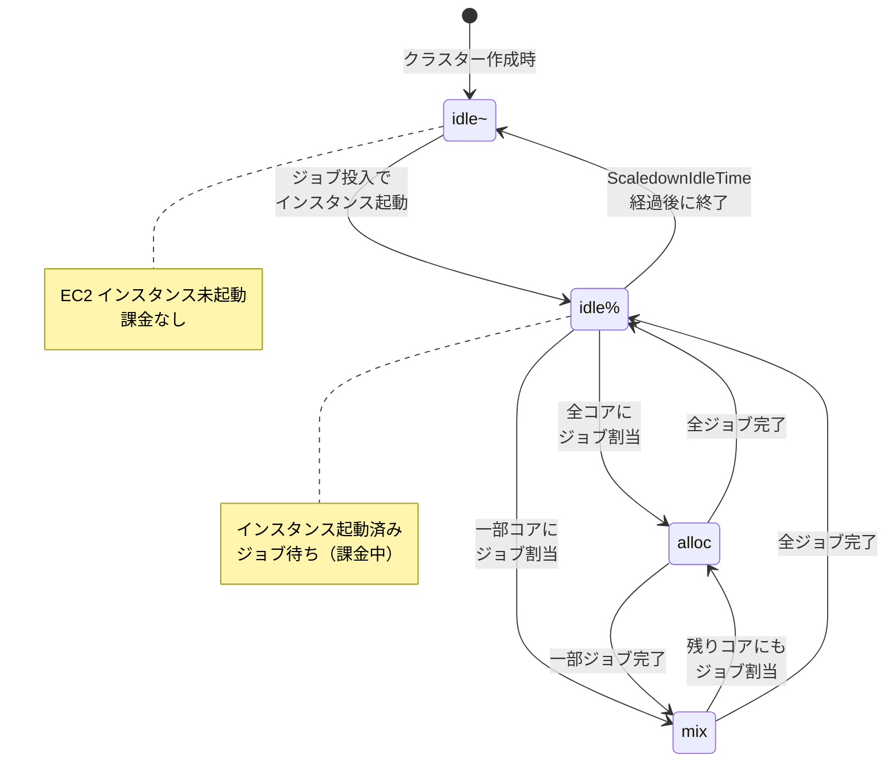

# 解説

https://zenn.dev/tosshi/books/aws-parallelcluster-workshop/viewer/aws-parallelcluster-workshop-02-cluster

AWS ParallelCluster の CLI や Slurm の解説については上記の Basic01 - Create Cluster を確認してください。今回の Capacity block for ML の設定が追加される点、trn2.3xlarge を指定する点などが異なります。

## Neuron SDK インストールスクリプトの準備

:::message
Neuron SDK が使いたいなら DLAMI 使えば良いのになんでインストールスクリプトを作るの？と思われた方もいるかと思います。ParallelCluster が必要とするコンポーネント（e.g. cfn-init、Slurm) が DLAMI に含まれてないため HeadNode 起動時に `HeadNodeWaitCondition` してしまいます。そのため以降で解説するカスタム AMI を作るか、Compute ノードの起動時にインストールスクリプトを実行する方法をとります。
:::

**インストールスクリプトの URL**

```
https://raw.githubusercontent.com/littlemex/samples/main/aws-neuron/setup/install-neuron-sdk-2.29.sh
```

このスクリプトは以下を自動で実行します

- Neuron APT リポジトリのセットアップ
- Neuron SDK 2.29 パッケージのインストール (aws-neuronx-dkms, aws-neuronx-collectives, aws-neuronx-runtime-lib, aws-neuronx-tools)
- Python 3.10 環境の構築 (/opt/neuron_venv)
- PyTorch Neuron のインストール (torch-neuronx==2.6.*, neuronx-cc==2.*)
- NKI 0.3.0 のインストール (neuronx-cc の依存関係として自動)

:::message
このスクリプトは次の章（NKI Test）で Slurm ジョブから自動実行されます。手動でダウンロードや S3 アップロードを行う必要はありません。
:::

## Neuron SDK のインストール方法（2 つの選択肢）

Neuron SDK を Compute nodes にインストールする方法は 2 つあります。

### 選択肢 A: カスタム AMI を事前ビルド

ParallelCluster が使用できる形式で Neuron SDK がインストールされた AMI を事前作成します。

**メリット**
- Compute nodes の起動が高速
- 再現性が高い

**デメリット**
- AMI ビルドに 45-60 分かかる
- リージョンごとにビルドが必要

::::details （参考）カスタム AMI ビルド方法（選択肢 A）

:::message alert
**Deep Learning AMI（DLAMI）について**: DLAMI を ParallelCluster の `CustomAmi` として直接使用することはできません。DLAMI には ParallelCluster が必要とするコンポーネント（cfn-init, Slurm, cookbook, supervisord）が含まれていないためです。必ず ParallelCluster 公式 AMI をベースにして `pcluster build-image` を使用してください。
:::

### ParallelCluster 公式 AMI の確認

sa-east-1 リージョンの ParallelCluster 公式 Ubuntu 22.04 AMI を確認します。

```bash
# ParallelCluster 公式 AMI の検索
aws ec2 describe-images \
  --region sa-east-1 \
  --owners amazon \
  --filters "Name=name,Values=aws-parallelcluster-3*-ubuntu-2204-*" \
  --query 'Images | sort_by(@, &CreationDate) | [-1].[ImageId,Name]' \
  --output table
```

出力例:

```
------------------------------------------------------------------------------------------------
|                                        DescribeImages                                        |
+----------------------------------------------------------------------------------------------+
|  ami-0964aad5fd6683349                                                                       |
|  aws-parallelcluster-3.15.0-ubuntu-2204-lts-hvm-arm64-202603201600 2026-03-20T16-03-44.479Z  |
+----------------------------------------------------------------------------------------------+
```

この AMI ID を次の設定ファイルで使用します。

### カスタム AMI ビルド設定

`neuron-image-config.yaml`

```yaml
Build:
  InstanceType: c5.xlarge
  ParentImage: ami-0c7f6f4c0b8c0e8e8  # ParallelCluster 公式 Ubuntu 22.04 AMI (sa-east-1)
  SubnetId: subnet-0abcdef1234567890   # Getting Started で取得した SubnetId に置換
  SecurityGroupIds:
    - sg-0123456789abcdef0            # デフォルト Security Group ID に置換
  Components:
    - Type: script
      Value: s3://pcluster-trn2-workshop-1234567890/scripts/install-neuron-sdk.sh
  UpdateOsPackages:
    Enabled: true

Image:
  Name: pcluster-neuron-sdk-2-29-ubuntu2204-sa-east-1
  Tags:
    - Key: Project
      Value: parallelcluster-workshop
    - Key: NeuronSDK
      Value: "2.29"
```

### AMI ビルド実行

```bash
pcluster build-image \
  --image-id pcluster-neuron-2-29-sa-east-1 \
  --image-configuration neuron-image-config.yaml \
  --region sa-east-1
```

ビルドには約 45-60 分かかります。ステータス確認

```bash
pcluster describe-image \
  --image-id pcluster-neuron-2-29-sa-east-1 \
  --region sa-east-1 \
  --query imageBuildStatus \
  --output text
```

`BUILD_COMPLETE` になったら、AMI ID を取得

```bash
export CUSTOM_AMI_ID=$(pcluster describe-image \
  --image-id pcluster-neuron-2-29-sa-east-1 \
  --region sa-east-1 \
  --query 'image.ec2AmiInfo.amiId' \
  --output text)

echo "Custom AMI ID: $CUSTOM_AMI_ID"
# 出力例: Custom AMI ID: ami-0987654321fedcba0
```

**ビルド中のログ確認方法**

Image Builder のログを確認するには、以下のコマンドを使用します。

```bash
# CloudWatch Logs でログを確認
aws logs tail /aws/imagebuilder/pcluster-neuron-2-29-sa-east-1 \
  --follow \
  --region sa-east-1
```

::::

### 選択肢 B: Compute nodes で直接インストール（今回使用）

Slurm ジョブ実行時に Neuron SDK を自動インストールします。

**メリット**
- クラスター作成が即座に可能
- AMI ビルド不要

**デメリット**
- 初回ジョブ実行時にインストール時間（10-15分）がかかる

**今回のワークショップでは選択肢 B を使用します。** カスタム AMI ビルドをスキップして、クラスター作成に進みます。

# ワークショップ実施

AWS CloudShell で実施します。

## Install AWS ParallelCluster CLI

https://catalog.workshops.aws/ml-on-aws-parallelcluster/en-US/03-cluster/01-pc-cli-install

::::details CLI インストール
```bash
pip3 install -U "aws-parallelcluster==3.14.2"
pcluster version
```
::::

## Create a Cluster

先ほど解説した設定でクラスターを作成します。大体 20-25 分くらいで作成が完了します。

https://catalog.workshops.aws/ml-on-aws-parallelcluster/en-US/03-cluster/02-setup-cluster

::::details クラスター作成

すでにデプロイしたインフラの設定情報を収集して環境変数を設定します。

```bash
cd ~/samples/aws-neuron/parallelcluster
bash create_config_mlcb.sh $CR_ID
source env_vars
```

```bash
source env_vars && cat > config.yaml << EOF
Region: ${AWS_REGION}
Image:
  Os: ubuntu2204
HeadNode:
  InstanceType: m5.8xlarge
  Networking:
    SubnetId: ${HEAD_NODE_SUBNET_ID}
    AdditionalSecurityGroups:
      - ${SECURITY_GROUP}
  Ssh:
    KeyName: ${KEY_NAME}
  LocalStorage:
    RootVolume:
      Size: 500
      DeleteOnTermination: true
  Iam:
    AdditionalIamPolicies:
      - Policy: arn:aws:iam::aws:policy/AmazonSSMManagedInstanceCore
      - Policy: arn:aws:iam::aws:policy/AmazonS3ReadOnlyAccess
      - Policy: arn:aws:iam::aws:policy/AmazonEC2ContainerRegistryReadOnly
  CustomActions:
    OnNodeConfigured:
      Sequence:
        - Script: 'https://raw.githubusercontent.com/aws-samples/aws-parallelcluster-post-install-scripts/main/docker/postinstall.sh'
        - Script: 'https://raw.githubusercontent.com/aws-samples/aws-parallelcluster-post-install-scripts/main/pyxis/postinstall.sh'
Scheduling:
  Scheduler: slurm
  SlurmSettings:
    QueueUpdateStrategy: DRAIN
    CustomSlurmSettings:
      - JobCompType: jobcomp/filetxt
      - JobCompLoc: /home/slurm/slurm-job-completions.txt
      - JobAcctGatherType: jobacct_gather/linux
  SlurmQueues:
    - Name: compute-trn2
      CapacityType: CAPACITY_BLOCK
      Networking:
        SubnetIds:
          - ${PRIVATE_SUBNET_ID}
        PlacementGroup:
          Enabled: false  # Capacity Block does not support Placement Groups
        AdditionalSecurityGroups:
          - ${SECURITY_GROUP}
      ComputeSettings:
        LocalStorage:
          EphemeralVolume:
            MountDir: /scratch  # trn2.3xlarge NVMe local storage
          RootVolume:
            Size: 512
      JobExclusiveAllocation: true  # Required for NeuronCore exclusive access
      ComputeResources:
        - Name: distributed-ml
          InstanceType: ${INSTANCE_TYPE}
          MinCount: ${INSTANCE_COUNT}
          MaxCount: ${INSTANCE_COUNT}
          Efa:
            Enabled: true
          CapacityReservationTarget:
            CapacityReservationId: ${CR_ID}
      CustomActions:
        OnNodeConfigured:
          Sequence:
            - Script: 'https://raw.githubusercontent.com/aws-samples/aws-parallelcluster-post-install-scripts/main/docker/postinstall.sh'
            - Script: 'https://raw.githubusercontent.com/aws-samples/aws-parallelcluster-post-install-scripts/main/pyxis/postinstall.sh'
            - Script: 'https://raw.githubusercontent.com/littlemex/samples/main/aws-neuron/setup/install-neuron-sdk-2.29.sh'
SharedStorage:
  - Name: HomeDirs
    MountDir: /home
    StorageType: FsxOpenZfs
    FsxOpenZfsSettings:
      VolumeId: ${FSXO_ID}
  - MountDir: /fsx
    Name: fsx
    StorageType: FsxLustre
    FsxLustreSettings:
      FileSystemId: ${FSX_ID}
Monitoring:
  DetailedMonitoring: true
  Logs:
    CloudWatch:
      Enabled: true
  Dashboards:
    CloudWatch:
      Enabled: true
Tags:
  - Key: 'Project'
    Value: 'ParallelCluster-Trainium2'
  - Key: 'ManagedBy'
    Value: 'ParallelCluster'
EOF
```

```bash
pcluster create-cluster -n ml-cluster -c config.yaml
pcluster list-clusters
```
::::

## Connect to the Cluster

作成されたクラスターに接続しましょう。

```bash
[ ! -f ~/.ssh/id_rsa_pcluster ] && ssh-keygen -t rsa -b 4096 -f ~/.ssh/id_rsa_pcluster -N "" || true; instance_id=$(pcluster describe-cluster -n ml-cluster --region ${AWS_REGION} | jq -r '.headNode.instanceId') && pubkey=$(cat ~/.ssh/id_rsa_pcluster.pub) && cmd_id=$(aws ssm send-command --region ${AWS_REGION} --instance-ids "$instance_id" --document-name "AWS-RunShellScript" --parameters "{\"commands\":[\"sudo su - ubuntu -c 'mkdir -p ~/.ssh && chmod 700 ~/.ssh && echo $pubkey >> ~/.ssh/authorized_keys && chmod 600 ~/.ssh/authorized_keys'\"]}" --query 'Command.CommandId' --output text) && echo "Deploying key (ID: $cmd_id)..." && aws ssm wait command-executed --region ${AWS_REGION} --command-id "$cmd_id" --instance-id "$instance_id" && echo "Done!" && pcluster ssh -n ml-cluster --region ${AWS_REGION} -i ~/.ssh/id_rsa_pcluster

# 二回目以降
pcluster ssh -n ml-cluster --region ${AWS_REGION} -i ~/.ssh/id_rsa_pcluster
```

## Get to know your Cluster

Slurm を操作する上で最初に覚えるべきコマンドは 4 つです。

**sinfo -- パーティションとノードの状態確認**

`sinfo` は、クラスター全体の構成とノードの状態を一覧表示します。パーティション（Partition）とは、ノードをグループ化した論理的な区画です。たとえば CPU 用と GPU 用でパーティションを分けることで、ジョブの種類に応じた適切なリソース割り当てが可能になります。

```bash
$ sinfo
PARTITION   AVAIL  TIMELIMIT  NODES  STATE NODELIST
compute*       up   infinite      2  idle~ compute-dy-g5-8xlarge-[1-2]
```

ここで `compute*` の `*` はデフォルトパーティションであることを示します。`idle~` はノードがまだ起動していない状態です。

**squeue -- ジョブキューの確認**

`squeue` は、現在キューに入っているジョブの一覧を表示します。ジョブの状態（実行中、待機中など）、実行時間、割り当てられたノードを確認できます。

```bash
$ squeue
JOBID PARTITION  NAME     USER  ST   TIME  NODES NODELIST(REASON)
  42   compute  train   ubuntu   R   5:23      2 compute-dy-g5-8xlarge-[1-2]
  43   compute  eval    ubuntu  PD   0:00      1 (Resources)
```

`ST` 列の `R` は Running（実行中）、`PD` は Pending（待機中）を意味します。`CF` は Configuring（設定中）を意味し、ジョブに計算資源（ノード）が割り当てられたものの、そのノードがまだ利用可能になるのを待機している状態です。ポストインストールスクリプト実行中はこのステートになります。

**sbatch -- ジョブの投入**

`sbatch` は、ジョブスクリプトをキューに投入するコマンドです。ジョブスクリプトは通常の bash スクリプトの先頭に `#SBATCH` ディレクティブでリソース要件を記述したものです。

```bash
#!/bin/bash
#SBATCH --job-name=train
#SBATCH --nodes=2
#SBATCH --ntasks-per-node=1
#SBATCH --partition=compute

srun torchrun --nproc_per_node=1 train.py
```

このスクリプトを `sbatch train.sbatch` で投入すると、Slurm は要求されたリソース（2 ノード）が確保でき次第、自動的にジョブを開始します。ParallelCluster 環境では、ノードが起動していなければインスタンスの起動から自動で行われます。

**scancel -- ジョブのキャンセル**

`scancel` は、投入済みのジョブをキャンセルします。`squeue` で確認した JOBID を指定します。

```bash
$ scancel 43
```

実行中のジョブもキャンセル可能です。ParallelCluster では、キャンセルによりノードが不要になった場合、後述する ScaledownIdleTime の経過後にインスタンスが自動的に終了します。

### ノードの状態の意味

ParallelCluster 環境では、ノードの状態がクラウドインスタンスのライフサイクルと連動しています。以下は、主要な状態間の遷移を示します。



**idle~** はインスタンスが起動していない状態です。ParallelCluster のクラスター作成直後は、すべてのコンピュートノードがこの状態になります。EC2 インスタンスが存在しないため、課金は発生しません。ジョブが投入されると、ParallelCluster が自動的にインスタンスを起動し、次の状態に遷移します。

**idle%** はインスタンスが起動済みでジョブを待っている状態です。パーセント記号（`%`）は「起動処理中」または「起動済みだがアイドル」を意味します。この状態ではインスタンスが存在するため課金が発生しますが、計算リソースは使われていません。

**mix** は、ノードが持つ CPU コア（またはリソーススロット）の一部がジョブに割り当てられている状態です。たとえば 16 コアのノードで 8 コア分のジョブが動いている場合、残り 8 コアは別のジョブを受け入れ可能です。

**alloc** は、ノードのすべてのコアがジョブに割り当てられている状態です。このノードに新しいジョブを割り当てることはできません。全ジョブが完了すると idle% に戻ります。

### ScaledownIdleTime

ParallelCluster の大きな特徴は、クラウドインスタンスの自動スケーリングです。その制御パラメータの一つが **ScaledownIdleTime** で、デフォルト値は 10 分です。

この値は、ノードがアイドル状態（idle%）になってからインスタンスを終了するまでの待機時間を意味します。なぜ即座に終了しないのでしょうか。理由は 2 つあります。

第一に、インスタンスの起動には時間がかかります。ParallelCluster では、EC2 インスタンスの起動、OS の初期化、Slurm デーモンの登録を経てノードが利用可能になるまで数分を要します。もしジョブが完了するたびに即座にインスタンスを終了すると、次のジョブ投入時に再度この起動待ちが発生します。連続してジョブを投入するワークフローでは、この起動待ちが大きなオーバーヘッドになります。

第二に、コスト最適化の観点です。AWS の EC2 は秒単位の課金ですが、インスタンスの起動・終了を繰り返すと、起動処理中の無駄な課金時間が累積します。10 分の cooldown 期間を設けることで、短い間隔で連続するジョブを同一インスタンスで処理でき、総合的なコスト効率が向上します。

一方で、ScaledownIdleTime を長く設定しすぎると、使われていないインスタンスが長時間課金され続けるリスクがあります。ワークロードの特性に応じた適切な値の設定が重要です。学習ジョブを頻繁に投入する実験フェーズでは長めに、単発のバッチ処理では短めに設定するのが一般的な指針です。

# まとめ

クラスターを作成して HeadNode にログイン、Slurm コマンドを理解しました。