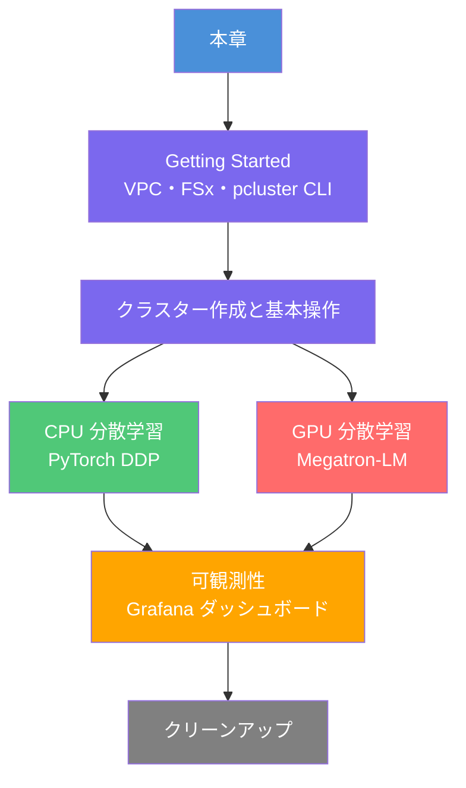
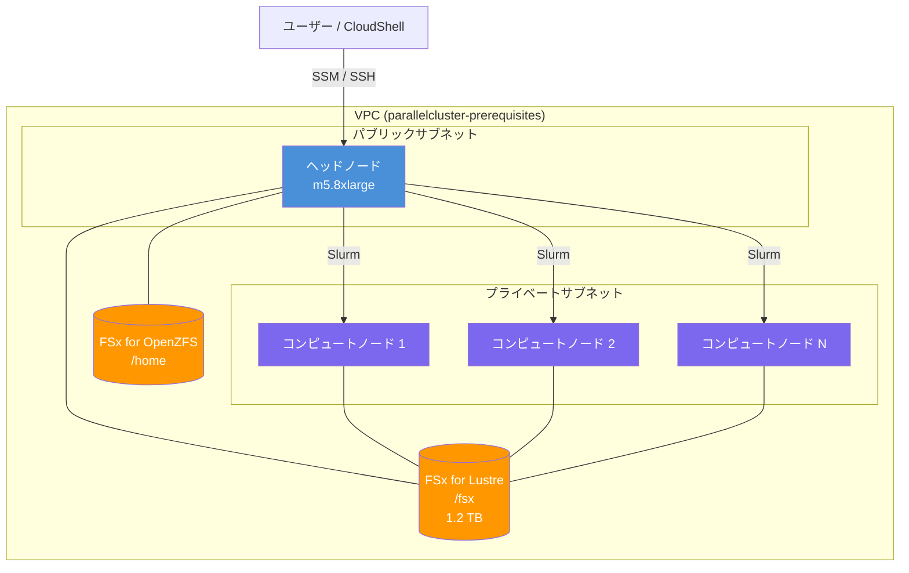

本章では、AWS ParallelCluster ワークショップの全体構成と進め方を説明します。AWS 上で機械学習クラスターを構築し、CPU および GPU を使った分散学習を実際に動かすまでの道筋を示します。

# ワークショップの概要

このワークショップは、[AWS 公式ワークショップ](https://catalog.workshops.aws/ml-on-aws-parallelcluster/en-US) をベースに、AWS ParallelCluster を用いたモデルトレーニングの手順をワークショップ形式でまとめたものです。

AWS ParallelCluster は、 ハイパフォーマンスコンピューティング (HPC) クラスターのデプロイと管理に役立つ、 AWS にサポートされているオープンソースのクラスター管理ツールです。必要なコンピューティングリソース、スケジューラ、共有ファイルシステムが自動的に設定されます。 AWS Batch および Slurm スケジューラを使用できます。

https://docs.aws.amazon.com/parallelcluster/latest/ug/what-is-aws-parallelcluster.html

# 本ワークショップで学べること

- AWS ParallelCluster を使った HPC クラスターの構築
- FSx for Lustre による共有ファイルシステムの活用
- Slurm によるジョブスケジューリングの基本操作
- CPU インスタンスを使った PyTorch DDP 分散学習
- GPU インスタンスを使った Megatron-LM による大規模 GPT 事前訓練
- Prometheus と Grafana によるクラスターの可観測性（Observability）の実装

---

# 全体構成

# 2 つの進め方

ワークショップには **AWS 主催イベント** と **自己所有アカウント** の 2 つの進め方があります。

## AWS 主催イベントで参加する場合

https://catalog.workshops.aws/ml-on-aws-parallelcluster/en-US/01-getting-started/01-aws-event

AWS が一時的な AWS アカウントを提供します。このアカウントはイベント期間中のみ有効です。

- コストは AWS 側で負担されるため、**参加者の費用はゼロ**
- イベントの制約上、基本的に **CPU インスタンスのみ**使用可能

## 自己所有アカウントで進める場合

https://catalog.workshops.aws/ml-on-aws-parallelcluster/en-US/01-getting-started/02-own-account

自分の AWS アカウントを使ってセルフペースで進める方法です。

- GPU インスタンス（g5.8xlarge など）を使ったトレーニングが可能
- 以下のコストが発生することに注意してください

:::message alert
コスト概算（自己所有アカウントの場合）:

- ヘッドノード（m5.8xlarge）: 約 $1.60/時間
- CPU コンピュートノード（c5.4xlarge x 4）: 約 $0.68/時間 x 4 = $2.72/時間
- FSx for Lustre（1.2 TB）: 約 $0.145/GB/月 = 約 $174/月（クラスターを削除するまで継続課金）
- FSx for OpenZFS（ホームディレクトリ）: 別途課金
- GPU コンピュートノード（g5.8xlarge、本ワークショップ推奨）: 約 $2.00/時間

**ワークショップ完了後は必ずクリーンアップを実施してください。** FSx はクラスターを停止しても課金が継続します（削除が必要）。
:::

---

# 必要なもの

## 共通

- AWS アカウント（自己所有アカウントの場合）または AWS イベントアカウント
- Windows、Mac OS X、または Linux を搭載した PC
- Chrome、Firefox、Safari、Opera、Edge などのモダンブラウザ
- 基本的な Linux コマンドの知識

## 自己所有アカウントの追加要件

- AdministratorAccess 相当の IAM 権限（または以下のサービスへのアクセス権）
  - Amazon EC2（インスタンス起動・停止）
  - AWS CloudFormation（スタック作成・削除）
  - Amazon FSx（ファイルシステム作成・削除）
  - Amazon VPC（VPC・サブネット・セキュリティグループ管理）
  - AWS Systems Manager（Session Manager 経由のアクセス）
- 必要に応じて GPU インスタンスのサービスクォータ引き上げ申請

---

# アーキテクチャ概要

ワークショップで構築するインフラの全体像を示します。

### 主要コンポーネントの説明

| コンポーネント | 説明 |
|------------|------|
| ヘッドノード | Slurm マスターノード。ジョブ受付・スケジューリングを担当。SSM 経由で接続する |
| コンピュートノード | Slurm ワーカーノード。ジョブ投入時にオンデマンドで起動し、アイドル後に自動削除 |
| FSx for Lustre | 高性能並列ファイルシステム。`/fsx` にマウントされ全ノードで共有 |
| FSx for OpenZFS | `/home` ディレクトリ用の共有ストレージ |
| Slurm | ジョブスケジューラー。`sbatch`・`squeue`・`sinfo` などのコマンドでジョブを管理 |

---

# 各章への誘導

## Step 1: Getting Started

まずはインフラを構築します。CloudFormation テンプレートで VPC と FSx を作成し、pcluster CLI をインストールします。

[次の章へ: Getting Started - VPC・FSx・pcluster CLI のセットアップ](./aws-parallelcluster-workshop-01-getting-started)

## Step 2: クラスターの作成

`config.yaml` を作成し、pcluster CLI でクラスターを起動します。Slurm の基本操作も確認します。

[次の章へ: クラスターの作成と基本操作](./aws-parallelcluster-workshop-02-cluster)

## Step 3: CPU 分散学習

AWS イベント参加者もすぐに試せる、CPU インスタンスでの PyTorch DDP 分散学習を実行します。

[次の章へ: CPU で始める分散学習](./aws-parallelcluster-workshop-03-cpu-training)

## Step 4: GPU 分散学習

Megatron-LM を使って 7.5B GPT モデルを GPU クラスターで事前訓練します。自己所有アカウントが必要です。

[次の章へ: GPU 分散学習](./aws-parallelcluster-workshop-04-gpu-training)

## Step 5: 可観測性

Grafana ダッシュボードを構築し、クラスターのメトリクスをリアルタイムで監視します。

[次の章へ: クラスターの可観測性](./aws-parallelcluster-workshop-05-observability)

## Step 6: クリーンアップ

ワークショップ完了後は、コスト削減のためクラスターとインフラを削除します。

[次の章へ: クリーンアップ](./aws-parallelcluster-workshop-06-cleanup)

---

# 参考資料

- [AWS ParallelCluster ワークショップ（公式）](https://catalog.workshops.aws/ml-on-aws-parallelcluster/en-US)
- [AWS ParallelCluster ドキュメント](https://docs.aws.amazon.com/parallelcluster/latest/ug/what-is-aws-parallelcluster.html)
- [awsome-distributed-training（GitHub）](https://github.com/aws-samples/awsome-distributed-training)
- [Slurm Quick Start User Guide](https://slurm.schedmd.com/quickstart.html)
