::::details EFA の裏側
# AWS Elastic Fabric Adapter (EFA) -- 入門: 高性能ネットワーキング技術の詳細解説

## EFA の概要

Amazon Web Services (AWS) の Elastic Fabric Adapter (EFA) は、AI/ML (人工知能・機械学習) および HPC (ハイパフォーマンスコンピューティング) ワークロード向けに設計された高性能ネットワークインターフェースです。EFA は従来のクラウド環境における TCP/IP ベースの通信と比較して、大幅に低いレイテンシーと高いスループットを実現します。

EFA の最大の特徴は、オンプレミスの HPC クラスターと同等のネットワークパフォーマンスを AWS クラウド環境で提供することです。これは AWS が独自開発した Scalable Reliable Datagram (SRD) プロトコルと、AWS Nitro System のハードウェアオフロード機能により実現されています。

### 従来の課題と EFA による解決

従来のクラウド環境では、仮想化オーバーヘッドと TCP/IP スタックの制約により、HPC や分散機械学習に必要な低レイテンシー通信の実現が困難でした。特に以下の課題がありました。

**従来の TCP/IP における課題**
- Head-of-line blocking: 単一パケットロスが後続パケット全体をブロックする問題
- 単一パス制約: TCP は基本的に単一パスを使用し、ネットワークの並列性を活用できない
- 保守的な再送タイムアウト: ミリ秒単位の RTO (Retransmission Timeout) はマイクロ秒レベルのデータセンター環境では過剰
- OS kernel のオーバーヘッド: システムコールや割り込み処理による CPU 負荷

EFA はこれらの課題を、OS-bypass アーキテクチャ、SRD プロトコル、ハードウェアオフロードの組み合わせにより解決します。

## アーキテクチャの詳細

### Scalable Reliable Datagram (SRD) プロトコル

SRD は AWS が独自開発した通信プロトコルで、データセンター環境に最適化された設計となっています。SRD の核となる設計思想は、信頼性を保証しながらも Out-of-order (順序外) 配信を許容することです。

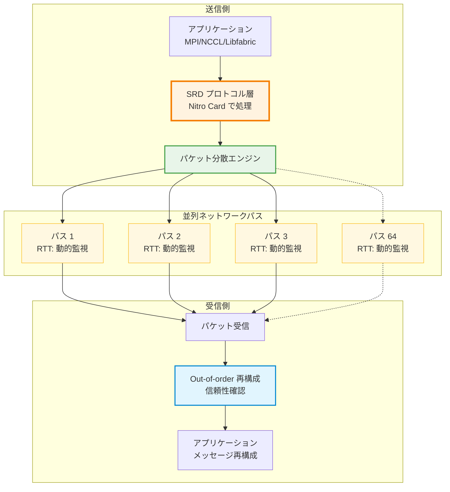

**SRD の主要な特徴**

1. **Out-of-order パケット配信**: SRD はパケットの到達順序を保証しません。これにより、単一パケットのロスや遅延が後続パケットの処理をブロックする head-of-line blocking 問題を回避します。順序の再構成はアプリケーション層で実施されます。

2. **インテリジェントマルチパス転送**: SRD は単一の論理フローを最大 64 の並列パスに分散して転送します。各パスの RTT (Round-Trip Time) を継続的に監視し、混雑したパスから高速なパスへ動的に切り替えます。

3. **サブミリ秒レベルの再送制御**: 従来の TCP では RTO が数ミリ秒であるのに対し、SRD は AWS Nitro System のハードウェア実装により、サブミリ秒レベルでのパケット再送を実現します。

4. **プロアクティブな輻輳制御**: SRD は「予防は治療に勝る」という設計哲学に基づき、スイッチのキュー長を最小限に保つことで、輻輳の発生を事前に防ぎます。

### Out-of-order 転送の仕組み

従来の TCP と SRD の動作を比較すると、Out-of-order 転送の利点が明確になります。

```mermaid
graph TB
    subgraph "TCP (In-order 配信)"
        T1[送信: パケット 1,2,3,4,5]
        T2[パケット 3 がロス]
        T3[パケット 1,2 は到達<br/>パケット 4,5 は待機]
        T4[パケット 3 の再送待ち<br/>数ミリ秒の遅延]
        T5[全パケット到達後<br/>アプリケーションに配信]
        
        T1 --> T2
        T2 --> T3
        T3 --> T4
        T4 --> T5
    end
    
    subgraph "SRD (Out-of-order 配信)"
        S1[送信: パケット 1,2,3,4,5<br/>複数パスに分散]
        S2[パケット 3 がロス]
        S3[パケット 1,2,4,5 は即座に配信]
        S4[パケット 3 のみ再送<br/>サブミリ秒で完了]
        S5[アプリケーション層で再構成]
        
        S1 --> S2
        S2 --> S3
        S3 --> S4
        S4 --> S5
    end
    
    style T4 fill:#ffebee,stroke:#c62828,stroke-width:3px
    style S4 fill:#e8f5e9,stroke:#43a047,stroke-width:3px
```

この仕組みにより、SRD は P99.9 テールレイテンシーを 85% 削減することに成功しています。これは、HPC や ML ワークロードにおいて、クラスター全体のパフォーマンスが最も遅いノードに律速される問題 (BSP: Bulk Synchronous Parallel モデル) を大幅に改善します。

### マルチパスルーティングの動的制御

SRD のマルチパスルーティングは、従来の ECMP (Equal-Cost Multi-Path routing) による静的な負荷分散を超えた、動的な最適化を実現します。

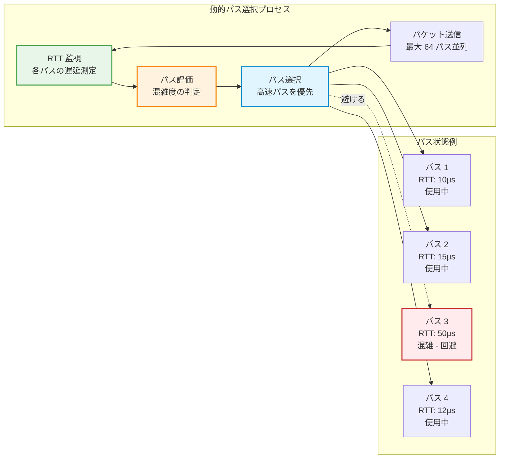

**マルチパスの利点**
- 自然な負荷分散: トラフィックが複数のリンクに分散され、単一リンクのホットスポット発生確率が低減
- 耐障害性の向上: 単一リンクの障害が全体の通信を中断しない
- スケーラビリティ: クラスターが大きくなるほど利用可能なパス数が増加し、パフォーマンスが向上

### Kernel Bypass (OS-bypass) アーキテクチャ

EFA の高パフォーマンスを支える基盤技術の一つが、OS kernel を経由しないデータパスです。

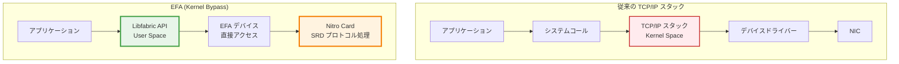

**Kernel Bypass の利点**
- CPU オーバーヘッドの削減: システムコールや割り込み処理、コンテキストスイッチが不要
- 決定論的な実行環境: OS のスケジューリングによる性能ジッターを排除
- 低レイテンシー: ユーザー空間から直接ハードウェアにアクセス可能

EFA は Libfabric API を通じてこの機能を提供します。Libfabric は OpenFabrics Interfaces (OFI) フレームワークの一部であり、MPI (Message Passing Interface) や NCCL (NVIDIA Collective Communications Library) などの上位レイヤーから透過的に利用できます。

### GPU-direct RDMA

EFA は NVIDIA GPU との統合により、GPU-direct RDMA をサポートします。これは GPU メモリへの直接アクセスを可能にする技術です。

```mermaid
graph TB
    subgraph "従来の GPU 間通信"
        A1[GPU 1 メモリ]
        A2[CPU メモリへコピー]
        A3[NIC 送信]
        A4[NIC 受信]
        A5[CPU メモリへコピー]
        A6[GPU 2 メモリへコピー]
        
        A1 --> A2
        A2 --> A3
        A3 -.ネットワーク.-> A4
        A4 --> A5
        A5 --> A6
    end
    
    subgraph "EFA + GPU-direct RDMA"
        B1[GPU 1 メモリ]
        B2[EFA デバイス<br/>直接アクセス]
        B3[ネットワーク転送<br/>SRD プロトコル]
        B4[EFA デバイス]
        B5[GPU 2 メモリ<br/>直接書き込み]
        
        B1 --> B2
        B2 --> B3
        B3 --> B4
        B4 --> B5
    end
    
    style A2 fill:#ffebee,stroke:#c62828,stroke-width:2px
    style A5 fill:#ffebee,stroke:#c62828,stroke-width:2px
    style B2 fill:#e8f5e9,stroke:#43a047,stroke-width:3px
    style B5 fill:#e8f5e9,stroke:#43a047,stroke-width:3px
```

**GPU-direct RDMA の利点**
- メモリコピーの削減: GPU メモリと CPU メモリ間の往復コピーが不要
- CPU オフロード: GPU 間通信に CPU リソースを消費しない
- レイテンシー削減: データパスが短縮され、通信遅延が減少

GPU-direct RDMA は特に分散機械学習において重要で、NCCL を使用したマルチノードの GPU 間通信を大幅に高速化します。

## ハードウェア要件と互換性

### AWS Nitro System とバージョン別機能

EFA の機能は AWS Nitro System のバージョンに依存します。Nitro System は AWS の仮想化基盤であり、ハードウェアアクセラレーションを提供します。

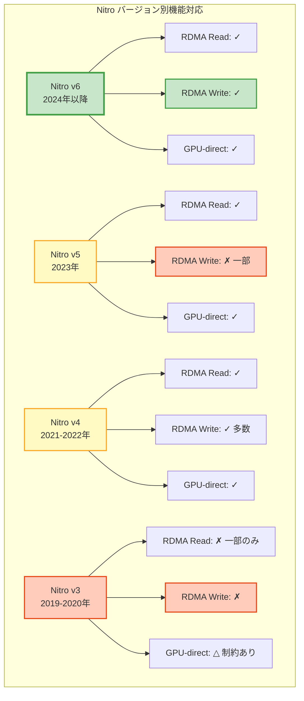

**Nitro v6 (2024 年以降)**
- 完全な RDMA Read/Write サポート
- 代表的なインスタンス: p6-b200.48xlarge (NVIDIA B200 GPU)、m8i.48xlarge、c8i.48xlarge
- EFAv4 ネットワーキングをサポート

**Nitro v5 (2023 年)**
- RDMA Read は全面サポート、RDMA Write は一部非対応
- 代表的なインスタンス: p5en.48xlarge (NVIDIA H200 GPU)、trn2.48xlarge (AWS Trainium2)
- EFAv3 ネットワーキングをサポート

**Nitro v4 (2021-2022 年)**
- 多くのインスタンスで RDMA Read/Write をサポート
- 代表的なインスタンス: p5.48xlarge (NVIDIA H100 GPU)、c6a.48xlarge、m6i.32xlarge
- 分散学習やHPCワークロードで広く使用される世代

**Nitro v3 (2019-2020 年)**
- 基本的に RDMA Read/Write は非対応
- 例外: p4d.24xlarge (NVIDIA A100 GPU) と dl1.24xlarge は RDMA Read に対応
- GPU-direct RDMA サポートには Linux kernel と NVIDIA ドライバーの互換性問題が存在

### インスタンスタイプ別対応状況

**HPC 特化型インスタンス**
- hpc7g.16xlarge (Nitro v5、AWS Graviton3E): RDMA Read のみ
- hpc7a.96xlarge (Nitro v4、AMD EPYC): RDMA Read/Write
- hpc6a.48xlarge (Nitro v4、AMD EPYC): RDMA Read/Write

**GPU インスタンス (機械学習向け)**
- p6 シリーズ (Nitro v6、NVIDIA B200/GB200): 完全な RDMA サポート
- p5en.48xlarge (Nitro v5、NVIDIA H200): RDMA Read のみ
- p5.48xlarge (Nitro v4、NVIDIA H100): RDMA Read/Write
- p4d.24xlarge (Nitro v3、NVIDIA A100): RDMA Read のみ

**汎用インスタンス**
- m8i, c8i, r8i シリーズ (Nitro v6): 完全な RDMA サポート
- m7i, c7i, r7i シリーズ (Nitro v4): 一部 RDMA Read のみ
- m6i, c6i, r6i シリーズ (Nitro v4): RDMA Read/Write

### Linux Kernel と NVIDIA ドライバーの互換性

Nitro v3 世代のインスタンス (特に P4d) で GPU-direct RDMA を使用する場合、Linux kernel と NVIDIA ドライバーの互換性に注意が必要です。

**互換性の問題**
- Linux kernel 4.14.326、5.4.257、5.10.195 以降で、クローズドソース NVIDIA ドライバーと EFA の組み合わせに問題が発生
- GPU メモリ情報の取得に失敗し、ノード間通信が停止する事象が報告されています

**解決策**
- NVIDIA OpenRM (オープンソース) ドライバーと EFA 1.29.0 以降を使用
- OpenRM は Turing、Ampere、Hopper 以降の GPU (P4、P5、P6) でサポート
- P3、P2、G3、G2 インスタンスは OpenRM 非対応のため、カスタム AMI が必要

## パフォーマンス特性

### ベンチマーク結果

EFA は以下の性能指標を達成しています ([ソース](https://aws.amazon.com/blogs/hpc/in-the-search-for-performance-theres-more-than-one-way-to-build-a-network/))。

**レイテンシー改善**
- P99.9 テールレイテンシー: 従来比 85% 削減
- 従来 TCP: 数ミリ秒レベル → EFA/SRD: 数十マイクロ秒レベル
- サブミリ秒レベルのハードウェア再送制御

**スループット向上**
- 単一 TCP フロー: 25 Gbps を達成 (ENA Express 使用時)
- マルチパスによる帯域幅集約: 最大 64 パス並列利用
- p5en.48xlarge: 3,200 Gbps の集約ネットワーク帯域幅

**CPU オーバーヘッド**
- ホスト CPU 負荷: 1% 未満 ([ソース](https://www.ernestchiang.com/en/notes/general/aws-srd-scalable-reliable-datagram/))
- ハードウェアベースのネットワークプロトコル処理
- 決定論的なパフォーマンス (OS スケジューリングによるジッター排除)

### ユースケース別効果

**HPC ワークロード**
- 気象シミュレーション、分子動力学、流体力学 (CFD) などで顕著な効果
- MPI Allreduce や MPI_Barrier などの集団通信操作の高速化
- クラスター全体のスケーラビリティ向上

**分散機械学習**
- NCCL を使用したマルチノード GPU 間通信の最適化
- Data Parallel、Model Parallel、Pipeline Parallel の効率化
- 大規模言語モデル (LLM) 訓練における通信ボトルネック解消

## 制約事項と考慮点

### ネットワーク制約

**Availability Zone 間制約**
- EFA トラフィックは単一 Availability Zone (AZ) 内に限定されます
- 複数 AZ にまたがる通信には通常の IP トラフィック (ENA デバイス) を使用
- これは SRD プロトコルがルーティング不可能な設計であるため

**インスタンスタイプ間制約**
- P4d/P4de/DL1 インスタンスと他のインスタンスタイプ間の EFA トラフィックは現在非サポート
- 同一クラスター内では同じ世代・タイプのインスタンスを使用することを推奨

### アプリケーション要件

**MPI サポート**
- Open MPI 4.1 以降
- Intel MPI 2019 Update 5 以降
- MVAPICH も対応 (バージョン要確認)

**NCCL サポート**
- NCCL 2.4.2 以降
- AWS による最適化版 NCCL プラグインの利用を推奨

**その他のライブラリ**
- AWS Neuron SDK 2.3 以降 (AWS Trainium/Inferentia 使用時)
- Libfabric 1.7.0 以降

### OS サポート

EFA は主要な Linux ディストリビューションをサポートします。

**Intel/AMD (x86_64)**
- Amazon Linux 2023、Amazon Linux 2
- RHEL 8/9、Rocky Linux 8/9
- Ubuntu 22.04/24.04
- Debian 11/12
- SUSE Linux Enterprise 15 SP2 以降

**AWS Graviton (arm64)**
- 上記と同様の Linux ディストリビューションをサポート
- ただし OpenSUSE Leap は x86_64 のみ

**Windows サポート**
- EFA デバイスは AWS Cloud Digital Interface (CDI) SDK ベースのアプリケーションでのみサポート
- 通常のアプリケーションでは ENA デバイスとして動作

## まとめ

AWS Elastic Fabric Adapter は、クラウド環境における HPC および AI/ML ワークロードの通信性能を劇的に向上させる技術です。独自開発の SRD プロトコル、Kernel Bypass アーキテクチャ、GPU-direct RDMA サポート、AWS Nitro System のハードウェアオフロードにより、オンプレミスの専用クラスターに匹敵する性能を実現しています。

**技術的な要点**
- Out-of-order パケット配信により head-of-line blocking を回避
- 最大 64 パスの動的マルチパスルーティング
- サブミリ秒レベルのハードウェア再送制御
- P99.9 テールレイテンシーの 85% 削減
- CPU オーバーヘッド 1% 未満

**実装時の考慮点**
- Nitro バージョンによる RDMA Read/Write サポートの違い
- Linux kernel と NVIDIA ドライバーの互換性 (特に Nitro v3)
- Availability Zone 内に限定される EFA トラフィック
- インスタンスタイプの選択と世代の統一

EFA は追加費用なしで利用可能であり、適切なインスタンスタイプを選択することで、クラウドにおける大規模計算ワークロードの実現可能性を大きく広げています。

## 参考文献

- [AWS Documentation: Elastic Fabric Adapter](https://docs.aws.amazon.com/AWSEC2/latest/UserGuide/efa.html)
- [AWS Blog: In the search for performance](https://aws.amazon.com/blogs/hpc/in-the-search-for-performance-theres-more-than-one-way-to-build-a-network/)
- [Ernest Chiang: AWS SRD (Scalable Reliable Datagram)](https://www.ernestchiang.com/en/notes/general/aws-srd-scalable-reliable-datagram/)
- [Ivan Pepelnjak: A Quick Look at AWS Scalable Reliable Datagram Protocol](https://blog.ipspace.net/2022/12/quick-look-aws-srd/)
- [IEEE: A Cloud-Optimized Transport Protocol for Elastic and Scalable HPC](https://ieeexplore.ieee.org/document/9167399)
::::

::::details AI インフラストラクチャの現状と技術動向

https://speakerdeck.com/markunet/aiinhurawokao-eru

第 38 回 ISOC-JP Workshop で発表された「AI インフラを考える」（小林正恭氏、さくらインターネット）の内容を基に、AI ワークロードを支えるインフラストラクチャの技術動向と課題を包括的に整理します。分散学習から分散推論への移行期において、ネットワークアーキテクチャとシステム設計に求められる技術要素を詳述します。

## AI インフラの背景と課題

生成 AI の需要拡大により、AI インフラへの要求が激化しています。現在の LLM（大規模言語モデル）は投入する計算資源とデータの量でモデルの精度が向上するスケーリング則に従うため、ハイパースケーラーを中心に AI インフラは巨大化の一途をたどっています。

Meta が発表した [Hyperion データセンター](https://hotchips.org) の規模はマンハッタン島に匹敵するものであり、AI インフラの物理的な規模を象徴しています。このような巨大化に伴い、以下の複数の技術領域で同時に要求が高まっています。

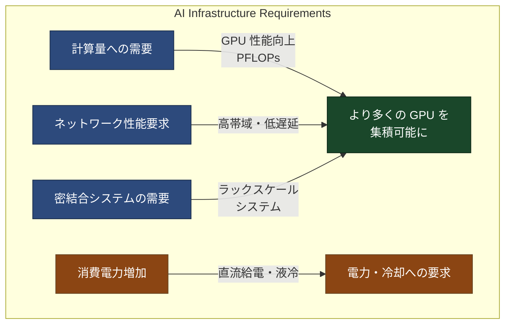

### 分散学習と分散推論の要求

LLM の分散学習では必要な計算資源の量が増加し、複数のデータセンターで単一のモデルを学習する規模に達しています。これに伴い GPU 間の高スループットが要求され、推論においても大規模な Reasoning などで分散推論の需要が増加しています。[IEEE HPSR での研究](https://hpsr.ieee-hpsr.org) によると、データセンターネットワーク運用の性能は単なる FLOPS ではなく、相互接続ネットワークによって決まることが示されています。

より多くのメモリ容量が必要となる KV Cache Sharing などの技術、レイテンシと TTFT（Time To First Token）削減への要求も高まっています。

### 電力と冷却の課題

GPU の消費電力は増加の一途をたどっています。NVIDIA B200 単体で 1,000W、ラックスケールシステムでは数十 kW 程度に達します。直流給電へのシフトが加速しており、現在は DCV または 48V ラックへの転換期にあります。

ハイパースケーラーは MW（メガワット）ラックを想定した設計を推進中です。VDC（Voltage Direct Current）給電として、[Diablo Project（OCP）](https://www.opencompute.org) では電気自動車のサプライチェーンの活用が検討されています。

冷却については液冷が前提となりつつあります。空冷でのサーバー集積率が限界に達しているため、液冷化で高密度ラック化が進んでいます。さくらインターネットでも液冷システムを運用中であり、今後はサーバーだけでなくネットワーク機器も液冷化の流れとなっています。

## Scale-Up と Scale-Out の概念

AI インフラのパフォーマンス限界は、単なる FLOPS ではなく、相互接続ネットワークによって決まります。異なる 3 つのネットワークドメインでの最適化が並行して進行しています。

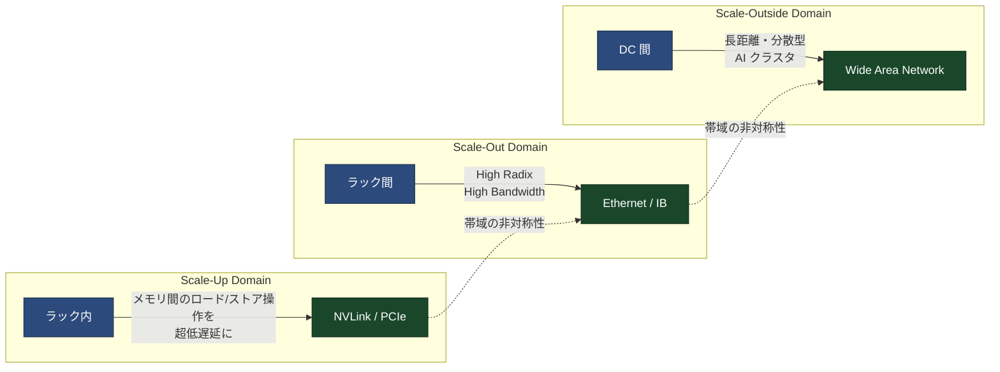

### Scale-Up：ラックスケールシステムの挑戦

計算機同士を可能な限り近くに配置・接続し、GPU メモリを共有資源として扱うことで、ラック全体をあたかも単一の巨大な計算機のように見せます。ラック内で超低遅延・高帯域のインターコネクト規格（NVLink など）で GPU 同士を相互接続することが、ラックスケール（Scale-Up）システムの核心です。

銅線での接続から光インターコネクトへの転換期を迎えています。[NVIDIA が Open Compute Project に貢献した GB200 NVL 設計](https://developer.nvidia.com/blog/nvidia-contributes-nvidia-gb200-nvl72-designs-to-open-compute-project/) では、ラックスケールでの光インターコネクトの採用が示されています。

### Scale-Out：データセンター間の接続

ラック間や DC 間での接続では、High Radix と High Bandwidth が追求されます。長距離・分散型 AI クラスタの実現が求められています。Scale-Up 帯域と Scale-Out 帯域の間には帯域の非対称性があり、この非対称性がシステム設計上の課題となります。

## ニューラルネットワークの並列化戦略

大規模モデルを複数の GPU に分散・分割する方法は、モデルアーキテクチャ、ユースケースの要件、ハードウェア構成などに応じて選択されます。どの方式を使用するにしても、基本的に GPU 間を接続するネットワークが高速・低遅延であることが望まれます。

[Parallelization Strategies in Neural Networks](https://nwkt.imes.blogspot.com/parallelization-strategies-in-neural.html) によると、推論には順伝播のみが必要ですが、学習には順伝播（推論）と逆伝播（パラメータ更新）の両方が必要です。各フェーズでどのような情報が交換されるのか、何がボトルネックになるのかを理解することで、並列処理のための正しいインフラを構築できます。

### 主要な並列化手法

| 並列化方式 | 内容 | 通信特性 | 主な通信ドメイン | ボトルネック |
|-----------|------|---------|----------------|-------------|
| Data Parallel (DP) | モデルを複数の GPU に複製。基本的にはモデルが GPU に収まることが前提だが、ZeRO などの最適化により大規模モデルにも適用可能 | All-Reduce | Scale-Out（ノード間帯域） | ネットワーク帯域 |
| Pipeline Parallel (PP) | モデルを層で分割（NN を縦に切る）。出力を次の層に伝播 | Send/Recv (PP) | Scale-Out（ノード間帯域） | Pipeline Bubble |
| Tensor Parallel (TP) | 行列演算を複数 GPU に分割（NN を横に切る）。GPU 間通信が完了するまで計算は完了しない | Reduce-Scatter or All-Gather | Scale-Up / Scale-Out（ノード間帯域） | レイテンシ |
| Expert Parallel (EP) | Mixture of Experts (MoE) モデルで利用。入力ごとに FFN のエキスパート層が異なり、対応する GPU にルーティング | all-to-all | Scale-Out（ノード間帯域） | ネットワーク帯域 |
| 3D Parallel (TP+PP+DP) | 各並列方式を階層的に組み合わせて大規模化 | 各方式に依存 | Scale-Out（ノード間帯域） | Pipeline Bubble |

基本的にネットワークが遅いと何をやっても遅くなります。このため、AI ワークロードのパフォーマンスは相互接続ネットワークの性能に強く依存します。

## RDMA over Converged Ethernet の選択理由

AI インフラ相互接続では高帯域・低遅延・ロスレスが要求されます。RDMA（Remote Direct Memory Access）の通信性能を最大化するため、歴史的には InfiniBand という専用のインターコネクト規格が使用されてきました。

しかし、コモディティな製品は市場で競争原理が働くため、コスト面で有利です。マルチテナンシーが必須であるクラウドサービスでは、ネットワークをテナントごとに柔軟に分離する必要があります。Ethernet でも性能を十分に出せるようになったことで、IB の方が確かに低遅延ではありますが、スループットに大差はなくなりました。特定用途の HPC クラスタなどを除いて InfiniBand を選択する理由が薄れています。

技術がオープンであることで、自分たちの要件と環境に合わせた技術・製品選定ができることも重要です。誰もが議論に参加できることは、インターネットの精神に合致します。[Microsoft の研究論文「RDMA over Commodity Ethernet at Scale」](https://www.microsoft.com/en-us/research/wp-content/uploads/2016/11/rdma_sigcomm2016.pdf) では、RoCEv2 を大規模に運用する際の課題と解決策が詳述されています。

### RoCE とは

RoCE（RDMA over Converged Ethernet）は InfiniBand のトランスポート層を UDP/IP でカプセル化して Ethernet 上で転送する技術です。ネットワークを正しく "converged" させるためには InfiniBand の仕様（IBA）を理解する必要があります。

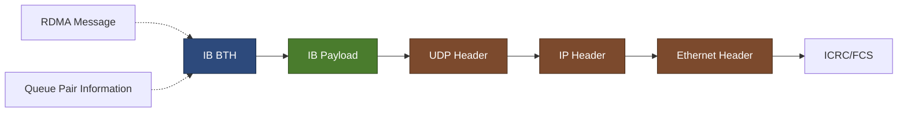

### ロスレスとは

ロスレスとは、バッファの輻輳・競合によるパケットロスが起きない仕組みを指します。ハードウェア障害で発生するパケットロスなど不可避なものは対象外です。InfiniBand では CBFC（Credit-based Flow Control）という輻輳制御が根幹となっており、宛先（受信側）のバッファに空きがあるかどうかを確認してから送信するため輻輳が起きません。

これらをコモディティな実装である Ethernet で実現することが RoCE の挑戦です。

## Ethernet におけるロスレス制御の課題

現在の AI/ML ネットワークで主流の RoCE は、要素技術に特別新しいものは使っていません。歴史のあるインターネット標準技術を組み合わせているに過ぎません。

- ECN（Explicit Congestion Notification）：[RFC 3168](https://datatracker.ietf.org/doc/html/rfc3168)
- PFC（Priority-based Flow Control）：IEEE 802.1Qbb
- ETS（Enhanced Transmission Selection）：IEEE 802.1Qaz

これらを組み合わせて Ethernet 上で AI ワークロードのトラフィックを処理していますが、現在の要求の厳しい AI ワークロードに最適とは言い難く、反応速度・回復力・可視性に課題があります。

### ECN 運用の難しさ

ECN は輻輳を送信元に通知する仕組みです。スイッチの輻輳検知ポイントでパケットに ECN ビットをマーキングし、宛先ノードから CNP（Congestion Notification Packet）が返ってきたらそのキューペアの送信レートを調整します。

しかし、CNP はペイロードを持たないヘッダのみの ACK パケットであり、輻輳に反応するまでの時間が長くなります。どこで輻輳したかわからず、マーキング閾値の設定も明確ではありません。デフォルト値で運用になりがちで、問題が起きてから調整するという対応が一般的です。

さらに、送信元 QP の情報は BTH（Base Transport Header）には含まれないため、スイッチが一意にコンテキストを特定できません。これは「送信元と宛先の情報は常に同一ヘッダ内に存在する」という IP ネットワークの常識とは異なります。[Fast Congestion Notification Packet (CNP) in RoCEv2 Networks のドラフト仕様](https://datatracker.ietf.org/doc/draft-xiaorj-gwg-rocev2-fast-cnp) では、CNP には送信元の QP が輻輳対象の QP（Dest QP）として格納されますが、スイッチはその情報をヘッダから読むことができません。

### PFC 運用の難しさ

PFC（Priority-based Flow Control）は同一 DC ルーム内の均一で限定的な接続範囲（ケーブル長 5m 未満）ではデフォルト値で問題になりません。しかし、物理的制約のあるコンテナ DC を運用している環境では、AI インフラに必要なシステムが異なる場所に分散して設置されることもあります。

このような場合、パフォーマンスを最大化するためのチューニングが必要です。回線帯域と正確な線路長、利用する Switch ASIC 固有の仕様のパラメータから計算する必要があります。距離の測定やトポロジの認識を自動で行い最適値を動的に適用する実装が望ましく、長距離 RDMA の観点では PFC が問題にならないようなジョブスケジューリングやトランスポート制御をソフトウェア側で行えると理想的です。

### サイレントドロップへの対応

パケットがどこで輻輳・破棄されたのか知りたいという要求から、再送要求のトリガーを高速化する試みがあります。最近は輻輳で破棄されるパケットのヘッダ部分をトリミングして通知する仕組みが提案されています（未検証）。

ペイロード部分を捨てとして別の優先キューから、DSCP 値を輻輳発生場所に応じた値に書き換えて送信します。受信側 NIC には「Trimmed Packet」と理解して再送制御を起動するロジックが新たに必要となり、従来の Ethernet の受信処理実装だけでは対応できないため、対応する NIC が必要になります。

## ロードバランシングの課題

様々な要件や制約の下で設計される実際の現場のネットワークは、机上の理想通りにはなりません。すべての機器とポートに適用可能な共通の万能プロファイルはなく、ベンダーデフォルト値やすべて同じ設定で運用すると深刻な Performance Issue になることもあります。

### RDMA-unaware と RDMA-aware

| 方式 | フローの識別方法 | 分散要素 | リンク使用率 | NIC 側のサポート | リオーダー |
|------|----------------|----------|------------|-----------------|-----------|
| Pure ECMP | 5-tuple | ECMP Hash | Packet/Cell 単位 | 不要 | なし |
| DLB/GLB flowlet | 5-tuple | Flow-agnostic | Packet 単位 | 不要 | なし |
| Scheduled Fabric | Flow-agnostic | Flow-agnostic | QP/Flow 単位 | 必要 | あり（スイッチ側）|
| Enhanced Ethernet | Flow-agnostic | Flow-agnostic | QP/Flow 単位 | 一部必要 | あり（NIC 側）|
| Flow Pinning | Queue Pair | Queue Pair | QP/Flow 単位 | 必要 | なし |

RoCE はエントロピーの少ないフローが支配的であり、通常の L3 ECMP ハッシュでの分散が困難です。各社から様々なロードバランシング方式やその関連技術が提案・実装されています。

エントロピーを増やすか、どこにリオーダーのインテリジェンスを置くかという選択があります。自社で GPU クラスタのワークロードを予測・制御できるようなインフラなら選択肢は豊富ですが、ベアメタルプランを提供する側としては、スイッチでインテリジェンスが完結すると運用しやすくなります。一方で NIC と連携した動作設定や細かなパラメータチューニングの負荷が高く、細かいパラメータはデフォルト値で運用になりがちで問題が起きてから調整することになります。

## ネットワークトポロジの最適化

市場に供給されている NIC の速度は 400G に到達し、すでに 800G も見えています。NIC の速度に合わせてスイッチ単体の転送容量もスケールアップさせていくのか、それとも 51.2T Switch ASIC からはスイッチの液冷化を考える必要があります（空冷ではフットプリントが増加し、最低 3RU が必要）。

400G 以降、NIC に複数の MPO ケーブルを接続する前提なら、マルチプレーン構成の選択肢が生まれます。片方のプレーンに問題があっても、もう一方のプレーンで計算を継続する選択肢があり、Resilience 向上につながります。既存の転送容量のスイッチ（空冷）でスケールアウトできる台数の増加に伴う運用負荷とのトレードオフが生じます。

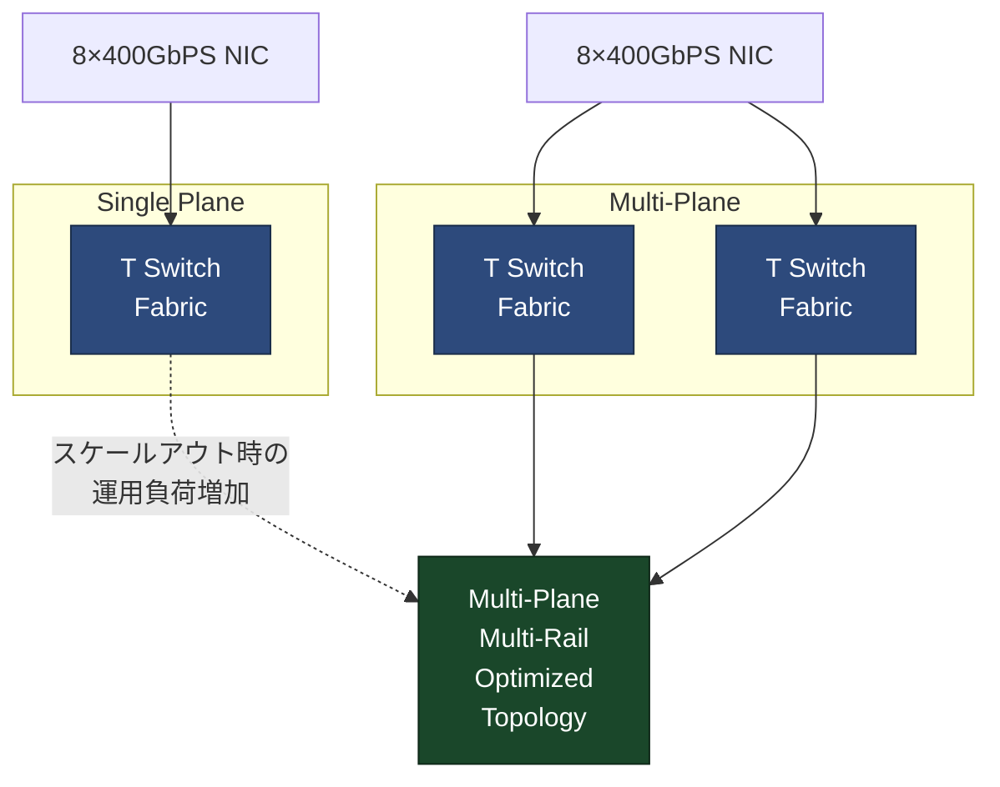

### Scale-Up トポロジの理解

Scale-Up ドメインのトポロジがどのようになっているのかを正しく理解する必要があります。例えば DPU で外部ストレージと通信する場合、サーバーの構成によっては GPU Direct RDMA ができない場合があります。サーバーのブロックダイアグラムからボトルネックになりうる箇所を読み解ける能力が求められます。

## 分散推論時代の技術要求

近年の推論を取り巻く状況として、リクエスト（ユーザーの入力）の多様化と複雑化が進んでいます。入力の長さもリクエストごとにばらつきが大きくなっており、Reasoning の普及により、入力コンテキスト長のばらつきがより顕著になってきました。TTFT や ITL（Inter-Token Latency）などユーザーの体験に影響するメトリクスとその要因を意識する必要性が高まっています。

### スケール・性能の限界

単純にモデルが大きく、単一の GPU やノードでは処理しきれなくなっています。大規模になると GPU のメモリ（HBM）が足りず、GPU のメモリにはモデルだけでなく途中の計算結果（activations）なども格納されます。

近年の LLM では Mixture of Experts (MoE) と呼ばれるアーキテクチャを採用していることが多く、性能が良い一方で、このアーキテクチャのモデルは単一ノードに載せることが難しくなっています。分散学習だけでなく、推論も分散処理で大規模化する兆しが見え始めています。

### LLM の推論：Prefill と Decode

LLM による推論は自己回帰モデル（autoregressive）です。LLM によるトークン生成はユーザー入力を元に、モデルが次の単語を予測し生成します。さらにその生成したトークンを系列の末尾に加え、再度次のトークンの予測計算を自己回帰的に行います。

推論は Prefill と Decode と呼ばれる異なる 2 つのステップから構成されます。

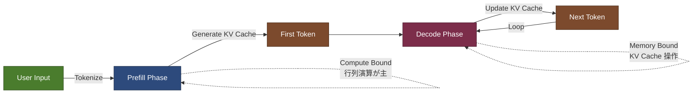

**Prefill フェーズ**では、ユーザーの入力をトークン化し、入力トークンを処理して最初の出力トークンを生成します。同時に KV Cache も生成されます。初回の Attention 演算はスキップできないため、行列演算が主要な処理となり、Compute Bound なフェーズです。

**Decode フェーズ**では、直前のトークンを系列に加え、後続の出力を生成していきます。新規のトークンに対して KV Cache を更新します。KV Cache による計算結果の再利用ができるため計算処理は重くありませんが、KV Cache のメモリ操作に時間がかかる Memory Bound なフェーズです。

### KV Cache のサイズとデータ転送

推論時に保持する KV Cache のメモリ使用量（リクエストあたり）は以下の式で計算されます。

```
KV Cache Size = 2 × n_layers × (n_heads × head_dim) × seq_len × precision_bytes × batch
```

パラメータの意味は以下の通りです。

- `2`：K と V の両方を保存するための係数
- `n_layers`：Transformer モデルの中間層の数（各層ごとに KV を保存）
- `n_heads`：Multi-Head Attention のヘッド数
- `head_dim`：各ヘッドが持つ次元数
- `seq_len`：処理するトークン数（コンテキスト長）
- `precision_bytes`：FP16 や FP8 などの精度
- `batch`：同時処理するリクエスト数

例えば Llama 3.1 70B モデルで 4K トークンの入力を想定すると、KV Cache Size は約 2.0GB になります。128K トークンまで拡張すると約 64GB となり、PD Disaggregation を行っている場合、このデータを転送する必要があります。

#### KV Cache 転送の見積もり例

Llama 3.1 70B モデル（n_layers=80, n_heads=64, head_dim=128）での例です。

| 入力トークン数 | KV Cache サイズ | 転送時間（400GbE） | 転送時間（800GbE） | 転送時間（1.6TbE） |
|--------------|----------------|-------------------|-------------------|-------------------|
| 4K | 2.0 GB | 40 ms | 20 ms | 10 ms |
| 128K | 64 GB | 1,280 ms | 640 ms | 320 ms |

複数の同時接続リクエストがある場合、この転送時間がユーザー体験を悪化させますが、ユーザーの入力の傾向次第でシステムにかかる負荷が変わるため、インフラ設計上難しいポイントとなります。

[KV Cache Size Calculator](https://lmcache.ai/kv_cache_calculator.html) などのツールを利用して、具体的な値を算出することができます。

### PD Disaggregation と KV Cache Sharing

Prefill と Decode を別々の Worker (GPU) に分離する PD Disaggregation により、処理特性の異なるボトルネックを分離し、それぞれで効率化することが可能です。一方で、新たな課題も生まれます。

- KV Cache をどのように Worker 間で共有するのか（KV Cache Sharing）
- どのようにリクエストをルーティングするか（やりたいことは「キャッシュに当てる」それだけ）
- KV Cache のサイズと転送に必要なネットワーク性能はどの程度なのか（推論でもネットワークがボトルネックに）

[DistServe 論文](https://arxiv.org/abs/2401.09670) では、Prefill と Decoding を分離することで Goodput を最適化する手法が提案されています。

### KV Cache の配置と管理

HBM に載らなくなったらどうするかという問題があります。外部のメモリ（ストレージ）にオフロードすることも考えられていますが、HBM、ホストメモリ、ローカルストレージ（SSD）、共有ストレージ、GPU Direct RDMA の順に遅くなります。遅いストレージに聞きに行くのはコスト効率が悪いため、実用性には疑問が残ります。

KV Cache 用に共有メモリプールを用意して高速に接続しようという取り組みを行っているスタートアップ企業もあります。最適なトランスポートの選択やキャッシュ管理をどうするかという課題があります。

### NIXL の登場

[NVIDIA Inference Xfer Library (NIXL)](https://github.com/aidynamoe/nixl) は NCCL を補完する通信ライブラリで、KV Cache 転送をサポートします。トポロジや利用可能なメモリストアなどをうまく判断し、最適なトランスポート（RoCE、NVLink など）を選択します。スケジューリングやデータ転送まで含めて管理する分散推論フレームワークも登場しています。

自分たちのインフラに合った最適化手法を検証・適用する必要があります。

## Scale-Up におけるインターコネクト選択

KV Cache をどのネットワークで転送するかを考える際、Scale-Up Network と Scale-Out Network をどう使うかが重要になります。KV Cache の転送でパフォーマンスが落ちていては話になりません。高速かつ低遅延に転送するためには Scale-Up を利用します。

サーバーのレイアウトやインフラ構成によって選択できる経路が変わるため、どこがボトルネックになるか知っておく必要があります。

| ドメイン | インターコネクト規格 | 最大伝送速度（GPU あたり） | 備考 |
|---------|-------------------|------------------------|------|
| Scale-Up | PCIe Gen5 | 128 GB/s × 単一方向 | レーンあたり 4GB/s |
| Scale-Up | PCIe Gen6 | 256 GB/s × 単一方向 | レーンあたり 8GB/s |
| Scale-Up | NVLink 4 | 900 GB/s （18 Link × 単一方向）| Hopper、リンクあたり 50GB/s |
| Scale-Up | NVLink 5 | 1,800 GB/s （18 Link × 単一方向）| Blackwell、リンクあたり 100GB/s |
| Scale-Out | 400G NIC/DPU | 50 GB/s （双方向） | ConnectX-7、Blue Field |
| Scale-Out | 800G NIC | 100 GB/s （双方向） | ConnectX-8 |

## さくらインターネットの事例

さくらインターネットはコンテナ型データセンターの稼働を開始し、ベアメタル型 GPU クラウドサービス「高火力 PHY」にて B200 プランの提供を開始しています。[プレスリリース](https://www.sakura.ad.jp/corporate/information/newsreleases) によると、国内最速のサービス提供を目指して NVIDIA B200 GPU の整備を推進しています。

コンテナ型データセンターで液冷 GPU サーバーを運用中であり、短期間での導入と液冷による高密度化を実現しています。

### SAKURA ONE プロジェクト

[SAKURA ONE の論文](https://arxiv.org/abs/2507.02124) では、透明でオープンな AI プラットフォームの構築について述べられています。TOP500 で 49 位を獲得した SAKURA ONE は、インターコネクトに SONiC、Ethernet などオープンな技術を採用したシステムです。800GbE を基盤とした完全にオープンなネットワークスタックを採用し、ベンダーニュートラルな技術の大規模 HPC インフラにおける実現可能性を示しています。

## 技術選択における分岐点

現在、ハードウェアやソフトウェア・フレームワークなどが驚異的な速度で進化しています。設計したシステムが構築・運用開始される頃には次のチップアーキテクチャとその周辺技術が世界の主流になっていることがあります。先端のインフラが数年で陳腐化する世界で、数年単位で再利用可能な共通アーキテクチャを決められなくなっています。

各要素技術の本質を見極め、自分たちにとって最適な選択が何なのかを先読みし判断できる力が必要です。以下のような複雑な依存関係とトレードオフを理解する必要があります。

- NIC の速度：400G → 800G → 1.6T の進化に伴う接続規格・方式
- Switch ASIC：51.2T → 102.4T、SerDes の進化
- サーバーのフットプリント：EIA から OCP へのシフトの可能性
- スイッチの液冷化タイミング：液冷なら ORv3、液冷 NW ラックの設計
- LLM のアーキテクチャ：MoE が当たり前になった際のインフラへの影響
- ネットワークアーキテクチャ：Resilience 向上のための Multi-Plane 構成
- 分散推論時代：どこまで必要か、同じインフラで提供できるか
- Scale-Up：NVLink vs Ethernet、オープンな技術の選択
- 高速ストレージ：Converged 構成の流れとその設計方法
- Optical CPO：商用化の開始時期と必要性の判断
- Symmetric Memory / GPU Direct Async：Scale-Up 設計への影響
- GPU 消費電力：1,000W → 1,500W → 2,000W での設置可能ラック数

互いに疎に見える要素が複雑な依存とトレードオフの関係にあります。

## インフラ設計・運用に求められる能力

AI インフラの設計・運用には、インフラからモデルアーキテクチャに至るまでの幅広い知識と経験が必要です。データパスのどこに問題があるのかを特定するための知識・経験・スキルが求められます。

ワークロードがハードウェアトポロジに正しくバインドされることが重要です。

- アプリケーションはハードウェアを適切に使えるようになっているか
- サーバーとネットワーク機器の設定はそのインフラの目的に合っているか
- アプリケーションとハードウェアが協調して最大パフォーマンスを発揮するという理解

誰かのリファレンスアーキテクチャ（Validated Design）はあなたのベストアーキテクチャではありません。どの程度のコストを払えば、ユーザーにとって「何が」「どれくらい」改善されるかという大局的な視座と感覚が必要です。

よくある「何故かパフォーマンスが出ない」という問いに対して、例えば以下のような問題を特定できる能力が求められます。

- GPU 間通信が遅い
- ストレージとのデータ転送が遅い
- 想定と違う動作をしている

正しいインフラはアプリケーションへの正しい理解の上で成り立ちます。

## オープン技術への期待

特定の技術ドメインや専門領域だけに閉じた問題解決や最適化ができなくなりつつあります。アプリケーションとインフラに明確に線を引くと、良いものが作れません。特に現在の AI インフラの技術動向を見ると、垂直統合システムへの揺り戻しが来ていると感じられます。ソフトウェアとハードウェアを一つのコンピューティングシステムとして見る視点が重要になっています。

ただし、エンジニアの期待として採用する技術はオープンなものであってほしいという願望があります。

- 現在注目度が高まっている AI のための各種技術はオープンなのか
- 開かれたメーリングリストで誰でも質問・議論ができるか
- "specification" という名のマーケティングに惑わされない

本当に必要なものを見極める必要があります。ハイパースケーラーを中心に作られたものは、どうしても課題設定が大きくなる傾向にあります。小規模事業者には First World Problems な側面もあるため、本質的な課題を見失わないようにする必要があります。

その技術が、自分たちの何の課題を解決し、どのような利益をもたらすのか、トレードオフが何かを常に考える姿勢が重要です。

## 参考文献

1. [Hot Chips](https://hotchips.org) - ハイパフォーマンスプロセッサに関する国際会議
2. [Hot Interconnects](https://hoti.org) - 高性能相互接続技術に関する国際会議
3. [OCP Global Summit](https://www.opencompute.org) - Open Compute Project の年次サミット
4. [NVIDIA Contributes NVIDIA GB200 NVL Designs to Open Compute Project](https://developer.nvidia.com/blog/nvidia-contributes-nvidia-gb200-nvl72-designs-to-open-compute-project/)
5. [SAKURA ONE: Empowering Transparent and Open AI Platforms through Private Sector HPC Investment in Japan](https://arxiv.org/abs/2507.02124)
6. [Parallelization Strategies in Neural Networks](https://nwkt.imes.blogspot.com/parallelization-strategies-in-neural.html)
7. [RDMA over Commodity Ethernet at Scale](https://www.microsoft.com/en-us/research/wp-content/uploads/2016/11/rdma_sigcomm2016.pdf) - Microsoft Research
8. [RoCEv2 Packet Walk-Through Cheat Sheet](https://www.linkedin.com/posts/zeeshan-sabri_rocev2-packet-walkthrough-cheat-sheet-activity-796)
9. [Fast Congestion Notification Packet (CNP) in RoCEv2 Networks](https://datatracker.ietf.org/doc/draft-xiaorj-gwg-rocev2-fast-cnp) - IETF Draft
10. [KV Cache Size Calculator](https://lmcache.ai/kv_cache_calculator.html)
11. [DistServe: Disaggregating Prefill and Decoding for Goodput-optimized Large Language Model Serving](https://arxiv.org/abs/2401.09670)
12. [Introducing NVIDIA Dynamo: A Distributed Inference Serving Framework for Reasoning models](https://www.nvidia.com/ja-jp/on-demand/session/gtcs)
13. [NVIDIA Inference Xfer Library (NIXL)](https://github.com/aidynamoe/nixl)
14. [Scale-Up Ethernet Framework Specification](https://docs.broadcom.com/docs/scaleup-ethernet-framework) - Broadcom
15. [Ultra Accelerator Link Specification](https://ualink-consortium.org/wp-content/uploads/UALink_Specification_v1.0_Evaluation_Copy.pdf)
16. [Ultra Ethernet Specification](https://ultraethernet.org/wp-content/uploads/sites/Ultra-Ethernet-Updated-UE-Specification.pdf)
17. [Deep dive into running DC network operations at scale](https://hpsr.ieee-hpsr.org) - IEEE HPSR
18. さくらインターネット プレスリリース：コンテナ型データセンターと高火力 PHY サービス
19. [さくらインターネット note 記事](https://note.com/sakura_pr/n/nabb2e) - B200 GPU 整備状況
::::