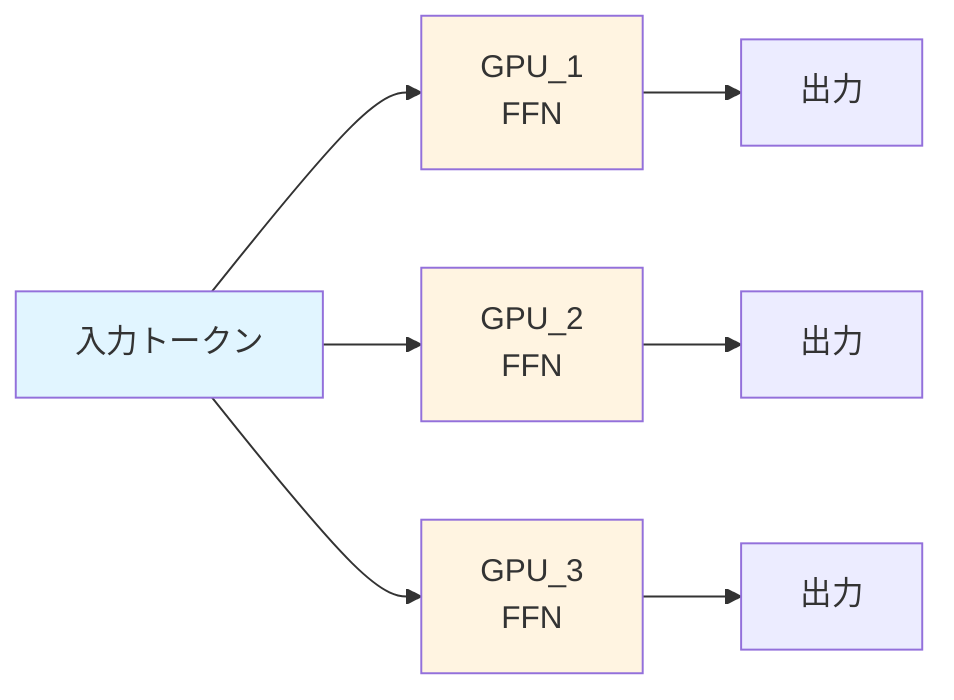
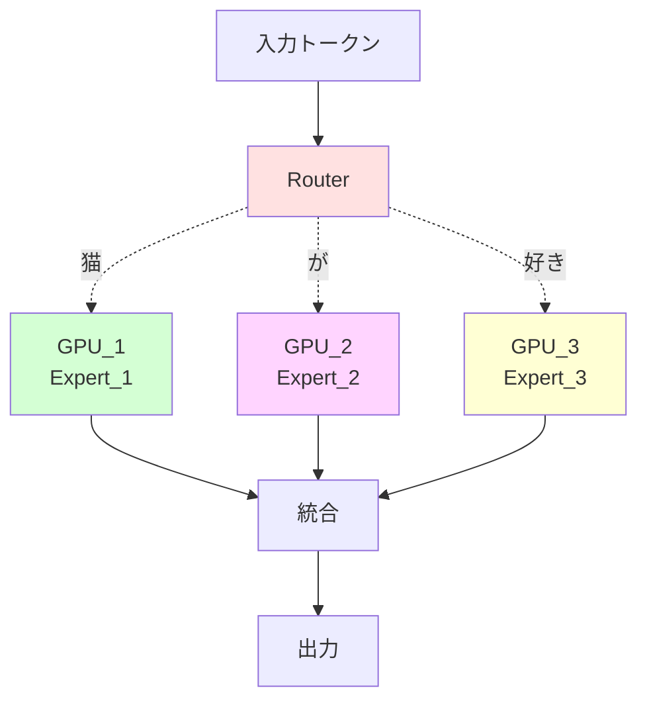
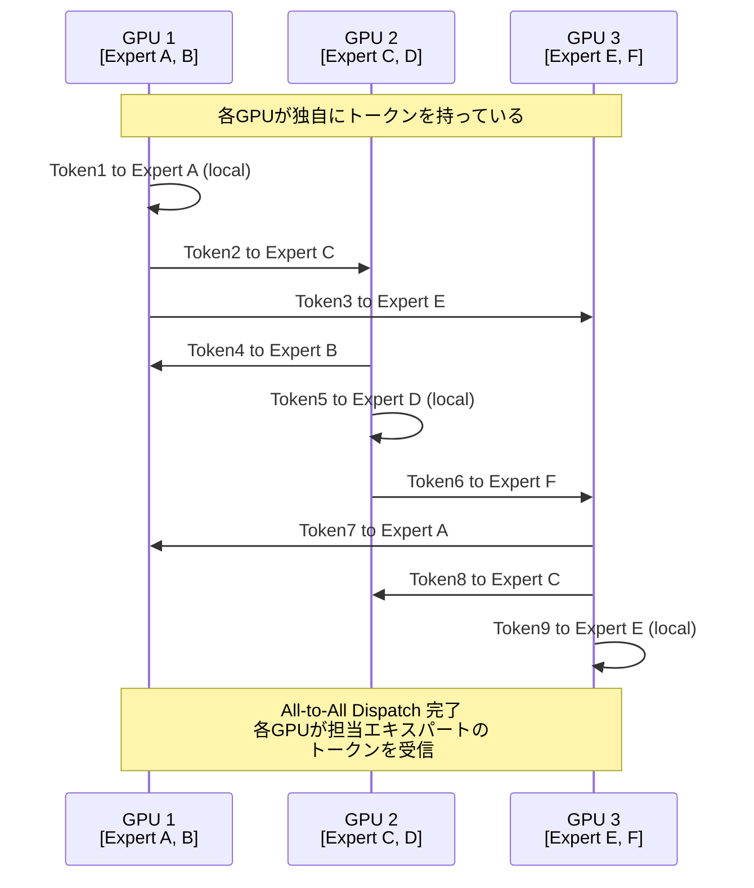
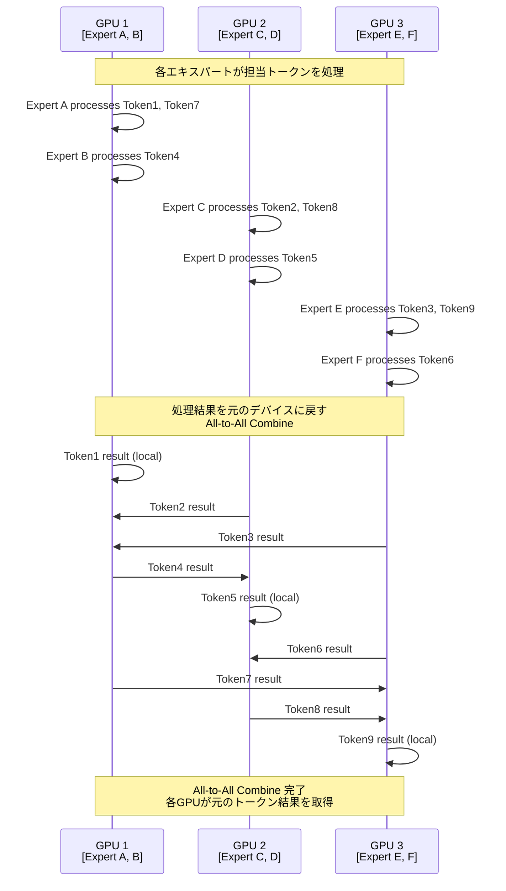
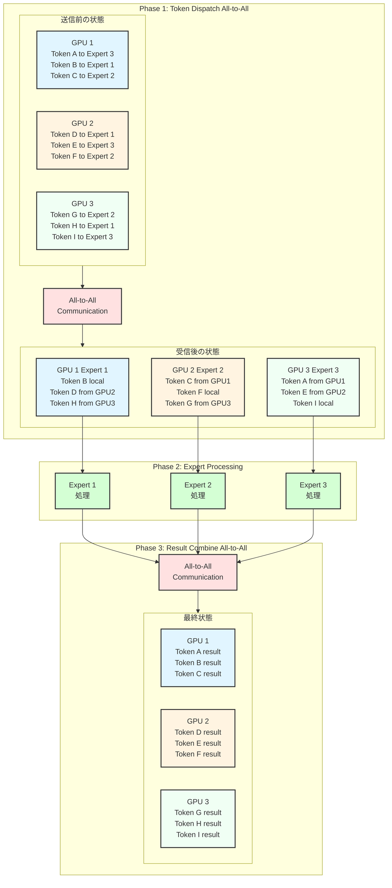
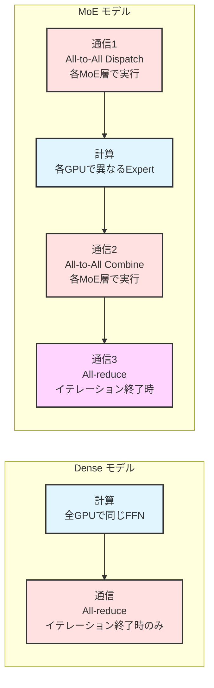
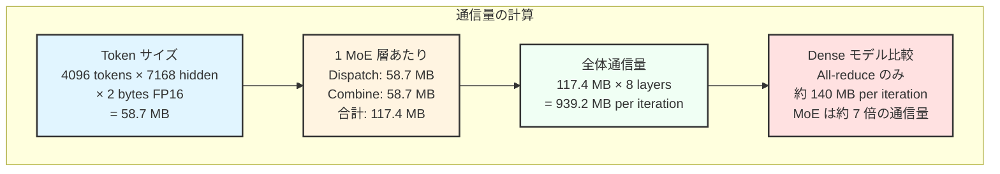
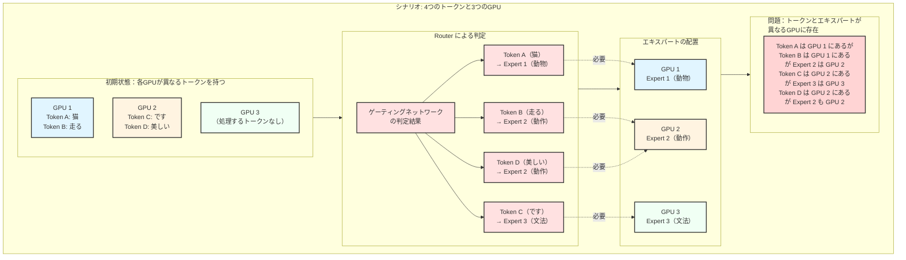
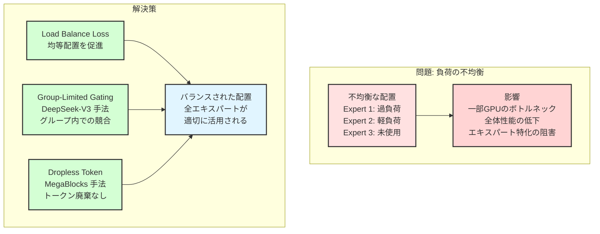

::::details MoE で All-to-All 通信が必要になる理由

## 概要

Mixture-of-Experts（MoE）モデルにおいて All-to-All 通信が必要になる理由を、従来の Dense モデルとの比較を通じて理解しましょう。

## Dense モデル vs MoE モデルの基本的な違い

### Dense モデルの動作

**特徴**
- 各 GPU で同じ FFN を実行（パラメータは複製）
- All-reduce での勾配同期のみ
- 通信パターンはシンプル

### MoE モデルの動作

**特徴**
- 各エキスパートが異なる分野に特化
- トークンを適切なエキスパートに動的にルーティング
- **All-to-All 通信が必要**（トークンの分散と収集）

## All-to-All Dispatch: トークンをエキスパートに送る

## Expert 処理 + All-to-All Combine: 結果を元に戻す

## 通信パターンの詳細分析

### Forward Pass での All-to-All パターン

## なぜ All-to-All が必要なのか

### Dense モデルでの通信パターン

**Data Parallelism のみ**
- 各 GPU が同じモデルの複製を持つ
- 勾配計算後の All-reduce のみ
- 通信頻度: イテレーション終了時に 1 回

### MoE モデルでの通信パターン

**Expert Parallelism + Data Parallelism**
- 各エキスパートが特定の GPU にのみ存在
- トークンを物理的に適切な GPU に移動
- 処理結果を元の GPU に戻す
- **通信頻度: 各 MoE 層で 2 回（Dispatch + Combine）**

## 実際の性能データ

# DeepSeek-V3 での実測値（DeepEP ライブラリ）

### 通常の訓練・推論プリフィル用カーネル

**テスト環境**: H800（~160 GB/s NVLink）+ CX7 InfiniBand 400 Gb/s（~50 GB/s RDMA）
**設定**: 4096 tokens/batch, 7168 hidden, top-4 groups, top-8 experts, FP8 dispatching + BF16 combining

| タイプ | Expert 並列度 | Dispatch 帯域幅 | Combine 帯域幅 | ボトルネック |
|------|-------------|---------------|---------------|------------|
| **Intranode** | 8 | 153 GB/s | 158 GB/s | NVLink |
| **Internode** | 16 | 43 GB/s | 43 GB/s | RDMA |
| **Internode** | 32 | 58 GB/s | 57 GB/s | RDMA |  
| **Internode** | 64 | 51 GB/s | 50 GB/s | RDMA |

### 低レイテンシ推論デコード用カーネル

**設定**: 128 tokens/batch, 7168 hidden, top-8 experts, FP8 dispatching + BF16 combining

| Expert 並列度 | Dispatch | Combine | RDMA 帯域幅 |
|-------------|----------|---------|-------------|
| 8 | 77 μs | 114 μs | 98-127 GB/s |
| 16 | 118 μs | 195 μs | 63-74 GB/s |
| 32 | 155 μs | 273 μs | 48-53 GB/s |
| 64 | 173 μs | 314 μs | 43-46 GB/s |
| 128 | 192 μs | 369 μs | 39 GB/s |
| 256 | 194 μs | 360 μs | 39-40 GB/s |

**重要な観察**
- Intranode（NVLink）は Internode（RDMA）より約 3-4 倍高速
- Expert 並列度が増加すると、レイテンシも増加
- 大規模並列化では RDMA 帯域幅がボトルネックになる

## 通信量の分析

### MoE vs Dense モデルの通信量比較

**通信頻度の違い**
- **Dense モデル**: イテレーション終了時に All-reduce × 1 回
- **MoE モデル**: 各 MoE 層で All-to-All × 2 回 + イテレーション終了時に All-reduce × 1 回

### 通信量の計算例

**設定例**: 8 層の MoE モデル、64 GPU、4096 tokens/batch

## All-to-All が必要になる具体的な理由

### 1. Expert Parallelism による物理的分散

### 2. All-to-All Dispatch による解決

```mermaid
flowchart TB
    subgraph DispatchSolution["All-to-All Dispatch による解決"]
        subgraph SendPhase["送信フェーズ"]
            GPU1Send["GPU 1 から送信<br/>Token A → GPU 1（local）<br/>Token B → GPU 2"]
            GPU2Send["GPU 2 から送信<br/>Token C → GPU 3<br/>Token D → GPU 2（local）"]
            GPU3Send["GPU 3 から送信<br/>（送信するトークンなし）"]
        end
        
        subgraph AllToAll["All-to-All Communication"]
            Communication[すべてのGPU間で<br/>同時にトークンを交換]
        end
        
        subgraph ReceivePhase["受信フェーズ"]
            GPU1Receive["GPU 1 が受信<br/>Token A（local）<br/>Expert 1 で処理準備完了"]
            GPU2Receive["GPU 2 が受信<br/>Token B（from GPU 1）<br/>Token D（local）<br/>Expert 2 で処理準備完了"]
            GPU3Receive["GPU 3 が受信<br/>Token C（from GPU 2）<br/>Expert 3 で処理準備完了"]
        end
        
        SendPhase --> AllToAll
        AllToAll --> ReceivePhase
        
        subgraph Result["結果：各GPUが担当エキスパートの<br/>すべてのトークンを取得"]
            Solved["全てのトークンが<br/>適切なエキスパートの場所に配置"]
        end
        
        ReceivePhase --> Result
    end
    
    classDef sendStyle fill:#e1f5ff,stroke:#333,stroke-width:2px
    classDef commStyle fill:#ffe1e1,stroke:#333,stroke-width:2px
    classDef receiveStyle fill:#f0fff4,stroke:#333,stroke-width:2px
    classDef resultStyle fill:#d4ffd4,stroke:#333,stroke-width:2px
    
    class GPU1Send,GPU2Send,GPU3Send sendStyle
    class Communication commStyle
    class GPU1Receive,GPU2Receive,GPU3Receive receiveStyle
    class Solved resultStyle
```

## なぜこの設計が効率的なのか

### 計算効率の向上

MoE では以下の理由により、通信コストを上回る計算効率が得られます。

**大きな行列演算への集約**
- 各エキスパートが複数 GPU からのトークンを処理
- 小さな行列演算を大きな行列演算に集約
- GPU の並列計算能力を最大限活用

**スパース アクティベーション**
- 各トークンは全エキスパートではなく top-k エキスパートのみを使用
- 計算量は線形増加、パラメータ数は指数的増加可能

## 実装上の課題と解決策

### Load Balancing の問題

## 参考文献とリソース

### 主要論文
- [Outrageously Large Neural Networks: The Sparsely-Gated Mixture-of-Experts Layer](https://arxiv.org/abs/1701.06538) - Google による MoE の基礎論文
- [RailS: Load Balancing for All-to-All Communication in Distributed MoE Training](https://arxiv.org/abs/2510.19262) - Rail アーキテクチャでの MoE 最適化
- [Chain-of-Experts: Unlocking the Communication Power of MoE Models](https://arxiv.org/abs/2506.18945) - 新しい MoE アーキテクチャ提案

### 実装とライブラリ
- [Training MoEs at Scale with PyTorch](https://pytorch.org/blog/training-moes/) - PyTorch + MegaBlocks による大規模 MoE 訓練
- [DeepEP: DeepSeek 高性能 All-to-All ライブラリ](https://github.com/deepseek-ai/DeepEP) - FP8 対応の最適化された実装
- [All-to-All Communication in MoE Training](https://apxml.com/courses/mixture-of-experts/chapter-4-scaling-moe-distributed-training/all-to-all-communication-moe) - 詳細な技術解説

### 商用実装
- [What Is Mixture of Experts (MoE) and How It Works?](https://www.nvidia.com/en-us/glossary/mixture-of-experts/) - NVIDIA による MoE 概要と GB200 NVL72 での最適化

## 結論

MoE モデルにおける All-to-All 通信は、Expert Parallelism を実現するために不可欠な仕組みです。Dense モデルと比較して通信量は増加しますが、エキスパートの専門化と大きな行列演算への集約により、全体的な計算効率の向上を実現しています。

特に大規模モデルでは、適切な Load Balancing と高速なネットワーク（NVLink、EFA）により、All-to-All 通信のオーバーヘッドを最小化しながら、モデルの表現能力を大幅に拡張することが可能になります。
::::
