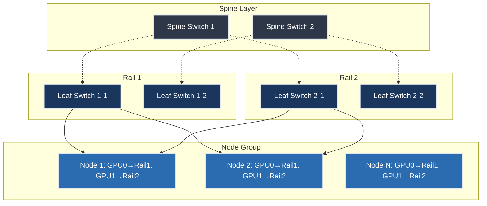

::::details
# Rail-Optimized Clos Topology -- 入門: AI クラスタ向けネットワーク設計の革新

## 概要

Rail-optimized Clos Topology とは、従来の Clos ネットワーク設計を大規模な GPU クラスタ環境に最適化したネットワークアーキテクチャです。この設計は特に大規模言語モデル（LLM）の訓練において、効率的な通信パターンを実現し、コストと電力消費の大幅な削減を可能にします。

## 従来の Clos ネットワークとの相違点

従来の Clos ネットワークは、データセンター内の任意のノード間での通信を可能にする汎用的な設計でした。これは Leaf-Spine 構造を用いて全対全（any-to-any）接続を提供し、予測不可能で突発的な CPU 集約型ワークロードに対応していました。

一方、Rail-optimized 設計では、GPU の「ランク」という概念を導入し、同一ランクの GPU を同一の Rail に配置します。この配置により、AI ワークロード特有の通信パターンに特化した最適化が実現されます。

## アーキテクチャの詳細構成

Rail-optimized 設計では、K 個の GPU を持つプラットフォーム（例：NVIDIA DGX H100 の 8 GPU システム）において、K 本の論理的な「Rail」を構成します。各ノードの第 1 GPU は Rail-1 に、第 2 GPU は Rail-2 に配置されるという規則的な配置を採用します。

この設計により、同一 Rail 内の GPU 間では最小レイテンシでの通信が実現され、異なる Rail 間での通信が必要な場合のみ Spine スイッチを経由します。

## 通信パターンの分析と最適化

MIT Computer Science and Artificial Intelligence Laboratory (CSAIL) と Meta Platforms の共同研究により、LLM 訓練時の通信パターンについて重要な発見がなされました。分析の結果、大規模言語モデルの訓練において、通信トラフィックの約 73.5% が Rail 内に留まり、高コストな Spine スイッチを経由する通信は限定的であることが判明しました。

この発見により、従来必須とされていた全対全接続の必要性が疑問視され、Rail-only アーキテクチャという革新的な設計が提案されました。Pipeline Parallelism、Tensor Parallelism、Data Parallelism のいずれの並列化戦略においても、同様の通信パターンが観測されています。

## Rail-Only アーキテクチャへの発展

通信パターン分析の結果を受けて開発された Rail-only 設計では、Spine 層を完全に排除し、各 HGX ノード内の NVSwitch を利用した Rail 間通信を実現します。この設計により以下の効果が得られます。

### コスト削減効果

- ネットワークコストを 38% から 77% 削減
- 電力消費を 37% から 75% 削減
- 128 ノードの DGX H100 クラスタにおいて、20 台のスイッチを 8 台に削減
- トランシーバー数を 2,688 個から 1,152 個に削減

### 性能への影響

- LLM 訓練の 3D Parallelism において性能低下なし
- All-to-all 通信において 11.2% の性能オーバーヘッド
- 全体の通信性能への影響は約 2.86%

## 実装事例と使用ケース

### NVIDIA DGX SuperPOD での実装

NVIDIA DGX SuperPOD は Rail-optimized 設計の代表的な実装例です。127 ノード構成において、各 32 ノードグループが Rail 単位で構成され、InfiniBand ファブリックを使用した高帯域幅接続を実現しています。各 Rail 内のトラフィックは常に 1 ホップ以内で到達可能であり、異なる Rail 間やノード間の通信のみが Spine 層を経由します。

### Meta Platforms での Llama 訓練

Meta Platforms では 24,576 GPU を使用した Llama 3.1 405B モデルの訓練において Rail-optimized 設計を採用しています。次世代モデルでは 32,768 GPU への拡張が計画されており、この規模においても Rail-optimized 設計の効果的な運用が期待されています。

## 技術的制約と考慮事項

### 利点

1. **AI ワークロード特化の最適化**: LLM 訓練の通信パターンに特化した設計により、無駄なネットワーク資源を削減
2. **レイテンシの最小化**: 同一 Rail 内での通信における最小遅延の実現
3. **コスト効率の大幅改善**: ネットワーク機器とトランシーバー数の削減による資本支出の削減
4. **電力効率の向上**: 不要なスイッチ機器の排除による運用コストの削減
5. **スケーラビリティ**: 大規模クラスタでの効率的な拡張性

### 制約事項

1. **ワークロード依存性**: LLM 訓練以外の汎用的なデータセンターアプリケーションには適用困難
2. **プラットフォーム依存性**: NVIDIA NVLink や AMD Infinity Fabric などの高帯域幅内部接続に依存
3. **配置制約**: Tensor Parallelism と Data Parallelism のシャードとレプリカを同一 Rail に配置する必要
4. **故障耐性**: Rail 単位での冗長性設計が必要

## Mixture-of-Expert モデルへの対応

Rail-only 設計は、Mixture-of-Expert（MoE）モデルにおける All-to-all 通信にも対応可能です。フォワーディング機能を使用することで、All-to-all トラフィックに対して 4.1% から 5.6% の完了時間オーバーヘッドで動作することが実証されています。

## 今後の発展方向

Rail-optimized 設計は、次世代の AI インフラストラクチャにおいて重要な役割を果たすことが予想されます。特に以下の分野での発展が期待されています。

1. **更なるコスト最適化**: トランシーバー技術の進歩と併せた総所有コストの削減
2. **新しい並列化戦略への適応**: 次世代の分散学習アルゴリズムに対応した設計の進化
3. **異なる GPU アーキテクチャへの拡張**: AMD や Intel などの GPU プラットフォームへの適用研究
4. **エッジコンピューティングへの応用**: 小規模な分散 AI システムにおける効率化

## 参考文献とリソース

### 主要論文
- [Rail-only: A Low-Cost High-Performance Network for Training LLMs with Trillion Parameters](https://arxiv.org/html/2307.12169v4) - MIT CSAIL と Meta による革新的な研究論文

### 技術解説記事
- [This AI Network Has No Spine - And That's A Good Thing](https://www.nextplatform.com/2024/08/23/this-ai-network-has-no-spine-and-thats-a-good-thing/) - The Next Platform による詳細な技術分析
- [Rail-Optimised Networking: How NVIDIA is Rethinking AI Network Design](https://vespertec.com/news/rail-optimised-networking-how-nvidia-is-rethinking-ai-network-design-data-centre/) - Vespertec による業界動向分析
- [Backend Network Topologies for AI Fabrics](https://nwktimes.blogspot.com/2025/04/ai-fabric-backend-network-topologies.html) - Network Times による AI ファブリック設計指針

### 公式技術文書
- [NVIDIA DGX SuperPOD: Network Fabrics](https://docs.nvidia.com/dgx-superpod/reference-architecture-scalable-infrastructure-h100/latest/network-fabrics.html) - NVIDIA による公式設計ガイドライン
- [Distributed Model Training at Scale: Part TWO — Topology Design](https://medium.com/@ming.gao.gm/distributed-model-training-at-scale-part-two-topology-design-bb14c0e69cb1) - 分散モデル訓練における実践的な設計考慮事項

### NVIDIA 開発者ブログ
- [Doubling all2all Performance with NVIDIA Collective Communication Library 2.12](https://developer.nvidia.com/blog/doubling-all2all-performance-with-nvidia-collective-communication-library-2-12/) - NCCL における PXN 機能と Rail-optimized 設計の活用

## 結論

Rail-optimized Clos Topology は、AI ワークロードの特性を深く理解した上で設計された革新的なネットワークアーキテクチャです。従来の汎用的な Clos 設計から脱却し、LLM 訓練における実際の通信パターンに基づいた最適化により、大幅なコスト削減と効率向上を実現しています。

特に Rail-only アーキテクチャへの発展は、AI インフラストラクチャの経済性を根本的に改善する可能性を秘めており、今後の大規模 AI システムの標準的な設計パラダイムとなることが予想されます。ただし、この設計は AI ワークロードに特化しているため、汎用的なデータセンターアプリケーションとは異なる設計思想であることを理解し、適切な適用範囲での採用が重要です。
::::
