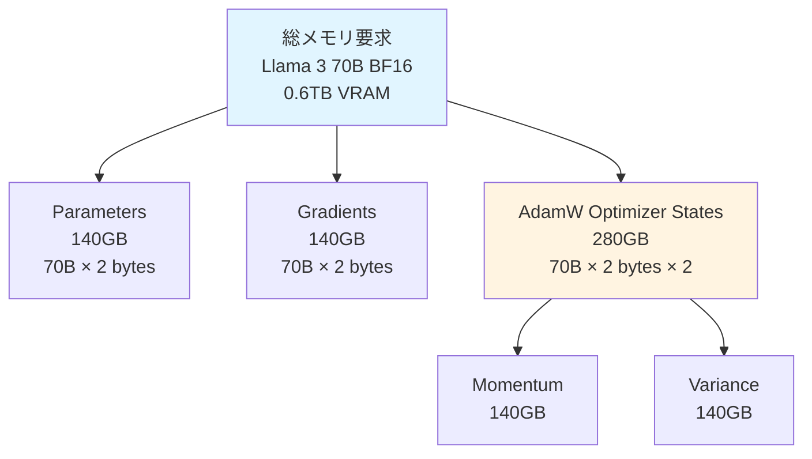
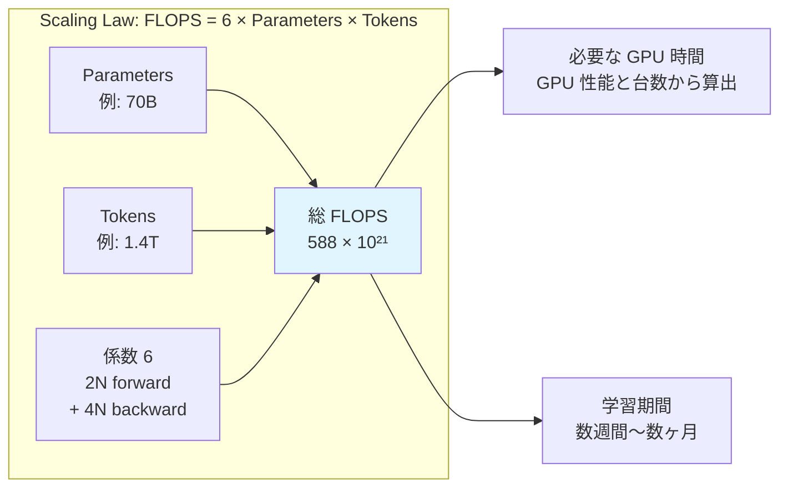
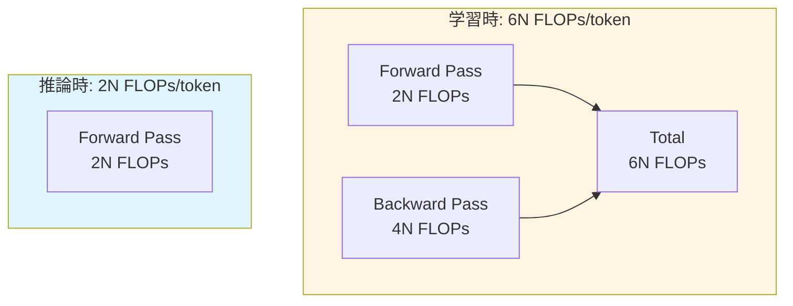
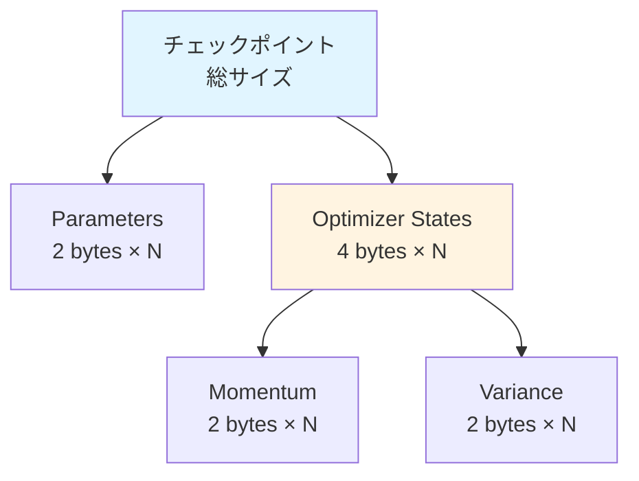
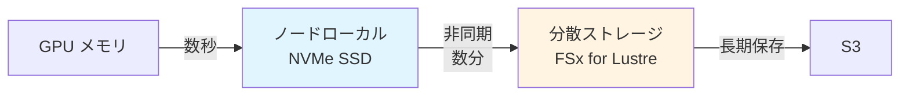
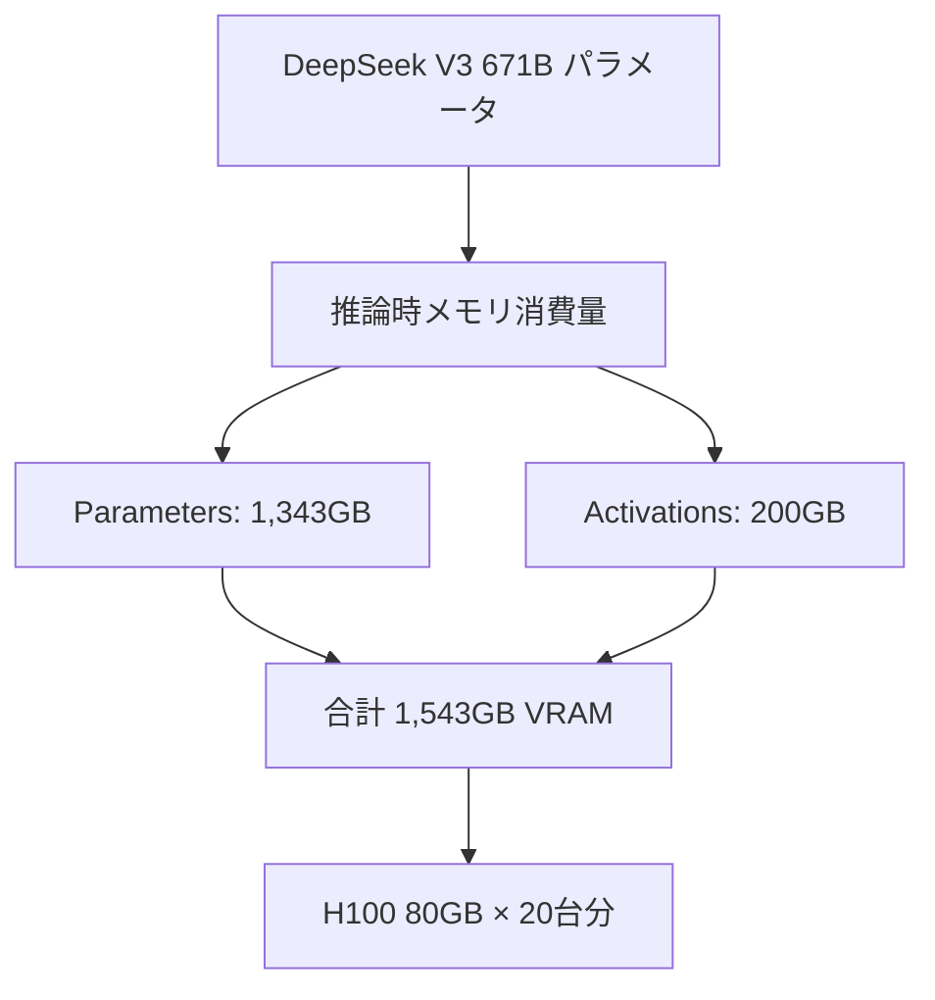
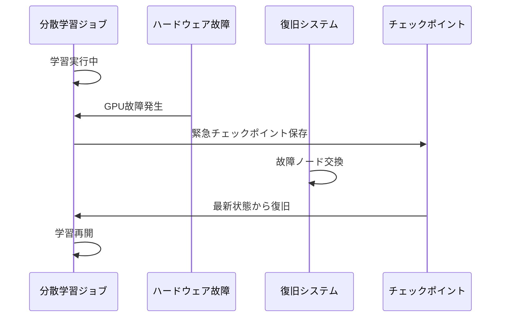
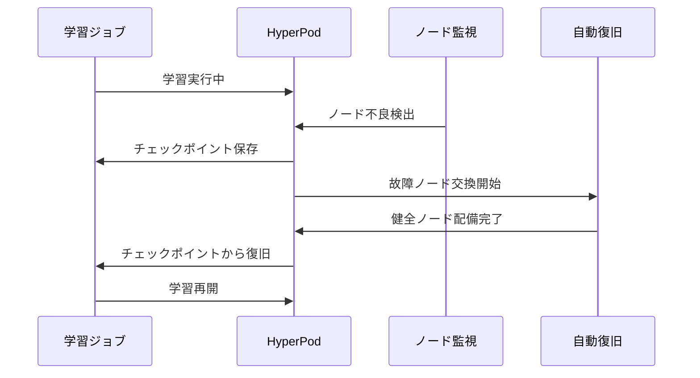

::::details 前提
:::message
**対象読者**: 大規模基盤モデルの学習に興味があり、これから学び始める方。機械学習の基礎知識は不要ですが、クラウドコンピューティングの基本的な概念 (GPU、ストレージなど) に触れたことがあると理解しやすい内容です。
:::
:::message
**ライセンス**: © 2025 littlemex.
本文および自作図表: CC BY 4.0
※公式ドキュメントからの引用や翻訳部分は原典の著作権に従います。
引用画像: 各画像の出典に記載されたライセンスに従います。
:::
:::message
一部 AI を用いて文章を作成します。レビューは実施しますが、見逃せない重大な間違いなどがあれば[こちらのIssue](https://github.com/littlemex/samples/issues)から連絡をお願いします。
:::
::::

**本章では今後実験を進める上で把握しておくべき大規模基盤モデル学習に関する背景と基礎的な知識を整理します。**

---

AWS Principle WW Solutions Architect,GenAI, Keita Watanabe さんの [Scalable Infrastructure for Large-Scale AI Training with AWS Sagemaker Hyperpod](https://speakerdeck.com/keitaw/scalable-infrastructure-for-large-scale-ai-training-with-aws-sagemaker-hyperpod-at-singapore-ai-hour) 資料の流れを参照しながら初学者向けに情報を整理します。

## 前提知識

:::message
**Point !** ***大規模基盤モデル学習には大規模なコンピュートが必要***
:::
2025 年現在、Anthropic、OpenAI、Google、DeepSeek など多くのモデルプロバイダから毎月のように最先端モデルの発表があります。これらの最先端モデルの事前学習には総じて大規模なコンピュートを必要とします。

なぜ大規模なコンピュートが必要なのかを整理する前に、まずは事実としてモデル学習のためにどのくらい大規模なコンピュートが要求されているのか確認してみましょう。

### 基本用語の説明

::::details 読み進める上で必須の用語
- **パラメータ**: モデルが学習する変数の数。70B は 700 億個のパラメータを意味します。パラメータ数が多いほど、モデルは複雑なパターンを学習できますが、必要な計算量とメモリも増加します。
- **トークン**: テキストを小さな単位 (単語や単語の一部) に分割したもの。例えば「こんにちは」は 2-3 トークンになります。1 兆トークンは、約 3,000 億～5,000 億語の英文に相当します。
- **GPU 時間**: GPU 1 台が稼働した時間の合計。例えば GPU 100 台を 10 時間使うと 1,000 GPU 時間になります。
- **事前学習**: モデルに膨大な情報を読ませて、モデルに汎用的な基礎知識を習得させる工程です。
::::

::::details 事前学習に関する参考情報
- [JSAI: 【LLM強化学習①】事前学習と事後学習](https://www.youtube.com/watch?v=nfLLfb3r6io)
- [2024年度 人工知能学会全国大会（第38回）チュートリアル講演１: 大規模言語モデルの開発](https://speakerdeck.com/chokkan/jsai2024-tutorial-llm?slide=15)
::::

## 代表的なモデルの学習規模

以下の表は、代表的なモデルの事前学習時のコンピュートに関する情報を整理したものです。

::::details 表記説明はこちら!
表中の **M** は Million（百万）を表します。例えば 2.788M は 278 万 8 千、30.84M は 3,084 万を意味します。**GPU 時間**は、GPU 1 台が稼働した時間の累計です。例えば [NVIDIA H100 GPU](https://www.nvidia.com/ja-jp/data-center/h100/) という GPU 1 台で 640 万時間かかる学習を、 H100 100 台で並列実行すれば 6 万 4 千時間（約 7.3 年）で完了します。**使用GPU** の欄には、学習に使用された GPU の種類を記載しています。A100-80GB、H100-80GB、H800-80GB などがあり、数字が大きいほど新しい世代で性能が高くなります。H100-80GB の 80GB は VRAM と呼ばれる GPU のメモリサイズを表しています。

**学習トークン**の **T** は Trillion（兆）を表します。2T は 2 兆トークン、15T+ は 15 兆トークン以上を意味します。

:::message alert
ややこしいですが H100 GPU を 8 つ搭載したサーバーが NVIDIA DGX H100 という名前で販売されていたりするので、同じ H100 と書かれている際にはサーバーと GPU のどちらを指しているのか確認したほうが良いでしょう。
:::
::::

| モデル | リリース時期 | 総パラメータ | アクティブ | 学習GPU時間 | 使用GPU | 学習トークン | 特記事項 |
|--------|-------------|-------------|-----------|-------------|---------|-------------|----------|
| **[Llama 2 7B](https://huggingface.co/meta-llama/Llama-2-7b)** | 2023年7月 | 7B | 7B | **0.184M** | A100-80GB | 2T | Dense、BF16 |
| **[Llama 2 13B](https://huggingface.co/meta-llama/Llama-2-13b)** | 2023年7月 | 13B | 13B | **0.369M** | A100-80GB | 2T | Dense、BF16 |
| **[Llama 2 70B](https://huggingface.co/meta-llama/Llama-2-70b)** | 2023年7月 | 70B | 70B | **1.72M** | A100-80GB | 2T | GQA、BF16 |
| **[Llama 3 8B](https://github.com/meta-llama/llama3)** | 2024年4月 | 8B | 8B | **推定1.0M** | H100-80GB | 15T+ | GQA、8K context |
| **[Llama 3 70B](https://github.com/meta-llama/llama3/blob/main/MODEL_CARD.md)** | 2024年4月 | 70B | 70B | **推定6.7M** | H100-80GB | 15T+ | GQA、8K context |
| **[Llama 3.1 8B](https://huggingface.co/meta-llama/Llama-3.1-8B)** | 2024年7月 | 8B | 8B | **1.46M** | H100-80GB | 15T+ | GQA、128K context |
| **[Llama 3.1 70B](https://huggingface.co/meta-llama/Llama-3.1-70B)** | 2024年7月 | 70B | 70B | **7.0M** | H100-80GB | 15T+ | GQA、128K context |
| **[Llama 3.1 405B](https://huggingface.co/meta-llama/Llama-3.1-405B)** | 2024年7月 | 405B | 405B | **30.84M** | H100-80GB | 15T+ | GQA、128K context |
| **[DeepSeek V3](https://huggingface.co/deepseek-ai/DeepSeek-V3)** | 2024年12月 | 671B | 37B | **2.788M** | H800-80GB | 14.8T | MoE、FP8学習 |
| **[Llama4 Maverick](https://huggingface.co/meta-llama/Llama-4-Maverick-17B-128E-Instruct)** | 2025年4月 | 400B | 17B | **2.38M** | H100-80GB | 未公開 | MoE |

::::details 注意事項
:::message alert
GPU を単純に増やせば増やすほど学習時間が単純計算で短縮されるわけではないことに注意が必要です。基本的に計算はノードに閉じていることが最も効率が良く、ノード間で通信をしだすと効率が落ちてきます。100 人それぞれが自分の中だけで考えて意思決定するのと、一箇所に集まった 100 人が議論した上で意思決定する、世界各地にいる 100 人が議論した上で意思決定する、では同じ 100 人による意思決定でも合意形成のためのエフォートが全然違いますよね。誤解を恐れずに言うとそれと同じことです。
:::
:::message alert
必ずしも最新モデルやパラメータ数の大きいモデルの方が性能が良いわけではありません。
以下のサイトにモデルの Intelligence, speed, price などの情報が掲載されており、参考情報として有用かと思います。
:::
https://artificialanalysis.ai/

:::message
皆さんのよくご存知の OpenAI、Anthropic、Google などのプロバイダから提供されるいわゆるプロプライエタリモデルは情報が公開されていないケースが多いため表からは除外しています。
:::
::::

この表から最先端のモデルが如何に大規模なコンピュートを必要とするのか分かったのではないでしょうか。現実的に Llama 3 70B の GPU 時間を 1 ヶ月で達成しようとすると 1250 台の H100 を連携させながら学習する必要があります。AWS の p5.48xlarge だとオンデマンドで単純に計算すると約 440 億円必要です。

大規模基盤モデルの学習手法の詳細について説明することが本書の目的ではなく、分散学習・推論の実験を行うことが目的です。背景情報や理論的説明については既に優れた資料が世の中に多数存在するためそれらの URL を雑に貼って次に進みます。ぜひ一読してから実験されることをお勧めします。

::::details 参考情報
**[2024年度 人工知能学会全国大会（第38回）チュートリアル講演１: 大規模言語モデルの開発](https://speakerdeck.com/chokkan/jsai2024-tutorial-llm?slide=15)**
大規模言語モデルの概要、事前学習・継続事前学習、インストラクションチューニング、アライメント、評価などについて整理されている講演資料。個人的には Chinchilla 則、その後の推論を重視した小さいモデルを多めのデータで訓練する [Beyond Chinchilla-Optimal](https://arxiv.org/abs/2401.00448) あたりの整理は重要に感じた。この辺りは実際に大規模な事前学習をやっていないと調整の感覚を得られなさそう。

**[進化する大規模言語モデル評価: Swallowプロジェクトにおける実践と知見](https://speakerdeck.com/chokkan/swallow-evaluation-instruct-wandb-fullyconnected2025)**
Swallow プロジェクトにおける実践と知見をシェア。主に評価に着目。

**[ 東工大Swallowプロジェクトにおける大規模日本語Webコーパスの構築](https://speakerdeck.com/aya_se/data-centric-ai-swallow-corpus-56e2869a-f9bd-46cb-b030-1012235c37f7)**
コーパス作成の苦労が滲んでいて非常に参考になる。
::::

## 大規模基盤モデル学習が必要とするリソース

:::message
**Point !** ***大規模基盤モデル学習には大規模な計算能力と GPU メモリ、分散ストレージが必要***
:::

1. **GPU メモリ（VRAM）**：モデルのパラメータ、勾配、オプティマイザの状態を保存
2. **計算能力（FLOPS）**：学習に必要な膨大な演算を実行
3. **分散ストレージ**：学習データとチェックポイントを保存

## GPU メモリ要求の概要

Llama 3 70B を BF16 精度で学習する場合、約 0.6TB の GPU メモリが必要です。この内訳は、

- **Parameters（140 GB）**：モデルの重みとバイアス
- **Gradients（140 GB）**：学習時の勾配情報
- **Optimizer States（280 GB）**：AdamW オプティマイザの状態



::::details BF16 とは
:::message
**精度形式とハードウェアの関係**
数値精度を下げること（ex. FP32 → BF16 → FP8 → NVFP4）により、メモリ使用量と計算負荷を削減できます。ただし、これらの低精度形式を効果的に活用するには、対応するハードウェアとソフトウェアフレームワークのサポートが必要です。
:::

**精度選択**
- **BF16**：現代の標準、Ampere 以降の GPU で高速動作
- **FP8**：H100 以降で利用可能、Transformer Engine による自動管理

**参考 URL**
- [NVIDIA Developer Blog: FP8 Introduction](https://developer.nvidia.com/blog/floating-point-8-an-introduction-to-efficient-lower-precision-ai-training/)
- [NVIDIA Developer Blog: NVFP4 Introduction](https://developer.nvidia.com/blog/introducing-nvfp4-for-efficient-and-accurate-low-precision-inference/)
::::

::::details メモリ要求の詳細
:::message
初学者の方は、まず「0.6TB（BF16）必要なんだ」というざっくりの GPU メモリ要求の規模感を理解した上で、詳細は読み飛ばしても構いません。
:::

:::message
メモリ要求の計算方法は、[LLM Training Memory Optimization Guide](https://github.com/WhitePegasis/LLM-Training-Memory-and-Speed-Optimization-Guide) を参照しました。
:::

## Parameters (140 GB)

モデルの重みとバイアス、つまり学習済みの知識そのものを格納するメモリです。70B パラメータとは 700 億個の調整可能な数値のことで、BF16 (2 bytes) という形式で 1 つの数値を保存すると、以下のように計算できます。

**計算式（BF16）**
```
70,000,000,000 個 × 2 bytes = 140,000,000,000 bytes = 140 GB
```

**精度形式によるメモリサイズ**

| 精度形式 | bytes/parameter | 70B モデルのサイズ | 備考 |
|---------|----------------|------------------|------|
| **BF16（半精度）** | 2 bytes | **140 GB** | **標準** |
| **FP32（単精度）** | 4 bytes | 280 GB | 参考 |
| **FP8** | 1 byte | 70 GB | H100 以降 |

## Gradients (140 GB)

バックプロパゲーション（逆伝播）時に「どう改善すべきか」を一時的に記録するメモリです。バックプロパゲーションとは、モデルの予測結果と正解を比較して、「どのパラメータをどのくらい調整すべきか」を計算する処理のことです。これは optimizer step でパラメータを更新した後にクリアされますが、次の学習ステップで再度必要になります。

## AdamW Optimizer States (280 GB)

AdamW オプティマイザは、効率的に学習するために各パラメータに対して 2 種類の履歴情報を保持します。

**2 種類の履歴**

1. **Momentum（1次モーメント）** = 「最近どの方向に改善してきたか」の記録
   - 過去の改善方向を記憶し、同じ方向への改善を加速します
   - 例：坂道を転がるボールのように、勢いをつけて学習を進める

2. **Variance（2次モーメント）** = 「どのくらい安定して改善できているか」の記録
   - 各パラメータの改善のばらつきを記録し、不安定なパラメータは慎重に更新します
   - 例：でこぼこ道では慎重に、平坦な道では大胆に進む

**計算式（BF16）**
```
70,000,000,000 個 × 2 bytes × 2 種類 = 280 GB
```
::::

### メモリ要求から必要な GPU 台数

H100-80GB GPU は 1 台で 80 GB の GPU メモリ（VRAM）を持っています。つまり単純計算で 560GB/80GB = 7 台、の H100-8GB GPU が必要です。

実際には、この他に活性化関数の値を格納するメモリも必要となります。Activations は、ニューラルネットワークの各層で計算された中間結果を保持するもので、バックプロパゲーション時に再利用されます。

:::message
上記は理論上の最小構成です。実用的には、各精度で 1.5-2 倍の GPU が必要となります。
:::

## 計算能力要求の概要

モデル学習に必要な計算量を理解しましょう。計算量は **FLOPS**（Floating Point Operations Per Second、浮動小数点演算の回数）という単位で測定されます。1 回の足し算や掛け算が 1 FLOPS に相当します。モデル学習に必要な計算量は、以下の Scaling Law で推定できます。

**FLOPS = 6 × Parameters × Tokens**

例えば、70B パラメータのモデルを 1.4 兆トークンで学習する場合、約 588 エクサ FLOPS の計算が必要です。H100 GPU（BF16）の実効性能を 1 PFLOPS と仮定すると、1 台で約 19 年、1,000 台で約 7 日かかる計算となります。

::::details 70B パラメータのモデル、 1.4 兆トークンで学習する場合

## 基本的な計算

```
6 × 70,000,000,000 × 1,400,000,000,000 
= 588,000,000,000,000,000,000,000 回の計算
= 588 × 10²¹ FLOPS
= 588 エクサ FLOPS
```


::::

::::details FLOPS 計算式「6 × Parameters × Tokens」の詳細

:::message
初学者は読み飛ばして大丈夫です。
:::

この係数 6 は、Transformer の学習時における 1 トークンあたりの計算量から導かれます。

## 学習時と推論時の計算量

**Transformer モデルにおける標準的な FLOPS の近似式**

```
学習時（Training）: 6N FLOPs/token
推論時（Inference）: 2N FLOPs/token

※ N = パラメータ数（非埋め込みパラメータ）
```

学習では forward pass と backward pass の両方が必要ですが、推論では forward pass のみで十分なため、推論時の計算量は学習時の 1/3 となります。

## 学習時の内訳（6N FLOPs/token）

```
Forward pass（順伝播）:  2N FLOPs/token
Backward pass（逆伝播）: 4N FLOPs/token
─────────────────────────────────────
合計:                    6N FLOPs/token
```

これを D トークンで学習すると

**総 FLOPS = 6 × N × D**



## Forward Pass が 2N FLOPs/token の理由

Transformer の各演算では **multiply-accumulate operation（積和演算、MAC）** が使用されます。

**MAC 演算とは**
```
a = a + (b × c)
```
この演算は、乗算と加算を組み合わせた複合演算です。

**FLOPS カウントの慣例**
機械学習の分野では、1 回の MAC 演算を **2 FLOPs** としてカウントする慣例があります。
- 乗算：1 FLOP
- 加算：1 FLOP

**具体例**：
行列積 Y = W × X を計算する場合、重み行列 W の各要素について

1. 入力との乗算（1 FLOP）
2. 結果の加算（1 FLOP）

パラメータ数 N 個に対してこの操作を行うため、forward pass では約 2N FLOPs が必要です。

## Backward Pass が約 4N FLOPs/token の理由

逆伝播では、以下の 2 つの計算が必要です

1. **勾配の計算**（forward と同程度）：損失関数の各パラメータに対する偏微分を計算
2. **勾配の伝播**（さらに forward と同程度）：計算した勾配を前の層へ伝播

この 2 つの処理により、backward pass は forward pass の約 2 倍、つまり約 4N FLOPs が必要となります。

## 重要な注意点

:::message alert
**コンテキスト依存項の省略**

モデルの次元数がコンテキスト長に比べて十分大きい場合（d_model ≫ n_ctx/12）、コンテキスト長に依存する計算コストは全体の中で小さな割合となるため省略されています。
:::

:::message alert
**FLOPS と実行時間の違い**

FLOPS（Floating Point Operations Per Second）は理論的な演算回数を示す標準指標です。TPU や GPU などの専用ハードウェアでは、積和演算（MAC）を 1 サイクルで実行できるため、実際の処理時間は FLOPS カウントから予想されるよりも短くなります。しかし、異なるハードウェア間で公平に比較するため、FLOPS カウントでは 1 MAC = 2 FLOPs という慣例が維持されています。
:::

:::message
**Self-attention の計算量も含む**

上記の 6N には、Transformer の特徴である Self-attention 機構の計算量も含まれています。
:::

## 推論コストを考慮した最適化

大量の推論リクエストが予想される場合（例：10⁹ 回以上）、推論時の計算コスト（2N FLOPs/token）も重要な要素となります。

[Beyond Chinchilla-Optimal (Sardana & Frankle, 2024)](https://arxiv.org/abs/2401.00448) の研究では、このような場合、Chinchilla の推奨よりも**小さいモデルをより長く学習する**ことで、学習と推論を合わせた総コストを削減できることが示されています。

**例**
- Chinchilla 最適：70B モデルを 1.4T トークンで学習
- Inference 最適：41.6B モデルを 7.9T トークンで学習（推論需要 10⁹ リクエストの場合）

学習コストは増加しますが、何兆回も実行される推論が高速になるため、総コストは削減できます。

---

### 出典

- [Scaling Laws for Neural Language Models (Kaplan et al., 2020)](https://arxiv.org/abs/2001.08361)：6N per token の標準的な見積もり方法を定義
- [Training Compute-Optimal Large Language Models (Hoffmann et al., 2022、通称 Chinchilla 論文)](https://arxiv.org/abs/2203.15556)：Compute-Optimal な学習方法を提案
- [Beyond Chinchilla-Optimal (Sardana & Frankle, 2024)](https://arxiv.org/abs/2401.00448)：推論コストを考慮した最適化を提案

::::


## 分散ファイルストレージ要求

:::message
**Point !** ***大規模基盤モデル学習には、学習データとチェックポイント保存のための高性能分散ストレージが必要***
:::

大規模基盤モデルの学習では、数十から数百 TB に及ぶ学習データへの高速アクセスと、頻繁なチェックポイント保存が不可欠です。このセクションでは、代表的なデータセットのサイズと、チェックポイント要求について整理します。

### 代表的なデータセットのサイズ

学習に使用される代表的なデータセットのトークン数とサイズを以下の表にまとめます。

| データセット | トークン数 | サイズ | 特記事項 |
|-------------|-----------|--------|----------|
| **[WikiText-103](https://huggingface.co/datasets/Salesforce/wikitext)** | 103M | 750MB | 英語 Wikipedia から抽出 |
| **C4.EN** | 156B | 305GB | Common Crawl ベース |
| **[RedPajama-Data-1T](https://github.com/togethercomputer/RedPajama-Data)** | 1T | 5TB | 多様なソースから構成 |
| **[RedPajama-Data-v2](https://github.com/togethercomputer/RedPajama-Data)** | 30T | 170TB | 100B 文書、重複除去後 20B 文書 |
| **[llm-jp-corpus-v3](https://llm-jp.github.io/awesome-japanese-llm/en/)** | 2.1T | 推定 15TB | 日本語を含む多言語コーパス |
| **[llm-jp-corpus-v4 (日本語)](https://huggingface.co/llm-jp/llm-jp-modernbert-base)** | 0.69T | 3.4TB | 日本語のみ |
| **[Swallow-Corpus](https://speakerdeck.com/aya_se/data-centric-ai-swallow-corpus-56e2869a-f9bd-46cb-b030-1012235c37f7)** | 推定 1.7T | 推定 12TB | Common Crawl から 0.27% に精錬 |

これらのデータセットは、モデルの学習中に繰り返しアクセスされるため、高速な読み取り性能を持つ分散ストレージが必要となります。特に数千 GPU での学習では、全 GPU からの同時アクセスに耐えられる帯域幅が求められます。

### チェックポイント要求: サイズと保存頻度

チェックポイントは、学習の進捗状態を保存するもので、GPU 故障時の復旧に不可欠です。チェックポイントには、Parameters (モデルの重み) と Optimizer States (Adam オプティマイザの状態) が含まれます。

#### チェックポイントサイズの計算

BF16 精度 (2 bytes/parameter) で学習する場合、チェックポイントサイズは以下のように計算できます。

**チェックポイントサイズ = Parameters + Optimizer States**
- **Parameters**: モデルサイズ × 2 bytes
- **Optimizer States**: モデルサイズ × 2 bytes × 2 (momentum + variance)



具体的なモデルサイズでの試算は以下の通りです。

| モデルサイズ | Parameters | Optimizer States | チェックポイント総サイズ (BF16) |
|-------------|-----------|-----------------|---------------------------|
| **7B** | 14GB | 28GB | **42GB** |
| **13B** | 26GB | 52GB | **78GB** |
| **70B
    A --> C[Optimizer States<br/>4 bytes × N]
    
    C --> D[Momentum<br/>2 bytes × N]
    C --> E[Variance<br/>2 bytes × N]
    
    style A fill:#e1f5ff
    style C fill:#fff4e1
```

具体的なモデルサイズでの試算は以下の通りです。

| モデルサイズ | Parameters | Optimizer States | チェックポイント総サイズ (BF16) |
|-------------|-----------|-----------------|---------------------------|
| **7B** | 14GB | 28GB | **42GB** |
| **13B** | 26GB | 52GB | **78GB** |
| **70B** | 140GB | 280GB | **420GB** |
| **405B** | 810GB | 1,620GB | **2.43TB** |

#### チェックポイント保存頻度

チェックポイントの保存頻度は、GPU の故障率に基づいて決定されます。[VAST Data の分析](https://www.vastdata.com/blog/optimizing-checkpoint-bandwidth-for-llm-training)によれば、Llama 3.1 405B の学習事例 (16,000 H100 GPU) では、平均故障間隔 (Mean Time To Interrupt) が 150 分でした。この場合、推奨されるチェックポイント間隔は、故障間隔の約 1/10、つまり 15 分となります。

より一般的には、以下の式でチェックポイント間隔を決定できます。

**推奨チェックポイント間隔 = 平均故障間隔 ÷ 10**

GPU 数が多いほど故障率は高くなるため、より頻繁なチェックポイント保存が必要となります。ただし、[Google Cloud の ML Goodput 最適化に関する分析](https://cloud.google.com/blog/products/ai-machine-learning/elastic-training-and-optimized-checkpointing-improve-ml-goodput)によれば、チェックポイント保存によるオーバーヘッドは 10% 以下に抑えることが推奨されます。これは、非同期チェックポイント技術を使用することで実現できます。

### 総ストレージ容量の概算

学習に必要な総ストレージ容量は、学習データとチェックポイントの両方を考慮する必要があります。

**総ストレージ容量 = 学習データサイズ + (チェックポイントサイズ × 保持世代数)**

例えば、Llama 3 70B を llm-jp-corpus-v3 (15TB) で学習する場合を考えます。

- **学習データ**: 15TB
- **チェックポイントサイズ**: 420GB (BF16)
- **保持世代数**: 3 世代 (最新、1つ前、2つ前)
- **チェックポイント合計**: 420GB × 3 = 1.26TB

**総ストレージ容量**: 15TB + 1.26TB ≈ **16.3TB**

実際には、中間生成物やログファイルなども考慮する必要があるため、20TB 程度の容量を確保することが推奨されます。

より大規模な Llama 3.1 405B での学習では、RedPajama-Data-v2 (170TB) を使用すると仮定した場合:

- **学習データ**: 170TB
- **チェックポイントサイズ**: 2.43TB (BF16)
- **保持世代数**: 3 世代
- **チェックポイント合計**: 2.43TB × 3 = 7.29TB

**総ストレージ容量**: 170TB + 7.29TB ≈ **177TB**

### 書き込み帯域幅の要求

チェックポイントの書き込み帯域幅は、保存頻度とチェックポイントサイズから計算できます。

**必要帯域幅 = チェックポイントサイズ ÷ (チェックポイント間隔 × (1 - オーバーヘッド率))**

Llama 3.1 405B の事例 (チェックポイント間隔 15 分、オーバーヘッド 10%) では:

**必要帯域幅** = 2.43TB ÷ (15分 × 60秒 × 0.9) ≈ 2.43TB ÷ 810秒 ≈ **3GB/s**

実際の運用では、以下の技術を組み合わせることで、効率的なチェックポイント管理を実現します。



- **ノードローカル NVMe**: GPU から高速にチェックポイントを保存 (同期)
- **分散ストレージ (FSx for Lustre)**: ノードローカルから定期的にドレイン (非同期)
- **S3**: 長期保存用のアーカイブ

この 3 層構造により、GPU のブロッキング時間を最小化しながら、データの永続性を確保できます。Amazon FSx for Lustre は、S3 と統合されており、大規模データセットへの高速アクセスとチェックポイントの永続化を両立します。

## 前半のまとめ

ここまで、大規模基盤モデルの学習に必要な要素を見てきました。

**学習に必要な 3 つの要素:**

1. **大量のコンピュート (GPU)**: Llama 3 70B では 1,000 台以上の H100 GPU を数週間稼働
2. **大容量のメモリ (VRAM)**: 0.6TB の GPU メモリが必要（BF16 使用時、Parameters + Gradients + Optimizer States）
3. **高速なストレージ**: 数十～数百 TB のデータセットと頻繁なチェックポイント保存

:::message
現代の学習では BF16 が標準です。FP32 を使用した場合はメモリ要求が 2 倍（約 1.2TB）となりますが、実用上 BF16 を使用することで効率的な学習が可能です。
:::

### AWS の成功事例: Amazon Nova の開発

AWS が 2024 年に発表した [Amazon Nova](https://speakerdeck.com/keitaw/optimizing-foundation-model-development-with-amazon-sagemaker-hyperpod-insights-from-training-the-amazon-nova-model) は、HyperPod を活用した基盤モデル開発の成功事例です。渡辺啓太氏による報告では、数万 GPU、数千ホストという大規模環境において 3～4 ヶ月の連続学習を実施し、**40% のコスト削減**を達成しています。この成果は、HyperPod の自動故障復旧機能、最適化された分散学習フレームワーク、Amazon EC2 UltraClusters による高効率なリソース配置によって実現されました。

開発過程では 1 日に 10～20 回のハードウェア不良が発生する過酷な環境でしたが、HyperPod の包括的な故障対応メカニズムにより、学習の継続性が保たれました。焼きなまし（Burn-in）による事前検証、頻繁なチェックポイント保存、余剰ハードウェアの確保といったベストプラクティスが自動化されており、手動での運用負荷を大幅に削減しています。

この成功事例を踏まえて、大規模基盤モデル学習における具体的な課題を見ていきましょう。

### 課題1: 実例から学ぶ HyperPod の活用 - 東京科学大学 Llama 3.3 Swallow 70B

[東京科学大学（岡崎研究室・横田研究室）の Swallow プロジェクト](https://speakerdeck.com/aya_se/data-centric-ai-swallow-corpus-56e2869a-f9bd-46cb-b030-1012235c37f7)では、HyperPod を使用して Llama 3.3 Swallow 70B という 70B パラメータの日本語言語モデルを開発しました。このプロジェクトの特筆すべき点は、Common Crawl から 632 億ページを処理し、9 ステップの精密なフィルタリングを経て最終的に全体の **0.27%** にまで精錬した独自の「Swallow コーパス」を構築したことです。このコーパスは、商用利用可能な日本語学習データとして最大規模となっています。

Swallow プロジェクトは、HyperPod が単なるクラウドインフラを超えて、研究機関や企業が独自の基盤モデルを開発するための実用的なプラットフォームであることを示しています。特に、地域特化型モデルや専門領域に特化したモデル開発において、HyperPod の価値が実証されました。

## 第2部：2025 年の基盤モデル学習における課題


### 課題2：ネットワーク性能がボトルネックに

分散学習における GPU 間・インスタンス間の通信性能は、学習速度を決定する重要な要素です。[渡辺氏の報告](https://speakerdeck.com/keitaw/scalable-infrastructure-for-large-scale-ai-training-with-aws-sagemaker-hyperpod-at-singapore-ai-hour)によれば、Amazon EC2 の Elastic Fabric Adapter（EFA）を使用することで、PyTorch FSDP による GPT 事前学習において 512 GPU（64 インスタンス）構成で **2.5 倍から 25.6 倍のパフォーマンス向上**を達成しています。

EFA は SRD（Scalable Reliable Datagram）プロトコルを採用し、カーネルバイパスと GPU-direct RDMA により低レイテンシ・高スループットを実現しています。特に MoE アーキテクチャでは、エキスパート間の通信が頻繁に発生するため、ネットワーク性能が学習効率に直結します。従来の TCP/IP スタックを使用した場合と比較して、EFA は大規模分散学習において圧倒的な優位性を示しています。

### 課題3：大規模ストレージと頻繁なチェックポイント

基盤モデル学習には、大規模なコーパスデータと頻繁なチェックポイント保存のための高性能分散ストレージが必要です。




| データセット | トークン数 | サイズ |
|-------------|-----------|--------|
| Wikitext | 100M | 750MB |
| C4.EN | 156B | 305GB |
| RedPajama-Data-1T | 1T | 5TB |
| RedPajama-Data-v2 | 30T | 170TB |
| **DeepSeek V3 学習データ** | **14.8T** | **推定 100TB 以上** |

DeepSeek V3 の学習データは 14.8 兆トークン、推定 100TB 以上に達しています。さらに、Llama 3.3 70B のチェックポイントはパラメータ 420GB とオプティマイザー状態 560GB を含み、BLOOM 175B では単一チェックポイントが 2.2TB に達します。これらのデータを高速に読み書きできる分散ストレージが不可欠です。

### 課題4：ハードウェア故障との戦い

Amazon Nova の開発では、数万 GPU、数千ホストという規模で 3～4 ヶ月の連続学習を実施しましたが、**1 日に 10～20 回のハードウェア不良**が発生しました。主な不良として、宇宙線等による RAM のビット反転、検出困難な Silent Data Corruption（SDC）、GPU が認識されなくなる XID エラー、GPU とホスト間の通信障害である PCIe バス切断などが挙げられます。

これらの故障に対処するには、包括的なベストプラクティスが必要です。



## 第3部：Amazon EC2 UltraClusters と HyperPod のアーキテクチャ

### Amazon EC2 UltraClusters - 基盤モデル学習に最適化されたスーパーコンピュータ環境

[Amazon EC2 UltraClusters](https://speakerdeck.com/keitaw/scalable-infrastructure-for-large-scale-ai-training-with-aws-sagemaker-hyperpod-at-singapore-ai-hour) は、HyperPod の基盤となるインフラストラクチャです。Compute、Network、Storage の 3 つの主要コンポーネントから構成され、基盤モデル学習に必要なすべての要素を統合的に提供します。

Compute 層では、NVIDIA GPU インスタンス（P5、P6）と AWS Trainium インスタンス（TRN1、TRN2）を提供しています。P5.48xlarge は H100 80GB を 8 基搭載し、合計 640GB の GPU メモリを持ちます。P5e.48xlarge と P5en.48xlarge は H200 141GB を 8 基搭載し、1,128GB の GPU メモリを実現します。次世代の P6 では、B200 や GB200 を搭載し、さらに大規模なモデルに対応します。

Network 層の中核となる Elastic Fabric Adapter（EFA）は、MPI や NCCL のような分散学習ライブラリに最適化された専用ネットワークインターフェースです。SRD プロトコル、カーネルバイパス、GPU-direct RDMA により、512 GPU 構成で従来比 2.5 倍から 25.6 倍のパフォーマンス向上を実現しています。

Storage 層では、Amazon FSx for Lustre が高性能分散ファイルシステムを提供します。FSx for Lustre は Amazon S3 と統合され、大規模コーパスデータへの高速アクセスと、チェックポイントの永続化を両立します。これにより、数百 TB のデータセットに対しても、数千ノードからの同時アクセスを効率的に処理できます。

### HyperPod による分散学習ベストプラクティスの自動化

HyperPod は、Amazon Nova 開発で実証されたベストプラクティスを自動化し、運用負荷を大幅に削減します。ハードウェア不良を前提とした学習システムでは、焼きなまし（Burn-in）による事前検証でハードウェアの初期不良を検出し、チェックポイントの頻繁な保存により復旧時間を最小化し、余剰ハードウェアの確保で即座の交換を可能にします。

包括的なモニタリングシステムは、学習メトリクスの収集、通信性能の監視、ホスト状態の可視化、KPI 設定（goodput 等）を統合的に提供します。Prometheus、CloudWatch、Grafana との連携により、学習の進捗状況や潜在的な問題をリアルタイムで把握できます。

高速な障害対応メカニズムとして、問題発生時の迅速な失敗検出、起動時間の短縮、チェックポイント頻度の最適化が組み込まれています。これらの機能により、Amazon Nova の開発では 40% のコスト削減を達成しました。

### 自動故障復旧機能（Resiliency）の詳細



### オーケストレーションの選択：Slurm vs Amazon EKS

HyperPod は Slurm と Amazon EKS という 2 つのオーケストレーション方式を提供します。どちらを選択するかは、ワークロードの性質と組織の要件によって決まります。

| 特徴 | Slurm | Amazon EKS |
|------|-------|------------|
| **適用分野** | 伝統的な HPC ワークロード | コンテナ化されたモダンなワークロード |
| **ジョブスケジューリング** | Slurm の豊富なスケジューリング機能 | Kubernetes ネイティブなリソース管理 |
| **ノード管理** | Controller/Login/Compute の 3 層構成 | Kubernetes ノードとして統一管理 |
| **スケーリング** | 静的なリソース割り当て | 動的な容量管理 |
| **アクセス方法** | SSH/SSM 経由のノード直接アクセス | kubectl/SSH/SSM による柔軟なアクセス |
| **分散学習** | SMDDP ライブラリとの最適化 | Kubeflow PyTorchJob との連携 |
| **監視** | CloudWatch + カスタムメトリクス | Container Insights + Prometheus + Grafana |
| **適用例** | 長期間の基盤モデル学習 | 実験的なワークロードや推論処理 |

Slurm は伝統的な HPC 環境で広く使用されており、数週間から数ヶ月にわたる長期間の学習ジョブに適しています。Amazon SageMaker Distributed Data Parallel（SMDDP）ライブラリとの最適化により、安定したリソース配分と高い学習効率を実現します。一方、Amazon EKS はコンテナ化されたワークロードに最適で、柔軟なリソース管理と動的スケーリングを提供します。Kubernetes エコシステムとの連携により、学習と推論を同一クラスターで実行できる利点があります。

## 第4部：実例 - 東京科学大学 Llama 3.3 Swallow 70B プロジェクト

### プロジェクト概要

東京科学大学の岡崎研究室と横田研究室による [Swallow プロジェクト](https://speakerdeck.com/aya_se/data-centric-ai-swallow-corpus-56e2869a-f9bd-46cb-b030-1012235c37f7)は、HyperPod を活用した日本語基盤モデル開発の成功事例です。Llama 3.3 をベースに、独自に構築した「Swallow コーパス」で継続事前学習を行い、70B パラメータの日本語言語モデル「Llama 3.3 Swallow 70B」を開発しました。このモデルは、パラメータ数に対して高い日本語能力を発揮し、商用利用可能な日本語モデルとして注目されています。

### Swallow コーパスの構築 - 632 億ページから 0.27% への精錬

Swallow プロジェクトの中核となるのが、独自に構築した「Swallow コーパス」です。このコーパスは Common Crawl という商用利用可能な最大規模のウェブクローリングデータから、日本語テキストを抽出・精錬したものです。Common Crawl は 2,513 億ページ以上のアーカイブを提供していますが、日本語の割合は約 5% にすぎず、かつ低品質なテキストが多く含まれています。

服部翔氏の報告によれば、2020 年以降の 632 億ページを処理対象とし、9 つのステップを経て高品質な日本語コーパスを構築しました。最終的に、元のデータの **0.27%** にまで精錬されたコーパスが完成しています。この徹底的なフィルタリングプロセスが、Swallow モデルの高い日本語能力の基盤となっています。

### コーパス構築の 3 段階プロセス

コーパス構築は「テキスト抽出 + 日本語判定」「フィルタリング + 重複除去」「正規化 + フッター除去」の 3 段階で実施されました。

第 1 段階の Swallow-RAW では、WARC 形式のファイルから日本語テキストを抽出します。まず HTML の lang 属性とタイトル文のみを使用した迅速な日本語判定で処理対象を約 14 分の 1 に削減し、その後 Trafilatura によるテキスト抽出と、FastText ベースの精密な日本語判定を実施しました。WARC 形式を採用することで、既存の WET 形式経由のコーパス（CC-100、mC4、OSCAR）よりも高品質なテキスト抽出を実現しています。

第 2 段階の Swallow-CLEAN では、品質に基づくフィルタリングと重複除去を行いました。n-gram ベースのルールで繰り返し表現の多い文書を除去し、平仮名の割合やカタカナの割合などの独自ルールで低品質な文書を排除しました。重複除去には MinHash による特徴量集合の一致度計算を採用し、文字 5-gram の特徴量で重複を検知しています。古い時期のクローリングデータは重複により約 20% しか残らない結果となりました。さらに UT1 blocklist によるホスト名フィルタリングや NG 表現の除去により、有害なコンテンツを排除しました。

第 3 段階の Swallow-NORM では、正規化とフッター除去を実施しました。NFKC 正規化により全角・半角のアルファベットや仮名・カタカナ、記号を統一しましたが、その前処理として日本語特有の句読点問題に対処しています。「、」と「，」、「。」と「．」の使用頻度を比較し、文書ごとに統一することで、より一貫性のあるコーパスを構築しました。最後に、「無断転載を禁ず」といったフッターの典型的な表現を除去し、学習データとしての品質を高めています。

### HyperPod を活用した開発の意義

Swallow プロジェクトにおいて HyperPod は、大規模な継続事前学習を安定的に実行するためのプラットフォームとして機能しました。70B パラメータモデルの学習には数百 GPU の協調動作が必要であり、ハードウェア故障への対応や効率的な分散学習の実装が課題となります。HyperPod の自動故障復旧機能により、長期間の学習ジョブを中断することなく継続でき、研究者はモデルアーキテクチャやハイパーパラメータの最適化に集中できました。

このプロジェクトは、地域特化型の基盤モデル開発において HyperPod が実用的なソリューションであることを実証しています。日本語という特定言語に最適化されたモデルを構築するには、独自のコーパスと大規模な計算リソースが必要ですが、HyperPod はそのための包括的な環境を提供しました。

## 第5部：参考リソースと有用な情報集

### 主要リソース

1. **[AI on Amazon SageMaker HyperPod](https://awslabs.github.io/ai-on-sagemaker-hyperpod/)**
   - EKS および Slurm による基盤モデル学習の概要動画
   - 学習時間を最大 40% 短縮する方法

2. **[Amazon Nova 開発事例](https://speakerdeck.com/keitaw/optimizing-foundation-model-development-with-amazon-sagemaker-hyperpod-insights-from-training-the-amazon-nova-model)**
   - 実際の大規模基盤モデル開発での課題と解決策
   - ハードウェア故障対応のベストプラクティス

### モデル分析・比較リソース

3. **[Artificial Analysis - Model Leaderboards](https://artificialanalysis.ai/leaderboards/models)**
   - 最新モデルの性能・コスト分析
   - 客観的なベンチマーク比較データ

### ハンズオンワークショップ

- **[Amazon SageMaker HyperPod for Slurm](https://catalog.workshops.aws/sagemaker-hyperpod/en-US)**
- **[Amazon SageMaker HyperPod for Amazon EKS](https://catalog.workshops.aws/sagemaker-hyperpod-eks/en-US)**

### AWS 公式ドキュメント

- [SageMaker HyperPod クイックスタート](https://docs.aws.amazon.com/sagemaker/latest/dg/sagemaker-hyperpod-quickstart.html)
- [Slurm クラスター運用ガイド](https://docs.aws.amazon.com/sagemaker/latest/dg/sagemaker-hyperpod-operate-slurm.html)
- [EKS クラスター運用ガイド](https://docs.aws.amazon.com/sagemaker/latest/dg/sagemaker-hyperpod-eks.html)

## 第6部：次章への導入 - 実践への準備

### 本章のまとめ

Amazon SageMaker HyperPod は、以下の現代的課題に対する包括的なソリューションです

- **規模の課題**: 671B パラメータモデルの効率的学習
- **コストの課題**: 40% のコスト削減を実現
- **可用性の課題**: 自動故障復旧による学習継続
- **柔軟性の課題**: Slurm と EKS による多様なワークロード対応

### 次章での実践内容


1. **HyperPod クラスターの実際の作成**
   - Slurm クラスターのセットアップ
   - EKS クラスターのセットアップ

2. **動作確認とテストジョブ実行**
   - 基本的な動作確認
   - 分散学習ジョブの実行

3. **監視とトラブルシューティング**
   - クラスター状態の監視
   - 一般的な問題の対処法

本章で学んだ理論的背景を基に、実際の HyperPod 環境での作業を体験していきましょう。

## 技術的補足：2025年基盤モデル学習の動向

### MoE アーキテクチャの普及

2025年の基盤モデルでは、Mixture-of-Experts (MoE) アーキテクチャが主流となっています。これにより、総パラメータ数は大幅に増加する一方で、推論時のアクティブパラメータ数は制御され、計算効率とモデル性能の両立が実現されています。

### 量子化技術の進歩

FP8、NVFP4 などの低精度データ型の活用により、メモリ効率と計算効率が大幅に向上しています。特に DeepSeek V3 の FP8 学習や Mistral Large 3 の NVFP4 対応など、実用レベルでの展開が進んでいます。

### 学習効率化の技術革新

Multi-Token Prediction (MTP)、auxiliary-loss-free load balancing など、新しい学習技術により、従来比で大幅なコスト削減が実現されています。

これらの技術動向を踏まえて、HyperPod は最新の基盤モデル学習要件に対応し続けています。
