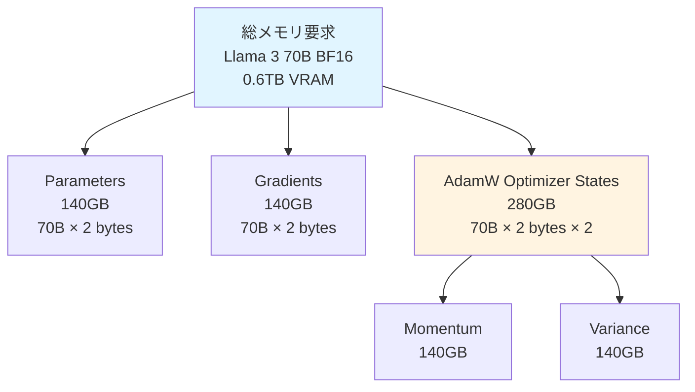
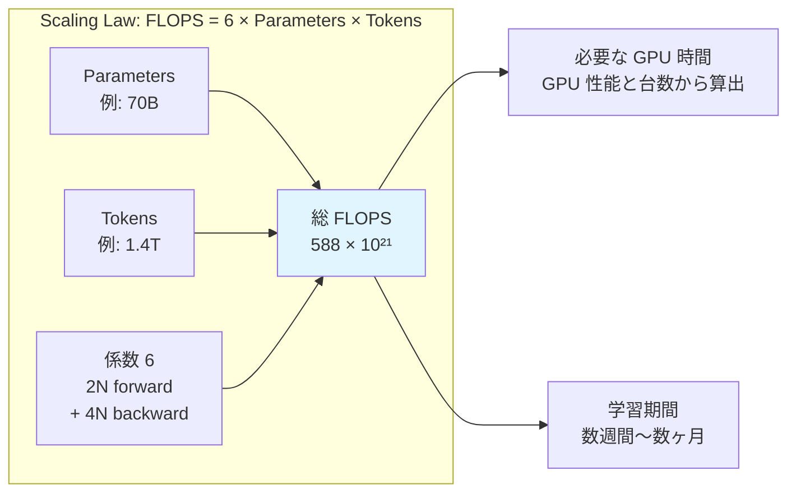
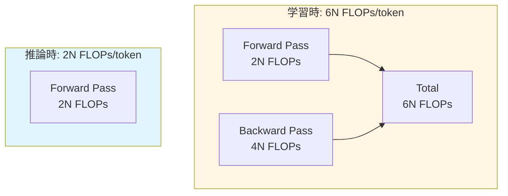
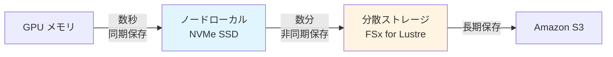

::::details 前提
:::message
**対象読者**: 大規模基盤モデルの学習に興味があり、これから学び始める方。機械学習の基礎知識は不要ですが、クラウドコンピューティングの基本的な概念 (GPU、ストレージなど) に触れたことがあると理解しやすい内容です。
:::
:::message
**ライセンス**: © 2025 littlemex.
本文および自作図表: CC BY 4.0
※公式ドキュメントからの引用や翻訳部分は原典の著作権に従います。
引用画像: 各画像の出典に記載されたライセンスに従います。
:::
:::message
一部 AI を用いて文章を作成します。レビューは実施しますが、見逃せない重大な間違いなどがあれば[こちらのIssue](https://github.com/littlemex/samples/issues)から連絡をお願いします。
:::
::::

**本章では今後実験を進める上で把握しておくべき大規模基盤モデル学習に関する背景と基礎的な知識を整理します。**

---

AWS Principle WW Solutions Architect,GenAI, Keita Watanabe さんの [Scalable Infrastructure for Large-Scale AI Training with AWS Sagemaker Hyperpod](https://speakerdeck.com/keitaw/scalable-infrastructure-for-large-scale-ai-training-with-aws-sagemaker-hyperpod-at-singapore-ai-hour) 資料の流れを参照しながら初学者向けに情報を整理します。

## 前提知識

:::message
**Point !** ***大規模基盤モデル学習には大規模なコンピュートが必要***
:::
2025 年現在、Anthropic、OpenAI、Google、DeepSeek など多くのモデルプロバイダから毎月のように最先端モデルの発表があります。これらの最先端モデルの事前学習には総じて大規模なコンピュートを必要とします。

なぜ大規模なコンピュートが必要なのかを整理する前に、まずは事実としてモデル学習のためにどのくらい大規模なコンピュートが要求されているのか確認してみましょう。

### 基本用語の説明

::::details 読み進める上で必須の用語
- **パラメータ**: モデルが学習する変数の数。70B は 700 億個のパラメータを意味します。パラメータ数が多いほど、モデルは複雑なパターンを学習できますが、必要な計算量とメモリも増加します。
- **トークン**: テキストを小さな単位 (単語や単語の一部) に分割したもの。例えば「こんにちは」は 2-3 トークンになります。1 兆トークンは、約 3,000 億～5,000 億語の英文に相当します。
- **GPU 時間**: GPU 1 台が稼働した時間の合計。例えば GPU 100 台を 10 時間使うと 1,000 GPU 時間になります。
- **事前学習**: モデルに膨大な情報を読ませて、モデルに汎用的な基礎知識を習得させる工程です。
::::

::::details 事前学習に関する参考情報
- [JSAI: 【LLM強化学習①】事前学習と事後学習](https://www.youtube.com/watch?v=nfLLfb3r6io)
- [2024年度 人工知能学会全国大会（第38回）チュートリアル講演１: 大規模言語モデルの開発](https://speakerdeck.com/chokkan/jsai2024-tutorial-llm?slide=15)
::::

## 代表的なモデルの学習規模

以下の表は、代表的なモデルの事前学習時のコンピュートに関する情報を整理したものです。

::::details 表記説明はこちら!
表中の **M** は Million（百万）を表します。例えば 2.788M は 278 万 8 千、30.84M は 3,084 万を意味します。**GPU 時間**は、GPU 1 台が稼働した時間の累計です。例えば [NVIDIA H100 GPU](https://www.nvidia.com/ja-jp/data-center/h100/) という GPU 1 台で 640 万時間かかる学習を、 H100 100 台で並列実行すれば 6 万 4 千時間（約 7.3 年）で完了します。**使用GPU** の欄には、学習に使用された GPU の種類を記載しています。A100-80GB、H100-80GB、H800-80GB などがあり、数字が大きいほど新しい世代で性能が高くなります。H100-80GB の 80GB は VRAM と呼ばれる GPU のメモリサイズを表しています。

**学習トークン**の **T** は Trillion（兆）を表します。2T は 2 兆トークン、15T+ は 15 兆トークン以上を意味します。

:::message alert
ややこしいですが H100 GPU を 8 つ搭載したサーバーが NVIDIA DGX H100 という名前で販売されていたりするので、同じ H100 と書かれている際にはサーバーと GPU のどちらを指しているのか確認したほうが良いでしょう。
:::
::::

| モデル | リリース時期 | 総パラメータ | アクティブ | 学習GPU時間 | 使用GPU | 学習トークン | 特記事項 |
|--------|-------------|-------------|-----------|-------------|---------|-------------|----------|
| **[Llama 2 7B](https://huggingface.co/meta-llama/Llama-2-7b)** | 2023年7月 | 7B | 7B | **0.184M** | A100-80GB | 2T | Dense、BF16 |
| **[Llama 2 13B](https://huggingface.co/meta-llama/Llama-2-13b)** | 2023年7月 | 13B | 13B | **0.369M** | A100-80GB | 2T | Dense、BF16 |
| **[Llama 2 70B](https://huggingface.co/meta-llama/Llama-2-70b)** | 2023年7月 | 70B | 70B | **1.72M** | A100-80GB | 2T | GQA、BF16 |
| **[Llama 3 8B](https://github.com/meta-llama/llama3)** | 2024年4月 | 8B | 8B | **推定1.0M** | H100-80GB | 15T+ | GQA、8K context |
| **[Llama 3 70B](https://github.com/meta-llama/llama3/blob/main/MODEL_CARD.md)** | 2024年4月 | 70B | 70B | **推定6.7M** | H100-80GB | 15T+ | GQA、8K context |
| **[Llama 3.1 8B](https://huggingface.co/meta-llama/Llama-3.1-8B)** | 2024年7月 | 8B | 8B | **1.46M** | H100-80GB | 15T+ | GQA、128K context |
| **[Llama 3.1 70B](https://huggingface.co/meta-llama/Llama-3.1-70B)** | 2024年7月 | 70B | 70B | **7.0M** | H100-80GB | 15T+ | GQA、128K context |
| **[Llama 3.1 405B](https://huggingface.co/meta-llama/Llama-3.1-405B)** | 2024年7月 | 405B | 405B | **30.84M** | H100-80GB | 15T+ | GQA、128K context |
| **[DeepSeek V3](https://huggingface.co/deepseek-ai/DeepSeek-V3)** | 2024年12月 | 671B | 37B | **2.788M** | H800-80GB | 14.8T | MoE、FP8学習 |
| **[Llama4 Maverick](https://huggingface.co/meta-llama/Llama-4-Maverick-17B-128E-Instruct)** | 2025年4月 | 400B | 17B | **2.38M** | H100-80GB | 未公開 | MoE |

::::details 注意事項
:::message alert
GPU を単純に増やせば増やすほど学習時間が単純計算で短縮されるわけではないことに注意が必要です。基本的に計算はノードに閉じていることが最も効率が良く、ノード間で通信をしだすと効率が落ちてきます。100 人それぞれが自分の中だけで考えて意思決定するのと、一箇所に集まった 100 人が議論した上で意思決定する、世界各地にいる 100 人が議論した上で意思決定する、では同じ 100 人による意思決定でも合意形成のためのエフォートが全然違いますよね。誤解を恐れずに言うとそれと同じことです。
:::
:::message alert
必ずしも最新モデルやパラメータ数の大きいモデルの方が性能が良いわけではありません。
以下のサイトにモデルの Intelligence, speed, price などの情報が掲載されており、参考情報として有用かと思います。
:::
https://artificialanalysis.ai/

:::message
皆さんのよくご存知の OpenAI、Anthropic、Google などのプロバイダから提供されるいわゆるプロプライエタリモデルは情報が公開されていないケースが多いため表からは除外しています。
:::
::::

この表から最先端のモデルが如何に大規模なコンピュートを必要とするのか分かったのではないでしょうか。現実的に Llama 3 70B の GPU 時間を 1 ヶ月で達成しようとすると 1250 台の H100 を連携させながら学習する必要があります。AWS の p5.48xlarge だとオンデマンドで単純に計算すると約 440 億円必要です。

大規模基盤モデルの学習手法の詳細について説明することが本書の目的ではなく、分散学習・推論の実験を行うことが目的です。背景情報や理論的説明については既に優れた資料が世の中に多数存在するためそれらの URL を雑に貼って次に進みます。ぜひ一読してから実験されることをお勧めします。

::::details 参考情報
**[2024年度 人工知能学会全国大会（第38回）チュートリアル講演１: 大規模言語モデルの開発](https://speakerdeck.com/chokkan/jsai2024-tutorial-llm?slide=15)**
大規模言語モデルの概要、事前学習・継続事前学習、インストラクションチューニング、アライメント、評価などについて整理されている講演資料。個人的には Chinchilla 則、その後の推論を重視した小さいモデルを多めのデータで訓練する [Beyond Chinchilla-Optimal](https://arxiv.org/abs/2401.00448) あたりの整理は重要に感じた。この辺りは実際に大規模な事前学習をやっていないと調整の感覚を得られなさそう。

**[進化する大規模言語モデル評価: Swallowプロジェクトにおける実践と知見](https://speakerdeck.com/chokkan/swallow-evaluation-instruct-wandb-fullyconnected2025)**
Swallow プロジェクトにおける実践と知見をシェア。主に評価に着目。

**[ 東工大Swallowプロジェクトにおける大規模日本語Webコーパスの構築](https://speakerdeck.com/aya_se/data-centric-ai-swallow-corpus-56e2869a-f9bd-46cb-b030-1012235c37f7)**
コーパス作成の苦労が滲んでいて非常に参考になる。
::::

## 大規模基盤モデル学習が必要とするリソース

:::message
**Point !** ***大規模基盤モデル学習には大規模な計算能力と GPU メモリ、分散ストレージが必要***
:::

1. **GPU メモリ（VRAM）**：モデルのパラメータ、勾配、オプティマイザの状態を保存
2. **計算能力（FLOPS）**：学習に必要な膨大な演算を実行
3. **分散ストレージ**：学習データとチェックポイントを保存

## GPU メモリ要求の概要

Llama 3 70B を BF16 精度で学習する場合、約 0.6TB の GPU メモリが必要です。この内訳は、

- **Parameters（140 GB）**：モデルの重みとバイアス
- **Gradients（140 GB）**：学習時の勾配情報
- **Optimizer States（280 GB）**：AdamW オプティマイザの状態



::::details BF16 とは
:::message
**精度形式とハードウェアの関係**
数値精度を下げること（ex. FP32 → BF16 → FP8 → NVFP4）により、メモリ使用量と計算負荷を削減できます。ただし、これらの低精度形式を効果的に活用するには、対応するハードウェアとソフトウェアフレームワークのサポートが必要です。
:::

**精度選択**
- **BF16**：現代の標準、Ampere 以降の GPU で高速動作
- **FP8**：H100 以降で利用可能、Transformer Engine による自動管理

**参考 URL**
- [NVIDIA Developer Blog: FP8 Introduction](https://developer.nvidia.com/blog/floating-point-8-an-introduction-to-efficient-lower-precision-ai-training/)
- [NVIDIA Developer Blog: NVFP4 Introduction](https://developer.nvidia.com/blog/introducing-nvfp4-for-efficient-and-accurate-low-precision-inference/)
::::

::::details メモリ要求の詳細
:::message
初学者の方は、まず「0.6TB（BF16）必要なんだ」というざっくりの GPU メモリ要求の規模感を理解した上で、詳細は読み飛ばしても構いません。
:::

:::message
メモリ要求の計算方法は、[LLM Training Memory Optimization Guide](https://github.com/WhitePegasis/LLM-Training-Memory-and-Speed-Optimization-Guide) を参照しました。
:::

## Parameters (140 GB)

モデルの重みとバイアス、つまり学習済みの知識そのものを格納するメモリです。70B パラメータとは 700 億個の調整可能な数値のことで、BF16 (2 bytes) という形式で 1 つの数値を保存すると、以下のように計算できます。

**計算式（BF16）**
```
70,000,000,000 個 × 2 bytes = 140,000,000,000 bytes = 140 GB
```

**精度形式によるメモリサイズ**

| 精度形式 | bytes/parameter | 70B モデルのサイズ | 備考 |
|---------|----------------|------------------|------|
| **BF16（半精度）** | 2 bytes | **140 GB** | **標準** |
| **FP32（単精度）** | 4 bytes | 280 GB | 参考 |
| **FP8** | 1 byte | 70 GB | H100 以降 |

## Gradients (140 GB)

バックプロパゲーション（逆伝播）時に「どう改善すべきか」を一時的に記録するメモリです。バックプロパゲーションとは、モデルの予測結果と正解を比較して、「どのパラメータをどのくらい調整すべきか」を計算する処理のことです。これは optimizer step でパラメータを更新した後にクリアされますが、次の学習ステップで再度必要になります。

## AdamW Optimizer States (280 GB)

AdamW オプティマイザは、効率的に学習するために各パラメータに対して 2 種類の履歴情報を保持します。

**2 種類の履歴**

1. **Momentum（1次モーメント）** = 「最近どの方向に改善してきたか」の記録
   - 過去の改善方向を記憶し、同じ方向への改善を加速します
   - 例：坂道を転がるボールのように、勢いをつけて学習を進める

2. **Variance（2次モーメント）** = 「どのくらい安定して改善できているか」の記録
   - 各パラメータの改善のばらつきを記録し、不安定なパラメータは慎重に更新します
   - 例：でこぼこ道では慎重に、平坦な道では大胆に進む

**計算式（BF16）**
```
70,000,000,000 個 × 2 bytes × 2 種類 = 280 GB
```
::::

### メモリ要求から必要な GPU 台数

H100-80GB GPU は 1 台で 80 GB の GPU メモリ（VRAM）を持っています。つまり単純計算で 560GB/80GB = 7 台、の H100-8GB GPU が必要です。

実際には、この他に活性化関数の値を格納するメモリも必要となります。Activations は、ニューラルネットワークの各層で計算された中間結果を保持するもので、バックプロパゲーション時に再利用されます。

:::message
上記は理論上の最小構成です。実用的には、各精度で 1.5-2 倍の GPU が必要となります。
:::

## 計算能力要求の概要

モデル学習に必要な計算量を理解しましょう。計算量は **FLOPS**（Floating Point Operations Per Second、浮動小数点演算の回数）という単位で測定されます。1 回の足し算や掛け算が 1 FLOPS に相当します。モデル学習に必要な計算量は、以下の Scaling Law で推定できます。

**FLOPS = 6 × Parameters × Tokens**

::::details 70B パラメータのモデル、 1.4 兆トークンで学習する場合

## 基本的な計算

```
6 × 70,000,000,000 × 1,400,000,000,000 
= 588,000,000,000,000,000,000,000 回の計算
= 588 × 10²¹ FLOPS
= 588 エクサ FLOPS
```


::::

::::details FLOPS 計算式「6 × Parameters × Tokens」の詳細

:::message
初学者は読み飛ばして大丈夫です。
:::

この係数 6 は、Transformer の学習時における 1 トークンあたりの計算量から導かれます。

## 学習時と推論時の計算量

**Transformer モデルにおける標準的な FLOPS の近似式**

```
学習時（Training）: 6N FLOPs/token
推論時（Inference）: 2N FLOPs/token

※ N = パラメータ数（非埋め込みパラメータ）
```

学習では forward pass と backward pass の両方が必要ですが、推論では forward pass のみで十分なため、推論時の計算量は学習時の 1/3 となります。

## 学習時の内訳（6N FLOPs/token）

```
Forward pass（順伝播）:  2N FLOPs/token
Backward pass（逆伝播）: 4N FLOPs/token
─────────────────────────────────────
合計:                    6N FLOPs/token
```

これを D トークンで学習すると

**総 FLOPS = 6 × N × D**



## Forward Pass が 2N FLOPs/token の理由

Transformer の各演算では **multiply-accumulate operation（積和演算、MAC）** が使用されます。

**MAC 演算とは**
```
a = a + (b × c)
```
この演算は、乗算と加算を組み合わせた複合演算です。

**FLOPS カウントの慣例**
機械学習の分野では、1 回の MAC 演算を **2 FLOPs** としてカウントする慣例があります。
- 乗算：1 FLOP
- 加算：1 FLOP

**具体例**：
行列積 Y = W × X を計算する場合、重み行列 W の各要素について

1. 入力との乗算（1 FLOP）
2. 結果の加算（1 FLOP）

パラメータ数 N 個に対してこの操作を行うため、forward pass では約 2N FLOPs が必要です。

## Backward Pass が約 4N FLOPs/token の理由

逆伝播では、以下の 2 つの計算が必要です

1. **勾配の計算**（forward と同程度）：損失関数の各パラメータに対する偏微分を計算
2. **勾配の伝播**（さらに forward と同程度）：計算した勾配を前の層へ伝播

この 2 つの処理により、backward pass は forward pass の約 2 倍、つまり約 4N FLOPs が必要となります。

## 重要な注意点

:::message alert
**コンテキスト依存項の省略**

モデルの次元数がコンテキスト長に比べて十分大きい場合（d_model ≫ n_ctx/12）、コンテキスト長に依存する計算コストは全体の中で小さな割合となるため省略されています。
:::

:::message alert
**FLOPS と実行時間の違い**

FLOPS（Floating Point Operations Per Second）は理論的な演算回数を示す標準指標です。TPU や GPU などの専用ハードウェアでは、積和演算（MAC）を 1 サイクルで実行できるため、実際の処理時間は FLOPS カウントから予想されるよりも短くなります。しかし、異なるハードウェア間で公平に比較するため、FLOPS カウントでは 1 MAC = 2 FLOPs という慣例が維持されています。
:::

## 推論コストを考慮した最適化

大量の推論リクエストが予想される場合（例：10⁹ 回以上）、推論時の計算コスト（2N FLOPs/token）も重要な要素となります。

[Beyond Chinchilla-Optimal (Sardana & Frankle, 2024)](https://arxiv.org/abs/2401.00448) の研究では、このような場合、Chinchilla の推奨よりも**小さいモデルをより長く学習する**ことで、学習と推論を合わせた総コストを削減できることが示されています。

**例**
- Chinchilla 最適：70B モデルを 1.4T トークンで学習
- Inference 最適：41.6B モデルを 7.9T トークンで学習

学習コストは増加しますが、何兆回も実行される推論が高速になるため、総コストは削減できます。

## 出典
- [Scaling Laws for Neural Language Models (Kaplan et al., 2020)](https://arxiv.org/abs/2001.08361)：6N per token の標準的な見積もり方法を定義
- [Training Compute-Optimal Large Language Models (Hoffmann et al., 2022、通称 Chinchilla 論文)](https://arxiv.org/abs/2203.15556)：Compute-Optimal な学習方法を提案
- [Beyond Chinchilla-Optimal (Sardana & Frankle, 2024)](https://arxiv.org/abs/2401.00448)：推論コストを考慮した最適化を提案
::::

### 計算要求から必要な GPU 台数

[NVIDIA H100 GPU](https://www.nvidia.com/ja-jp/data-center/h100/) の理論演算性能は、

| 精度形式 | 理論性能 | 実効性能（50%） |
|---------|---------|----------------|
| **FP32** | 67 TFLOPS | 33.5 TFLOPS |
| **BF16 Tensor Core** | 1,979 TFLOPS | 約 1 PFLOPS |
| **FP8 Tensor Core** | 3,958 TFLOPS | 約 2 PFLOPS |

:::message
実効性能 50% は保守的な見積もりです。実際の学習では、通信オーバーヘッドやメモリアクセスのボトルネックにより、理論ピーク性能の 50-60% 程度しか達成できない可能性があります。
:::

例えば、70B パラメータのモデルを 1.4 兆トークンで学習する場合、約 588 エクサ FLOPS の計算が必要です。H100 GPU（BF16）の実効性能を 1 PFLOPS と仮定すると、1 台で約 19 年、1,000 台で約 7 日かかる計算となります。台数と所要時間はトレードオフの関係にあることがわかると思います。通常は費用や調達面から利用できる台数に上限があるため台数と総 FLOPS から所要時間を概算できます。

::::details 1 台での所要時間の計算
```
理論性能: 1,979 TFLOPS ≈ 2 PFLOPS
実効性能: 約 1 PFLOPS = 1 × 10¹⁵ FLOPS/秒

総 FLOPS: 588 × 10²¹ FLOPS

所要時間:
588 × 10²¹ ÷ (1 × 10¹⁵)
= 588 × 10⁶ 秒
= 5.88 × 10⁸ 秒

時間に変換:
5.88 × 10⁸ ÷ 3,600 = 163,333 時間

年に変換:
163,333 ÷ 8,760 ≈ 18.6 年
```
::::

::::details 複数台での所要時間
:::message alert
GPU を単純に増やせば増やすほど学習時間が単純計算で短縮されるわけではないことに注意が必要です。ノード間通信のオーバーヘッドにより、GPU 数が増えるほど効率は低下します。
:::

H100 GPU（BF16、実効 1 PFLOPS）を使用した場合、

| GPU 台数 | 理論学習期間 | 実際の学習期間（1.5倍） |
|---------|-------------|---------------------|
| 1,000 台 | 6.8 日 | 約 10 日 |
| 5,000 台 | 1.4 日 | 約 2 日 |
| 10,000 台 | 0.7 日 | 約 1 日 |
::::

## 分散ファイルストレージ要求

大規模基盤モデルの学習では、数十から数百 TB に及ぶ学習データへの高速アクセスと、頻繁なチェックポイント保存が不可欠です。このセクションでは、代表的なデータセットのサイズと、チェックポイント要求について整理します。

::::details チェックポイントとは
チェックポイントは、学習途中におけるモデルの「セーブデータ」です。長時間にわたる大規模モデルの学習では、ハードウェア故障やシステムエラーが発生する可能性があります。チェックポイントを定期的に保存することで、故障が発生しても最後に保存した状態から学習を再開でき、それまでの学習成果を無駄にせずに済みます。

## チェックポイントに含まれる情報

チェックポイントには、以下の 2 種類の情報が保存されます。

**Parameters（モデルの重み）**
モデルが学習した知識そのものです。70B パラメータモデルの場合、BF16 精度で 140GB の容量が必要です。

**Optimizer States（オプティマイザの状態）**
AdamW オプティマイザは、効率的な学習のために各パラメータに対して 2 種類の履歴を保持します。

- **Momentum（1 次モーメント）**: 過去の改善方向を記憶し、同じ方向への学習を加速します
- **Variance（2 次モーメント）**: 各パラメータの改善のばらつきを記録し、不安定なパラメータは慎重に更新します

70B パラメータモデルの場合、BF16 精度で 280GB（各 140GB × 2 種類）の容量が必要です。

合計すると、Llama 3 70B のチェックポイントは BF16 精度で **420GB**（Parameters 140GB + Optimizer States 280GB）となります。

## 大規模クラスタにおける課題

[Amazon Nova の開発事例](https://speakerdeck.com/keitaw/optimizing-foundation-model-development-with-amazon-sagemaker-hyperpod-insights-from-training-the-amazon-nova-model?slide=19)では、数万台の GPU を使用した学習において、1 日に 10～20 回のハードウェア故障が発生しました。クラスタの規模が大きくなるほど、故障の頻度は高くなります。

故障が頻繁に発生する大規模学習では、この中断時間の累積が膨大な時間とコストの損失につながります。Hyperpod の実装では、3 つのストレージ階層を使い分けることで、高速な保存と復旧を実現しています。


::::

### 代表的なデータセットのサイズ

学習に使用される代表的なデータセットのトークン数とサイズを以下の表にまとめます。

| データセット | トークン数 | サイズ | 特記事項 |
|-------------|-----------|--------|----------|
| **[WikiText-103](https://huggingface.co/datasets/Salesforce/wikitext)** | 103M | 750MB | 英語 Wikipedia から抽出 |
| **C4.EN** | 156B | 305GB | Common Crawl ベース |
| **[RedPajama-Data-1T](https://github.com/togethercomputer/RedPajama-Data)** | 1T | 5TB | 多様なソースから構成 |
| **[RedPajama-Data-v2](https://github.com/togethercomputer/RedPajama-Data)** | 30T | 170TB | 100B 文書、重複除去後 20B 文書 |
| **[llm-jp-corpus-v3](https://llm-jp.github.io/awesome-japanese-llm/en/)** | 2.1T | 推定 15TB | 日本語を含む多言語コーパス |
| **[llm-jp-corpus-v4 (日本語)](https://huggingface.co/llm-jp/llm-jp-modernbert-base)** | 0.69T | 3.4TB | 日本語のみ |
| **[Swallow-Corpus](https://speakerdeck.com/aya_se/data-centric-ai-swallow-corpus-56e2869a-f9bd-46cb-b030-1012235c37f7)** | 推定 1.7T | 推定 12TB | Common Crawl から 0.27% に精錬 |

これらのデータセットは、モデルの学習中に繰り返しアクセスされるため、高速な読み取り性能を持つ分散ストレージが必要となります。特に数千 GPU での学習では、全 GPU からの同時アクセスに耐えられる帯域幅が求められます。

### チェックポイント間隔

チェックポイントの保存頻度は [VAST Data の分析](https://www.vastdata.com/blog/optimizing-checkpoint-bandwidth-for-llm-training)によれば、18 のクラスタで 40 の大規模学習実行（85,000 以上のチェックポイント）を調査した結果、実務的な経験則として平均故障間隔（MTTI）の約 1/10 が採用されていることがわかりました。

Llama 3.1 405B の学習事例 (16,000 H100 GPU) では、平均故障間隔 (Mean Time To Interrupt) が 150 分でした。この場合、推奨されるチェックポイント間隔は、故障間隔の約 1/10、つまり 15 分となります。


### 総ストレージ容量の概算

学習に必要な総ストレージ容量は、学習データとチェックポイントの両方を考慮する必要があります。

**総ストレージ容量 = 学習データサイズ + (チェックポイントサイズ × 保持世代数)**

::::details Llama 3.1 405B、RedPajama-Data-v2 (170TB) で学習する場合
- **学習データ**: 170TB
- **チェックポイントサイズ**: 2.43TB (BF16)
- **保持世代数**: 3 世代
- **チェックポイント合計**: 2.43TB × 3 = 7.29TB

:::message
**総ストレージ容量**: 170TB + 7.29TB ≈ **177TB**
:::
::::

### 書き込み帯域幅の要求

チェックポイントの書き込み帯域幅は、保存頻度とチェックポイントサイズから計算できます。

**必要帯域幅 = チェックポイントサイズ ÷ (チェックポイント間隔 × (1 - オーバーヘッド率))**

::::details Llama 3.1 405B、チェックポイント間隔 15 分、オーバーヘッド 10%
:::message
**必要帯域幅** = 2.43TB ÷ (15分 × 60秒 × 0.9) ≈ 2.43TB ÷ 810秒 ≈ **3GB/s**
:::
::::

## まとめ

大規模基盤モデル学習が必要とするリソースを、GPU メモリ、計算能力、分散ストレージ、の観点から整理しました。これらの整理から大規模基盤モデル学習に膨大なリソースが要求されることが理解できたのではないでしょうか。以降の章ではこれらのリソース要求に耐え得るインフラストラクチャについて整理します。