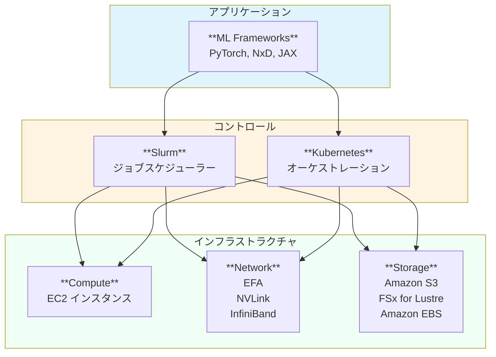
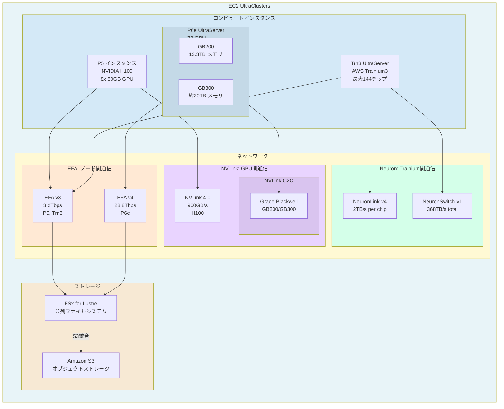
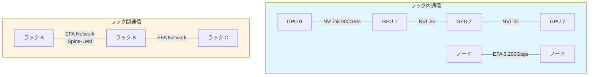
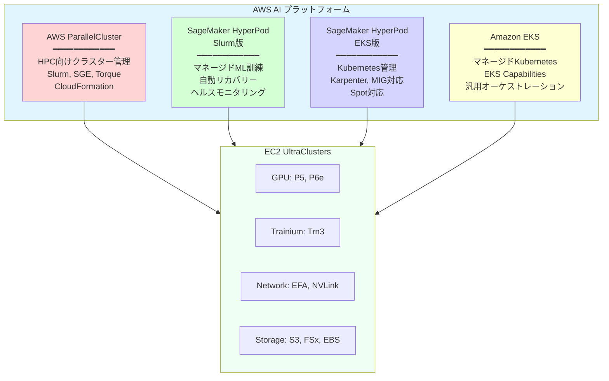
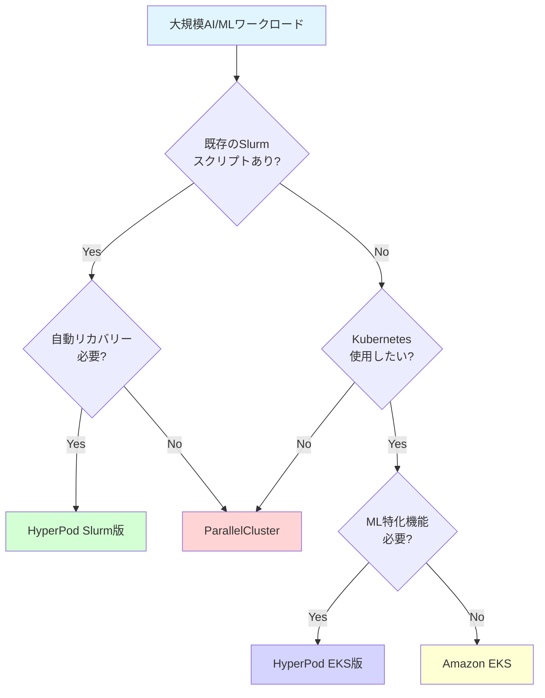
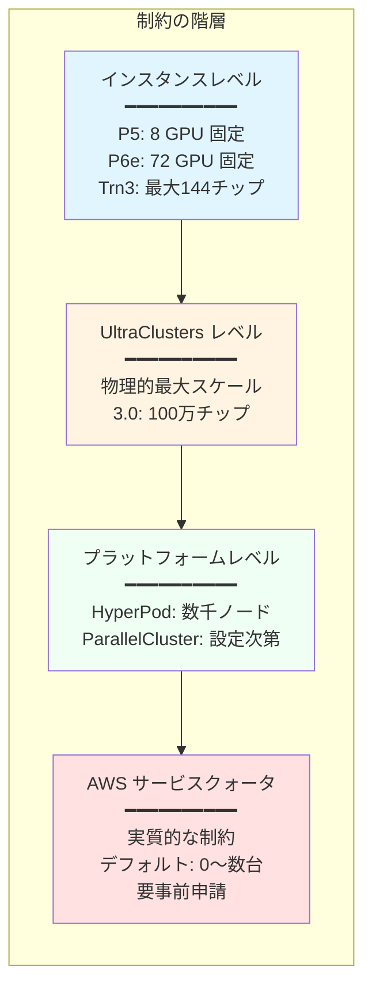

::::details 前提
:::message
**対象読者**: 大規模基盤モデルがどういうものかを理解している方、これからモデル学習を行う方
:::
:::message
**ライセンス**: © 2025 littlemex.
本文および自作図表: CC BY 4.0
※公式ドキュメントからの引用や翻訳部分は原典の著作権に従います。
引用画像: 各画像の出典に記載されたライセンスに従います。
:::
:::message
一部 AI を用いて文章を作成します。レビューは実施しますが、見逃せない重大な間違いなどがあれば[こちらのIssue](https://github.com/littlemex/samples/issues)から連絡をお願いします。
:::
::::

**本章では大規模基盤モデル学習に求められるインフラストラクチャについて整理します。**

---

AWS Principle WW Solutions Architect,GenAI, Keita Watanabe さんの [Scalable Infrastructure for Large-Scale AI Training with AWS Sagemaker Hyperpod](https://speakerdeck.com/keitaw/scalable-infrastructure-for-large-scale-ai-training-with-aws-sagemaker-hyperpod-at-singapore-ai-hour) 資料の流れを参照しながら初学者向けに情報を整理します。

# インフラストラクチャ

:::message
***Point! 大規模基盤モデル学習に必要なインフラストラクチャの独自構築は非常に難易度が高い***
:::

以下に大規模基盤モデルの学習・推論で必要な技術スタックの概観を示します。本章では一番下のインフラストラクチャ層について整理します。規模が大きくなるにつれてオンプレ上で独自でこれらのインフラストラクチャを構築するハードルは非常に高いものとなります。故障時の交換などで全系が止まってしまう、それを正常に検知する、交換完了まで系を縮退して運用する、など考慮事項を考えるとなかなかやばそうですね。



*図: AWS で大規模基盤モデルを構築する際のビルディングブロック*

## Amazon EC2 UltraClusters


*図: [Amazon EC2 UltraClusters](https://aws.amazon.com/ec2/ultraclusters/)* の構成

Amazon EC2 UltraClusters は、大規模な AI/ML ワークロード向けに設計された物理的なハードウェアインフラストラクチャの集合体です。数千から数万の GPU やカスタムシリコンを高速ネットワークで相互接続し、単一の統合されたコンピューティング環境を提供します。

::::details UltraClusters の必要性

なぜこのようなインフラストラクチャが必要なのでしょうか。ウェブサービスのように Amazon EC2 を複数台使いたいなら、オートスケールして Multi AZ 構成にすればいいのではないか、と思う方がいるかもしれません。

## ウェブサービスと基盤モデル学習のインフラストラクチャの違い

:::message
**通常のウェブサービス（疎結合）**
- 各サーバーは独立して動作
- ノード間の通信は少ない
- レイテンシは数十～数百ミリ秒でも問題なし
- → Multi AZ 構成で高可用性を実現
:::

:::message
**基盤モデル学習（密結合）**
- 全 GPU が常に同期して計算
- 毎回の学習ステップで大量のデータを交換（例: Llama 3 70B で 245GB/iteration）
- **レイテンシはマイクロ秒単位が必須**
- → Single AZ の物理的近接性が必須
:::

## なぜ Single AZ なのか

**Multi AZ の問題点**
- AZ 間レイテンシ: 1-5ms
- 専用高速ネットワークなし
- 学習時間が数十倍～数百倍に増加し実用不可能

**Single AZ（UltraClusters）の利点**
- 物理的な近接性: ラック内/ラック間で配置が可能
- 専用ネットワーク: EFA、NVLink による超低レイテンシ（マイクロ秒単位）

## FSx for Lustre も Single AZ

チェックポイント保存時、数百の GPU が同時にストレージへアクセスします。仮に Multi AZ 構成が実現できたとしても帯域幅が不足し、保存に数十分かかる可能性があります。Single AZ では EFA 経由で数百 GB/s の帯域幅を実現し、保存時間を最小化します。

## まとめ

Amazon EC2 UltraClusters は、通常のウェブサービスの「分散」「高可用性」とは逆の「集中」「物理的近接性」を重視した設計です。これは大規模基盤モデルの学習という密結合ワークロードの要件（超低レイテンシ、超高帯域幅）を満たすために必要不可欠なアーキテクチャです。
::::


## UltraClusters の主要コンポーネント概観

以下に UltraClusters の主要コンポーネントを整理しました。古いインスタンスタイプなどは省略しています。



## インスタンス

### NVIDIA GPU インスタンス

::::details GPU インスタンスタイプ表
| インスタンスタイプ | Accelerator (数) | VRAM | Local SSD | Network (EFA) | 備考 |
|------------------|---------|-----------|----------|--------------|------|
| P4d.24xlarge | A100 (8) | 320GB | 8x1TB NVMe | 400Gbps | NVLink 3.0, 40GB/GPU |
| P4de.24xlarge | A100 (8) | 640GB | 8x1TB NVMe | 400Gbps | NVLink 3.0, 80GB/GPU |
| P5.48xlarge | H100 (8) | 640GB | 8x3.8TB NVMe | 3,200Gbps | NVLink 4.0, 80GB/GPU |
| P5e.48xlarge | H200 (8) | 1,128GB | 8x3.8TB NVMe | 3,200Gbps | NVLink 4.0, 141GB/GPU |
| P5en.48xlarge | H200 (8) | 1,128GB | 8x3.8TB NVMe | 3,200Gbps | Intel CPU, 141GB/GPU |
| P6-B200.48xlarge | B200 (8) | 1,432GB | - | 3,200Gbps | 179GB/GPU |
| P6-B300.48xlarge | B300 (8) | 2,148GB | - | 6,400Gbps | 268GB/GPU, EFA 2倍 |
| P6e-GB200 (UltraServer) | GB200 (72) | 13.3TB | - | 28.8Tbps | NVLink-C2C, 185GB/GPU |
| P6e-GB300 (UltraServer) | GB300 (72) | ~20TB | - | 28.8Tbps | NVLink-C2C, ~278GB/GPU |
::::

::::details ## インスタンスタイプ選定ガイド

ここに整理して

::::

#### P6e UltraServer シリーズ（NVIDIA GB200/GB300）

**P6e-GB200 UltraServer**（2024年発表）
- 72 GPU（NVIDIA GB200 NVL72）
- 13.3TB GPU メモリ
- 28.8Tbps ネットワーク帯域幅
- NVLink-C2C 接続による Grace Blackwell Superchip

**P6e-GB300 UltraServer**（2025年12月発表、GA）
- P6e-GB200 と比較して GPU メモリ 1.5倍（約20TB）
- FP4 コンピュート 1.5倍（スパースなし）
- 高コンテキスト要求モデル、推論技術（Reasoning）、Agentic AI に最適

#### P5 インスタンス（NVIDIA H100）

- 8x NVIDIA H100 80GB GPU
- 3,200Gbps EFA ネットワーク
- 640GB システムメモリ
- NVLink 4.0（900GB/s）でGPU間を接続
- 汎用的な大規模モデル訓練に最適


**接続の説明**:
- **EFA（ノード間通信）**: P5/Trn3 は EFA v3（3.2Tbps）、P6e は EFA v4（28.8Tbps）
- **NVLink（GPU 間通信）**: P5 は NVLink 4.0（900GB/s）、P6e は NVLink-C2C（Grace-Blackwell アーキテクチャ）
- **NeuronLink/NeuronSwitch（Trainium 間通信）**: チップあたり2TB/s、UltraServer 全体で368TB/s
- **FSx for Lustre**: EFA 経由でアクセス、分散並列ファイルシステム
- **S3**: FSx for Lustre のバックエンドとして統合可能、または VPC エンドポイント経由でアクセス
- **EBS**: 各インスタンスに直接接続（図には表示していないが、OS やアプリケーション用途で使用）

### 世代別 UltraClusters の進化

| 世代 | 主要チップ | 最大スケール | ネットワーク | 特徴 |
|------|-----------|------------|------------|------|
| **UltraClusters 1.0** | P4d (A100) | 数千GPU | 400Gbps EFA | 初代大規模クラスター |
| **UltraClusters 2.0** | P5 (H100) | 20,000 GPU | 3,200Gbps EFA | NVLink 強化 |
| **UltraClusters 3.0** | Trn3, P6e (GB200/GB300) | 100万チップ | 28.8Tbps EFA | 前世代の10倍スケール |

2025年12月の re:Invent で発表された **UltraClusters 3.0** では、最大100万個のチップを接続可能になり、前世代と比較して10倍のスケールを実現しています。

### 主要インスタンスタイプの詳細


#### Trn3 UltraServer（AWS Trainium3）

2025年12月に一般提供開始された AWS の第3世代カスタム AI チップです。

**主要スペック**:
- 1台の UltraServer に最大144個の Trainium3 チップ
- 最大362 FP8 PFLOPs の処理能力
- 3nm プロセス技術

**Trainium2 との比較**:
- 計算性能: 最大4.4倍向上
- エネルギー効率: 4倍向上
- メモリ帯域幅: 約4倍向上
- レイテンシ: 4分の1に削減

**ネットワーク機能**:
- **NeuronSwitch-v1**: 
  - All-to-all ファブリックアーキテクチャ
  - NeuronLink-v4 を使用
  - チップあたり2TB/s（2,560GB/s）の帯域幅
  - Trn2 UltraServer 比で2倍の帯域幅
  - 144チップ構成での総帯域幅: 約368TB/s
- 強化された Neuron Fabric ネットワーク: チップ間通信遅延を10マイクロ秒未満に削減

**次世代 Trainium4**（発表済み、リリース予定）:
- FP4 処理性能: 6倍以上
- FP8 性能: 3倍
- メモリ帯域幅: 4倍
- **NVIDIA NVLink Fusion** 統合: Trainium4、Graviton、EFA が共通の MGX ラック内で連携

### ネットワークアーキテクチャ

EC2 UltraClusters のネットワークは、大規模分散訓練において最も重要なコンポーネントの一つです。

#### EFA (Elastic Fabric Adapter)

AWS が開発した高速ネットワークインターフェースで、以下の特徴があります。

- **低レイテンシ**: マイクロ秒単位の通信遅延
- **高帯域幅**: 最大3,200Gbps（P5）、28.8Tbps（P6e）
- **スケーラビリティ**: 数万ノードまでスケール可能
- **OS バイパス**: カーネルを介さない直接通信

**世代別 EFA 性能**:
- EFA v1: 100Gbps
- EFA v2: 400Gbps
- EFA v3: 3,200Gbps（P5）
- EFA v4: 28.8Tbps（P6e）

#### NVLink

NVIDIA GPU 間を接続する高速インターコネクトです。

- **NVLink 3.0**（A100）: 600GB/s
- **NVLink 4.0**（H100）: 900GB/s
- **NVLink-C2C**（GB200/GB300）: Grace CPU と Blackwell GPU を接続

#### NeuronLink と NeuronSwitch

AWS Trainium 専用の高速インターコネクト技術です。

**NeuronLink-v4**（Trainium3）:
- チップあたり2TB/s（2,560GB/s）の帯域幅
- デバイス間の効率的なスケールアウト訓練を実現
- デバイス間のメモリプーリングをサポート

**NeuronSwitch-v1**（Trn3 UltraServer）:
- All-to-all ファブリックアーキテクチャ
- 144チップを完全メッシュで接続
- UltraServer 内の総帯域幅: 約368TB/s
- Trn2 UltraServer 比で2倍の帯域幅
- Model Parallel と MoE の効率を向上

#### ネットワーク技術の比較

| 技術 | 用途 | 帯域幅/デバイス | スコープ | 主な用途 |
|------|------|---------------|---------|---------|
| **NVLink 4.0** | GPU間接続 | 900GB/s | ノード内（8 GPU） | Tensor Parallel |
| **NVLink-C2C** | CPU-GPU接続 | - | UltraServer内 | Grace-Blackwell |
| **NeuronLink-v4** | Trainium間接続 | 2TB/s (2,560GB/s) | UltraServer内 | Tensor Parallel、MoE |
| **NeuronSwitch-v1** | Trainium間ファブリック | 368TB/s（総計） | UltraServer内（144チップ） | 超大規模 Model Parallel |
| **EFA v3** | ノード間接続 | 3,200Gbps | ノード間 | Data Parallel（FSDP） |
| **EFA v4** | ノード間接続 | 28.8Tbps | ノード間 | 超大規模 Data Parallel |

**特筆すべき点**:
- **NeuronSwitch-v1** の総帯域幅368TB/s は、単一 UltraServer 内で NVIDIA NVLink 4.0（900GB/s × 8 GPU = 7.2TB/s）を大きく上回る
- All-to-all トポロジーにより、任意の2チップ間で直接通信が可能
- Model Parallel や MoE（Mixture of Experts）での通信効率が向上

#### ネットワークトポロジー



- **ノード内通信**: NVLink による超高速 GPU 間通信
- **ノード間通信**: EFA による低レイテンシ・高帯域幅通信
- **ラック間通信**: Spine-Leaf トポロジーによるスケーラブルなネットワーク

### ストレージオプション

大規模モデル訓練では、チェックポイント保存、データセット読み込み、結果保存のために高性能なストレージが必要です。

#### Amazon S3

- **容量**: 事実上無制限
- **用途**: データセット保存、チェックポイントバックアップ
- **料金**: 低コスト（$0.023/GB/月、us-east-1）

#### FSx for Lustre

- **帯域幅**: 最大数百GB/s
- **レイテンシ**: サブミリ秒
- **用途**: 訓練中のチェックポイント、高速データ読み込み
- **S3 統合**: S3 バケットを自動マウント可能

#### Amazon EBS

- **種類**: gp3, io2, io2 Block Express
- **最大帯域幅**: 8,000MB/s（io2 Block Express）
- **用途**: OS、アプリケーション、一時データ

## AWS AI プラットフォームの選択肢

EC2 UltraClusters 上で大規模 AI/ML ワークロードを実行するには、適切なオーケストレーション・管理プラットフォームを選択する必要があります。AWS は以下の4つの主要な選択肢を提供しています。



### 比較表

| プラットフォーム | オーケストレーター | 管理レベル | 自動リカバリー | 主な用途 | Spot対応 |
|----------------|------------------|-----------|--------------|---------|---------|
| **ParallelCluster** | Slurm, SGE, Torque | セルフマネージド | 手動 | HPC、バッチ処理 | 手動設定 |
| **HyperPod (Slurm)** | Slurm | フルマネージド | 自動 | 長期間ML訓練 | ❌ |
| **HyperPod (EKS)** | Kubernetes | フルマネージド | 自動 | コンテナベースML | ✅ 自動 |
| **EKS** | Kubernetes | マネージドK8s | 手動 | 汎用コンテナ | 手動設定 |

### 1. AWS ParallelCluster

**概要**: HPC（High Performance Computing）向けのクラスター管理ツールで、従来の HPC ワークロードや研究機関での利用に最適です。

**特徴**:
- CloudFormation による自動デプロイ
- Slurm, SGE, Torque などの HPC ジョブスケジューラーをサポート
- カスタム AMI、スクリプトによる柔軟な環境構築
- コスト最適化のための Auto Scaling

**適用ケース**:
- 従来の HPC ワークロード（分子動力学、気象シミュレーションなど）
- 研究機関での大規模計算
- オンプレミス HPC からのリフト&シフト

**制約**:
- ノード障害時のリカバリーは手動
- ヘルスチェックは基本的な死活監視のみ
- ML 特化の最適化は限定的

### 2. Amazon SageMaker HyperPod（Slurm版）

**概要**: Slurm をジョブスケジューラーとして使用する、フルマネージドの ML 訓練プラットフォームです。

**特徴**:
- **自動ノードリカバリー**: ハードウェア障害を検出し、自動的にノードを交換
- **ヘルスモニタリング**: GPU、ネットワーク、ストレージの包括的な監視
- **自動ジョブ再開**: チェックポイントから自動的に訓練を再開
- **Slurm 統合**: 既存の Slurm スクリプトをそのまま使用可能

**適用ケース**:
- 数週間から数ヶ月にわたる大規模基盤モデル訓練
- Slurm に慣れたチームでの利用
- 高い信頼性が求められる本番環境

**新機能（re:Invent 2025）**:
- **Checkpointless Training**: リカバリー時間を80%以上削減
- **Elastic Training**: リソース可用性に基づく自動スケーリング
- **Programmatic Node Operations**: API による再起動・交換

### 3. Amazon SageMaker HyperPod（EKS版）

**概要**: Kubernetes（EKS）をオーケストレーターとして使用する、最も柔軟で現代的なマネージド ML プラットフォームです。

**特徴**:
- **Kubernetes ネイティブ**: 標準的な K8s API、kubectl、Helm を使用
- **Karpenter 統合**: ワークロードに応じた自動スケーリング
- **コンテナベース**: Docker コンテナによる環境の再現性
- **マルチテナント**: Namespace による分離、RBAC

**適用ケース**:
- コンテナベースの ML ワークフロー
- CI/CD パイプラインとの統合
- マイクロサービス的なアプローチ
- 複数チームでのリソース共有

**新機能（re:Invent 2025）**:
- **MIG（Multi-Instance GPU）サポート**: 1 GPU を最大7パーティションに分割
- **Spot Instances サポート**: 最大90%のコスト削減
- **Custom Kubernetes Labels & Taints**: 柔軟な Pod スケジューリング
- **Managed Tiered KV Cache**: 推論レイテンシ40%削減、スループット25%向上

### 4. Amazon EKS（スタンドアロン）

**概要**: AWS のマネージド Kubernetes サービスで、汎用的なコンテナオーケストレーションに使用されます。

**特徴**:
- **標準 Kubernetes**: アップストリーム K8s との完全な互換性
- **EKS Capabilities**（2025年12月発表）: Argo CD, ACK, KRO の統合
- **柔軟性**: あらゆるコンテナワークロードに対応
- **エコシステム**: Kubernetes エコシステムのツールを活用

**適用ケース**:
- ML 以外のワークロードも含む統合プラットフォーム
- 既存の Kubernetes 環境からの移行
- カスタマイズ性を最大限に活用したい場合

**EKS Capabilities**（2025年12月発表）:
- **Argo CD**: GitOps による継続的デプロイメント
- **ACK（AWS Controllers for Kubernetes）**: K8s から AWS リソースを管理
- **KRO（Kube Resource Orchestrator）**: 複雑なリソースの抽象化

### プラットフォーム選択のガイドライン



**選択基準**:

1. **既存のワークフロー**: Slurm スクリプトがあれば HyperPod Slurm、Kubernetes 経験があれば HyperPod EKS
2. **管理レベル**: フルマネージドを求めるなら HyperPod、柔軟性を求めるなら ParallelCluster や EKS
3. **コスト**: Spot インスタンスを活用したいなら HyperPod EKS
4. **スケール**: 数万 GPU のスケールには HyperPod
5. **統合**: 既存の AWS サービスとの統合には ACK を含む EKS Capabilities

## プラットフォーム別インスタンス対応表

各プラットフォームで利用可能なインスタンスタイプを整理します。

| インスタンスタイプ | ParallelCluster | HyperPod (Slurm) | HyperPod (EKS) | EKS |
|------------------|----------------|------------------|----------------|-----|
| **P5 (H100)** | ✅ | ✅ | ✅ | ✅ |
| **P6e-GB200** | ✅ | ✅ | ✅ | ✅ |
| **P6e-GB300** | ✅ | ✅ | ✅ | ✅ |
| **P4d (A100)** | ✅ | ✅ | ✅ | ✅ |
| **Trn1 (Trainium)** | ✅ | ✅ | ✅ | ✅ |
| **Trn2 (Trainium2)** | ✅ | ✅ | ✅ | ✅ |
| **Trn3 (Trainium3)** | ✅ | ✅ | ✅ | ✅ |
| **Inf2 (Inferentia2)** | ✅ | ✅ | ✅ | ✅ |
| **Spot インスタンス** | 手動設定 | ❌ | ✅ 自動 | 手動設定 |
| **MIG 分割** | 手動設定 | ❌ | ✅ 自動 | 手動設定 |

### 注意事項

- **ParallelCluster**: すべてのインスタンスタイプをサポートしますが、Spot や MIG は手動設定が必要
- **HyperPod (Slurm)**: 現在 Spot と MIG は未サポート（将来的にサポート予定の可能性）
- **HyperPod (EKS)**: Spot と MIG を完全サポートし、自動管理機能を提供
- **EKS**: すべてのインスタンスをサポートしますが、Spot や MIG の管理は自前で実装

## re:Invent 2025 主要アップデート

2025年11月～12月の AWS re:Invent で発表された、大規模 AI/ML インフラストラクチャに関する主要なアップデートを整理します。

### ハードウェア・インフラストラクチャ

#### 1. Trn3 UltraServer（一般提供開始）

**発表日**: 2025年12月2日

**主要改善**:
- Trainium2 比で計算性能4.4倍、エネルギー効率4倍
- メモリ帯域幅4倍、レイテンシ1/4
- EC2 UltraClusters 3.0 で最大100万チップ接続可能（前世代の10倍）

**実測パフォーマンス**（OpenAI GPT-OSS モデル）:
- チップあたりのスループット: 3倍向上
- 応答時間: 4倍高速化

**参考**: [AWS ブログ記事](https://www.aboutamazon.com/news/aws/trainium-3-ultraserver-faster-ai-training-lower-cost)

#### 2. P6e-GB300 UltraServer（一般提供開始）

**発表日**: 2025年12月2日

**主要スペック**:
- NVIDIA GB300 NVL72 搭載
- GPU メモリ: P6e-GB200 の1.5倍（約20TB）
- FP4 コンピュート: P6e-GB200 の1.5倍

**用途**: 高コンテキスト要求モデル、推論技術（Reasoning）、Agentic AI

**参考**: [AWS 発表](https://aws.amazon.com/jp/about-aws/whats-new/2025/12/amazon-ec2-p6e-gb300-ultraservers-nvidia-gb300-nvl72-generally-available/)

#### 3. AWS AI Factories

**コンセプト**: 顧客データセンター内への専用 AI インフラ直接展開

**提供内容**:
- NVIDIA GB300、AWS Trainium チップ
- Amazon Bedrock、SageMaker AI などのサービス
- AWS が完全管理（展開、スケーリング、パッチ、セキュリティ）

**メリット**:
- 既存のデータセンタースペース、ネットワーク、電力を活用
- データ主権と規制要件への対応
- 導入期間の大幅短縮

**実例**: サウジアラビアの HUMAIN と協力し、GB300 GPU を含む最大150,000個の AI チップを備えた「AI ゾーン」を構築中

**参考**: [AWS ニュース](https://www.aboutamazon.com/news/aws/aws-data-centers-ai-factories)

### SageMaker HyperPod の新機能

#### 4. Spot Instances サポート（HyperPod EKS）

**発表日**: 2025年11月24日

**主要機能**:
- On-Demand 比で最大90%のコスト削減
- Karpenter による自動スケーリング
- 中断処理の完全自動化（2分前通知、グレースフル eviction）
- 自動容量再プロビジョニング

**対応インスタンス**: ml.p4d.24xlarge、ml.p5.48xlarge、ml.p5e.48xlarge など

**具体例**（p4d.24xlarge × 10台、24時間×30日）:
- 従来（On-Demand 100%）: $236,000/月
- 新方式（Spot 80% + On-Demand 20%）: $73,400/月
- **削減額: $162,600/月（69%削減）**

**参考**: [AWS 発表](https://aws.amazon.com/jp/about-aws/whats-new/2025/11/amazon-sagemaker-hyperpod-spot-instances/)

#### 5. MIG（Multi-Instance GPU）サポート（HyperPod EKS）

**発表日**: 2025年11月24日

**主要機能**:
- 1つの GPU を最大7つの独立したパーティションに分割
- ハードウェアレベルでの分離と予測可能なパフォーマンス
- コンソールまたは Kubernetes での簡単設定

**対応 GPU と MIG プロファイル**:

**A100 GPU (ml.p4d.24xlarge)**:
- 1g.5gb（5GB）: 1 GPU → 7パーティション
- 2g.10gb（10GB）: 1 GPU → 3パーティション
- 3g.20gb（20GB）: 1 GPU → 2パーティション
- 7g.40gb（40GB）: GPU 全体使用

**H100 GPU (ml.p5.48xlarge)**:
- 1g.10gb（10GB）: 1 GPU → 7パーティション
- 2g.20gb（20GB）: 1 GPU → 3パーティション
- 3g.40gb（40GB）: 1 GPU → 2パーティション
- 7g.80gb（80GB）: GPU 全体使用

**H200 GPU (ml.p5e.48xlarge, ml.p5en.48xlarge)**:
- 1g.18gb（18GB）: 1 GPU → 7パーティション
- 2g.35gb（35GB）: 1 GPU → 3パーティション
- 3g.71gb（71GB）: 1 GPU → 2パーティション
- 7g.141gb（141GB）: GPU 全体使用

**効果**（ml.p4d.24xlarge、8 × A100 80GB の例）:
- 従来: 8タスク並行実行、GPU 利用率 ~10%
- MIG 有効化: 56タスク並行実行（8 GPU × 7パーティション）、GPU 利用率 ~70-80%
- **同じコストで7倍のスループット**

**参考**: [AWS 発表](https://aws.amazon.com/jp/about-aws/whats-new/2025/11/sagemaker-hyperpod-nvidia-multi-instance-gpu/)

#### 6. Checkpointless Training

**発表日**: 2025年12月

**主要機能**:
- チェックポイント-再起動サイクルを排除
- ピアツーピアの状態復旧
- 健全なピアを使用した即座のリカバリー
- 手動介入ゼロの自動検出・復旧

**効果**:
- リカバリー時間を**80%以上削減**（時間単位から分単位へ）
- 数千の AI アクセラレータにスケール可能
- トレーニングの勢いを維持

**実績**: Amazon Nova モデルは数万のアクセラレータでこの技術を使用してトレーニング

**参考**: [AWS ブログ](https://aws.amazon.com/jp/blogs/aws/introducing-checkpointless-and-elastic-training-on-amazon-sagemaker-hyperpod/)

#### 7. Elastic Training

**発表日**: 2025年12月

**主要機能**:
- リソース可用性に基づく自動スケーリング
- アイドル状態の容量を自動的に活用
- 高優先度ワークロード（推論など）のピーク時は自動縮小
- トレーニング品質を維持しながらスケーリング

**仕組み**:
- HyperPod トレーニングオペレーターが Kubernetes と統合
- Pod ライフサイクル、ノード可用性、リソーススケジューラーを監視
- データ並列レプリカの追加・削除によるスケーリング
- グローバルバッチサイズを保持、学習率を適応

**効果**:
- クラスタ使用率の最大化
- 週あたり数時間のエンジニアリング時間を節約

**参考**: [AWS ブログ](https://aws.amazon.com/jp/blogs/aws/introducing-checkpointless-and-elastic-training-on-amazon-sagemaker-hyperpod/)

#### 8. Custom Kubernetes Labels & Taints

**発表日**: 2025年11月26日

**主要機能**:
- インスタンスグループレベルでラベルとテイントを設定
- ノードライフサイクル全体で自動維持
- 最大50ラベル、50テイントまで指定可能

**効果**:
- GPU リソースの保護（NoSchedule テイントで明示的な Toleration を持つジョブのみ実行）
- デバイスプラグイン統合の簡素化（EFA、NVIDIA GPU オペレーターなど）
- 手動再適用作業の完全排除

**参考**: [AWS 発表](https://aws.amazon.com/jp/about-aws/whats-new/2025/11/amazon-sagemaker-hyperpod-kubernetes/)

#### 9. Programmatic Node Operations

**発表日**: 2025年11月26日

**新 API**:
- **BatchRebootClusterNodes**: 最大25ノードを一度に再起動
- **BatchReplaceClusterNodes**: 最大25ノードを新ハードウェアに交換

**主要機能**:
- オーケストレータ非依存（Slurm、EKS 両対応）
- 既存のオーケストレータ固有方法と併用可能
- 進捗状況の監視が可能

**効果**:
- 大規模復旧シナリオの効率的な管理
- ダウンタイムの削減
- 一貫した復旧オペレーション

**参考**: [AWS 発表](https://aws.amazon.com/jp/about-aws/whats-new/2025/11/amazon-sagemaker-hyperpod-programmatic-node-reboot-replacement/)

#### 10. Managed Tiered KV Cache & Intelligent Routing

**発表日**: 2025年11月26日

**主要機能**:
- 2層アーキテクチャ（L1: ローカル CPU メモリ、L2: 分散ストレージ）
- AWS-native 分散階層ストレージ（テラバイト規模）
- 3つのルーティング戦略: Prefix-aware、KV-aware、Round-robin

**効果**:
- レイテンシ: 最大**40%削減**
- スループット: **25%向上**
- コスト: **25%削減**

**参考**: [AWS 発表](https://aws.amazon.com/jp/about-aws/whats-new/2025/11/sagemaker-hyperpod-managed-tiered-kv-cache/)

### 推論の新機能

#### 11. EAGLE Speculative Decoding

**発表日**: 2025年11月

**主要機能**:
- モデル自身の隠れ層表現を利用した複数トークン並列予測
- 外部 draft モデル不要
- EAGLE 2 と EAGLE 3 の両方をサポート

**対応モデル**:
- EAGLE 3: LlamaForCausalLM、Qwen3ForCausalLM、GptOssForCausalLM など
- EAGLE 2: Qwen3NextForCausalLM

**効果**（Qwen3-32B、ml.p5.48xlarge）:
- スループット: **2.5倍向上**（No EAGLE 比）
- TTFT（Time to First Token）: 20-40%短縮
- TPOT（Time Per Output Token）: 56-63%短縮

**参考**: [AWS ブログ](https://aws.amazon.com/jp/blogs/machine-learning/amazon-sagemaker-ai-introduces-eagle-based-adaptive-speculative-decoding-to-accelerate-generative-ai-inference/)

#### 12. Bidirectional Streaming

**発表日**: 2025年11月

**主要機能**:
- HTTP/2 と WebSocket による双方向ストリーミング
- 単一の永続的接続でリアルタイムにデータが流れる
- 60秒ごとの ping/pong によるヘルスモニタリング

**用途**:
- 音声テキスト変換
- 音声エージェント
- リアルタイム翻訳

**効果**:
- ネットワークオーバーヘッド削減（単一接続）
- レイテンシー低減（リアルタイム処理）
- 音声認識の応答性向上

**参考**: [AWS ブログ](https://aws.amazon.com/jp/blogs/machine-learning/introducing-bidirectional-streaming-for-real-time-inference-on-amazon-sagemaker-ai/)

#### 13. Flexible Training Plans for Inference Endpoints

**発表日**: 2025年11月26日

**主要機能**:
- 推論エンドポイント用の GPU 容量事前予約
- 計画的な評価や本番ピーク時の容量保証
- 自動プロビジョニング

**効果**:
- モデル評価サイクルの予測可能性向上
- 本番ピーク時の安定したパフォーマンス
- インフラ管理の工数削減（数週間→自動）

**参考**: [AWS 発表](https://aws.amazon.com/jp/about-aws/whats-new/2025/11/sagemaker-ai-flexible-training-plans-inference/)

### その他の重要発表

#### 14. Amazon EKS Capabilities

**発表日**: 2025年12月

**提供内容**:
- **Argo CD**: GitOps による継続的デプロイメント
- **ACK（AWS Controllers for Kubernetes）**: K8s から AWS リソースを管理
- **KRO（Kube Resource Orchestrator）**: 複雑なリソースの抽象化

**特徴**:
- フルマネージド（EKS サービス所有アカウントで実行）
- 自動アップグレード
- IAM Identity Center との統合

**料金**: 使用分のみ課金、前払い・最低料金なし

**参考**: [AWS ブログ](https://aws.amazon.com/jp/blogs/aws/announcing-amazon-eks-capabilities-for-workload-orchestration-and-cloud-resource-management/)

#### 15. Amazon Nova Forge

**発表日**: 2025年11月

**主要機能**:
- Nova AI モデルを使用した独自フロンティアモデル構築
- プレトレーニング、ミッドトレーニング、ポストトレーニングからの開発
- データブレンディングによる壊滅的忘却の削減
- 強化学習（RL）サポート

**利用可能リージョン**: US East (N. Virginia)

**参考**: [AWS ブログ](https://aws.amazon.com/jp/blogs/aws/introducing-amazon-nova-forge-build-your-own-frontier-models-using-nova/)

#### 16. Serverless Customization in SageMaker AI

**発表日**: 2025年12月

**主要機能**:
- サーバーレスモデルカスタマイズ（インフラ管理不要）
- Supervised Fine-Tuning、DPO、RLVR、RLAIF をサポート
- モデルカスタマイズを数ヶ月から数日に短縮

**対応モデル**: Amazon Nova、DeepSeek、GPT-OSS、Llama、Qwen など

**参考**: [AWS ブログ](https://aws.amazon.com/jp/blogs/aws/new-serverless-customization-in-amazon-sagemaker-ai-accelerates-model-fine-tuning/)

## スケールと制約の理解

大規模 AI/ML ワークロードを計画する際、複数のレベルで制約が存在することを理解する必要があります。

### 制約の階層構造



### 1. インスタンスレベルの制約

各インスタンスタイプには固定の GPU/Trainium 数があります。

| インスタンスタイプ | GPU/チップ数 | GPUメモリ | 総GPUメモリ | vCPU | システムメモリ |
|------------------|------------|----------|-----------|------|--------------|
| **P5 (ml.p5.48xlarge)** | 8x H100 | 80GB/GPU | 640GB | 192 | 2,048GB |
| **P6e-GB200 (ml.p6e.48xlarge)** | 72x GB200 | 185GB/GPU | 13.3TB | - | - |
| **P6e-GB300 (ml.p6e.48xlarge)** | 72x GB300 | ~278GB/GPU | ~20TB | - | - |
| **P4d (ml.p4d.24xlarge)** | 8x A100 | 40GB/GPU | 320GB | 96 | 1,152GB |
| **Trn1 (ml.trn1.32xlarge)** | 16x Trainium | - | 512GB HBM | 128 | 512GB |
| **Trn3 UltraServer** | 最大144x Trainium3 | - | - | - | - |

**重要なポイント**:
- インスタンスタイプごとに GPU/チップ数は固定
- ノード数を増やすことでスケール（例: P5 × 8ノード = 64 GPU）

### 2. EC2 UltraClusters レベルの制約

物理インフラストラクチャの限界です。

| 世代 | 最大スケール | 実例 |
|------|------------|------|
| **UltraClusters 2.0** | 20,000 GPU | P5 インスタンス |
| **UltraClusters 3.0** | 100万チップ | Trn3、P6e（前世代の10倍）|

**実績**:
- **Project Rainier**（Anthropic）: 50万個以上の Trainium2 チップを接続
- **Amazon Nova**: 数万のアクセラレータでトレーニング

### 3. プラットフォームレベルの制約

#### SageMaker HyperPod

**ノード数の制約**:
- 明示的な上限の公開情報は限定的
- 実質的に数百～数千ノード規模に対応
- 大規模クラスター（512ノード以上）は AWS との調整が必要

**インスタンスグループ**:
- 複数のインスタンスグループを作成可能
- 各グループで異なるインスタンスタイプを指定可能
- 例: GPUグループ + Trainiumグループの混在

#### AWS ParallelCluster

**MaxCount 設定**:
```yaml
Scheduling:
  Queues:
    - Name: compute
      ComputeResources:
        - Name: gpu-nodes
          InstanceType: p5.48xlarge
          MinCount: 0
          MaxCount: 128  # 最大ノード数
```

- 理論上は数千ノードまで対応可能
- 実際の制限はサービスクォータに依存

### 4. AWS サービスクォータ（最重要）

これが実質的な制約になります。

#### デフォルトクォータの例

| サービス | リソース | デフォルトクォータ |
|---------|---------|-----------------|
| SageMaker | ml.p5.48xlarge インスタンス | 0〜2台 |
| SageMaker | ml.p4d.24xlarge インスタンス | 0〜2台 |
| SageMaker | ml.trn1.32xlarge インスタンス | 0〜2台 |
| EC2 | P instances vCPUs | 128〜512 vCPUs |
| EC2 | Running On-Demand instances | アカウント・リージョン依存 |

**重要**: デフォルトは非常に小さく、大規模クラスターには**事前申請が必須**です。

#### サービスクォータの確認方法

```bash
# SageMaker のクォータを確認
aws service-quotas list-service-quotas \
  --service-code sagemaker \
  --region us-east-1

# EC2 のクォータを確認
aws service-quotas list-service-quotas \
  --service-code ec2 \
  --region us-east-1

# 特定のクォータを取得
aws service-quotas get-service-quota \
  --service-code sagemaker \
  --quota-code L-XXXXXX \
  --region us-east-1
```

#### クォータ引き上げ申請

```bash
# クォータ引き上げをリクエスト
aws service-quotas request-service-quota-increase \
  --service-code sagemaker \
  --quota-code L-XXXXXX \
  --desired-value 100 \
  --region us-east-1
```

**申請プロセス**:
1. AWS Service Quotas コンソールから申請
2. ビジネスケースを説明
3. 承認まで数日～数週間
4. 大規模（512ノード以上）の場合は TAM（Technical Account Manager）との調整を推奨

### 実用的なスケーリングガイドライン

#### スモールスタート（～8ノード）

**想定構成**: P5 × 8ノード = 64 GPU

```json
{
  "InstanceGroupName": "gpu-workers",
  "InstanceType": "ml.p5.48xlarge",
  "InstanceCount": 8
}
```

**サービスクォータ申請**:
- 小規模または不要の場合あり
- vCPUs: 8 × 192 = 1,536 vCPUs

**用途**: 概念実証、小規模モデル訓練（Llama 7B など）

#### ミディアムスケール（～64ノード）

**想定構成**: P5 × 64ノード = 512 GPU

```json
{
  "InstanceGroupName": "gpu-workers",
  "InstanceType": "ml.p5.48xlarge",
  "InstanceCount": 64
}
```

**サービスクォータ申請**:
- **必須**
- vCPUs: 64 × 192 = 12,288 vCPUs
- 申請理由と使用計画を明記

**用途**: 中規模モデル訓練（Llama 70B など）

#### ラージスケール（～512ノード）

**想定構成**: P5 × 512ノード = 4,096 GPU

```json
{
  "InstanceGroupName": "gpu-workers",
  "InstanceType": "ml.p5.48xlarge",
  "InstanceCount": 512
}
```

**サービスクォータ申請**:
- **必須**、TAM との調整推奨
- vCPUs: 512 × 192 = 98,304 vCPUs
- 段階的な増加計画を提示

**用途**: 大規模モデル訓練（Llama 405B など）

#### エクストララージ（512ノード～）

**想定構成**: P5 × 1,000+ ノード = 8,000+ GPU

**サービスクォータ申請**:
- AWS との密接な連携が**必須**
- 専任の TAM や Solutions Architect のサポート
- 段階的なロールアウト計画

**用途**: 最先端の基盤モデル訓練、研究プロジェクト

**実例**:
- Amazon Nova モデル: 数万のアクセラレータ
- Project Rainier: 50万個以上の Trainium2 チップ

### スケーリング時の考慮事項

#### 1. ネットワーク帯域幅

ノード数が増えると、ノード間通信が重要になります。

| ノード数 | 総GPU数（P5） | All-Reduce通信量（概算） | 必要帯域幅 |
|---------|-------------|----------------------|-----------|
| 8 | 64 | 中程度 | 標準 EFA |
| 64 | 512 | 高い | EFA 最適化必要 |
| 512 | 4,096 | 非常に高い | UltraClusters 推奨 |

#### 2. ストレージ帯域幅

大規模クラスターでは、チェックポイント保存やデータロードが課題になります。

**推奨構成**:
- 小規模（～64 GPU）: FSx for Lustre 1.2 TB/s
- 中規模（～512 GPU）: FSx for Lustre 2.4 TB/s
- 大規模（512+ GPU）: 複数の FSx for Lustre + S3

#### 3. コスト見積もり

| 構成 | インスタンス数 | 月間コスト（On-Demand、概算） |
|------|--------------|--------------------------|
| **P5 × 8** | 8 | ~$250,000 |
| **P5 × 64** | 64 | ~$2,000,000 |
| **P5 × 512** | 512 | ~$16,000,000 |

**コスト削減オプション**:
- **Spot Instances**（HyperPod EKS）: 最大90%削減
- **Reserved Instances**: 長期利用で30-50%削減
- **Savings Plans**: 柔軟な割引オプション

### ベストプラクティス

#### 1. 段階的なスケーリング

```
フェーズ1: 8ノードで概念実証（1-2週間）
  ↓
フェーズ2: 64ノードで中規模訓練（1ヶ月）
  ↓
フェーズ3: 512ノードで本番規模訓練（3ヶ月）
```

#### 2. サービスクォータの事前準備

- プロジェクト開始**6-8週間前**に申請
- 段階的な増加計画を提示
- ビジネスケースを明確に説明

#### 3. モニタリングとコスト管理

```bash
# Cost Explorer で使用状況を確認
aws ce get-cost-and-usage \
  --time-period Start=2025-12-01,End=2025-12-31 \
  --granularity DAILY \
  --metrics UnblendedCost \
  --filter file://filter.json
```

## まとめ

本章では、大規模基盤モデル学習に必要なインフラストラクチャについて、以下の観点から整理しました。

### インフラストラクチャの階層構造

1. **物理インフラ層（EC2 UltraClusters）**: GPU、カスタムシリコン、高速ネットワーク、ストレージ
2. **コントロール層**: Slurm、Kubernetes によるオーケストレーション
3. **アプリケーション層**: PyTorch、TensorFlow、JAX などの ML フレームワーク

### 主要なプラットフォーム

- **AWS ParallelCluster**: HPC 向けセルフマネージドクラスター
- **SageMaker HyperPod (Slurm)**: Slurm ベースのフルマネージド ML 訓練
- **SageMaker HyperPod (EKS)**: Kubernetes ベースのフルマネージド ML 訓練
- **Amazon EKS**: 汎用マネージド Kubernetes サービス

### re:Invent 2025 の主要アップデート

**ハードウェア**:
- Trn3 UltraServer（Trainium2 比4.4倍性能）
- P6e-GB300（GB200 比1.5倍メモリ）
- AWS AI Factories（顧客データセンター展開）

**HyperPod 新機能**:
- Spot Instances（最大90%コスト削減）
- MIG サポート（1 GPU を7分割）
- Checkpointless Training（リカバリー80%削減）
- Elastic Training（自動スケーリング）

**推論強化**:
- EAGLE Speculative Decoding（2.5倍スループット）
- Bidirectional Streaming（リアルタイム双方向通信）
- Managed Tiered KV Cache（40%レイテンシ削減）

これらの技術革新により、大規模基盤モデルの訓練・推論がより効率的、低コスト、高性能になりました。次章以降では、これらのインフラストラクチャ上で実際に分散訓練を実装する方法について解説します。
