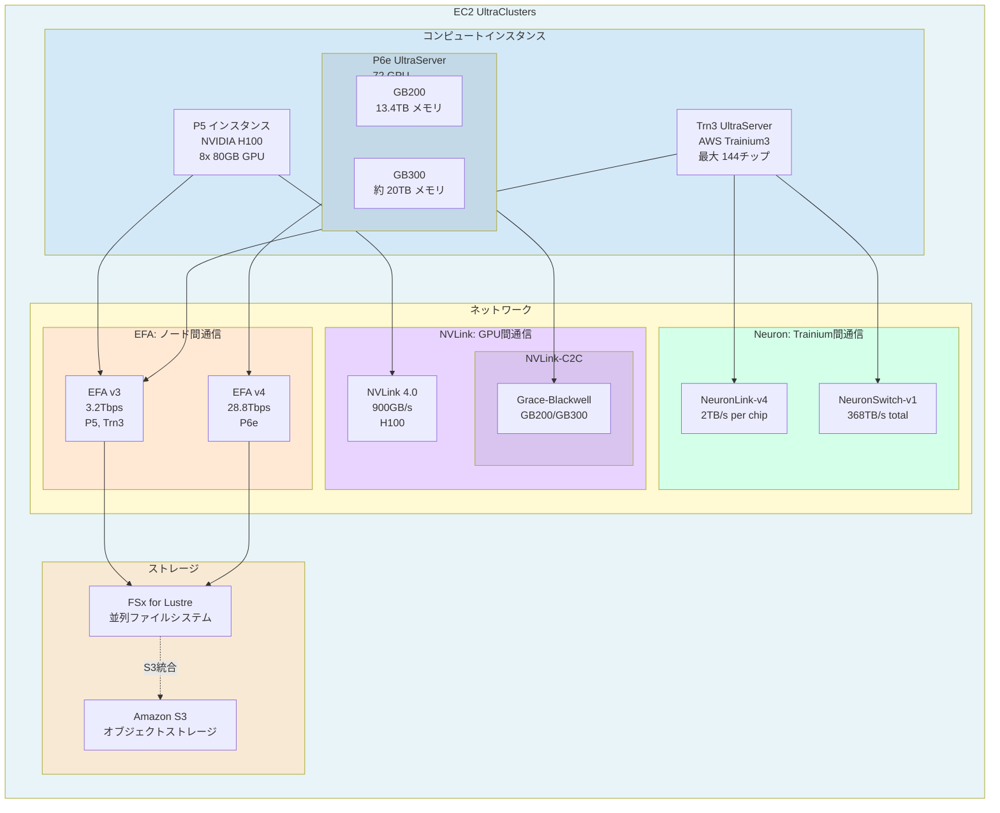
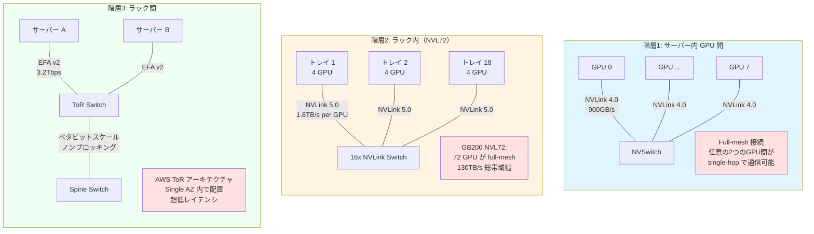
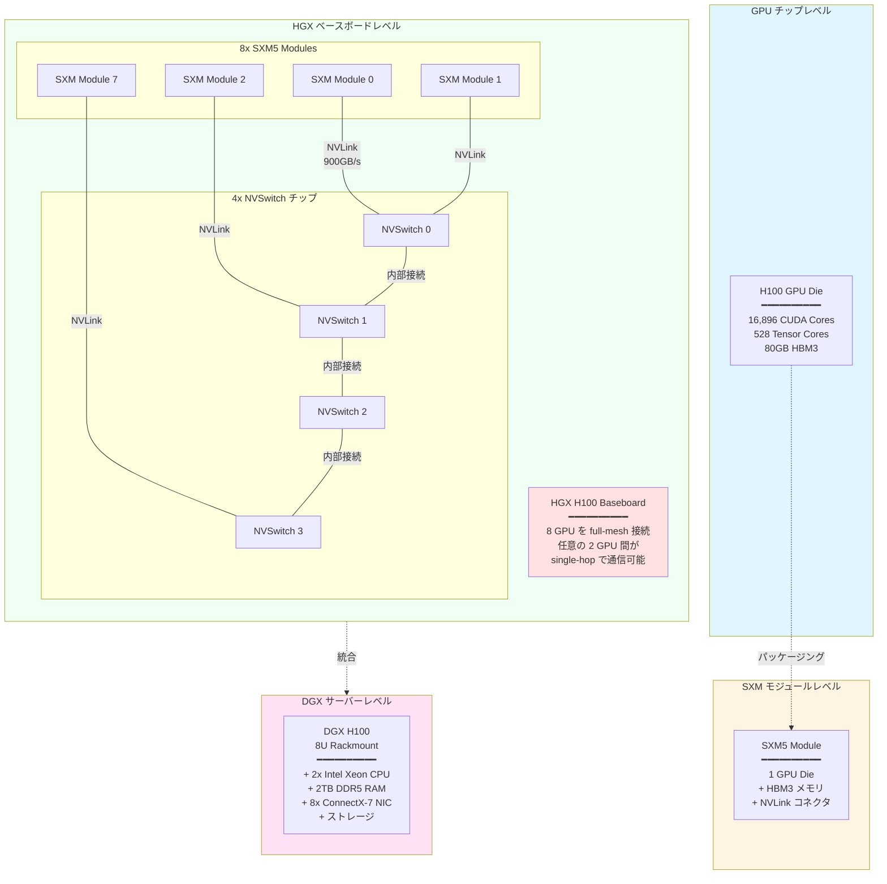
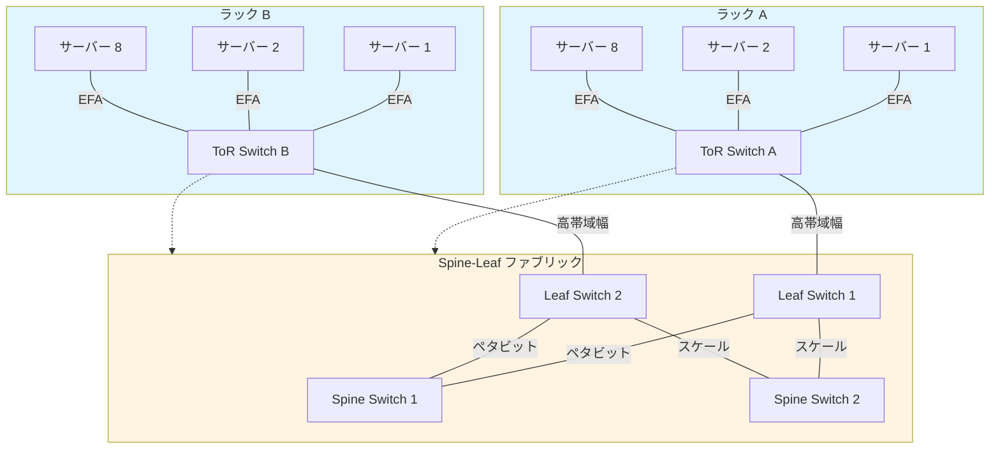
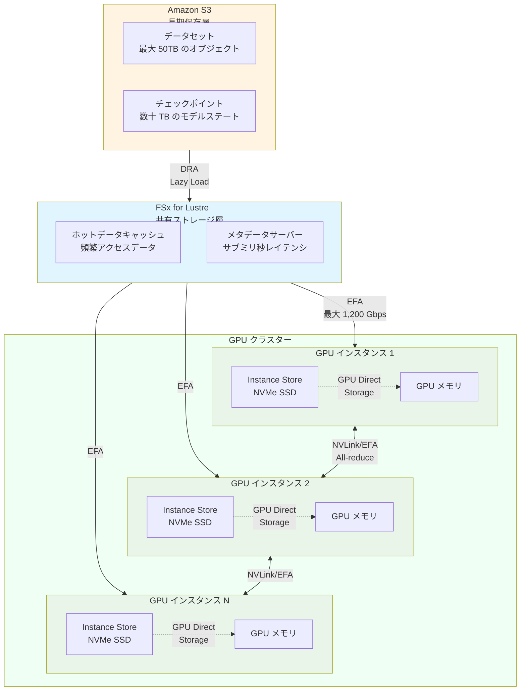

::::details 前提
:::message
**対象読者**: 大規模基盤モデルがどういうものかを理解している方、これからモデル学習を行う方
:::
:::message
**ライセンス**: © 2025 littlemex.
本文および自作図表: CC BY 4.0
※公式ドキュメントからの引用や翻訳部分は原典の著作権に従います。
引用画像: 各画像の出典に記載されたライセンスに従います。
:::
:::message
一部 AI を用いて文章を作成します。レビューは実施しますが、見逃せない重大な間違いなどがあれば[こちらのIssue](https://github.com/littlemex/samples/issues)から連絡をお願いします。
:::
::::

**本章では大規模基盤モデル学習に求められるインフラストラクチャについて整理します。**

---

AWS Principle WW Solutions Architect,GenAI, Keita Watanabe さんの [Scalable Infrastructure for Large-Scale AI Training with AWS Sagemaker Hyperpod](https://speakerdeck.com/keitaw/scalable-infrastructure-for-large-scale-ai-training-with-aws-sagemaker-hyperpod-at-singapore-ai-hour) 資料の流れを参照しながら初学者向けに情報を整理します。

# インフラストラクチャ

:::message
***Point! 大規模基盤モデル学習に必要なインフラストラクチャの独自構築は非常に難易度が高い***
:::

以下に大規模基盤モデルの学習・推論で必要な技術スタックの概観を示します。本章では一番下のインフラストラクチャ層について整理します。規模が大きくなるにつれてオンプレ上で独自でこれらのインフラストラクチャを構築することは極めて困難になります。数千台規模の GPU クラスターでは、ハードウェア調達、ネットワーク設計、冷却システム、電力供給など、数億円規模の初期投資と専門チームが必要となります。さらに故障時の交換で全系が停止するリスク、障害の適切な検知、交換完了まで系を縮退して運用する体制など、技術的・運用的に複雑な課題が山積します。

*図: AWS で大規模基盤モデルを構築する際のビルディングブロック*

## Amazon EC2 UltraClusters

*図: [Amazon EC2 UltraClusters](https://aws.amazon.com/ec2/ultraclusters/)* の構成

Amazon EC2 UltraClusters は、大規模な AI/ML ワークロード向けに設計された物理的なハードウェアインフラストラクチャの集合体です。数千から数万の GPU やカスタムシリコンを高速ネットワークで相互接続し、単一の統合されたコンピューティング環境を提供します。

::::details UltraClusters の必要性

なぜこのようなインフラストラクチャが必要なのでしょうか。ウェブサービスのように Amazon EC2 を複数台使いたいなら、オートスケールして Multi AZ 構成にすればいいのではないか、と思う方がいるかもしれません。

## ウェブサービスと基盤モデル学習のインフラストラクチャの違い

:::message
**通常のウェブサービス（疎結合）**
- 各サーバーは独立して動作
- ノード間の通信は少ない
- レイテンシは数十～数百ミリ秒でも問題なし
- → Multi AZ 構成で高可用性を実現
:::

:::message
**基盤モデル学習（密結合）**
- 全 GPU が常に同期して計算
- 毎回の学習ステップで大量のデータを交換（例: Llama 3 70B で 245GB/iteration）
- **レイテンシはマイクロ秒単位が必須**
- → Single AZ の物理的近接性が必須
:::

## なぜ Single AZ なのか

**Multi AZ の問題点**
- AZ 間レイテンシ: 1-5ms
- 専用高速ネットワークなし
- 学習時間が数十倍～数百倍に増加し実用不可能

**Single AZ（UltraClusters）の利点**
- 物理的な近接性: ラック内/ラック間で配置が可能
- 専用ネットワーク: EFA、NVLink による超低レイテンシ（マイクロ秒単位）

## FSx for Lustre も Single AZ

チェックポイント保存時、数百の GPU が同時にストレージへアクセスします。仮に Multi AZ 構成が実現できたとしても帯域幅が不足し、保存に数十分かかる可能性があります。Single AZ では EFA 経由で数百 GB/s の帯域幅を実現し、保存時間を最小化します。

## まとめ

Amazon EC2 UltraClusters は、通常のウェブサービスの「分散」「高可用性」とは逆の「集中」「物理的近接性」を重視した設計です。これは大規模基盤モデルの学習という密結合ワークロードの要件（超低レイテンシ、超高帯域幅）を満たすために必要不可欠なアーキテクチャです。
::::

## UltraClusters の主要コンポーネント概観

以下に UltraClusters の主要コンポーネントを整理しました。古いインスタンスタイプなどは省略しています。

| 世代 | インスタンス | 最大スケール | ネットワーク | 特徴 |
|------|-----------|------------|------------|------|
| **1.0** | P4d (A100) | 数千GPU | 400Gbps EFA | 初代大規模クラスター |
| **2.0** | P5 (H100) | 20,000 GPU | 3,200Gbps EFA | NVLink 強化 |
| **3.0** | Trn3, P6e (GB200/GB300) | 100 万チップ | 28.8Tbps EFA | 前世代の 10 倍スケール |

::::details 図の用語説明
## コンピュートインスタンス

### Accelerator

:::message
役割: AI/ML の計算を高速に実行する専用チップです。
:::

- **GPU**: NVIDIA 製のアクセラレータ（H100、H200、B200 など）
- **Trainium**: AWS が独自開発した ML 専用チップ、コスト効率に優れる

## ネットワーク

大規模モデル訓練では、GPU 間で頻繁にデータを交換する必要があります。ネットワークの性能が訓練速度に直結します。詳細は割愛しますがサーバー内、ラック内、ラック間など複数の通信があります。

### EFA（Elastic Fabric Adapter）- ノード間通信

:::message
役割: 異なるサーバー（ノード）間を接続する高速ネットワーク
:::

AWS が開発した専用ネットワークインターフェースで、以下の特徴があります。

- **超低レイテンシ**: マイクロ秒単位（1/1,000,000 秒）の通信遅延
- **OS バイパス**: カーネルを介さずに直接通信（RDMA 技術）
- **高帯域幅**: 世代により 400Gbps～28.8Tbps

### NVLink - GPU 間通信（ノード内）

:::message
役割: 同じサーバー内の GPU 同士を接続する超高速インターコネクト
:::

NVIDIA 製の GPU 専用接続技術で、PCIe よりも遥かに高速です。

- **NVLink 4.0**: 900GB/s（H100）- 1つの GPU から見た帯域幅
- **NVLink-C2C**: Grace CPU と Blackwell GPU（GB200/GB300）を接続

### NeuronLink と NeuronSwitch - Trainium 間通信

:::message
役割: AWS Trainium チップ専用の高速インターコネクト
:::

- **NeuronLink-v4**: チップあたり2TB/s の帯域幅
- **NeuronSwitch-v1**: 144チップを All-to-all 接続するファブリック、総帯域幅 368TB/s

## ストレージ

### FSx for Lustre - 分散並列ファイルシステム

:::message
役割: 高速な共有ストレージ、チェックポイントと学習データの保存
:::

- **並列アクセス**: 数百～数千の GPU から同時に読み書き可能
- **高帯域幅**: 最大数百 GB/s
- **低レイテンシ**: サブミリ秒（1/1,000 秒未満）
- **EFA アクセス**: 専用高速ネットワークを使用するため、通常のストレージより高速

### Amazon S3 - オブジェクトストレージ

:::message
役割: 大容量データの長期保存
:::

- **FSx との関係**: FSx for Lustre のバックエンドとして統合可能。頻繁にアクセスするデータは FSx、長期保存は S3 という使い分けが一般的
::::

## コンピュートインスタンス

UltraClustes のコンピュートインスタンスには NVIDIA GPU、Trainium アクセラレータが主に分類として存在します。基本的には NVIDIA GPU を利用するケースが多いと思いますが、Trainium が利用可能なモデルアーキテクチャでは GPU と比べてコスト効率よく大規模基盤モデルの学習ができるため、コストとパフォーマンス観点では Trainium が自分たちのモデルで利用可能かどうかについては常に選択肢に入れておくべきでしょう。

### NVIDIA GPU インスタンス

::::details GPU インスタンスタイプ表
| インスタンスタイプ | Accelerator (数) | VRAM | Local SSD | Network (EFA) | 備考 |
|------------------|---------|-----------|----------|--------------|------|
| P4d.24xlarge | A100 (8) | 320GB | 8x1TB NVMe | 400Gbps | NVLink 3.0, 40GB/GPU |
| P4de.24xlarge | A100 (8) | 640GB | 8x1TB NVMe | 400Gbps | NVLink 3.0, 80GB/GPU |
| P5.48xlarge | H100 (8) | 640GB | 8x3.8TB NVMe | 3,200Gbps | NVLink 4.0, 80GB/GPU |
| P5e.48xlarge | H200 (8) | 1,128GB | 8x3.8TB NVMe | 3,200Gbps | NVLink 4.0, 141GB/GPU |
| P5en.48xlarge | H200 (8) | 1,128GB | 8x3.8TB NVMe | 3,200Gbps | Intel CPU, 141GB/GPU |
| P6-B200.48xlarge | B200 (8) | 1,440GB | - | 3,200Gbps | 179GB/GPU |
| P6-B300.48xlarge | B300 (8) | 2,144GB | - | 6,400Gbps | 268GB/GPU, EFA 2倍 |
| P6e-GB200 (UltraServer) | GB200 (72) | 13.4TB | - | 28.8Tbps | NVLink-C2C, 185GB/GPU |
| P6e-GB300 (UltraServer) | GB300 (72) | ~20TB | - | 28.8Tbps | NVLink-C2C, ~278GB/GPU |
::::

::::details インスタンスタイプ選定ガイド

## NVIDIA Compute Capability

NVIDIA GPU は世代ごとに **Compute Capability**（計算能力レベル）が定義されており、サポートされる機能や命令セットが異なります。詳細は [NVIDIA CUDA GPUs ページ](https://developer.nvidia.com/cuda-gpus) を参照してください。

| GPU | Compute Capability | 世代 | 主な特徴 |
|-----|-------------------|------|---------|
| **A100** | 8.0 | Ampere | FP64 Tensor Core、構造化スパース |
| **H100** | 9.0 | Hopper | Transformer Engine (FP8)、Thread Block Clusters |
| **H200** | 9.0 | Hopper | H100 と同じ、メモリ容量・帯域幅強化 |
| **B200/B300** | 10.0 | Blackwell | FP4 サポート、第 5 世代 Tensor Core |

新しい世代ほど、LLM や Transformer モデルに最適化された機能が追加されています。

https://www.nvidia.com/ja-jp/technologies/

## 選定時の主要考慮事項

### 1. アクセラレータメモリ容量

モデルサイズとバッチサイズに応じて必要なメモリが決まります。単一インスタンスで良いのか UltraServer が必要になるのかを考える必要があります。

**目安**
- 小規模モデル（～13B）: 40-80GB（A100、H100）
- 中規模モデル（～70B）: 80-141GB（H100、H200）
- 大規模モデル（70B～）: 141GB+（H200、B200、B300）
- 超大規模モデル（405B～）: UltraServer（GB200/GB300, 72 GPU）

メモリ不足の場合、Model Parallel などの分割手法が必要になり、実装が複雑化します。

### 2. ネットワーク帯域幅とレイテンシ

複数 GPU での学習が必要な場合は GPU 間通信の性能が学習時間に直結します。

**EFA 帯域幅**
- P4d: 400Gbps
- P5/P5e/P5en/P6-B200: 3,200Gbps（8 倍）
- P6-B300: 6,400Gbps（16 倍）
- P6e UltraServer: 28.8Tbps（72 倍）

大規模クラスター（64ノード以上）では、高帯域幅が学習効率に大きく影響します。

### 3. コストと利用効率

**常に最新が良いとは限らない理由**

- **キャパシティ確保**: 新世代は入手困難な場合あり（サービスクォータ、物理的な供給制約）
- **コスト**: 新世代は高額（ただし性能あたりのコストは改善される傾向）
- **ソフトウェア成熟度**: 新世代は対応ライブラリやツールが限定的な場合あり

**実用的なアプローチ**:
1. **小規模実験**: 枯れた P5（H100）で検証、十分な実績とエコシステム
2. **中規模訓練**: P5e（H200）、メモリ容量と費用のバランス
3. **大規模本番**: 要件に応じて P6-B300 や P6e UltraServer を検討
::::

### Trainium インスタンス

::::details Trainium インスタンスタイプ表
| インスタンスタイプ | Accelerator (数) | HBM Memory | Local SSD | Network (EFA) | 備考 |
|------------------|-----------------|-----------|----------|--------------|------|
| Trn1.32xlarge | Trainium (16) | 512GB | - | 800Gbps (8x100Gbps) | 32GB/chip |
| Trn1n.32xlarge | Trainium (16) | 512GB | - | 1,600Gbps (16x100Gbps) | EFA 2倍、ネットワーク強化版 |
| Trn2.48xlarge | Trainium2 (16) | 8,192GB | - | 3,200Gbps (16x200Gbps) | 512GB/chip、Trn1 の 16 倍メモリ |
| Trn2u.48xlarge | Trainium2 (16) | 8,192GB | - | 3,200Gbps (16x200Gbps) | Trn2 の別バリアント |
| Trn3 UltraServer | Trainium3 (最大 144) | - | - | EFA v3 (3.2Tbps推定) | NeuronLink-v4 (2TB/s per chip)NeuronSwitch-v1 (368TB/s total) |
::::

## ネットワーク

UltraClusters では、GPU 間の通信が複数の階層で行われます。それぞれの階層で最適な技術が使用され、大規模分散学習の効率を最大化します。

### ネットワークトポロジーの階層構造

GPU 間通信はいくつかの階層に分かれます（[NVIDIA DGX H100/H200 公式ドキュメント](https://docs.nvidia.com/dgx/dgxh100-user-guide/introduction-to-dgxh100.html)、[NVIDIA GB200 SuperPOD ドキュメント](https://docs.nvidia.com/dgx-superpod/reference-architecture-scalable-infrastructure-gb200/latest/network-fabrics.html)）。

:::message alert
物理的なチップ、サーバー、ラック、トポロジー等の構成によって通信性能が大幅に変わり、クラスターを構築する際にはインターコネクトの設計は非常に重要です。
:::

| トポロジー | 使用箇所 | 接続技術 | 最大スケール | レイテンシ |
|-----------|---------|---------|------------|----------|
| **Full-mesh (NVSwitch)** | ノード内 | NVLink 4.0/5.0 | 8 GPU | サブマイクロ秒 |
| **Full-mesh (NVLink Switch)** | ラック内（NVL72） | NVLink 5.0 | 72 GPU | サブマイクロ秒 |
| **ToR ベース** | ラック間 | EFA v2/v3/v4 | 100万チップ | マイクロ秒 |

::::details 階層1: ノード内通信（サーバー内の GPU 間）

:::message
**使用技術**: NVLink + NVSwitch
**トポロジー**: Full-mesh（完全相互接続）
:::

### 物理構成の階層

DGX H100/H200 システムは、以下の物理階層で構成されています（[NVIDIA DGX H100 公式ドキュメント](https://docs.nvidia.com/dgx/dgxh100-user-guide/introduction-to-dgxh100.html)、[NVIDIA HGX H100 ベースボード](https://directmacro.com/blog/post/nvidia-hgx-h100-baseboard-for-mining)）。

**重要なポイント**

- **1 SXM5 モジュール = 1 GPU チップ**: 複数チップを搭載する構成ではない
- **NVLink はベースボード上**: SXM モジュールと NVSwitch を物理的に接続
- **NVSwitch もベースボード上**: 4 個の NVSwitch チップが配置され、8 GPU を相互接続
- **Full-mesh 接続**: どの GPU からどの GPU へも NVSwitch 経由で 1 ホップで到達可能

---

### DGX H100/H200 の構成

8 GPU が 4 つの NVSwitch チップで完全に相互接続されています。NVSwitch が all-to-all 接続を提供し、任意の 2 つの GPU 間が single-hop（1ホップ）で通信できます。

| GPU 世代 | NVLink 世代 | GPU あたり帯域幅 | ノード内総帯域幅 | 接続方式 |
|---------|-----------|----------------|--------------|---------|
| A100 | NVLink 3.0 | 600 GB/s | 4.8 TB/s | NVSwitch × 6 |
| H100 | NVLink 4.0 | 900 GB/s | 7.2 TB/s | NVSwitch × 4 |
| H200 | NVLink 4.0 | 900 GB/s | 7.2 TB/s | NVSwitch × 4 |
| B200 | NVLink 5.0 | 1.8 TB/s | 14.4 TB/s | NVSwitch × 4 |

---

### なぜ NVSwitch なのか

NVSwitch がない場合、GPU は直接接続（ポイントツーポイント）しかできず、複雑なメッシュトポロジーになります。NVSwitch を使用することで、以下のメリットがあります。

- **シンプルな接続**: 各 GPU は NVSwitch にのみ接続
- **フルバンド幅**: すべての GPU ペアが最大帯域幅で通信可能
- **低レイテンシ**: 常に 1 ホップで到達
::::

::::details 階層2: ラック内通信（GB200 NVL72 の特殊ケース）

:::message
**使用技術**: NVLink 5.0 + NVLink Switch

**トポロジー**: Full-mesh（完全相互接続）

**対象**: GB200 NVL72 UltraServer のみ
:::

**GB200 NVL72 の構成**

1 ラックに 72 GPU（18 トレイ × 4 GPU）を配置し、18 個の NVLink Switch チップで full-mesh 接続を実現しています。

- **各 GPU**: 18 個の NVLink 5.0 リンクを持つ
- **各リンク**: 各 Switch への専用接続
- **総帯域幅**: 1.8 TB/s per GPU
- **ラック全体**: 130 TB/s の GPU 間通信帯域幅

**通常の構成との違い**

| 構成 | GPU 数 | スケール | 接続技術 |
|------|--------|---------|---------|
| 通常のノード（DGX H100） | 8 GPU | ノード単位 | NVSwitch（ノード内） |
| GB200 NVL72 | 72 GPU | ラック単位 | NVLink Switch（ラック全体） |

ラック全体が 1 つの統合 GPU のように動作し、従来のノード間通信が不要になります。
::::

::::details 階層3: ラック間通信（ノード間/サーバー間）

:::message
**使用技術**: EFA（Elastic Fabric Adapter）+ GPUDirect RDMA

**トポロジー**: ToR（Top-of-Rack）スイッチベース

**スケール**: ペタビットスケールノンブロッキングネットワーク
:::

## AWS の ToR アーキテクチャ

AWS は NVIDIA の rail-optimized clos topology を採用せず、ToR スイッチを優先するアプローチを取っています（[AWS Trainium3 詳細分析](https://newsletter.semianalysis.com/p/aws-trainium3-deep-dive-a-potential)）。

## EFA 世代別の帯域幅

| EFA 世代 | 帯域幅 | 対応インスタンス | 特徴 |
|---------|--------|----------------|------|
| EFA v1 | 400 Gbps | P4d (A100) | 初代 EFA |
| EFA v2 | 3,200 Gbps | P5/P5e/P5en (H100/H200) | 8 倍の帯域幅 |
| EFA v3 | 3,200 Gbps | Trn3 (Trainium3) | Trainium 最適化 |
| EFA v4 | 3,200 Gbps | P6-B200 (B200) | 標準帯域幅 |
| EFA v4 | 6,400 Gbps | P6-B300 (B300) | 2 倍帯域幅 |
| EFA v4 | 28.8 Tbps | P6e-GB200/GB300 (NVL72) | UltraServer 専用 |

## GPUDirect RDMA の役割

EFA は GPUDirect RDMA と組み合わせることで、以下を実現します。

- **OS バイパス**: カーネルを経由せず直接 GPU メモリにアクセス
- **ゼロコピー**: CPU メモリを経由せずに GPU 間でデータ転送
- **低レイテンシ**: マイクロ秒単位の通信遅延

## UltraClusters の特徴

- **Single AZ 配置**: すべてのインスタンスが同一 AZ に配置され、物理的に近接
- **専用ネットワーク**: ペタビットスケールのノンブロッキングネットワーク
- **レイテンシ**: マイクロ秒単位（Multi AZ の 1/1000 以下）
::::

### なぜネットワークが階層に分かれているのか

大規模な GPU クラスターでは、物理的距離によってネットワーク性能が大きく変わります。**Local 接続**: サーバー内、ラック内での高速通信、**Global 接続**: ラック間、（データセンター間）での通信、があり、可能な限り Local 接続の高速通信に閉じて処理することが望ましいです。

> 厳密には Local、Global の定義は画一的なものではなく構成の仕方によって変わります。

### 分散学習に必須の通信パターン

分散学習では前述の通り複数 GPU が連携してモデルを学習するため、GPU 間でのデータ交換が不可欠です。主要な通信パターンとして All-reduce と All-to-All があります。All-reduce は全ての GPU の計算結果をまとめる操作で、例えば各 GPU が計算した勾配を全体で平均化する際に使用されます。一方、All-to-All は全 GPU が全 GPU とデータを交換するため、Global 接続を多用する非常に通信負荷の高い処理で、Mixture-of-Expert のような専門家選択を伴うモデルアーキテクチャで重要な役割を果たします。

::::details 補足

### Ring All-reduce アルゴリズム

Ring All-reduce は効率的な勾配同期を実現するアルゴリズムです。[Preferred Networks の実験](https://tech.preferred.jp/en/blog/technologies-behind-distributed-deep-learning-allreduce/)では、独自実装で NCCL と同等の性能（1.6% の差）を達成しています。

- 通信量の削減: O(N) から O(1) に改善
- 各 GPU がリング状に配置: 段階的にデータを交換
- 効率的な帯域幅利用: 各 GPU が並行してデータを処理

### 具体的な計算例（Llama 70B）
- モデルサイズ: 70B パラメータ × 2 bytes（FP16）= 140GB
- 勾配サイズ: 140GB（All-Reduce で全ノードと同期）
- Ring All-reduce により効率的な勾配同期を実現

### All-to-All 通信
- 各プロセスが他の全プロセスと個別にデータを交換
- Mixture-of-Expert（MoE）モデルで専門家の選択に使用
- 通信量は O(N²) になるため、より高い帯域幅が必要
::::

### ネットワーク性能が学習時間に与える影響

https://medium.com/pytorch/training-a-1-trillion-parameter-model-with-pytorch-fully-sharded-data-parallel-on-aws-3ac13aa96cff

AWS 上での PyTorch FSDP 大規模モデル訓練における EFA の影響を実験データに基づいて説明します。**上記の記事の PyTorch と AWS チームの GPT-3 175B モデルでの実測結果では**、128 GPU 構成の場合、 EFA 有効時 159 teraFLOPs/GPU vs 無効時 120 teraFLOPs/GPU で **1.3倍の性能向上**、512 GPU 構成の場合、EFA有効時 66.6 petaFLOPs vs 無効時 35.8 petaFLOPs で **1.9倍の性能向上**、となりました。EFA の効果は **GPU 数が増加するほど顕著**になります。FSDP については別の章で詳細に解説します。

::::details GPU 規模と EFA 有無の影響
:::message
**性能**
| GPU数 | EFA有効時の性能 | EFA無効時の性能 | 性能向上率 | 効果レベル |
|--------|----------------|----------------|------------|-----------|
| 8-64   | ベースライン    | 約90-95%       | 1.05-1.1倍 | 軽微 |
| 128    | 159 teraFLOPs/GPU | 120 teraFLOPs/GPU | 1.3倍 | 明確 |
| 256    | 145 teraFLOPs/GPU | 95 teraFLOPs/GPU | 1.5倍 | 顕著 |
| 512    | 130 teraFLOPs/GPU | 70 teraFLOPs/GPU | 1.9倍 | 顕著 |
:::
:::message
**学習時間**
| GPU数 | EFA有効 | EFA無効 | 時間差 | コスト効率 |
|--------|---------|---------|--------|-----------|
| 64     | 480日   | 約530日  | +50日  | 重要な影響 |
| 128    | 240日 | 310日 | +70日 | 重要な影響 |
| 256    | 130日   | 200日   | +70日  | 重要な影響 |
| 512    | 80日    | 150日   | +70日  | 重要な影響 |
:::
:::message alert
**結論として**、EFA は AWS 上での大規模分散学習における**必要不可欠な要素**であり、特に数百 GPU 規模では性能とコスト効率の両面で決定的な差をもたらします。EFA 無しでは実質的に大規模訓練が非現実的になる可能性があります。
:::

:::message
この事例から得られる Tips
### ✅ **性能ベンチマーク目安**
- [ ] **理論値 51% 達成**: A100 GPU で 159 teraFLOP/s（理論値 312 の 51%）
- [ ] **128 GPU が最効率ポイント**: 175B モデルでは通信オーバーヘッドとのバランス最適

### ✅ **PyTorch FSDP 最適化効果**
- [ ] **Transformer wrapping policy**: 2x 性能向上
- [ ] **アクティベーションチェックポイント**: 10-100x 向上（バッチサイズ大幅増加）
- [ ] **混合精度（BF16）**: 5-10x 向上（大きなモデルほど効果大）
- [ ] **FSDP vs DDP**: 1.5x 向上 + 4 倍大きなモデル訓練可能

### ✅ **ネットワーク構成の重要ポイント**
- [ ] **128 GPU 以上で EFA 必須**: 1.3-1.9 倍の性能向上
- [ ] **プレイスメントグループ設定**: 物理的近接による通信最適化
- [ ] **400 Gbps 帯域幅確保**: p4d.24xlarge の 4 つの EFA インターフェース

### ✅ **スケーラビリティの実践知識**
- [ ] **175B モデル**: 128 GPU 以降は効率低下開始
- [ ] **1T モデル**: 512 GPU まで線形スケール維持可能
- [ ] **GPU 数 2 倍 = 訓練時間半分**: 線形スケール範囲内での効果

### ✅ **ボトルネック分析と対策**
- [ ] **cudaMalloc が主要制約**: 1T モデルで数百ミリ秒のボトルネック
- [ ] **通信は 2 番目**: all-gather、reduce-scatter よりメモリ割り当てが重要
- [ ] **Local vs Global 帯域幅**: NVLink 900 GB/s vs EFA 400 GB/s の非対称性認識
:::
::::

## ストレージ

大規模基盤モデル学習において、ストレージがボトルネックにならないようにすることが重要です。つまり GPU や CPU が十分にデータを供給され、コンピュートリソースが限界となるようにすることを目指します。

### 分散学習・推論における推奨ストレージアーキテクチャ

大規模な分散学習や推論では、複数の階層を持つストレージアーキテクチャが推奨されます。以下の図は FSx for Lustre、Amazon S3、Instance Store NVMe の 3 層構成を示しています。

*図: 分散学習における 3 層ストレージアーキテクチャ*

#### 各層の役割と特性

::::details Amazon S3（長期保存層）
:::message
Amazon S3 は学習のための入力データ、出力結果等の永続データに利用できます。
:::

Amazon S3 は学習データセットとチェックポイントの永続化に使用されます。データの耐久性は 99.999999999%（イレブンナイン）で、長期保存に最適です。2025 年 12 月から最大オブジェクトサイズが 5TB から 50TB に拡大され、大規模モデルのチェックポイント管理が容易になりました（[AWS 公式発表](https://aws.amazon.com/jp/about-aws/whats-new/2025/12/amazon-s3-maximum-object-size-50-tb/)）。

S3 Express One Zone は、シングルディジットミリ秒のレイテンシーと数十万 TPS を提供する高性能ストレージクラスです。2025 年 4 月から価格が大幅に削減され、ストレージコストが 31% 減（$0.16 → $0.11/GB-month）、PUT リクエストが 55% 減、GET リクエストが 85% 減となりました（[AWS 公式ブログ](https://aws.amazon.com/jp/blogs/aws/up-to-85-price-reductions-for-amazon-s3-express-one-zone/)）。高頻度アクセスのチェックポイント保存で大幅なコスト削減が可能です。
::::

::::details FSx for Lustre（共有ストレージ層）
:::message
FSx for Lustre は DRA によって S3 から必要データを自動的に取得・キャッシュできます。
:::

FSx for Lustre は、Data Repository Association（DRA）により S3 と透過的に統合され、必要なデータを自動的に取得してキャッシュします（Lazy Load）。EFA 経由で最大 1,200 Gbps のスループットを提供し、サブミリ秒レベルの低レイテンシを実現します。複数の GPU インスタンス間でデータを共有し、頻繁なチェックポイント保存にも対応します（[AWS 公式ブログ](https://aws.amazon.com/blogs/aws/amazon-fsx-for-lustre-unlocks-full-network-bandwidth-and-gpu-performance/)）。
::::

::::details Instance Store NVMe（ローカル高速層）
:::message
NVMe SSD はインスタンスボリュームとして一時データを扱うことが可能です。
:::

P5 インスタンスには 8 × 3.8TB = 30.4TB の NVMe SSD が直結されています。GPU Direct Storage により CPU バイパスでの高速アクセスが可能で、一時データやバッチデータのキャッシュに最適です。ただし揮発性のため、インスタンス停止時にデータは消失します。GPU Direct Storage により、CPU を経由せずに GPU メモリとストレージ間で直接データ転送を行うことで、CPU 負荷を大幅に削減します（[NVIDIA GPUDirect Storage ドキュメント](https://docs.nvidia.com/gpudirect-storage/overview-guide/index.html)）。
::::

#### データフロー

1. **学習開始時**: S3 から FSx に DRA 経由で Lazy Load
2. **学習中**: FSx から各 GPU インスタンスへ EFA 経由で高速配信
3. **バッチ処理**: Instance Store NVMe を使用して GPU への直接データ供給
4. **チェックポイント保存**: FSx 経由で S3 または S3 Express One Zone へ保存
5. **学習完了後**: 最終チェックポイントを S3 に保存し、FSx を削除

### FSx for Lustre のコスト考慮

:::message alert
FSx for Lustre は高性能ですがコストも高額です。学習プロジェクトの費用試算時には必ず FSx for Lustre のコストを考慮することが推奨されます。
:::

一例で SSD Scratch 200MB/s を 2.5TB 利用すると月額コストでは $3.503 必要です。サブミリ秒のレイテンシ、最大 1,200 Gbps のスループット、GPU Direct Storage による CPU 負荷軽減といった機能は、大規模分散学習では必要不可欠であるため、適切に永続化は S3、学習中の一時利用に FSx for Lustre を利用するなどパフォーマンスとコスト効率を考慮しましょう。結局ストレージ性能が低く GPU が Wait で遊んでいる時間ばかりになるとトータルの学習時間が伸びてしまいコスト効率は悪化します。ストレージをケチって GPU 費用が嵩むのは本末転倒なので自身の利用する学習データの規模やモデルサイズなどを加味して適切なインフラストラクチャを設計しましょう。

:::: details 価格例
US East N. Virginia の例

| 構成 | 容量 | 月額コスト | 用途 |
|------|------|-----------|------|
| SSD Persistent 200MB/s | 2.5TB | $6,022 | 高性能学習 |
| SSD Persistent 200MB/s | 10TB | $24,090 | 大規模学習 |
| HDD Persistent 12MB/s | 10TB | $2,070 | コスト重視 |
| SSD Scratch 200MB/s | 2.5TB | $3,503 | 一時利用 |

*価格は 2025 年 12 月時点、[AWS 公式価格ページ](https://aws.amazon.com/fsx/lustre/pricing/)を参照*
::::

:::details Scratch ファイルシステムの活用
FSx for Lustre の Persistent ファイルシステムはデータをレプリケートし、ファイルサーバー障害時にも自動復旧します。一方、Scratch ファイルシステムはレプリケーションなしで約 60% のコストで利用できます。短期間の学習や実験では、Scratch ファイルシステムで十分なケースも多く、コスト最適化の選択肢として検討する価値があります。ただし、障害時のデータ損失リスクがあるため、S3 へのバックアップ戦略は必須です。
::::

### コラム: Mountpoint for S3

::::details Mountpoint for S3 の使い所
:::message
Mountpoint for Amazon S3 は、S3 データレイクへのファイルアクセスを提供する AWS 公式サポートの FUSE クライアントです（[GitHub リポジトリ](https://github.com/awslabs/mountpoint-s3)）。2023 年 8 月に一般提供が開始され、AWS による継続的な開発とサポートが保証されています。
:::

## 適用可能なケース
- 軽量な推論ワークロード（モデルサイズ: 数 GB ～ 数十 GB）
- レイテンシ要件が緩やか（数十ミリ秒許容）
- 単一インスタンスまたは小規模分散
- 大きなオブジェクトの順次読み取り

:::message alert
S3 で直接マウントできるので分散学習に良いのではないか、と思う方がいますが、これまでに解説したように分散学習の頻繁かつ大規模なチェックポイントや学習データの読み込みが学習時間のオーバーヘッドに繋がることを考えると慎重に検討すべきです。**以下のような制約**もあるので基本は軽量な推論用途と考えても差し支えないでしょう。

- 完全な POSIX セマンティクス未対応
- ファイル名変更やロック機能なし
- 既存ファイルの編集には不向き
- FUSE レイヤーによるオーバーヘッド（数ミリ秒）
:::
::::

### まとめ

本章では大規模基盤モデル学習に必要なインフラストラクチャの技術的詳細を整理しました。Amazon EC2 UltraClusters を構成するコンピュートインスタンス、ネットワーク、ストレージという 3 つの主要コンポーネントについて、それぞれが持つ技術的な複雑性を説明してきました。特にネットワークでは、サーバー内の NVLink、ラック内の NVLink Switch、ラック間の EFA という階層的なトポロジーが必要であり、各階層で適切な帯域幅とレイテンシを実現する必要があります。また分散学習では All-reduce や All-to-All といった通信パターンが頻繁に発生し、ネットワーク性能が学習時間に直接影響を与えることも見てきました。ストレージにおいても、FSx for Lustre と Amazon S3 の統合、Data Repository Association による透過的なデータ管理など、高度な技術的考慮が求められます。

これらのインフラストラクチャを独自に構築し運用することは、技術的にもコスト的にも困難な課題です。故障時の検知と交換、ネットワークトポロジーの最適化、ストレージの階層管理など、多岐にわたる専門知識と運用体制が必要となります。しかし AWS のマネージドサービスを活用することで、これらの複雑性の多くを抽象化し、モデル開発そのものに集中できる環境を構築できます。次章では今回整理したインフラストラクチャを統制するコントロールレイヤについて説明します。

::::details AWS インフラストラクチャのリファレンス
Amazon SageMaker HyperPod や AWS ParallelCluster は、本章で説明したインフラストラクチャコンポーネントを統合的に管理し、リファレンスアーキテクチャとして提供されています。GitHub で公開されている awsome-distributed-training リポジトリには、事前検証済みの設定テンプレートが含まれており、ネットワーク設定、ストレージ統合、モニタリング基盤まで含めた環境を迅速にデプロイできます。

この効果は、日本の GENIAC（Generative AI Accelerator Challenge）プログラムでの実践例からも確認できます。2024 年の第 2 サイクルでは、12 の事業者が AWS を利用して基盤モデル開発に取り組みました。AWS は Cross Functional なサポート体制（Virtual Team）を構築し、アカウントチーム、Specialist SA、サービスチーム、WWSO Frameworks チームが連携して技術支援を提供しました。リファレンスアーキテクチャとデプロイメントガイドを活用することで、参加事業者は 1 日で 127 台の P5 インスタンス（NVIDIA H100）と 24 台の Trn1 インスタンス（AWS Trainium）をデプロイし、その後 6 ヶ月間の学習期間で各社が基盤モデルの開発を完了しました。ワークショップでは Prometheus と Grafana によるモニタリング、EFA トラフィックの最適化、GPU 障害のトラブルシューティングなど、実践的な知識が共有されました。

AWS の仕組みを活用することで得られる価値は、単なるハードウェアの提供にとどまりません。本章で解説した複雑なインフラストラクチャ層の多くが抽象化され、開発者はモデルアーキテクチャの設計、データセットの準備、ハイパーパラメータのチューニングといった本質的な機械学習の課題に集中できます。小規模なチームでも、数百から数千の GPU を使用する大規模クラスターを構築し運用することが可能になります。事前に検証されたベストプラクティスとリファレンスアーキテクチャを活用することで、試行錯誤に要する時間を大幅に削減し、より早く実験サイクルを回すことができます。

GENIAC プログラムでの詳細な取り組みと得られた知見については、AWS 公式ブログで公開されています。
https://aws.amazon.com/jp/blogs/news/beyond-accelerators-lessons-from-building-foundation-models-on-aws-with-japans-geniac-program/
::::

::::details AI インフラの整理スライド
このスライドは AI インフラストラクチャの全体感を把握するのに非常に有用です。
https://speakerdeck.com/markunet/aiinhurawokao-eru
::::