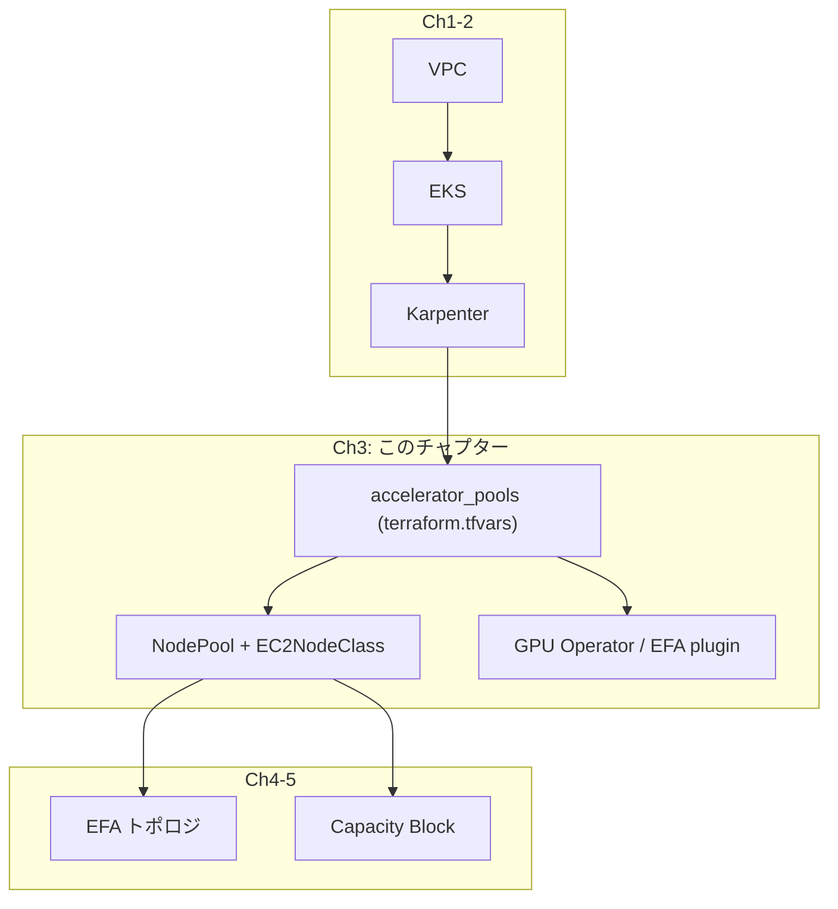

## メインテーマ

`accelerator_pools` という 1 つの map 変数に GPU/Neuron プールを定義するだけで、Karpenter の NodePool・EC2NodeClass・必要なアドオンが一式そろって生成される仕組みを理解し、実際に GPU ノードを 1 台起動してみる。

## これは何をするものか

Ch1-2 で VPC・EKS コントロールプレーン・Karpenter コントローラという土台ができた。この土台の上に、実際に GPU や Trainium/Inferentia（Neuron）を積んだノードを Karpenter に起動させるための「型」を定義するのがこのチャプターである。

Karpenter がノードを起動するには、最低でも次の 2 つの Kubernetes リソースが必要になる。

- **NodePool** — どんな条件（インスタンスタイプ、AZ、キャパシティタイプなど）のノードを、どんな taint を付けて起動するかを定義する
- **EC2NodeClass** — そのノードの AMI、サブネット、セキュリティグループ、ブロックデバイスなど EC2 固有の設定を定義する

この構成では、これら 2 リソースを GPU プールと Neuron プールで別々の Terraform リソースブロックとして書かない。代わりに `accelerator_pools` という 1 つの map 変数を用意し、map の 1 エントリごとに `for_each` で NodePool と EC2NodeClass のペアを 1 組ずつレンダリングする。つまり「プールを 1 つ増やす」という操作は、`terraform.tfvars` に map エントリを 1 つ追加するだけで完了し、`.tf` ファイル側に新しいリソースブロックを書く必要がない。

なぜ GPU と Neuron のプール定義をあえて分けずに 1 つの型に統一しているのか。Karpenter から見ると、GPU ノードも Neuron ノードも「taint の key が違うだけで形はほぼ同じノード」である。両方とも、EC2 インスタンスタイプの集合があり、単一の AZ に固定され、EFA（Elastic Fabric Adapter）を持つ場合はネットワークインターフェースの構成が必要で、専用の taint を持ち、専用の device plugin がその taint を tolerate してアクセラレータを advertise する。この共通構造をコード上でも 1 つのオブジェクト型として表現することで、片方だけ直して片方を直し忘れるという修正漏れを構造的に防いでいる。

`accelerator_pools` の主なフィールドは次の通りである。

- `instance_types` — Karpenter が起動候補にできる EC2 インスタンスタイプのリスト（例: `["g6e.12xlarge"]`）
- `device_plugin` — `"nvidia"` または `"neuron"`。どの device plugin がこのプールのアクセラレータを advertise するかを決める
- `capacity_type` — `"reserved"`（Capacity Block）、`"on-demand"`、`"spot"` のいずれか
- `zone` — このプールを固定する単一の AZ。EFA/RDMA トラフィックはサブネットを跨げないため、複数ノードにわたる collective 通信を行う場合は全ランクが同一 AZ に載っている必要がある

プールの `device_plugin` フィールドから、`has_gpu_pool` / `has_neuron_pool` / `has_efa_pool` という 3 つの真偽値が自動的に導出される。これらのフラグに応じて、NVIDIA GPU Operator・Neuron device plugin・AWS EFA device plugin という 3 種類のアドオンがそれぞれ導入されるかどうかが決まる。つまり `accelerator_pools` に GPU プールしか定義しなければ Neuron 関連のアドオンは一切入らず、Neuron プールしか定義しなければ GPU Operator は入らない。クラスタが実際に使うものだけがインストールされる。

GPU ノードに関してもう 1 点誤解しやすいのが、GPU Operator の driver install 設定である。この構成では `gpu_operator_install_driver = false` がデフォルトになっている。これは EKS の AL2023 GPU AMI が NVIDIA ドライバをすでに同梱しているためで、GPU Operator はドライバをインストールする役割を持たず、device plugin・feature discovery・validator といった周辺コンポーネントのみを担当する。GPU Operator の Pod と EFA device plugin の Pod は、いずれも `nvidia.com/gpu` taint を tolerate する設定で導入されている。

ここで重要な事実がもう 1 つある。**GPU ノードに `nvidia.com/gpu: NoSchedule` という taint を打つのは NodePool であり、GPU Operator でも NVIDIA device plugin でもない。** これは誤解されがちな点で、「device plugin が taint も一緒に管理してくれる」と思い込んでいるとハマる。もし taint が付かないと、CoreDNS のレプリカやコントローラなど、GPU を必要としない通常の CPU ワークロードがアイドル状態の GPU ノードに勝手にスケジュールされてしまう。すると Karpenter の `consolidationPolicy: WhenEmpty` は「ノードが空ではない」と判断し続けるため、時間単価の高い GPU ノードが実質使われないまま課金され続ける。これを避けるため、この構成では NodePool 側で明示的に taint を宣言し、アドオン側とワークロード側の両方にその taint への toleration を持たせている。

ノードの disruption（入れ替え・削減）ポリシーも、キャパシティタイプによって挙動が変わるように作られている。`capacity_type = "reserved"`（Capacity Block）のプールは `budgets: [{ nodes: "0" }]` を設定し、ドリフト検知による自動入れ替えも含めてノードの入れ替えを完全に止める。Capacity Block は先払いの予約であり、多くの場合は長時間の訓練ジョブを載せるため、Karpenter が新しい AMI リリースを検知して「勝手にノードを入れ替える」ことは訓練データの損失につながりかねない。一方、on-demand/spot のプールは `consolidationPolicy: WhenEmpty` に加えて `consolidateAfter: "5m"`（デフォルト）を設定し、5 分間アイドルなノードは自動的に回収されるようにしている。

## 全体の中での位置付け



## 実際に挙動を確認する

### 1. terraform.tfvars にプールを追加する

`terraform.tfvars` の `accelerator_pools` に、on-demand の GPU プールを 1 つ追加する。

```hcl
accelerator_pools = {
  gpu-dev = {
    instance_types = ["g6e.12xlarge"]
    device_plugin  = "nvidia"
    capacity_type  = "on-demand"
    zone           = "us-east-2a"
  }
}
```

`zone` は `azs` に含まれる値でなければならない。他のフィールド（`efa_interface_count` や `volume_size` など）はすべて optional なので、まずはこの最小構成で動かしてみる。

### 2. apply する

```bash
cd infra/eks
terraform apply
```

この 1 回の apply で、`gpu-dev` という名前の NodePool・EC2NodeClass に加えて、GPU プールが存在することを検知した GPU Operator・EFA device plugin（`g6e.12xlarge` は EFA を 1 枚持つため）が導入される。新しい `.tf` ファイルは何も書いていない点に注目してほしい。

### 3. GPU を要求する Pod を起動する

```bash
kubectl run gpu-smoke --restart=Never \
    --image=nvidia/cuda:12.4.1-base-ubuntu22.04 \
    --overrides='{"spec":{"tolerations":[{"key":"nvidia.com/gpu","operator":"Exists","effect":"NoSchedule"}],"containers":[{"name":"gpu-smoke","image":"nvidia/cuda:12.4.1-base-ubuntu22.04","command":["nvidia-smi"],"resources":{"limits":{"nvidia.com/gpu":"1"}}}]}}'
```

`tolerations` を明示しているのは、前述の通り GPU ノードには `nvidia.com/gpu: NoSchedule` の taint が付いているためである。この toleration がない Pod はスケジュール条件を満たさず、GPU ノードには乗らない。

### 4. Karpenter がノードを起動する様子を観察する

```bash
kubectl get nodeclaims -w
```

Pod が Pending になった時点で Karpenter が `gpu-dev` NodePool の条件に合う NodeClaim を作り、EC2 インスタンスを起動する。`g6e.12xlarge` の起動から `nodeadm` でのクラスタ参加、GPU Operator の初期化まで数分かかるので、`-w` でしばらく待つ。

### 5. ノードとプールの状態を確認する

Karpenter のリソースを確認する:

```bash
kubectl get nodepools
```

```
NAME       NODECLASS   NODES   READY   AGE
cpu        cpu         0       True    15m
gpu-dev    gpu-dev     1       True    15m
```

手順 1 で定義した `gpu-dev` に加えて `cpu` という NodePool も存在する。`cpu` は `var.cpu_nodepool_enabled = true`（既定値）で自動生成される汎用 CPU ワークロード用のプールで、`accelerator_pools` には現れない。`gpu-dev` が 1 ノード（gpu-smoke Pod が GPU を要求したため起動した）。

NodeClaim（実際に起動している EC2 インスタンス）を見る:

```bash
kubectl get nodeclaims
```

```
NAME             TYPE             CAPACITY    ZONE         NODE                           READY   AGE
gpu-dev-xxxxx    g6e.12xlarge     on-demand   <az>         ip-10-0-xx-xx.<region>...      True    3m
```

`CAPACITY = on-demand` が表示される。

ノード一覧でも同じ情報をラベルで確認できる:

```bash
kubectl get nodes -L node-role -L karpenter.sh/capacity-type
```

```
NAME                            STATUS   ROLES    AGE   VERSION             NODE-ROLE   CAPACITY-TYPE
ip-10-0-xx-xx.<region>...      Ready    <none>   3m    v1.35.6-eks-...     gpu-dev     on-demand
ip-10-0-ww-ww.<region>...      Ready    <none>   15m   v1.35.6-eks-...     (system)    (managed)
```

:::message
Capacity Block (reserved) プールを追加した場合は `gpu-p5en` / `reserved` として表示される。CB プールの追加は Ch5 で扱う。
:::

### 6. nvidia-smi の出力を確認する

```bash
kubectl logs gpu-smoke
```

実機出力（p5en.48xlarge、H200）:

```
+-----------------------------------------------------------------------------------------+
| NVIDIA-SMI 580.159.03             Driver Version: 580.159.03     CUDA Version: 13.0     |
+-----------------------------------------+------------------------+----------------------+
| GPU  Name                 Persistence-M | Bus-Id          Disp.A | Volatile Uncorr. ECC |
|=========================================+========================+======================|
|   0  NVIDIA H200                    On  |   00000000:A4:00.0 Off |                    0 |
| N/A   31C    P0             73W /  700W |       0MiB / 143771MiB |      0%      Default |
+-----------------------------------------+------------------------+----------------------+
```

H200 (143 GB HBM3e) が認識されている。GPU Operator が正しく動作している証拠。

### 7. Pod を消して consolidateAfter の効果を見る

```bash
kubectl delete pod gpu-smoke
kubectl get nodeclaims -w
```

Pod を消すとノードは空になるが、即座には消えない。`gpu-dev` は `capacity_type = "on-demand"` なので `consolidateAfter` は既定の 5 分。5 分間アイドルの状態が続いた後、Karpenter が自動的にノードを回収し、NodeClaim が消えるのが確認できる。

## 注意点

**`capacity_type = "capacity-block"` は誤り。** Capacity Block 由来のキャパシティタイプは `"capacity-block"` という名前を想像しがちだが、Karpenter v1 で実際に使われる値は `"reserved"` である。ここを間違えると変数のバリデーションで弾かれるので早期に気づけるが、名称の直感に反する点として覚えておく。

**1 プール内の instance_types は同じ EFA トポロジでなければならない。** 1 つのプールに対して生成されるネットワークインターフェース構成は 1 つしかないため、例えば同じプールに `g6e.12xlarge`（EFA 1 枚・単一カード）と `p5en.48xlarge`（EFA 16 枚・複数カード）を混在させると、EFA カード構成が食い違い、plan/apply 時のバリデーションで reject される。異なる EFA トポロジのインスタンスタイプを両方使いたい場合は、プールを分ける。

**`InsufficientInstanceCapacity` への対処。** 指定した AZ・インスタンスタイプの組み合わせで空き容量がない場合、Karpenter はノードを起動できずに再試行を続ける。対処法は 2 つある。1 つは `zone` を別の AZ に変える。もう 1 つは `instance_types` に同じ EFA トポロジを持つ別サイズ（例えば `g6e.12xlarge` に加えて `g6e.24xlarge` も追加する）を並べ、Karpenter に選択肢を与えることである。

**GPU Operator の初期化には数分かかる。** ノードが `Ready` になった直後は、GPU Operator の feature discovery・device plugin がまだ起動しきっていないことが多く、`nvidia.com/gpu` という resource がまだ advertise されていない時間帯がある。この間に GPU を要求する Pod をスケジュールしようとすると一時的に Pending のままになるが、これは異常ではなく、数分待てば解消する。

**`cb_reservation_id` の設定漏れと `capacity_type` の不一致。** Capacity Block を使うつもりで `cb_reservation_id` を設定しても、`capacity_type` を `"reserved"` にし忘れると、EC2NodeClass は `capacityReservationSelectorTerms` を持たないまま生成され、予約は無視されて on-demand として起動してしまう。予約は前払いなので、これは「予約分は課金済みなのに、さらに on-demand でも課金される」という二重コストに直結する。この構成ではこの組み合わせを変数バリデーションで明示的に弾いている。
