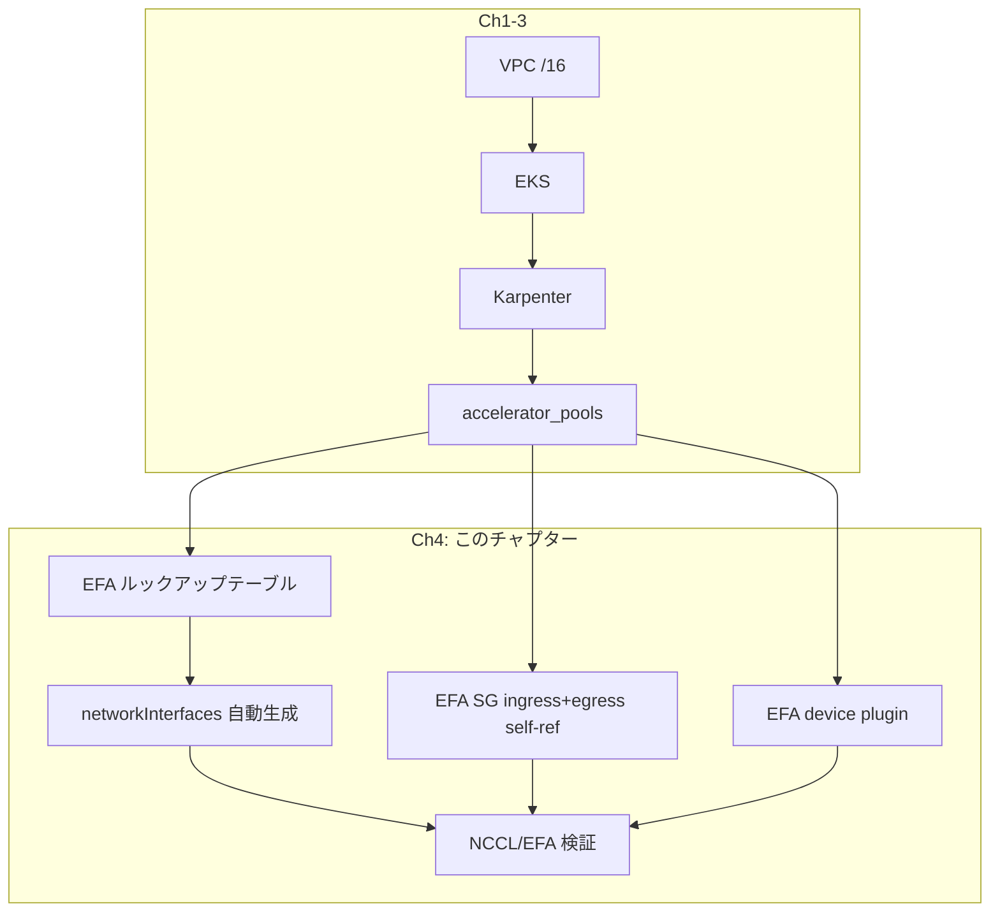

## メインテーマ

EFA（Elastic Fabric Adapter）のインターフェース数とレイアウトをインスタンスタイプから自動導出し、マルチノード NCCL 通信が EFA 経由で動作していることを検証する。

## これは何をするものか

### EFA とは

EFA は AWS の高帯域・低遅延ネットワークインターフェースで、OS-bypass による SRD（Scalable Reliable Datagram）プロトコルを使う。GPU/Neuron のマルチノード集合通信（NCCL）で必要な帯域を確保するために不可欠。

通常の ENI（Elastic Network Interface）と異なり、EFA はカーネルを経由せずにユーザ空間から直接データを送受信する。これにより低遅延・高スループットを実現するが、ネットワーク上のトラフィック特性が通常の IP と異なるため、セキュリティグループの設定にも独自の要件がある（後述の注意点を参照）。

### なぜ Karpenter は EFA を自動で付けないか

Karpenter の EC2NodeClass は、`spec.networkInterfaces` を省略すると単一のデフォルト ENA（IP 通信用）だけを作る。EFA を使うにはこのフィールドで以下を明示宣言する必要がある:

- カード 0: `interfaceType: "interface"`（ノード IP 用、primary ENI）
- カード 1〜N: `interfaceType: "efa-only"`（RDMA 専用、IP を持たない）

この宣言はインスタンスタイプごとにカード枚数とレイアウトが異なるため、手書きは事故の温床になる。

### EFA トポロジの自動導出

`locals.tf` にルックアップテーブルを置き、pool の `instance_types` から自動で導出する:

```hcl
efa_capability = {
  "p5.48xlarge"    = { cards = 32, multi_card = true }
  "p5en.48xlarge"  = { cards = 16, multi_card = true }
  "trn2.48xlarge"  = { cards = 16, multi_card = true }
  "g6e.12xlarge"   = { cards = 1,  multi_card = false }
  "g5.12xlarge"    = { cards = 0,  multi_card = false }  # EFA 非対応も明示
}
```

`multi_card = true` の場合（p5/p5en/trn2）: カード 0 が primary（ノード IP）、残りが `efa-only`。
`multi_card = false` の場合（g6e）: カード 0 上に primary + EFA が共存。

### Schedulable EFA（card 0 問題）

multi-card レイアウトでは**カード 0 がノード IP を運ぶため EFA-only として広告されない**。つまり:

- p5en.48xlarge: 16 カード → schedulable EFA = **15**
- p5.48xlarge: 32 カード → schedulable EFA = **31**
- g6e.12xlarge: 1 カード（single-card）→ schedulable EFA = **1**

Pod が `vpc.amazonaws.com/efa: 16` をリクエストすると、15 しか広告されないため永久に Pending になる。

モジュールは `terraform output accelerator_pool_efa_schedulable` でプールごとの正しい値を公開している。

### EFA セキュリティグループ — egress self-ref が必須

これがこのモジュールで最も実測から得られた重要な知見。

EFA の SRD トラフィックは**通常の IP トラフィックではない**。そのため、SG の egress ルールに `0.0.0.0/0` の CIDR を設定しても、SRD パケットは許可されない。必要なのは ingress と egress の**両方に self-referencing all-traffic ルール**を持つこと:

```hcl
# sg.tf

# Ingress: peer EFA ノードからの全トラフィック
resource "aws_security_group_rule" "efa_node_ingress_self" {
  type                     = "ingress"
  protocol                 = "-1"
  source_security_group_id = aws_security_group.efa_node.id
  security_group_id        = aws_security_group.efa_node.id
}

# Egress: 通常の IP トラフィック（S3, ECR 等）
resource "aws_security_group_rule" "efa_node_egress_all" {
  type        = "egress"
  protocol    = "-1"
  cidr_blocks = ["0.0.0.0/0"]
  security_group_id = aws_security_group.efa_node.id
}

# Egress: EFA SRD トラフィック（self-referencing、CIDR では通らない）
resource "aws_security_group_rule" "efa_node_egress_self" {
  type                     = "egress"
  protocol                 = "-1"
  source_security_group_id = aws_security_group.efa_node.id
  security_group_id        = aws_security_group.efa_node.id
}
```

egress self-ref が無い場合の症状: NCCL は bootstrap（TCP）に成功し `Selected provider is efa` と表示するが、実際のデータ転送で `NET/OFI ... Error 15 (Unreachable remote)` が出てハングする。「EFA を選んだはずなのにデータが流れない」という診断困難な障害になる。

## 全体の中での位置付け



## 実際に挙動を確認する

### 1. Schedulable EFA の確認

```bash
terraform output accelerator_pool_efa_schedulable
```

期待される出力:
```
{
  "gpu-p5en" = 15
}
```

### 2. ノード上の EFA リソース確認

```bash
kubectl describe node <p5en-node> | grep "vpc.amazonaws.com/efa"
```

実機出力（p5en.48xlarge）:

```
  vpc.amazonaws.com/efa:  15
  vpc.amazonaws.com/efa:  15
```

Capacity（物理上限）と Allocatable（Pod にリクエスト可能な値）の両方が 15 であることが確認できる。16 ではなく 15 — これが card 0 問題の実証。

### 3. EFA device plugin の稼働確認

```bash
kubectl get pods -n kube-system -l app.kubernetes.io/name=aws-efa-k8s-device-plugin
```

期待される出力:
```
NAME                                 READY   STATUS    RESTARTS   AGE
aws-efa-k8s-device-plugin-xxxxx      1/1     Running   0          19h
aws-efa-k8s-device-plugin-yyyyy      1/1     Running   0          17h
```

EFA 対応ノード（p5en x2）それぞれに 1 Pod ずつ Running。

### 4. NCCL/EFA 検証（マルチノード — Ch5 終了後に実施）

:::message
マルチノード NCCL 検証には p5en x2 以上が必要。p5en クラスのインスタンスは On-Demand ではまず取れないため、Ch5（Capacity Block）で CB を購入してからここに戻ってくる。手順 1〜3 は On-Demand の単一ノードでも確認できるので、まずそこまで進めて問題ない。
:::

マルチノードで NCCL が EFA を使っていることを検証する:

```bash
./scripts/03-verify-nccl.sh --nodes 2 --gpus-per-node 8
```

確認ポイント:
- ログに `NET/OFI Selected provider is efa` が出ること（TCP fallback していない証拠）
- `busbw` が高い値を示すこと

実機確認結果（2ノード p5en.48xlarge、H200 x16、EFA 15 NIC）:

```
ip-10-0-xx-xx [7] NCCL INFO NET/OFI Selected provider is efa, fabric is efa-direct (found 15 nics)
ip-10-0-yy-yy [6] NCCL INFO NET/OFI Selected provider is efa, fabric is efa-direct (found 15 nics)
```

両ノードで `efa-direct` プロバイダが選択され、15 NIC が認識されている。`found 15 nics` は `terraform output accelerator_pool_efa_schedulable` の値（= 16 - 1）と一致する。

参考 busbw 値（同構成の `torchrun` 直接実行での実測）:

| メッセージサイズ | algbw | busbw |
|---|---|---|
| 64 MB | 101.5 GB/s | 190.3 GB/s |
| 1024 MB | 127.2 GB/s | 238.4 GB/s |
| 8192 MB | 137.1 GB/s | 257.1 GB/s |

busbw 190-257 GB/s は TCP（~4-10 GB/s）の 20-60 倍であり、EFA が正しく動作している決定的な証拠。

:::message
NCCL テストを実行するには、テスト対象の GPU が他の Pod（Ray ワーカーなど）に占有されていないことが前提。既存のワークロードを停止してからテストを実行する。
:::

### 5. NCCL_SOCKET_IFNAME の確認

ワークロードの環境変数に以下が設定されていること:

```yaml
env:
  - name: NCCL_SOCKET_IFNAME
    value: "^lo,docker,veth"
  - name: FI_PROVIDER
    value: "efa"
```

`NCCL_SOCKET_IFNAME` は**除外パターン**（`^` で始まる）で書く。`efa0,efa1,...` のような許可リスト方式だと、NCCL が EFA インターフェースを見つけられず TCP fallback する場合がある。

## 注意点

**1. `vpc.amazonaws.com/efa` のリクエスト数を間違えると永久 Pending**

p5en で `efa: 16` をリクエストすると schedulable は 15 のため Pod がスケジュールされない。必ず `terraform output accelerator_pool_efa_schedulable` の値を参照する。

**2. EFA SG に egress self-ref が無いと `Error 15 Unreachable remote`**

bootstrap（TCP）は成功するのにデータ転送がハングする。NCCL ログに `Selected provider is efa` と出ている時点で「EFA は選ばれている」ため、ネットワーク側を疑わないと迷宮入りする。原因は SG の egress に self-referencing ルールが無いこと。

**3. `NCCL_SOCKET_IFNAME` を positive 指定すると TCP fallback**

`NCCL_SOCKET_IFNAME=efa0` のような書き方は失敗する場合がある。除外パターン `^lo,docker,veth` が安全。

**4. EFA device plugin の chart version と app version の混同**

`aws-efa-k8s-device-plugin` の Helm chart version とコンテナの app/image version は別系列。chart version を指定する際に app version を代入すると、存在しないタグを参照して install が失敗する。

**5. 未知のインスタンスタイプは黙って EFA=0 にフォールバックしない**

ルックアップテーブルに存在しないインスタンスタイプで `efa_interface_count` も未指定の場合、`karpenter-resources.tf` の precondition が明示的に reject する。黙って EFA なしにフォールバックすることはない。これは「ノードは起動するが NCCL が TCP になる」という最も診断しづらい障害モードを防ぐための設計である。
