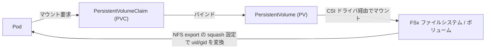
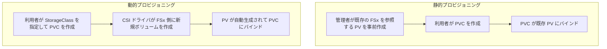

本章では、Basic02 と Basic10 で扱った共有ストレージ（Amazon FSx for OpenZFS と Amazon FSx for Lustre）を、複数のチームや namespace で使うときの設計を扱います。Basic02・Basic10 では単一の利用者を前提に「共有」の最小構成を組みましたが、共有クラスタを複数テナントで使うと「どこまで分離できるのか」「どの層で分離するのか」を設計として決める必要が出てきます。

# 解説

## マルチテナントを 2 階層で捉える

「マルチテナント」を一括りにすると設計が破綻します。本章では次の 2 階層に分けて考えます。

- **階層 1: パス分離** — namespace ごとにデータの置き場所を分けるだけの分離です。テナントごとに別のディレクトリ（サブボリューム）を割り当てますが、同じファイルシステムを共有しているため、権限を絞らなければ相互にデータが見えます。運用規約による分離であり、強制力はありません。
- **階層 2: 強制隔離** — テナントごとに独立した領域を割り当て、他テナントの領域に触れられないようにする分離です。これは「領域の分離（PVC ごとに別ボリューム、すなわち子ボリュームを払い出す）」と「ID 制御（POSIX の uid/gid をテナントごとに強制する squash）」の 2 要素からなります。本章のワークショップでは前者（Amazon FSx for OpenZFS の動的子ボリュームによる領域の強制分離）を実演し、後者の ID 制御は NFS export の squash や Pod の `securityContext` と組み合わせる追加レイヤーとして解説します。

Basic02・Basic10 で作った「同一ファイルシステムを複数 namespace から使う」構成は階層 1 です。階層 2 まで踏み込むかどうかは、テナントが同じチーム内の区分なのか、互いに信頼しない別組織なのかで変わります。なお階層 2 の「強制力」は FSx 単体ではなく、誰が PV/PVC を作れるかという Kubernetes RBAC と、NFS export の絞り込みの組み合わせで担保される点に注意してください。

:::message alert
Kubernetes の namespace はそれ自体では強いセキュリティ境界ではありません。ストレージの隔離は、namespace に加えて POSIX 権限・RBAC・IAM・セキュリティグループ・Pod Security と組み合わせて初めて意味を持ちます。テナントが真の信頼境界（別顧客・別 KMS 鍵・別課金）であれば、同一ファイルシステム内の論理分離で頑張らず、ファイルシステムごと、場合によってはアカウントごとに分けてください。
:::

## 基本概念: PV・PVC・squash の関係

本章で繰り返し出てくる PersistentVolume（PV）・PersistentVolumeClaim（PVC）・squash の関係を、先に図で押さえておきます。Pod は PVC を経由してマウントし、PVC は PV にバインドし、PV は CSI ドライバ経由で実体である FSx のファイルシステム・ボリュームにつながります。squash は NFS export の設定で、マウント時に uid/gid をどう変換するかを決めるレイヤーです。



PV と実ボリュームの結びつき方には、静的プロビジョニングと動的プロビジョニングの 2 種類があります。静的は既存のファイルシステムを指す PV を管理者が事前に用意する方式、動的は PVC の作成をきっかけに CSI ドライバが新規ボリュームを作って PV を自動生成する方式です。



本章の手順 2（パス分離）は静的プロビジョニングの応用で、手順 3（per-PVC 隔離）は動的プロビジョニングの応用です。

## ワークロード特性で選ぶ: どのストレージを何に使うか

マルチテナントの隔離手段は、ストレージの用途特性から決まります。「マルチテナントだから一律にこう隔離する」のではなく、ワークロードが要求する性能と可用性が、そもそも使うべきストレージと隔離の仕方を決めます。本章が per-PVC の強制隔離を Amazon FSx for OpenZFS で実演し、Amazon FSx for Lustre では実演しないのも、この使い分けの帰結です。

- **大規模分散学習（高スループット I/O）** — Amazon FSx for Lustre。大きな連続 I/O、多数ノードからの並列アクセス、チェックポイントのバースト書き込みに最適化されており、容量に比例して集約スループットを水平に拡張できます。1 つのファイルシステムを複数テナント（複数ジョブ）で共有すること自体は Lustre の標準的な使い方ですが、スループットとメタデータ処理はファイルシステム全体で共有され、片方のバースト I/O がもう片方を圧迫する「ノイジーネイバー」が起き得ます。学習では I/O 待ちがそのまま GPU のアイドルに直結するため、高価なアクセラレータを遊ばせないことが最優先の場面では避けたいところです。FSx for Lustre は執筆時点で、テナントやクライアント単位に I/O 帯域を割り当て・保証する QoS を提供しません。したがって**性能の隔離が要件になる場合は、Lustre はテナントごとにファイルシステムを分ける**のが定石になります。本章が per-PVC の動的隔離を Lustre で実演しないのは、CSI の制約（動的プロビジョニングは新しいファイルシステムの作成になる）に加え、1 つのファイルシステムの相乗りでは性能隔離を保証できないためでもあります。

- **多数の小さなファイル・POSIX 共有（home・コード・成果物・キャッシュ）** — Amazon FSx for OpenZFS。NFS でアクセスする共有ファイルシステムで、ボリューム単位でクォータ・スナップショット・クローンを細かく管理できます。FSx for OpenZFS も高スループット構成を選べますが、Lustre のように容量に応じてスケールアウトし多数ノードの大規模並列 I/O を捌く設計とは重心が異なり、多数の小さなファイルを低レイテンシで扱い、テナントごとに領域とクォータを細かく切りたい用途に向きます。本章の per-PVC 隔離（子ボリューム）はこの OpenZFS の使い方で、Basic02 で使った共有ストレージ（静的 PV）とは別に、StorageClass 経由の動的プロビジョニングでテナントごとに独立した子ボリュームを切り出します。

- **複数 AZ からの共有・可用性重視（推論のモデルやキャッシュの配布）** — Amazon EFS や Amazon S3。この基盤では Lustre と OpenZFS をいずれも単一 AZ 構成で使います（FSx for Lustre は単一 AZ のファイルシステムで、FSx for OpenZFS には Single-AZ と Multi-AZ のデプロイタイプがありますが、この基盤では OpenZFS も意図的に Single-AZ にしています）。学習系のワークロードは EFA・Capacity Block・Lustre を前提とするため計算が 1 つの AZ に寄り、ストレージだけを Multi-AZ にしてもジョブ継続の観点では可用性が活きにくく、コスト増に見合いにくいからです（AZ 障害に備えた成果物の長期保全は、ストレージの Multi-AZ 化ではなくチェックポイントの Amazon S3 退避で担います）。一方、推論サービングは可用性のために複数 AZ に分散するのが定石で、そこから同じモデルやキャッシュを共有するなら、複数 AZ にまたがる共有ファイルシステムが要ります。選択肢は次のとおりです。
    - **Amazon EFS（Regional 構成）** — 複数 AZ にまたがる共有ファイルシステムで、ReadWriteMany の PV として各 AZ のノードから読めます（One Zone ストレージクラスもあるため、複数 AZ 共有には Regional 構成を使います）。
    - **Amazon S3 Files** — Amazon S3 のデータを共有ファイルシステムとして直接マウントする Amazon S3 の機能です。Amazon EFS 上に構築され、NFS（v4.1/v4.2）と POSIX のセマンティクス（書き込み後読み取り整合性・ファイルロック・POSIX 権限）を提供し、耐久性のバックエンドは S3 バケットです。アベイラビリティーゾーンごとにマウントターゲットを作れるため複数 AZ から共有でき、Advanced02 のプロファイル基盤では S3 上のプロファイルを Pod に POSIX で見せるのに使います。
    - **Amazon S3（Mountpoint for Amazon S3 CSI 経由）** — S3 オブジェクトをファイルパスとして読み出せます。完全な POSIX ファイルシステムではないため、read-heavy なモデル配布や、推論フレームワークからの直接ロードに向きます。

つまり、マルチテナントの「隔離」も「共有」も一様な機能ではなく、ワークロードの性能特性と可用性要件で手段が変わります。学習の性能隔離は Lustre のファイルシステム分割、細粒度の領域隔離は OpenZFS の子ボリューム、複数 AZ での共有は Amazon EFS・Amazon S3 Files・Amazon S3、という使い分けになります。次節では、このうち同一クラスタ内で共存させる Lustre と OpenZFS について、マルチテナントの実現手段の非対称を詳しく見ます。

## 2 つのストレージの非対称

同じ「共有ストレージ」でも、マルチテナントの実現手段はバックエンドで大きく異なります。次の表は本 book の検証結果をまとめたものです。

| 観点 | FSx for OpenZFS | FSx for Lustre |
|---|---|---|
| 複数 namespace 共有（同一 FS を指す静的 PV を複数） | 可 | 可 |
| 動的な per-PVC 隔離（PVC ごとに独立領域を自動払い出し） | 可（子ボリューム） | 不可（動的は新規 FS 作成） |
| パス分離（階層 1） | 可 | 可 |
| ID 制御（squash/POSIX） | NFS export の squash | RootSquashConfiguration |
| per-PVC 容量クォータ | 可（StorageClass 側、PVC 要求は CSI ドライバの制約で 1Gi 固定） | FS 単位の user/group/project quota（project は Lustre 2.15） |
| AZ | マルチ AZ / 単一 AZ 選択可 | 単一 AZ |
| S3 へのコールド退避 | スナップショット（ローカル世代管理）+ Pod からの `aws s3 sync` | DRA（S3 と双方向 sync） |

要点は、**Amazon FSx for OpenZFS は既存ファイルシステムの配下に PVC ごとの子ボリュームを動的に切り出せる**のに対し、**Amazon FSx for Lustre は既存ファイルシステムを PVC 単位に分割できない**ことです。Lustre の動的プロビジョニングは PVC ごとに新しいファイルシステムを作成する動作で、作成に時間がかかり容量単位も大きいため、テナント分離の通常解にはなりません。したがって本章では、パス分離（階層 1）は両者で、per-PVC の動的隔離は OpenZFS でのみ実演し、Lustre は解説にとどめます。

もう 1 つ、AZ の扱いも設計事項です。Amazon FSx for Lustre は単一 AZ、Amazon FSx for OpenZFS も単一 AZ のデプロイタイプ（`SINGLE_AZ_1` など）を選ぶとその AZ からのアクセスが前提になります。マルチテナントの共有クラスタでは、別 AZ のノードからマウントするとクロス AZ 転送コストとレイテンシが乗るため、`topology.kubernetes.io/zone` の nodeSelector や PV の `nodeAffinity` で、テナントの Pod をファイルシステムと同じ AZ に寄せます。

## 共有（パス分離）の仕組み

静的 PersistentVolume は 1 つの PersistentVolumeClaim としか結びつきません（1 対 1）。一方で、同じファイルシステムを指す静的 PV は名前を変えていくつでも作れます。`aws-fsx-csi-driver` も `aws-fsx-openzfs-csi-driver` も、静的プロビジョニングではマウント先を `volumeAttributes` の値（Lustre なら `dnsname`/`mountname`、OpenZFS なら別のキー）で決め、`volumeHandle` はマウントには使いません。そのため、マウント情報を同じにした PV を namespace の数だけ用意すれば、1 つのファイルシステムを複数 namespace が同時にマウントできます。動的プロビジョニングも独自コントローラも要りません。

この設計で 2 点、気をつけることがあります。1 つ目は `volumeHandle` を PV ごとに一意にすることです。kubelet は CSI ボリュームを「ドライバ名と `volumeHandle`」の組で識別するため、同じ `volumeHandle` を持つ PV の Pod が同一ノードに同居するとマウント管理が競合する恐れがあります。マウント先は `volumeAttributes` で決まるので、`volumeHandle` には元の値に接尾辞を付けるなど、任意の一意な文字列を与えれば十分です。ただしこの接尾辞つき handle が使えるのは、PV を `Retain` で運用して CSI の削除・拡張 API を呼ばせない前提のときだけです。`Delete` にすると、ドライバが handle を実リソース ID として解釈しようとして失敗します（本章の共有用 PV は `Retain` です）。2 つ目は PV に `claimRef` を焼き込むことです。`claimRef` のない空きの静的 PV は、条件が合えば意図しない namespace の PVC にバインドされ得ます。共有ファイルシステムを指す PV では、これはクロステナントのデータ露出につながるため、`claimRef` に namespace と名前を書いて予約状態にしておきます。

## 隔離（階層 2）の実現

パス分離だけでは相互にデータが見えます。階層 2 の隔離は次のように実現します。

- **FSx for OpenZFS**: 動的プロビジョニングで PVC ごとに独立した子ボリュームを切り出します。子ボリュームはそれぞれ別のデータセットで、`StorageCapacityQuotaGiB` による per-PVC の容量クォータを持ち、NFS export の squash 設定で uid/gid を制御できます。後述のワークショップで実演します。
- **FSx for Lustre**: 既存ファイルシステムを PVC 単位に分割できないため、パス分離（サブディレクトリ規約）に、`RootSquashConfiguration` による root squash と user/group/project クォータを組み合わせてソフトに隔離します。強制力は OpenZFS の子ボリュームより弱く、真の分離が要件なら Lustre はテナントごとにファイルシステムを分けます。

:::message
Amazon FSx for OpenZFS の動的プロビジョニングを使うには、CSI コントローラの IAM ロールに `fsx:CreateVolume`・`fsx:DeleteVolume`・`fsx:TagResource`・`fsx:ListTagsForResource`（`fsx:DescribeVolumes` は静的マウント用の describe 専用ポリシーに元から含まれています）が必要です。この権限は課金・削除を伴うため既定では無効（`openzfs_dynamic_provisioning_enabled = false`）で、静的マウントだけを想定した describe のみの権限だと動的プロビジョニングは `AccessDeniedException` で失敗します。手順 3 の冒頭でこのトグルを有効化します。
:::

## コールドデータの退避

学習データの正（source of truth）と最終成果物は、可用性とコストの観点から Amazon S3 に置くのが基本です。共有ファイルシステムはあくまでホット層で、そこから S3 へ退避する経路を設計します。

- **FSx for OpenZFS**: per-volume スナップショットでボリューム単位の世代管理・クローン・full-copy ができます。スナップショットはファイルシステム内（`.zfs/snapshot`）に保存される点は変わりませんが、保存先や保持期間の詳細な挙動は変わり得るため、最新の[Amazon FSx for OpenZFS のスナップショット](https://docs.aws.amazon.com/fsx/latest/OpenZFSGuide/snapshots-openzfs.html)を確認してください。原則としてはファイルシステムと運命を共にする**ローカルな保護**と捉えておくのが安全です。本書執筆時点では、Lustre の DRA に相当する S3 とのネイティブ連携は OpenZFS には用意されていないため、ボリュームをマウントした Pod から `aws s3 sync` で S3 バケットへ明示的に書き出す構成をとります。スナップショットで直近の状態をローカルに世代管理しつつ、`aws s3 sync` で S3 を正とする、という二段構えにします。
- **FSx for Lustre**: DRA（Data Repository Association）で Lustre のパスと S3 プレフィックスを関連付け、双方向に自動同期します。S3 にあるデータは Lustre から遅延ロード（HSM）で読め、Lustre に書いたデータは S3 に自動エクスポートされます。学習データを S3 に置き、成果物を S3 に逃がす定石です。DRA は PERSISTENT_2 デプロイタイプで使えます。

# ワークショップ実施

以下は `us-east-2` での実機出力例です。リージョンやファイルシステム ID は環境で変わりますが、手順は同じです。作業用 namespace は Basic02 と同じく既定を `distai` とし、テナント役の namespace を追加で作ります。

## 1. 前提を確認する

```bash
cd "$(git rev-parse --show-toplevel)"/infra/eks
terraform output shared_storage
```

`fsx_openzfs` と `fsx_lustre` の `persistent_volume`（静的 PV 名）と `id` を控えておきます。Basic02・Basic10 で作成した静的 PV が存在することを確認します（既存の PVC にバインド済みで `Bound` になっていて構いません）。本章では、同じファイルシステムを指す 2 つ目の静的 PV を新しい namespace 用に追加で作ります。

```bash
k get pv

ZFS_FS_ID=$(terraform output -json shared_storage | jq -r '.fsx_openzfs.id')
LUSTRE_FS_ID=$(terraform output -json shared_storage | jq -r '.fsx_lustre.id')
FSX_PV=$(terraform output -json shared_storage | jq -r '.fsx_lustre.persistent_volume')
```

以降の手順は、この `ZFS_FS_ID` / `LUSTRE_FS_ID` / `FSX_PV` を参照します（`jq` が必要です）。

## 2. パス分離（階層 1）: 1 つの Lustre を複数 namespace で共有する

同じ Amazon FSx for Lustre を 2 つの namespace から使います。同一のファイルシステムを指す 2 つ目の静的 PV を、`volumeHandle` だけ一意にして作り、`claimRef` で予約します。

```bash
DNS=$(k get pv "$FSX_PV" -o jsonpath='{.spec.csi.volumeAttributes.dnsname}')
MOUNT=$(k get pv "$FSX_PV" -o jsonpath='{.spec.csi.volumeAttributes.mountname}')
HANDLE=$(k get pv "$FSX_PV" -o jsonpath='{.spec.csi.volumeHandle}')
CAP=$(k get pv "$FSX_PV" -o jsonpath='{.spec.capacity.storage}')

k create namespace team-b --dry-run=client -o yaml | k apply -f -
```

PV と PVC のマニフェストは、本文に heredoc で埋め込むのではなく、リポジトリの `manifests/advanced01/pv-team-b.yaml.tmpl` と `manifests/advanced01/pvc-team-b.yaml.tmpl` にテンプレートとして管理します。`${DNS}` / `${MOUNT}` / `${HANDLE}` / `${CAP}` を環境変数として export し、`envsubst` で値を埋め込んで `kubectl apply -f -` に渡します。

```bash
export DNS MOUNT HANDLE CAP
envsubst < manifests/advanced01/pv-team-b.yaml.tmpl | k apply -f -
envsubst < manifests/advanced01/pvc-team-b.yaml.tmpl | k apply -n team-b -f -
k wait --for=jsonpath='{.status.phase}'=Bound pvc/fsx-claim -n team-b --timeout=60s
```

::::details テンプレートの内容（参考）
```yaml
# manifests/advanced01/pv-team-b.yaml.tmpl
apiVersion: v1
kind: PersistentVolume
metadata:
  name: fsx-training-team-b
spec:
  capacity: { storage: ${CAP} }
  accessModes: ["ReadWriteMany"]
  persistentVolumeReclaimPolicy: Retain
  storageClassName: ""
  mountOptions: ["flock"]
  claimRef: { namespace: team-b, name: fsx-claim }
  csi:
    driver: fsx.csi.aws.com
    volumeHandle: ${HANDLE}-team-b
    volumeAttributes:
      dnsname: ${DNS}
      mountname: ${MOUNT}
```

```yaml
# manifests/advanced01/pvc-team-b.yaml.tmpl
apiVersion: v1
kind: PersistentVolumeClaim
metadata:
  name: fsx-claim
spec:
  accessModes: ["ReadWriteMany"]
  storageClassName: ""
  volumeName: fsx-training-team-b
  resources:
    requests:
      storage: ${CAP}
```
::::

`team-b` の Pod が自分のサブディレクトリに書き込み、既定 namespace（`distai`）の Pod から同じファイルが読めることを確認します。`distai` 側の `fsx-claim` は Basic10 の手順で作成済みの前提です。

```bash
k run writer -n team-b --restart=Never --image=busybox \
    --overrides='{"spec":{"containers":[{"name":"w","image":"busybox","command":["sh","-c","mkdir -p /mnt/fsx/team-b && echo from-team-b > /mnt/fsx/team-b/note.txt"],"volumeMounts":[{"name":"fsx","mountPath":"/mnt/fsx"}]}],"volumes":[{"name":"fsx","persistentVolumeClaim":{"claimName":"fsx-claim"}}]}}'
k wait --for=jsonpath='{.status.phase}'=Succeeded pod/writer -n team-b --timeout=180s

k run reader -n distai --restart=Never --image=busybox \
    --overrides='{"spec":{"containers":[{"name":"r","image":"busybox","command":["cat","/mnt/fsx/team-b/note.txt"],"volumeMounts":[{"name":"fsx","mountPath":"/mnt/fsx"}]}],"volumes":[{"name":"fsx","persistentVolumeClaim":{"claimName":"fsx-claim"}}]}}'
k wait --for=jsonpath='{.status.phase}'=Succeeded pod/reader -n distai --timeout=180s
k logs reader -n distai
```

`distai` 側の Pod のログに `from-team-b` が出れば、2 つの namespace が同じ 1 つのファイルシステムを共有できています。これは「共有」であって「隔離」ではありません。相互にデータが見える点を確認してください。Amazon FSx for OpenZFS も静的プロビジョニングの考え方は同じですが、`volumeAttributes` のキーがドライバごとに異なるため、この manifest をそのまま流用はできません。

後片付けをします。共有ファイルシステムに書いたデータ（`/mnt/fsx/team-b/note.txt`）は、PV・PVC・namespace を消してもファイルシステムに残り続けます。これはテナントのオフボーディングでまさに問題になる点なので、データも明示的に消します。

```bash
k run cleaner -n team-b --restart=Never --image=busybox \
    --overrides='{"spec":{"containers":[{"name":"c","image":"busybox","command":["sh","-c","rm -rf /mnt/fsx/team-b"],"volumeMounts":[{"name":"fsx","mountPath":"/mnt/fsx"}]}],"volumes":[{"name":"fsx","persistentVolumeClaim":{"claimName":"fsx-claim"}}]}}'
k wait --for=jsonpath='{.status.phase}'=Succeeded pod/cleaner -n team-b --timeout=180s

k delete pod reader -n distai --ignore-not-found
k delete pod writer cleaner -n team-b --ignore-not-found
k delete pvc fsx-claim -n team-b --ignore-not-found
k delete pv fsx-training-team-b --ignore-not-found
k delete namespace team-b --ignore-not-found
```

## 3. per-PVC 隔離（階層 2）: OpenZFS 動的子ボリューム

パス分離では相互にデータが見えました。Amazon FSx for OpenZFS の動的プロビジョニングを使うと、PVC ごとに独立した子ボリューム（別々のデータセット）が親ファイルシステムの配下に作られ、既定では他テナントの子ボリュームはマウントされず相互に見えません。ただしこの分離を「強制」しているのは FSx 単体ではなく、PV/PVC を作れるのは誰かという Kubernetes RBAC と NFS export の設定です。StorageClass の `NfsExports` を `Clients: "*"` のままにすると VPC 内から子ボリュームを直接マウントする経路は塞げません。本番では `Clients` をノードのサブネットに絞り、テナントに PV 作成権限を与えない RBAC と併せて初めて隔離が成立します。`crossmnt` オプションは親ボリュームの共有 PV から子ボリュームまで見せてしまう経路になるため、本章の chart では付けていません。

まず動的プロビジョニング用の IAM を有効化します。CSI コントローラの既定の権限は describe のみで、`fsx:CreateVolume` 等が無いと後続の `helm upgrade` が `AccessDeniedException` で失敗します。

```bash
terraform apply -var openzfs_dynamic_provisioning_enabled=true
```

`ParentVolumeId` には Basic02 で作った OpenZFS ファイルシステムのルートボリュームを指定します。`terraform output` の `shared_storage.fsx_openzfs.root_volume_id` から取得できます（別途 `aws fsx describe-file-systems` を叩く必要はありません）。`StorageCapacityQuotaGiB` が per-PVC の容量クォータになります。

StorageClass と、テナントごとの PVC はどちらも同じパラメータ（quota やクライアント制限）を共有するため、本文に heredoc の YAML を並べるのではなく、リポジトリの `charts/openzfs-multitenant/` に Helm chart としてまとめています。`values.yaml` で `parentVolumeId`・`storageCapacityQuotaGiB`・`tenants`（PVC を作る namespace のリスト）を差し替えられるようにしてあります。`tenants` は配列なので `--set tenants[0]=...` は使わず、values ファイルで渡します（zsh では `[0]` がグロブ展開と衝突します）。

```bash
ROOT_VOL=$(terraform output -json shared_storage | jq -r '.fsx_openzfs.root_volume_id')

for ns in tenant-a tenant-b; do
  k create namespace $ns --dry-run=client -o yaml | k apply -f -
done

cat > /tmp/openzfs-mt.yaml <<EOF
parentVolumeId: $ROOT_VOL
storageCapacityQuotaGiB: 10
tenants: [tenant-a, tenant-b]
EOF
helm upgrade --install openzfs-multitenant charts/openzfs-multitenant -f /tmp/openzfs-mt.yaml

k wait --for=jsonpath='{.status.phase}'=Bound pvc/cache -n tenant-a --timeout=180s
k wait --for=jsonpath='{.status.phase}'=Bound pvc/cache -n tenant-b --timeout=180s
```

::::details chart が生成する主なリソース（参考）
StorageClass はクラスタスコープで 1 つ、PVC は `tenants` で指定した namespace ごとに 1 つ生成されます。要点だけ抜くと次のような内容です。

```yaml
# charts/openzfs-multitenant/templates/storageclass.yaml (要点)
kind: StorageClass
apiVersion: storage.k8s.io/v1
metadata: { name: openzfs-sc }
provisioner: fsx.openzfs.csi.aws.com
parameters:
  ResourceType: "volume"
  ParentVolumeId: '"{{ .Values.parentVolumeId }}"'
  NfsExports: '[{"ClientConfigurations": [{"Clients": "{{ .Values.nfsExportClients }}", "Options": ["rw"]}]}]'
  StorageCapacityQuotaGiB: '{{ .Values.storageCapacityQuotaGiB }}'
  OptionsOnDeletion: '["DELETE_CHILD_VOLUMES_AND_SNAPSHOTS"]'
reclaimPolicy: Delete
mountOptions: [ "nfsvers=4.1", "rsize=1048576", "wsize=1048576", "timeo=600" ]
```

```yaml
# charts/openzfs-multitenant/templates/pvc.yaml (要点、tenants でループ)
apiVersion: v1
kind: PersistentVolumeClaim
metadata: { name: cache, namespace: "{{ . }}" }
spec:
  accessModes: ["ReadWriteMany"]
  storageClassName: openzfs-sc
  resources: { requests: { storage: 1Gi } }
```

FSx for OpenZFS CSI ドライバ（v1.2.0）の `ResourceType: volume` は、PVC の要求容量が `1Gi` 以外だと `InvalidArgument: resourceType Volume expects storage capacity to be 1Gi` で拒否します。実際の per-PVC クォータは StorageClass の `StorageCapacityQuotaGiB` で決まるため、PVC 側の要求は `1Gi` に固定しています。
::::

親ファイルシステムの配下に、PVC ごとの子ボリュームが 2 つ作られています。

```bash
aws fsx describe-volumes --filters Name=file-system-id,Values="$ZFS_FS_ID" \
  --query 'Volumes[?OpenZFSConfiguration.ParentVolumeId==`'"$ROOT_VOL"'`].{name:Name,quota:OpenZFSConfiguration.StorageCapacityQuotaGiB,path:OpenZFSConfiguration.VolumePath}' \
  --output table
```

`pvc-...` という名前の子ボリュームが 2 つ、それぞれ独立したパスと 10 GiB のクォータを持って表示されます。相互不可視を確認します。`tenant-a` が書いたファイルは `tenant-b` からは見えません。

```bash
k run w -n tenant-a --restart=Never --image=busybox \
    --overrides='{"spec":{"containers":[{"name":"w","image":"busybox","command":["sh","-c","echo secret-a > /cache/a.txt"],"volumeMounts":[{"name":"c","mountPath":"/cache"}]}],"volumes":[{"name":"c","persistentVolumeClaim":{"claimName":"cache"}}]}}'
k wait --for=jsonpath='{.status.phase}'=Succeeded pod/w -n tenant-a --timeout=180s

k run r -n tenant-b --restart=Never --image=busybox \
    --overrides='{"spec":{"containers":[{"name":"r","image":"busybox","command":["sh","-c","ls /cache && (cat /cache/a.txt 2>&1 || echo NOT-VISIBLE)"],"volumeMounts":[{"name":"c","mountPath":"/cache"}]}],"volumes":[{"name":"c","persistentVolumeClaim":{"claimName":"cache"}}]}}'
k wait --for=jsonpath='{.status.phase}'=Succeeded pod/r -n tenant-b --timeout=180s
k logs r -n tenant-b
```

`tenant-b` のログに `a.txt` が現れず `NOT-VISIBLE` が出れば、PVC ごとに別々の子ボリュームへ分離できています。パス分離（手順 2）が相互可視だったのと対照的です。前述のとおり、この分離の強制力はテナントに PV 作成権限を与えない RBAC と `NfsExports` の絞り込みに依存する点を忘れないでください。

後片付けをします。`reclaimPolicy: Delete` と `OptionsOnDeletion` により、PVC を消すと子ボリュームも削除されます。CSI ロールに削除権限がないと PV が `Released` で残り、FSx にも子ボリュームが残って課金が続くため、削除は非同期であることを踏まえ、子ボリュームが 0 になるまで待って確認します。

```bash
k delete namespace tenant-a tenant-b
until [ "$(aws fsx describe-volumes --filters Name=file-system-id,Values="$ZFS_FS_ID" \
  --query 'length(Volumes[?OpenZFSConfiguration.ParentVolumeId==`'"$ROOT_VOL"'`])' --output text)" = "0" ]; do
  echo "waiting for child volumes to delete..."; sleep 15
done
helm uninstall openzfs-multitenant
```

動的 PV が残ったまま IAM トグルを OFF に戻すと、CSI の `DeleteVolume` が `AccessDenied` になり PV が `Released` のまま子ボリュームが課金され続けます。上記で子ボリュームが 0 になったことを確認してから戻します。

```bash
terraform apply -var openzfs_dynamic_provisioning_enabled=false
```

## 4. コールドデータ退避

### FSx for Lustre を DRA で S3 に同期する

Lustre のパスと S3 バケットを関連付けます。DRA は PERSISTENT_2 デプロイタイプが前提です。異なる場合はこの節を実行できません。

```bash
aws fsx describe-file-systems --file-system-ids "$LUSTRE_FS_ID" \
  --query 'FileSystems[0].LustreConfiguration.DeploymentType' --output text   # PERSISTENT_2
```

退避先の S3 バケットを用意します（既存のバケットがあればそれを使います）。`AutoImportPolicy` と `AutoExportPolicy` で双方向に自動同期します。

```bash
# 本章専用の新規バケット(S3 バケット名はグローバル一意なのでリージョンも含める)
REGION=$(terraform output -raw region 2>/dev/null || echo us-east-2)
BUCKET=fsx-cold-$(aws sts get-caller-identity --query Account --output text)-$REGION
aws s3api create-bucket --bucket "$BUCKET" --region "$REGION" \
  --create-bucket-configuration LocationConstraint="$REGION"

# DRA は s3://$BUCKET/lustre 以下に紐付ける(ZFS 退避が使う openzfs-cold/ を巻き込まないため)
aws fsx create-data-repository-association \
  --file-system-id "$LUSTRE_FS_ID" \
  --file-system-path /s3data \
  --data-repository-path s3://$BUCKET/lustre \
  --batch-import-meta-data-on-create \
  --s3 'AutoImportPolicy={Events=[NEW,CHANGED,DELETED]},AutoExportPolicy={Events=[NEW,CHANGED,DELETED]}'
```

ここではワークショップの検証を素早く行うため AWS CLI で直接作成していますが、この S3 バケットと DRA はいずれも Terraform で宣言的に作成できるリソースです。S3 バケットは aws provider の `aws_s3_bucket`、DRA は `aws_fsx_data_repository_association` に対応します。本番運用では CLI での手動作成ではなく、本 book の他のリソースと同じく Terraform 管理下に置くことを推奨します。

DRA の作成には数分かかります。`AVAILABLE` になるまで待ってから確認します。

```bash
ASSOC_ID=$(aws fsx describe-data-repository-associations \
  --filters Name=file-system-id,Values="$LUSTRE_FS_ID" \
  --query 'Associations[?FileSystemPath==`/s3data`].AssociationId | [0]' --output text)
aws fsx describe-data-repository-associations --association-ids "$ASSOC_ID" \
  --query 'Associations[0].Lifecycle' --output text
```

`AVAILABLE` になったら、Lustre をマウントした Pod（`distai` の `fsx-claim`）から双方向同期を確認します。S3 に置いたオブジェクトは `/mnt/fsx/s3data` 以下に現れ（初回アクセスで遅延ロード）、Lustre に書いたファイルは数十秒で S3 にエクスポートされます。

```bash
k run dra -n distai --restart=Never --image=busybox \
    --overrides='{"spec":{"containers":[{"name":"d","image":"busybox","command":["sh","-c","echo from-lustre > /mnt/fsx/s3data/from-lustre.txt"],"volumeMounts":[{"name":"fsx","mountPath":"/mnt/fsx"}]}],"volumes":[{"name":"fsx","persistentVolumeClaim":{"claimName":"fsx-claim"}}]}}'
k wait --for=jsonpath='{.status.phase}'=Succeeded pod/dra -n distai --timeout=180s
sleep 60
aws s3 ls s3://$BUCKET/ --recursive   # from-lustre.txt が現れる
k delete pod dra -n distai --ignore-not-found
```

学習データの正を S3 に置き、DRA でホットな Lustre に取り込み、成果物を S3 に書き戻す、という往復がこれで成立します。

### FSx for OpenZFS をスナップショットでローカル保護する

ボリューム単位のスナップショットを取ります。手順 3 の子ボリュームはすでに削除済みなので、ここでは Basic02 で作成した OpenZFS のルートボリューム（`$ROOT_VOL`）を対象にします。

```bash
aws fsx create-snapshot --volume-id "$ROOT_VOL" --name checkpoint-snap
```

スナップショットはファイルシステム内に保存され、`restore-volume-from-snapshot` でその時点に戻せます。クローンボリューム（書き込み可能な複製）や full-copy ボリュームも作れます。次は参考コマンドです。

:::message alert
`restore-volume-from-snapshot` はボリュームをスナップショット時点へ**巻き戻す破壊的操作**で、`DELETE_INTERMEDIATE_SNAPSHOTS` はそれ以降のスナップショットも消します。`$ROOT_VOL` は Basic02 の共有ルートボリュームなので、ここには入れないでください。本ワークショップでは実行しません。
:::

```bash
# 参考(本ワークショップでは実行しない)
aws fsx restore-volume-from-snapshot \
  --volume-id <restore-対象の-volume-id> --snapshot-id <fsvolsnap-id> \
  --options DELETE_INTERMEDIATE_SNAPSHOTS
```

スナップショットはファイルシステム内（`.zfs/snapshot`）に保存されるローカルな保護で、ファイルシステムが失われれば道連れになります。別 AZ・別リージョンにデータを残す目的には使えません。越境の退避は、次に示す S3 への同期で行います。

### FSx for OpenZFS を S3 に退避する

Amazon FSx for OpenZFS には Lustre の DRA のような S3 ネイティブ連携がありません。S3 へコールド退避するには、ボリュームをマウントした Pod から `aws s3 sync` で明示的に書き出します。この操作はワークショップ以外でも（検証・オンボーディング・定期退避で）繰り返し使うため、`k run` の長い overrides をその場で書くのではなく、リポジトリの `scripts/fsx-openzfs-s3-sync.sh` に切り出しています。このスクリプトは namespace・PVC 名・宛先バケット・プレフィックスを引数に取り、`aws s3 sync` を実行する 1 回限りの Pod を起動し、完了を待って結果を表示してから Pod を削除するところまでを一括で行います。

ここでは Basic02 の共有 PVC（`shared-claim`、`/shared` にマウント）を対象に、DRA 節で定義した `$BUCKET` の `openzfs-cold/` プレフィックス（DRA と衝突しないパス）へ同期します。Pod の `default` ServiceAccount に S3 書き込み権限が要ります（Pod Identity の association か、ノードのインスタンスロール）。

```bash
./scripts/fsx-openzfs-s3-sync.sh \
  --namespace distai \
  --pvc shared-claim \
  --bucket "$BUCKET" \
  --prefix openzfs-cold/
```

`aws s3 sync` は差分だけを送るので、このスクリプトを CronJob 化すればホット層の成果物を継続的に S3 へ逃がせます。Lustre は DRA でこれを自動化でき、OpenZFS はこうした同期ジョブで行う、という違いです。

### 定期退避を CronJob 化する

ワークショップの手順は 1 回限りの手動実行ですが、実運用では手動で都度実行するのではなく、`scripts/fsx-openzfs-s3-sync.sh` の内容を Kubernetes の CronJob として定期実行し、さらに Terraform 側のトグル変数で有効・無効を切り替えられるようにします。トグルを立てると、専用の退避バケット・専用 ServiceAccount・Pod Identity の association・CronJob 本体までを Terraform（`openzfs-s3-backup.tf`）が一括でデプロイし、決めたスケジュールで自動的に差分を S3 へ送ります。トグルを倒せば CronJob・SA・association が削除され、余計な同期が走らなくなります。退避バケットは退避データの正（source of truth）として `force_destroy` を付けていないため、中身が残っている限りトグルを倒す・destroy する操作は失敗します（意図的な安全策で、空にするまで黙って消えません）。

```bash
terraform apply -var enable_fsx_openzfs_s3_backup=true
BACKUP_BUCKET=$(terraform output -raw openzfs_s3_backup_bucket)
```

1 回試すには、CronJob から手動で Job を起こせば定期実行を待たずに確認できます。

```bash
k -n distai create job s3sync-now --from=cronjob/fsx-openzfs-s3-sync
k -n distai wait --for=condition=complete job/s3sync-now --timeout=300s
aws s3 ls s3://$BACKUP_BUCKET/openzfs-cold/
```

::::details CronJob の要点（参考）
```yaml
# openzfs-s3-backup.tf の kubectl_manifest.openzfs_backup_cronjob (要点)
apiVersion: batch/v1
kind: CronJob
metadata: { name: fsx-openzfs-s3-sync, namespace: distai }
spec:
  schedule: "0 * * * *"
  jobTemplate:
    spec:
      template:
        spec:
          serviceAccountName: fsx-openzfs-s3-backup   # Pod Identity で退避バケットの prefix にのみ put/get
          restartPolicy: Never
          securityContext: { runAsNonRoot: true, runAsUser: 1000, fsGroup: 1000 }
          containers:
            - name: sync
              image: public.ecr.aws/aws-cli/aws-cli
              command: ["aws", "s3", "sync", "/shared", "s3://BACKUP_BUCKET/openzfs-cold/"]
              env: [{ name: AWS_REGION, value: "<region>" }, { name: HOME, value: /tmp }]
              securityContext: { allowPrivilegeEscalation: false, readOnlyRootFilesystem: true, capabilities: { drop: ["ALL"] } }
              volumeMounts:
                - { name: vol, mountPath: /shared, readOnly: true }
                - { name: tmp, mountPath: /tmp }
          volumes:
            - { name: vol, persistentVolumeClaim: { claimName: shared-claim } }
            - { name: tmp, emptyDir: {} }
```

専用の ServiceAccount と Pod Identity を使うのは、Basic10 で作った `default` ServiceAccount の権限をそのまま流用しないためです。IAM は退避バケットの `openzfs-cold/` prefix に対する put/get のみで、delete も他 prefix の list もできません。
::::

### 本章で作ったリソースの後片付け

本章の DRA・スナップショット・S3 バケット（と手順 3 の動的子ボリューム）は、消さないと課金・容量消費・S3 との同期が続きます。検証が終わったら片付けます。

```bash
# DRA を削除(S3 側のデータは残す)。boolean はフラグ形式で値は取らない。
aws fsx delete-data-repository-association \
  --association-id "$ASSOC_ID" --no-delete-data-in-file-system
# DRA の削除は非同期。消えるまで待つ。
while aws fsx describe-data-repository-associations --association-ids "$ASSOC_ID" \
      --query 'Associations[0].Lifecycle' --output text 2>/dev/null | grep -q DELETING; do sleep 15; done

SNAP_ID=$(aws fsx describe-snapshots \
  --filters Name=volume-id,Values="$ROOT_VOL" \
  --query 'Snapshots[?Name==`checkpoint-snap`].SnapshotId' --output text)
aws fsx delete-snapshot --snapshot-id "$SNAP_ID"
```

:::message alert
次のバケット削除は `$BUCKET` の全オブジェクトを消します。本章で新規作成したバケット（`fsx-cold-<account>`）にのみ実行してください。既存バケットを流用した場合は実行しないでください。
:::

```bash
aws s3 rm s3://$BUCKET --recursive && aws s3 rb s3://$BUCKET
```

CronJob 化のトグルを立てた場合は、退避バケットを空にしてからトグルを倒します。退避バケットは `force_destroy` を付けていないため、中身が残っていると `terraform apply` がエラーで止まります（黙ってデータを消さないための意図的な安全策です）。

```bash
aws s3 rm s3://$BACKUP_BUCKET --recursive
terraform apply -var enable_fsx_openzfs_s3_backup=false
```

:::message alert
動的子ボリューム・DRA・スナップショット・S3 に退避したオブジェクトはいずれも FSx / S3 の課金に直結します。テナントのセルフサービスで PVC を作らせる運用では、`reclaimPolicy` と `OptionsOnDeletion` の組み合わせ次第で PVC 削除がそのままデータ削除になる点にも注意してください。削除漏れも誤削除もどちらもリスクです。
:::

# まとめ

本章では、共有ストレージのマルチテナントを 2 階層（パス分離と強制隔離）で整理し、Amazon FSx for OpenZFS と Amazon FSx for Lustre の非対称を確認しました。パス分離は、同一ファイルシステムを指す静的 PV を namespace ごとに用意することで両者で実現できます（`volumeHandle` は一意に、`claimRef` で予約）。per-PVC の強制隔離は、Amazon FSx for OpenZFS の動的子ボリュームで実演し、相互不可視とクォータを確認しました。Amazon FSx for Lustre は既存ファイルシステムを PVC 単位に分割できないため、隔離が要件ならファイルシステムごとに分けるか、root squash とクォータでソフトに固めます。コールドデータは S3 を正とし、Amazon FSx for Lustre は DRA で、Amazon FSx for OpenZFS はスナップショットでローカルに世代管理しつつ Pod からの `aws s3 sync` で S3 に退避します。namespace はそれ自体では境界にならないこと、真の信頼境界ならファイルシステムやアカウントごとに分けることを、設計の前提に置いてください。

# 参考資料

- [Amazon FSx for OpenZFS のスナップショット](https://docs.aws.amazon.com/fsx/latest/OpenZFSGuide/snapshots-openzfs.html)
- [Amazon FSx for OpenZFS のデプロイタイプと可用性](https://docs.aws.amazon.com/fsx/latest/OpenZFSGuide/availability-durability.html)
- [aws-fsx-openzfs-csi-driver の動的プロビジョニング](https://github.com/kubernetes-sigs/aws-fsx-openzfs-csi-driver)
- [Amazon FSx for Lustre のデータリポジトリ連携（DRA）](https://docs.aws.amazon.com/fsx/latest/LustreGuide/create-dra-linked-data-repo.html)
- [Amazon S3 Files](https://docs.aws.amazon.com/ja_jp/AmazonS3/latest/userguide/s3-files.html)
- [Amazon EFS CSI Driver](https://github.com/kubernetes-sigs/aws-efs-csi-driver)
- [Amazon FSx for Lustre のストレージクォータ（user/group/project）](https://docs.aws.amazon.com/fsx/latest/LustreGuide/lustre-quotas.html)
- [littlemex/distributed-ai](https://github.com/littlemex/distributed-ai) - `infra/eks` の openzfs 動的 IAM・`charts/openzfs-multitenant`・`manifests/advanced01`・`scripts/fsx-openzfs-s3-sync.sh`・`openzfs-s3-backup.tf` の実装
