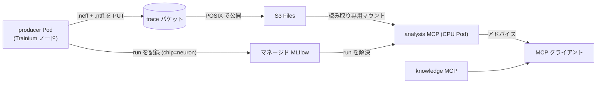

本章は Advanced02「[プロファイルを MCP で分析する基盤を動かす](https://zenn.dev/littlemex/books/eks-distributed-ai/viewer/eks-profiling-mcp)」の続きです。Advanced02 では GPU の `.nsys-rep` を対象に、データ層の適用・S3 Files マウント・`mcp-host` でのデプロイ・analysis MCP と knowledge MCP による分析までを動かしました。本章では同じ基盤の上に AWS Trainium / Inferentia (Neuron) のプロファイルを載せ、GPU と同じ analyze / knowledge の流れで扱えるようにします。

:::message
本章の開始状態は、Advanced02 を実施済みで、データ層 (`infra/data-layer`) とクラスタ側のマウント・`mcp-reader`・`mcp-host` の GPU 用 analysis がすでに稼働している状態です。ここではその上に Neuron 用の analysis を足し、Neuron の producer からプロファイルを 1 本記録して分析まで通します。Advanced02 の予約タグ・prefix 規約・`volumeHandle` 書式・digest 固定といった前提はそのまま引き継ぐので、本章では繰り返しません。
:::

# 解説

## この章で動かすもの

経路は Advanced02 と同じで、対象が Neuron のプロファイルに変わるだけです。producer が Trainium ノード上でモデルをコンパイルし、そのコンパイル成果物 (`.neff`) をデバイス上で実行してプロファイル (`.ntff`) を採取し、両方を trace バケットに書いて run を MLflow に記録します。analysis MCP はその run を解決し、S3 Files マウント越しに `.neff` と `.ntff` を読んで、`neuron-summary` アナライザの結果をテキストで返します。



分析側が CPU Pod のままでよい点は GPU と共通です。プロファイルの採取だけが Trainium デバイスを要し、採取済みのプロファイルを要約する処理はデバイスを要しません。この非対称性が本章の設計の要になります。

## GPU 版との違い

GPU と Neuron で、基盤の骨格は同じでも、producer 側の手数と成果物の形が変わります。

| 観点 | GPU (Advanced02) | Neuron (本章) |
| --- | --- | --- |
| 成果物 | `.nsys-rep` の 1 ファイル | `.neff` (コンパイル成果物) と `.ntff` (プロファイル) の 2 ファイルの組 |
| 採取コマンド | `nsys profile <cmd>` | コンパイルで `.neff` を得て `neuron-explorer capture` で `.ntff` を採る |
| 採取に要するもの | GPU ノード | Trainium ノード (デバイスを実際に実行する) |
| アナライザ | `nsys-stats` | `neuron-summary` (`neuron-explorer view --output-format summary-text`) |
| 分析 Pod | CPU Pod | CPU Pod (同じ。要 `aws-neuronx-tools`) |
| `store.log` の `chip` | `"gpu"` | `"neuron"` |

## 理解しておくべき詳細

演習のコマンドを流すだけでも動きますが、Neuron 特有の勘所を先に押さえておくと、詰まったときに切り分けられます。

### 1. プロファイルは `.neff` と `.ntff` の「ペア」

GPU の `.nsys-rep` は 1 ファイルで完結しますが、Neuron の要約には 2 つのファイルが要ります。`.neff` (Neuron Executable File Format) はコンパイラが出す実行可能形式で、`.ntff` (Neuron Trace File Format) はその `.neff` をデバイス上で実行して採ったプロファイルです。`neuron-summary` アナライザは `.neff` (どんな計算グラフか) と `.ntff` (実際にどう動いたか) を突き合わせて指標を出すので、**producer は両方を成果物として記録**しなければなりません。片方だけを `store.log` に渡すと、分析時にペアが揃わずアナライザが実行できません。

### 2. プロファイル採取は実 Trainium 実行を要する

Neuron のコンパイル自体はデバイス不要です (`neuronx-cc` や torch-xla のトレースは Trainium が無くても `.neff` を生成できます)。しかしプロファイル採取 (`neuron-explorer capture`) は、その `.neff` を**実際にデバイス上で実行して**トレースを採るため、Trainium ノードが要ります。したがって producer Pod は Neuron デバイスを持つノードに載せる必要があり、デバイスの taint に対する toleration とデバイスリソースの要求が要ります。

```yaml
# producer Pod (Trainium ノードに載せる)
spec:
  serviceAccountName: producer          # Advanced02 手順2 で作った SA (バケット書き込み + MLflow 記録)
  tolerations:
    - key: aws.amazon.com/neuron
      operator: Exists
      effect: NoSchedule
  containers:
    - name: producer
      resources:
        limits:
          aws.amazon.com/neuron: "1"   # Neuron デバイスを 1 つ要求する
```

対照的に、後段の analysis MCP はデバイスを要求しません (詳細 4)。

### 3. torch-xla の Neuron バックエンド (`libneuronxla`) が DLC によっては欠落する

torch-xla からモデルをトレースして `.neff` を得る場合、Neuron 用の PJRT バックエンドを提供する `libneuronxla` が要ります。ところが Neuron 系の DLC (Deep Learning Container) イメージのなかには、推論サービング向けに絞られていて `libneuronxla` を同梱していないものがあります。この場合、torch-xla のデバイス取得が次のように落ちます。

```text
ModuleNotFoundError: No module named 'libneuronxla'
```

:::details 対処 (Neuron の pip リポジトリから補う)
`libneuronxla` を Neuron 公式の pip インデックスから追加インストールすれば、torch-xla の Neuron バックエンドが有効になります。

```bash
pip install libneuronxla --extra-index-url https://pip.repos.neuron.amazonaws.com
```

なお、単一デバイスでのコンパイル・採取では、実行時に `aws-ofi-nccl` の初期化失敗や EFA 関連の警告 (`NET/OFI ... initialization failed`) が出ることがありますが、これは複数デバイス間の集団通信のためのプラグインが無いだけで、単一デバイスのプロファイル採取には影響しません。
:::

### 4. 分析 MCP は CPU Pod で動く

プロファイルの採取はデバイスを要しますが、採取済みの `.ntff` を要約する `neuron-explorer view` は**デバイスを開きません**。実際に `/dev/neuron` を持たない CPU Pod (素の Debian ベース) 上で `neuron-explorer view -n <neff> -s <ntff> --output-format summary-text` を採取済みのペアに対して実行し、要約が返ること、および `/dev/neuron` へのアクセスが一度も発生しないことを実機で確認しています。つまり Neuron の analysis MCP も GPU と同じく Trainium を持たない CPU Pod に載せられ、`mcp-reader` サービスアカウント・S3 Files マウント・マネージド MLflow の配線はすべて GPU 版と共用できます。

Neuron 向けに追加で必要なのは、この CPU 用の analysis イメージに Neuron のツールを積むことだけですが、ここに 1 つはまりどころがあります。`neuron-explorer` の本体 (`aws-neuronx-tools` パッケージ) だけを入れても、起動時に `libnrt.so.1: cannot open shared object file` で落ちます。`view` はデバイスを開かないものの、バイナリ自体は Neuron ランタイムの共有ライブラリ (libnrt) にリンクしているためです。そこで `aws-neuronx-runtime-lib` (libnrt を提供) も併せて入れ、`LD_LIBRARY_PATH` にそのパスを通す必要があります。一方、実デバイスと通信するためのカーネルドライバ (`aws-neuronx-dkms`) は不要です (view はデバイスに触れないため)。

:::message
GPU の analysis イメージが `nsys` を積んでいるのと同じ発想です。`nsys stats` が GPU 無しで動くように、`neuron-explorer view` も Trainium 無しで動きます。デバイスが要るのは採取側 (producer) だけ、と覚えておくと配置を間違えません。
:::

### 5. `.neff` はコンパイルキャッシュに出力される

torch-xla 経由でコンパイルすると、`.neff` は明示的なパスにではなく Neuron のコンパイルキャッシュに書かれます。採取時に確実に `.neff` を拾えるよう、キャッシュ先を環境変数で固定しておきます。実行後、キャッシュ配下 (`neuronxcc-<バージョン>/MODULE_<ハッシュ>/model.neff` のような場所) に `.neff` が生成されるので、`find` で拾います。

```bash
export NEURON_COMPILE_CACHE_URL=/tmp/nccache
find /tmp/nccache -name '*.neff'
```

# ワークショップ実施

Advanced02 でデータ層・マウント・`mcp-reader`・GPU 用 analysis はすでに動いている前提です。本章では Neuron 用の analysis を足し、Neuron の producer から run を 1 本記録して分析します。

## 1. Neuron analysis イメージをビルドする

analysis MCP のベースイメージ (accelprof を固定バージョンで入れた薄いイメージ) に、`neuron-explorer` を含む `aws-neuronx-tools` を積んだ変種を作ります。GPU 用に `nsys` を積んだイメージと同じ考え方です。Dockerfile は `infra/eks/images/Dockerfile.accelprof-analysis-neuron` に置き、Advanced02 と同じくクラスタ内 BuildKit でビルドして ECR に push します。`REGION` は演習を行うリージョン、`BASE` は Advanced02 でビルドした base イメージの digest です。

```bash
cd "$(git rev-parse --show-toplevel)"/infra/eks
export REGION=us-east-2
export ECR=$(aws sts get-caller-identity --query Account --output text).dkr.ecr.$REGION.amazonaws.com
export BASE=$ECR/accelprof@$(aws ecr describe-images --repository-name accelprof \
  --image-ids imageTag=v1 --query 'imageDetails[0].imageDigest' --output text)
k -n image-builder create configmap analysis-neuron-ctx \
  --from-file=Dockerfile=images/Dockerfile.accelprof-analysis-neuron
helm template exp charts/experiments -s templates/image-build-custom.yaml \
  --set imageBuild.enabled=true --set imageBuild.jobName=build-analysis-neuron \
  --set imageBuild.repository=$ECR/accelprof --set imageBuild.tag=v1-neuron \
  --set imageBuild.buildArgs.BASE=$BASE \
  --set imageBuild.contextSource=configMap --set imageBuild.contextConfigMap=analysis-neuron-ctx \
  | k apply -f -
```

push 後、Advanced02 と同様に digest を控え、values にはタグではなくこの digest を渡します。

```bash
aws ecr describe-images --repository-name accelprof \
  --image-ids imageTag=v1-neuron --query 'imageDetails[0].imageDigest' --output text
```

## 2. mcp-host に Neuron analysis のエントリを足す

`mcp-host` の values に analysis のエントリをもう 1 つ足します。GPU 用 analysis との違いは、指すイメージが Neuron 版 (`neuron-explorer` を積んだもの) であることだけです。`neuron-summary` はパッケージの組み込みアナライザで、イメージに `neuron-explorer` バイナリがあれば自動で有効になるため、`MCP_ANALYZERS` を書く必要はありません (`MCP_ANALYZERS` は独自アナライザを足すときだけ使う JSON マップです)。`mcp-reader` サービスアカウント・マネージド MLflow の ARN・S3 Files の `volumeHandle` は Advanced02 と同じ値を使い回します。マネージド MLflow の ARN は Advanced02 と同じくデータ層の出力から受け、Neuron イメージの digest とあわせて環境変数に取ります。

```bash
export MLFLOW_APP_ARN=$(terraform -chdir=infra/data-layer output -raw mlflow_app_arn)
export NEURON_DIGEST=$(aws ecr describe-images --repository-name accelprof \
  --image-ids imageTag=v1-neuron --query 'imageDetails[0].imageDigest' --output text)
```

次を実行すると、値が展開された analysis-neuron エントリが出力されるので、それを `my-values.yaml` の `mcps:` に追記します (S3 Files の PV / マウント・trace バケット・リージョンは GPU 用 analysis と同じ定義を使います)。

```bash
cat <<EOF
  analysis-neuron:
    image:
      repository: $ECR/accelprof
      digest: "$NEURON_DIGEST"
    serviceAccount: mcp-reader
    env:
      MCP_MLFLOW_TRACKING_URI: "$MLFLOW_APP_ARN"
EOF
```

```bash
cd "$(git rev-parse --show-toplevel)"/infra/eks
helm upgrade --install mcp charts/mcp-host -n mcp -f my-values.yaml
```

## 3. Neuron プロファイルを取って run を記録する

Trainium ノードに producer Pod を載せ (詳細 2 の toleration とデバイス要求)、モデルをコンパイルして `.neff` を得て、`neuron-explorer capture` で `.ntff` を採り、両方を `store.log` に渡します。ここでは最小の計算をトレースして採取する例を示します。実際の演習では Basic 章で動かした学習・推論ワークロードを対象にできます。

torch-xla の Neuron バックエンド (詳細 3 の `libneuronxla`) を補い、PJRT とコンパイルキャッシュを設定します。

```bash
pip install libneuronxla --extra-index-url https://pip.repos.neuron.amazonaws.com
export PJRT_DEVICE=NEURON NEURON_COMPILE_CACHE_URL=/tmp/nccache NEURON_RT_NUM_CORES=1
```

```python
import torch, torch_xla.core.xla_model as xm
# 1) デバイス上で計算 -> コンパイルキャッシュに .neff が出る
d = xm.xla_device()
a = torch.randn(128, 128, device=d)
b = torch.randn(128, 128, device=d)
_ = (a @ b).relu().sum()
xm.mark_step()
```

(2) `.neff` を特定し、デバイス上で実行して `.ntff` を採ります。

```bash
NEFF=$(find /tmp/nccache -name '*.neff' | head -1)
neuron-explorer capture -n "$NEFF" -s /tmp/profile.ntff
```

```python
# 3) .neff と .ntff の両方を成果物として記録する (chip="neuron")
from experiment_store import ExperimentStore
store = ExperimentStore.build(region=REGION, trace_bucket=TRACE_BUCKET, tracking_uri=MLFLOW_APP_ARN)
run_id = store.log("verify-neuron", chip="neuron", region=REGION, workload_id="smoke",
                   metrics={"sum": 1.0},
                   artifacts=[NEFF, "/tmp/profile.ntff"])   # 2 ファイルを両方渡す
print(run_id)   # 動作確認で使う
```

`log()` は 2 つの成果物を `s3://<bucket>/verify-neuron/<run_id>/` に上げ、run を MLflow に記録します。

## 4. 動作確認

Advanced02 と同じく port-forward して MCP クライアントから接続します。今回足した Neuron 用 analysis はエントリ名 `analysis-neuron` の Service として `mcp` 名前空間に作られます。

```bash
k port-forward svc/analysis-neuron -n mcp 8080:8080 &
```

先ほどの `run_id` を analysis MCP に渡し、`stage_run` で成果物をマウント上で読める状態にしてから、`neuron-summary` アナライザを走らせます。

`analyze(run_id, "neuron-summary")` は、S3 Files 上の `.neff` と `.ntff` を読み、`neuron-explorer view --output-format summary-text` を実行して、実測の指標を返します (下は検証で採った小さなトレースの抜粋で、アカウント固有値は伏せています)。

```text
    tensor_engine_active_time_percent            0.1047
    scalar_engine_active_time_percent            0.4424
    hbm_read_bytes                               262184
    dma_active_time_percent                      0.0828
    mfu_inst_estimated_percent                   0.0021
    runtime_version                              2.33.10
```

この出力は「どのエンジン (Tensor / Scalar / Vector) がどれだけ動いていたか」「HBM をどれだけ読んだか」「行列演算ユニットの利用率 (MFU) はどの程度か」という事実です。GPU の `nsys-stats` が返す OS ランタイムやカーネル集計と、指標の種類は違っても役割は同じで、「どこに時間が溶けているか」を示します。

次の一手は knowledge MCP から得ます。Neuron 側の症状を `chip="neuron"` で `search_knowledge` に投げると、関連する playbook がランク付きで返ります。

```jsonc
// search_knowledge("tensor engine underutilized and DMA bound", chip="neuron")
{ "count": 3, "results": [
  { "id": "neuron/dma-and-collectives", "score": 35,
    "title": "DMA stalls and collective-communication bottlenecks on Neuron" },
  { "id": "neuron/utilization", "score": 34,
    "title": "Reading NeuronCore utilization — MFU/MBU/HFU and engine-active time" } ]}
```

playbook は英語のコーパスなので、検索も英語キーワード (dma, collective, mfu, utilization など) で投げます。上位に出た `get_topic("neuron/utilization")` を開けば、症状 (エンジンの active time が低い、MFU が伸びない) からその原因と確認すべき指標、次の一手までが読めます。analysis MCP が返した事実 (例: Tensor エンジン利用率が低く DMA の比率が高い) と、knowledge MCP の指針を突き合わせて、次の実験 (バッチ形状やレイアウトの変更など) を決めます。GPU も Neuron も同じ analyze / knowledge の流れで扱える、というのが本章の到達点です。

## 5. 後片付け

Neuron の producer Pod は Trainium ノードを占有するので、確認後に削除します。analysis のエントリは values から Neuron 分を外して `helm upgrade` すれば戻せます。データ層とクラスタ側のマウントは Advanced02 の後片付け手順で撤去します (撤去順は `infra/eks` を先、`infra/data-layer` を後)。`PRODUCER_POD` と `NAMESPACE` は手順 3 で producer Pod を作った名前と namespace に合わせます。producer Pod を削除したあと、values から analysis-neuron エントリを外して再適用します。

```bash
export PRODUCER_POD=neuron-producer
export NAMESPACE=distai
k delete pod "$PRODUCER_POD" -n "$NAMESPACE"
cd "$(git rev-parse --show-toplevel)"/infra/eks
helm upgrade --install mcp charts/mcp-host -n mcp -f my-values.yaml
```

# まとめ

本章では、Advanced02 で作った基盤の上に Neuron のプロファイルを載せ、GPU と同じ analyze / knowledge の流れで分析できるところまでを動かしました。Neuron 特有の勘所は、プロファイルが `.neff` と `.ntff` のペアであること、採取だけが実 Trainium 実行を要すること、torch-xla の Neuron バックエンド (`libneuronxla`) が DLC によっては欠けること、そして分析側は GPU と同じく CPU Pod でよいこと (`neuron-explorer view` はデバイスを開かない) の 4 点です。基盤の骨格は GPU と共通なので、追加したのは Neuron 用の analysis イメージ 1 つと values のエントリ 1 つだけでした。「ID は固定、中身は自由」という設計により、GPU と Neuron を同じ仕組み・同じツール群で並べて扱えます。

# 参考資料

- [Advanced02 - GPU プロファイルを MCP で分析する仕組みを体験する](https://zenn.dev/littlemex/books/eks-distributed-ai/viewer/eks-profiling-mcp) - 本章の前提となる GPU 版の演習
- [プロファイリングを楽にしたい](https://zenn.dev/littlemex/articles/8ab01bc40f627a) - 本基盤の設計思想を解説したブログ
- [AWS Neuron Documentation](https://awsdocs-neuron.readthedocs-hosted.com/en/latest/) - Neuron SDK・`neuron-explorer`・`neuronx-cc` の公式ドキュメント
- [littlemex/distributed-ai](https://github.com/littlemex/distributed-ai) - `infra/eks/images` の analysis イメージと `mcp-host` チャートの実装
- [accelprof](https://pypi.org/project/accelprof/) / [accelprof-knowledge](https://pypi.org/project/accelprof-knowledge/) - 分析 MCP と知識 MCP の pip パッケージ
