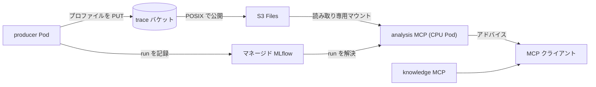

本章では、Basic01 から Basic11 で構築した Amazon EKS の土台の上に、GPU / Neuron のプロファイルを収集し、Model Context Protocol (MCP) 経由で分析する基盤を動かします。設計思想と全体像は別記事「GPU/Neuron のプロファイルを MCP で分析する基盤を設計した話」で解説済みなので、本章はそれを読んだ前提で、実際に手を動かすうえで理解しておくべき勘所に絞ります。

:::message
本章の開始状態は、クラスタが `terraform apply` 済み (Basic01 から Basic11 相当の `infra/eks` が稼働) で、かつプロファイル基盤のデータ層 (`infra/data-layer`) はまだ適用していない状態です。データ層の適用から始め、イメージのビルド、`mcp-host` チャートでのデプロイ、MCP からの分析までを通します。
:::

# 解説

## この章で動かすもの

動かす経路は次のとおりです。producer が実ワークロードにプロファイル収集を差し込んでバケットに書き、分析 MCP が MLflow で run を解決し、S3 Files マウント越しにプロファイルをその場で読んで、アナライザの結果をテキストで返します。



## 前提と、有効化する toggle

データ層と、クラスタ側のマウント配線は既定で無効です。本章では次の toggle (機能を有効化する Terraform 変数) を有効にします。`infra/data-layer` 側で `s3files_enabled` と `mlflow_enabled` を、`infra/eks` 側で `s3files_enabled` と `analysis_mcp_enabled` を `true` にします。これらは課金や権限を伴うため、既定で `false` に倒してあります。

:::message alert
マネージド MLflow は課金リソースです。演習が終わったら本章末尾の後片付けを必ず実施してください。
:::

## 理解しておくべき詳細

演習のコマンドをただ流すのではなく、次の 5 点を押さえておくと、詰まったときに自力で切り分けられます。

### 1. Terraform state を 2 つに分ける理由

バケット・IAM・MLflow は「記録の正本」であり、クラスタより長生きします。これらを `infra/data-layer` という別 state に置くことで、クラスタ側の `terraform destroy` が正本を消せないようにしています。両者は [`terraform_remote_state`](https://developer.hashicorp.com/terraform/language/state/remote-state-data) による state 参照では結合せず、データ層の `terraform output` の値をクラスタ側の変数として手渡しする疎結合です。

:::message alert
撤去順は必ず `infra/eks` (マウントターゲット) を先、`infra/data-layer` (ファイルシステム) を後にします。EFS ベースのファイルシステムはマウントターゲットが残っていると削除できないため、逆順にすると `infra/data-layer` の destroy が途中で失敗します。
:::

### 2. S3 Files マウントの volumeHandle と node 側の権限

数 GB のプロファイルをダウンロードせずに読むために、trace バケットを S3 Files でマウントします。ここで最重要なのは PersistentVolume の `volumeHandle` の書式と、マウントを担う node 側の権限の 2 点です。`volumeHandle` は `s3files:<FileSystemId>::<AccessPointId>` の形式が必須で、裸のファイルシステム ID を渡すと driver が EFS だと誤解してマウントがタイムアウトします。

```yaml
csi:
  driver: efs.csi.aws.com
  volumeHandle: "s3files:<FILE_SYSTEM_ID>::<ACCESS_POINT_ID>"
```

マウントを実行するのは node 側のプラグインなので、S3 Files のクライアント権限は `efs-csi-node-sa` に Pod Identity (Pod にロールの資格情報を注入する EKS の仕組み) で与えます。この配線は `infra/eks` の [`s3files-mount.tf`](https://github.com/littlemex/distributed-ai/blob/main/infra/eks/s3files-mount.tf) が担います。今回の検証では、この Pod Identity 経由の権限付与で node プラグインが S3 Files をマウントできることを実機で確認しています。

:::details なぜ node SA に Pod Identity が要るのか (詰まりやすい点)
node SA に Pod Identity を設定しないと、node プラグインは Pod が載っている node のインスタンスロールにフォールバックします。Karpenter が起動する node とマネージドノードグループの node はインスタンスロールが異なるため、片方のロールにだけ権限を付けると、別の node に載った Pod が `mount.nfs4: access denied by server` で失敗します。`efs-csi-node-sa` に明示的に Pod Identity を紐付けることで、どの node に載ってもマウントが通ります。
:::

### 3. 固定 ID・自由な中身という契約

run は `alias`・`chip`・`region`・`workload_id`・`artifacts_uri`・`schema_version` という予約タグで指され、`s3://<bucket>/<alias>/<run_id>/` に置かれます。それ以外のメトリクスや成果物ファイルには制約がありません。この契約のおかげで、別々のツールで測った GPU と Neuron の run を同じ索引に並べられます。`artifacts_uri` と `schema_version` はストアが自動で付けます。

### 4. 読み取り専用マウントという不変条件

CSI の node ロールには `s3files:ClientMount` は与えますが `ClientWrite` は与えません。そのため、クラスタ上のどの Pod も書き込み可能なマウントを得られません。加えてオブジェクトの削除 (`s3:DeleteObject`) を持つのは削除専用の janitor ロール (古い run を掃除する GC 用のロール) だけで、producer は run ごとに一意な `<run_id>` 入りの prefix に書くので上書きの衝突も起きません。分析 MCP が誤ってデータを壊す経路を、権限の側で塞いでいます。

### 5. イメージは digest で固定する

`mcp-host` チャートは、イメージの指定に digest かタグの少なくとも一方を要求します。両方を指定しても構いませんが、`:latest` と未指定はエラーになります。タグは可変なので、再現性が要る本番相当のデプロイでは digest 固定を推奨します。

:::details なぜマネージド MLflow で 403 になることがあるか
アカウントによっては、組織ポリシーで SageMaker MLflow のデータプレーンを管理者権限のプリンシパルに限定していることがあります。この場合、IAM を正しく与えていても、Pod Identity で紐付けた `mcp-reader` からの MLflow 呼び出しが `403` で拒否されます。これはコードや IAM の不備ではなくアカウント側の制約です。制約の無いアカウントで使うか、自前管理の tracking サーバを指してください。
:::

## 手順の骨子

### データ層を適用する

`infra/data-layer` を専用の state で初期化し、S3 Files とマネージド MLflow を有効にして適用します。適用後、`terraform output` で以降に使う値 (S3 Files の volumeHandle、MLflow の ARN、`mcp-reader` ロールの ARN、trace バケット名) が得られます。

```bash
cd infra/data-layer
terraform init -backend-config=backend.hcl
terraform apply -var s3files_enabled=true -var mlflow_enabled=true
# 以降で使う値を個別に取り出す
terraform output -raw s3files_file_system_id   # クラスタ側 apply の -var s3files_file_system_id に渡す
terraform output -raw s3files_volume_handle    # mcp-host の values に渡す
terraform output -raw mlflow_app_arn           # 分析 MCP の MCP_MLFLOW_TRACKING_URI に渡す
terraform output -raw mcp_reader_role_arn      # クラスタ側 apply の -var mcp_reader_role_arn に渡す
terraform output trace_buckets                 # リージョン別バケット名 (map)
```

### クラスタ側のマウントと mcp-reader を追加する

`infra/eks` 側で、データ層の出力を変数として渡し、S3 Files のマウントターゲットと、`mcp` 名前空間・`mcp-reader` (分析 MCP 用の読み取り専用 ServiceAccount で、Pod Identity 経由でデータ層の IAM ロールに紐付きます) を追加します。

```bash
cd infra/eks
terraform apply \
  -var s3files_enabled=true -var s3files_file_system_id=<FS_ID> \
  -var analysis_mcp_enabled=true -var mcp_reader_role_arn=<MCP_READER_ARN>
```

### イメージをクラスタ内 BuildKit でビルドする

デプロイ用イメージは、ローカルの Docker ではなくクラスタ内の rootless BuildKit (root 権限を要しないコンテナビルダ) でビルドして ECR に push します。この仕組みは `infra/eks` の [`image-builder.tf`](https://github.com/littlemex/distributed-ai/blob/main/infra/eks/image-builder.tf) と `image-builder-lib` チャートが提供し、汎用の呼び出し口 `image-build-custom.yaml` に Dockerfile を ConfigMap で渡してビルドします。

```bash
# 例: knowledge MCP イメージをビルドして ECR に push (analysis も同様)
export ECR=<account-id>.dkr.ecr.<region>.amazonaws.com   # 自分の ECR レジストリ URI に置き換える
kubectl -n image-builder create configmap knowledge-ctx \
  --from-file=Dockerfile=infra/eks/images/Dockerfile.accelprof-knowledge
helm template exp infra/eks/charts/experiments -s templates/image-build-custom.yaml \
  --set imageBuild.enabled=true --set imageBuild.jobName=build-knowledge \
  --set imageBuild.repository=$ECR/accelprof-knowledge --set imageBuild.tag=v1 \
  --set imageBuild.contextSource=configMap --set imageBuild.contextConfigMap=knowledge-ctx \
  | kubectl apply -f -
```

push が終わったら、digest を控えておきます。「理解しておくべき詳細」5 のとおり digest 固定を推奨するので、values にはタグではなくこの digest を渡します。

```bash
aws ecr describe-images --repository-name accelprof-knowledge \
  --image-ids imageTag=v1 --query 'imageDetails[0].imageDigest' --output text
```

:::details ローカルでビルドしない理由
分析イメージは `nsight-systems-cli` を含み linux/amd64 が要ります。ローカル (特に arm64 の macOS) からクロスビルドして ECR に載せるのは面倒で壊れやすいので、クラスタ内でネイティブにビルドして直接 ECR に push します。Dockerfile だけの軽いコンテキストは ConfigMap を context source にするのが最短です。
:::

### mcp-host でデプロイする

`mcp-host` チャートの values に、knowledge と analysis の 2 つのエントリを書きます。analysis は `mcp-reader` サービスアカウント、マネージド MLflow の ARN、S3 Files の volumeHandle、digest 固定のイメージを指定します。values の雛形は [`values-verify.yaml`](https://github.com/littlemex/distributed-ai/blob/main/infra/eks/charts/mcp-host/values-verify.yaml) にあります。

```bash
helm upgrade --install mcp infra/eks/charts/mcp-host -n mcp -f my-values.yaml
```

### プロファイルを取って run を記録する

分析対象がまだ無いので、まず producer 側でプロファイルを 1 本取り、trace バケットと MLflow に記録します。ここで得られる `run_id` を次の動作確認で使います。対象は Basic 章で動かしたワークロードでも任意のサンプルでもよく、`nsys profile <コマンド>` で包めば `.nsys-rep` が得られます。producer は `accelprof` (import 名は `experiment_store`) を入れ、その成果物を `store.log(...)` に渡すだけです。

```python
from experiment_store import ExperimentStore
store = ExperimentStore.build(region=REGION, trace_bucket=TRACE_BUCKET, tracking_uri=MLFLOW_APP_ARN)
run_id = store.log("verify-gpu", chip="gpu", region=REGION, workload_id="smoke",
                   metrics={"sum": 1.0}, artifacts=["/path/to/trace.nsys-rep"])
print(run_id)   # 動作確認で使う
```

`log()` は成果物を `s3://<bucket>/verify-gpu/<run_id>/` に上げ、run を MLflow に記録して FINISHED にします。これで固定 ID・自由な中身の契約 (この章の「理解しておくべき詳細」3) が具体的な 1 本の run として手元にできます。

:::message
本章の手順はマネージド MLflow を前提とします。マネージド MLflow のデータプレーンが管理者権限に限定されたアカウントでは、この呼び出しが `403` になります。その場合は tracking URI に自前 MLflow の URL を渡す構成になりますが、その MLflow の構築は本章の範囲外です (背景は「理解しておくべき詳細」の details 参照)。
:::

## 動作確認

port-forward して MCP クライアントから接続します。knowledge MCP は依存が無いのでそのまま `search_knowledge` が返ります。analysis MCP には先ほどの `run_id` を渡し、`stage_run` で成果物を読める状態にしてから `analyze` でアナライザを走らせます。

`analyze(run_id, "nsys-stats")` は、S3 Files 上の `.nsys-rep` を読んで実測のサマリを返します (下は検証で取った小さなトレースの OS ランタイム部分の抜粋で、アカウント固有値は伏せています)。

```text
 ** OS Runtime Summary (osrt_sum):
 Time (%)  Total Time (ns)  Num Calls  ...  Name
 --------  ---------------  ---------  ...  ------------------
     57.4           355561         42  ...  stat64
```

この出力は「どこに時間が溶けているか」という事実です。次の一手は、症状を knowledge MCP に `search_knowledge` で投げて得ます。両者を突き合わせて次の実験を決める、というのがこの基盤の使い方です (設計意図の詳細は冒頭で挙げたブログ記事を参照)。

## 後片付け

課金を止めるため、`mcp-host` のリリースを削除し、Terraform を撤去順どおりに戻します。マウントターゲットを持つ `infra/eks` の該当リソースを先に、データ層を後に破棄します。

```bash
helm uninstall mcp -n mcp
# 先に infra/eks 側のマウントと mcp-reader を無効化して apply
cd infra/eks
terraform apply -var s3files_enabled=false -var analysis_mcp_enabled=false
# その後にデータ層を destroy (この順序でないと FS がマウントターゲット依存で消せない)
cd ../data-layer
terraform destroy -var s3files_enabled=true -var mlflow_enabled=true
```

これで、GPU / Neuron のプロファイルを MCP 経由でその場分析する一連の流れを、実機で動かせました。日々の実験では producer に数行を差し込むだけで、以降は MCP から分析と次の一手の提示を受け取れます。
