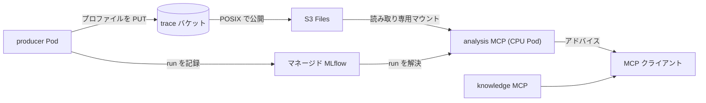

# 解説

## 全体構成

Basic01 から Basic11 で構築した Amazon EKS の土台の上に、GPU のプロファイルを収集し、Model Context Protocol (MCP) 経由で分析する仕組みを動かします。producer が実ワークロードにプロファイル収集を差し込んでバケットに書き、分析 MCP が MLflow で run を解決し、S3 Files マウント越しにプロファイルをその場で読んで、アナライザの結果をテキストで返します。



## これは何をするものか

設計思想と全体像、なぜこの形なのかは別記事「[プロファイリングを楽にしたい](https://zenn.dev/littlemex/articles/8ab01bc40f627a)」で解説済みです。本章はそれを読んだ前提で、実際に手を動かして GPU プロファイルの分析までを通します。予約タグや `volumeHandle` の書式、読み取り専用マウント、digest 固定といった設計上の勘所は、詳細はブログを確認してください。本章では手順の中で必要な箇所に絞って触れます。

本章の開始状態は、クラスタが `terraform apply` 済み (Basic01 から Basic11 相当の `infra/eks` が稼働) で、かつプロファイル基盤のデータ層 (`infra/data-layer`) はまだ適用していない状態です。データ層と、クラスタ側のマウント配線は既定で無効なので、次の toggle (機能を有効化する Terraform 変数) を順に有効化していきます。`infra/data-layer` 側で `s3files_enabled` と `mlflow_enabled`、`infra/eks` 側で `s3files_enabled` と `analysis_mcp_enabled` を `true` にします。

:::message alert
マネージド MLflow と S3 Files は課金リソースです。演習が終わったら本章末尾の後片付けを必ず実施してください。撤去順は必ず `infra/eks` を先、`infra/data-layer` を後にします (EFS ベースのファイルシステムはマウントターゲットが残っていると削除できないため)。
:::

# ワークショップ実施

## 1. 前提を確認する

クラスタ (Basic01 から Basic11 相当) が稼働していること、`infra/data-layer` と `infra/eks` の Terraform を操作できること、MCP クライアント (Claude Code など) が手元にあることを確認します。

## 2. データ層を適用する

`infra/data-layer` を専用の state で初期化し、S3 Files とマネージド MLflow を有効にして適用します。

```bash
cd "$(git rev-parse --show-toplevel)"/infra/data-layer
terraform init -backend-config=backend.hcl
terraform apply -var s3files_enabled=true -var mlflow_enabled=true
```

適用後、以降の手順で使う値を環境変数に取り出します（手順 3 以降まで同じシェルで続けてください）。`S3FILES_FS_ID` と `MCP_READER_ARN`・`MCP_PRODUCER_ARN` は手順 3 のクラスタ apply で、`S3FILES_VOLUME_HANDLE` は手順 5 の mcp-host values で、`MLFLOW_APP_ARN` は分析 MCP の `MCP_MLFLOW_TRACKING_URI` で使います。`trace_buckets` はリージョン別バケット名のマップで、参照用に表示します。

```bash
export S3FILES_FS_ID=$(terraform output -raw s3files_file_system_id)
export S3FILES_VOLUME_HANDLE=$(terraform output -raw s3files_volume_handle)
export MLFLOW_APP_ARN=$(terraform output -raw mlflow_app_arn)
export MCP_READER_ARN=$(terraform output -raw mcp_reader_role_arn)
export MCP_PRODUCER_ARN=$(terraform output -raw producer_role_arn)
terraform output trace_buckets
```

このデータ層の apply が、S3 Files のファイルシステムとアクセスポイントを AWS Cloud Control API 経由で作成します。アクセスポイントは `volumeHandle` に必須ですが、手で `aws s3files create-access-point` を叩く必要はありません。

## 3. クラスタ側のマウントと ServiceAccount を追加する

`infra/eks` 側で、データ層の出力を変数として渡し、S3 Files のマウントターゲット、`mcp` 名前空間と `mcp-reader` (分析 MCP 用の読み取り専用 ServiceAccount) とその Pod Identity 紐付け、書き込み側 `mcp-producer` の Pod Identity 紐付け、次の手順で使う ECR リポジトリ (`accelprof` / `accelprof-knowledge`) を追加します。producer 側は **Pod Identity の紐付けだけ**を作ります (紐付けは EKS コントロールプレーン上の `(namespace, ServiceAccount 名)` レコードで、namespace や SA の実在を要求しません)。`mcp-producer` ServiceAccount 自体はプロファイル収集ワークロードを動かす namespace (`mcp_producer_namespace`、既定 `distai`) に手順 6 で作ります。この分離により、ワークロード namespace が未作成でもこの apply は失敗しません。

```bash
cd "$(git rev-parse --show-toplevel)"/infra/eks
terraform apply \
  -var s3files_enabled=true -var s3files_file_system_id=$S3FILES_FS_ID \
  -var analysis_mcp_enabled=true \
  -var mcp_reader_role_arn=$MCP_READER_ARN \
  -var mcp_producer_role_arn=$MCP_PRODUCER_ARN
```

S3 Files を初めて有効化したこの apply の直後に、EFS CSI driver の node プラグイン (DaemonSet) を一度再起動します。マウントを担う node プラグインは Pod 生成時にしか Pod Identity の資格情報を受け取らないため、これをしないと既存 node 上の Pod は古い node インスタンスロールを使い続け、S3 Files のマウントが `mount.nfs4: access denied by server` になります。

```bash
k rollout restart ds/efs-csi-node -n kube-system
k rollout status  ds/efs-csi-node -n kube-system
```

## 4. イメージをクラスタ内 BuildKit でビルドする

デプロイ用イメージは、クラスタ内の rootless BuildKit でビルドして ECR に push します。この仕組みは `infra/eks` の [`image-builder.tf`](https://github.com/littlemex/distributed-ai/blob/main/infra/eks/image-builder.tf) と `image-builder-lib` チャートが提供し、汎用の呼び出し口 `image-build-custom.yaml` に Dockerfile を ConfigMap で渡します。push 先の ECR リポジトリは手順 3 で作成済みです。

分析 MCP はベースイメージ (`accelprof` を固定バージョンで入れたもの) の上に `nsys` を積んだ変種を使うので、(1) ベース、(2) nsys 積み、(3) knowledge の順にビルドします。

まず依存の取得 (初回のみ) と、リージョン・ECR レジストリ URI の準備です。`REGION` は演習を行うリージョンに合わせます。

```bash
cd "$(git rev-parse --show-toplevel)"/infra/eks
helm dependency build charts/experiments
export REGION=us-east-2
export ECR=$(aws sts get-caller-identity --query Account --output text).dkr.ecr.$REGION.amazonaws.com
```

(1) ベースイメージを `accelprof:v1` としてビルドし、その digest を `BASE` に控えます。

```bash
k -n image-builder create configmap base-ctx \
  --from-file=Dockerfile=images/Dockerfile.accelprof-analysis
helm template exp charts/experiments -s templates/image-build-custom.yaml \
  --set imageBuild.enabled=true --set imageBuild.jobName=build-base \
  --set imageBuild.repository=$ECR/accelprof --set imageBuild.tag=v1 \
  --set imageBuild.contextSource=configMap --set imageBuild.contextConfigMap=base-ctx \
  | k apply -f -
export BASE=$ECR/accelprof@$(aws ecr describe-images --repository-name accelprof \
  --image-ids imageTag=v1 --query 'imageDetails[0].imageDigest' --output text --region "$REGION")
```

(2) ベースに `nsys` を積んだ分析イメージを `accelprof:v1-nsys` としてビルドします (`BASE` は digest 固定で渡します)。

```bash
k -n image-builder create configmap nsys-ctx \
  --from-file=Dockerfile=images/Dockerfile.accelprof-analysis-nsys
helm template exp charts/experiments -s templates/image-build-custom.yaml \
  --set imageBuild.enabled=true --set imageBuild.jobName=build-nsys \
  --set imageBuild.repository=$ECR/accelprof --set imageBuild.tag=v1-nsys \
  --set imageBuild.buildArgs.BASE=$BASE \
  --set imageBuild.contextSource=configMap --set imageBuild.contextConfigMap=nsys-ctx \
  | k apply -f -
```

(3) knowledge MCP イメージを `accelprof-knowledge:v1` としてビルドします。

```bash
k -n image-builder create configmap knowledge-ctx \
  --from-file=Dockerfile=images/Dockerfile.accelprof-knowledge
helm template exp charts/experiments -s templates/image-build-custom.yaml \
  --set imageBuild.enabled=true --set imageBuild.jobName=build-knowledge \
  --set imageBuild.repository=$ECR/accelprof-knowledge --set imageBuild.tag=v1 \
  --set imageBuild.contextSource=configMap --set imageBuild.contextConfigMap=knowledge-ctx \
  | k apply -f -
```

push 後、values にはタグではなく digest を渡すため、それぞれの digest を控えます (`:latest` と未指定は `mcp-host` チャートがエラーにします)。1 つ目が分析 MCP 用 (`accelprof:v1-nsys`)、2 つ目が knowledge MCP 用 (`accelprof-knowledge:v1`) です。

```bash
aws ecr describe-images --repository-name accelprof \
  --image-ids imageTag=v1-nsys --query 'imageDetails[0].imageDigest' --output text --region "$REGION"
aws ecr describe-images --repository-name accelprof-knowledge \
  --image-ids imageTag=v1 --query 'imageDetails[0].imageDigest' --output text --region "$REGION"
```

## 5. mcp-host でデプロイする

`mcp-host` チャートの values に knowledge と analysis の 2 エントリを書きます。analysis は `mcp-reader` サービスアカウント、マネージド MLflow の ARN、S3 Files の volumeHandle、digest 固定のイメージ (手順 4 の `v1-nsys` の digest) を指定します。values の雛形は [`values-verify.yaml`](https://github.com/littlemex/distributed-ai/blob/main/infra/eks/charts/mcp-host/values-verify.yaml) にあります。`mcp-host` は S3 Files 用の PV を提供する `s3files-lib` をローカル依存に持つため、`helm upgrade` の前に一度だけ依存を取り込みます。

```bash
cd "$(git rev-parse --show-toplevel)"/infra/eks
helm dependency build charts/mcp-host
helm upgrade --install mcp charts/mcp-host -n mcp -f my-values.yaml
```

## 6. プロファイルを取って run を記録する

分析対象を作るため、producer 側でプロファイルを 1 本取り、trace バケットと MLflow に記録します。対象は Basic 章で動かしたワークロードでも任意のサンプルでもよく、`nsys profile <コマンド>` で包めば `.nsys-rep` が得られます。

producer を動かす namespace に `mcp-producer` ServiceAccount を作ります。`NAMESPACE` は手順 3 の `mcp_producer_namespace` と一致させます。手順 3 の Pod Identity 紐付けはこの `(namespace, mcp-producer)` を対象にしているので、この SA を持つ Pod が trace バケットへの書き込みと MLflow への記録の権限を得ます。

```bash
export NAMESPACE=distai
k create namespace "$NAMESPACE" --dry-run=client -o yaml | k apply -f -
k create serviceaccount mcp-producer -n "$NAMESPACE" --dry-run=client -o yaml | k apply -f -
```

producer を動かす Pod で `spec.serviceAccountName: mcp-producer` を指定します。紐付けより前から動いている Pod には資格情報が注入されないので、既存 Pod を使う場合は作成し直してください。

```python
from experiment_store import ExperimentStore
store = ExperimentStore.build(region=REGION, trace_bucket=TRACE_BUCKET, tracking_uri=MLFLOW_APP_ARN)
run_id = store.log("verify-gpu", chip="gpu", region=REGION, workload_id="smoke",
                   metrics={"sum": 1.0}, artifacts=["/path/to/trace.nsys-rep"])
print(run_id)   # 動作確認で使う
```

`log()` は成果物を `s3://<bucket>/verify-gpu/<run_id>/` に上げ、run を MLflow に記録します。これで具体的な 1 本の run が手元にできます。

## 7. 動作確認

`mcp-host` は各 MCP エントリ名の Service を `mcp` 名前空間に作る (ポート 8080) ので、それぞれ port-forward して MCP クライアントから接続します。

```bash
k port-forward svc/knowledge -n mcp 8081:8080 &
k port-forward svc/analysis  -n mcp 8080:8080 &
```

まず analysis MCP に先ほどの `run_id` を渡し、`stage_run` で成果物を読める状態にしてから `analyze` を走らせます。`analyze(run_id, "nsys-stats")` は S3 Files 上の `.nsys-rep` を読んで実測サマリを返します (下は検証で取った小さなトレースの抜粋)。

```text
 ** OS Runtime Summary (osrt_sum):
 Time (%)  Total Time (ns)  Num Calls  ...  Name
 --------  ---------------  ---------  ...  ------------------
     57.4           355561         42  ...  stat64
```

この出力は「どこに時間が溶けているか」という事実です。次の一手は knowledge MCP から得ます。症状を `search_knowledge` に投げると、関連する playbook がランク付きで返ります。

```jsonc
// search_knowledge("memory bound but occupancy is high", chip="gpu")
{ "count": 2, "results": [
  { "id": "gpu/roofline", "score": 12.0, "title": "Roofline diagnosis …" },
  { "id": "gpu/memory-and-fusion", "score": 7.0, "title": "…" } ]}
```

上位に出た `get_topic("gpu/roofline")` を開くと、症状 → 原因 → 確認点 → 次の一手が読めます。analysis MCP が返した事実 (どこが遅いか) と、knowledge MCP が返した指針 (次に何を変えるか) を突き合わせて次の実験を決める、というのが本基盤の使い方です。

## 8. 後片付け

課金を止めるため、`mcp-host` のリリースを削除し、Terraform のトグルを戻します。データ層は `terraform destroy` ではなく、トグルを `false` にした `terraform apply` で畳みます。trace バケットと MLflow アーティファクトのバケットには「記録の正本」を守るために `prevent_destroy` が付いており、`terraform destroy` は plan 段階でこのバケット破棄を検出して操作全体を中断してしまうため、MLflow App や S3 Files ファイルシステムまで実際には消えないからです。トグルを false にした apply なら、バケット (と中の記録) は残したまま、MLflow App と S3 Files ファイルシステムだけを破棄できます。

まず `mcp-host` を削除し、producer ワークロードが作った `mcp-producer` ServiceAccount を掃除します (infra は SA を管理しないため手動です)。次に `infra/eks` 側のマウントと mcp-reader を無効化します。`mcp_producer_role_arn` を渡さないと既定の空になり、producer の Pod Identity 紐付けも破棄されます。最後にデータ層のトグルを false にして apply します (destroy ではありません)。

```bash
helm uninstall mcp -n mcp
k delete serviceaccount mcp-producer -n "$NAMESPACE" --ignore-not-found
cd "$(git rev-parse --show-toplevel)"/infra/eks
terraform apply -var s3files_enabled=false -var analysis_mcp_enabled=false
cd "$(git rev-parse --show-toplevel)"/infra/data-layer
terraform apply -var s3files_enabled=false -var mlflow_enabled=false
```

# まとめ

本章では、データ層の適用から `mcp-host` でのデプロイ、producer での run 記録、そして分析 MCP と knowledge MCP を使った分析までを、実機で一通り動かしました。日々の実験では producer に数行を差し込むだけで、以降は MCP 経由でプロファイルの分析と次の一手の提示を受け取れます。設計思想の全体像は冒頭のブログにまとめてあります。Neuron のプロファイルを同じ仕組みで扱う手順は Advanced03 に続きます。

# 参考資料

- [プロファイリングを楽にしたい](https://zenn.dev/littlemex/articles/8ab01bc40f627a) - 本基盤の設計思想を解説したブログ
- [littlemex/distributed-ai](https://github.com/littlemex/distributed-ai) - `infra/data-layer` / `infra/eks` / `mcp-host` チャートの実装
- [accelprof](https://pypi.org/project/accelprof/) / [accelprof-knowledge](https://pypi.org/project/accelprof-knowledge/) - 分析 MCP と知識 MCP の pip パッケージ
- [Amazon S3 Files (EFS ユーザーガイド)](https://docs.aws.amazon.com/efs/latest/ug/s3-file-systems.html) - S3 Files の公式ドキュメント
