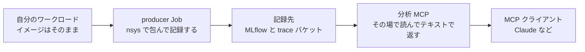

GitHub Tag: [release/eks-distributed-ai/v0.2.1](https://github.com/littlemex/distributed-ai/tree/release/eks-distributed-ai/v0.2.1)

本章では、Basic04 で作った GPU プールの上でワークロードのプロファイルを取得し、その結果を Claude から分析します。手順では合成の行列積を題材にしますが、`--image` を差し替えれば自分の学習ジョブでもそのまま動きます。自分の学習コマンドの前に 1 コマンド足すだけでプロファイルが記録され、その結果は Model Context Protocol (MCP) 経由で読めます。「どのカーネルが遅いのか」から「次に何を変えるか」までを 1 本のコマンドで受け取れます。

:::message alert
マネージド MLflow と S3 Files は課金リソースです。演習が終わったら本章末尾の後片付けを必ず実施してください。EFS ベースのファイルシステムはマウントターゲットが残っていると削除できないため、撤去順は必ず `infra/eks` を先、`infra/data-layer` を後にします。
:::

# 解説

## 全体構成


本章は、これまで作った基盤の上に「測る層」を載せます。自分のワークロードは producer Job に包まれて GPU ノードで走り、プロファイラの出力は S3 の trace バケットへ、run のメタデータは SageMaker のマネージド MLflow へ入ります。分析側の MCP サーバは `mcp` namespace で動き、trace バケットを S3 Files でマウントしてトレースをその場で読み、テキストの集計だけを手元に返します。



## これは何をするものか

構成要素は 3 つです。

- **producer Job**: 自分のイメージとコマンドをそのまま受け取り、外側からプロファイラを注入します。initContainer が基盤イメージから `nsys` と shim を共有ボリュームにコピーするので、**プロファイルを取るためにイメージを作り直す必要がありません**。終了後、同じ Job の recorder コンテナが結果を MLflow に 1 run として記録します
- **記録先**: run のメタデータ (params、metrics、tags) はマネージド MLflow、トレースの実体 (`.nsys-rep`) は S3 の trace バケットです
- **分析 MCP と知識 MCP**: 分析側はトレースをクラスタ内で読んで集計テキストを返し、知識側は症状に対応する playbook を返します。トレースの実体は手元に来ません

ワークロード側が守るのは `/accelprof/out` というディレクトリ 1 つだけで、そこに `metrics.json` を書けば metrics として記録されます (手順 5 のコマンドで書きます)。ライブラリの import は不要です。

## nsys で何が取れて、何が取れないか

shim が実行するのは次の 1 行で、`-t` の 3 系統が収集対象です。

```text
nsys profile -t cuda,nvtx,osrt -o /accelprof/out/traces/rank-N --force-overwrite true <あなたのコマンド>
```

`cuda` は CUDA API の呼び出しと GPU 上のカーネル実行やメモリ転送、`nvtx` はコード側で付けた区間 (付けていなければ何も出ません)、`osrt` はファイル I/O や同期などの OS ランタイム呼び出しです。この既定で取ったトレースからは、CUDA GPU Kernel Summary、NVTX Range Summary、CUDA API Summary、OS Runtime Summary の 4 つの集計が返ります。

取れないものを 1 つ押さえてください。**カーネル単位の詳細 (occupancy の内訳、命令ミックス、メモリ階層のヒット率) は nsys の対象外**で、Nsight Compute (`ncu`) の範囲です。nsys で支配的なカーネルを特定し、そのカーネルを `ncu` で深掘りするのが定石です。GPU のハードウェアメトリクス (SM 稼働率、Tensor Core 利用率、DRAM 帯域) も既定では含まれません。

## 取得する区間をどう絞るか

診断に必要なのは定常状態の数十から数百イテレーションだけです。数時間の学習を頭から取ると、初期化やチェックポイント保存が混ざって見たい区間が埋もれ、トレースも扱いにくいサイズになります。

| 方法 | やること | 向き |
| --- | --- | --- |
| `--delay` と `--duration` | コード変更なしで、開始を遅らせて指定秒数で打ち切る | まず 1 本取得してみるとき |
| NVTX の区間 | `torch.cuda.nvtx.range_push` と `range_pop` をイテレーションに仕込む | 集計をイテレーション境界で読みたいとき |
| `--capture-range=cudaProfilerApi` | `torch.cuda.profiler.start()` と `stop()` で挟んだ区間だけ記録する | 同じ区間を繰り返し比較するとき |

長時間の学習で気をつける制約が 2 つあります。トレースは Pod の `emptyDir` に書かれてから recorder が S3 に上げるので、大きな区間を取るとノードのエフェメラルストレージを消費します。大きく取るなら `--patch` で `emptyDir` に `sizeLimit` を付けます。もう 1 つは recorder がワークロードを待つ上限が既定で 1 日であることで、これを超える実行では `--recorder-timeout` を伸ばさないと、その時点のファイルだけが `status=unknown` で記録されます。

`--profile none` はプロファイラを動かさずに run だけを記録するモードです。この実行を同じ alias に 1 本置けばプロファイルなしのベースラインになり、`metrics.json` の数値の差がそのまま計測コストの実測値になります (手順 5 で実測します)。

::::details 複数 Pod のジョブで取得する場合を説明します

既定では rank 0 の Pod だけを取得し、対象は `kubectl accelprof run` の `--profile-ranks` で変えられます。この rank は**プロセスの rank ではなく Pod の index** です。shim が見るのは `ACCELPROF_NODE_RANK` (なければ Indexed Job の `JOB_COMPLETION_INDEX`、単一 Pod では 0) なので、この指定が選ぶのは「どの Pod で `nsys` を起動するか」です。`nsys` は既定で子プロセスを追跡するため、1 つの Pod で `torchrun --nproc-per-node 8` を包めば 8 プロセス分が 1 本の `rank-0.nsys-rep` に入ります。

rank 0 だけを取るのはコストを抑えるサンプリングであって、代表値の保証ではありません。rank 0 はロギングやチェックポイント書き出しを担うことが多く、ストラグラーは rank 0 からは見えません。全ノードの step time を `metrics.json` に記録しておき、外れたノードが見えたらその rank を狙い撃ちする 2 段構えが実務的です。なお複数ノードの分散ジョブへの適用は本章では未検証です。

::::

## 記録と掃除の単位をどう決めるか

alias は調査キャンペーン、つまり 1 つの問い (この学習ジョブはなぜ遅いのか、など) のもとで比較する一連の実行に 1 つ付けます。MLflow の experiment 名と S3 の第 1 階層プレフィックスを兼ねるので、**分析側から見える範囲と、掃除するときに数える単位が alias に揃います**。条件の違いは `--param`、コードや構成の違いは `--tag` で表し、反復ごとに alias を作らないでください。

alias 単位の削除は自動では起きません。終わったキャンペーンは MLflow の experiment 削除と `aws s3 rm --recursive s3://<trace バケット>/<alias>/` を対で実行します (片方だけ消すと参照できない run が残ります)。

# ワークショップ実施

はじめにシェルを対象クラスタへ向けます。Basic01 手順 3 の 5 行に `DISTAI_NAMESPACE` を足したもので、本章の作業 namespace は `distai` ではなく `team-a` です。こうすると `k` と後述のプラグインの既定がこの namespace になり、以降のコマンドに `-n` を書かずに済みます。端末を開き直したりこの 6 行を飛ばすと `k` は `distai` を向くので、本章のコマンドは `accelprof-config` が見つからないという形で止まります。`DISTAI_NAMESPACE` だけを書き換えても向き先は変わりません。この変数は `distai-env.sh` が `KUBECONFIG` を選ぶために読むものなので、変えたあとに 6 行目をもう一度実行してください。プラグインも `k` と同じく `KUBECONFIG` の namespace で動くため、`-n` で片方だけを逃がすと、失敗する場所が 1 行後ろにずれるだけになります。`CLUSTER_NAME` と `AWS_REGION`、それに 1 行目のチェックアウトのパスは自分のものに読み替えます。

```bash
cd ~/distributed-ai-v0.2.1
export AWS_PROFILE=default
export CLUSTER_NAME=distai-eks
export AWS_REGION=us-east-2
export DISTAI_NAMESPACE=team-a
source infra/scripts/distai-env.sh
```

実機出力:

```text
distai-env: distai-eks in us-east-2 (account 123456789012, release release/eks-distributed-ai/v0.2.1, data layer none)
distai-env: kubectl: context distai-eks, namespace team-a at https://XXXXXXXX.gr7.us-east-2.eks.amazonaws.com
distai-env: k is kubectl --context distai-eks; KUBECONFIG is /home/you/.kube/distai/distai-eks.team-a.yaml
```

データ層はまだ紐づいていないので `data layer none` です。

前提は次のとおりです。

| 前提 | どこで用意するか |
|---|---|
| Basic10 まで進めたクラスタが稼働していること | [Basic01](https://zenn.dev/tosshi/books/eks-distributed-ai/viewer/eks-vpc-foundation) から [Basic10](https://zenn.dev/tosshi/books/eks-distributed-ai/viewer/eks-shared-storage) |
| SageMaker MLflow app と S3 Files を知っている `aws` | 各ツールの公式手順 |
| Claude Code の `claude` が認証済みであること | [Claude Code](https://docs.claude.com/en/docs/claude-code/overview) |

## 1. 前提を確認する

次のコマンドは前提を 1 行ずつ OK か NG で表示します。NG が出たら、上の表の行に書いた場所を先に済ませてください。

```bash
k get nodes >/dev/null 2>&1 && echo "OK クラスタに接続できる" || echo "NG クラスタに接続できない"
test "$(k config view --minify -o jsonpath='{.contexts[0].context.namespace}')" = team-a && echo "OK シェルが team-a を向いている" || echo "NG 章冒頭の 6 行を DISTAI_NAMESPACE=team-a 付きで実行し直す"
aws sagemaker list-mlflow-apps help >/dev/null 2>&1 && echo "OK aws が MLflow app を知っている" || echo "NG aws を更新する"
for c in terraform kubectl helm python3 git curl claude; do command -v "$c" >/dev/null && echo "OK $c" || echo "NG $c"; done
```

2 行目を入れているのは、本章のほとんどのコマンドが `-n` を書かずに済むのが `KUBECONFIG` の namespace のおかげだからです。ConfigMap も Role も `PRODUCER_NAMESPACES` に挙げた namespace にだけ配られるので、シェルが `distai` を向いたままだと以降が `NotFound` で止まります。原因から遠い場所に出るので、ここで先に落とします。比べる相手を `team-a` と書いているのは、`DISTAI_NAMESPACE` と比べても意味が無いからです。この変数は冒頭の 6 行が向き先を決めるために使ったものなので、それと一致するのは当たり前で、向き先が間違っていても一致してしまいます。別の namespace で進めるなら、この行の `team-a` をその名前に読み替えてください。

`aws` が NG のときは AWS CLI を更新してください。古いままだと、導入スクリプトが権限エラーのような見た目で止まります。`claude` は手順 6 で使います。本章は稼働中のクラスタにデータ層と MCP サーバを足すので、まだデータ層 (`infra/data-layer`) を適用していない状態から始めます。

## 2. プロファイルを取得する namespace を用意する

導入スクリプトは namespace を作りません。ConfigMap と Role は実在する namespace にしか配れないので、**namespace と ServiceAccount を導入より先に作ります**。

2 つのテナントを想定して `team-a` と `team-b` を作ります。ServiceAccount 名 `mcp-producer` は Pod Identity の紐付けが参照する固定値なので変えられません。

```bash
for ns in team-a team-b; do
  k create namespace "$ns" --dry-run=client -o yaml | k apply -f -
  k create serviceaccount mcp-producer -n "$ns" --dry-run=client -o yaml | k apply -f -
done
```

実機出力:

```text
namespace/team-a created
serviceaccount/mcp-producer created
namespace/team-b created
serviceaccount/mcp-producer created
```

::::details 共有 namespace で使うときに配られる権限の範囲を説明します

Kubernetes の RBAC はリソース名を絞らない限り種類単位なので、配られる Role では、その namespace の Pod の参照と Job の参照・更新ができます。recorder が自分の Pod の状態を読み、Job に run id を書くために必要な範囲です。他人の Job も同じ Role で触れるので、共有 namespace ではこの範囲を前提に判断してください。

::::

## 3. 基盤を導入する

導入は 1 コマンドで、データ層の適用からクラスタ側の配線、MCP サーバのデプロイまでを行います。渡す値は 4 つ、うち 2 つは初回だけです。

| 変数 | 意味 | いつ渡すか |
| --- | --- | --- |
| `PRODUCER_NAMESPACES` | プロファイル収集を許可する namespace の一覧。ここに無い namespace のワークロードは記録できません | 毎回 |
| `MLFLOW_BACKEND` | 記録を受ける MLflow の種類。`app` は serverless で放置しても課金要素はバケットだけ、`server` は起動時間で課金 | 毎回 (**あとから変更できません**) |
| `DATA_LAYER_NAME` | 記録側の一式 (trace バケット、MLflow、S3 Files) に付ける名前。バケット名の接頭辞になるので既存と別名にします | 初回だけ |
| `CREATE_DATA_LAYER` | その新規作成を明示的に許可します。既定では既存の再利用しかしません | 初回だけ |

あわせて初回だけ `DEV_BUILD=1` を付けます。基盤イメージは自分の ECR から digest で引く作りなので、まだ何も無い状態では `no analysis image digest available` で止まります。このビルドは Basic02 で触れたクラスタ内 image builder が前提です。

```bash
cd "$(git rev-parse --show-toplevel)"
export PRODUCER_NAMESPACES=team-a,team-b
export DATA_LAYER_NAME=profiling
export CREATE_DATA_LAYER=1
export MLFLOW_BACKEND=app
DEV_BUILD=1 ./infra/scripts/install-profiling.sh
```

初回は全体で 20〜40 分かかります。長いのはデータ層の apply と、クラスタ内での 2 つのイメージのビルドです。`Phase N/7` の行が進んでいれば正常なので、terraform やビルドの出力が流れている間は待ちます。

実機出力 (末尾):

```text
--> acceptance OK: the analysis server exposes stage_run,resolve_artifacts,analyze

Profiling platform ready on distai-eks.

  MLflow (app)
    records to           : arn:aws:sagemaker:us-east-2:123456789012:mlflow-app/app-XXXXXXXX
    read them at         : https://app-XXXXXXXX.mlflow.sagemaker.us-east-2.app.aws/
  Trace bucket           : profiling-traces-us-east-2-123456789012
  Producer namespaces    : team-a,team-b
```

2 回目以降は `CREATE_DATA_LAYER` と `DATA_LAYER_NAME` を外して同じコマンドを実行します。何度実行しても同じ結果になるので、あとから namespace を増やすときは、その namespace と ServiceAccount を作ってから `PRODUCER_NAMESPACES` に追記して再実行します。

::::details 導入スクリプトが差分を検出して停止したときの進め方を説明します

既存クラスタに profiling と無関係な差分が溜まっている場合、スクリプトは一覧を表示して停止します。基盤だけを収束させるなら `PROFILING_ONLY=1`、表示された差分もすべて適用してよいなら `ALLOW_UNRELATED=1` を付けて再実行します。判断できない差分を `ALLOW_UNRELATED=1` で押し通すと、profiling とは関係のない構成変更が同時に走ります。

::::

## 4. 経路を確認する

必要なのはプラグイン 2 本で、どちらも 1 ファイルです。`kubectl` には、PATH 上の `kubectl-<名前>` を `kubectl <名前>` として呼び出すプラグイン機構があります。プロファイルを取得するのが `kubectl-accelprof`、手順 6 で MCP に繋ぐのが `kubectl-distai_mcp` です。プラグインだけは `k` ではなく `kubectl` と打ちます。`k` は `kubectl --context <クラスタ>` を呼ぶ関数で、`kubectl` はプラグイン名より前に置かれたフラグを受け付けないため、`kubectl accelprof` は `flags cannot be placed before plugin name: --context` で失敗します。向き先は冒頭の行が書いた `KUBECONFIG` で決まるので、`kubectl` と打っても対象クラスタは変わりません。

```bash
export PATH="$(git rev-parse --show-toplevel)/infra/eks/bin:$PATH"
kubectl accelprof --help >/dev/null && kubectl distai-mcp --help >/dev/null && echo "plugin ok"
kubectl plugin list | grep -E "accelprof|distai"
```

実機出力:

```text
plugin ok
/home/you/distributed-ai-v0.2.1/infra/eks/bin/kubectl-accelprof
/home/you/distributed-ai-v0.2.1/infra/eks/bin/kubectl-distai_mcp
```

`get-profiling.sh` で基盤を入れた場合は、同じプラグインの写しが `~/.local/bin` にも置かれています。この状態では `kubectl plugin list` が overshadow の警告を出し、警告が 1 つでもあると `error: one plugin warning was found` を出して終了コード 1 を返します。`plugin ok` が表示されていればプラグイン自体は動いているので、この行だけが失敗したように見えます。

```text
/Users/you/.local/bin/kubectl-accelprof
  - warning: /Users/you/.local/bin/kubectl-accelprof is overshadowed by a similarly named plugin: /Users/you/distributed-ai-v0.2.1/infra/eks/bin/kubectl-accelprof
error: one plugin warning was found
```

実行されるのは PATH の先に置いた checkout 側です。`command -v kubectl-accelprof` で確認できます。写しは古いままになるので、消しておくほうが安全です。PATH を前置していない端末では古い写しが動きます。

```bash
rm -f ~/.local/bin/kubectl-accelprof ~/.local/bin/kubectl-distai_mcp
kubectl plugin list | grep -E "accelprof|distai"
```

`kubectl plugin list` の出力がチェックアウト内のパスであることを確かめてください。以前どこかに置いた古い版が先に見つかると、手順 6 で `unknown subcommand` になります。

まず経路が通っていることを確かめるために、基盤イメージ自身を 1 本流します。`--gpu` を付けないので GPU ノードは起動せず、CPU で数秒で終わります。イメージの URI は namespace に配られた ConfigMap から引けるので、レジストリやタグを組み立てる必要はありません。

```bash
export IMAGE=$(k get configmap accelprof-config -o jsonpath='{.data.ACCELPROF_PLATFORM_IMAGE}' 2>/dev/null)
test -n "$IMAGE" || echo "NG シェルは namespace $(k config view --minify -o jsonpath='{.contexts[0].context.namespace}') を向いている。章冒頭の 6 行を DISTAI_NAMESPACE=team-a 付きで実行し直す"
kubectl accelprof run --alias teama-smoke --image "$IMAGE" --wait \
  --param steps=1 --tag phase=smoke \
  -- bash -lc 'python3 -c "print(sum(range(10**6)))"'
```

実機出力:

```text
==> submitted profile-wl-260831044443-b458f144 in team-a (alias teama-smoke, profile nsys)
    workload_id: wl-260831044443-b458f144
    logs:        kubectl -n team-a logs -f job/profile-wl-260831044443-b458f144 -c workload
    run id:      kubectl accelprof get wl-260831044443-b458f144

==> waiting for the run

==> workload wl-260831044443-b458f144 in team-a
    status:      SuccessCriteriaMet Complete
    run_id:      2bba00937a8444f093887c30479f420d
...
```

`--wait` は**数分以上かかる run には付けません**。投入したら手元のターミナルは閉じてよく、記録はクラスタの中で完結します。ここで付けているのは、このワークロードが数秒で終わり `run_id` まで 1 コマンドで確認できるからです。なお初回はノードの確保とイメージの pull が先に走るので、ワークロードが数秒でも完了までは数分待ちます。判断の基準はワークロード自体の実行時間です。

`--wait` を付けずに投入した run は、あとから状態と `run_id` を引きます。

```bash
kubectl accelprof get --last --alias teama-smoke
kubectl accelprof runs --alias teama-smoke
```

実機出力:

```text
==> newest run in team-a for alias teama-smoke: wl-260831044443-b458f144
    status:      SuccessCriteriaMet Complete
    run_id:      2bba00937a8444f093887c30479f420d

WORKLOAD-ID                ALIAS         RUN-ID                             COMPLETIONS   FAILED   AGE
wl-260831044443-b458f144   teama-smoke   2bba00937a8444f093887c30479f420d   1             <none>   2026-08-30T19:44:46Z

==> Jobs are kept only until their TTL expires; the recordings are permanent
https://app-XXXXXXXX.mlflow.sagemaker.us-east-2.app.aws/  (mlflow-app/app-XXXXXXXX)
```

引数を省いた `kubectl accelprof get` は「この namespace で最も新しい run」を指すので、namespace を共有していると他人の run を指します。`--alias` を付ければ自分のキャンペーンの中で最新を指し、どの run を見ているかは出力の 1 行目に必ず出ます。左端の `WORKLOAD-ID` が run を名前で指すときの値で、`run_id` が表示されたら記録は完了しています。


## 5. 自分のワークロードで取得する

イメージに要求するのは、注入された shim と `nsys` が動くことだけです (シェルを持つ x86-64 の glibc ベースであること)。本番の学習を流す前に、自分のイメージで数十秒の軽いコマンドを 1 本流して `profiled=true` の run が記録されることを確かめてください。

以降で使うイメージを変数に入れます。自分の学習イメージがあるならその URI に置き換えてください。ここでは手元に用意がなくても進められるように、AWS が公開している PyTorch のイメージを使います。

```bash
export TRAIN_IMAGE=763104351884.dkr.ecr.$AWS_REGION.amazonaws.com/pytorch-training:2.10.0-gpu-py313-cu130-ubuntu22.04-ec2
```

学習スクリプトの代わりに、4096×4096 の bf16 行列積を 300 回回すだけのコマンドを流します。ウォームアップ 20 回のあとに `torch.cuda.profiler.start()` を呼び、各反復を NVTX で囲み、最後に `stop()` を呼んで、スループットを `metrics.json` に書きます。区間を絞る指定が効くのはこの `start()` と `stop()` があるからで、呼んでいないスクリプトに同じ指定をすると区間が始まらないまま何も記録されません。

このスクリプトは同じものを 3 通りの取得方法で流すので、先に変数に入れます。こうしておけば 3 本目まで貼るだけで済みます。

同じスクリプトを 3 通りの取得方法で流すので、先に変数に入れます。こうしておけば 3 本目まで貼るだけで済みます。

```bash
SCRIPT=$(cat <<'PY'
import json, time, torch
a = torch.randn(4096, 4096, device="cuda", dtype=torch.bfloat16)
b = torch.randn(4096, 4096, device="cuda", dtype=torch.bfloat16)
for _ in range(20):
    a @ b
torch.cuda.synchronize()
torch.cuda.profiler.start()
t0 = time.perf_counter()
for _ in range(300):
    torch.cuda.nvtx.range_push("step")
    a @ b
    torch.cuda.nvtx.range_pop()
torch.cuda.synchronize()
el = time.perf_counter() - t0
torch.cuda.profiler.stop()
tf = 300 * 2 * 4096 ** 3 / el / 1e12
json.dump({"tflops": tf, "elapsed_s": el}, open("/accelprof/out/metrics.json", "w"))
print("tflops=%.1f elapsed=%.3f" % (tf, el))
PY
)
kubectl accelprof run --alias teama-gpu-nsys \
  --image "$TRAIN_IMAGE" --gpu 1 \
  --nsys-args '-t cuda,nvtx --capture-range=cudaProfilerApi --capture-range-end=stop' \
  -- python3 -c "$SCRIPT"
```

GPU ノードの確保とイメージの pull が入るので、初回は 5 分前後かかります。投入時に表示される `logs:` の行のコマンドで、workload の様子を見られます。

```bash
k logs -n team-a -f job/profile-<workload_id> -c workload
```

実機出力 (末尾):

```text
Capture range started in the application.
Capture range ended in the application.
Generating '/tmp/nsys-root/nsys-report-9f5b.qdstrm'
[1/1] [========================100%] rank-0.nsys-rep
tflops=62.3 elapsed=0.662
Generated:
	/accelprof/out/traces/rank-0.nsys-rep
```

計測コストを知るために、同じコマンドをあと 2 通り流します。`--nsys-args` を外した既定と、プロファイラを動かさないベースラインです。

```bash
export NSYS_ID=$(kubectl accelprof get --last --alias teama-gpu-nsys -o run-id)
echo "NSYS_ID=$NSYS_ID"
```

`--last` はその時点の最新を指すので、この 1 行はベースラインを投げる前に実行します。あとで実行すると `--last` が指すのはベースラインです。

```bash
kubectl accelprof run --alias teama-gpu-nsys --image "$TRAIN_IMAGE" --gpu 1 --wait \
  -- python3 -c "$SCRIPT"
export BASE_ID=$(kubectl accelprof run --alias teama-gpu-nsys --image "$TRAIN_IMAGE" --gpu 1 \
  --profile none -o run-id -- python3 -c "$SCRIPT")
echo "BASE_ID=$BASE_ID"
```

`run_id` を 2 つとも変数で受け取るのは、`runs` の一覧に profile の種類が出ないので、あとから見分けられないからです。`-o run-id` は記録が書かれるまで待つので、その行は run の完了までブロックします。

3 本の `metrics.json` を比べると、A10G 1 枚では次のようになりました。

| 実行 | 実測 TFLOPS | 区間の壁時計 | トレース | 記録されたカーネル数 |
| --- | --- | --- | --- | --- |
| `--profile none` (ベースライン) | 62.4 | 0.661 秒 | なし | - |
| 既定の全区間キャプチャ | 62.3 | 0.661 秒 | 547 KiB | 320 |
| `--capture-range=cudaProfilerApi` | 62.3 | 0.662 秒 | 116 KiB | 300 |

このワークロードでは取得の仕方によらず計測コストが差になりませんでした。区間を絞った効果はトレース側に出ていて、ウォームアップの 20 回が除かれてカーネル数が 320 から 300 になり、トレースは 547 KiB から 116 KiB になりました。差が出なかったのは測ったから言えることで、ワークロードによって変わります。

記録された run には、自分が渡した params と tags のほかに基盤が付ける予約タグが並びます。タグは MLflow に入るので、`kubectl accelprof runs` が末尾に出す UI の URL から run を開いて確認します。

```text
exp.alias        = teama-gpu-nsys
workload_id      = wl-260830065351-c356f674
chip             = gpu
status           = ok
exit_reason      = completed
profiled         = true
profile_mode     = nsys
artifacts_uri    = s3://<trace バケット>/teama-gpu-nsys/<run_id>/
...
```

このほかに `region`、`profiled_ranks`、`contract_version`、`schema_version`、`pod` が付きます。

押さえるのは 2 点です。`chip` は**要求したデバイス**で、スケジューラが載せた先ではありません。`--profile` が指定するのはプロファイラの種類で、デバイス要求と toleration を決めるのは `--neuron` です。Neuron ノードで動かしたいなら `--neuron` を指定します。もう 1 点は `profiled` が信用しきれないことです。shim は `nsys` を見つけた時点でこの値を立てるので、`nsys` の起動に失敗した実行でも `true` になり得ます。取得できたかどうかは `status` と、次の手順で `stage_run` が返すファイルの一覧まで見て判断してください。

失敗した実行も既定では記録され、`status=failed` と終了理由が残ります。

::::details イメージ互換で詰まったときにどこを見るかを説明します

詰まったときに読むのは workload コンテナのログです。shim が要求する基本コマンドは `/bin/sh` と `mkdir`、`date`、`cat`、`tr` です。検証では `nsys` を含まない `pytorch/pytorch:2.5.1-cuda12.4-cudnn9-runtime` をそのまま渡し、注入された `nsys` が動いて CUDA カーネルまでトレースに入ることを確認しました。

CUDA のトレースは CUPTI 経由なので、注入される `nsys` がワークロードの CUDA やノードのドライバに対して古すぎると、トレースが欠けるか収集に失敗します。`nsys` は起動時の警告と収集の進行を workload コンテナのログに出すので、`k logs -n <namespace> job/<job 名> -c workload` を読めば、トレースが取れているのか何も記録せず通過したのかが分かります。

::::

## 6. 分析する

分析サーバと知識サーバはクラスタの中で動くので、手元のクライアントは kubectl のポート転送越しに接続します。そのポートを保持し、クライアントに渡す設定を組み、終わったら閉じるところまでを `kubectl distai-mcp` が引き受けます。対象は `mcp-host` に登録した MCP すべてで、accelprof 専用ではありません。

まず手順 4 の run に対して経路を確かめます。

```bash
export RUN_ID=$(kubectl accelprof get --last --alias teama-smoke -o run-id)
test -n "$RUN_ID" && echo "run_id=$RUN_ID"
kubectl distai-mcp exec -- sh -c 'claude -p "analysis の stage_run と analyze を run_id=$RUN_ID で順に呼び、返ってきた事実だけを報告して" --mcp-config "$DISTAI_MCP_CONFIG" --strict-mcp-config --allowed-tools mcp__analysis__stage_run mcp__analysis__analyze'
```

`sh -c` を挟んで単引用符にしているのは、`DISTAI_MCP_CONFIG` が `distai-mcp exec` の内側で初めて決まるからです。外側の引用符で書くと、まだ空の変数が展開されます。`RUN_ID` は `export` してあるので、内側のシェルにも環境変数として届きます。

実機出力:

```text
stage_run は run を /traces/teama-smoke/2bba00937a8444f093887c30479f420d/ にステージし、
chip=cpu、ファイルは rank-0.nsys-rep の 1 件だけを返した。

analyze はデフォルトの analyzer=inventory で走り、同じディレクトリに対して rank-0.nsys-rep が
80413 バイト、total_files=1 / total_bytes=80413 という advice を返した。

どちらの応答もバイト列そのものは返さず、パスと件数・サイズの事実のみ。
```

`stage_run` は成果物を読める状態にしてマウント上の場所を返し、`analyze` がその中身を読みます。claude が返すのは自然文なので run ごとに文面は変わります。判断の基準にするのは、報告に `/traces/<alias>/<run_id>/` の場所と `.nsys-rep` の名前が出ていることです。ツール自身の返りは次の形です。

```json
{
  "run_id": "2bba00937a8444f093887c30479f420d",
  "chip": "cpu",
  "dir": "/traces/teama-smoke/2bba00937a8444f093887c30479f420d/",
  "files": ["rank-0.nsys-rep"],
  "count": 1
}
```

`analyze` の既定の analyzer は `inventory` で、ファイルの棚卸ししか返しません。カーネルの集計を読むには `analyzer` に `nsys-stats` を指定します。手順 4 の run は CPU なので集計する対象もありません。手順 5 で取った GPU の run に切り替えます。指すのは手順 5 で受け取った `NSYS_ID` です。`--last` を使わないのは、手順 5 の最後に投げたのがベースラインで、`--last` がそれを指すからです。ベースラインには成果物が無いので、`stage_run` は `has no artifacts to stage` を返して終わります。

```bash
export RUN_ID="$NSYS_ID"
kubectl distai-mcp exec -- sh -c 'claude -p "analysis の stage_run と analyze (analyzer は nsys-stats) を run_id=$RUN_ID で順に呼び、支配的なカーネル名と平均時間だけを 2 行で報告して" --mcp-config "$DISTAI_MCP_CONFIG" --strict-mcp-config --allowed-tools mcp__analysis__stage_run mcp__analysis__analyze'
```

実機出力:

```text
支配的なカーネルは ampere_bf16_s16816gemm_bf16_256x128_ldg8_f2f_stages_32x3_nn で、
GPU カーネル時間の 100.0% (320 回、合計 705.0 ms) を占める。
平均時間は 2,203,144.5 ns (約 2.20 ms/回) で、ばらつきは小さい (StdDev 3,083.5 ns)。
```

上の報告のもとになっているのが、`analyze` が `advice` に入れて返す集計表です。claude はこれを読んで要約しているので、原文を見たいときは「advice の全文をそのまま出して」と頼めば出てきます。まず読むのは CUDA GPU Kernel Summary で、次が自分で仕込んだ NVTX の区間です。

```text
 ** CUDA GPU Kernel Summary (cuda_gpu_kern_sum):

 Time (%)  Total Time (ns)  Instances  Avg (ns)   StdDev (ns)  Name
 --------  ---------------  ---------  ---------  -----------  ----
    100.0        705006251        320  2203144.5       3083.5  ampere_bf16_s16816gemm_bf16_256x128_ldg8_f2f_stages_32x3_nn
      0.0           158560          2    79280.0         67.9  void at::native::distribution_elementwise_grid_stride_kernel

 ** NVTX Range Summary (nvtx_sum):

 Time (%)  Total Time (ns)  Instances  Avg (ns)  StdDev (ns)   Style   Range
 --------  ---------------  ---------  --------  -----------  -------  -----
    100.0          8877208        300   29590.7       4337.9  PushPop  :step
...
```

このあとに CUDA API Summary と OS Runtime Summary も続きます (幅の都合で Med と Min と Max の列は省略しています)。

上の表は記録された GPU カーネル時間の内訳で、壁時計全体の内訳ではありません。下の表の 29.6 マイクロ秒は、この出力では NVTX で囲んだ範囲のホスト側の時間として集計されており、カーネルの投入にかかった時間を表します。カーネル起動は非同期なので、この値が小さいことだけでは投入待ちが無いとは言えません。投入待ちを疑うときは同じ出力の CUDA API Summary で同期系の API に時間が乗っていないかを見ます。

ベースラインの run (`--profile none`) に `stage_run` を打つと、成果物が無いという答えが返ります。これは異常ではありません。

```bash
kubectl distai-mcp exec -- sh -c 'claude -p "analysis の stage_run を run_id=$BASE_ID で呼び、返ってきたエラーの文をそのまま見せて" --mcp-config "$DISTAI_MCP_CONFIG" --strict-mcp-config --allowed-tools mcp__analysis__stage_run'
```

実機出力:

```text
Error executing tool stage_run: run 74fe9894... has no artifacts to stage: it was recorded without
a profiler (profile_mode='none'), so nothing was written to '/traces/teama-gpu-nsys/74fe9894.../'.
The mount at '/traces' is fine - a run like this is a metrics-only baseline, so read its metrics instead
```

事実が出たら、次に何をするかは知識 MCP に聞きます。症状を渡すと関連する playbook がランク付きで返り、`get_topic` で本文を開けます。

```bash
kubectl distai-mcp exec -- sh -c 'claude -p "knowledge の search_knowledge で GPU の学習が遅い症状に近い playbook を探し、上位 3 件の topic_id と題名を挙げて" --mcp-config "$DISTAI_MCP_CONFIG" --strict-mcp-config --allowed-tools mcp__knowledge__search_knowledge mcp__knowledge__get_topic'
```

実機出力:

```text
gpu/tensor-cores-and-occupancy   Tensor Core utilization and when occupancy is the wrong lever
gpu/memory-and-fusion            Memory-bound elementwise, coalescing, and epilogue fusion
gpu/roofline                     Roofline diagnosis - compute-bound vs memory-bound vs latency-bound
```

ここまでを 1 本にまとめると、この章のゴールがそのままコマンドになります。両方のサーバを許可して、事実と指針を分けて報告させます。

```bash
kubectl distai-mcp exec -- sh -c 'claude -p "run_id=$RUN_ID について、analysis の stage_run と analyze (analyzer は nsys-stats) で支配的なカーネルを特定し、続けて knowledge の search_knowledge と get_topic でその症状に対応する playbook を開き、次に何を変えるべきかを報告して。事実と playbook の推奨を分けて書いて" --mcp-config "$DISTAI_MCP_CONFIG" --strict-mcp-config --allowed-tools mcp__analysis__stage_run mcp__analysis__analyze mcp__knowledge__search_knowledge mcp__knowledge__get_topic'
```

実機出力:

```text
事実: GPU 時間の 100 % が bf16 の GEMM で、標準偏差 3.1 マイクロ秒と均一
事実: NVTX の区間は 29.6 マイクロ秒しかなく cudaDeviceSynchronize に 695 ミリ秒が乗っているので、
      CPU は投げて待つだけで GPU が律速
事実: カーネル名が既に Tensor Core のパスに乗っている
指針 (gpu/tensor-cores-and-occupancy): Tensor Core のパスは満たされているので、次に見るのは
      タイル量子化とウェーブ量子化
指針: 占有率を上げる方向は、Nsight Compute で warp 不足を確認するまで触らない
```

::::details 対話的なクライアントから使う場合の手順を説明します

`exec` はコマンドが終わるとトンネルを閉じるので、セッションを開いたまま何度も聞く使い方には向きません。その場合は `up` でトンネルを保持します。`up` は転送を背景に置いてプロンプトに戻るので、端末を占有しません。

```bash
kubectl distai-mcp up
kubectl distai-mcp status
```

実機出力:

```text
==> MCP servers are reachable from this machine
    analysis     http://127.0.0.1:55504/mcp
    knowledge    http://127.0.0.1:55521/mcp

    register them with a client that keeps a session open:
      claude mcp add --transport http analysis http://127.0.0.1:55504/mcp
      claude mcp add --transport http knowledge http://127.0.0.1:55521/mcp

    close them with:  kubectl distai-mcp down

    analysis     http://127.0.0.1:55504/mcp  listening, answers MCP
...
```

ローカルのポートは毎回 OS が空きポートから割り当てるので、値は実行ごとに変わります。登録に使う行は `up` が実際のポートで出力するので、表示された `claude mcp add` の行をそのまま実行します。Claude Code はそのディレクトリに紐づくプロジェクト単位の設定として保存するので、以降はそのディレクトリでセッションを開きます。

ポートを固定したい場合は `--local-port analysis=18000` のように指定します。指定したポートが使用中なら別のポートへ黙って移らずに失敗するので、登録済みの URL と実際の転送先がずれることはありません。`status` は listen しているかではなく MCP として応答するかを見ます。`kubectl` は転送先の Pod が消えてもポートを開いたままにするので、この 2 つは別物です。

使い終わったら閉じます。`down` は実際に閉じた本数を報告するので、0 本だった場合は別の context か namespace の記録を見ていると分かります。

```bash
kubectl distai-mcp down
```

実機出力:

```text
==> closed 2 tunnel(s) for context distai-eks, namespace mcp
```

::::

## 7. 後片付けする

:::message
引き続きプロファイルを取る場合は、この後片付けを飛ばします。基盤を残したときに課金が続くのは MLflow とバケット、分析用の Pod が載る CPU ノードです。Basic11 でクラスタを破棄する予定なら、データ層は別の state にあるので本章の B を先に済ませてください。
:::

新しいターミナルで始める場合は、章冒頭の 6 行を先に実行してください。

最初に選ぶのは、しばらく使わないだけか (A: 一時停止)、完全に撤去するか (B: 完全撤去) です。A は tracking server を停止するだけで課金が止まり、記録は保持されます。B は MLflow ごと消えるのであとから A に戻れません。迷ったら A です。

MLflow が `app` の場合、A に相当する操作はありません。起動と停止の概念がなく、置いておくこと自体に課金要素がバケット以外に無いためです。この場合は何もしないのが A で、撤去したいときだけ B に進みます。`server` の場合は名前を ConfigMap から引いて停止します。

```bash
export TRACKING_SERVER_NAME=$(k get configmap accelprof-config \
  -o jsonpath='{.data.ACCELPROF_TRACKING_URI}' | sed 's#.*/##')
aws sagemaker stop-mlflow-tracking-server --tracking-server-name "$TRACKING_SERVER_NAME" --region "$AWS_REGION"
```

:::message alert
B に進む場合、run のメタデータ (metrics、params、tags) は MLflow と一緒に消えます。成果物ファイルはバケットに残りますが、それがどの条件の実験だったかという情報は失われるので、残したい記録があれば先に取り出してください。
:::

B ではまず namespace 側を掃除します。`accelprof-orphan-check` CronJob を残すと、撤去後も 1 時間ごとに起動して失敗し続けます。

まず走り続けている producer Job が無いことを確認します。`ttlSecondsAfterFinished` は終了した Job だけを消すので、走っている Job は自動では消えません。

```bash
for ns in team-a team-b; do kubectl accelprof runs -n "$ns"; done
```

実機出力 (残っていない場合):

```text
WORKLOAD-ID   ALIAS   RUN-ID   COMPLETIONS   FAILED   AGE

==> Jobs are kept only until their TTL expires; the recordings are permanent
```

残っていなければ、配られたものを消します。

```bash
for ns in team-a team-b; do
  k -n "$ns" delete jobs -l app.kubernetes.io/name=profiling-producer --ignore-not-found
  k -n "$ns" delete cronjob accelprof-orphan-check --ignore-not-found
  k -n "$ns" delete configmap accelprof-config --ignore-not-found
  k -n "$ns" delete rolebinding accelprof-producer --ignore-not-found
  k -n "$ns" delete role accelprof-producer --ignore-not-found
  k -n "$ns" delete serviceaccount mcp-producer --ignore-not-found
done
```

次に MCP サーバを消し、`infra/eks` 側のマウントと mcp-reader (分析 MCP が trace バケットと MLflow を読むための Pod Identity のロール) を無効化して、最後にデータ層のトグルを `false` にした apply で畳みます。`terraform destroy` は使いません。trace バケットに `prevent_destroy` が付いているため、destroy は plan 段階で中断して MLflow も S3 Files も実際には消えないからです。

```bash
export DATA_LAYER_NAME=profiling
helm status mcp -n mcp >/dev/null 2>&1 && helm uninstall mcp -n mcp
cd "$(git rev-parse --show-toplevel)"/infra/eks
terraform plan -out=teardown.tfplan -var s3files_enabled=false -var analysis_mcp_enabled=false
terraform apply teardown.tfplan
cd "$(git rev-parse --show-toplevel)"/infra/data-layer
terraform init -reconfigure -backend-config=../eks/backend.hcl \
  -backend-config="key=data-layer/${DATA_LAYER_NAME}/terraform.tfstate"
terraform plan -out=teardown.tfplan \
  -var "region=${AWS_REGION}" -var "name_prefix=${DATA_LAYER_NAME}" \
  -var "trace_regions=[\"${AWS_REGION}\"]" -var "s3files_trace_region=${AWS_REGION}" \
  -var s3files_enabled=false -var mlflow_enabled=false
terraform apply teardown.tfplan
```

:::message alert
この 2 つの apply は導入スクリプトを通らないので plan の分類が行われず、クラスタに溜まった無関係な差分も一緒に適用されます。そのため plan をファイルに保存し、読んでから適用する形にしています。plan は `infra/eks/terraform.tfvars` があるチェックアウトで作ってください。変数ファイルの無いクローンで作ると、クラスタの設定が既定値に戻った巨大な差分になります。

`trace_regions` と `s3files_trace_region` を省くと、いま使っている trace バケットが「不要」と判定されて破棄対象に入ります。`AWS_REGION` が空のまま作った場合も同じです。**plan の削除一覧にバケットが出たら apply せず、変数を確認してください。** 正しく渡した plan は S3 Files のファイルシステムとアクセスポイントと IAM ロール、そして MLflow の 5 つを破棄し、バケットには触りません。
:::

B を完走しても、`DEV_BUILD=1` で焼いた基盤イメージの ECR リポジトリ、バケットの暗号化に使っている KMS キー (月額課金)、そしてこのクラスタとデータ層の紐付け (Systems Manager のパラメータストア、`/distai/v1/clusters/<クラスタ名>/` の下) は残ります。完全に消したい場合はこれらを個別に片付けます。

# まとめ

基盤の導入からプロファイルの記録、そして分析までを実機で通しました。導入も取得も 1 コマンドで、利用者がバケット名やマネージド MLflow の ARN を持ち回る必要はありません。実務では、区間を絞ること、`--profile none` のベースラインを同じ alias に置くこと、alias をキャンペーン単位で設計することの 3 点を押さえてください。

# 参考資料

- [プロファイリングを楽にしたい](https://zenn.dev/littlemex/articles/8ab01bc40f627a) - 本基盤の設計思想を解説したブログ
- [littlemex/distributed-ai](https://github.com/littlemex/distributed-ai) - `infra/scripts/install-profiling.sh` と `infra/eks/bin/kubectl-accelprof`、`infra/data-layer` と `infra/eks`、`mcp-host` チャートの実装
- [release/eks-distributed-ai/v0.2.1](https://github.com/littlemex/distributed-ai/tree/release/eks-distributed-ai/v0.2.1) - 本章が前提にしているリリース
- [accelprof](https://pypi.org/project/accelprof/) / [accelprof-knowledge](https://pypi.org/project/accelprof-knowledge/) - 分析 MCP と知識 MCP の pip パッケージ
- [Nsight Systems ユーザーガイド](https://docs.nvidia.com/nsight-systems/UserGuide/index.html) - `nsys profile` のオプションと収集対象の公式ドキュメント
- [Amazon S3 Files (EFS ユーザーガイド)](https://docs.aws.amazon.com/efs/latest/ug/s3-file-systems.html) - S3 Files の公式ドキュメント
