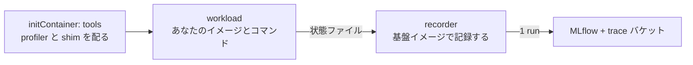

GitHub Tag: [release/eks-distributed-ai/v0.2.0](https://github.com/littlemex/distributed-ai/tree/release/eks-distributed-ai/v0.2.0)

# 解説

## 全体構成

Basic01 から Basic11 で構築した Amazon EKS クラスタの上に、GPU のプロファイルを収集し、Model Context Protocol (MCP) 経由で分析する仕組みを動かします。producer が実ワークロードにプロファイル収集を組み込んでバケットに書き、分析 MCP が MLflow で run を特定し、S3 Files マウント越しにプロファイルをその場で読んで、アナライザの結果をテキストで返します。

## これは何をするものか

設計思想と全体像、なぜこの形なのかは別記事「[プロファイリングを楽にしたい](https://zenn.dev/littlemex/articles/8ab01bc40f627a)」で解説済みです。本章はそれを読んだ前提で、実際に手を動かして GPU プロファイルの分析までを通します。予約タグや `volumeHandle` の書式、読み取り専用マウント、digest 固定といった設計上の要点の詳細はブログに譲り、本章では手順の中で必要な箇所に絞って触れます。

本章の開始状態は、クラスタが `terraform apply` 済み (Basic01 から Basic10 まで進めた `infra/eks` が稼働中) で、かつプロファイル基盤のデータ層 (`infra/data-layer`) はまだ適用していない状態です。導入は `infra/scripts/install-profiling.sh` の 1 コマンドで、データ層の適用からクラスタ側の設定、MCP サーバのデプロイまでを行います。ただし MCP サーバのイメージは自分の ECR から digest で引くので、初回は `DEV_BUILD=1` を付けてクラスタ内でビルドします (付けないと `no analysis image digest available` で停止します)。プロファイルをとる側は `infra/eks/bin/kubectl-accelprof` の 1 コマンドで、自分のイメージとコマンドを渡すだけです。

:::message alert
マネージド MLflow と S3 Files は課金リソースです。演習が終わったら本章末尾の後片付けを必ず実施してください。EFS ベースのファイルシステムはマウントターゲットが残っていると削除できないため、撤去順は必ず `infra/eks` を先、`infra/data-layer` を後にします。
:::

## コマンドの裏で何が起きているか

1 コマンドにまとめてある部分を、あとから自分の環境に合わせて変えられるように、中で何をしているかを先に押さえます。

### 導入スクリプトのフェーズ

`infra/scripts/install-profiling.sh` は 7 つのフェーズを順に実行します。次の 7 つに分かれています。

- Phase 1: 前提確認
- Phase 2: データ層の適用
- Phase 3: クラスタ側の設定 (S3 Files のマウント、`mcp` namespace、Pod Identity の紐付け、ECR)
- Phase 4: イメージの解決
- Phase 5 と 5b: MCP サーバのデプロイと、namespace への配布
- Phase 6: マウントの確認
- Phase 7: 受け入れ確認どのフェーズも冪等か「状態を見てから動く」形なので、途中で失敗しても原因を直して再実行すれば正しい状態になります。失敗時に自動でロールバックや destroy はしません。

定常運用で利用者が渡すのは 3 つだけです。クラスタ名、リージョン、そしてプロファイル収集を許可する namespace のリストです (初回だけは、どのデータ層に記録するかの名前 `DATA_LAYER_NAME` と、それを新規に作ってよいという意思表示 `CREATE_DATA_LAYER=1` も要ります。2 回目以降はレジストリから解決されます)。バケット名やマネージド MLflow の ARN、ServiceAccount 名、S3 Files のマウント先 AZ、イメージの digest はすべてスクリプトが Terraform の出力や AWS API から解決します。特にマウント先 AZ を変数にしていないのは意図的で、S3 Files のマウントは単一 AZ からしか到達できないため、手で渡した値が実体とずれると PersistentVolume が到達不能になります。

### apply の前に必ず plan を分類する

このスクリプトは `terraform apply` を無条件に実行しません。まず plan を作り、変更を 4 つに分類します。1 つ目が「消してはいけない記録の削除」で、対象は trace バケット、MLflow アーティファクトバケット、SageMaker MLflow 本体 (tracking server と app の両方)、KMS キー、S3 Files のファイルシステムとアクセスポイント、そしてそれらのバージョニング・ライフサイクル・暗号化の設定です。設定を含めているのは、保持期間や暗号化の変更だけでも記録済みのものを失い得るからです。これらの削除は上書き手段なしで拒否します。置き換えも削除を含むので同じ扱いです。2 つ目が同じ消してはいけない記録に対する**変更**で、これは `ALLOW_RECORD_UPDATES=1` を渡さない限り停止します。削除ではないので 1 つ目とは分けていますが、保持期間の短縮やポリシーの絞り込みは更新として現れ、それでも記録済みのものを失い得るからです。データ層のライフサイクル設定に差分がある状態で再実行するとこのエラーに当たるので、plan を読んで意図した変更であることを確かめてからこのフラグを付けます。

一方で作成は拒否しません。plan は「state に一度も無かった」と「state が見失った」を区別できず、初回導入と失敗した導入の再開が同じ形の差分として現れるためです。state が見失っただけの既存リソースは、plan を作る前に import して state に取り込む (adoption) ので、そもそも作成として現れません。3 つ目が profiling 基盤自身の変更で、これは適用します。4 つ目がそれ以外で、停止して一覧を表示します。長く運用したクラスタには profiling と無関係な差分が溜まるので、それを確認なしに適用しないための線引きです。基盤だけを適用したいときは `PROFILING_ONLY=1`、すべて受け入れるときは `ALLOW_UNRELATED=1` を渡します。

### producer Job の中身

プロファイルを取得する Job は 3 つの部分でできています。



initContainer が基盤イメージから profiler と shim を共有ボリュームにコピーします。これがあるので、プロファイルを取得したいイメージをイメージを再ビルドする必要がありません。workload コンテナは指定したイメージそのままで、shim が `nsys` で包んで実行し、終了時に状態ファイルを書きます。recorder コンテナは基盤イメージで動き、その状態ファイルを待って、置かれたファイルを読んで MLflow に 1 run 記録します。

記録を別コンテナに分けているのは技術的な理由です。accelprof の依存にはコンパイル済みの拡張が含まれ、特定の Python バージョンに固定されます。学習用のイメージに後から注入すると壊れるため、記録は基盤イメージの側で行い、ワークロードのイメージには Python も accelprof も要求しません。

### ワークロードとの約束はディレクトリ 1 つ

ワークロード側が守るのは `/accelprof/out` というディレクトリ 1 つだけです。`metrics.json` に数値の JSON オブジェクトを書けば metrics として記録され、`params.json` と `tags.json` も同じ形式で記録されます (`tags.json` の値は文字列化されます)。`artifacts/` に置いたファイルは run に添付されます。同じディレクトリの `traces/` と `status.json` は基盤が使う場所なので、ここには書かないでください。ライブラリの import は不要です。壊れた JSON は報告してスキップし、実行そのものは記録します。書き捨てのスクリプトの typo で完走した実験を失うほうが損失が大きいという判断です。

### namespace ごとに配られる契約

導入スクリプトは、許可した namespace のそれぞれに 3 つを配ります。1 つ目は ConfigMap で、リージョン・trace バケット・MLflow の ARN・MLflow の UI の URL・基盤イメージの digest を持ちます。2 つ目は Role で、recorder が自分の Pod の状態を読み、Job に run id のアノテーションを書くために使います。ここで注意したいのは権限の広さです。Kubernetes の RBAC はリソース名を絞らない限り種類単位なので、実際にはその namespace の Pod の参照と Job の参照・更新ができます。共有 namespace で使う場合はこの範囲を前提に判断してください。3 つ目は、記録されずに終わった Job を報告する1 時間ごとに動く確認用 CronJobです。プロファイルを取得する人が基盤の値を 1 つも知らなくて済むのは、この ConfigMap があるからです。namespace がまだ存在しない場合、そこには何も配られず警告だけが出るので、後述のとおり namespace は導入スクリプトより先に作ります。

### 記録の単位と後片付けの単位

alias は MLflow の experiment 名と S3 の第 1 階層プレフィックスを兼ねます。つまり分析側から見える範囲と、掃除するときに人が数える単位が alias です。ただし alias 単位の削除や保持期間を実行してくれるコマンドは同梱していません。`kubectl accelprof` にあるのは `run` と `get` と `runs` だけで、S3 のライフサイクル (`trace_glacier_after_days` と `trace_expire_after_days`) もバケット全体にかかります。alias 単位の掃除は、MLflow の experiment 削除と `aws s3 rm --recursive s3://<trace バケット>/<alias>/` を人が対で実行する運用になります。実験キャンペーンごとに 1 つの alias を `テナント名-系列名` の形で付け、キャンペーン内の反復は `workload_id` と自由なパラメータで表します。反復ごとに alias を作ると削除単位が増えていき、キャンペーンを 1 手で片付けられなくなります。

Job そのものは終了から 2 日後に Kubernetes が消します。run の記録は Job の寿命とは独立で、明示的に消すか保持ポリシーの対象になるまで残ります。run_id は recorder が Job のアノテーションに書き戻すので、Job がある間は `kubectl accelprof get` で引けます。消えたあとは MLflow を alias と `workload_id` で検索します。

### なぜ controller を作っていないか

この基盤には自作の controller がありません。producer Job が自分で記録するので、収束させるべき状態がなく、Job そのものが Kubernetes の提供する controller です。カスタムリソースで得られる状態の書き戻しとライフサイクル管理は、それぞれ Job のアノテーションと `ttlSecondsAfterFinished` で足ります。Pod 内の部品では埋められない穴は 1 つだけで、recorder が走る前に Pod ごと消える場合 (Pod の追い出しやノードの drain) です。これは各 namespace の1 時間ごとに動く確認用 CronJobが報告します。

# ワークショップ実施

## 1. 前提を確認する

本章は基盤リポジトリのリリース `release/eks-distributed-ai/v0.2.0` を前提にしています。本文のコマンドと出力例はこのバージョンで実機確認したものです。別のバージョンでは変数名やフラグが変わることがあるので、まずはこのタグで通してください。

クラスタ (Basic01 から Basic11 相当) が稼働していること、`infra/eks` の Terraform がリモート state を使っていること、`terraform` と `kubectl` と `helm` と `aws` と `python3` と `git` と `curl` が手元にあること (後半の手順でトンネルの listen を確認するのに `lsof` も使います)、MCP クライアント (Claude Code など) が手元にあることを確認します。リモート state は Basic01 の [`distai-up.sh`](https://github.com/littlemex/distributed-ai/blob/main/infra/scripts/distai-up.sh) が作り、その場所はレジストリに記録されています。前提の 4 行はレジストリから `infra/eks/backend.hcl` を書き出すので、導入スクリプトはそれを読んで解決します。チェックアウトの外から実行する場合や fresh clone で `backend.hcl` が無い場合は、`TF_STATE_BUCKET` などで明示的に渡します。

## 2. プロファイルを取得する namespace を用意する

導入スクリプトはテナントの namespace を作りません。作るのは Pod Identity の紐付けで、これは EKS コントロールプレーン上の `(namespace, ServiceAccount 名)` レコードなので、namespace や ServiceAccount の実在を要求しません。一方で ConfigMap と Role と点検は実在する namespace にしか配れないため、namespace と ServiceAccount は導入スクリプトより先に作ります。

本章は作業 namespace が `distai` ではなく `team-a` なので、Basic01 手順 2 の 4 行を `DISTAI_NAMESPACE` 付きで実行し直しておきます。こうすると `k` と後述のプラグインの既定がこの namespace になり、以降のコマンドに `-n` を書かずに済みます。

```bash
cd ~/distributed-ai-v0.2.0
export CLUSTER_NAME=distai-eks
export AWS_REGION=us-east-2
export DISTAI_NAMESPACE=team-a
source infra/scripts/distai-env.sh
```

```bash
for ns in team-a team-b; do
  k create namespace "$ns" --dry-run=client -o yaml | k apply -f -
  k create serviceaccount mcp-producer -n "$ns" --dry-run=client -o yaml | k apply -f -
done
```

ここでは 2 つのテナントを想定して `team-a` と `team-b` を作り、以降の手順は `team-a` で進めます。ServiceAccount 名 `mcp-producer` は Pod Identity の紐付けが参照する固定値なので、変えられません。この ServiceAccount を持つ Pod が、trace バケットへの書き込みと MLflow への記録の権限を得ます。

## 3. 基盤を導入する

前節で作った namespace に対して、プロファイル収集を許可する宣言をしながら導入します。`PRODUCER_NAMESPACES` はこれから実験を回す namespace の一覧で、そのまま「trace バケットへの書き込みと run の記録を許可した範囲」の宣言になります。ここに書かれていない namespace のワークロードは記録できません。初回はデータ層がまだ無いので、作成を `CREATE_DATA_LAYER=1` で明示的に許可します。既定では既存のデータ層の再利用しかしないので、誤って 2 つ目のデータ層を作って基盤が二分されることがありません。

導入は Basic01 で作ったチェックアウトから実行します。Basic01 step 2 のコマンドで自分のクラスタを解決してあれば、リージョンも state の場所も分かっているので、この章で渡すのは「どの namespace に許可するか」と、初回だけデータ層の名前です。クラスタ名をここで書き直さないのは、章ごとに書いた名前が Basic01 で解決した値を上書きして、別のクラスタを対象にしてしまうからです。

```bash
export PRODUCER_NAMESPACES=team-a,team-b
export DATA_LAYER_NAME=profiling
export CREATE_DATA_LAYER=1
export MLFLOW_BACKEND=app
DEV_BUILD=1 ./infra/scripts/install-profiling.sh
```

`DEV_BUILD=1` は初回だけ必要です。基盤イメージは自分の ECR から digest で引く作りなので、まだ何も無い状態では `no analysis image digest available` で止まります。2 回目以降は付けなくてよく、既にあるイメージを digest で使います。

`CLUSTER_NAME` が未設定だとここで止まります。その場合は Basic01 step 2 のコマンドを自分のクラスタ名で実行してから戻ってください。

`MLFLOW_BACKEND` は記録を受ける SageMaker MLflow の種類で、初回だけ意味を持ちます。`app` は serverless で、止めるという概念がなく、使っていない期間はバケット以外の課金要素を持ちません。`server` は managed な tracking server で、存在している時間だけ課金され、停止して課金を止めることができます。既定は `app` です。

この選択はあとから変更できません。データ層が記録している MLflow を切り替える plan は、いま存在する MLflow を破棄して空の MLflow を作る plan なので、run のメタデータがまとめて消えます。導入スクリプトは既存のデータ層が記録している側を優先し、違う側を要求されたら停止します。変えたい場合は別のデータ層を作ってください。

種類によって 1 つだけ機能差があります。tracking server は「記録はできるが削除はできない」という粒度の IAM を書けますが、app のデータプレーンは `sagemaker:CallMlflowAppApi` という 1 つのアクションが REST API 全体を覆うため、MLflow を読めるロールは同時に削除もできてしまいます。分析側の reader はこれを受け入れる必要がありますが、削除を仕事にする janitor には app では MLflow の権限を一切与えていません。そのため app では孤児 trace の自動回収が働かず、保持はバケットのライフサイクルルールに委ねられます。

`DATA_LAYER_NAME` はこの基盤の記録側 (trace バケット、MLflow、S3 Files) の一式に付ける名前で、初回だけ指定します。名前はバケット名の接頭辞になるので、既に別のデータ層がある環境では必ず別名にしてください。導入が成功すると、このデータ層がこのクラスタに紐づいたことがレジストリに記録されるので、2 回目以降は前提の 2 行が解決されます。`CREATE_DATA_LAYER=1` は新規作成の明示的な許可で、既定では既存のデータ層の再利用しかしません。誤って 2 つ目を作ると記録が二分されるからです。

1 つのクラスタに複数のデータ層を紐づけることもできます。テナントごとに分けたい場合や保持期間を変えたい場合で、`infra/scripts/distai-attach-data-layer.sh -c <cluster> --list` で現在の一覧と既定を確認できます。

2 回目以降は `CREATE_DATA_LAYER` を外して同じコマンドを実行します。最後に `acceptance OK` と接続情報が表示されれば導入完了です。何度実行しても同じ結果になるので、あとから namespace を増やすときは、その namespace と ServiceAccount を作ってから `PRODUCER_NAMESPACES` に追記して再実行します。

データ層は MLflow と trace バケットを含む記録側の一式で、クラスタごとに 1 つ立てる必要はありません。名前が state のキーとバケット名の接頭辞になり、複数のクラスタで記録を共有するなら 2 つ目以降のクラスタでは同じ名前を渡して `CREATE_DATA_LAYER` は付けません。既定値は持たせていません。以前は `mcp` という既定があり、それが別リージョンのデータ層を警告なしに指した結果、消してはいけない記録を取り違える寸前まで進んだことがあります。いまは未指定ならレジストリに記録された既定を読み、それも無ければ「どのデータ層に記録するのか」を明示するよう停止します。

:::message
既存クラスタに profiling と無関係な差分が溜まっている場合、スクリプトは一覧を表示して停止します。基盤だけを収束させるなら `PROFILING_ONLY=1` を付けて再実行し、表示された差分もすべて適用してよいなら `ALLOW_UNRELATED=1` を付けます。どちらを選ぶかは、表示された差分が今このタイミングで適用してよいものかどうかで判断します。判断できない差分を `ALLOW_UNRELATED=1` で押し通すと、profiling とは関係のない構成変更 (アドオンのバージョン更新など) が同時に走ります。
:::

## 4. プロファイルを取得して記録する

プロファイルを取得するのに必要なのは `kubectl-accelprof` という 1 ファイルだけです。`kubectl` はこの名前のファイルを PATH 上に見つけると `kubectl accelprof` というサブコマンドとして呼べるようにします。

ここまでの章を進めてきた読者はチェックアウトを持っているので、その中のプラグインを PATH に通すだけで済みます。

```bash
export PATH="$(git rev-parse --show-toplevel)/infra/eks/bin:$PATH"
kubectl accelprof --help >/dev/null && echo "plugin ok"
```

チェックアウトを持たない人 (プロファイルを取得するだけで基盤は触らない人) 向けの経路も 1 行あります。リポジトリを固定タグで `~/distributed-ai-v0.2.0` に取得し、プラグインを `~/.local/bin` に置きます。この経路も冒頭で `git`、`terraform`、`kubectl`、`helm`、`aws`、`python3`、`curl` の存在を確認し、欠けていればそこで止まります。プラグインの設置だけが目的でも `terraform` と `helm` は入れておいてください。

```bash
export CLUSTER_NAME=distai-eks
export AWS_REGION=us-east-2
export PRODUCER_NAMESPACES=team-a
curl -fsSL https://raw.githubusercontent.com/littlemex/distributed-ai/refs/tags/release/eks-distributed-ai/v0.2.0/infra/scripts/get-profiling.sh | bash
```

URL のタグとスクリプトが固定するタグは同じものなので、コピーした 1 行と入るものがずれません。そのまま導入まで走らせるには `TF_STATE_BUCKET`、`TF_STATE_REGION`、`TF_STATE_KEY` と、クラスタの `terraform.tfvars` を指す `EKS_TFVARS` の 4 つが必要です。1 つでも欠けているとプラグインの設置だけで止まり、導入はチェックアウトから実行するよう案内されます。`~/.local/bin` が PATH に無い場合は通してください。

渡すのは alias と自分のイメージと、実行したいコマンドだけです。まずは基盤イメージ自身を workload として 1 本流し、経路が通っていることを確認します。イメージの URI は namespace に配られた ConfigMap から引けるので、レジストリやタグを手動で組み立てる必要はありません。

```bash
export IMAGE=$(k get configmap accelprof-config -o jsonpath='{.data.ACCELPROF_PLATFORM_IMAGE}')
kubectl accelprof run --alias teama-smoke --image "$IMAGE" --wait \
  --param steps=1 --tag phase=smoke \
  -- bash -lc 'python3 -c "print(sum(range(10**6)))"'
```

指定はこれだけです。プロファイラは既定で動き、トレースまで残るので、この 1 本で投入から記録までの経路が通っていることを確認できます。基盤イメージには `nsys` が入っているので、この 1 本に限っては `--no-inject-nsys` を足して注入を省くこともできます (省いても結果は同じで、共有ボリュームへのコピーが減るだけです)。

`--wait` を付けているのは、この 1 本が数秒で終わるからです。完了まで待って `run_id` まで表示してくれるので、確認が 1 コマンドで済みます。**数分以上かかる run には付けません。**投入したら手元のターミナルは閉じてよく、記録はクラスタの中で完結します。その場合は、あとから状態と `run_id` を引きます。

```bash
kubectl accelprof get --last --alias teama-smoke
```

引数を省いた `kubectl accelprof get` でも同じですが、その意味は「この namespace で最も新しい run」なので、複数人が同じ namespace を共有している環境では他人の run を使用します。`--alias` を付けておけば自分のキャンペーンの中で最新を指します。どの run を見ているかは出力の 1 行目に必ず表示されます。特定の run を見たいときは `workload_id` を渡します。

```bash
kubectl accelprof get wl-260826043020-e69a3905
kubectl accelprof runs --alias teama-smoke
```

`run_id` を次の手順にそのまま渡したい場合は、値だけを取り出せます。

```bash
export RUN_ID=$(kubectl accelprof get --last --alias teama-smoke -o run-id)
```

`run_id` が表示されたら記録が完了しています。metrics を残したい場合は、自分の学習スクリプトの最後にファイルを 1 つ書きます。accelprof の import は不要です。

```python
import json
json.dump({"tokens_per_sec": tps, "loss": loss}, open("/accelprof/out/metrics.json", "w"))
```

記録された run には、自分が渡した params と tags のほかに、基盤が付ける予約タグが並びます。以下は 6 節で GPU に対して取得した run から引いた実例です (値は run ごとに変わります)。

```text
exp.alias        = teama-gpu-nsys          # alias。experiment 名と S3 prefix を兼ねる
workload_id      = wl-260826043020-e69a3905
chip             = gpu
region           = us-east-2
status           = ok                      # 失敗時は failed
exit_reason      = completed
profiled         = true                    # profiler の経路を通ったか
profile_mode     = nsys
profiled_ranks   = 0
contract_version = 1
schema_version   = 1
artifacts_uri    = s3://<trace バケット>/teama-gpu-nsys/<run_id>/
pod              = profile-wl-260826043020-e69a3905-f5hdx
```

`chip` は**要求したデバイス**です。`--gpu` を付けた run は `gpu`、`--neuron` を付けた run と `--profile neuron` を指定した run は `neuron`、いずれも付けなければ `cpu` になります (Neuron の profiler を要求することは Neuron を要求することと同じだからです)。スケジューラがどのノードに載せたかではなく自分が要求したものが入るのは、これが run を探すときのキー (`alias` と組で run を指せる) であり、探す人の頭にあるのは自分が要求した値だからです。`profiled` は「profiler の経路を通ったか」を表します。shim は `nsys` を見つけた時点でこの値を立てるので、`nsys` の起動に失敗した実行でも true になり得ます。取得できたかどうかは `status` と `exit_reason`、そして次節以降で使う `stage_run` が返すファイルの一覧まで見て判断してください。`.nsys-rep` は MLflow のアーティファクトではなく `artifacts_uri` が指す trace バケットの prefix に置かれ、分析 MCP はこのタグを使って場所を解決します。

失敗した実行も既定では記録され、`status=failed` と終了理由が残ります。遅い実行や落ちる実行こそプロファイルする価値があるという判断です。記録が不要だと分かっている試行だけ `--discard-on-fail` を付けます。

## 5. nsys がどう起動され、何が取れているか

shim (`infra/eks/images/accelprof/entry.sh`) が実行しているのは、次の 1 行です。

```text
nsys profile -t cuda,nvtx,osrt -o /accelprof/out/traces/rank-<index> --force-overwrite true <あなたのコマンド>
```

`-t` で指定した 3 系統が収集対象です。`cuda` は CUDA API の呼び出しと GPU 上のカーネル実行やメモリ転送で、CUPTI 経由で収集されます。`nvtx` はコード側で付けた NVTX の区間とマーカーなので、付けていなければ何も出ません。`osrt` はファイル I/O や同期などの OS ランタイム呼び出しです。実際にこの既定で取得したトレースを `nsys-stats` にかけると、NVTX Range Summary、OS Runtime Summary、CUDA API Summary、CUDA GPU Kernel Summary の 4 つが返ります。基盤イメージに入っている `nsys` のバージョンは、公開イメージを digest 指定で使う場合は 2026.4.1 です。`DEV_BUILD=1` で自分でビルドする場合は Dockerfile が `nsight-systems-cli` をバージョン固定せずに取得するため、ビルドした時期によって別のバージョンが入ります。以下の実測値はこのバージョンでのものです。検証したノードの NVIDIA ドライバは 580.178.04、ワークロード側の CUDA は 12.4 でした。

既定で取れないものも確認しておきます。第一に GPU のハードウェアメトリクス (SM の稼働率、Tensor Core の利用率、DRAM 帯域) は含まれません。これらは `--gpu-metrics-devices` の指定が必要で、さらに NVIDIA ドライバの性能カウンタ制限に触れるため、ノード側の設定か追加の権限が要ります。本基盤ではこの経路は未検証です。第二にカーネル単位の詳細 (occupancy の内訳、命令ミックス、メモリ階層のヒット率) は nsys の対象外で、Nsight Compute (`ncu`) が扱う範囲です。nsys で支配的なカーネルを特定し、そのカーネルを `ncu` で深掘りするのが定石です。第三に NCCL の通信は集合通信カーネルとしてカーネルの列には現れますが、どの集合操作がどのメッセージサイズで走ったかという意味づけは既定では付きません。

タイムラインを目で見たい場合は、`artifacts_uri` の `.nsys-rep` を手元に落として Nsight Systems の GUI で開きます。分析 MCP の `nsys-stats` はテキストの集計であり、タイムラインの目視を置き換えるものではありません。

## 6. 自分のワークロードで取得する

ここからが実務です。自分の学習イメージで取得するときに考えることを順に挙げます。

ワークロードのイメージに要求するのは、注入された shim と `nsys` が動くことだけです。shim は POSIX shell スクリプトなので `/bin/sh` と `mkdir`、`date`、`cat`、`tr` といった基本コマンドが必要で、シェルを持たないイメージはそのままでは使えません。`nsys` はワークロードのイメージ側で実行されるので、x86-64 の glibc ベースであることも実質的な前提です。検証では `nsys` を含まない `pytorch/pytorch:2.5.1-cuda12.4-cudnn9-runtime` をそのまま渡し、注入された `nsys` が動いて CUDA カーネルまでトレースに入ることを確認しました。それでも本番の学習を流す前には、自分のイメージで数十秒の軽いコマンドを 1 本流し、`profiled=true` の run が記録されることを確かめてから本題に入ってください。

`nsys` とノードのドライバの整合も見ます。CUDA のトレースは CUPTI 経由なので、注入される `nsys` がワークロードの CUDA やノードのドライバに対して古すぎると、トレースが欠けるか収集に失敗します。切り分けの窓口は workload コンテナのログです。`nsys` は起動時の警告と収集の進行 (`Collecting data...`、区間を絞ったときは `Capture range started in the application.`) をここに出すので、短いコマンドで 1 本取得して `kubectl logs -n <namespace> job/<job 名> -c workload` を読めば、トレースが取れているのか、何も記録せず通過したのかが分かります。注入されたツリーの実体は `/accelprof/tools/nsys/target-linux-x64/nsys` にあり、イメージに適切な `nsys` が既に入っているなら `--no-inject-nsys` で注入を省略して、バージョンの変数を 1 つ減らせます。

次が取得する区間です。`nsys` はイベントを記録し続けるので、トレースのサイズと後処理の時間はカーネル起動数と API 呼び出し数にほぼ比例して増えます。数時間の学習を頭から終わりまで取得すると、`.nsys-rep` が扱いにくいサイズになり、初期化やデータローダの立ち上げやチェックポイント保存が混ざって、見たい定常状態が埋もれます。診断に必要なのは定常状態の数十から数百イテレーションなので、そこだけを取得するのが基本です。絞り方は 3 段階あります。

| 方法 | やること | 向き |
| --- | --- | --- |
| `--delay` と `--duration` | コード変更なしで、開始を遅らせて指定秒数で打ち切る | まず 1 本取得してみるとき |
| NVTX の区間 | `torch.cuda.nvtx.range_push` と `range_pop` をイテレーションに仕込む | 集計とタイムラインをイテレーション境界で読みたいとき |
| `--capture-range=cudaProfilerApi` | `torch.cuda.profiler.start()` と `stop()` で挟んだ区間だけ記録する | 同じ区間を繰り返し比較するとき |

profiler のオプションは `--nsys-args` で渡しますが、これは既定値への追加ではなく全置換です。`-t` を含めて必要なものを自分で並べる必要があります。

```bash
kubectl accelprof run --alias teama-gpu-nsys \
  --image <自分の学習イメージ> --gpu 1 \
  --nsys-args '-t cuda,nvtx --capture-range=cudaProfilerApi --capture-range-end=stop' \
  -- python3 train.py
```

この例は `train.py` の中でウォームアップ後に `torch.cuda.profiler.start()` を呼び、取得したい区間の終わりで `stop()` を呼んでいることが前提です。呼んでいないと、区間が始まらないまま何も記録されません。

オーバーヘッドは推測せず測ります。`--profile none` はプロファイラを動かさずに run だけを記録するモードで、同じ alias の中にこの実行を 1 本残しておくと、それがプロファイルなしのベースラインになり、`metrics.json` に書いた数値の差がそのまま計測コストの実測値になります。A10G 1 枚で bf16 の 4096 角行列積を 300 回回す (ウォームアップ 20 回は区間の外) という同じワークロードで 3 通り取得すると、次のようになりました。

| 実行 | 実測 TFLOPS | 区間の壁時計 | トレース | 記録されたカーネル数 |
| --- | --- | --- | --- | --- |
| `--profile none` (ベースライン) | 62.4 | 0.661 秒 | なし | - |
| 既定の全区間キャプチャ | 62.1 | 0.664 秒 | 353.8 KiB | 320 |
| `--capture-range=cudaProfilerApi` | 5.4 | 7.55 秒 | 96.5 KiB | 300 |

読み方が 2 つあります。1 つ目は、このワークロードでは全区間を取得しても計測コストが 1 % 未満だったことです。カーネルが支配的で API 呼び出しが少ない形なら、まず既定のまま取得してよいという判断ができます。逆に、カーネルが細かく API 呼び出しが多い形では同じ比率にはならないので、自分のワークロードで測る必要があります。

2 つ目が重要で、`--capture-range=cudaProfilerApi` で絞った実行だけが約 11.4 倍の時間になりました。狙い通りウォームアップの 20 回は除かれて 300 回だけが記録され、トレースも小さくなっていますが、その代わりに区間内のホスト側の時間が伸びています。トレースに記録された GEMM 1 回の実行時間は両者で 2.201 ミリ秒と 2.202 ミリ秒で一致していたので、少なくとも個々のカーネルの実行時間は変わっていません。ただしカーネルの間隔を含むタイムライン全体が歪んでいないとまでは、この 2 つの数字からは言えません。分かるのは「アプリが自分で測ったスループットは、この設定では本来の性能として使えない」ということです。この挙動は `nsys` 2026.4.1 と A10G のこの組み合わせでの実測で、原因の切り分けは行っておらず、`--delay` や NVTX の区間でも同じことが起きるとは一般化できません。

ここから引ける実務の結論は 2 つです。区間を絞る目的はトレースを小さく的確にすることであって、速く走らせることではありません。そして絞り方によっては計測値そのものが歪むので、`--profile none` のベースラインを必ず同じ alias に置き、性能の数値はベースラインから、カーネルの内訳はプロファイル付きの run から取る、と使い分けてください。

物理的な置き場所も意識します。トレースは Pod の `emptyDir` に書かれてから recorder が S3 に上げるので、大きな区間を取得するとノードのエフェメラルストレージを消費します。大きく取得するときは `--patch` で `emptyDir` に `sizeLimit` を付けるか、そもそも区間を絞ります。また recorder がワークロードを待つ上限は既定で 1 日です。これを超える実行では `--recorder-timeout` を伸ばさないと、ワークロードの終了前に、その時点のファイルだけが `status=unknown` で記録されてしまいます (ワークロードが成功したのか失敗したのかを recorder が知らないまま打ち切るので、`failed` ではありません)。`status=failed` で探しても見つからないので注意してください。

## 7. 分散ジョブでどの rank を取得するか

`--profile-ranks` の rank は、プロセスの rank ではありません。shim が見るのは `ACCELPROF_NODE_RANK` (なければ Indexed Job の `JOB_COMPLETION_INDEX`、単一 Pod では 0) なので、この指定が選ぶのは「どの Pod で `nsys` を起動するか」です。一方 `nsys` は既定で子プロセスを追跡するため、1 つの Pod で `torchrun --nproc-per-node 8` を包めば、ローカルの 8 プロセスすべてが 1 つの `rank-0.nsys-rep` に入ります。ファイルは 1 本でも中身は 8 プロセス分で、その分サイズも大きくなります。プロセス単位でトレースを分けたい場合は、rank ごとに別 Pod として起動し、`--env ACCELPROF_NODE_RANK=<index>` で rank を渡す形にします。

既定の rank 0 だけを取得する設定は、コストを抑えるためのサンプリングであって代表値の保証ではありません。落とし穴が 2 つあります。1 つは rank 0 がロギングやチェックポイント書き出しを担っていることが多く、むしろ非代表的になりうることです。もう 1 つはストラグラーや偏ったシャードが rank 0 からは見えないことです。全ノードの step time を metrics に記録しておき、外れたノードが見えたらその rank を狙い撃ちする 2 段構えが実務的です。

なお複数ノードの分散ジョブへの適用は本章では未検証です。`--profile-ranks 0,3,7` を「任意のプロセス rank を選べる指定」と読まないでください。

## 8. 分析する

`mcp-host` は各 MCP エントリ名の Service を `mcp` 名前空間に作ります (ポート 8080)。どちらのサーバも streamable-http を素で話すので、MCP クライアントから見ると `http://localhost:<ポート>/mcp` の 2 台です。stdio との橋渡しは要りません。

トンネルは 2 本必要です。前景で張ると 1 本目が端末を占有するので、2 本目を別のターミナルで開くことになり、順に貼り付けると 2 本目が実行されないまま先に進んでしまいます。ここでは背景に置き、**張れたことをその場で確認する**形にします。

```bash
mkdir -p ~/tmp/distai
pkill -f 'port-forward svc/analysis'; pkill -f 'port-forward svc/knowledge'
kubectl port-forward svc/analysis  -n mcp 8080:8080 > ~/tmp/distai/pf-analysis.log 2>&1 &
kubectl port-forward svc/knowledge -n mcp 8081:8080 > ~/tmp/distai/pf-knowledge.log 2>&1 &
sleep 3
lsof -nP -iTCP:8080 -sTCP:LISTEN
lsof -nP -iTCP:8081 -sTCP:LISTEN
```

最後の 2 行で両方に `kubectl ... (LISTEN)` が出れば揃っています。`k` ではなく `kubectl` を直に呼んでいるのは、`k` がシェル関数で背景実行に乗らないからです。`KUBECONFIG` は環境変数なので背景のプロセスにも継承されます。

:::message
トンネルはこの先で落ちます。Pod が入れ替わったとき、ネットワークが切れたとき、アイドルが続いたときで、いずれも普通に起きます。落ちると MCP クライアント側には `ConnectionRefused` としか見えないので、そのときは上の `lsof` で listen が残っているかを見て、`~/tmp/distai/pf-*.log` に理由を読み、同じコマンドで張り直してください。
:::

MCP クライアントには、この 2 つの URL を登録します。多くのクライアントは設定にスコープ (全体かプロジェクト単位か) を持ち、プロジェクト単位で登録した場合は**そのディレクトリでクライアントを起動しないとサーバが見えません**。

::::details Claude Code の場合

`claude mcp add` は、実行したディレクトリに紐づくプロジェクト単位の設定として保存します。以降このディレクトリでセッションを開いてください。

```bash
claude mcp add --transport http accelprof-analysis  http://localhost:8080/mcp
claude mcp add --transport http accelprof-knowledge http://localhost:8081/mcp
claude mcp list
```

`claude mcp list` を同じディレクトリで実行して 2 台とも Connected になることを確認します。Failed になる場合はまず port-forward のターミナルを見てください。トンネルは Pod の再起動やネットワーク断で落ち、クライアント側にはつながらないことしか見えません。ツール一覧にそもそも出てこない場合は、起動したディレクトリが `claude mcp add` を実行したディレクトリと違います。ここに書いたコマンドはクライアント側の仕様に依存するので、変わっている場合はそのクライアントのドキュメントに従ってください。

::::

analysis MCP には 4 節で取得した自分の run の `run_id` (`$RUN_ID` に入れた値) を渡します。`stage_run` で成果物を読める状態にしてから `analyze` を走らせます。`stage_run` はマウント上のディレクトリと読めるファイルを返します。以下の例は 6 節の GPU の run のものなので、値は自分の run のものに変わります。

```json
{ "run_id": "8af3effe...", "chip": "gpu",
  "dir": "/traces/teama-gpu-nsys/8af3effe.../", "files": ["rank-0.nsys-rep"], "count": 1 }
```

`analyze(run_id, "nsys-stats")` が、その `.nsys-rep` を S3 Files マウント越しに読んで集計を返します。GPU のワークロードでまず読むのは CUDA GPU Kernel Summary で、次が自分で仕込んだ NVTX の区間です。以下は上の検証で実際に返ってきた出力です。

```text
 ** CUDA GPU Kernel Summary (cuda_gpu_kern_sum):
 Time (%)  Total Time (ns)  Instances  Avg (ns)   Med (ns)   ...  Name
 --------  ---------------  ---------  ---------  ---------  ...  ---------------------------------
    100.0        704721548        320  2202254.8  2201780.0  ...  ampere_bf16_s16816gemm_bf16_256x128_ldg8_f2f_stages_32x3_nn
      0.0           151553          2    75776.5    75776.5  ...  void at::native::distribution_elementwise_grid_stride_kernel

 ** NVTX Range Summary (nvtx_sum):
 Time (%)  Total Time (ns)  Instances  Avg (ns)  Med (ns)  ...   Style   Range
 --------  ---------------  ---------  --------  --------  ...  -------  -----
    100.0          8206975        300   27356.6   26330.0  ...  PushPop  :step
```

上の表は、記録された GPU カーネル時間の内訳です。ここでは bf16 の GEMM が 320 回でそのほぼすべてを占め、1 回あたり 2.2 ミリ秒です (壁時計全体の内訳ではない点に注意してください)。下の表の 27 マイクロ秒は、NVTX で囲んだ範囲のホスト側の時間、つまりカーネルの投入にかかった時間です。カーネル起動は非同期なので、この値が小さいことだけでは投入待ちが無いとは言えません。投入待ちを疑うときは、同じ出力の CUDA API Summary で同期系の API に時間が乗っていないかを見て、必要なら `.nsys-rep` を GUI で開いてカーネルの間隔を確認します。

事実が出たら、次に何をするかは knowledge MCP から得ます。症状を `search_knowledge` に投げると、関連する playbook がランク付きで返ります。次はツールの使い方を示す例で、上のトレースの診断結果ではありません。

```jsonc
// search_knowledge("memory bound but occupancy is high", chip="gpu")
{ "count": 2, "results": [
  { "id": "gpu/roofline", "score": 12.0, "title": "Roofline diagnosis" },
  { "id": "gpu/memory-and-fusion", "score": 7.0, "title": "Memory bound kernels and fusion" } ]}
```

上位に出た `get_topic("gpu/roofline")` を開くと、症状から原因、確認点、次にすることまでが読めます。analysis MCP が返した事実 (どこが遅いか) と、knowledge MCP が返した指針 (次に何を変えるか) を突き合わせて次の実験を決める、というのが本基盤の使い方です。

## 9. 継続的に回すときの運用

alias は調査キャンペーン 1 つに 1 つ付け、条件の違いは `--param`、コードや構成の違いは `--tag` で表します。S3 のプレフィックスと MLflow の experiment 名を兼ねるため、使える文字は `^[a-z0-9][a-z0-9-]{1,62}$` に制限されています。キャンペーンを始めるときは、6 節のとおり `--profile none` の run を 1 本置いてからプロファイル付きの run を回します。

失敗した run は既定で残ります。`kubectl accelprof runs` は alias と namespace で絞るだけなので、状態での絞り込みは MLflow 側で行います。UI の run 検索に `tags.status = 'failed'` を入れるか、分析 MCP に同じ条件で問い合わせて、調査が終わったものを削除します。記録されずに終わった Job (退避やノード排出で recorder が走らなかった Job) は、namespace ごとの `accelprof-orphan-check` が 1 時間ごとに点検し、見つかった場合に失敗として報告します。ここで報告が出たら取り逃しがあるということです。逆に CronJob 自体が起動できずに失敗している場合は、取り逃しの有無が分からない状態なので、まず点検が動く状態に戻します。

課金の主因は 3 つです。MLflow が tracking server の場合は起動している間課金されるので、使わない期間は後片付けの手順で停止します (停止は記録を保持します)。app の場合は停止という概念がなく、放置しても課金要素はバケットだけです。trace バケットは `.nsys-rep` の蓄積で単調に増えるので、終わったキャンペーンは alias 単位で掃除します。前述のとおりこれは自動では起きないので、MLflow の experiment 削除と S3 プレフィックスの削除を手で行います。そして GPU ノードそのものが最も高いので、プロファイル用の Job は短く保ちます。掃除のときに MLflow の experiment だけ、あるいは S3 のプレフィックスだけを消すと、片方だけが残って参照できない run ができます。必ず alias を単位にして両方を消します。

## 10. 自分の環境に合わせて変えるときに触る場所

導入したあとに変えたくなる箇所と、その持ち主を整理します。

| 変えたいこと | 触る場所 |
| --- | --- |
| プロファイル収集を許可する namespace | `PRODUCER_NAMESPACES` を書き換えて導入スクリプトを再実行します。リストが唯一の宣言なので、外した namespace の Pod Identity の紐付けは取り消されます。ただし namespace 内に配った ConfigMap・Role・RoleBinding・点検 CronJob は残るので、外した namespace は後片付けの削除コマンドで掃除します (紐付けだけ切れた状態では `kubectl accelprof run` が通ってしまい、実行後に権限不足で記録に失敗します) |
| profiler のオプション | 実行ごとに `--nsys-args` で指定します。既定値への追加ではなく全置換で、既定を変えるならクライアント `infra/eks/bin/kubectl-accelprof` に埋め込まれた Job の環境変数です |
| Job の形 (ボリューム、affinity、サイドカー) | 実行ごとなら `--patch` です。恒久的に変えるならクライアントに埋め込まれた Job を直し、`infra/eks/tests/run-render-tests.sh --update` で golden マニフェストを更新します。埋め込みにしているのは、クライアントを PATH にコピーしても動くようにするためです |
| 取得する Pod (rank) | 既定は rank 0 の Pod だけです。`--profile-ranks` で広げますが、これは Pod 単位の指定です |
| profiler や記録の実装そのもの | `infra/eks/images/accelprof/entry.sh` と [`recorder.py`](https://github.com/littlemex/distributed-ai/blob/main/infra/eks/images/accelprof/recorder.py) です。基盤イメージにイメージに含めてあるので、変更後は `infra/eks/scripts/build-profiling-images.sh` で焼き直してから導入スクリプトを再実行します |
| Job を残す期間 | `--ttl` です。短くすると `kubectl accelprof get` で run_id を引ける期間も短くなります。恒久的な照会は MLflow 側です |
| 記録のスキーマ (metrics の意味づけなど) | accelprof パッケージ側です。記録 API とファイルの取り決めの仕様はライブラリの持ち物で、いつどこで呼ぶかが基盤の持ち物という切り分けです |

## 11. 後片付け

最初に選ぶのは、しばらく使わないだけなのか (A: 一時停止)、完全に撤去するのか (B: 完全撤去) です。A なら tracking server を停止するだけで課金が止まり、記録は保持されます。B は Terraform のトグルを戻して基盤を削除します。B を実行すると MLflow ごと消えるので、あとから A に戻ることはできません。迷ったら A を選んでください。

MLflow が app の場合、A に相当する操作はありません。API に app の起動と停止がなく、置いておくこと自体に課金要素がないためです。この場合は何もせずに放置するのが A で、撤去したいときだけ B に進みます。

A の場合は、tracking server の名前を ConfigMap から引いて停止します。

```bash
export TRACKING_SERVER_NAME=$(k get configmap accelprof-config \
  -o jsonpath='{.data.ACCELPROF_TRACKING_URI}' | sed 's#.*/##')
aws sagemaker stop-mlflow-tracking-server --tracking-server-name "$TRACKING_SERVER_NAME" --region "$AWS_REGION"
```

B の場合は以下に進みます。データ層は `terraform destroy` ではなく、トグルを `false` にした `terraform apply` で畳みます。trace バケットと MLflow アーティファクトのバケットには「消してはいけない記録」を守るために `prevent_destroy` が付いており、`terraform destroy` は plan 段階でこのバケット破棄を検出して操作全体を中断してしまうため、MLflow や S3 Files ファイルシステムまで実際には消えないからです。トグルを false にした apply なら、バケット (と中の成果物ファイル) は残したまま、MLflow と S3 Files ファイルシステムだけを破棄できます。

:::message alert
run のメタデータ (metrics、params、tags) は MLflow と一緒に消えます。成果物ファイルはバケットに残りますが、それがどの条件の実験だったかという情報は失われるので、残したい記録があれば先に取り出してください。
:::

まず実行中の producer Job が無いことを確認します。`ttlSecondsAfterFinished` は終了した Job だけを消すので、走り続けている Job は自動では消えません。

```bash
kubectl accelprof runs
```

Job と、導入スクリプトが namespace ごとに配った 4 つ (ConfigMap、Role、RoleBinding、点検 CronJob) を、`PRODUCER_NAMESPACES` に渡した namespace すべてから消します。`k` は既定 namespace にしか効かないので、namespace は明示します。特に `accelprof-orphan-check` CronJob は基盤イメージを参照したまま 1 時間ごとに起動し続けるので、基盤を撤去したあとに残すと失敗し続ける残骸になります。

```bash
for ns in team-a team-b; do
  kubectl -n "$ns" delete jobs -l app.kubernetes.io/name=profiling-producer --ignore-not-found
  kubectl -n "$ns" delete cronjob accelprof-orphan-check --ignore-not-found
  kubectl -n "$ns" delete configmap accelprof-config --ignore-not-found
  kubectl -n "$ns" delete rolebinding accelprof-producer --ignore-not-found
  kubectl -n "$ns" delete role accelprof-producer --ignore-not-found
done
```

次に `mcp-host` を削除し、実験を回した namespace すべてに作った `mcp-producer` ServiceAccount を掃除します (こちらも `kubectl -n <ns> delete serviceaccount mcp-producer` を namespace ごとに実行します)。そのうえで `infra/eks` 側のマウントと mcp-reader を無効化します。`mcp_producer_role_arn` を渡さないと既定の空になり、producer の Pod Identity 紐付けも破棄されます。最後にデータ層のトグルを false にして apply します (destroy ではありません)。データ層の Terraform はリモート state を使うので、導入時と同じ backend とデータ層名を渡してから apply します。backend の設定は `infra/eks/backend.hcl` をそのまま渡し、キーだけを後から上書きします (後に渡した `-backend-config` が勝ちます)。この中のリージョンは state 置き場のリージョンで、クラスタのリージョンとは別物なので、`AWS_REGION` を渡してはいけません。

変数の指定にも注意が必要です。データ層の apply には、導入時と同じ `trace_regions` と `s3files_trace_region` も渡します。これを省くと変数の既定値が使われ、いま使っている trace バケットが「不要なリソース」と判定されて破棄対象に入ります。実際に省いて plan を作ると、us-east-2 の trace バケットを破棄して別リージョンのバケットを作る計画になりました (`prevent_destroy` があるので apply は中断しますが、そこで手が止まります)。正しく渡した場合の plan は、S3 Files のファイルシステムとアクセスポイントと IAM ロール、そしてデータ層が記録していた MLflow の 5 つを破棄し、バケットには触りません。あわせて in-place の更新が 3 つ出ます。producer と mcp-reader のポリシーから MLflow の statement が落ちるためで、指す先が無くなった権限を残さない挙動です。

:::message alert
この 2 つの apply は導入スクリプトを通らないので、plan の分類も行われません。クラスタに溜まった profiling と無関係な差分も一緒に適用されます。そのため下では plan をファイルに保存し、内容を読んでからそのファイルを適用する形にしています。想定外の変更が出たら適用せず、`-target` で範囲を絞るか差分の出どころを解消してからやり直してください。
:::

```bash
export DATA_LAYER_NAME=profiling
helm uninstall mcp -n mcp
k delete serviceaccount mcp-producer --ignore-not-found
cd "$(git rev-parse --show-toplevel)"/infra/eks
terraform plan -out=teardown.tfplan -var s3files_enabled=false -var analysis_mcp_enabled=false
terraform apply teardown.tfplan
cd "$(git rev-parse --show-toplevel)"/infra/data-layer
terraform init -reconfigure -backend-config=../eks/backend.hcl \
  -backend-config="key=data-layer/${DATA_LAYER_NAME}/terraform.tfstate"
terraform plan -out=teardown.tfplan \
  -var "region=${AWS_REGION}" -var "name_prefix=${DATA_LAYER_NAME}" \
  -var "trace_regions=[\"${AWS_REGION}\"]" -var "s3files_trace_region=${AWS_REGION}" \
  -var s3files_enabled=false -var mlflow_enabled=false
terraform apply teardown.tfplan
```

# まとめ

本章では、基盤の導入からプロファイルの記録、そして分析 MCP と knowledge MCP を使った分析までを実機で通しました。導入は 1 コマンド、プロファイルを取得するのも 1 コマンドで、どちらもバケット名やマネージド MLflow の ARN を利用者が持ち回る必要はありません。日々の実験では、自分のイメージとコマンドを渡せばプロファイルが記録され、以降は MCP 経由で分析と次の一手の提示を受け取れます。実務で重要なのは、区間を絞ること、`--profile none` のベースラインを置くこと、そして alias をキャンペーン単位で設計することの 3 点です。設計思想の全体像は冒頭のブログにまとめてあります。

# 参考資料

- [プロファイリングを楽にしたい](https://zenn.dev/littlemex/articles/8ab01bc40f627a) - 本基盤の設計思想を解説したブログ
- [littlemex/distributed-ai](https://github.com/littlemex/distributed-ai) - `infra/scripts/install-profiling.sh` と `infra/eks/bin/kubectl-accelprof`、`infra/data-layer` と `infra/eks`、`mcp-host` チャートの実装
- [release/eks-distributed-ai/v0.2.0](https://github.com/littlemex/distributed-ai/tree/release/eks-distributed-ai/v0.2.0) - 本章が前提にしているリリース
- [accelprof](https://pypi.org/project/accelprof/) / [accelprof-knowledge](https://pypi.org/project/accelprof-knowledge/) - 分析 MCP と知識 MCP の pip パッケージ
- [Nsight Systems ユーザーガイド](https://docs.nvidia.com/nsight-systems/UserGuide/index.html) - `nsys profile` のオプションと収集対象の公式ドキュメント
- [Amazon S3 Files (EFS ユーザーガイド)](https://docs.aws.amazon.com/efs/latest/ug/s3-file-systems.html) - S3 Files の公式ドキュメント
