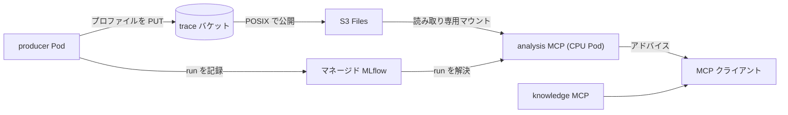
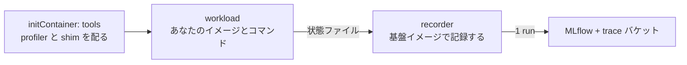

# 解説

## 全体構成

Basic01 から Basic11 で構築した Amazon EKS の土台の上に、GPU のプロファイルを収集し、Model Context Protocol (MCP) 経由で分析する仕組みを動かします。producer が実ワークロードにプロファイル収集を差し込んでバケットに書き、分析 MCP が MLflow で run を解決し、S3 Files マウント越しにプロファイルをその場で読んで、アナライザの結果をテキストで返します。



## これは何をするものか

設計思想と全体像、なぜこの形なのかは別記事「[プロファイリングを楽にしたい](https://zenn.dev/littlemex/articles/8ab01bc40f627a)」で解説済みです。本章はそれを読んだ前提で、実際に手を動かして GPU プロファイルの分析までを通します。予約タグや `volumeHandle` の書式、読み取り専用マウント、digest 固定といった設計上の勘所は、詳細はブログを確認してください。本章では手順の中で必要な箇所に絞って触れます。

本章の開始状態は、クラスタが `terraform apply` 済み (Basic01 から Basic11 相当の `infra/eks` が稼働) で、かつプロファイル基盤のデータ層 (`infra/data-layer`) はまだ適用していない状態です。導入は `infra/scripts/install-profiling.sh` の 1 コマンドで、データ層の適用からクラスタ側の配線、MCP サーバのデプロイまでを行います。プロファイルを撮る側は `infra/eks/bin/kubectl-accelprof` の 1 コマンドで、自分のイメージとコマンドを渡すだけです。

:::message alert
マネージド MLflow と S3 Files は課金リソースです。演習が終わったら本章末尾の後片付けを必ず実施してください。撤去順は必ず `infra/eks` を先、`infra/data-layer` を後にします (EFS ベースのファイルシステムはマウントターゲットが残っていると削除できないため)。
:::

## 裏で何が起きているか

1 コマンドに畳んである部分を、あとから自分の環境に合わせて変えられるように、中で何をしているかを先に押さえます。

### 導入スクリプトのフェーズ

`infra/scripts/install-profiling.sh` は 7 つのフェーズを順に実行します。前提確認、データ層の適用、クラスタ側の配線、イメージの解決、MCP サーバのデプロイ、producer 契約の配布、マウント probe、受け入れ確認です。どのフェーズも冪等か「状態を見てから動く」形なので、途中で失敗しても原因を直して再実行すれば収束します。失敗時に自動でロールバックや destroy はしません。

利用者が渡すのは 3 つだけです。クラスタ名、リージョン、そしてプロファイル収集を許可する namespace のリストです。バケット名やマネージド MLflow の ARN、ServiceAccount 名、S3 Files のマウント先 AZ、イメージの digest はすべてスクリプトが Terraform の出力や AWS API から解決します。特にマウント先 AZ を変数にしていないのは意図的で、S3 Files のマウントは単一 AZ からしか到達できないため、手で渡した値が実体とずれると PersistentVolume が到達不能になります。

### apply の前に必ず plan を分類する

このスクリプトは `terraform apply` を無条件に実行しません。まず plan を作り、変更を 3 つに分類します。1 つ目が「記録の正本」で、trace バケット、MLflow アーティファクトバケット、tracking server、KMS キー、S3 Files のファイルシステムとアクセスポイントです。これらを削除する plan は上書き手段なしで拒否します。作成しようとする plan も拒否します。すでに存在するリソースを作成しようとしているなら、それは state がそのリソースを見失った状態を意味し、そのまま適用すると名前の衝突か、state が把握していないリソースの再設定になるからです。2 つ目が profiling 基盤自身の変更で、これは適用します。3 つ目がそれ以外で、停止して一覧を表示します。長く運用したクラスタには profiling と無関係な差分が溜まるので、それを黙って適用しないための線引きです。基盤だけ収束させたいときは `PROFILING_ONLY=1`、すべて受け入れるときは `ALLOW_UNRELATED=1` を渡します。

### producer Job の中身

プロファイルを撮る Job は 3 つの部分でできています。



initContainer が基盤イメージから profiler と shim を共有ボリュームにコピーします。これがあるので、プロファイルを撮りたいイメージを焼き直す必要がありません。workload コンテナは指定したイメージそのままで、shim が `nsys` で包んで実行し、終了時に状態ファイルを書きます。recorder コンテナは基盤イメージで動き、その状態ファイルを待って、置かれたファイルを読んで MLflow に 1 run 記録します。

記録を別コンテナに分けているのは技術的な理由です。accelprof の依存にはコンパイル済みの拡張が含まれ、特定の Python バージョンに固定されます。学習用のイメージに後から注入すると壊れるため、記録は基盤イメージの側で行い、ワークロードのイメージには何も要求しません。

### ワークロードとの約束はディレクトリ 1 つ

ワークロード側が守るのは `/accelprof/out` というディレクトリだけで、中身はすべて任意です。`metrics.json` に数値の JSON オブジェクトを書けば metrics として記録され、`params.json` と `tags.json` も同様です。`artifacts/` に置いたファイルは run に添付されます。ライブラリの import は不要なので、同じスクリプトをクラスタの外で動かしても、無害なファイルが 1 つできるだけです。壊れた JSON は報告してスキップし、実行そのものは記録します。書き捨てのスクリプトの typo で完走した実験を失うほうが損失が大きいという判断です。

### namespace ごとに配られる契約

導入スクリプトは、許可した namespace のそれぞれに 3 つを配ります。リージョン・trace バケット・tracking server・基盤イメージの digest を持つ ConfigMap、recorder が自分の Pod の状態を読んで自分の Job に注釈を書くための Role、そして記録されずに終わった Job を報告する時間ごとの点検です。プロファイルを撮る人が基盤の値を 1 つも知らなくて済むのは、この ConfigMap があるからです。

### 記録の単位と後片付けの単位

alias は MLflow の experiment 名と S3 の第 1 階層プレフィックスを兼ねます。つまり削除・保持期間・分析側から見える範囲・掃除の単位がすべて alias です。実験キャンペーンごとに 1 つの alias を `テナント名-系列名` の形で付け、キャンペーン内の反復は `workload_id` と自由なパラメータで表します。反復ごとに alias を作ると削除単位が増えていき、キャンペーンを 1 手で片付けられなくなります。

Job そのものは終了から 2 日後に Kubernetes が消します。run の記録は永続で、run_id は recorder が Job の注釈に書き戻すので、Job がある間は `kubectl accelprof get` で引けます。消えたあとは MLflow を alias と `workload_id` で検索します。

### なぜ controller がないか

この基盤には自作の controller がありません。producer Job が自分で記録するので、収束させるべき状態がなく、Job そのものが Kubernetes の提供する controller です。カスタムリソースを作れば得られるものは状態の書き戻しとライフサイクル管理の 2 つですが、前者は Job の注釈への書き込みで、後者は `ttlSecondsAfterFinished` で足ります。カスタムリソースを再検討する条件は、複数の Job を 1 つの単位としてまとめる必要が出たとき、入口が増えて安定した API 面が必要になったとき、別の理由で controller をすでに運用しているときのうち 2 つが揃ったときです。

Pod 内の部品では埋められない穴が 1 つだけ残ります。recorder が走る前に Pod ごと消える場合 (退避やノードの排出) で、これは各 namespace の時間ごとの点検が報告します。

# ワークショップ実施

## 1. 前提を確認する

クラスタ (Basic01 から Basic11 相当) が稼働していること、`infra/eks` の Terraform がリモート state を使っていること、`terraform` と `kubectl` と `helm` と `aws` と `python3` と `curl` が手元にあること、MCP クライアント (Claude Code など) が手元にあることを確認します。リモート state を使っていない場合は先に `infra/eks/scripts/bootstrap-remote-state.sh` を実行します。導入スクリプトは state の場所を `TF_STATE_BUCKET` などで明示できますが、指定しない場合は `infra/eks/backend.hcl` から読むので、この設定が起点になります。

## 2. 基盤を導入する

クラスタ名とリージョン、そしてプロファイル収集を許可する namespace を指定して 1 コマンドを実行します。`PRODUCER_NAMESPACES` はこれから実験を回す namespace の一覧で、そのまま「trace バケットへの書き込みと run の記録を許可した範囲」の宣言になります。ここに書かれていない namespace のワークロードは記録できません。

```bash
cd "$(git rev-parse --show-toplevel)"
export CLUSTER_NAME=distai-eks
export AWS_REGION=us-east-2
export PRODUCER_NAMESPACES=team-a,team-b
./infra/scripts/install-profiling.sh
```

初回はデータ層がまだ無いので、作成を明示的に許可します。誤って 2 つ目のデータ層を作ると基盤が二分されるため、既定では既存の再利用しかしません。

```bash
cd "$(git rev-parse --show-toplevel)"
export CREATE_DATA_LAYER=1
./infra/scripts/install-profiling.sh
```

最後に `acceptance OK` と接続情報が表示されれば導入完了です。何度実行しても同じ結果になるので、namespace を増やしたいときは `PRODUCER_NAMESPACES` を書き換えて再実行します。

:::message
既存クラスタに profiling と無関係な差分が溜まっている場合、スクリプトは一覧を表示して停止します。基盤だけを収束させるなら `PROFILING_ONLY=1` を付けて再実行し、表示された差分もすべて適用してよいなら `ALLOW_UNRELATED=1` を付けます。どちらを選ぶかは、表示された差分が今このタイミングで適用してよいものかどうかで判断します。
:::

## 3. プロファイルを撮る namespace を用意する

導入スクリプトが作るのは Pod Identity の紐付けだけです。紐付けは EKS コントロールプレーン上の `(namespace, ServiceAccount 名)` レコードなので、namespace や ServiceAccount の実在を要求しません。実験を回す側が、自分の namespace に `mcp-producer` ServiceAccount を作ります。

```bash
export NAMESPACE=team-a
k create namespace "$NAMESPACE" --dry-run=client -o yaml | k apply -f -
k create serviceaccount mcp-producer -n "$NAMESPACE" --dry-run=client -o yaml | k apply -f -
```

この ServiceAccount を持つ Pod が、trace バケットへの書き込みと MLflow への記録の権限を得ます。namespace が導入スクリプトの実行時にまだ無かった場合、ConfigMap と Role と点検はその namespace には配られていないので、namespace を作ったあとに導入スクリプトを再実行します。

## 4. プロファイルを撮って記録する

`kubectl-accelprof` を PATH に置くと `kubectl accelprof` として使えます。単一ファイルで自己完結しているので、コピーするだけで動きます。渡すのは alias と自分のイメージと、実行したいコマンドだけです。

```bash
export PATH="$(git rev-parse --show-toplevel)/infra/eks/bin:$PATH"
export NAMESPACE=team-a
export IMAGE=$(aws sts get-caller-identity --query Account --output text).dkr.ecr.$AWS_REGION.amazonaws.com/accelprof:v1-nsys
kubectl accelprof run --alias teama-attn-sweep --namespace "$NAMESPACE" --image "$IMAGE" \
  --param seq_len=4096 --tag variant=flash \
  -- bash -lc 'python3 -c "print(sum(range(10**6)))"'
```

ここでは基盤のイメージをそのまま使っていますが、実際には自分の学習イメージを渡します。イメージに `nsys` が入っていない場合でも、initContainer が profiler を配るのでそのまま動きます。

投入は数秒で返り、`workload_id` が表示されます。記録はクラスタの中で完結するので、手元のターミナルを占有しません。長時間の学習でも投入したら閉じてよく、あとから結果を引きます。

```bash
kubectl accelprof get "$WORKLOAD_ID" -n "$NAMESPACE"
kubectl accelprof runs --alias teama-attn-sweep -n "$NAMESPACE"
```

`run_id` が表示されたら記録が完了しています。metrics を残したい場合は、自分の学習スクリプトの最後にファイルを 1 つ書きます。accelprof の import は不要です。

```python
import json
json.dump({"tokens_per_sec": tps, "loss": loss}, open("/accelprof/out/metrics.json", "w"))
```

GPU を使うときは `--gpu 4` のように指定すると、リソース要求と GPU プールの toleration が付きます。プロファイルを撮らない実行は `--profile none` で、これも記録されるので同じ実験の中にベースラインとして並びます。flag に無い指定 (追加ボリューム、affinity、pull secret など) は `--patch` で任意のマニフェスト片を渡せます。

## 5. 分析する

`mcp-host` は各 MCP エントリ名の Service を `mcp` 名前空間に作る (ポート 8080) ので、それぞれ port-forward して MCP クライアントから接続します。

```bash
k port-forward svc/knowledge -n mcp 8081:8080 &
k port-forward svc/analysis  -n mcp 8080:8080 &
```

analysis MCP に先ほどの `run_id` を渡し、`stage_run` で成果物を読める状態にしてから `analyze` を走らせます。`analyze(run_id, "nsys-stats")` は S3 Files 上の `.nsys-rep` を読んで実測サマリを返します (下は検証で取った小さなトレースの抜粋)。

```text
 ** OS Runtime Summary (osrt_sum):
 Time (%)  Total Time (ns)  Num Calls  ...  Name
 --------  ---------------  ---------  ...  ------------------
     57.4           355561         42  ...  stat64
```

この出力は「どこに時間が溶けているか」という事実です。次の一手は knowledge MCP から得ます。症状を `search_knowledge` に投げると、関連する playbook がランク付きで返ります。

```jsonc
// search_knowledge("memory bound but occupancy is high", chip="gpu")
{ "count": 2, "results": [
  { "id": "gpu/roofline", "score": 12.0, "title": "Roofline diagnosis …" },
  { "id": "gpu/memory-and-fusion", "score": 7.0, "title": "…" } ]}
```

上位に出た `get_topic("gpu/roofline")` を開くと、症状から原因、確認点、次の一手までが読めます。analysis MCP が返した事実 (どこが遅いか) と、knowledge MCP が返した指針 (次に何を変えるか) を突き合わせて次の実験を決める、というのが本基盤の使い方です。

## 6. 自分の環境に合わせて変えるときに触る場所

導入したあとに変えたくなる箇所と、その持ち主を整理します。

| 変えたいこと | 触る場所 |
| --- | --- |
| プロファイル収集を許可する namespace | `PRODUCER_NAMESPACES` を書き換えて導入スクリプトを再実行します。リストが唯一の宣言なので、外した namespace の紐付けは取り消されます |
| profiler のオプション | 実行ごとに `--nsys-args` で上書きします。既定値を変えるなら クライアント `infra/eks/bin/kubectl-accelprof` に埋め込まれた Job の環境変数です |
| Job の形 (ボリューム、affinity、サイドカー) | 実行ごとなら `--patch` です。恒久的に変えるならクライアントに埋め込まれた Job を直し、`infra/eks/tests/run-render-tests.sh --update` で golden マニフェストを更新します。埋め込みにしているのは、クライアントを PATH にコピーしても動くようにするためです |
| 撮る rank | 既定は rank0 のみです。`--profile-ranks 0,3,7` または `all` を指定します。1 rank だけを見るのはサンプリングであって代表値ではないため、遅い rank を探す実験では明示的に広げます |
| profiler や記録の実装そのもの | `infra/eks/images/accelprof/entry.sh` と `recorder.py` です。基盤イメージに焼き込んであるので、変更後は `infra/eks/scripts/build-profiling-images.sh` で焼き直してから導入スクリプトを再実行します |
| Job を残す期間 | `--ttl` です。短くすると `kubectl accelprof get` で run_id を引ける期間も短くなります。恒久的な照会は MLflow 側です |
| 記録のスキーマ (metrics の意味づけなど) | accelprof パッケージ側です。記録 API とファイル契約の仕様はライブラリの持ち物で、いつどこで呼ぶかが基盤の持ち物という切り分けです |

## 7. 後片付け

課金を止めるため、`mcp-host` のリリースを削除し、Terraform のトグルを戻します。データ層は `terraform destroy` ではなく、トグルを `false` にした `terraform apply` で畳みます。trace バケットと MLflow アーティファクトのバケットには「記録の正本」を守るために `prevent_destroy` が付いており、`terraform destroy` は plan 段階でこのバケット破棄を検出して操作全体を中断してしまうため、tracking server や S3 Files ファイルシステムまで実際には消えないからです。トグルを false にした apply なら、バケット (と中の記録) は残したまま、tracking server と S3 Files ファイルシステムだけを破棄できます。

producer Job は終了から 2 日で Kubernetes が消すので、手で消す必要はありません。まず `mcp-host` を削除し、実験を回した namespace に作った `mcp-producer` ServiceAccount を掃除します。次に `infra/eks` 側のマウントと mcp-reader を無効化します。`mcp_producer_role_arn` を渡さないと既定の空になり、producer の Pod Identity 紐付けも破棄されます。最後にデータ層のトグルを false にして apply します (destroy ではありません)。

```bash
export NAMESPACE=team-a
helm uninstall mcp -n mcp
k delete serviceaccount mcp-producer -n "$NAMESPACE" --ignore-not-found
cd "$(git rev-parse --show-toplevel)"/infra/eks
terraform apply -var s3files_enabled=false -var analysis_mcp_enabled=false
cd "$(git rev-parse --show-toplevel)"/infra/data-layer
terraform apply -var s3files_enabled=false -var mlflow_enabled=false
```

:::message alert
しばらく使わないだけなら、データ層のトグルを倒すのではなく tracking server を停止します。トグルを false にする操作は tracking server と run の記録そのものを破棄しますが、停止なら状態は保持されたまま課金だけが止まります。
:::

```bash
aws sagemaker stop-mlflow-tracking-server --tracking-server-name "$TRACKING_SERVER_NAME" --region "$AWS_REGION"
```

# まとめ

本章では、基盤の導入からプロファイルの記録、そして分析 MCP と knowledge MCP を使った分析までを、実機で一通り動かしました。導入は 1 コマンド、プロファイルを撮るのも 1 コマンドで、どちらもバケット名やマネージド MLflow の ARN を人が運ぶ必要はありません。日々の実験では、自分のイメージとコマンドを渡すだけでプロファイルが記録され、以降は MCP 経由で分析と次の一手の提示を受け取れます。設計思想の全体像は冒頭のブログにまとめてあります。

# 参考資料

- [プロファイリングを楽にしたい](https://zenn.dev/littlemex/articles/8ab01bc40f627a) - 本基盤の設計思想を解説したブログ
- [littlemex/distributed-ai](https://github.com/littlemex/distributed-ai) - `infra/scripts/install-profiling.sh` と `infra/eks/bin/kubectl-accelprof`、`infra/data-layer` と `infra/eks`、`mcp-host` チャートの実装
- [accelprof](https://pypi.org/project/accelprof/) / [accelprof-knowledge](https://pypi.org/project/accelprof-knowledge/) - 分析 MCP と知識 MCP の pip パッケージ
- [Amazon S3 Files (EFS ユーザーガイド)](https://docs.aws.amazon.com/efs/latest/ug/s3-file-systems.html) - S3 Files の公式ドキュメント
