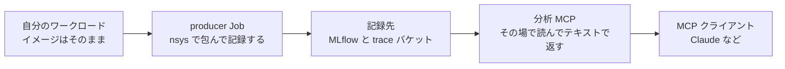
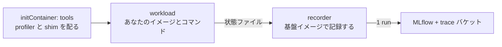

GitHub Tag: [release/eks-distributed-ai/v0.2.0](https://github.com/littlemex/distributed-ai/tree/release/eks-distributed-ai/v0.2.0)

# 解説

## この章のゴールを先に決める

やりたいのは、自分の学習ジョブをいつもどおり 1 コマンドで走らせるだけでプロファイルが記録され、その結果を Claude に読ませて「次に何を変えるか」まで持っていくことです。

そのために必要なものは 3 つあります。記録を受ける場所、プロファイルを取る仕組み、取れたものを読んで答える口です。取る仕組みは producer Job で、自分のイメージの外側から profiler を注入して包むので、プロファイルを取るためにイメージを作り直さずに済みます。読んで答える口が MCP サーバで、トレースをクラスタ側で読むので手元にはテキストしか来ません。



依存は一方向です。記録先が無ければ producer は書き込めず、producer が書いていなければ分析は読めないので、導入も記録先から始まります。この順序は導入スクリプト 1 本が持っているので、読者が並べる必要はありません。

本章は手を動かして分析まで通すことを目的にしているので、実行の判断に必要な理由だけを扱います。なぜこの設計なのかという背景まで知りたい場合は、別記事「[プロファイリングを楽にしたい](https://zenn.dev/littlemex/articles/8ab01bc40f627a)」を補足として読んでください。

本章の開始状態は、クラスタが `terraform apply` 済み (Basic01 から Basic11 まで進めた `infra/eks` が稼働中) で、プロファイル基盤のデータ層 (`infra/data-layer`) はまだ適用していない状態です。

:::message alert
マネージド MLflow と S3 Files は課金リソースです。演習が終わったら本章末尾の後片付けを必ず実施してください。EFS ベースのファイルシステムはマウントターゲットが残っていると削除できないため、撤去順は必ず `infra/eks` を先、`infra/data-layer` を後にします。
:::

## 導入スクリプトが順序を持っている

導入は [`infra/scripts/install-profiling.sh`](https://github.com/littlemex/distributed-ai/blob/main/infra/scripts/install-profiling.sh) の 1 コマンドです。前節の依存関係がそのままフェーズの順序になっています。

- Phase 1: 前提を確認する
- Phase 2: データ層を適用する (記録先を作る)
- Phase 3: クラスタ側を配線する (S3 Files のマウント、`mcp` namespace、Pod Identity、ECR)
- Phase 4: イメージを解決する
- Phase 5 と 5b: MCP サーバをデプロイし、各 namespace に契約を配る
- Phase 6: マウントを確認する
- Phase 7: 受け入れを確認する

利用者が渡すのは、プロファイル収集を許可する namespace のリストと、記録先をどう選ぶかだけです (具体的な変数は手順 3 で挙げます)。クラスタ名とリージョンは手順 2 で解決した値を使い、バケット名、MLflow の ARN、ServiceAccount 名、S3 Files のマウント先 AZ、イメージの digest は、すべてスクリプトが Terraform の出力や AWS API から解決します。どのフェーズも冪等か「状態を見てから動く」形なので、途中で失敗しても原因を直して再実行すれば正しい状態になります。失敗しても自動でロールバックや destroy はしません。

::::details マウント先 AZ を渡せない理由と、plan を 4 つに分類する理由を説明します

マウント先 AZ を渡せないのは意図的です。この実装は S3 Files の mount target を 1 つの subnet にだけ作り、そのマウントはその AZ からしか到達できないので、手で渡した値が実体とずれると PersistentVolume の nodeAffinity が到達不能なノードを指します。

このスクリプトは `terraform apply` を無条件には実行しません。plan を作って変更を 4 つに分類し、消してはいけない記録の削除は上書き手段なしで拒否します。対象は trace バケット、MLflow アーティファクトバケット、SageMaker MLflow 本体、KMS キー、S3 Files のファイルシステムとアクセスポイント、そしてそれらのバージョニング・ライフサイクル・暗号化の設定です。設定まで含めているのは、保持期間や暗号化の変更だけでも記録済みのものを失い得るからです。置き換えも削除を含むので同じ扱いです。同じリソースへの**変更**は 2 つ目の分類で、`ALLOW_RECORD_UPDATES=1` を渡さない限り停止します。3 つ目が profiling 基盤自身の変更で、これは適用します。4 つ目がそれ以外で、停止して一覧を表示します。長く運用したクラスタには無関係な差分が溜まるので、それを確認なしに適用しないための線引きです。

一方で作成は拒否しません。plan は「state に一度も無かった」と「state が見失った」を区別できず、初回導入と失敗した導入の再開が同じ形で現れるためです。主要な記録リソースは state が見失っていても plan の前に import して取り込むので、作成としては現れません。

::::

## producer Job がワークロードを包む

プロファイルを取得する Job は 3 つの部分でできています。



initContainer が基盤イメージから profiler と shim を共有ボリュームにコピーします。これがあるので、プロファイルを取得したいイメージを再ビルドする必要がありません。workload コンテナは指定したイメージそのままで、shim が `nsys` で包んで実行し、終了時に状態ファイルを書きます。recorder コンテナは基盤イメージで動き、その状態ファイルを待って、置かれたファイルを読んで MLflow に 1 run 記録します。

記録を別コンテナに分けているのは、accelprof の依存にコンパイル済みの拡張が含まれ、特定の Python バージョンに固定されるからです。学習用のイメージに後から注入すると壊れるため、記録は基盤イメージの側で行い、ワークロードのイメージには Python も accelprof も要求しません。

ワークロード側が守るのは `/accelprof/out` というディレクトリ 1 つだけです。`metrics.json` に数値の JSON オブジェクトを書けば metrics として記録され、`params.json` と `tags.json` も同じ形式で記録されます。`artifacts/` に置いたファイルは run に添付されます。同じディレクトリの `traces/` と `status.json` は基盤が使う場所なので、ここには書かないでください。ライブラリの import は不要です。

::::details 壊れた JSON を無視する理由と、controller を作っていない理由を説明します

壊れた JSON は報告してスキップし、実行そのものは記録します。書き捨てのスクリプトの typo で完走した実験を失うほうが損失が大きいという判断です。

この基盤には自作の controller がありません。producer Job が自分で記録するので収束させるべき状態がなく、Job そのものが Kubernetes の提供する controller です。カスタムリソースで得られる状態の書き戻しとライフサイクル管理は、それぞれ Job のアノテーションと `ttlSecondsAfterFinished` で足ります。Pod 内の部品では埋められない穴は、recorder が走る前に Pod ごと消える場合 (追い出しやノードの drain) だけで、これは各 namespace に配られる点検 CronJob が 1 時間ごとに報告します。

::::

# ワークショップ実施

## 1. 前提を確認する

本章は基盤リポジトリのリリース `release/eks-distributed-ai/v0.2.0` を前提にしています。本文のコマンドと出力例はこのバージョンで実機確認したものです。別のバージョンでは変数名やフラグが変わることがあるので、まずはこのタグで通してください。

必要なものは 4 つです。

- クラスタ (Basic01 から Basic11 相当) が稼働していること
- `infra/eks` の Terraform がリモート state を使っていること
- `terraform` と `kubectl` と `helm` と `aws` と `python3` と `git` と `curl` が手元にあること
- MCP クライアント。本章は Claude Code の `claude` コマンドで進めるので、`claude --version` が通り、認証済みであること

`claude` が未認証のままだと、手順 8 のコマンドは MCP に触れる前に認証を求めて止まります。先に `claude` を一度起動して認証を済ませてください。

`aws` は SageMaker MLflow app と S3 Files を知っているバージョンが必要です。`aws sagemaker list-mlflow-apps help` が通らない場合は先に更新してください。古いままだと、導入スクリプトが権限エラーのような見た目で止まります。

::::details state の場所をスクリプトがどう知るかを説明します

リモート state は Basic01 の [`distai-up.sh`](https://github.com/littlemex/distributed-ai/blob/main/infra/scripts/distai-up.sh) が作り、その場所はレジストリに記録されています。手順 2 の 4 行がレジストリから `infra/eks/backend.hcl` を書き出すので、導入スクリプトはそれを読んで解決します。チェックアウトの外から実行する場合や、fresh clone で `backend.hcl` が無い場合は、`TF_STATE_BUCKET` と `TF_STATE_KEY` と `TF_STATE_REGION` を明示的に渡します。値は Basic01 で作った state の場所で、`aws ssm get-parameters-by-path --path /distai/v1/clusters/$CLUSTER_NAME/state` でも読めます。

::::

## 2. プロファイルを取得する namespace を用意する

次の手順で導入するとき、スクリプトは許可した namespace のそれぞれに 4 つを配ります。ConfigMap (リージョン・trace バケット・MLflow の ARN と UI の URL・基盤イメージの digest)、recorder 用の Role、その RoleBinding、そして記録されずに終わった Job を 1 時間ごとに報告する点検 CronJob です。プロファイルを取る人が基盤の値を 1 つも知らずに済むのは、この ConfigMap があるからです。

配れる先は実在する namespace だけなので、namespace は導入より先に作ります。Pod Identity の紐付けだけは EKS コントロールプレーン上の `(namespace, ServiceAccount 名)` レコードなので実在を要求せず、先に作られても待っていられますが、ConfigMap と Role が無い namespace ではプロファイルを取れません。

本章は作業 namespace が `distai` ではなく `team-a` なので、Basic01 手順 2 の 4 行を `DISTAI_NAMESPACE` 付きで実行し直します。こうすると `k` と後述のプラグインの既定がこの namespace になり、以降のコマンドに `-n` を書かずに済みます。

```bash
cd ~/distributed-ai-v0.2.0
export DISTAI_NAMESPACE=team-a
source infra/scripts/distai-env.sh
```

`CLUSTER_NAME` と `AWS_REGION` はここで書き直しません。Basic01 手順 2 で設定した値がそのまま対象クラスタを決めます。新しいターミナルで始めた場合は、Basic01 手順 2 の 4 行をその 2 つの export ごと実行してから戻ってください。未設定のまま `source` すると `distai-env.sh` がその場で停止します。

```bash
for ns in team-a team-b; do
  k create namespace "$ns" --dry-run=client -o yaml | k apply -f -
  k create serviceaccount mcp-producer -n "$ns" --dry-run=client -o yaml | k apply -f -
done
```

ここでは 2 つのテナントを想定して `team-a` と `team-b` を作り、以降の手順は `team-a` で進めます。ServiceAccount 名 `mcp-producer` は Pod Identity の紐付けが参照する固定値なので、変えられません。この ServiceAccount を持つ Pod が、trace バケットへの書き込みと MLflow への記録の権限を得ます。

:::message
共有 namespace で使う場合は、配られる Role の範囲を先に把握してください。Kubernetes の RBAC はリソース名を絞らない限り種類単位なので、この Role はその namespace の Pod の参照と Job の参照・更新ができます。recorder が自分の Pod の状態を読み、Job に run id を書くために必要な範囲です。
:::

## 3. 基盤を導入する

この手順のゴールは、記録先とクラスタ側の配線と MCP サーバを一度に立てることです。渡す値は 4 つで、うち 2 つは初回だけです。

渡す 1 つ目が `PRODUCER_NAMESPACES` で、プロファイル収集を許可する namespace の一覧です。これがそのまま「trace バケットへの書き込みと run の記録を許可した範囲」の宣言になり、ここに無い namespace のワークロードは記録できません。

2 つ目が `DATA_LAYER_NAME` で、記録側の一式 (trace バケット、MLflow、S3 Files) に付ける名前です。データ層はクラスタごとに 1 つ立てる必要がなく、複数のクラスタで記録を共有できるので、どれに記録するのかを名前で指す必要があります。名前は state のキーとバケット名の接頭辞になるので、既に別のデータ層がある環境では必ず別名にしてください。3 つ目の `CREATE_DATA_LAYER=1` はその新規作成を明示的に許可するもので、既定では既存のデータ層の再利用しかしません。誤って 2 つ目を作ると記録が二分されるからです。導入が成功するとこのデータ層がクラスタに紐づいたことがレジストリに記録されるので、この 2 つは 2 回目以降は要りません。

4 つ目が `MLFLOW_BACKEND` で、**これだけはあとから変更できません**。`app` は serverless で、止めるという概念がなく、使っていない期間はバケット以外の課金要素を持ちません。`server` は managed な tracking server で、起動している時間だけ課金され、停止すれば課金は止まって記録は残ります。既定は `app` です。変更できないのは、記録先の MLflow を切り替える plan が「いまの MLflow を破棄して空のものを作る」plan になり、run のメタデータがまとめて消えるからです。導入スクリプトは既存のデータ層が記録している側を優先し、違う側を要求されたら停止します。

クラスタ名とリージョンは渡しません。手順 2 で解決した値を使います。章ごとに書いた名前が Basic01 で解決した値を上書きすると、別のクラスタを対象にしてしまうためです。

```bash
export PRODUCER_NAMESPACES=team-a,team-b
export DATA_LAYER_NAME=profiling
export CREATE_DATA_LAYER=1
export MLFLOW_BACKEND=app
DEV_BUILD=1 ./infra/scripts/install-profiling.sh
```

`DEV_BUILD=1` は初回だけ必要です。基盤イメージは自分の ECR から digest で引く作りなので、まだ何も無い状態では `no analysis image digest available` で止まります。このビルドは Basic02 で触れたクラスタ内 image builder (`image_builder_enabled = true`) を使うので、無効なクラスタでは先に有効化するか、既知の digest を `ANALYSIS_DIGEST` で渡します。2 回目以降は付けなくてよく、既にあるイメージを digest で使います。

初回は全体で 20〜40 分程度かかります。長いのはデータ層の apply と、クラスタ内での 2 つのイメージのビルドです。`Phase N/7` の行が進んでいれば正常なので、terraform やビルドの出力が流れている間は待ちます。最後に `acceptance OK` と接続情報が表示されれば導入完了です。

手順 2 で `team-a` を既定にした状態は、導入後もそのまま使えます。スクリプトはクラスタに触るために自分専用の kubeconfig を作って終了時に捨てるので、呼び出し元の context は動きません。

:::message
既存クラスタに profiling と無関係な差分が溜まっている場合、スクリプトは一覧を表示して停止します。基盤だけを収束させるなら `PROFILING_ONLY=1` を付けて再実行し、表示された差分もすべて適用してよいなら `ALLOW_UNRELATED=1` を付けます。どちらを選ぶかは、表示された差分が今このタイミングで適用してよいものかどうかで判断します。判断できない差分を `ALLOW_UNRELATED=1` で押し通すと、profiling とは関係のない構成変更 (アドオンのバージョン更新など) が同時に走ります。
:::

2 回目以降は `CREATE_DATA_LAYER` を外して同じコマンドを実行します。何度実行しても同じ結果になるので、あとから namespace を増やすときは、その namespace と ServiceAccount を作ってから `PRODUCER_NAMESPACES` に追記して再実行します。

::::details app と server の権限差、データ層を複数持つ場合、既定値を捨てた理由を説明します

種類によって 1 つだけ機能差があります。tracking server は「記録はできるが削除はできない」という粒度の IAM を書けますが、app のデータプレーンは `sagemaker:CallMlflowAppApi` という 1 つのアクションが REST API 全体を覆うため、MLflow を読めるロールは同時に削除もできてしまいます。分析側の reader はこれを受け入れる必要がありますが、削除を仕事にする janitor には app では MLflow の権限を一切与えていません。そのため app では孤児 trace の自動回収が働かず、保持はバケットのライフサイクルルールに委ねられます。

1 つのクラスタに複数のデータ層を紐づけることもできます。テナントごとに分けたい場合や保持期間を変えたい場合で、`infra/scripts/distai-attach-data-layer.sh -c "$CLUSTER_NAME" --list` で現在の一覧と既定を確認できます。複数のクラスタで記録を共有するなら、2 つ目以降のクラスタでは同じ名前を渡して `CREATE_DATA_LAYER` は付けません。

`DATA_LAYER_NAME` に既定値を持たせていないのは事故の結果です。以前は `mcp` という既定があり、それが別リージョンのデータ層を警告なしに指して、消してはいけない記録を取り違える寸前まで進みました。いまは未指定ならレジストリに記録された既定を読み、それも無ければ明示するよう停止します。

::::

## 4. プロファイルを取得して記録する

必要なのはプラグイン 2 本で、どちらも 1 ファイルです。`kubectl` は PATH 上の `kubectl-<名前>` を `kubectl <名前>` として呼べるようにします。プロファイルを取得するのが `kubectl accelprof`、手順 8 で MCP に繋ぐのが `kubectl distai-mcp` です。

ここまでの章を進めてきた読者はチェックアウトを持っているので、その中のプラグインを PATH に通すだけで済みます。

```bash
export PATH="$(git rev-parse --show-toplevel)/infra/eks/bin:$PATH"
kubectl accelprof --help >/dev/null && kubectl distai-mcp --help >/dev/null && echo "plugin ok"
```

以前この本を読んで `~/.local/bin` などにプラグインを置いた場合は、そちらが PATH で先に来ていないか確かめてください。古い版が先に見つかると、この章の後半で `unknown subcommand` になります。`kubectl plugin list` でどのファイルが選ばれるかが分かります。

チェックアウトを持たない人 (プロファイルを取得するだけで基盤は触らない人) 向けの経路も 1 行あります。リポジトリを固定タグで `~/distributed-ai-v0.2.0` に取得し、プラグインを `~/.local/bin` に置きます。この経路も冒頭で `git`、`terraform`、`kubectl`、`helm`、`aws`、`python3`、`curl` の存在を確認し、欠けていればそこで止まります。プラグインの設置だけが目的でも `terraform` と `helm` は入れておいてください。

::::details チェックアウトを持たない人がプラグインだけ取る方法を説明します

プラグインだけ欲しい人は、リポジトリを clone せずに 1 行で取れます。取得スクリプトは導入スクリプトと前提チェックを共有しているので、`terraform` と `helm` も PATH にある必要があります。`PRODUCER_NAMESPACES` に自分が使う namespace を渡すと、その namespace に配られた ConfigMap を読んでプラグインを置きます。

```bash
export CLUSTER_NAME=distai-eks
export AWS_REGION=us-east-2
export PRODUCER_NAMESPACES=team-a,team-b
curl -fsSL https://raw.githubusercontent.com/littlemex/distributed-ai/refs/tags/release/eks-distributed-ai/v0.2.0/infra/scripts/get-profiling.sh | bash
```

クラスタ名とリージョンは自分の値に読み替えます。導入した本人がこれを打つ場合は、`PRODUCER_NAMESPACES` を上書きしたまま導入スクリプトを再実行しないでください。リストから外れた namespace の Pod Identity の紐付けが取り消されます。

::::

渡すのは alias と自分のイメージと、実行したいコマンドだけです。まずは基盤イメージ自身を workload として 1 本流し、経路が通っていることを確認します。イメージの URI は namespace に配られた ConfigMap から引けるので、レジストリやタグを手動で組み立てる必要はありません。

```bash
export IMAGE=$(k get configmap accelprof-config -o jsonpath='{.data.ACCELPROF_PLATFORM_IMAGE}')
kubectl accelprof run --alias teama-smoke --image "$IMAGE" --wait \
  --param steps=1 --tag phase=smoke \
  -- bash -lc 'python3 -c "print(sum(range(10**6)))"'
```

指定はこれだけです。プロファイラは既定で動き、トレースまで残るので、この 1 本で投入から記録までの経路が通っていることを確認できます。

`--wait` は**数分以上かかる run には付けません**。投入したら手元のターミナルは閉じてよく、記録はクラスタの中で完結します。ここで付けているのは、この 1 本の計算が数秒で終わり、`run_id` まで 1 コマンドで確認できるからです。初回はノードの確保とイメージの pull が先に走るので、待ち自体は数分になります。

::::details 待っている間に表示が変わらないときにどこを見るかを説明します

投入時に出た `logs:` の行のコマンドか `k get pods` で `Init:` や `ContainerCreating` を見れば、pull 中であることが分かります。基盤イメージには `nsys` が入っているので、この 1 本に限っては `--no-inject-nsys` を足して注入を省くこともできます (省いても結果は同じで、共有ボリュームへのコピーが減るだけです)。

::::

`--wait` を付けずに投入した run は、あとから状態と `run_id` を引きます。

```bash
kubectl accelprof get --last --alias teama-smoke
```

引数を省いた `kubectl accelprof get` でも同じですが、その意味は「この namespace で最も新しい run」なので、複数人が同じ namespace を共有している環境では他人の run を使用します。`--alias` を付けておけば自分のキャンペーンの中で最新を指します。どの run を見ているかは出力の 1 行目に必ず表示されます。

キャンペーンに何が残っているかは一覧で見ます。

```bash
kubectl accelprof runs --alias teama-smoke
```

```text
WORKLOAD-ID                ALIAS         RUN-ID                             COMPLETIONS   FAILED   AGE
wl-260830052358-d267ef09   teama-smoke   0a1638331a7d4a40b003134254a062e4   1             <none>   2026-08-29T20:24:02Z
```

左端の `WORKLOAD-ID` が run を名前で指すときの値です。あとから新しい run を投入しても同じ 1 本を見続けたい場合は、いま最新のものを変数に取っておきます。値だけを出す `-o id` があるので、一覧から手で書き写す必要はありません。

```bash
export WORKLOAD_ID=$(kubectl accelprof get --last --alias teama-smoke -o id)
kubectl accelprof get "$WORKLOAD_ID"
```

`workload_id` を自分で打つ場面はもう 1 つあります。同じ秒に 2 本以上を投入すると「最も新しい」が決まらないので、`get` は候補を並べ、それぞれを名前で指すコマンドをそのまま表示して停止します。表示されたものをそのまま実行すれば済みます。

`run_id` を次の手順にそのまま渡したい場合は、値だけを取り出せます。

```bash
export RUN_ID=$(kubectl accelprof get --last --alias teama-smoke -o run-id)
```

`run_id` が表示されたら記録が完了しています。metrics を残したい場合は、自分の学習スクリプトの最後にファイルを 1 つ書きます。accelprof の import は不要です。

```python
import json
json.dump({"tokens_per_sec": tps, "loss": loss}, open("/accelprof/out/metrics.json", "w"))
```

失敗した実行も既定では記録され、`status=failed` と終了理由が残ります。遅い実行や落ちる実行こそプロファイルする価値があるという判断です。記録が不要だと分かっている試行だけ `--discard-on-fail` を付けます。

## 5. nsys がどう起動され、何が取れているか

shim (`infra/eks/images/accelprof/entry.sh`) が実行しているのは、次の 1 行です。

```text
nsys profile -t cuda,nvtx,osrt -o /accelprof/out/traces/rank-<index> --force-overwrite true <あなたのコマンド>
```

`-t` で指定した 3 系統が収集対象です。`cuda` は CUDA API の呼び出しと GPU 上のカーネル実行やメモリ転送で、CUPTI 経由で収集されます。`nvtx` はコード側で付けた NVTX の区間とマーカーなので、付けていなければ何も出ません。`osrt` はファイル I/O や同期などの OS ランタイム呼び出しです。この既定で取得したトレースを `nsys-stats` にかけると、NVTX Range Summary、OS Runtime Summary、CUDA API Summary、CUDA GPU Kernel Summary の 4 つが返ります。以下の実測値は `nsys` 2026.4.1、NVIDIA ドライバ 580.178.04、ワークロード側の CUDA 12.4 でのものです。自分の環境のバージョンは `nsys --version` で確かめてください。

取れないものも 1 つだけ押さえておきます。カーネル単位の詳細 (occupancy の内訳、命令ミックス、メモリ階層のヒット率) は nsys の対象外で、Nsight Compute (`ncu`) が扱う範囲です。nsys で支配的なカーネルを特定し、そのカーネルを `ncu` で深掘りするのが定石です。

::::details ハードウェアメトリクスと NCCL について補足します

GPU のハードウェアメトリクス (SM の稼働率、Tensor Core の利用率、DRAM 帯域) は既定では含まれません。`--gpu-metrics-devices` の指定が必要で、さらに NVIDIA ドライバの性能カウンタ制限に触れるため、ノード側の設定か追加の権限が要ります。本基盤ではこの経路は未検証です。

NCCL の通信は集合通信カーネルとしてカーネルの列には現れますが、どの集合操作がどのメッセージサイズで走ったかという意味づけは既定では付きません。

::::

タイムラインを目で見たい場合は、`artifacts_uri` の `.nsys-rep` を手元に落として Nsight Systems の GUI で開きます。分析 MCP の `nsys-stats` はテキストの集計であり、タイムラインの目視を置き換えるものではありません。

## 6. 自分のワークロードで取得する

ここからが実務です。自分の学習イメージで取得するときに考えることを順に挙げます。

イメージに要求するのは、注入された shim と `nsys` が動くことだけです。shim は POSIX shell スクリプトなのでシェルを持たないイメージは使えず、`nsys` はワークロード側で実行されるので x86-64 の glibc ベースであることも実質的な前提です。本番の学習を流す前に、自分のイメージで数十秒の軽いコマンドを 1 本流し、`profiled=true` の run が記録されることを確かめてください。詰まったときに読むのは workload コンテナのログです。

::::details イメージ互換で詰まったときにどこを見るかを説明します

shim が要求する基本コマンドは `/bin/sh` と `mkdir`、`date`、`cat`、`tr` です。検証では `nsys` を含まない `pytorch/pytorch:2.5.1-cuda12.4-cudnn9-runtime` をそのまま渡し、注入された `nsys` が動いて CUDA カーネルまでトレースに入ることを確認しました。

CUDA のトレースは CUPTI 経由なので、注入される `nsys` がワークロードの CUDA やノードのドライバに対して古すぎると、トレースが欠けるか収集に失敗します。`nsys` は起動時の警告と収集の進行 (`Collecting data...`、区間を絞ったときは `Capture range started in the application.`) を workload コンテナのログに出すので、`kubectl logs -n <namespace> job/<job 名> -c workload` を読めば、トレースが取れているのか何も記録せず通過したのかが分かります。

注入されたツリーの実体は `/accelprof/tools/nsys/target-linux-x64/nsys` にあります。イメージに適切な `nsys` が既に入っているなら `--no-inject-nsys` で注入を省略して、バージョンの変数を 1 つ減らせます。

::::

次が取得する区間です。`nsys` はイベントを記録し続けるので、トレースのサイズと後処理の時間はカーネル起動数と API 呼び出し数にほぼ比例して増えます。数時間の学習を頭から終わりまで取得すると、`.nsys-rep` が扱いにくいサイズになり、初期化やデータローダの立ち上げやチェックポイント保存が混ざって、見たい定常状態が埋もれます。診断に必要なのは定常状態の数十から数百イテレーションなので、そこだけを取得するのが基本です。絞り方は 3 段階あります。

| 方法 | やること | 向き |
| --- | --- | --- |
| `--delay` と `--duration` | コード変更なしで、開始を遅らせて指定秒数で打ち切る | まず 1 本取得してみるとき |
| NVTX の区間 | `torch.cuda.nvtx.range_push` と `range_pop` をイテレーションに仕込む | 集計とタイムラインをイテレーション境界で読みたいとき |
| `--capture-range=cudaProfilerApi` | `torch.cuda.profiler.start()` と `stop()` で挟んだ区間だけ記録する | 同じ区間を繰り返し比較するとき |

profiler のオプションは `--nsys-args` で渡しますが、これは既定値への追加ではなく全置換です。`-t` を含めて必要なものを自分で並べる必要があります。

以降のコマンドで使うイメージを変数に入れます。自分の学習イメージがあるならその URI に置き換えてください。ここでは手元に用意がなくても進められるように、AWS が公開している PyTorch のイメージを使います。

```bash
export TRAIN_IMAGE=763104351884.dkr.ecr.$AWS_REGION.amazonaws.com/pytorch-training:2.10.0-gpu-py313-cu130-ubuntu22.04-ec2
```

学習スクリプトの代わりに、bf16 の 4096 角行列積を 300 回回すだけのコマンドを流します。ウォームアップ 20 回のあとに `torch.cuda.profiler.start()` を呼び、各反復を NVTX で囲み、最後に `stop()` を呼んで、スループットを `metrics.json` に書きます。区間を絞る指定 (`--capture-range=cudaProfilerApi`) が効くのはこの `start()` と `stop()` があるからで、呼んでいないスクリプトに同じ指定をすると区間が始まらないまま何も記録されません。

```bash
kubectl accelprof run --alias teama-gpu-nsys \
  --image "$TRAIN_IMAGE" --gpu 1 \
  --nsys-args '-t cuda,nvtx --capture-range=cudaProfilerApi --capture-range-end=stop' \
  -- python3 -c '
import json, time, torch
a = torch.randn(4096, 4096, device="cuda", dtype=torch.bfloat16)
b = torch.randn(4096, 4096, device="cuda", dtype=torch.bfloat16)
for _ in range(20):
    a @ b
torch.cuda.synchronize()
torch.cuda.profiler.start()
t0 = time.perf_counter()
for _ in range(300):
    torch.cuda.nvtx.range_push("step")
    a @ b
    torch.cuda.nvtx.range_pop()
torch.cuda.synchronize()
el = time.perf_counter() - t0
torch.cuda.profiler.stop()
tf = 300 * 2 * 4096 ** 3 / el / 1e12
json.dump({"tflops": tf, "elapsed_s": el}, open("/accelprof/out/metrics.json", "w"))
print("tflops=%.1f elapsed=%.3f" % (tf, el))
'
```

GPU ノードの確保とイメージの pull が入るので、初回は 5 分前後かかります。完了すると workload のログの末尾に `tflops=62.3 elapsed=0.662` のような行が出ます。

オーバーヘッドは推測せず測ります。`--profile none` はプロファイラを動かさずに run だけを記録するモードなので、同じ alias にこの実行を 1 本残しておくと、それがプロファイルなしのベースラインになり、`metrics.json` に書いた数値の差がそのまま計測コストの実測値になります。上のコマンドを 3 通り (`--profile none`、`--nsys-args` を付けない既定、上のとおり区間を絞ったもの) で流すと、A10G 1 枚では次のようになりました。

| 実行 | 実測 TFLOPS | 区間の壁時計 | トレース | 記録されたカーネル数 |
| --- | --- | --- | --- | --- |
| `--profile none` (ベースライン) | 62.4 | 0.661 秒 | なし | - |
| 既定の全区間キャプチャ | 62.3 | 0.661 秒 | 547 KiB | 320 |
| `--capture-range=cudaProfilerApi` | 62.3 | 0.662 秒 | 116 KiB | 300 |

読み取れることが 2 つあります。1 つ目は、このワークロードでは取得の仕方によらず計測コストが差にならなかったことです。カーネルが支配的で API 呼び出しが少ない形なら、まず既定のまま取得してよいと判断できます。2 つ目は、区間を絞った効果がトレース側に出ていることです。ウォームアップの 20 回が除かれてカーネル数が 320 から 300 になり、トレースは 547 KiB から 116 KiB まで小さくなりました。区間を絞る目的はトレースを小さく的確にすることであって、速く走らせることではありません。

この例でオーバーヘッドが見えなかったのは測ったから言えることで、ワークロードによって変わります。`--profile none` のベースラインを同じ alias に残しておけば、性能の数値はそこから、カーネルの内訳はプロファイル付きの run から取る、という使い分けがいつでもできます。

ベースラインの run に手順 8 の `stage_run` を打つと、成果物が無いという答えが返ります。これは異常ではありません。

```text
run 74fe9894... has no artifacts to stage: it was recorded without a profiler (profile_mode='none'),
so nothing was written to '/traces/teama-gpu-nsys/74fe9894.../'. The mount at '/traces' is fine
```

ベースラインは metrics だけを持つ run なので、読むのは MLflow に記録された数値の側です。

物理的な置き場所も意識します。トレースは Pod の `emptyDir` に書かれてから recorder が S3 に上げるので、大きな区間を取得するとノードのエフェメラルストレージを消費します。大きく取得するときは `--patch` で `emptyDir` に `sizeLimit` を付けるか、そもそも区間を絞ります。また recorder がワークロードを待つ上限は既定で 1 日です。これを超える実行では `--recorder-timeout` を伸ばさないと、ワークロードの終了前に、その時点のファイルだけが `status=unknown` で記録されてしまいます (ワークロードが成功したのか失敗したのかを recorder が知らないまま打ち切るので、`failed` ではありません)。`status=failed` で探しても見つからないので注意してください。

記録された run には、自分が渡した params と tags のほかに、基盤が付ける予約タグが並びます。以下はこの節で取得した GPU の run から引いた実測値です (値は run ごとに変わります)。

```text
exp.alias        = teama-gpu-nsys
workload_id      = wl-260830065351-c356f674
chip             = gpu
region           = us-east-2
status           = ok
exit_reason      = completed
profiled         = true
profile_mode     = nsys
profiled_ranks   = 0
contract_version = 1
schema_version   = 1
artifacts_uri    = s3://<trace バケット>/teama-gpu-nsys/<run_id>/
pod              = profile-wl-260830065351-c356f674
```

`exp.alias` は experiment 名と S3 prefix を兼ねる alias、`status` は失敗すると `failed` になる値、`profiled` は profiler の経路を通ったかどうかです。`artifacts_uri` のバケット名と `run_id` は環境ごとの値なので、ここでは伏せています。

押さえるのは 2 点です。`chip` は**要求したデバイス**で、スケジューラが載せた先ではありません。`--gpu` を付ければ `gpu`、`--neuron` か `--profile neuron` なら `neuron`、いずれも付けなければ `cpu` です。Kubernetes のデバイス要求と toleration が入るのは `--neuron` を付けた場合だけなので、Neuron ノードで動かしたいなら `--profile neuron` ではなく `--neuron` を指定します。

もう 1 点は `profiled` が信用しきれないことです。shim は `nsys` を見つけた時点でこの値を立てるので、`nsys` の起動に失敗した実行でも `true` になり得ます。取得できたかどうかは `status` と `exit_reason`、そして手順 8 で使う `stage_run` が返すファイルの一覧まで見て判断してください。`.nsys-rep` は MLflow のアーティファクトではなく `artifacts_uri` が指す trace バケットの prefix に置かれ、分析 MCP はこのタグを使って場所を解決します。

## 7. 分散ジョブでどの rank を取得するか

`--profile-ranks` の rank は、プロセスの rank ではありません。shim が見るのは `ACCELPROF_NODE_RANK` (なければ Indexed Job の `JOB_COMPLETION_INDEX`、単一 Pod では 0) なので、この指定が選ぶのは「どの Pod で `nsys` を起動するか」です。一方 `nsys` は既定で子プロセスを追跡するため、1 つの Pod で `torchrun --nproc-per-node 8` を包めば、ローカルの 8 プロセスすべてが 1 つの `rank-0.nsys-rep` に入ります。ファイルは 1 本でも中身は 8 プロセス分で、その分サイズも大きくなります。プロセス単位でトレースを分けたい場合は、rank ごとに別 Pod として起動し、`--env ACCELPROF_NODE_RANK=<index>` で rank を渡す形にします。

既定の rank 0 だけを取得する設定は、コストを抑えるためのサンプリングであって代表値の保証ではありません。落とし穴が 2 つあります。1 つは rank 0 がロギングやチェックポイント書き出しを担っていることが多く、むしろ非代表的になりうることです。もう 1 つはストラグラーや偏ったシャードが rank 0 からは見えないことです。全ノードの step time を metrics に記録しておき、外れたノードが見えたらその rank を狙い撃ちする 2 段構えが実務的です。

なお複数ノードの分散ジョブへの適用は本章では未検証です。`--profile-ranks 0,3,7` を「任意のプロセス rank を選べる指定」と読まないでください。

## 8. 分析する

この手順のゴールは、取得した run の `run_id` を渡して「どこが遅いか」という事実を得て、続けて「次に何を変えるか」の指針を得ることです。事実を答えるのが analysis MCP、指針を答えるのが knowledge MCP で、どちらもクラスタの中で動いています。

そのために必要なものは 2 つです。1 つは手元からクラスタ内のサーバに届く経路で、どちらのサーバも streamable HTTP を素で話すので転送されたポートがあれば足ります。もう 1 つは MCP クライアントへの登録で、クライアントはそのポートを URL として知る必要があります。

この 2 つは同時に成り立っていないと意味がありません。ポートを転送しても登録していなければクライアントは呼べず、登録してもポートを誰も保持していなければ接続に失敗します。手で両方を管理すると、サーバごとに端末を 1 つ占有した上で、トンネルが落ちたときにクライアント側には `ConnectionRefused` しか見えません。そこで `kubectl distai-mcp` がこれを引き受けます。基盤がホストしている MCP を Service のラベルから見つけ、必要なトンネルを開き、実際に得たポートから組んだ設定を環境変数に置き、コマンドを実行して、開けたものだけを閉じます。accelprof 専用ではなく、`mcp-host` に登録した MCP はすべて対象になります。

```bash
export RUN_ID=$(kubectl accelprof get --last --alias teama-smoke -o run-id)
test -n "$RUN_ID" && echo "run_id=$RUN_ID"
kubectl distai-mcp exec -- sh -c 'claude -p "analysis の stage_run と analyze を run_id=$RUN_ID で順に呼び、返ってきた事実だけを報告して" --mcp-config "$DISTAI_MCP_CONFIG" --strict-mcp-config --allowed-tools mcp__analysis__stage_run mcp__analysis__analyze'
```

`sh -c` を挟んで単引用符にしているのは、`DISTAI_MCP_CONFIG` が `distai-mcp exec` の内側で初めて決まるからです。外側の引用符で書くと、まだ空の変数が展開されます。`RUN_ID` は `export` してあるので、同じ理由で内側に届きます。空のまま進めると claude が run を特定できないので、`echo` で値が出ることを先に確かめています。記録が完了していない run では `-o run-id` が空になります。`--strict-mcp-config` は、そのディレクトリに登録済みの他の MCP サーバを混ぜないための指定です。

`stage_run` は成果物を読める状態にしてマウント上の場所を返し、`analyze` がその中身を読みます。claude が返すのは自然文の報告なので、run ごとに文面は変わります。判断の基準にするのは、その報告に `/traces/<alias>/<run_id>/` の場所と `.nsys-rep` の名前が出ていることです。ツール自身の返りを直接見ると次の形をしています。

```json
{
  "run_id": "0a1638331a7d4a40b003134254a062e4",
  "chip": "cpu",
  "dir": "/traces/teama-smoke/0a1638331a7d4a40b003134254a062e4/",
  "files": ["rank-0.nsys-rep"],
  "count": 1
}
```

```json
{
  "run_id": "0a1638331a7d4a40b003134254a062e4",
  "chip": "cpu",
  "analyzer": "inventory",
  "dir": "/traces/teama-smoke/0a1638331a7d4a40b003134254a062e4/",
  "advice": "inventory of /traces/teama-smoke/0a1638331a7d4a40b003134254a062e4/: rank-0.nsys-rep 80984 total_files=1 total_bytes=80984"
}
```

`analyzer` が `inventory` になっているのは、これが `analyze` の既定だからです。ファイルの棚卸ししか返らないので、カーネルの集計を読むには `analyzer` に `nsys-stats` を指定します。手順 4 の run は CPU なので集計する対象もありません。手順 6 で取得した GPU の run に切り替えます。

```bash
export RUN_ID=$(kubectl accelprof get --last --alias teama-gpu-nsys -o run-id)
kubectl distai-mcp exec -- sh -c 'claude -p "analysis の stage_run と analyze (analyzer は nsys-stats) を run_id=$RUN_ID で順に呼び、支配的なカーネルとその平均時間を報告して" --mcp-config "$DISTAI_MCP_CONFIG" --strict-mcp-config --allowed-tools mcp__analysis__stage_run mcp__analysis__analyze'
```

`nsys-stats` の `advice` には集計表が入ります。まず読むのは CUDA GPU Kernel Summary で、次が自分で仕込んだ NVTX の区間です。手順 6 の全区間キャプチャの run では次の表が返りました。

```text
 ** CUDA GPU Kernel Summary (cuda_gpu_kern_sum):

 Time (%)  Total Time (ns)  Instances  Avg (ns)   Med (ns)   Min (ns)  Max (ns)  StdDev (ns)   Name
 --------  ---------------  ---------  ---------  ---------  --------  --------  -----------   ----
    100.0        705006251        320  2203144.5  2202583.0   2199319   2224951       3083.5   ampere_bf16_s16816gemm_bf16_256x128_ldg8_f2f_stages_32x3_nn
      0.0           158560          2    79280.0    79280.0     79232     79328         67.9   void at::native::distribution_elementwise_grid_stride_kernel

 ** NVTX Range Summary (nvtx_sum):

 Time (%)  Total Time (ns)  Instances  Avg (ns)  Med (ns)  Min (ns)  Max (ns)  StdDev (ns)   Style   Range
 --------  ---------------  ---------  --------  --------  --------  --------  -----------  -------  -----
    100.0          8877208        300   29590.7   28742.0     26762     71904       4337.9  PushPop  :step
```

上の表は記録された GPU カーネル時間の内訳で、壁時計全体の内訳ではありません。ここでは bf16 の GEMM が 320 回でそのほぼすべてを占め、1 回あたり 2.2 ミリ秒です。下の表の 29.6 マイクロ秒は、この出力では NVTX で囲んだ範囲のホスト側の時間として集計されており、カーネルの投入にかかった時間を表します。カーネル起動は非同期なので、この値が小さいことだけでは投入待ちが無いとは言えません。投入待ちを疑うときは同じ出力の CUDA API Summary で同期系の API に時間が乗っていないかを見て、必要なら `.nsys-rep` を GUI で開いてカーネルの間隔を確認します。

事実が出たら、次に何をするかは knowledge MCP に聞きます。症状を渡すと関連する playbook がランク付きで返り、`get_topic` で本文を開けます。

```bash
kubectl distai-mcp exec -- sh -c 'claude -p "knowledge の search_knowledge で GPU の学習が遅い症状に近い playbook を探し、上位 3 件の topic_id と題名を挙げて" --mcp-config "$DISTAI_MCP_CONFIG" --strict-mcp-config --allowed-tools mcp__knowledge__search_knowledge mcp__knowledge__get_topic'
```

実際に返った上位 3 件は次のものでした。

```text
gpu/tensor-cores-and-occupancy   Tensor Core utilization and when occupancy is the wrong lever
gpu/memory-and-fusion            Memory-bound elementwise, coalescing, and epilogue fusion
gpu/roofline                     Roofline diagnosis - compute-bound vs memory-bound vs latency-bound
```

ここまでを 1 本にまとめると、この章のゴールがそのままコマンドになります。両方のサーバを許可して、事実と指針を分けて報告させます。

```bash
kubectl distai-mcp exec -- sh -c 'claude -p "run_id=$RUN_ID について、analysis の stage_run と analyze (analyzer は nsys-stats) で支配的なカーネルを特定し、続けて knowledge の search_knowledge と get_topic でその症状に対応する playbook を開き、次に何を変えるべきかを報告して。事実と playbook の推奨を分けて書いて" --mcp-config "$DISTAI_MCP_CONFIG" --strict-mcp-config --allowed-tools mcp__analysis__stage_run mcp__analysis__analyze mcp__knowledge__search_knowledge mcp__knowledge__get_topic'
```

上の GPU の run に対して返ってきたのは、次の内容でした。

- 事実: GPU 時間の 100 % が bf16 の GEMM で、標準偏差 3.1 マイクロ秒と均一
- 事実: NVTX の区間は 29.6 マイクロ秒しかなく `cudaDeviceSynchronize` に 695 ミリ秒が乗っているので、CPU は投げて待つだけで GPU が律速
- 事実: カーネル名が既に Tensor Core のパスに乗っている
- 指針 (`gpu/tensor-cores-and-occupancy`): Tensor Core のパスは満たされているので、次に見るのはタイル量子化とウェーブ量子化
- 指針: 占有率を上げる方向は、Nsight Compute で warp 不足を確認するまで触らない

事実と指針が同じ 1 コマンドで並ぶので、次の実験をその場で決められます。これがこの基盤の使い方です。

::::details 対話的なクライアントから使う場合の手順を説明します

`mcp exec` はコマンドが終わるとトンネルを閉じるので、セッションを開いたまま何度も聞く使い方には向きません。その場合は `mcp up` でトンネルを保持します。`mcp up` は転送を背景に置いてプロンプトに戻るので、端末を占有しません。表示された URL をクライアントに登録して使います。

```bash
kubectl distai-mcp up
kubectl distai-mcp status
```

この環境ではポート 8080 と 8081 が空いていたので、次の出力になりました。

```text
==> MCP servers are reachable from this machine
    analysis     http://127.0.0.1:61656/mcp
    knowledge    http://127.0.0.1:61676/mcp

    register them with a client that keeps a session open:
      claude mcp add --transport http analysis http://127.0.0.1:61656/mcp
      claude mcp add --transport http knowledge http://127.0.0.1:61676/mcp

    close them with:  kubectl distai-mcp down
```

`mcp up` は繰り返し実行して構いません。すでに MCP として応答しているトンネルはそのまま残します。ポートが埋まっていた場合は空いているポートに移るので、URL は毎回 `mcp status` で確認してください。`mcp status` は listen しているかではなく MCP として応答するかを見ます。kubectl は転送先の Pod が消えてもポートを開いたままにするので、この 2 つは別物です。

Claude Code に登録する場合は、そのディレクトリに紐づくプロジェクト単位の設定として保存されるので、以降はそのディレクトリでセッションを開きます。ツール一覧に出てこない場合は、起動したディレクトリが登録したディレクトリと違います。

```bash
claude mcp list
```

使い終わったら閉じます。`down` は実際に閉じた本数を言うので、0 本だったときは別の context か namespace の記録を見ていることが分かります。

```bash
kubectl distai-mcp down
```

::::

## 9. 継続的に回すときにどう運用するか

alias は調査キャンペーン 1 つに 1 つ付け、条件の違いは `--param`、コードや構成の違いは `--tag` で表します。S3 のプレフィックスと MLflow の experiment 名を兼ねるため、使える文字は `^[a-z0-9][a-z0-9-]{1,62}$` に制限されています。キャンペーンを始めるときは、6 節のとおり `--profile none` の run を 1 本置いてからプロファイル付きの run を回します。

失敗した run は既定で残ります。`kubectl accelprof runs` は alias と namespace で絞るだけなので、状態での絞り込みは MLflow 側で行います。UI の run 検索に `tags.status = 'failed'` を入れるか、分析 MCP に同じ条件で問い合わせて、調査が終わったものを削除します。記録されずに終わった Job (退避やノード排出で recorder が走らなかった Job) は、namespace ごとの `accelprof-orphan-check` が 1 時間ごとに点検し、見つかった場合に失敗として報告します。ここで報告が出たら取り逃しがあるということです。逆に CronJob 自体が起動できずに失敗している場合は、取り逃しの有無が分からない状態なので、まず点検が動く状態に戻します。

課金の主因は 3 つです。MLflow が tracking server の場合は起動している間課金されるので、使わない期間は後片付けの手順で停止します (停止は記録を保持します)。app の場合は停止という概念がなく、放置しても課金要素はバケットだけです。trace バケットは `.nsys-rep` の蓄積で単調に増えるので、終わったキャンペーンは alias 単位で掃除します。前述のとおりこれは自動では起きないので、MLflow の experiment 削除と S3 プレフィックスの削除を手で行います。そして GPU ノードそのものが最も高いので、プロファイル用の Job は短く保ちます。掃除のときに MLflow の experiment だけ、あるいは S3 のプレフィックスだけを消すと、片方だけが残って参照できない run ができます。必ず alias を単位にして両方を消します。

## 10. 自分の環境に合わせて変えるときにどこを触るか

導入したあとに変えたくなる箇所と、その持ち主を整理します。

| 変えたいこと | 触る場所 |
| --- | --- |
| プロファイル収集を許可する namespace | `PRODUCER_NAMESPACES` を書き換えて導入スクリプトを再実行します。リストが唯一の宣言なので、外した namespace の Pod Identity の紐付けは取り消されます。ただし namespace 内に配った ConfigMap・Role・RoleBinding・点検 CronJob は残るので、外した namespace は後片付けの削除コマンドで掃除します (紐付けだけ切れた状態では `kubectl accelprof run` が通ってしまい、実行後に権限不足で記録に失敗します) |
| profiler のオプション | 実行ごとに `--nsys-args` で指定します。既定値への追加ではなく全置換で、既定を変えるならクライアント `infra/eks/bin/kubectl-accelprof` に埋め込まれた Job の環境変数です |
| Job の形 (ボリューム、affinity、サイドカー) | 実行ごとなら `--patch` です。恒久的に変えるならクライアントに埋め込まれた Job を直し、`infra/eks/tests/run-render-tests.sh --update` で golden マニフェストを更新します。埋め込みにしているのは、クライアントを PATH にコピーしても動くようにするためです |
| 取得する Pod (rank) | 既定は rank 0 の Pod だけです。`--profile-ranks` で広げますが、これは Pod 単位の指定です |
| profiler や記録の実装そのもの | `infra/eks/images/accelprof/entry.sh` と [`recorder.py`](https://github.com/littlemex/distributed-ai/blob/main/infra/eks/images/accelprof/recorder.py) です。基盤イメージに含めてあるので、変更後は [`build-profiling-images.sh`](https://github.com/littlemex/distributed-ai/blob/main/infra/eks/scripts/build-profiling-images.sh) で焼き直してから導入スクリプトを再実行します |
| Job を残す期間 | `--ttl` です。短くすると `kubectl accelprof get` で run_id を引ける期間も短くなります。恒久的な照会は MLflow 側です |
| 記録のスキーマ (metrics の意味づけなど) | accelprof パッケージ側です。記録 API とファイルの取り決めの仕様はライブラリの持ち物で、いつどこで呼ぶかが基盤の持ち物という切り分けです |

## 11. 後片付けする

新しいターミナルで始める場合は、Basic01 手順 2 の 4 行を先に実行してください。以下のコマンドは `k` と既定 namespace と `AWS_REGION` が解決済みであることを前提にしています。

最初に選ぶのは、しばらく使わないだけなのか (A: 一時停止)、完全に撤去するのか (B: 完全撤去) です。A なら tracking server を停止するだけで課金が止まり、記録は保持されます。B は Terraform のトグルを戻して基盤を削除します。B を実行すると MLflow ごと消えるので、あとから A に戻ることはできません。迷ったら A を選んでください。

MLflow が app の場合、A に相当する操作はありません。API に app の起動と停止がなく、置いておくこと自体に課金要素がないためです。この場合は何もせずに放置するのが A で、撤去したいときだけ B に進みます。

A の場合は、tracking server の名前を ConfigMap から引いて停止します。ARN に `mlflow-tracking-server` が入っているときだけ有効な操作なので、先に `k get configmap accelprof-config -o jsonpath='{.data.ACCELPROF_TRACKING_URI}'` で種類を確かめてください。

```bash
export TRACKING_SERVER_NAME=$(k get configmap accelprof-config \
  -o jsonpath='{.data.ACCELPROF_TRACKING_URI}' | sed 's#.*/##')
aws sagemaker stop-mlflow-tracking-server --tracking-server-name "$TRACKING_SERVER_NAME" --region "$AWS_REGION"
```

B の場合は以下に進みます。データ層は `terraform destroy` ではなく、トグルを `false` にした `terraform apply` で畳みます。trace バケットと MLflow アーティファクトのバケットには「消してはいけない記録」を守るために `prevent_destroy` が付いており、`terraform destroy` は plan 段階でこのバケット破棄を検出して操作全体を中断してしまうため、MLflow や S3 Files ファイルシステムまで実際には消えないからです。トグルを false にした apply なら、バケット (と中の成果物ファイル) は残したまま、MLflow と S3 Files ファイルシステムだけを破棄できます。B を完走しても残るものが他にもあります。`DEV_BUILD=1` で焼いた基盤イメージの ECR リポジトリ、バケットの暗号化に使っている KMS キー (月額課金)、レジストリに記録したデータ層のアタッチです。完全に消したい場合はこれらを個別に片付けます。

:::message alert
run のメタデータ (metrics、params、tags) は MLflow と一緒に消えます。成果物ファイルはバケットに残りますが、それがどの条件の実験だったかという情報は失われるので、残したい記録があれば先に取り出してください。
:::

まず実行中の producer Job が無いことを確認します。`ttlSecondsAfterFinished` は終了した Job だけを消すので、走り続けている Job は自動では消えません。`kubectl accelprof runs` は 1 つの namespace しか見ないので、許可した namespace を順に確認します。

```bash
for ns in team-a team-b; do
  kubectl accelprof runs -n "$ns"
done
```

Job と、導入スクリプトが namespace ごとに配った 4 つ (ConfigMap、Role、RoleBinding、点検 CronJob) を、`PRODUCER_NAMESPACES` に渡した namespace すべてから消します。`k` は既定 namespace にしか効かないので、namespace は明示します。特に `accelprof-orphan-check` CronJob は基盤イメージを参照したまま 1 時間ごとに起動し続けるので、基盤を撤去したあとに残すと失敗し続ける残骸になります。

```bash
for ns in team-a team-b; do
  kubectl -n "$ns" delete jobs -l app.kubernetes.io/name=profiling-producer --ignore-not-found
  kubectl -n "$ns" delete cronjob accelprof-orphan-check --ignore-not-found
  kubectl -n "$ns" delete configmap accelprof-config --ignore-not-found
  kubectl -n "$ns" delete rolebinding accelprof-producer --ignore-not-found
  kubectl -n "$ns" delete role accelprof-producer --ignore-not-found
done
```

次に `mcp-host` を削除し、実験を回した namespace すべてに作った `mcp-producer` ServiceAccount を掃除します (こちらも `kubectl -n <ns> delete serviceaccount mcp-producer` を namespace ごとに実行します)。そのうえで `infra/eks` 側のマウントと mcp-reader を無効化します。`mcp_producer_role_arn` を渡さないと既定の空になり、producer の Pod Identity 紐付けも破棄されます。最後にデータ層のトグルを false にして apply します (destroy ではありません)。データ層の Terraform はリモート state を使うので、導入時と同じ backend とデータ層名を渡してから apply します。backend の設定は `infra/eks/backend.hcl` をそのまま渡し、キーだけを後から上書きします (後に渡した `-backend-config` が勝ちます)。この中のリージョンは state 置き場のリージョンで、クラスタのリージョンとは別物なので、`AWS_REGION` を渡してはいけません。

変数の指定にも注意が必要です。データ層の apply には、導入時と同じ `trace_regions` と `s3files_trace_region` も渡します。これを省くと変数の既定値が使われ、いま使っている trace バケットが「不要なリソース」と判定されて破棄対象に入ります。実際に省いて plan を作ると、us-east-2 の trace バケットを破棄して別リージョンのバケットを作る計画になりました (`prevent_destroy` があるので apply は中断しますが、そこで手が止まります)。正しく渡した場合の plan は、S3 Files のファイルシステムとアクセスポイントと IAM ロール、そしてデータ層が記録していた MLflow の 5 つを破棄し、バケットには触りません。あわせて in-place の更新が 3 つ出ます。producer と mcp-reader のポリシーから MLflow の statement が落ちるためで、指す先が無くなった権限を残さない挙動です。

:::message alert
この 2 つの apply は導入スクリプトを通らないので、plan の分類も行われません。クラスタに溜まった profiling と無関係な差分も一緒に適用されます。そのため下では plan をファイルに保存し、内容を読んでからそのファイルを適用する形にしています。この plan は Basic01 で構築したチェックアウト、つまり `infra/eks/terraform.tfvars` があるディレクトリで作ってください。変数ファイルの無いクローンで作ると、クラスタの設定が既定値に戻った巨大な差分になります。想定外の変更が出たら適用せず、`-target` で範囲を絞るか差分の出どころを解消してからやり直してください。
:::

後片付けは日をまたぐことが多いので、新しいターミナルなら先に Basic01 手順 2 の 4 行を実行してチェックアウトに入り、`AWS_REGION` を解決しておきます。`AWS_REGION` が空のまま下の plan を作ると `trace_regions=[""]` を渡すことになり、実在する trace バケットを破棄する plan になります。plan の削除一覧にバケットが出たら apply せず、変数を確認してください。

```bash
export DATA_LAYER_NAME=profiling
helm status mcp -n mcp >/dev/null 2>&1 && helm uninstall mcp -n mcp
for ns in team-a team-b; do
  kubectl -n "$ns" delete serviceaccount mcp-producer --ignore-not-found
done
cd "$(git rev-parse --show-toplevel)"/infra/eks
terraform plan -out=teardown.tfplan -var s3files_enabled=false -var analysis_mcp_enabled=false
terraform apply teardown.tfplan
cd "$(git rev-parse --show-toplevel)"/infra/data-layer
terraform init -reconfigure -backend-config=../eks/backend.hcl \
  -backend-config="key=data-layer/${DATA_LAYER_NAME}/terraform.tfstate"
terraform plan -out=teardown.tfplan \
  -var "region=${AWS_REGION}" -var "name_prefix=${DATA_LAYER_NAME}" \
  -var "trace_regions=[\"${AWS_REGION}\"]" -var "s3files_trace_region=${AWS_REGION}" \
  -var s3files_enabled=false -var mlflow_enabled=false
terraform apply teardown.tfplan
```

# まとめ

基盤の導入からプロファイルの記録、そして分析までを実機で通しました。導入も取得も 1 コマンドで、利用者がバケット名やマネージド MLflow の ARN を持ち回る必要はありません。実務では、区間を絞り、`--profile none` のベースラインを同じ alias に置き、alias をキャンペーン単位で設計する、の 3 点を押さえてください。

# 参考資料

- [プロファイリングを楽にしたい](https://zenn.dev/littlemex/articles/8ab01bc40f627a) - 本基盤の設計思想を解説したブログ
- [littlemex/distributed-ai](https://github.com/littlemex/distributed-ai) - `infra/scripts/install-profiling.sh` と `infra/eks/bin/kubectl-accelprof`、`infra/data-layer` と `infra/eks`、`mcp-host` チャートの実装
- [release/eks-distributed-ai/v0.2.0](https://github.com/littlemex/distributed-ai/tree/release/eks-distributed-ai/v0.2.0) - 本章が前提にしているリリース
- [accelprof](https://pypi.org/project/accelprof/) / [accelprof-knowledge](https://pypi.org/project/accelprof-knowledge/) - 分析 MCP と知識 MCP の pip パッケージ
- [Nsight Systems ユーザーガイド](https://docs.nvidia.com/nsight-systems/UserGuide/index.html) - `nsys profile` のオプションと収集対象の公式ドキュメント
- [Amazon S3 Files (EFS ユーザーガイド)](https://docs.aws.amazon.com/efs/latest/ug/s3-file-systems.html) - S3 Files の公式ドキュメント
