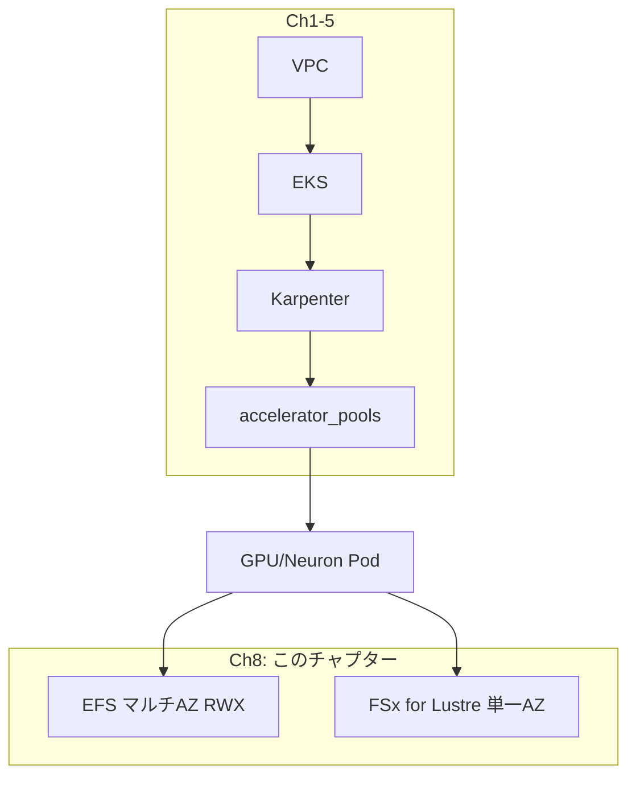

## メインテーマ

Karpenter がノードを入れ替えても失われないデータ層として、EFS（マルチ AZ の RWX キャッシュ）と FSx for Lustre（単一 AZ の高スループット・スクラッチ）を構成する。

## これは何をするものか

Karpenter は consolidate（アイドルノードの回収、Ch3 で見た `consolidateAfter` が該当）・drift（AMI 更新などの設定変更を検知した入れ替え）・expire（TTL 到達による入れ替え）でノードを次々に入れ替える。この挙動自体はコスト最適化のために望ましいが、副作用として「Pod のローカルディスクに置いたデータはノードごと消える」という制約が生まれる。

具体的に困るのは次の 2 種類のデータである。

- **キャッシュ**: Hugging Face のモデルダウンロードキャッシュや、Neuron コンパイル済みの NEFF（Neuron Executable File Format）。これらは再生成可能だが、再生成には数分から数十分かかる。ノードが入れ替わるたびに再コンパイルが走ると、実験のたびに待ち時間が積み重なる
- **学習データ・チェックポイント**: 大規模データセットの読み出しや、長時間ジョブの中間チェックポイント保存。こちらはスループットが要求される

この 2 つの用途は特性が異なるため、このチャプターでは 2 種類の共有ストレージを使い分ける。

**EFS（`efs.tf`）** はマルチ AZ・ReadWriteMany（RWX）のファイルシステムである。private subnet ごとにマウントターゲットを配置するため、Capacity Block の GPU/Neuron ノードがどの AZ に居ても同じキャッシュをマウントできる。複数の推論・学習 Pod が同時に同じ HF キャッシュや NEFF を読みに来る RWX の要件にも合う。Pod Identity で `aws-efs-csi-driver` の Controller に IAM ロールを紐付け、EKS アドオンとして導入する。

**FSx for Lustre（`fsx.tf`）** は単一 AZ に固定された高スループット SSD のスクラッチ領域である。PERSISTENT_2 デプロイタイプを使い、既定では無効（`fsx_enabled = false`）になっている。単一 AZ である代わりに、EFS よりも高い読み書きスループットを持ち、大規模データセットの読み出しや学習チェックポイントの書き込みに向く。

FSx には EFS と決定的に違う制約がある。**aws-fsx-csi-driver は既存のファイルシステムに対する動的プロビジョニング（StorageClass 経由での PVC バインド）に対応していない。** ドライバが読むのは新規にファイルシステムを作成するためのパラメータのみで、既存 FS の `fileSystemId` を StorageClass に渡しても無視されるか、意図しない 2 つ目の（多くの場合 TB 単位で課金される）ファイルシステムが暗黙に作られてしまう。そのため、この構成では EFS と同じ static provisioning のパターンを踏襲し、Terraform が作成した 1 つの FSx ファイルシステムに対して固定の `volumeHandle` を持つ PersistentVolume（`fsx-training`）を 1 つだけ用意する。PVC 側はこの PV に名前でバインドする。

なお、KEDA（イベント駆動スケーリング）や Mountpoint for S3 はこのチャプターには含めない。これらはワークロード層の関心事であり、cluster-infra が提供する責務の外にあると判断している。

## 全体の中での位置付け



## 実際に挙動を確認する

### 1. Terraform の出力を確認する

```bash
cd infra/eks
terraform output
```

`efs_enabled = true` は既定値なので、初回 apply 時点で EFS ファイルシステムはすでに作られている。FSx は既定で無効なので、有効にする場合は `terraform.tfvars` に `fsx_enabled = true` を追加してから `terraform apply` する。

### 2. PersistentVolume と PVC を確認する

```bash
kubectl get pv
```

実機出力:
```
NAME                   CAPACITY   ACCESS MODES   RECLAIM POLICY   STATUS   CLAIM                          AGE
efs-neuron-workspace   1000Gi     RWX            Retain           Bound    smollm-test/efs-shared-claim   3d
fsx-training           2400Gi     RWX            Retain           Bound    default/fsx-claim              3d
```

EFS (`efs-neuron-workspace`) と FSx (`fsx-training`) が共に `Retain` + `RWX` で Bound。

```bash
kubectl get pvc -A
```

```
NAMESPACE     NAME               STATUS   VOLUME                 CAPACITY   ACCESS MODES   AGE
default       fsx-claim          Bound    fsx-training           2400Gi     RWX            3d
smollm-test   efs-shared-claim   Bound    efs-neuron-workspace   1000Gi     RWX            3d
```

どちらも `storageClassName` が空の static PV であり、動的プロビジョニングの StorageClass（`efs-shared`）とは別物である点に注意する。FSx が `RWX` なのは、複数ノードの Pod から同時にチェックポイント書き込みやデータ読み出しができるようにするためである。

### 3. EFS 用の PVC を作成し、書き込みテストを行う

PV は Terraform で作られているが、PVC（Pod がマウントに使う参照）は手動で作る必要がある:

```bash
kubectl apply -f - <<'EOF'
apiVersion: v1
kind: PersistentVolumeClaim
metadata:
  name: efs-claim
spec:
  accessModes: ["ReadWriteMany"]
  storageClassName: ""
  volumeName: efs-neuron-workspace
  resources:
    requests:
      storage: 1000Gi
EOF
```

PVC が `Bound` になったことを確認:

```bash
kubectl get pvc efs-claim
```

EFS にファイルを書き込むテスト Pod を実行する:

```bash
kubectl run efs-test --restart=Never \
    --image=busybox \
    --overrides='{"spec":{"containers":[{"name":"efs-test","image":"busybox","command":["sh","-c","echo hello > /mnt/efs/test.txt && cat /mnt/efs/test.txt"],"volumeMounts":[{"name":"efs","mountPath":"/mnt/efs"}]}],"volumes":[{"name":"efs","persistentVolumeClaim":{"claimName":"efs-claim"}}]}}'
```

Pod のログに `hello` が出力されれば、EFS のマウントと書き込みが成功している。

```bash
kubectl logs efs-test
```

### 4. Pod を削除して再作成し、データが残ることを確認する

```bash
kubectl delete pod efs-test
kubectl run efs-test2 --restart=Never \
    --image=busybox \
    --overrides='{"spec":{"containers":[{"name":"efs-test2","image":"busybox","command":["cat","/mnt/efs/test.txt"],"volumeMounts":[{"name":"efs","mountPath":"/mnt/efs"}]}],"volumes":[{"name":"efs","persistentVolumeClaim":{"claimName":"efs-claim"}}]}}'
kubectl logs efs-test2
```

別名の Pod でも `hello` が読み出せる。これが、Karpenter がノードを入れ替えても Pod が再スケジュールされた先で同じキャッシュを読み続けられる、という Ch8 の要点そのものである。

## 注意点

**`fsx_subnet_index` とアクセラレータプールの `zone` の不一致に注意する。** FSx for Lustre は単一 AZ にしか存在せず、別 AZ からのマウントは動作こそするが、AZ 間データ転送コストとレイテンシが発生する。`fsx_subnet_index` は、実際に FSx を使うアクセラレータプールの `zone`（Ch3 参照）と揃えておく。

**`prevent_destroy` は意図的に未設定。** この構成は再現性を優先した使い捨て環境として設計されており、`terraform destroy` を実行すると FSx ファイルシステムとその中のデータがそのまま削除される。NEFF や HF キャッシュのような再生成可能なデータであれば問題ないが、チェックポイントなど失うと困るデータを長期間保持するクラスタでは `prevent_destroy = true` を設定すべきである。

**FSx のサイズは 1,200 GiB か、2,400 GiB の倍数でしか指定できない。** PERSISTENT_2 SSD のストレージ容量は API レベルでこの制約を持つ。`fsx_storage_capacity_gib` に中間半端な値（例えば 3,000）を設定すると、Terraform の変数バリデーションで即座に弾かれる。

**FSx は有効な間、容量分の課金が常時発生する。** PERSISTENT_2 SSD は使用量ではなくプロビジョニングした容量に対して課金され続けるため、常時起動しておくコストは小さくない。学習ジョブを実行する期間だけ `fsx_enabled = true` にして apply し、終わったら `false` に戻して destroy する運用が推奨される。

**Hugging Face からのダウンロードで 429（Too Many Requests）が出る場合。** 多数の Pod が同時に同じモデルを HF Hub から直接ダウンロードすると、レート制限に当たりやすい。対策として、事前に 1 つの Pod で EFS 上にモデルをステージングしておき、各推論 Pod はそのローカルキャッシュを読むようにする。また `HF_HUB_DISABLE_XET=1` を設定して Xet 経由の転送を無効化すると、この種のエラーが解消するケースがある。
