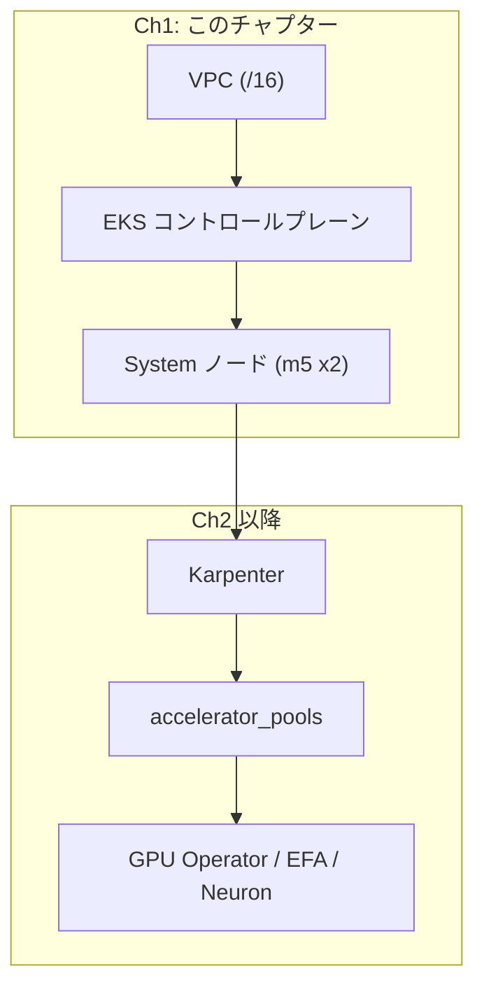

## メインテーマ

GPU/Neuron ノードの IP 消費に耐える VPC と、Karpenter を載せるための EKS クラスタを Terraform で構築する。

## これは何をするものか

分散 AI 基盤の一番下の層は、ネットワーク（VPC）とコンテナオーケストレーション基盤（EKS コントロールプレーン + システムノード）である。この層は GPU や Trainium/Inferentia（Neuron）を積むアクセラレータノード自体をまだ含まない。Karpenter がアクセラレータノードを後から動的に立てるための「土台」を用意する段階である。

なぜこの土台が特別な設計を必要とするかというと、アクセラレータノードは通常の CPU ノードよりも桁違いに IP アドレスを消費するからである。EKS では VPC CNI がノードごとに複数の secondary IP を割り当ててPodに配布するが、これに加えて EFA（Elastic Fabric Adapter）を使うインスタンスは EFA 専用の ENI（Elastic Network Interface）を多数持つ。例えば H200 を積む `p5en.48xlarge` は EFA 専用 ENI を 16 枚、`p5.48xlarge` は 32 枚保持する。ENI 1 枚につき最低 1 個の IP が消費されるため、少数のノードが立つだけで小さな CIDR は枯渇する。

VPC が枯渇すると何が起きるか。単に新しいPodがスケジュールできなくなるだけでなく、EKS コントロールプレーンが管理用 ENI を配置できなくなり、クラスタが `IMPAIRED` 状態（`InsufficientFreeAddresses`）に陥る。これは後から拡張するのが難しい失敗モードなので、最初の VPC 設計時点で十分な余裕を持たせておく必要がある。

この構成では VPC 全体を `/16`、プライベートサブネットを AZ ごとに `/18`（1 サブネットあたり 16,384 アドレス）としている。GPU ノードが数台しか立たない検証環境でも、EFA 専用 ENI の消費を考えると `/18` クラスの余裕が実質的な下限になる。パブリックサブネットは NAT ゲートウェイとロードバランサーのためだけに使うので `/24` で十分小さくしてよい。「パブリックは小さく、プライベートは大きく」という設計は AWS の `awslabs/awsome-distributed-ai` の HyperPod-EKS リファレンス構成にも見られる原則である。

EKS 側では、コントロールプレーンに加えて m5 系インスタンス x2 台からなる System managed node group を用意する。この System ノードグループは kube-system の各種コンポーネントと Karpenter コントローラ自身を載せるための場所である。Karpenter はここには自分自身のノードグループを作らない（ラベルで自己参照を避ける）ため、Karpenter が稼働するための最初の足場として System ノードグループが必要になる。

アドオンの導入順にも注意点がある。`vpc-cni` と `eks-pod-identity-agent` はいずれも `before_compute = true` を指定し、ワーカーノードが起動する前に導入されるようにする。特に Pod Identity Agent は、Pod Identity で AWS 権限を得るコントローラ（EBS CSI ドライバなど）よりも先に存在していないと、そのコントローラが起動時に EC2 IMDS ロールを見つけられずクラッシュし、アドオンが `CREATING` 状態のまま止まってしまう。

## 全体の中での位置付け

このチャプターで作るのは VPC・EKS コントロールプレーン・System ノードの 3 つで、この後のチャプターで Karpenter とアクセラレータプール、各種アドオンを積み上げていく。



## 実際に挙動を確認する

### 1. tfvars を準備する

`terraform.tfvars.example` を `terraform.tfvars` にコピーし、`region` / `azs` / `cluster_name` を自分の環境に合わせて設定する。この段階では `accelerator_pools` は空のままでよい（アクセラレータプールは Ch3 以降で扱う）。

```bash
cd infra/eks
cp terraform.tfvars.example terraform.tfvars
# terraform.tfvars を編集: region, azs, cluster_name
```

### 2. apply する

```bash
terraform init
terraform apply   # 完了まで概ね 15 分程度
```

`terraform apply` の内訳は、VPC・NAT ゲートウェイ・EKS コントロールプレーン・System ノードグループの作成である。コントロールプレーンの起動が最も時間を要する。

### 3. kubeconfig を設定してノードを確認する

```bash
aws eks update-kubeconfig --name "$(terraform output -raw cluster_name)" --region <region>
kubectl get nodes
```

`kubectl get nodes` で m5 系のノードが 2 台、`Ready` 状態で表示されれば System ノードグループの起動は成功している。この時点ではまだ Karpenter も GPU/Neuron ノードも存在しないため、表示されるのはこの 2 台だけである。

### 4. context を確認する習慣をつける

```bash
kubectl config current-context
```

この確認は今の時点では地味に見えるが、CB の購入・期限管理など操作対象のリソースが増える後続の章で事故を防ぐ最初の習慣として、ここで身につけておく。

## 注意点

**AZ とサブネット CIDR リストの長さを揃える。** `azs` / `private_subnet_cidrs` / `public_subnet_cidrs` はインデックスで対応付けられ、AZ ごとに 1 つのプライベートサブネットと 1 つのパブリックサブネットが作られる。3 つの配列の長さが一致していないと、対応するサブネットを持たない AZ が生まれる。この状態でアクセラレータプールの `zone` にその AZ を指定してしまうと、変数のバリデーション自体は「`zone` が `azs` に含まれているか」しか見ていないため apply は通ってしまう。結果として、その AZ にはサブネットが存在せずノードの配置先が決まらないため、Podは永久に `Pending` のまま残り、原因は Karpenter のイベントログを掘るまで気づけない。この構成では 3 つの配列長が一致しているかを plan 時のバリデーションで弾くようにしており、CIDR 追加漏れを apply 前に検出できる。

**`karpenter.sh/discovery` タグをパブリックサブネットに漏らさない。** このタグは Karpenter が「ノードを起動してよいサブネット」を検出するために使う目印である。VPC モジュールの共通タグ（`tags`）にこのタグを含めてしまうと、モジュールの実装上すべてのサブネットに伝搬し、パブリックサブネットにも付いてしまう。そうなると Karpenter のサブネット選択条件がパブリックサブネットにもマッチし、そこにノードが立ってしまう。パブリックサブネットは IGW 経由のルートしか持たず EC2 API への経路がないため、起動したノードは `nodeadm` によるクラスタ参加ができずに詰む。この構成ではこのタグをプライベートサブネットのタグとノードセキュリティグループのタグにだけ明示的に付与し、VPC 共通タグからは意図的に外している。

**`kubectl` の context 事故。** マルチクラスタ環境では、別クラスタ用に context を切り替えた後、切り替えたことを忘れて元のつもりで操作してしまう事故が起きやすい。破壊的な操作の前には必ず `kubectl config current-context` で対象クラスタを確認する。
