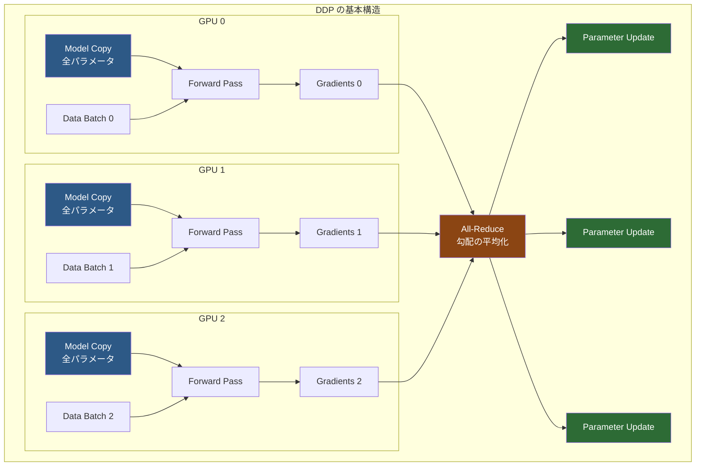
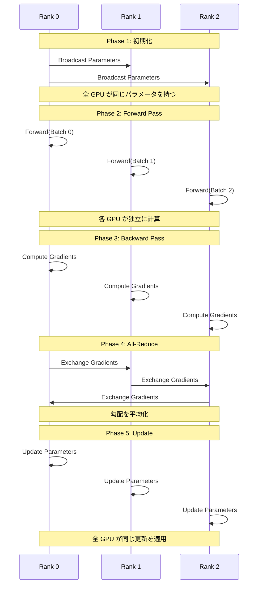
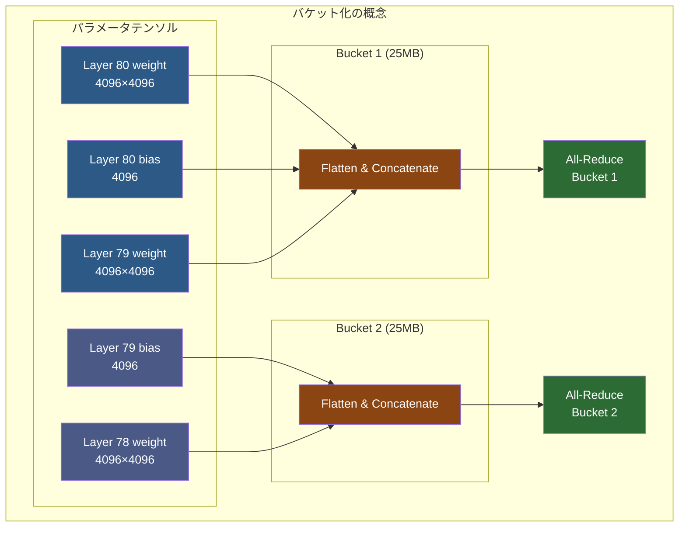
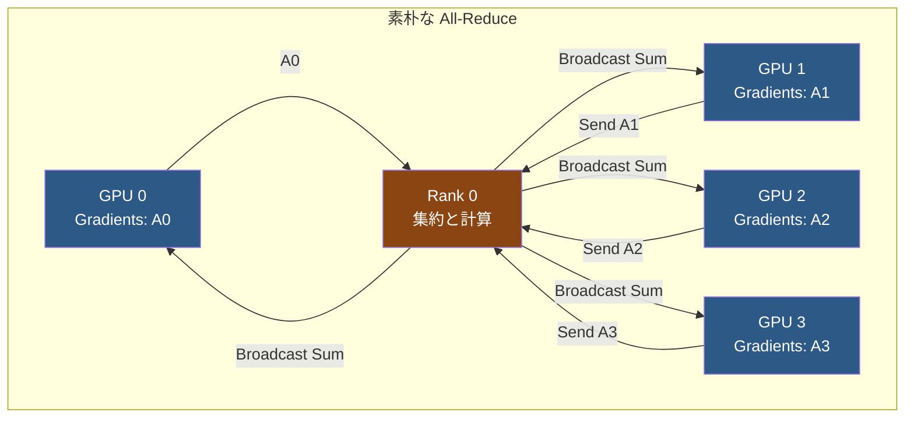
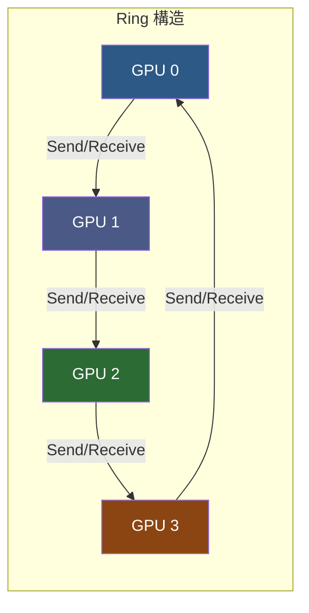
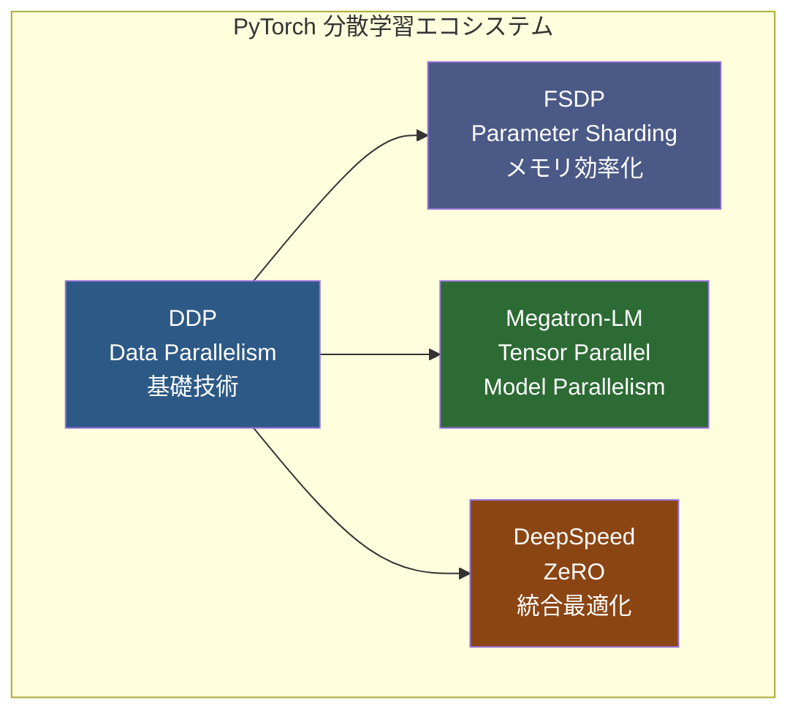

::::details 前提
:::message
**対象読者**: 大規模基盤モデルの分散学習に興味があり、PyTorch DDP の仕組みを深く理解したい方。分散学習の基礎知識があると理解しやすい内容です。
:::
:::message
**ライセンス**: © 2025 littlemex.
本文および自作図表: CC BY 4.0
※公式ドキュメントからの引用や翻訳部分は原典の著作権に従います。
引用画像: 各画像の出典に記載されたライセンスに従います。
:::
:::message
一部 AI を用いて文章を作成します。レビューは実施しますが、見逃せない重大な間違いなどがあれば[こちらの Issue](https://github.com/littlemex/samples/issues) から連絡をお願いします。
:::
::::

本章では Slurm 環境で PyTorch Distributed Data Parallel（DDP）を使用した分散学習を試します。EKS で DDP を使用した分散学習を試したい場合は[こちら](https://awslabs.github.io/ai-on-sagemaker-hyperpod/docs/eks-blueprints/training/ddp/distributed-data-parallel)を確認してください。

:::message
実装が変更される可能性があるため必要に応じて[ドキュメント](https://awslabs.github.io/ai-on-sagemaker-hyperpod/docs/slurm-blueprints/training/ddp/distributed-data-parallel)を確認してください。
:::

---

# PyTorch DDP の理解

本章では、まず DDP とはそもその何か、そして PyTorch DDP の仕組みを詳しく整理し、その後 Amazon SageMaker HyperPod の Slurm 環境で実際に CPU インスタンスでトレーニングを実行します。

PyTorch の分散学習において、Distributed Data Parallel は最も基本的で重要な技術です。PyTorch DDP は PyTorch 標準の分散学習機能で、PyTorch に標準搭載されているため追加の依存関係が不要です。DDP で学ぶ勾配同期、通信最適化、バケット化などの基礎概念は、他の発展手法にも共通する重要な知識です。

小〜中規模モデルのトレーニングでは、DDP が最も効率的な選択肢となることが多いです。既存の PyTorch コードを数行変更するだけで分散化でき、デバッグも容易です。エラーメッセージが明確で問題の特定がしやすく、安定性も高いため、production 環境での採用に適しています。今後エッジ側での推論のために軽量なモデルのニーズが加速することが想定され、その場合は他の Tensor Parallel などの発展的な手法まで必要ないケースが増えてくるかもしれません。

## DDP の基本概念

Distributed Data Parallel は、その名前が示す通りデータを並列化する手法です。各 GPU がモデル全体の完全なコピーを保持し、異なるデータバッチを処理することで、トレーニングを並列化します。



各 GPU は独立して Forward Pass と Backward Pass を実行しますが、勾配を計算した後に All-Reduce という通信操作を使って全 GPU の勾配を平均化します。この平均化された勾配を使って各 GPU が同じパラメータ更新を行うため、全てのモデルが同期された状態を保ちます。

## DDP の動作フロー

DDP のトレーニングは以下の 5 つのフェーズで構成されます。



### Phase 1: 初期化とパラメータブロードキャスト

トレーニング開始時、Rank 0（通常は最初の GPU）が持つモデルパラメータを全ての GPU にブロードキャストします。これにより、全ての GPU が完全に同じ初期パラメータを持つことが保証されます。このステップは一度だけ実行され、以降は各 GPU が独立して動作します。

### Phase 2: Forward Pass（順伝播）

各 GPU は異なるデータバッチを受け取り、独立に Forward Pass を実行します。この時点では GPU 間の通信は発生せず、完全に並列に計算が進みます。GPU 0 は Batch 0 を、GPU 1 は Batch 1 を、というように異なるデータを処理するため、実効的なバッチサイズは単一 GPU の場合の GPU 数倍になります。

### Phase 3: Backward Pass（逆伝播）

Loss を計算した後、各 GPU は独立に Backward Pass を実行して勾配を計算します。この段階でも GPU 間の通信は発生しません。各 GPU は自分が担当したデータバッチに対する勾配のみを計算します。

### Phase 4: All-Reduce（勾配同期）

ここが DDP の最も重要なステップです。各 GPU が計算した勾配を All-Reduce 操作によって平均化します。All-Reduce は全ての GPU が勾配を送受信し、最終的に全 GPU が同じ平均勾配を持つようにする通信操作です。この操作により、実効的に大きなバッチサイズでトレーニングしたのと同等の勾配が得られます。

### Phase 5: パラメータ更新

平均化された勾配を使って、各 GPU が独立にパラメータを更新します。全ての GPU が同じ初期パラメータを持ち、同じ勾配で更新するため、更新後も全ての GPU が同じパラメータを保持します。この性質により、次のイテレーションでも同期が保たれます。

## 素朴な実装の課題

DDP の基本的な動作は理解しやすいものの、素朴に実装すると重大な性能問題が発生します。

::::details パラメータごとの All-Reduce の問題

最も単純な実装では、各パラメータの勾配が計算されるたびに All-Reduce を実行することになります。

```python
# 素朴な実装（非効率）
for param in model.parameters():
    if param.grad is not None:
        # パラメータごとに All-Reduce を実行
        dist.all_reduce(param.grad)
        param.grad /= world_size
```

大規模なモデルでは数千から数万のパラメータが存在します。例えば Llama 2 7B モデルには約 32,000 個のパラメータテンソルがあります。各 All-Reduce 呼び出しにはレイテンシーが存在するため、32,000 回の通信を行うと膨大なオーバーヘッドが発生します。

通信のレイテンシーは転送するデータサイズではなく、通信回数に大きく依存します。小さなテンソルを何度も送るよりも、大きなテンソルを一度に送る方が遥かに効率的です。この問題を解決するために、PyTorch DDP は勾配バケット化という最適化を実装しています。
::::

::::details 通信と計算の分離による非効率性

素朴な実装では、Backward Pass が完全に終了してから All-Reduce を開始します。

```mermaid
gantt
    title 素朴な実装のタイムライン
    dateFormat X
    axisFormat %s
    
    section GPU 0
    Backward Pass :b0, 0, 10
    Wait :w0, 10, 15
    All-Reduce :ar0, 15, 18
    
    section GPU 1
    Backward Pass :b1, 0, 10
    Wait :w1, 10, 15
    All-Reduce :ar1, 15, 18
    
    section GPU 2
    Backward Pass :b2, 0, 10
    Wait :w2, 10, 15
    All-Reduce :ar2, 15, 18
```



この方式では、Backward Pass 中に GPU の計算リソースが利用可能であるにもかかわらず、通信は待機状態になります。逆に All-Reduce 中は通信リソースを使っていますが、計算リソースは遊んでいます。計算と通信を重ねることができれば、全体の実行時間を短縮できます。
::::

## 勾配バケット化による最適化

PyTorch DDP は勾配バケット化（Gradient Bucketing）という手法で通信回数を削減します。



バケット化では、複数のパラメータの勾配を一つの大きなテンソルにまとめてから All-Reduce を実行します。PyTorch のデフォルトではバケットサイズは 25MB に設定されており、この設定は多くの場合で良好なパフォーマンスを示します。

### バケット化のメリット

通信回数の削減により、レイテンシーによるオーバーヘッドが大幅に減少します。例えば 32,000 個のパラメータを 500 個のバケットにまとめれば、通信回数は 1/64 になります。大きなテンソルでは GPU 間の帯域幅を効率的に活用でき、通信と計算のオーバーラップも実装しやすくなります。

### バケットの構成戦略

DDP はモデルのパラメータを逆順（最後の層から最初の層へ）にバケットに割り当てます。これは Backward Pass が最後の層から開始されるため、最初に勾配が計算される層を最初のバケットに入れることで、早期に通信を開始できるようにするためです。

## 通信と計算のオーバーラップ

バケット化により通信回数を削減できましたが、さらに重要な最適化が通信と計算のオーバーラップです。

```mermaid
gantt
    title オーバーラップ最適化のタイムライン
    dateFormat X
    axisFormat %s
    
    section GPU Computation
    Layer 80 Backward :l80, 0, 2
    Layer 79 Backward :l79, 2, 4
    Layer 78 Backward :l78, 4, 6
    Layer 77 Backward :l77, 6, 8
    
    section Communication
    Wait :w1, 0, 2
    Bucket 1 All-Reduce :ar1, 2, 6
    Bucket 2 All-Reduce :ar2, 6, 10
```



### オーバーラップの仕組み

Backward Pass は最後の層から最初の層へと進行します。各層の勾配計算が完了すると、その層が属するバケットの準備が整ったことをチェックします。バケット内の全ての勾配が揃った時点で、即座に非同期 All-Reduce を開始します。

非同期 All-Reduce は別のストリームで実行されるため、GPU は次の層の Backward 計算を続けることができます。これにより、通信と計算が並行して実行され、全体の実行時間が短縮されます。

### Autograd フックによる実装

PyTorch DDP は autograd のフックメカニズムを使ってこの最適化を実装しています。

```python
# DDP の内部実装の概念（簡略化）
class DistributedDataParallel:
    def __init__(self, module):
        self.module = module
        self.buckets = self._create_buckets()
        
        # 各パラメータにフックを登録
        for param in self.module.parameters():
            if param.requires_grad:
                param.register_post_accumulate_grad_hook(
                    self._make_hook(param)
                )
    
    def _make_hook(self, param):
        def hook(*unused):
            # このパラメータが属するバケットを取得
            bucket = self._find_bucket(param)
            
            # バケット内の全勾配が揃ったかチェック
            if bucket.all_gradients_ready():
                # 非同期 All-Reduce を開始
                bucket.all_reduce_async()
        
        return hook
```

各パラメータの勾配が計算される度にフックが呼ばれ、属するバケットの状態をチェックします。バケットが完成したら即座に通信を開始し、GPU は引き続き次の層の計算を進めます。

## Ring All-Reduce アルゴリズム

DDP が使用する All-Reduce 操作の内部では、Ring All-Reduce というアルゴリズムが使われています。これは NCCL（NVIDIA Collective Communications Library）が実装する高効率な通信パターンです。

### 素朴な All-Reduce の問題

最も単純な All-Reduce 実装では、全ての GPU が Rank 0 に勾配を送り、Rank 0 が合計を計算して全 GPU にブロードキャストします。



この方式では、Rank 0 がボトルネックになります。N 個の GPU がある場合、Rank 0 は N 倍のデータを受信し、N 倍のデータを送信する必要があります。GPU 数が増えるほど、Rank 0 の通信量が線形に増加してしまいます。

### Ring All-Reduce の効率性

Ring All-Reduce では、GPU をリング状に配置し、隣接する GPU とのみ通信します。



アルゴリズムは以下の 2 つのフェーズで構成されます。

**Reduce-Scatter フェーズ**

データを chunk に分割し、リング上で回しながら累積加算します。N 個の GPU と N 個の chunk がある場合、N-1 ステップで各 GPU が異なる chunk の合計を持つ状態になります。

**All-Gather フェーズ**

各 GPU が持つ合計済み chunk をリング上で共有します。さらに N-1 ステップで、全ての GPU が全ての chunk を持つようになります。

### 通信量の比較

Ring All-Reduce の重要な特性は、通信量が GPU 数に依存しないことです。

| 方式 | 各 GPU の通信量 | Rank 0 の通信量 |
|------|----------------|----------------|
| 素朴な実装 | O(M) | O(N×M) |
| Ring All-Reduce | O(M) | O(M) |

ここで M はデータサイズ、N は GPU 数です。素朴な実装では Rank 0 が O(N×M) の通信を行う必要がありますが、Ring All-Reduce では全ての GPU が O(M) の通信のみで済みます。これにより、数百〜数千の GPU にスケールしても通信効率が維持されます。

## DDP の利点と制約

### 利点

**実装の容易性**

PyTorch に標準搭載されており、追加の依存関係が不要です。既存のコードを数行変更するだけで分散化でき、学習曲線が緩やかです。エラーメッセージが明確で、デバッグが容易です。

**優れたパフォーマンス**

勾配バケット化により通信回数を最小化します。通信と計算のオーバーラップにより GPU の稼働率を最大化します。Ring All-Reduce により数百〜数千 GPU へのスケーラビリティを実現します。

**Production での実績**

OpenAI、Anthropic、Cohere など多くの企業で採用されています。長期間の開発と使用により高い安定性を持ちます。PyTorch の全機能と完全に統合されており、互換性の問題がありません。

### 制約

**メモリ効率**

各 GPU がモデル全体のコピーを保持する必要があります。モデルが大きすぎると単一 GPU のメモリに収まりません。70B パラメータ以上の大規模モデルでは単独では不十分です。

**適用範囲**

Data Parallelism のみをサポートし、Model Parallelism は含まれません。超大規模モデルには FSDP や Megatron-LM などの追加技術が必要です。

**勾配同期のオーバーヘッド**

All-Reduce 通信がボトルネックになる可能性があります。特にノード間通信では、ノード内の NVLink に比べて遅い InfiniBand や Ethernet を使用するため、通信コストが増大します。

## DDP と他の並列化手法の関係

DDP は分散学習の基礎となる技術であり、他の高度な手法の土台となっています。



FSDP は DDP の勾配同期メカニズムを拡張し、パラメータと optimizer state も分散します。Megatron-LM は DDP の Data Parallelism に Tensor Parallelism を組み合わせます。DeepSpeed は DDP の通信パターンを基礎として ZeRO 最適化を実装しています。

これらの高度な手法を理解するためには、DDP で学ぶ勾配同期、通信パターン、バケット化といった概念が不可欠です。

::::details マルチ GPU 処理手法の詳細

DDP を含む様々な並列化手法の詳細については、[マルチ GPU 処理手法の整理](./multi-gpu-processing-approaches.md)を参照してください。この章では以下のトピックを詳しく解説しています。

- Data Parallelism、Pipeline Parallelism、Tensor Parallelism の比較
- ZeRO（Zero Redundancy Optimizer）の詳細
- FSDP、DeepSpeed、Megatron-LM の特徴
- フレームワーク選択のガイドライン
- 学習手法（事前学習、SFT、DPO）とフレームワークの対応

DDP の理解を深めた後、より高度な手法を学ぶ際の参考にしてください。
::::

---

# Amazon SageMaker HyperPod Slurm での実装

ここからは、Amazon SageMaker HyperPod の Slurm 環境で実際に DDP を使用したトレーニングを実行します。

## 前提条件

::::details インフラストラクチャ要件

:::message
**Slurm クラスターの構築**

本章の実践には、事前に Amazon SageMaker HyperPod Slurm クラスターが構築されている必要があります。クラスターの構築手順については [Amazon SageMaker HyperPod Getting Started by SLURM](./amazon-sagemaker-hyperpod-slurm-tutorial.md) を参照してください。
:::

以下のリソースが準備されていることを確認してください。

**クラスター構成**

Amazon SageMaker HyperPod Slurm クラスターがデプロイされ、InService 状態であること。Controller ノード、Login ノード、Worker ノードが正常に稼働していること。FSx for Lustre ファイルシステムが `/fsx` にマウントされていること。

**開発環境**

AWS CLI v2 がインストールされ、適切な権限で設定されていること。SSM Session Manager プラグインがインストールされていること。Docker がインストールされていること（コンテナイメージのビルド用）。
::::

::::details 動作確認用の推奨インスタンス構成

本章では CPU インスタンスを使用して DDP の動作を確認します。GPU は不要ですが、DDP の基本的な動作原理は GPU でも CPU でも同じです。

| グループ | インスタンスタイプ | 数 | 用途 |
|---------|-----------------|---|------|
| **Controller** | `ml.c5.xlarge` | 1 | Slurm コントローラー |
| **Login** | `ml.c5.xlarge` | 1 | SSH ログイン用 |
| **Worker** | `ml.c5.4xlarge` | 2 | 計算ワークロード |

GPU を使用したい場合は、Worker を `ml.g5.xlarge` などに変更してください。
::::

## Docker イメージのセットアップ

:::message
- [ ] リポジトリのクローン
- [ ] Docker イメージのビルド
- [ ] イメージの Amazon ECR へのプッシュ
:::

::::details リポジトリのクローン

:::message
なんのための作業か: DDP トレーニングコードと Docker 設定を取得します。AWS の分散トレーニングサンプルリポジトリには、Slurm 向けに最適化された PyTorch DDP サンプルが含まれています。
:::

:::message
次のステップに進む条件: `awsome-distributed-training/3.test_cases/pytorch/cpu-ddp` ディレクトリに移動でき、必要なファイルが存在すること。
:::

クラスターに SSH 接続した後、リポジトリをクローンします。

```bash
cd ~
git clone https://github.com/aws-samples/awsome-distributed-training/
cd awsome-distributed-training/3.test_cases/pytorch/cpu-ddp
```

ディレクトリの内容を確認します。

```bash
ls -la
```

以下のようなファイルが含まれています。

- `Dockerfile`: PyTorch DDP 環境を構築するための設定
- `train.py`: DDP トレーニングスクリプト
- `slurm/`: Slurm ジョブスクリプトのサンプル
::::

::::details Docker イメージのビルド

:::message
なんのための作業か: PyTorch、DDP トレーニングコード、全ての必要な依存関係を含むコンテナイメージをビルドします。
:::

:::message
次のステップに進む条件: `docker build` コマンドが正常に完了し、"Successfully built" メッセージが表示されること。通常 3 から 5 分かかります。
:::

環境変数を設定します。

```bash
export AWS_REGION=$(aws ec2 describe-availability-zones --output text --query 'AvailabilityZones[0].[RegionName]')
export ACCOUNT=$(aws sts get-caller-identity --query Account --output text)
export REGISTRY=${ACCOUNT}.dkr.ecr.${AWS_REGION}.amazonaws.com/
export IMAGE=pytorch-ddp-cpu
export TAG=:latest
```

Docker イメージをビルドします。

```bash
docker build -t ${REGISTRY}${IMAGE}${TAG} .
```

ビルドが成功すると、以下のようなメッセージが表示されます。

```
Successfully built 123ab12345cd
Successfully tagged 123456789012.dkr.ecr.us-east-1.amazonaws.com/pytorch-ddp-cpu:latest
```
::::

::::details イメージの Amazon ECR へのプッシュ

:::message
なんのための作業か: コンテナレジストリが存在しない場合は作成し、コンテナイメージをプッシュします。これにより、Slurm クラスターノードからイメージが利用可能になります。
:::

:::message
次のステップに進む条件: `docker push` コマンドが正常に完了し、イメージが ECR にプッシュされること。通常 5 から 8 分かかります。
:::

レジストリを作成します（存在しない場合）。

```bash
REGISTRY_COUNT=$(aws ecr describe-repositories | grep \"${IMAGE}\" | wc -l)
if [ "${REGISTRY_COUNT//[!0-9]/}" == "0" ]; then
    echo "Creating repository ${REGISTRY}${IMAGE} ..."
    aws ecr create-repository --repository-name ${IMAGE}
else
    echo "Repository ${REGISTRY}${IMAGE} already exists"
fi
```

レジストリにログインします。

```bash
echo "Logging in to $REGISTRY ..."
aws ecr get-login-password --region ${AWS_REGION} | docker login --username AWS --password-stdin $REGISTRY
```

イメージをレジストリにプッシュします。

```bash
docker image push ${REGISTRY}${IMAGE}${TAG}
```

プッシュが完了すると、以下のようなメッセージが表示されます。

```
latest: digest: sha256:abc123... size: 2841
```
::::

## Slurm ジョブスクリプトの作成

:::message
- [ ] トレーニングスクリプトの確認
- [ ] Slurm ジョブスクリプトの作成
:::

::::details トレーニングスクリプトの確認

:::message
なんのための作業か: DDP トレーニングを実行する Python スクリプトの内容を理解します。
:::

`train.py` ファイルを確認します。このスクリプトは、PyTorch DDP を使用した簡単な多層パーセプトロン（MLP）のトレーニングを実装しています。

```python
import torch
import torch.nn as nn
import torch.distributed as dist
from torch.nn.parallel import DistributedDataParallel as DDP
from torch.utils.data import DataLoader, DistributedSampler
from torch.utils.data import TensorDataset

# 分散環境の初期化
def setup():
    dist.init_process_group(backend='gloo')  # CPU では gloo を使用
    
# シンプルな MLP モデル
class SimpleMLP(nn.Module):
    def __init__(self, input_size=784, hidden_size=256, output_size=10):
        super(SimpleMLP, self).__init__()
        self.fc1 = nn.Linear(input_size, hidden_size)
        self.relu = nn.ReLU()
        self.fc2 = nn.Linear(hidden_size, output_size)
    
    def forward(self, x):
        x = x.view(x.size(0), -1)
        x = self.fc1(x)
        x = self.relu(x)
        x = self.fc2(x)
        return x
```

このスクリプトの重要な部分は以下の通りです。

1. **分散環境の初期化**: `dist.init_process_group()` で分散プロセスグループを作成
2. **DistributedSampler の使用**: データを各プロセスに分配
3. **DDP でモデルをラップ**: 勾配同期を自動化
4. **通常の PyTorch トレーニングループ**: forward、backward、optimizer step
::::

::::details Slurm ジョブスクリプトの作成

:::message
なんのための作業か: Slurm を使用して複数ノードで DDP トレーニングを実行するためのジョブスクリプトを作成します。
:::

:::message
次のステップに進む条件: ジョブスクリプトが作成され、必要なパラメータが設定されていること。
:::

`ddp_train.sbatch` ファイルを作成します。

```bash
cat > ddp_train.sbatch << 'EOF'
#!/bin/bash
#SBATCH --job-name=pytorch-ddp
#SBATCH --nodes=2
#SBATCH --ntasks-per-node=1
#SBATCH --cpus-per-task=4
#SBATCH --output=/fsx/logs/%x_%j.out
#SBATCH --error=/fsx/logs/%x_%j.err
#SBATCH --time=01:00:00

# 環境変数の設定
export MASTER_ADDR=$(scontrol show hostnames $SLURM_JOB_NODELIST | head -n 1)
export MASTER_PORT=29500
export WORLD_SIZE=$SLURM_NTASKS
export RANK=$SLURM_PROCID

# ログディレクトリの作成
mkdir -p /fsx/logs

# Docker コンテナの実行
echo "Starting training on node $(hostname)"
echo "MASTER_ADDR: $MASTER_ADDR"
echo "RANK: $RANK"
echo "WORLD_SIZE: $WORLD_SIZE"

# ECR イメージの環境変数を設定
ACCOUNT=$(aws sts get-caller-identity --query Account --output text)
REGION=$(aws ec2 describe-availability-zones --output text --query 'AvailabilityZones[0].[RegionName]')
IMAGE=${ACCOUNT}.dkr.ecr.${REGION}.amazonaws.com/pytorch-ddp-cpu:latest

# Docker コンテナでトレーニングを実行
srun docker run --rm \
    --network=host \
    -v /fsx:/fsx \
    -e MASTER_ADDR=$MASTER_ADDR \
    -e MASTER_PORT=$MASTER_PORT \
    -e WORLD_SIZE=$WORLD_SIZE \
    -e RANK=$RANK \
    $IMAGE \
    python /workspace/train.py \
        --epochs 5 \
        --batch-size 32
EOF
```

このスクリプトの重要なポイントは以下の通りです。

**Slurm パラメータ**

- `--nodes=2`: 2 ノードを使用
- `--ntasks-per-node=1`: 各ノードで 1 つのタスクを実行
- `--cpus-per-task=4`: 各タスクに 4 CPU を割り当て

**環境変数**

- `MASTER_ADDR`: ランク 0 のノードのアドレス
- `MASTER_PORT`: 通信用ポート
- `WORLD_SIZE`: 総プロセス数
- `RANK`: 現在のプロセスの ID

**Docker 実行オプション**

- `--network=host`: ホストのネットワークを使用（プロセス間通信のため）
- `-v /fsx:/fsx`: FSx ボリュームをマウント
- 環境変数を渡して DDP の設定を共有
::::

## トレーニングジョブの実行

:::message
- [ ] ジョブの投入
- [ ] ジョブの監視
- [ ] 結果の確認
:::

::::details ジョブの投入

:::message
なんのための作業か: 作成したジョブスクリプトを Slurm に投入し、DDP トレーニングを開始します。
:::

:::message
次のステップに進む条件: `sbatch` コマンドが正常に実行され、ジョブ ID が返されること。
:::

ジョブを投入します。

```bash
sbatch ddp_train.sbatch
```

出力例は以下のようになります。

```
Submitted batch job 123
```

このジョブ ID を記録しておきます。
::::

::::details ジョブの監視

:::message
なんのための作業か: ジョブの状態を確認し、トレーニングの進行状況を監視します。
:::

:::message
次のステップに進む条件: ジョブが実行中であることが確認でき、ログからトレーニングの進行状況が見えること。
:::

ジョブのステータスを確認します。

```bash
squeue
```

出力例は以下のようになります。

```
JOBID PARTITION     NAME     USER ST       TIME  NODES NODELIST(REASON)
  123       dev pytorch-      root  R       0:30      2 ip-10-4-33-25,ip-10-4-198-29
```

ジョブのログを確認します。

```bash
tail -f /fsx/logs/pytorch-ddp_123.out
```

出力例は以下のようになります。

```
Starting training on node ip-10-4-33-25
MASTER_ADDR: ip-10-4-33-25
RANK: 0
WORLD_SIZE: 2

[Rank 0] Initializing Distributed Training
[Rank 0] Using backend: gloo
[Rank 0] World size: 2
[Rank 0] Rank: 0
[Rank 0] Epoch 1/5
[Rank 0] Batch 0 | Loss: 2.3045
[Rank 0] Batch 10 | Loss: 1.8234
[Rank 0] Batch 20 | Loss: 1.4567
...
```

別のターミナルで Rank 1 のログも確認できます。

```bash
# 他のノードのログを確認
grep "Rank 1" /fsx/logs/pytorch-ddp_123.out
```
::::

::::details 結果の確認

:::message
なんのための作業か: トレーニングが正常に完了したことを確認し、結果を検証します。
:::

:::message
次のステップに進む条件: ジョブが完了し、エラーがないこと。両方のランクが同期してトレーニングを実行したことが確認できること。
:::

ジョブの完了を確認します。

```bash
squeue
# 何も表示されなければジョブは完了
```

ログファイル全体を確認します。

```bash
cat /fsx/logs/pytorch-ddp_123.out
```

正常に完了した場合、以下のような情報が表示されます。

- 両方のランク（0 と 1）が初期化されたこと
- 各エポックで両方のランクがトレーニングを実行したこと
- Loss が減少していること
- エラーなく完了したこと

チェックポイントが保存されている場合は、それも確認します。

```bash
ls -la /fsx/checkpoints/
```
::::

## トラブルシューティング

::::details よくある問題と解決方法

**問題 1: "RuntimeError: Address already in use"**

原因は MASTER_PORT が既に使用されている可能性があります。

解決方法は、ジョブスクリプトで異なるポート番号を指定します。

```bash
export MASTER_PORT=29501  # 別のポートに変更
```

**問題 2: "NCCL error" または "gloo error"**

原因はネットワーク設定の問題、またはバックエンドの選択ミスです。

解決方法として、CPU では `gloo` バックエンドを使用することを確認します。

```python
dist.init_process_group(backend='gloo')  # CPU の場合
# dist.init_process_group(backend='nccl')  # GPU の場合
```

**問題 3: "RuntimeError: Default process group has not been initialized"**

原因は `dist.init_process_group()` が呼ばれる前に DDP を使用している可能性があります。

解決方法は、必ず最初に分散環境を初期化します。

```python
# 最初に初期化
dist.init_process_group(backend='gloo')

# その後でモデルを DDP でラップ
model = DDP(model)
```

**問題 4: Docker イメージが見つからない**

原因は ECR からイメージを pull できない可能性があります。

解決方法として、各ノードで ECR にログインします。

```bash
# 各ノードで実行
aws ecr get-login-password --region ${AWS_REGION} | \
    docker login --username AWS --password-stdin ${REGISTRY}
```
::::

## パフォーマンスの確認

::::details スケーラビリティの検証

DDP の効果を確認するために、異なるノード数でトレーニング時間を比較します。

**1 ノード（1 GPU/CPU）の場合**

```bash
# ジョブスクリプトで --nodes=1 に変更
sbatch ddp_train.sbatch
```

**2 ノード（2 GPU/CPU）の場合**

```bash
# ジョブスクリプトで --nodes=2 に変更
sbatch ddp_train.sbatch
```

理想的には、2 ノードで約 2 倍の高速化が期待できます。実際には通信オーバーヘッドにより 1.7〜1.9 倍程度になることが多いです。

**スループットの計算**

ログから各エポックの時間を測定し、以下の式でスループットを計算します。

```
スループット = (バッチサイズ × ステップ数) / 経過時間
```

ノード数を増やした際にスループットが線形に増加すれば、DDP が効率的に動作していることを示します。
::::

---

# まとめ

本章では、PyTorch Distributed Data Parallel（DDP）の内部動作を詳しく学び、Amazon SageMaker HyperPod の Slurm 環境で実際に実装しました。

## 学んだこと

**DDP の基本原理**

各 GPU がモデル全体のコピーを保持し、異なるデータで並列にトレーニングを実行します。All-Reduce 操作により勾配を同期し、全 GPU が同じパラメータ更新を行います。

**最適化技術**

勾配バケット化により通信回数を削減し、レイテンシーのオーバーヘッドを最小化します。通信と計算のオーバーラップにより、GPU の稼働率を最大化します。Ring All-Reduce により、数百〜数千 GPU へのスケーラビリティを実現します。

**実装スキル**

PyTorch の標準 API を使用した DDP の実装方法を習得しました。Slurm を使用したマルチノードトレーニングの実行方法を学びました。トラブルシューティングとパフォーマンス検証の手法を理解しました。

## 次のステップ

DDP の基礎を理解したら、以下のトピックに進むことをお勧めします。

**より高度な並列化手法**

[マルチ GPU 処理手法の整理](./multi-gpu-processing-approaches.md)で、FSDP、Megatron-LM、DeepSpeed などの advanced な手法を学習できます。大規模モデル（70B+ パラメータ）のトレーニングには、これらの手法が必要になります。

**HyperPod の高度な機能**

レジリエンシーとチェックポイント管理については [HyperPod Part 2](./hp-part2-checkpoint.md) を参照してください。動的キャパシティ管理については [HyperPod Part 3](./hp-part3-dynamic.md) を参照してください。オブザーバビリティについては [HyperPod Part 4](./hp-part4-observability.md) を参照してください。

**GPU を使用した実践**

本章では CPU を使用しましたが、実際の大規模トレーニングでは GPU が必要です。`ml.g5.xlarge` や `ml.p5.48xlarge` などの GPU インスタンスを使用し、NCCL バックエンドで同様のトレーニングを実行してください。

DDP は分散学習の基礎技術であり、これをマスターすることで、より高度な手法への道が開けます。
