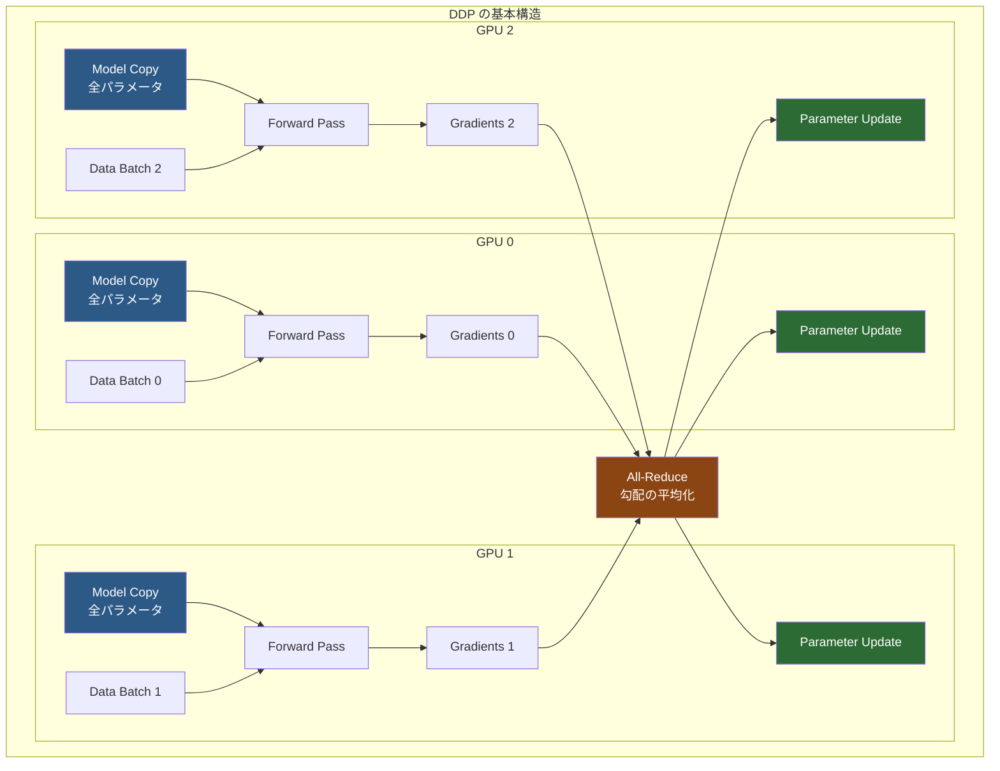
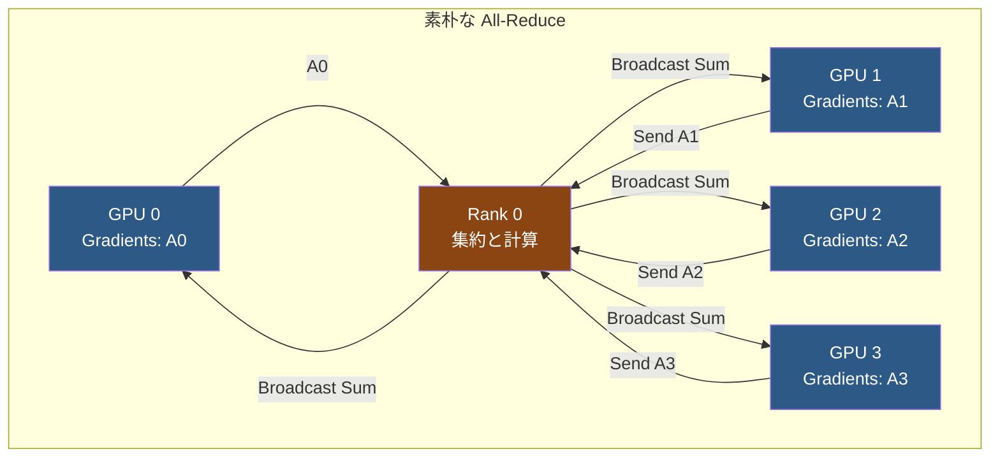
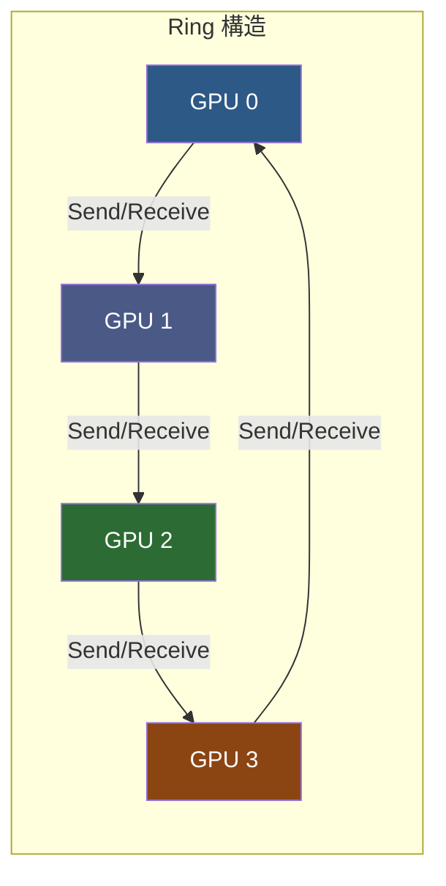
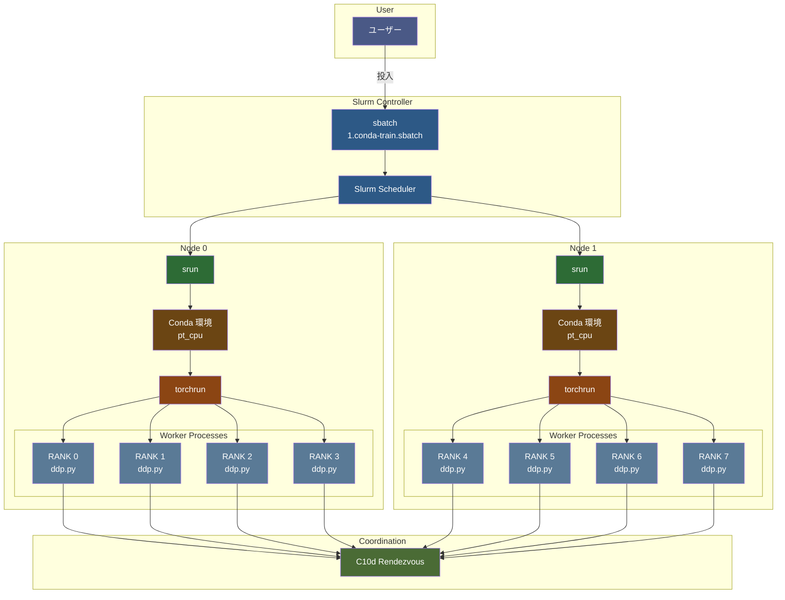
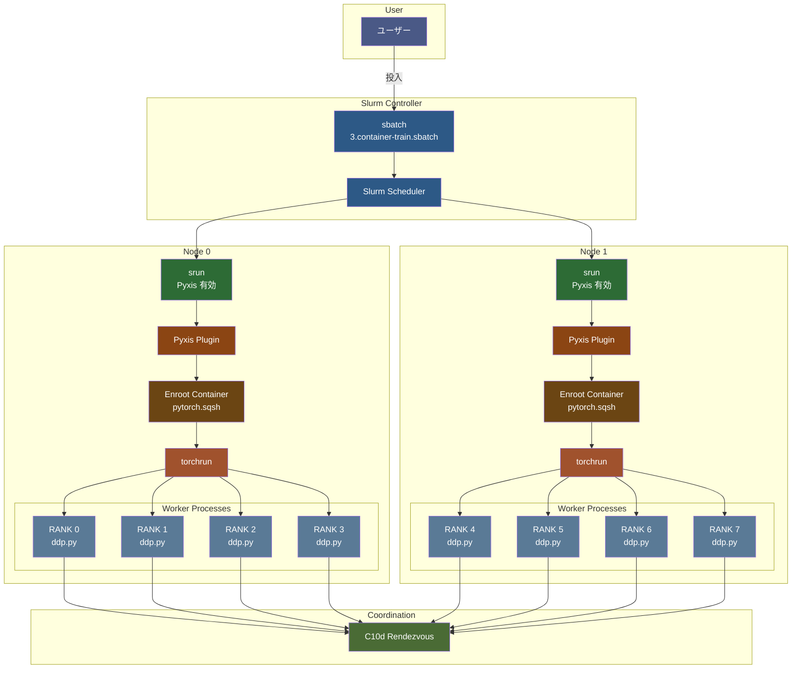
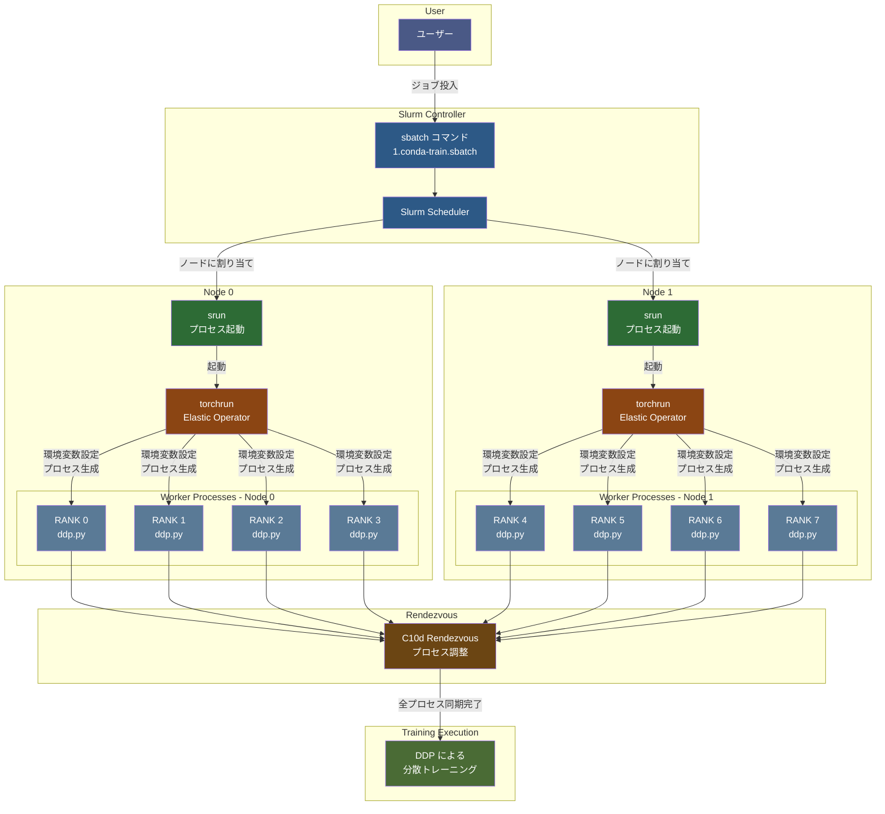

```mermaid
gantt
    title オーバーラップ最適化のタイムライン
    dateFormat X
    axisFormat %s
    
    section GPU Computation
    Layer 80 Backward :l80, 0, 2
    Layer 79 Backward :l79, 2, 4
    Layer 78 Backward :l78, 4, 6
    Layer 77 Backward :l77, 6, 8
    
    section Communication
    Wait :w1, 0, 2
    Bucket 1 All-Reduce :ar1, 2, 6
    Bucket 2 All-Reduce :ar2, 6, 10
```

::::details 前提
:::message
**対象読者**: 大規模基盤モデルの分散学習に興味があり、PyTorch DDP の仕組みを深く理解したい方。分散学習の基礎知識があると理解しやすい内容です。
:::
:::message
**ライセンス**: © 2025 littlemex.
本文および自作図表: CC BY 4.0
※公式ドキュメントからの引用や翻訳部分は原典の著作権に従います。
引用画像: 各画像の出典に記載されたライセンスに従います。
:::
:::message
一部 AI を用いて文章を作成します。レビューは実施しますが、見逃せない重大な間違いなどがあれば[こちらの Issue](https://github.com/littlemex/samples/issues) から連絡をお願いします。
:::
::::

本章では Slurm 環境で PyTorch Distributed Data Parallel（DDP）を使用した分散学習を試します。EKS で DDP を使用した分散学習を試したい場合は[こちら](https://awslabs.github.io/ai-on-sagemaker-hyperpod/docs/eks-blueprints/training/ddp/distributed-data-parallel)を確認してください。

:::message
実装が変更される可能性があるため必要に応じて[ドキュメント](https://awslabs.github.io/ai-on-sagemaker-hyperpod/docs/slurm-blueprints/training/ddp/distributed-data-parallel)を確認してください。
:::

---

# PyTorch DDP の理解

本章では、Data Parallelism とは何か、そして PyTorch DDP の仕組みを詳しく整理し、その後 Amazon SageMaker HyperPod の Slurm 環境で実際に CPU インスタンスでトレーニングを実行します。

大規模基盤モデルの学習には、分散学習が不可欠です。その理由は大きく 2 つあります。メモリ制約の対策のためにマルチ GPU にモデルを分割する必要性についてはすでに解説しました。もう一つの理由は学習速度です。Llama 3 70B を 1.4 兆トークンで学習するには、H100 GPU 1 台で約 19 年かかる計算量が必要です。これを現実的な期間で完了させるには、数千台の GPU を並列動作させる必要があります。これらの複合的な要求によってマルチ GPU での学習が必須です。

しかし PyTorch でビルドされたモデルは、デフォルトでは単一の GPU でのみトレーニングされ、複数の GPU が利用可能であっても、PyTorch は自動的にはそれらを活用しません。

## Data Parallelism と DDP の関係

まず、Data Parallelism と DDP (DistributedDataParallel) の関係を明確にします。

**Data Parallelism** は、複数のデバイスで並列学習を実現するための**並列化の手法・概念**です。データを分割して複数の GPU やノードで並列処理するというアプローチ全般を指します。各デバイスがモデルの完全なコピーを保持し、異なるデータバッチで学習するという基本原理を表します。

**DDP (DistributedDataParallel)** は、この Data Parallelism という概念を PyTorch で実現するための**具体的な実装・モジュール**です。`torch.nn.parallel.DistributedDataParallel` クラスとして提供され、勾配バケット化、通信オーバーラップ、Ring All-Reduce などの最適化を含む高性能な実装となっています。

PyTorch には Data Parallelism を実現する複数の実装があり、古い DataParallel (DP) クラス、推奨される DistributedDataParallel (DDP) クラス、さらに発展した FSDP などが存在します。全て Data Parallelism という概念に基づいていますが、実装方法と性能が異なります。

## DDP の基本的な仕組み

DDP は、データを分割して複数の GPU で並列処理することで、トレーニングを高速化します。以下の 3 つのステップで動作します。

:::details ステップ 1: モデルのレプリケーション
トレーニング開始時、モデル全体が各 GPU にコピーされます。GPU が 4 台あれば、同じモデルが 4 つ存在することになります。各 GPU は独自のモデルコピーを持ちますが、全て同じパラメータで開始します。
::::

::::details ステップ 2: データの分散処理
トレーニングデータは [DistributedSampler](https://docs.pytorch.org/docs/stable/data.html) によって自動的に分割されます。例えば 128 サンプルのデータがあり、4 GPU を使用する場合、各 GPU は 32 サンプルずつ処理します。GPU 0 はサンプル 0-31、GPU 1 はサンプル 32-63、というように異なるデータを処理します。

各 GPU は自分に割り当てられたデータで独立に Forward Pass と Backward Pass を実行します。この時点では GPU 間の通信は発生しません。
::::

::::details ステップ 3: 勾配の同期とパラメータ更新
各 GPU が勾配を計算し終えたら、All-Reduce という操作で全 GPU の勾配を平均化します。これにより、4 つの GPU が計算した勾配が 1 つに統合されます。平均化された勾配を使って、各 GPU が同じパラメータ更新を行います。この結果、次のイテレーションでも全ての GPU が同じモデルパラメータを持つことが保証されます。
::::

このプロセス全体により、単一 GPU でバッチサイズ 128 を使用するのと同等の効果が得られますが、4 GPU の計算能力を活用するため、トレーニング時間は約 1/4 に短縮されます。



## 素朴な実装の課題

DDP の基本的な動作は理解しやすいものの、素朴に実装すると重大な性能問題が発生します。ここで説明する課題と最適化手法は、PyTorch 公式ドキュメントおよび複数の技術解説で詳述されているのでそちらも確認してみてください。

::::details パラメータごとの All-Reduce の問題

最も単純な実装では、各パラメータの勾配が計算されるたびに All-Reduce を実行することになります。[PyTorch DDP の詳細な実装解説](https://github.com/michael-diggin/torch-ddp)では、この素朴な実装（ddp1.py）から段階的に最適化していく過程が示されています。

```python
# 素朴な実装（非効率）
for param in model.parameters():
    if param.grad is not None:
        # パラメータごとに All-Reduce を実行
        dist.all_reduce(param.grad)
        param.grad /= world_size
```

大規模なモデルでは数千から数万のパラメータが存在します。例えば Llama 2 7B モデルには約 32,000 個のパラメータテンソルがあります。各 All-Reduce 呼び出しにはレイテンシーが存在するため、32,000 回の通信を行うと膨大なオーバーヘッドが発生します。

[DDP の技術ノート](https://skrohit.github.io/posts/Notes_on_DDP/)によると、「Collective communication performs poorly on small tensors due to low bandwidth utilization and large communication overhead」と説明されています。通信のレイテンシーは転送するデータサイズではなく、通信回数に大きく依存します。小さなテンソルを何度も送るよりも、大きなテンソルを一度に送る方が遥かに効率的です。この問題を解決するために、PyTorch DDP は勾配バケット化という最適化を実装しています。
::::

::::details 通信と計算の分離による非効率性

素朴な実装では、Backward Pass が完全に終了してから All-Reduce を開始します。

```mermaid
gantt
    title 素朴な実装のタイムライン
    dateFormat X
    axisFormat %s
    
    section GPU 0
    Backward Pass :b0, 0, 10
    Wait :w0, 10, 15
    All-Reduce :ar0, 15, 18
    
    section GPU 1
    Backward Pass :b1, 0, 10
    Wait :w1, 10, 15
    All-Reduce :ar1, 15, 18
    
    section GPU 2
    Backward Pass :b2, 0, 10
    Wait :w2, 10, 15
    All-Reduce :ar2, 15, 18
```



この方式では、Backward Pass 中には通信リソースは待機状態になります。逆に All-Reduce 中は通信リソースを使っていますが、計算リソースは遊んでいます。計算と通信を重ねることができれば、全体の実行時間を短縮できます。
::::

## 勾配バケット化による最適化

PyTorch DDP は勾配バケット化（Gradient Bucketing）という手法で通信回数を削減します。[PyTorch 公式ドキュメント](https://pytorch.org/docs/stable/ddp_comm_hooks.html)では、「gradients are bucketized to increase the overlap between communication and computation」と説明されています。


バケット化では、複数パラメータの勾配を一つの大きなテンソルにまとめてから All-Reduce を実行します。[PyTorch のデフォルトバケットサイズは 25MiB](https://docs.pytorch.org/docs/stable/generated/torch.nn.parallel.DistributedDataParallel.html) に設定されており、この設定は多くの場合で良好なパフォーマンスを示します。バケットサイズは DDP コンストラクタの `bucket_cap_mb` パラメータで調整可能です。

通信回数の削減により、レイテンシーによるオーバーヘッドが大幅に減少します。例えば 32,000 個のパラメータを 500 個バケットにまとめれば、通信回数は 1/64 になります。大きなテンソルでは GPU 間の帯域幅を効率的に活用でき、通信と計算のオーバーラップも実装しやすくなります。

## 通信と計算のオーバーラップ

バケット化により通信回数を削減できましたが、併せて重要な最適化が通信と計算のオーバーラップです。[GitHub の torch-ddp 実装例](https://github.com/michael-diggin/torch-ddp)では、ddp3.py で非同期操作、ddp4.py でバケット化を組み合わせた最適化の進化が示されています。



Backward Pass は最後の層から最初の層へと進行します。各層の勾配計算が完了すると、その層が属するバケットの準備が整ったことをチェックします。バケット内の全ての勾配が揃った時点で、即座に非同期 All-Reduce を開始します。

非同期 All-Reduce は別のストリームで実行されるため、GPU は次の層の Backward 計算を続けることができます。これにより、通信と計算が並行して実行され、全体の実行時間が短縮されます。

::::details Autograd フックによる実装

PyTorch DDP は autograd のフックメカニズムを使ってこの最適化を実装しています。

```python
# DDP の内部実装の概念（簡略化）
class DistributedDataParallel:
    def __init__(self, module):
        self.module = module
        self.buckets = self._create_buckets()
        
        # 各パラメータにフックを登録
        for param in self.module.parameters():
            if param.requires_grad:
                param.register_post_accumulate_grad_hook(
                    self._make_hook(param)
                )
    
    def _make_hook(self, param):
        def hook(*unused):
            # このパラメータが属するバケットを取得
            bucket = self._find_bucket(param)
            
            # バケット内の全勾配が揃ったかチェック
            if bucket.all_gradients_ready():
                # 非同期 All-Reduce を開始
                bucket.all_reduce_async()
        
        return hook
```

各パラメータの勾配が計算される度にフックが呼ばれ、属するバケットの状態をチェックします。バケットが完成したら即座に通信を開始し、GPU は引き続き次の層の計算を進めます。
::::

## Ring All-Reduce アルゴリズム

DDP が使用する All-Reduce 操作の内部では、Ring All-Reduce というアルゴリズムが使われています。これは NCCL（NVIDIA Collective Communications Library）が実装する高効率な通信パターンです。
Prefferd Network の[「分散深層学習を支える技術：AllReduceアルゴリズム」](https://tech.preferred.jp/ja/blog/prototype-allreduce-library/)にわかりやすく説明がまとめられているため一読することをお勧めします。

::::details Ring All-Reduce

## 素朴な All-Reduce の問題

最も単純な All-Reduce 実装では、全ての GPU が Rank 0 に勾配を送り、Rank 0 が合計を計算して全 GPU にブロードキャストします。



この方式では、Rank 0 がボトルネックになります。N 個の GPU がある場合、Rank 0 は N 倍のデータを受信し、N 倍のデータを送信する必要があります。GPU 数が増えるほど、Rank 0 の通信量が線形に増加してしまいます。

## Ring All-Reduce の効率性

Ring All-Reduce では、GPU をリング状に配置し、隣接する GPU とのみ通信します。



アルゴリズムは以下の 2 つのフェーズで構成されます。

**Reduce-Scatter フェーズ**

データを chunk に分割し、リング上で回しながら累積加算します。N 個の GPU と N 個の chunk がある場合、N-1 ステップで各 GPU が異なる chunk の合計を持つ状態になります。

**All-Gather フェーズ**

各 GPU が持つ合計済み chunk をリング上で共有します。さらに N-1 ステップで、全ての GPU が全ての chunk を持つようになります。

## 通信量の比較

Ring All-Reduce の重要な特性は、通信量が GPU 数に依存しないことです。

| 方式 | 各 GPU の通信量 | Rank 0 の通信量 |
|------|----------------|----------------|
| 素朴な実装 | O(M) | O(N×M) |
| Ring All-Reduce | O(M) | O(M) |

ここで M はデータサイズ、N は GPU 数です。素朴な実装では Rank 0 が O(N×M) の通信を行う必要がありますが、Ring All-Reduce では全ての GPU が O(M) の通信のみで済みます。これにより、数百から数千の GPU にスケールしても通信効率が維持されます。
::::

## DDP 制約

**メモリ効率**: 各 GPU がモデル全体のコピーを保持する必要があります。モデルが大きすぎると単一 GPU のメモリに収まりません。70B パラメータ以上の大規模モデルでは単独では不十分です。

**適用範囲**: Data Parallelism のみをサポートし、Model Parallelism は含まれません。超大規模モデルには FSDP や Megatron-LM などの追加技術が必要です。

**勾配同期のオーバーヘッド**: All-Reduce 通信がボトルネックになる可能性があります。特にノード間通信では、ノード内の NVLink に比べて遅い InfiniBand や Ethernet を使用する場合、通信コストが増大します。

---

# Amazon SageMaker HyperPod Slurm での実装

ここからは、Amazon SageMaker HyperPod の Slurm 環境で実際に DDP を使用したトレーニングを実行します。色々とコードを変えてみたり DDP のコードリーディングをするなど実験してみましょう。

## 前提条件

::::details インフラストラクチャ要件

:::message
**Slurm クラスターの構築**

本章の実践には、事前に Amazon SageMaker HyperPod Slurm クラスターが構築されている必要があります。クラスターの構築手順については [Amazon SageMaker HyperPod Getting Started by SLURM](./amazon-sagemaker-hyperpod-slurm-tutorial) を参照してください。
:::

以下のリソースが準備されていることを確認してください。

**クラスター構成**

Amazon SageMaker HyperPod Slurm クラスターがデプロイされ、InService 状態であること。Controller ノード、Login ノード、Worker ノードが正常に稼働していること。FSx for Lustre ファイルシステムが `/fsx` にマウントされていること。

**開発環境**

AWS CLI v2 がインストールされ、適切な権限で設定されていること。SSM Session Manager プラグインがインストールされていること。Docker がインストールされていること（コンテナイメージのビルド用）。
::::

::::details 動作確認用の推奨インスタンス構成

本章では CPU インスタンスを使用して DDP の動作を確認します。GPU は不要ですが、DDP の基本的な動作原理は GPU でも CPU でも同じです。

| グループ | インスタンスタイプ | 数 | 用途 |
|---------|-----------------|---|------|
| **Controller** | `ml.c5.xlarge` | 1 | Slurm コントローラー |
| **Login** | `ml.c5.xlarge` | 1 | SSH ログイン用 |
| **Worker** | `ml.c5.4xlarge` | 2 | 計算ワークロード |

GPU を使用したい場合は、Worker を `ml.g5.xlarge` などに変更してください。
::::

## トレーニングスクリプトと Slurm ジョブの実行

リポジトリには 2 つの異なる実行方法が用意されています。それぞれの方法にはメリットとデメリットがあり、用途に応じて選択できます。

:::message
- [ ] 1. リポジトリのクローンと準備
- [ ] 2. トレーニングスクリプトの確認
- [ ] 3. 実行方法の選択
  - [ ] 3-A. 方法 1: Conda 環境での実行
  - [ ] 3-B. 方法 2: Enroot コンテナでの実行
:::

::::details 1. リポジトリのクローンと準備
:::message
なんのための作業か: DDP トレーニングコードと Slurm ジョブスクリプトを取得します。AWS の分散トレーニングサンプルリポジトリには、Slurm 向けに最適化された PyTorch DDP サンプルが含まれています。
:::

:::message
次のステップに進む条件: `awsome-distributed-training/3.test_cases/pytorch/cpu-ddp` ディレクトリに移動でき、必要なファイルが存在すること。
:::

クラスターに SSH 接続した後、リポジトリをクローンします。

```bash
cd ~
git clone https://github.com/aws-samples/awsome-distributed-training/
cd awsome-distributed-training/3.test_cases/pytorch/cpu-ddp
```

ディレクトリの内容を確認します。

```bash
ls -la
```

以下のようなファイルが含まれています。

```bash
drwxr-xr-x  Dockerfile
drwxr-xr-x  README.md
drwxr-xr-x  ddp.py          # トレーニングスクリプト
drwxr-xr-x  kubernetes/     # Kubernetes 用の設定
drwxr-xr-x  slurm/          # Slurm 用のジョブスクリプト
```

slurm ディレクトリの内容を確認します。

```bash
ls -la slurm/
```

以下の 4 つのファイルがあります。

```bash
0.create-conda-env.sh       # Conda 環境セットアップスクリプト
1.conda-train.sbatch        # Conda 環境での実行用 sbatch
2.create-enroot-image.sh    # Enroot イメージ作成スクリプト
3.container-train.sbatch    # Enroot コンテナでの実行用 sbatch
```
::::

::::details 2. トレーニングスクリプトの確認

:::message
なんのための作業か: DDP トレーニングを実行する Python スクリプトの内容を理解します。
:::

`ddp.py` ファイルを確認します。このスクリプトは、PyTorch DDP を使用した torchrun ベースのトレーニングを実装しています。

```python
import torch
import torch.nn.functional as F
from torch.utils.data import Dataset, DataLoader
from torch.utils.data.distributed import DistributedSampler
from torch.nn.parallel import DistributedDataParallel as DDP
from torch.distributed import init_process_group, destroy_process_group
import os

# シンプルなダミーデータセット
class MyTrainDataset(Dataset):
    def __init__(self, size):
        self.size = size
        self.data = [(torch.rand(20), torch.rand(1)) for _ in range(size)]

    def __len__(self):
        return self.size
    
    def __getitem__(self, index):
        return self.data[index]

# プロセスグループの初期化
def ddp_setup():
    init_process_group(backend="gloo")  # CPU では gloo を使用

# Trainer クラス（スナップショットからの再開をサポート）
class Trainer:
    def __init__(self, model, train_data, optimizer, save_every, snapshot_path):
        self.model = model
        self.rank = os.environ["RANK"]
        self.train_data = train_data
        self.optimizer = optimizer
        self.save_every = save_every
        self.epochs_run = 0
        self.snapshot_path = snapshot_path
        
        # スナップショットが存在する場合はロード
        if os.path.exists(snapshot_path):
            self._load_snapshot(snapshot_path)
        
        # DDP でモデルをラップ
        self.model = DDP(self.model)
```

このスクリプトは torchrun による実行を前提としており、以下の特徴があります。

**環境変数の使用**: RANK、WORLD_SIZE、LOCAL_RANK を環境変数から取得し、torchrun が自動的に設定します。

**スナップショットからの再開**: トレーニングの中断と再開をサポートし、障害発生時にも学習を継続できます。

**DistributedSampler**: データを各プロセスに自動的に分配し、各 GPU が異なるデータバッチを処理します。

**argparse による引数処理**: コマンドライン引数でエポック数、チェックポイント間隔、バッチサイズを指定できます。
::::

::::details 3-A. 方法 1: Conda 環境での実行

:::message
なんのための作業か: Conda 仮想環境を使用して、コンテナを介さずに直接トレーニングを実行します。この方法はシンプルで、デバッグが容易です。
:::

:::message
次のステップに進む条件: Conda 環境が作成され、ジョブが正常に投入できること。
:::



:::message alert
**Anaconda Terms of Service について**

2024 年以降、Anaconda は非対話モードでの環境作成時に利用規約（ToS）への明示的な同意を要求するようになりました。`0.create-conda-env.sh` を実行すると ToS エラーで失敗するため、以下の手順で対応する必要があります。
:::

**ステップ 1: Miniconda のインストールと ToS への同意**

```bash
cd ~/awsome-distributed-training/3.test_cases/pytorch/cpu-ddp/slurm

# Miniconda をダウンロードしてインストール
wget https://repo.anaconda.com/miniconda/Miniconda3-latest-Linux-x86_64.sh
chmod +x Miniconda3-latest-Linux-x86_64.sh
./Miniconda3-latest-Linux-x86_64.sh -b -f -p ./miniconda3

# Miniconda の conda を有効化
source ./miniconda3/bin/activate

# ToS に同意（必須）
conda tos accept --override-channels --channel https://repo.anaconda.com/pkgs/main
conda tos accept --override-channels --channel https://repo.anaconda.com/pkgs/r
```

**ステップ 2: Conda 環境の作成**

ToS に同意した後、PyTorch 環境を作成します。

```bash
# オリジナルの方法（ToS 同意後なら動作）
conda create -y -p ./pt_cpu python=3.10 pytorch=2.0.1 -c pytorch -c nvidia -c conda-forge

# または conda-forge のみを使用（推奨）
# conda create -y -p ./pt_cpu python=3.10 pytorch cpuonly -c pytorch -c conda-forge

# 環境をアクティベート
source activate ./pt_cpu/

# 追加パッケージのインストール（必要に応じて）
# conda install -y torchvision -c pytorch -c conda-forge

# インストーラーをクリーンアップ
rm Miniconda3-latest-Linux-x86_64.sh*
```

**ステップ 3: 環境の確認**

torchrun が正しくインストールされたことを確認します。

```bash
ls -la ./pt_cpu/bin/torchrun
which torchrun
```

**ステップ 4: トレーニングジョブの投入**

```bash
sbatch 1.conda-train.sbatch
```

`1.conda-train.sbatch` は、作成した Conda 環境の `torchrun` を使用して `ddp.py` を実行します。このスクリプトは以下のように動作します。

各ノードで `srun` を通じて `./pt_cpu/bin/torchrun` を起動します。torchrun は環境変数（MASTER_ADDR、MASTER_PORT など）を自動設定し、各ノードで指定された数のプロセスを起動します。各プロセスは親ディレクトリの `ddp.py` を実行し、環境変数から RANK や LOCAL_RANK を取得して DDP トレーニングを開始します。
::::

::::details 3-B. 方法 2: Enroot コンテナでの実行

:::message
なんのための作業か: Enroot コンテナを使用してトレーニングを実行します。Enroot は HPC 環境向けの軽量コンテナランタイムで、環境の完全な再現性を提供します。
:::

:::message
次のステップに進む条件: Pyxis が設定されており、Enroot イメージが作成され、コンテナ経由でジョブが正常に実行できること。
:::

:::message alert
**Quick Setup での制限と Pyxis の手動設定**

Quick Setup で作成した HyperPod クラスターでは、Worker ノードで Pyxis プラグインが正しく設定されていない場合があります。Pyxis は Slurm で Enroot コンテナを実行するために必要な [SPANK プラグイン](https://github.com/NVIDIA/pyxis)です。

Pyxis が Worker ノードで動作するか確認してください：

```bash
# sbatch スクリプト内でテスト
cat > test-pyxis.sbatch << 'EOF'
#!/bin/bash
#SBATCH --nodes=1
#SBATCH --output=test_%j.out
srun --container-image=alpine:latest echo "Pyxis works"
EOF

sbatch test-pyxis.sbatch
cat test_*.out
```

エラーが表示される場合、以下の手順で Pyxis を手動設定します。
:::

**ステップ 0: Pyxis の手動設定（Quick Setup の場合のみ）**

Quick Setup では Worker ノードの `plugstack.conf` が設定されていないため、手動で設定する必要があります。

```bash
# 1. Worker ノードで /etc/slurm ディレクトリを作成
srun --nodes=2 sudo mkdir -p /etc/slurm

# 2. plugstack.conf のシンボリックリンクを作成
srun --nodes=2 sudo ln -sf /usr/local/share/pyxis/pyxis.conf /etc/slurm/plugstack.conf

# 3. sbatch_support を有効化
srun --nodes=2 sudo bash -c 'echo "required /usr/local/lib/slurm/spank_pyxis.so sbatch_support=1" > /usr/local/share/pyxis/pyxis.conf'

# 4. Worker ノードで slurmd を再起動
srun --nodes=2 sudo systemctl restart slurmd

# 5. 確認
scontrol show config | grep PlugStackConfig
# PlugStackConfig = /etc/slurm/plugstack.conf と表示されるはず
```

:::message
**Custom Setup での推奨設定方法**

本番環境では、[Awsome Distributed Training リポジトリ](https://github.com/aws-samples/awsome-distributed-training/tree/main/1.architectures/5.sagemaker-hyperpod/LifecycleScripts/base-config)のライフサイクルスクリプトを使用してクラスター作成時に Pyxis を自動設定することを推奨します。`config.py` で `enable_docker_enroot_pyxis = True` を設定すると、クラスター作成時に自動的に Pyxis が設定されます。詳細は別章で扱います。
:::



**ステップ 1: Enroot イメージの作成**

```bash
cd ~/awsome-distributed-training/3.test_cases/pytorch/cpu-ddp/slurm
bash 2.create-enroot-image.sh
```

このスクリプトは、Docker イメージを Enroot 形式（.sqsh ファイル）に変換します。Enroot イメージは圧縮された SquashFS フォーマットで保存され、高速な読み込みと効率的なストレージ使用を実現します。

**ステップ 2: コンテナトレーニングジョブの投入**

```bash
sbatch 3.container-train.sbatch
```

`3.container-train.sbatch` は、Pyxis プラグインを通じて Enroot コンテナ内でトレーニングを実行します。このスクリプトは以下のように動作します。

Slurm の `--container-image` オプションで Enroot イメージを指定し、必要な環境変数とボリュームマウントを設定します。Pyxis プラグインが Enroot を呼び出し、各ノードでコンテナを起動します。コンテナ内で `torchrun` が実行され、DDP トレーニングが開始されます。
::::

## トレーニングジョブの実行

選択した実行方法（Conda または Enroot）に応じてジョブを投入します。

:::message
- [ ] 4. ジョブの投入
- [ ] 5. ジョブの監視
- [ ] 6. 結果の確認
:::

::::details 4. ジョブの投入

:::message
なんのための作業か: 選択した方法で Slurm ジョブスクリプトを投入し、DDP トレーニングを開始します。
:::

:::message
次のステップに進む条件: `sbatch` コマンドが正常に実行され、ジョブ ID が返されること。
:::

:::message alert
**エポック数の設定について**

デフォルトの sbatch ファイルでは、エポック数が 5000000 に設定されており、動作確認には長すぎます。動作確認の場合は、sbatch ファイルを編集してエポック数を 100 から 500 程度に変更することを推奨します。

**編集方法（Conda 環境の場合）**

```bash
# sbatch ファイルを編集
cd ~/awsome-distributed-training/3.test_cases/pytorch/cpu-ddp/slurm
vi 1.conda-train.sbatch

# 最後の行を以下のように変更
# 変更前: $(dirname "$PWD")/ddp.py 5000000 10
# 変更後: $(dirname "$PWD")/ddp.py 500 10
```

この変更により、総エポック数が 500、チェックポイント保存間隔が 10 エポックごとになります。

ddp.py の引数は以下の順序です：
- 第1引数: total_epochs（総エポック数）
- 第2引数: save_every（チェックポイント保存間隔）

**スナップショットからの再開について**

ddp.py は `./snapshot.pt` が存在する場合、自動的にそこから再開します。前回のトレーニングを途中で停止した場合、次回のジョブは保存されたエポック数から続行されます。クリーンな状態から実行したい場合は、スナップショットを削除してください。

```bash
# スナップショットを削除してクリーンな状態から実行
cd ~/awsome-distributed-training/3.test_cases/pytorch/cpu-ddp
rm -f snapshot.pt
```
:::

**Conda 環境を使用する場合**

```bash
cd ~/awsome-distributed-training/3.test_cases/pytorch/cpu-ddp
sbatch slurm/1.conda-train.sbatch
```

**Enroot コンテナを使用する場合**

:::message alert
Enroot コンテナを使用する場合も、`3.container-train.sbatch` ファイルの最後の行でエポック数を調整できます。動作確認の場合は 100 程度に変更することを推奨します。
:::

```bash
cd ~/awsome-distributed-training/3.test_cases/pytorch/cpu-ddp
sbatch slurm/3.container-train.sbatch
```

出力例は以下のようになります。

```
Submitted batch job 123
```

このジョブ ID を記録しておきます。
::::

::::details 5. ジョブの監視

:::message
なんのための作業か: ジョブの状態を確認し、トレーニングの進行状況を監視します。
:::

:::message
次のステップに進む条件: ジョブが実行中であることが確認でき、ログからトレーニングの進行状況が見えること。
:::

ジョブのステータスを確認します。

```bash
squeue
```

出力例は以下のようになります。

```
JOBID PARTITION     NAME     USER ST       TIME  NODES NODELIST(REASON)
    4       dev cpu-ddp-   ubuntu  R       2:12      2 ip-10-4-33-25,ip-10-4-198-29
```

この出力から、ジョブ ID 4 が 2 ノードで実行中であることがわかります。`1.conda-train.sbatch` は各ノードで 4 プロセスを起動するため、合計 8 プロセス（RANK 0-7）が DDP トレーニングを実行します。

ジョブのログを確認します。

```bash
cd ~/awsome-distributed-training/3.test_cases/pytorch/cpu-ddp/slurm
head -n 200 logs/cpu-ddp-conda_4.out
```

出力例は以下のようになります。

```
Detected Hyperpod cluster.. enabling --auto-resume=1
[Auto Resume] Info: JobID: 4 StepID: 0 TaskID: 0 process_task_init
[Auto Resume] Info: JobID: 4 StepID: 0 TaskID: 1 process_task_init

INFO:torch.distributed.launcher.api:Starting elastic_operator with launch configs:
  entrypoint       : /fsx/ubuntu/awsome-distributed-training/3.test_cases/pytorch/cpu-ddp/ddp.py
  min_nodes        : 2
  max_nodes        : 2
  nproc_per_node   : 4
  run_id           : 4
  rdzv_backend     : c10d
  rdzv_endpoint    : ip-10-4-33-25
  max_restarts     : 0
  monitor_interval : 5

INFO:torch.distributed.elastic.agent.server.api:[default] Rendezvous complete for workers. Result:
  restart_count=0
  master_addr=ip-10-4-198-29.ec2.internal
  master_port=58353
  group_rank=0
  group_world_size=2
  local_ranks=[0, 1, 2, 3]
  role_ranks=[0, 1, 2, 3]
  global_ranks=[0, 1, 2, 3]
  role_world_sizes=[8, 8, 8, 8]
  global_world_sizes=[8, 8, 8, 8]

[RANK 0] Epoch 0 | Batchsize: 32 | Steps: 8
[RANK 1] Epoch 0 | Batchsize: 32 | Steps: 8
[RANK 2] Epoch 0 | Batchsize: 32 | Steps: 8
[RANK 3] Epoch 0 | Batchsize: 32 | Steps: 8
[RANK 4] Epoch 0 | Batchsize: 32 | Steps: 8
[RANK 5] Epoch 0 | Batchsize: 32 | Steps: 8
[RANK 6] Epoch 0 | Batchsize: 32 | Steps: 8
[RANK 7] Epoch 0 | Batchsize: 32 | Steps: 8

Epoch 0 | Training snapshot saved at ./snapshot.pt
[RANK 0] Epoch 1 | Batchsize: 32 | Steps: 8
...
```

### ログの解説

このログから、DDP トレーニングが正常に動作していることが確認できます。

**HyperPod Auto Resume の検出**

ログの最初に `Detected Hyperpod cluster.. enabling --auto-resume=1` と表示されています。これは HyperPod 環境が検出され、自動再開機能が有効になったことを示します。この機能により、ノード障害が発生してもトレーニングが自動的に再開されます。

**torchrun の起動設定**

torchrun が elastic operator として起動され、以下の設定が表示されます。

- `min_nodes: 2` / `max_nodes: 2`: 2 ノードで実行
- `nproc_per_node: 4`: 各ノードで 4 プロセスを起動
- `rdzv_backend: c10d`: PyTorch の分散通信バックエンドを使用
- `rdzv_endpoint: ip-10-4-33-25`: マスターノードのアドレス

**Rendezvous の完了**

各ノードの torchrun プロセスが rendezvous（ランデブー、集合地点）で合流し、プロセスグループを形成します。ログには 2 つのノードからの rendezvous 情報が表示されます。

ノード 0（group_rank=0）は `global_ranks=[0, 1, 2, 3]` を持ち、ノード 1（group_rank=1）は `global_ranks=[4, 5, 6, 7]` を持ちます。`global_world_sizes=[8, 8, 8, 8]` は、全プロセスが world size 8（2 ノード × 4 プロセス）を認識していることを示します。

**NumPy 警告（無害）**

```
UserWarning: Failed to initialize NumPy: No module named 'numpy'
```

この警告は、NumPy がインストールされていないことを示しますが、このトレーニングでは NumPy を使用していないため、トレーニングの実行には影響しません。警告を消したい場合は、`conda install -y numpy` で NumPy をインストールできます。

**トレーニングの進行**

全 8 つのプロセス（RANK 0-7）が同期してトレーニングを実行しています。各エポックで全ての RANK がログを出力し、同じバッチサイズ（32）とステップ数（8）でトレーニングしています。これは、DistributedSampler が正しくデータを分配し、DDP が勾配を同期していることを示します。

**チェックポイントの保存**

エポック 0、10、20... のように 10 エポックごとに `Epoch X | Training snapshot saved at ./snapshot.pt` というメッセージが表示されます。複数の RANK から同じメッセージが出力されていますが、実際には各 RANK が独立してスナップショットを保存しています。

**実効バッチサイズ**

各プロセスがバッチサイズ 32 でトレーニングし、8 プロセスが並列実行するため、実効バッチサイズは `32 × 8 = 256` になります。これは単一プロセスでバッチサイズ 256 を使用するのと同等の効果があり、学習の高速化につながります。

別のターミナルで特定のランクのログを確認することもできます。

```bash
# RANK 0 のみのログを表示
grep "RANK 0" logs/cpu-ddp-conda_4.out

# RANK 4-7 のログを表示（ノード 1）
grep -E "RANK [4-7]" logs/cpu-ddp-conda_4.out
```
::::

::::details 6. 結果の確認

:::message
なんのための作業か: トレーニングが正常に完了したことを確認し、結果を検証します。
:::

:::message
次のステップに進む条件: ジョブが完了し、エラーがないこと。両方のランクが同期してトレーニングを実行したことが確認できること。
:::

ジョブの完了を確認します。logs/cpu-ddp-container_xx.out のようなファイルが作成されるのでログを確認して正常終了したかどうか確認しましょう。

```bash
squeue
# 何も表示されなければジョブは完了
```
::::

## トラブルシューティング

::::details よくある問題と解決方法

**問題 1: "CondaToSNonInteractiveError: Terms of Service have not been accepted"**

Conda 環境作成時に最も一般的なエラーです。

```
CondaToSNonInteractiveError: Terms of Service have not been accepted for the following channels
```

原因は Anaconda の利用規約に同意していないためです。`0.create-conda-env.sh` はこのエラーで失敗し、`pt_cpu` 環境が作成されません。結果として、ジョブ実行時に torchrun が見つからないエラーが発生します。

解決方法は、ToS に同意してから環境を作成します。

```bash
cd ~/awsome-distributed-training/3.test_cases/pytorch/cpu-ddp/slurm

# Miniconda をインストール
wget https://repo.anaconda.com/miniconda/Miniconda3-latest-Linux-x86_64.sh
chmod +x Miniconda3-latest-Linux-x86_64.sh
./Miniconda3-latest-Linux-x86_64.sh -b -f -p ./miniconda3
source ./miniconda3/bin/activate

# ToS に同意
conda tos accept --override-channels --channel https://repo.anaconda.com/pkgs/main
conda tos accept --override-channels --channel https://repo.anaconda.com/pkgs/r

# 環境を作成
conda create -y -p ./pt_cpu python=3.10 pytorch=2.0.1 -c pytorch -c nvidia -c conda-forge
source activate ./pt_cpu/

# 確認
ls -la ./pt_cpu/bin/torchrun
```

**問題 2: "No such file or directory: torchrun"**

原因は Conda 環境が正しく作成されていない（問題 1 が解決していない）ことです。

解決方法は、問題 1 の手順で Conda 環境を作成してから、再度ジョブを投入します。

**問題 3: "RuntimeError: Address already in use"**

原因は MASTER_PORT が既に使用されている可能性があります。

解決方法は、ジョブスクリプトで異なるポート番号を指定します。

```bash
export MASTER_PORT=29501  # 別のポートに変更
```

**問題 4: "NCCL error" または "gloo error"**

原因はネットワーク設定の問題、またはバックエンドの選択ミスです。

解決方法として、CPU では `gloo` バックエンドを使用することを確認します。

```python
dist.init_process_group(backend='gloo')  # CPU の場合
# dist.init_process_group(backend='nccl')  # GPU の場合
```

**問題 5: "RuntimeError: Default process group has not been initialized"**

原因は `dist.init_process_group()` が呼ばれる前に DDP を使用している可能性があります。

解決方法は、必ず最初に分散環境を初期化します。

```python
# 最初に初期化
dist.init_process_group(backend='gloo')

# その後でモデルを DDP でラップ
model = DDP(model)
```

**問題 6: "Permission denied: ddp.py"**

sbatch ファイルを編集してジョブを実行すると、以下のエラーが発生する場合があります。

```
/fsx/ubuntu/awsome-distributed-training/3.test_cases/pytorch/cpu-ddp/ddp.py: Permission denied
```

原因は ddp.py に実行権限が設定されていないためです。

解決方法は、実行権限を付与します。

```bash
cd ~/awsome-distributed-training/3.test_cases/pytorch/cpu-ddp
chmod +x ddp.py

# 確認
ls -la ddp.py
# -rwxr-xr-x のように x が表示されれば実行権限が設定されている
```

**問題 7: "torchrun: error: the following arguments are required: training_script"**

sbatch ファイルを編集した際に、torchrun が以下のエラーを出力する場合があります。

```
torchrun: error: the following arguments are required: training_script, training_script_args
```

原因は sbatch ファイル内のパス指定やスクリプト引数の記述に問題があるためです。

解決方法として、以下を確認します。

```bash
# slurm/ ディレクトリから sbatch を実行していることを確認
cd ~/awsome-distributed-training/3.test_cases/pytorch/cpu-ddp/slurm

# sbatch ファイルの最後の行を確認
# 正しい形式: $(dirname "$PWD")/ddp.py 100 10
# $(dirname "$PWD") は /path/to/cpu-ddp を返す
```

パス指定が正しく、ddp.py に実行権限があることを確認してから再度ジョブを投入します。

**問題 8: "srun: unrecognized option '--container-image'" (sbatch スクリプト内のみ)**

sbatch スクリプトから Enroot コンテナを使用しようとすると、以下のエラーが発生する場合があります。

```
srun: unrecognized option '--container-image'
```

対話的シェルでは `srun --container-image=alpine:latest echo "test"` が動作するのに、sbatch スクリプト内では失敗します。

原因は Quick Setup で作成した HyperPod クラスターの Worker ノードで `plugstack.conf` が設定されていないためです。確認方法は以下の通りです：

```bash
# Worker ノードで確認
srun --nodes=1 bash -c "
  scontrol show config | grep PlugStackConfig
  ls -la /etc/slurm/plugstack.conf 2>&1
"
# PlugStackConfig = (null) または plugstack.conf が存在しない場合、設定されていない
```

[Pyxis](https://github.com/NVIDIA/pyxis) は SPANK プラグインとして動作し、`plugstack.conf` で Slurm に登録する必要があります。Quick Setup では Worker ノードにこの設定がデフォルトで行われていません。

解決方法は、Worker ノードで `plugstack.conf` を設定し、`sbatch_support=1` を有効にします：

```bash
# 1. Worker ノードで /etc/slurm ディレクトリを作成
srun --nodes=2 sudo mkdir -p /etc/slurm

# 2. plugstack.conf のシンボリックリンクを作成
srun --nodes=2 sudo ln -sf /usr/local/share/pyxis/pyxis.conf /etc/slurm/plugstack.conf

# 3. sbatch_support を有効化
srun --nodes=2 sudo bash -c 'echo "required /usr/local/lib/slurm/spank_pyxis.so sbatch_support=1" > /usr/local/share/pyxis/pyxis.conf'

# 4. Worker ノードで slurmd を再起動
srun --nodes=2 sudo systemctl restart slurmd
```

本番環境では、[Awsome Distributed Training リポジトリ](https://github.com/aws-samples/awsome-distributed-training/tree/main/1.architectures/5.sagemaker-hyperpod/LifecycleScripts/base-config)のライフサイクルスクリプトを使用し、Custom Setup でクラスターを作成することで、Pyxis を自動設定できます。詳細は [HyperPod ライフサイクルスクリプトのベストプラクティス](https://docs.aws.amazon.com/sagemaker/latest/dg/sagemaker-hyperpod-lifecycle-best-practices-slurm.html)を参照してください。
::::

# まとめ

本章では、PyTorch DDP について整理し、Amazon SageMaker HyperPod の Slurm 環境で実際に動作を確認しました。より詳細な情報については PyTorch 公式の DDP チュートリアルを参考にしてみてください。


::::details PyTorch 公式 DDP チュートリアルシリーズ
PyTorch は DDP の学習のための包括的なビデオチュートリアルシリーズを提供しています。

**公式チュートリアルリンク**
- [Introduction](https://docs.pytorch.org/tutorials/beginner/ddp_series_intro.html): シリーズの概要
- [What is DDP](https://docs.pytorch.org/tutorials/beginner/ddp_series_theory.html): DDP の理論的背景、DataParallel との比較
- [Single-Node Multi-GPU Training](https://docs.pytorch.org/tutorials/beginner/ddp_series_multigpu.html): 単一ノードでのマルチ GPU トレーニング
- [Fault Tolerance](https://docs.pytorch.org/tutorials/beginner/ddp_series_fault_tolerance.html): torchrun による耐障害性トレーニング
- [Multi-Node training](https://docs.pytorch.org/tutorials/intermediate/ddp_series_multinode.html): マルチノードトレーニング
- [minGPT Training](https://docs.pytorch.org/tutorials/intermediate/ddp_series_minGPT.html): 実践的な GPT モデルのトレーニング例
- [GitHub: DDP Tutorial Series](https://github.com/pytorch/examples/tree/main/distributed/ddp-tutorial-series): コード例
::::

::::details コラム: torchrun について



[torchrun](https://pytorch.org/docs/stable/elastic/run.html) は、PyTorch が提供する起動ユーティリティで、`torch.distributed.run` モジュールへの Python コンソールスクリプトとして実装されています。

従来の PyTorch 分散トレーニングでは、`torch.multiprocessing.spawn` を使用してプロセスを起動し、環境変数（RANK、WORLD_SIZE など）を手動で設定する必要がありました。torchrun はこれらの煩雑な設定を自動化し、単一ノードとマルチノードの両方で統一されたインターフェースを提供します。スクリプトに `mp.spawn` 呼び出しを記述する必要がなくなり、通常の `main()` 関数を持つスクリプトをそのまま分散実行できます。

torchrun の重要な機能の一つが耐障害性です。分散トレーニングでは、単一プロセスの障害がジョブ全体を停止させる可能性があります。torchrun は障害を検出すると、全てのプロセスを終了し、最後に保存されたスナップショットから自動的に再開します。[Fault Tolerance チュートリアル](https://pytorch.org/tutorials/beginner/ddp_series_fault_tolerance.html)では、この機能の詳細な実装方法が解説されています。スナップショットにはモデルの state だけでなく、エポック数、optimizer の state、その他のトレーニング継続に必要な情報を含めることができます。

エラスティックトレーニングも torchrun の特徴です。トレーニング中にノードが追加または削除された場合、torchrun は自動的に全プロセスを再起動し、新しい RANK と WORLD_SIZE を割り当てます。これにより、計算リソースを動的にスケールさせることが可能になります。[PyTorch Elastic のドキュメント](https://pytorch.org/docs/stable/distributed.elastic.html)では、最小ノード数と最大ノード数を指定する `--nnodes=1:4` のような構文が説明されています。

本章の HyperPod 環境では、Slurm の `srun` を通じて torchrun を起動しています。`1.conda-train.sbatch` では、各ノードで `srun` が torchrun プロセスを開始し、torchrun が rendezvous を通じて全ノードのプロセスを調整します。この構成により、Slurm のジョブ管理機能と torchrun の分散トレーニング機能を組み合わせることができます。

torchrun を使用する際の基本的なコマンド構文は以下の通りです。

```bash
# 単一ノード、マルチ GPU
torchrun --standalone --nproc_per_node=4 script.py

# マルチノード（固定サイズ）
torchrun \
    --nnodes=2 \
    --nproc_per_node=4 \
    --rdzv_id=job123 \
    --rdzv_backend=c10d \
    --rdzv_endpoint=node1:29400 \
    script.py

# エラスティック（1-4 ノード）
torchrun \
    --nnodes=1:4 \
    --nproc_per_node=4 \
    --max_restarts=3 \
    --rdzv_id=job123 \
    --rdzv_backend=c10d \
    --rdzv_endpoint=node1:29400 \
    script.py
```

詳細な使用方法とオプションについては、[torchrun 公式ドキュメント](https://pytorch.org/docs/stable/elastic/run.html)および [DDP チュートリアルシリーズ](https://pytorch.org/tutorials/beginner/ddp_series_intro.html)を参照してください。
::::
