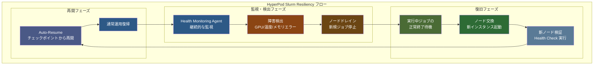
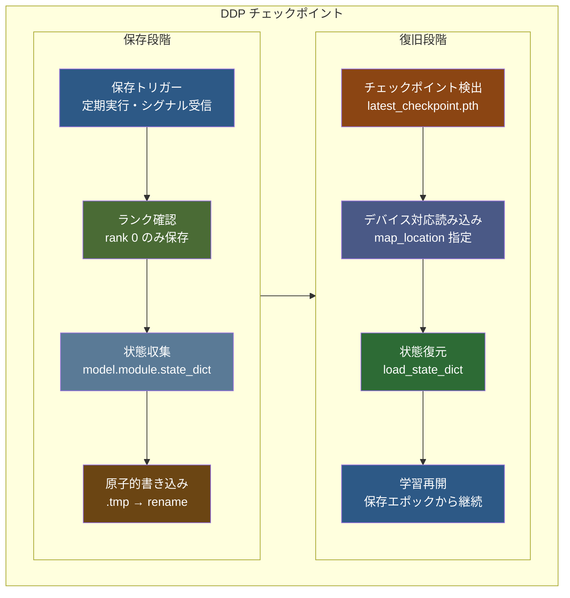

::::details 前提
:::message
**対象読者**: Amazon SageMaker HyperPod Slurm 環境を構築済みで、実際の resiliency 機能と observability の動作を確認したい方。分散学習の運用面に興味がある方。
:::
:::message
**ライセンス**: © 2025 littlemex.
本文および自作図表: CC BY 4.0
※公式ドキュメントからの引用や翻訳部分は原典の著作権に従います。
引用画像: 各画像の出典に記載されたライセンスに従います。
:::
:::message
一部 AI を用いて文章を作成します。レビューは実施しますが、見逃せない重大な間違いなどがあれば[こちらの Issue](https://github.com/littlemex/samples/issues) から連絡をお願いします。
:::
::::

:::message
実装が変更される可能性があるため必要に応じて[公式ドキュメント](https://awslabs.github.io/ai-on-sagemaker-hyperpod/docs/validation-and-testing/resiliency/overview)を確認してください。
:::

**本章では Amazon SageMaker HyperPod Slurm 環境における障害対応力の検証と可視化について実践します。**

---

[HyperPod Resiliency テストガイド](https://awslabs.github.io/ai-on-sagemaker-hyperpod/docs/validation-and-testing/resiliency/slurm-resiliency)と [Observability 設定手順](https://awslabs.github.io/ai-on-sagemaker-hyperpod/docs/add-ons/Observability/observability-slurm)、および[環境検証ガイド](https://awslabs.github.io/ai-on-sagemaker-hyperpod/docs/validation-and-testing/environment-validation/pytorch-environment-validation)を参照しながら、意図的な障害注入によるレジリエンシーの実験を実施します。

# 障害対応力検証

Amazon SageMaker HyperPod では、大規模な分散学習における障害からの自動復旧が重要な機能として実装されていることはすでにこれまでの章で解説しました。

本章では Amazon SageMaker HyperPod の Slurm 環境において、意図的な障害注入により障害対応力を実際に検証し、observability システムを通じて復旧プロセスを可視化します。制御された環境での障害シミュレーション、Auto-Resume 機能による自動復旧、そして Grafana ダッシュボードでのリアルタイム監視により、大規模学習環境における障害対応メカニズムの実効性を確認します。


## Node Recovery の動作フロー

[HyperPod の Automatic Node Recovery](https://docs.aws.amazon.com/sagemaker/latest/dg/sagemaker-hyperpod-resiliency-slurm-auto-resume.html) は、Health Monitoring Agent（HMA）による障害検出から始まります。HMA が GPU の温度異常、メモリエラー、NVLink 障害などのハードウェア問題を検出すると、該当ノードは自動的にドレイン状態にマークされます。実行中のジョブがすべて終了した後、問題のあるノードは新しいインスタンスに自動的に交換されます。

重要な点として、Slurm 環境での auto-resume 機能使用時は、問題のあるノードを常に交換し、リブートは実行されません。



## Auto-Resume とチェックポイントの関係

Auto-resume 機能は、[`--auto-resume=1` フラグを付けて投入されたジョブ](https://awslabs.github.io/ai-on-sagemaker-hyperpod/docs/validation-and-testing/resiliency/slurm-resiliency)に対して自動的に動作します。この機能が有効なジョブでは、ノード障害が発生した際に最後に保存されたチェックポイントから自動的に学習が再開されます。

チェックポイントの保存は、学習スクリプト内で定期的に実行される必要があります。PyTorch の `torch.save()` 関数を使用してモデルの state_dict、オプティマイザーの状態、現在のエポック数を保存することで、障害発生時の学習進捗の損失を最小限に抑えることができます。

::::details アプリケーション側チェックポイント実装の詳細

:::message
**重要**: HyperPod の Auto-Resume 機能は、インフラストラクチャレベルでのノード交換とジョブ再開を自動化しますが、学習状態の保存と復元はアプリケーション側で実装する必要があります。チェックポイント機能が適切に実装されていない場合、ノードが復旧してもゼロから学習を開始することになります。
:::

[PyTorch DistributedDataParallel (DDP)](https://docs.pytorch.org/tutorials/beginner/ddp_series_multigpu.html) でのチェックポイント保存と復旧の実装例を紹介しますが、FSDP の場合は[こちら](https://docs.pytorch.org/tutorials/recipes/distributed_checkpoint_recipe.html)を確認しましょう。



**1. DDP でのチェックポイント保存実装**

[PyTorch 公式 DDP チュートリアル](https://docs.pytorch.org/tutorials/beginner/ddp_series_multigpu.html)に従った標準的なチェックポイント保存パターンです。

```python
import torch
import torch.distributed as dist
import os

def save_checkpoint(model, optimizer, epoch, loss, checkpoint_dir):
    """DDP 対応チェックポイント保存"""
    # rank 0 のみがチェックポイントを保存
    if dist.get_rank() == 0:
        checkpoint_state = {
            'epoch': epoch,
            'model': model.module.state_dict(),  # DDP wrapper対応
            'optimizer': optimizer.state_dict(),
            'loss': loss,
            'world_size': dist.get_world_size(),
        }
        
        # 原子的保存で破損ファイルを防ぐ（重要な概念）
        checkpoint_path = os.path.join(checkpoint_dir, f"checkpoint_epoch_{epoch}.pth")
        tmp_path = f"{checkpoint_path}.tmp"
        
        # 1. 一時ファイルに完全に書き込み
        torch.save(checkpoint_state, tmp_path)
        
        # 2. 原子的操作で瞬時に置換
        # os.rename() はファイルシステムレベルで「All or Nothing」を保証
        # → 完全なファイルのみが存在し、部分的に書き込まれた破損ファイルは作られない
        os.rename(tmp_path, checkpoint_path)
        
        print(f"Checkpoint saved: {checkpoint_path}")
```

**2. DDP でのチェックポイント読み込み実装**

[PyTorch DDP ベストプラクティス](https://docs.pytorch.org/tutorials/beginner/ddp_series_multigpu.html#save-and-load-checkpoints)に従った復旧処理です。

```python
def load_checkpoint(model, optimizer, rank, checkpoint_path):
    """DDP 対応チェックポイント読み込み"""
    # 各rankに適切なデバイスマッピングを指定
    map_location = {'cuda:%d' % 0: 'cuda:%d' % rank}
    checkpoint_state = torch.load(checkpoint_path, map_location=map_location)
    
    # モデルとオプティマイザーの状態復元
    model.module.load_state_dict(checkpoint_state['model'])
    optimizer.load_state_dict(checkpoint_state['optimizer'])
    
    start_epoch = checkpoint_state['epoch'] + 1
    loss = checkpoint_state['loss']
    
    print(f"Resumed from epoch {start_epoch} on rank {rank}")
    return start_epoch, loss
```

**3. Auto-Resume との統合ポイント**

HyperPod の [`--auto-resume=1` フラグ](https://docs.aws.amazon.com/sagemaker/latest/dg/sagemaker-hyperpod-resiliency-slurm-auto-resume.html)と DDP を組み合わせるための実装パターンです。

```python
import signal

def setup_checkpoint_handler(model, optimizer, checkpoint_dir):
    """HyperPod Auto-Resume 対応のシグナルハンドラー"""
    def emergency_checkpoint_save(signum, frame):
        if dist.get_rank() == 0:
            emergency_path = os.path.join(checkpoint_dir, "emergency_checkpoint.pth")
            emergency_state = {
                'model': model.module.state_dict(),
                'optimizer': optimizer.state_dict(),
                'emergency': True
            }
            torch.save(emergency_state, emergency_path)
            print(f"Emergency checkpoint saved: {emergency_path}")
        exit(0)
    
    signal.signal(signal.SIGTERM, emergency_checkpoint_save)
    signal.signal(signal.SIGINT, emergency_checkpoint_save)

# 学習ループでの使用例（実際のマウントポイントを確認）
# FSx_MOUNT=$(df -h | grep fsx_lustre | awk '{print $NF}')
setup_checkpoint_handler(ddp_model, optimizer, f"{FSX_MOUNT}/checkpoints")
```

**4. 実運用での推奨設定**

- **保存頻度**: 5-15 分間隔または 100-500 ステップごと
- **保存場所**: FSx for Lustre の共有ディレクトリ (`/fsx/checkpoints/`)
- **デバイスマッピング**: 各 rank に適切な map_location 指定
- **DDP 対応**: `model.module.state_dict()` による正しい状態取得

DDP の詳細な実装方法については [PyTorch DDP チュートリアル](https://docs.pytorch.org/tutorials/beginner/ddp_series_multigpu.html)、HyperPod 環境での実践については本書の [PyTorch DDP 章](./pytorch-ddp.md) を参照してください。
::::

## Observability の階層構造

[HyperPod Slurm 環境での observability](https://awslabs.github.io/ai-on-sagemaker-hyperpod/docs/add-ons/Observability/observability-slurm) は、Amazon Managed Service for Prometheus と Amazon Managed Grafana を手動で統合することで実現されます。EKS 環境のワンクリック統合とは異なり、メトリクスエクスポーターの手動インストールと設定が必要となります。

Observability の階層は、前の章で説明した**統合テレメトリ**の概念を具現化したものです。クラスターレベルでは Slurm のジョブキューの状態、パーティション情報、ノードの利用率を監視します。ノードレベルでは GPU の温度、メモリ使用量、電力消費量、ネットワークトラフィックを追跡します。アプリケーションレベルでは学習の進捗、損失関数の値、スループットを記録します。

これらの多層的な監視により、障害の根本原因を迅速に特定し、予防的な対策を講じることが可能になります。例えば、特定の GPU で温度上昇が継続的に観測される場合、ハードウェア障害の予兆として事前にノードを交換することができます。

---

# Amazon SageMaker HyperPod Slurm での実装

ここからは、実際に HyperPod Slurm 環境で resiliency と observability を確認します。前章で構築したクラスターを基盤として、実際の障害注入から復旧までの一連の動作を検証しましょう。

## 前提条件

::::details インフラストラクチャ要件

:::message
**Slurm クラスターの準備**

本章の実践には、前章で構築した Amazon SageMaker HyperPod Slurm クラスターが稼働している必要があります。クラスターが削除されている場合は、[Amazon SageMaker HyperPod Getting Started by SLURM](./amazon-sagemaker-hyperpod-slurm-tutorial) を参照してクラスターを再作成してください。
:::

:::message
AWS CLI v2 とSSM Session Manager プラグインが適切に設定されていることを確認してください。また、Amazon Managed Service for Prometheus と Amazon Managed Grafana のワークスペースを作成する権限が必要です。
:::


## 推奨クラスター構成（resiliency テスト用）

実際の resiliency テストには GPU インスタンスの追加を推奨します。GPU 固有の障害パターンとその復旧動作を確認するためです。前章の CPU インスタンス構成に加えて、Worker グループに `ml.g5.xlarge` インスタンスを 2 台追加することで、より実践的なテスト環境を構築します。

### provisioning_parameters.json 自動更新スクリプト

この `provisioning_parameters.json` ファイルは `slurm.conf` という slurm の設定ファイルを Hyperpod が自動生成する際に利用されます。Quick Setup 時には勝手にこのファイルが作成されるため意識しませんでしたが、GPU インスタンスを追加する場合には**このファイルをアップデートする**必要があります。以下のスクリプトで GPU インスタンスグループを設定に追加し、S3 上の json ファイルを自動更新できます。

```bash
curl -sSL https://raw.githubusercontent.com/littlemex/samples/main/ml_distributed_experiment_collection/amazon-sagemaker-hyperpod-slurm-observability/update_provisioning_params.sh -o update_provisioning_params.sh
chmod +x update_provisioning_params.sh
```

スクリプトを実行する前に、`BUCKET_NAME` を実際の S3 バケット名に変更してください。本チュートリアルと異なるインスタンスタイプを指定する場合も手動でスクリプトを修正してください。

```bash
# スクリプト内のバケット名を更新してから実行
sed -i 's/your-hyperpod-bucket-name/actual-bucket-name-here/' update_provisioning_params.sh
./update_provisioning_params.sh
```

このスクリプトにより、GPU インスタンスグループ設定が適用されます。
::::

::::details GPU インスタンスの追加方法

:::message alert
`ml.g5.xlarge for cluster usage` などの Service Quotas を確認して必要に応じて追加リクエストしましょう。
:::

前章で作成した CPU ベースのクラスターに GPU インスタンスを追加する場合は、クラスター更新機能を使用します。既存のクラスターを削除することなく、新しいインスタンスグループを追加できます。


SageMaker HyperPod クラスター管理コンソールから対象クラスターを選択し、「Edit」を選択します。「Create instance group」を選択し、「gpu-worker」という名前で `ml.g5.xlarge` を 2 台追加します。更新には約 10 数分かかり、既存の CPU ワーカーノードに影響を与えることなく GPU ノードが追加されます。GPU ノードでは CUDA ドライバと NCCL ライブラリが自動的にインストールされ、分散学習に必要な環境が整備されます。
::::

::::details 調査中: パーティション自動作成の不具合

パーティションは Slurm において**計算ノードの論理的なグループ**です。クラスター内の計算リソースを目的や特性に応じて分類・管理するための仕組みです。特定のパーティションのみにジョブを割り振りたいようなケースで利用できます。

```
# 特定のパーティションでジョブ実行
sbatch --partition=gpu myjob.sh

# または slurm スクリプト内で指定
#SBATCH --partition=gpu
```

:::message alert
`provisioning_parameters.json` でパーティションが正しく設定されていても、HyperPod Agent が GPU インスタンス用の専用パーティション（例：`ml.g5.xlarge`）を slurm.conf に反映しない場合があります。GPU ノードは認識され、Slurm で利用可能ですが、すべて `dev` パーティションに配置される状況が発生します。
:::

以下のコマンドで手動でパーティション設定を追加できます。Nodes の IP アドレスはご自身の環境に合わせて変更してください。ただし本来であれば HyperPod Agent が自動管理する slurm.conf を直接編集することの推奨度は不明です。HyperPod Agent による設定更新のタイミングや頻度は現在調査中です。設定がクリアされる可能性もあるため自己判断で設定し、重要なワークロードではクラスターから作り直すことを推奨します。

```bash
# GPU パーティションを手動追加
echo "PartitionName=ml.g5.xlarge Nodes=ip-10-3-135-7,ip-10-3-96-49 Default=NO MaxTime=INFINITE State=UP" | sudo tee -a /opt/slurm/etc/slurm.conf
sudo scontrol reconfigure

# 設定確認
sinfo
```

### 確認された動作例
```bash
# 手動設定後の sinfo 出力例
sinfo
PARTITION     AVAIL  TIMELIMIT  NODES  STATE NODELIST
dev*             up   infinite      2  alloc ip-10-4-33-25,ip-10-4-198-29
dev*             up   infinite      2   idle ip-10-3-96-49,ip-10-3-135-7
ml.c5.4xlarge    up   infinite      2  alloc ip-10-4-33-25,ip-10-4-198-29
ml.g5.xlarge     up   infinite      2   idle ip-10-3-96-49,ip-10-3-135-7
```

手動設定により、インスタンスタイプに対応した専用パーティションが正常に作成され、適切なノードが割り当てられることを確認しています。

以下のように g5 グループは正常に `nvidia-smi` が実行できていることがわかります。

```bash
# CPU インスタンスで Driver がないのでコマンド失敗
srun --partition=ml.c5.4xlarge nvidia-smi
NVIDIA-SMI has failed because it couldn't communicate with the NVIDIA driver. Make sure that the latest NVIDIA driver is installed and running.

srun: error: ip-10-4-33-25: task 0: Exited with exit code 9

# GPU インスタンスでコマンド成功
ubuntu@ip-10-4-109-244:~$ srun --partition=ml.g5.xlarge nvidia-smi
Mon Dec 22 17:29:56 2025       
+-----------------------------------------------------------------------------------------+
| NVIDIA-SMI 580.95.05              Driver Version: 580.95.05      CUDA Version: 13.0     |
+-----------------------------------------+------------------------+----------------------+
| GPU  Name                 Persistence-M | Bus-Id          Disp.A | Volatile Uncorr. ECC |
| Fan  Temp   Perf          Pwr:Usage/Cap |           Memory-Usage | GPU-Util  Compute M. |
|                                         |                        |               MIG M. |
|=========================================+========================+======================|
|   0  NVIDIA A10G                    On  |   00000000:00:1E.0 Off |                    0 |
|  0%   17C    P8             11W /  300W |       0MiB /  23028MiB |      0%      Default |
|                                         |                        |                  N/A |
+-----------------------------------------+------------------------+----------------------+

+-----------------------------------------------------------------------------------------+
| Processes:                                                                              |
|  GPU   GI   CI              PID   Type   Process name                        GPU Memory |
|        ID   ID                                                               Usage      |
|=========================================================================================|
|  No running processes found                                                             |
+-----------------------------------------------------------------------------------------+
```
::::

## SageMaker Studio Integration の設定

[Amazon SageMaker Studio](https://docs.aws.amazon.com/sagemaker/latest/dg/studio.html) は、機械学習の統合開発環境（IDE）です。Web ベースの インターフェースにより、データサイエンティストや研究者が単一の環境で ML ライフサイクル全体を管理できます。柔軟にインスタンスタイプを選択でき、FSx for Lustre のファイル共有、MLflow 統合など多様な機能を有しています。

::::details Studio 補足情報
Studio と HyperPod の統合により、**開発環境と実行環境のシームレスな連携**が実現されます。具体的には、Studio の Code Editor でスクリプトを開発し、同じ環境のターミナルから `sbatch` コマンドで HyperPod クラスターにジョブを投入できます。FSx for Lustre の共有により、Studio で作成したコードやデータセットが HyperPod クラスター全体で即座に利用可能になります。自身のローカルのエディタの方が使いやすい場合はローカルエディタから Studio の Code Editor に接続することが可能です。そして [Presigned URL](https://docs.aws.amazon.com/sagemaker/latest/APIReference/API_CreatePresignedDomainUrl.html) でコンソールアクセスなしで CLI から Studio にアクセスすることも可能です。

ただし、Studio Code Editor では Docker がデフォルトでは無効であり、[Docker in Docker アーキテクチャ](https://docs.aws.amazon.com/sagemaker/latest/dg/studio-updated-local-get-started.html)となっているためネットワークモードや namespace に制約がかかっておりコンテナ開発には不向きです。
::::

:::message
- [ ] 1. Studio Domain の作成
- [ ] 2. User Profile の作成（CLI）
- [ ] 3. SageMaker Studio の設定
- [ ] 4. FSx for Lustre との統合確認
:::

::::details 1. Studio Domain の作成

:::message
なんのための作業か: awsome-distributed-training リポジトリの CloudFormation テンプレートを使用して、SageMaker Studio Domain と FSx for Lustre の完全統合環境を構築します。
:::

:::message
次のステップに進む条件: CloudFormation スタックが CREATE_COMPLETE 状態になり、Studio Domain が作成されていること。
:::

[awsome-distributed-training の CloudFormation テンプレート](https://github.com/aws-samples/awsome-distributed-training/blob/main/1.architectures/5.sagemaker-hyperpod/slurm-studio/studio-slurm.yaml)を使用することで、FSx for Lustre 統合、Slurm クライアントインストール、セキュリティ設定の自動化が実現されます。

## 自動化スクリプト（推奨方法）

既存の HyperPod クラスター情報から必要なパラメータを自動取得し、CloudFormation をデプロイするスクリプトを提供します：

```bash
curl -sSL https://raw.githubusercontent.com/littlemex/samples/main/ml_distributed_experiment_collection/amazon-sagemaker-hyperpod-slurm-observability/create_studio_domain.sh -o create_studio_domain.sh
chmod +x create_studio_domain.sh

# ご自身の環境に合わせて変更してください
# sed -i 's/cpu-slurm-cluster/your-actual-cluster-name/' create_studio_domain.sh
# sed -i 's/us-east-1/your-region/' create_studio_domain.sh

# スクリプト実行
./create_studio_domain.sh
```

このスクリプトにより、FSx for Lustre の完全統合、Slurm クライアントの自動インストール、セキュリティ設定の自動化が実現されます。以下のように SageMaker AI コンソールで正常に作成されたことが確認できます。


::::

::::details 2. User Profile の作成（CLI）

:::message
なんのための作業か: Studio Domain 作成後に User Profile を追加し、FSx パーティションの自動作成とアクセス権限設定を実行します。
:::

:::message
次のステップに進む条件: User Profile が InService 状態になり、FSx パーティションが自動作成されていること。
:::

CloudFormation による Domain 作成が完了したら、User Profile を作成します。FSx for Lustre ファイルシステムは `/fsx/shared/` ディレクトリを通じて HyperPod クラスターと Studio 環境間で共有されます。

## User Profile 作成スクリプト

```bash
# ダウンロードして内容確認
curl -sSL https://raw.githubusercontent.com/littlemex/samples/main/ml_distributed_experiment_collection/amazon-sagemaker-hyperpod-slurm-observability/create_user_profile.sh -o create_user_profile.sh

# スクリプト内容の確認
head -20 create_user_profile.sh

chmod +x create_user_profile.sh
```

## 実行手順

```bash
# デフォルトユーザーで作成
./create_user_profile.sh

# または特定のユーザー名を指定
./create_user_profile.sh data-scientist-1
```

User Profile 作成後、SageMaker コンソールから該当プロファイルでログインし、JupyterLab を起動できます。


::::

::::details 3. SageMaker Studio の設定

:::message
なんのための作業か: 作成した Studio 環境で Slurm コマンド、HyperPod クラスターとの連携が正常に動作することを確認します。
:::

:::message
次のステップに進む条件: Studio 内から FSx ファイルシステムにアクセスでき、Slurm コマンドが実行できること。
:::

## Code Editor Space の作成

:::message alert
User Profile を作成しただけでは FSx や Slurm クライアントにアクセスできません。以下の手順で Code Editor Space を手動作成し、FSx とライフサイクル設定をアタッチする必要があります。
:::

1. **SageMaker Studio にアクセス**
   - User Profile から Studio にログイン

2. **Code Editor Space の作成**
   - "Code Editor" をクリック
   - "Create Code Editor Space" をクリック
   - Space 名を入力（例：`hyperpod-workspace`）

3. **重要：FSx とライフサイクル設定のアタッチ**
   - "Attach custom filesystem - optional" ドロップダウンから **FSx for Lustre volume を選択**
   - "Lifecycle configuration" ドロップダウンから **利用可能なライフサイクル設定を選択**
   - "Run Space" をクリック

4. **Space の起動**
   - Code Editor が起動するまで数分待機
   - 正常に作成されたら "Open Code Editor" で Editor を起動


## Slurm コマンドの実行方法

Studio Code Editor では、**2 つのアプローチ**で Slurm コマンドを実行できます。

### 方法1: Login ノード経由のSSH

```bash
# GitHub から easy-ssh.sh を取得
curl -O https://raw.githubusercontent.com/aws-samples/awsome-distributed-training/main/1.architectures/5.sagemaker-hyperpod/easy-ssh.sh
chmod +x easy-ssh.sh

# SSH Key 生成（未作成の場合）
ssh-keygen -t rsa -b 4096 -f "$HOME/.ssh/id_rsa" -N ""

# Login ノードに接続設定
./easy-ssh.sh -c login cpu-slurm-cluster

# SSH 経由での Slurm 操作
ssh cpu-slurm-cluster sinfo
```

### 方法2: Studio Code Editor 内での直接実行

:::message alert
**制約事項**: Studio Code Editor はコンテナ環境で動作し、MUNGE 認証に課題があります。以下の手順は技術検証用であり、本番利用には方法 1 を推奨します。
:::

[MUNGE (MUNGE Uid 'N' Gid Emporium)](https://dun.github.io/munge/) は、Slurm クラスターにおける認証システムです。クラスター内の全ノード間で安全な通信を確保し、ユーザーがジョブを投入する際の認証に使用されます。MUNGE の動作には、すべてのノードで同じ秘密鍵（MUNGE キー）を共有する必要があり、この鍵の同期が Slurm コマンド実行の前提条件となります。

Studio Code Editor 内での Slurm クライアント直接実行には、HyperPod クラスターから MUNGE キーを取得し、Studio 環境で MUNGE デーモンを起動する必要があります。

```bash
curl -sSL https://raw.githubusercontent.com/littlemex/samples/main/ml_distributed_experiment_collection/amazon-sagemaker-hyperpod-slurm-observability/setup_slurm_munge_studio.sh -o setup_slurm_munge_studio.sh
chmod +x setup_slurm_munge_studio.sh

./setup_slurm_munge_studio.sh

# slurm コマンドの動作確認
sinfo
```
::::

::::details 4. FSx for Lustre との統合確認

:::message
なんのための作業か: Studio 環境から FSx for Lustre ファイルシステムへのアクセスを確認し、大容量データセットや学習結果の効率的な管理方法を習得します。
:::

:::message
次のステップに進む条件: Studio から FSx ファイルシステムにアクセスでき、ファイルの読み書きと共有が正常に動作すること。
:::

FSx for Lustre ファイルシステムは、Slurm クラスター内の全ノードで `/fsx` ディレクトリとしてマウントしました。User Profile 作成スクリプトの設定によって Studio 環境からも共有ディレクトリにアクセス可能です。Slurm Login ノードに接続して `/fsx` ディレクトリの権限設定を行いましょう。これによって Studio 側からも権限が許可されたディレクトリにアクセス可能です。

```bash
# HyperPod クラスターに SSH 接続
ssh cpu-slurm-cluster

# FSx の権限確認
ls -la /fsx

# Studio ユーザー向け共有ディレクトリの作成と権限設定
sudo mkdir -p /fsx/shared/studio-workspace
sudo chmod 755 /fsx/shared/studio-workspace 
sudo chown 10001:1001 /fsx/shared/studio-workspace

# 確認
ls -la /fsx/shared
```

権限設定後、Studio Code Editor から再度アクセスを試行します。

```bash
# Studio ターミナルから再試行
FSX_MOUNT=$(df -h | grep fsx_lustre | awk '{print $NF}')
touch $FSX_MOUNT/studio-workspace/testfile && ls -la $FSX_MOUNT/studio-workspace
```
::::

## Observability システムの構築

:::message
**更新された推奨手順**
- [ ] 1. Open Source Grafana + Amazon Managed Prometheus 環境のデプロイ
- [ ] 2. Grafana へのアクセス
- [ ] 3. Grafana データソースの設定
- [ ] 4. ダッシュボードのインポート
- [ ] 3. テストメトリクス投入環境の構築（オプション）
- [ ] 4. HyperPod クラスターへの Observability コンポーネントインストール
- [ ] 5. 動作確認とダッシュボード設定
:::

HyperPod Slurm Observability は、Amazon Managed Service for Prometheus と Grafana を組み合わせて実現します。


:::message alert
**重要**: Amazon Managed Grafana は AWS Organizations の**管理アカウント**でのみ完全に利用できます。メンバーアカウントでは IAM Identity Center の制限により Amazon Managed Grafana ワークスペースの作成ができません。
:::

ワークショップ用のアカウントなど Organization の管理アカウントが利用できないケースを想定して本章では OSS ベースの Grafana を EC2 にデプロイして利用します。管理アカウントを利用できるケースでは[こちら](https://awslabs.github.io/ai-on-sagemaker-hyperpod/docs/add-ons/Observability/observability-slurm)の手順でフルマネージドの Grafana + Prometheus 構成を実現することも可能です。本番環境ではこちらを利用することを推奨します。

::::details  1. Open Source Grafana + Amazon Managed Prometheus 環境のデプロイ

CloudFormation テンプレートを使用して OSS Grafana と Amazon Managed Prometheus を構築します。

:::message
EC2 インスタンスのセキュリティグループの inbound アクセス制限をかけるために許可する IP アドレスを指定することができます。
:::

```bash
# スクリプトと依存ファイルをダウンロード
curl -sSL https://raw.githubusercontent.com/littlemex/samples/main/ml_distributed_experiment_collection/amazon-sagemaker-hyperpod-slurm-observability/setup_hyperpod_observability_oss.sh -o setup_hyperpod_observability_oss.sh
curl -sSL https://raw.githubusercontent.com/littlemex/samples/main/ml_distributed_experiment_collection/amazon-sagemaker-hyperpod-slurm-observability/ecr-policy.json -o ecr-policy.json
curl -sSL https://raw.githubusercontent.com/littlemex/samples/main/ml_distributed_experiment_collection/amazon-sagemaker-hyperpod-slurm-observability/cluster-observability-with-os-grafana.yaml -o cluster-observability-with-os-grafana.yaml

# 実行権限を付与
chmod +x setup_hyperpod_observability_oss.sh

# 基本実行（IP アドレス自動検出）
./setup_hyperpod_observability_oss.sh

# または特定の IP アドレスを指定
./setup_hyperpod_observability_oss.sh --ip 192.168.1.100
```

作成の完了を待って Grafana ダッシュボード URL を確認しましょう。

```bash
# 作成状況の確認
./setup_hyperpod_observability_oss.sh --check-status
==============================================
HyperPod Slurm Open Source Grafana Setup
==============================================
....
🌐 Grafana Access Information:
   URL: http://XXX:3000
   Default Login: admin/admin
   Security: Access restricted to XXX/32

🔗 Direct Browser Access:
   Copy this URL to your browser: http://XXX:3000

📋 Next Steps:
   1. Access Grafana and change default password
   2. Configure Prometheus data source
   3. Import observability dashboards

===============================================
```

## 補足: SigV4 認証の設定

テンプレートでは、Grafana の SigV4 認証が事前設定されます。

```bash
# CloudFormation UserData で設定される環境変数
export AWS_SDK_LOAD_CONFIG=true
export GF_AUTH_SIGV4_AUTH_ENABLED=true

# Grafana 設定ファイルでの SigV4 有効化
[auth.sigv4]
enabled = true
verbose_logging = false
```
::::

::::details 2. Grafana へのアクセス


- [ ] ブラウザで取得した URL にアクセス
- [ ] デフォルト認証情報でログイン：`admin / admin`
- [ ] Grafana ホームダッシュボードが表示されることを確認


::::

::::details  3. Grafana データソースの設定

:::message alert
**重要**: Grafana の通常の Prometheus データソースの SigV4 認証は**非推奨**となりました。Amazon Managed Service for Prometheus 専用プラグインを使用する必要があります。
:::

Grafana と Amazon Managed Prometheus workspace を接続するための Prometheus エンドポイント URL を取得しましょう。

```bash
# Prometheus エンドポイント URL を取得（query用URL）
aws cloudformation describe-stacks \
  --stack-name HyperpodSlurmOSObservability \
  --region us-east-1 \
  --query 'Stacks[0].Outputs[?OutputKey==`PrometheusQueryURL`].OutputValue' \
  --output text

# 出力例: https://aps-workspaces.us-east-1.amazonaws.com/workspaces/ws-97d9f0f9-95bb-4779-9908-d42c2cd2a288/
```


- [ ] 1. **Connections > Data Sources** を選択
- [ ] 2. **Add data source** をクリック


- [ ] 3. ⚠️ **Amazon Managed Service for Prometheus** を選択（通常の Prometheus ではない）


- [ ] 4. **以下の設定を入力**：
   - [ ] **Prometheus server URL**: 上記で取得した URL
   - [ ] **Authentication Provider**: `AWS SDK Default` を選択
   - [ ] **Default Region**: `us-east-1` を入力
- [ ] 5. **Save & test** でテスト成功を確認
::::

::::details 4. ダッシュボードのインポート

Prometheus データソース設定完了後、以下の公式ダッシュボードテンプレートをインポートします。


- [ ] 1. **Dashboards > New > Import** を選択


- [ ] 2. 以下の URL を順次インポート
  - [ ] **Slurm Exporter Dashboard**:
    https://grafana.com/grafana/dashboards/4323-slurm-dashboard/
  - [ ] **Node Exporter Dashboard**:
    https://grafana.com/grafana/dashboards/1860-node-exporter-full/
  - [ ] **DCGM Exporter Dashboard**（GPU メトリクス）:
    https://grafana.com/grafana/dashboards/12239-nvidia-dcgm-exporter-dashboard/
  - [ ] **FSx for Lustre Dashboard**:
    https://grafana.com/grafana/dashboards/20906-fsx/


::::

::::details 5. 


:::message
FSx ダッシュボード用には追加で Amazon CloudWatch データソースの設定が必要です。同様の手順で CloudWatch データソースを追加してください。
:::

**5. メトリクス収集状況の確認**

HyperPod クラスター側で Observability コンポーネントが正常に動作していることを確認します。

```bash
# HyperPod クラスターに SSH でアクセス
ssh cpu-slurm-cluster

# Slurm Exporter サービス状況確認
systemctl status slurm_exporter.service --no-pager -l

# Docker コンテナ状況確認  
docker ps

# ワーカーノードの状況確認
srun -N 2 docker ps
```

**正常な出力例**：
```
● slurm_exporter.service - Prometheus SLURM Exporter
   Loaded: loaded (/etc/systemd/system/slurm_exporter.service; enabled; vendor preset: enabled)
   Active: active (running) since Thu 2025-09-11 04:27:30 UTC; 1 day 20h ago
Main PID: 2408455 (slurm_exporter)

CONTAINER ID   IMAGE                                                     COMMAND           CREATED       STATUS        NAMES
da773247a262   602401143452.dkr.ecr.us-west-2.amazonaws.com/hyperpod/otel_collector:v1754424030352   "/app/otelcollector"   6 hours ago   Up 6 hours    otel-collector
8c18b89cc1a3   602401143452.dkr.ecr.us-west-2.amazonaws.com/hyperpod/node_exporter:v1.9.1            "/bin/node_exporter"   45 hours ago  Up 45 hours   node-exporter
48396ed3e3ef   602401143452.dkr.ecr.us-west-2.amazonaws.com/hyperpod/dcgm_exporter:4.1.1-4.0.4-ubi9   "/usr/local/dcgm/dcg"  45 hours ago  Up 45 hours   dcgm-exporter
```

**セキュリティ機能の詳細**:
- **動的 IP 制限**: 現在のアクセス元 IP アドレスを自動取得し、Grafana インスタンスへのアクセスを特定 IP/32 に制限
- **CloudFormation Parameter 方式**: IP アドレスを Parameter として安全に渡し、テンプレート改変の必要性を排除
- **IP アドレスバリデーション**: 手動指定された IP アドレスの形式検証
- **SigV4 事前設定**: Grafana の SigV4 認証を CloudFormation で自動有効化

**技術改良点**:
- **ローカルテンプレート**: 外部依存を排除し、改良されたテンプレートをローカルに配置
- **高性能インスタンス**: m5.xlarge への変更で Grafana の応答性能を向上
- **暗号化ストレージ**: 50GB GP3 暗号化 EBS による安全なデータ保存
- **堅牢なデプロイ**: CloudFormation シグナルによるデプロイ完了確認


### Amazon Managed Grafana 自動化スクリプト（管理アカウント用）

AWS Organizations 管理アカウントで利用する場合の完全自動化スクリプトです。

```bash
# Amazon Managed Grafana 用スクリプトのダウンロード
curl -sSL https://raw.githubusercontent.com/littlemex/samples/main/ml_distributed_experiment_collection/amazon-sagemaker-hyperpod-slurm-observability/setup_hyperpod_observability.sh -o setup_hyperpod_observability.sh
chmod +x setup_hyperpod_observability.sh

# 実行
./setup_hyperpod_observability.sh
```

**両スクリプトの共通機能**:
- **冪等性保証**: 安全に複数回実行可能
- **IAM権限の自動追加**: AmazonPrometheusRemoteWriteAccess とECRアクセスポリシーの追加
- **CloudFormation 自動デプロイ**: Prometheus workspace と Grafana の自動作成
- **ライフサイクルスクリプト更新**: S3からの取得、Observability設定の有効化、アップロード
- **クラスターへのインストール**: 既存クラスターへのObservabilityコンポーネント配布

**残る手動作業**: Grafana へのアクセスとダッシュボード設定が必要です。

## Prometheus API 404エラーのトラブルシューティング

Amazon SageMaker HyperPod の observability 実装において、Prometheus API へのアクセス時に404エラーが発生する場合があります。本セクションでは、この問題の根本原因と解決方法を詳述します。

### 問題の症状

以下のような症状が発生している場合、データソース設定に問題がある可能性があります：

- Grafana で「Please enter a valid URL」エラーが表示
- Prometheus API クエリが404 Not Foundで失敗
- メトリクスブラウザーで「No options found」が表示
- Explore 画面で「No data」が継続

### 根本原因の分析

**AWS 公式ドキュメントの要求事項**
[Amazon Managed Service for Prometheus で使用する Grafana オープンソースまたは Grafana Enterprise のセットアップ](https://docs.aws.amazon.com/ja_jp/prometheus/latest/userguide/AMP-onboard-query-standalone-grafana.html)では以下が明確に要求されています：

1. **専用プラグイン使用**: 通常の「Prometheus」データソースではなく「Amazon Managed Service for Prometheus」データソースを使用
2. **URL 形式**: エンドポイントから `/api/v1/query` パスを削除する必要がある
3. **SigV4 認証**: AWS SDK Default 認証プロバイダーを使用

**既存スクリプトの問題点**
- データソースの URL 設定が手動であり、設定漏れが発生
- 正しいデータソースタイプの指定が不明確
- 404エラー時の自動復旧機能が未実装

### 自動解決ツールの提供

#### 1. Grafana データソース自動設定スクリプト

```bash
# スクリプトをダウンロード
curl -sSL https://raw.githubusercontent.com/littlemex/samples/main/ml_distributed_experiment_collection/amazon-sagemaker-hyperpod-slurm-observability/configure_grafana_datasource.sh -o configure_grafana_datasource.sh
chmod +x configure_grafana_datasource.sh

# 自動設定実行
./configure_grafana_datasource.sh
```

このスクリプトは以下を自動実行します：
- CloudFormation スタックから正しい Prometheus Query URL を取得
- Grafana API 経由での「Amazon Managed Service for Prometheus」データソース作成
- AWS SDK Default 認証プロバイダーの設定
- データソース接続テストの実行

#### 2. テストメトリクス投入環境

実際にクエリ可能なメトリクスが存在しない場合、テスト用のメトリクス投入環境を構築できます：

```bash
# テストメトリクス環境スクリプトをダウンロード
curl -sSL https://raw.githubusercontent.com/littlemex/samples/main/ml_distributed_experiment_collection/amazon-sagemaker-hyperpod-slurm-observability/setup_test_metrics.sh -o setup_test_metrics.sh
chmod +x setup_test_metrics.sh

# テスト環境起動
./setup_test_metrics.sh start

# 環境状況確認
./setup_test_metrics.sh status

# 環境停止
./setup_test_metrics.sh stop
```

**テスト環境の構成**:
- **メトリクスサーバー**: http://localhost:8000/metrics（Prometheus形式のサンプルメトリクス配信）
- **Prometheus**: http://localhost:9090（ローカルPrometheus、AMP remote_write設定済み）
- **サンプルメトリクス**: CPU、メモリ、ディスク、ネットワーク、HyperPod風メトリクス

#### 3. 利用可能なテストメトリクス

投入されるサンプルメトリクスの一覧：

**システムメトリクス**:
```promql
cpu_usage_percent{instance="test-server",cpu="cpu0",job="sample"}
memory_usage_percent{instance="test-server",job="sample"}
disk_read_bytes_total{device="nvme0n1",instance="test-server"}
network_receive_bytes_total{interface="eth0",instance="test-server"}
```

**HyperPod 風メトリクス**:
```promql
slurm_jobs_running{cluster="cpu-slurm-cluster",partition="cpu"}
slurm_nodes_total{cluster="cpu-slurm-cluster",state="allocated"}
gpu_utilization_percent{instance="worker-01",gpu_id="0"}
```

### 解決手順の実行例

```bash
# Step 1: 既存環境確認
aws cloudformation describe-stacks --stack-name HyperpodSlurmOSObservability --region us-east-1 --query 'Stacks[0].Outputs'

# Step 2: データソース自動設定
./configure_grafana_datasource.sh

# Step 3: テストメトリクス投入
./setup_test_metrics.sh start

# Step 4: Grafana での確認
# ブラウザで http://YOUR-GRAFANA-IP:3000/explore にアクセス
# Amazon Managed Service for Prometheus データソースを選択
# cpu_usage_percent などのメトリクスをクエリ
```

### 検証結果の例

正常に設定された場合、以下のような結果が得られます：

**ローカル Prometheus での確認**:
```json
{
  "status":"success",
  "data":{
    "resultType":"vector",
    "result":[
      {
        "metric":{
          "__name__":"cpu_usage_percent",
          "cpu":"cpu0",
          "instance":"host.docker.internal:8000",
          "job":"sample-metrics-test"
        },
        "value":[1766750694.011,"76.53"]
      }
    ]
  }
}
```

**Grafana メトリクスブラウザー**:
- ✅ `cpu_usage_percent`, `disk_read_bytes_total`, `gpu_utilization_percent` など
- ✅ メトリクスのグラフ表示が正常動作
- ✅ Amazon Managed Service for Prometheus データソース接続成功

### 手動設定（詳細制御が必要な場合）

自動化スクリプトを使用しない場合の手動設定手順です。

Observability アーキテクチャは以下のようになっています。


### 推奨デプロイ方法

今回実証した成功手順に基づく推奨構成です：

**Open Source Grafana + Amazon Managed Prometheus 構成（推奨）**
- ✅ AWS Organizations メンバーアカウントで完全動作
- ✅ IAM Identity Center 不要
- ✅ 完全自動化スクリプトによる構築
- ✅ 404エラー自動解決機能付き

**Amazon Managed Grafana + Amazon Managed Prometheus 構成（管理アカウント限定）**
- AWS Organizations 管理アカウントでのみ利用可能
- IAM Identity Center が必要
- フルマネージド環境

::::details 1. Open Source Grafana + Amazon Managed Prometheus 環境のデプロイ

:::message
なんのための作業か: AWS Organizations メンバーアカウントでも利用可能な Open Source Grafana と Amazon Managed Prometheus の統合環境を自動構築します。
:::

:::message
次のステップに進む条件: CloudFormation スタックが CREATE_COMPLETE 状態になり、Grafana インスタンスと Amazon Managed Prometheus workspace が利用可能になること。
:::

**自動化スクリプトによる一括構築**

```bash
# Open Source Grafana 用スクリプトのダウンロード
curl -sSL https://raw.githubusercontent.com/littlemex/samples/main/ml_distributed_experiment_collection/amazon-sagemaker-hyperpod-slurm-observability/setup_hyperpod_observability_oss.sh -o setup_hyperpod_observability_oss.sh
chmod +x setup_hyperpod_observability_oss.sh

# 事前検証（推奨）
./setup_hyperpod_observability_oss.sh --dry-run

# 基本実行（IP アドレス自動検出）
./setup_hyperpod_observability_oss.sh

# 特定 IP アドレス指定
./setup_hyperpod_observability_oss.sh --ip 192.168.1.100
```

**スクリプトが自動実行する内容**:
- HyperPod クラスター存在確認
- IAM 権限自動追加（AmazonPrometheusRemoteWriteAccess、ECR アクセス）
- CloudFormation による Amazon Managed Prometheus workspace 作成
- Grafana EC2 インスタンス起動（SigV4 認証事前設定済み）
- IP アドレス制限によるセキュリティ設定
- ライフサイクルスクリプトの自動更新

**取得される接続情報**:
```bash
# CloudFormation スタック状況確認
aws cloudformation describe-stacks \
  --stack-name HyperpodSlurmOSObservability \
  --region us-east-1 \
  --query 'Stacks[0].Outputs'

# Grafana URL の表示例
# http://3.81.149.57:3000
```
::::

::::details 2. Grafana データソースの自動設定

:::message
なんのための作業か: Grafana と Amazon Managed Prometheus の接続を自動設定し、404エラーの発生を防止します。
:::

:::message
次のステップに進む条件: Grafana で Amazon Managed Service for Prometheus データソースが正常に動作し、接続テストが成功すること。
:::

**データソース自動設定スクリプト**

```bash
# 自動設定スクリプトのダウンロード
curl -sSL https://raw.githubusercontent.com/littlemex/samples/main/ml_distributed_experiment_collection/amazon-sagemaker-hyperpod-slurm-observability/configure_grafana_datasource.sh -o configure_grafana_datasource.sh
chmod +x configure_grafana_datasource.sh

# 自動設定実行
./configure_grafana_datasource.sh
```

**スクリプトが実行する処理**:
1. CloudFormation から Prometheus Query URL の自動取得
2. Grafana API 経由での「Amazon Managed Service for Prometheus」データソース作成
3. AWS SDK Default 認証プロバイダーの設定
4. データソース接続テストの実行と結果確認

**手動確認方法**:
```bash
# Grafana にブラウザでアクセス
# 1. http://YOUR-GRAFANA-IP:3000 にアクセス
# 2. admin/admin でログイン
# 3. Connections > Data sources で設定確認
# 4. Amazon Managed Service for Prometheus データソースの存在確認
```
::::

::::details 3. テストメトリクス投入環境の構築（オプション）

:::message
なんのための作業か: HyperPod クラスターからの実際のメトリクス投入前に、Grafana でのクエリ動作を確認するためのテスト環境を構築します。
:::

:::message
次のステップに進む条件: Grafana でサンプルメトリクスのグラフ表示が成功し、メトリクスブラウザーでメトリクス一覧が表示されること。
:::

**統合テスト環境の起動**

```bash
# テストメトリクス環境スクリプトのダウンロード
curl -sSL https://raw.githubusercontent.com/littlemex/samples/main/ml_distributed_experiment_collection/amazon-sagemaker-hyperpod-slurm-observability/setup_test_metrics.sh -o setup_test_metrics.sh
chmod +x setup_test_metrics.sh

# テスト環境起動（Docker 使用）
./setup_test_metrics.sh start

# 環境状況確認
./setup_test_metrics.sh status
```

**テスト環境の構成**:
- **メトリクスサーバー**: http://localhost:8000/metrics
- **Prometheus**: http://localhost:9090
- **Grafana**: CloudFormation で作成された URL

**生成されるサンプルメトリクス**:
```promql
# システムメトリクス
cpu_usage_percent{instance="test-server",cpu="cpu0",job="sample"}
memory_usage_percent{instance="test-server",job="sample"}
disk_read_bytes_total{device="nvme0n1",instance="test-server"}
network_receive_bytes_total{interface="eth0",instance="test-server"}

# HyperPod 風メトリクス
slurm_jobs_running{cluster="cpu-slurm-cluster",partition="cpu"}
slurm_nodes_total{cluster="cpu-slurm-cluster",state="allocated"}
gpu_utilization_percent{instance="worker-01",gpu_id="0"}
```

**動作確認方法**:
```bash
# メトリクス生成状況確認
curl http://localhost:8000/metrics | head -10

# ローカル Prometheus でのクエリテスト
curl -s "http://localhost:9090/api/v1/query?query=cpu_usage_percent" | jq .

# テスト環境停止
./setup_test_metrics.sh stop
```
::::

::::details 4. HyperPod クラスターへの Observability コンポーネントインストール

:::message
なんのための作業か: HyperPod クラスターの全ノードにメトリクス収集コンポーネントをインストールし、Amazon Managed Prometheus への送信を開始します。
:::

:::message
次のステップに進む条件: 全ノードでメトリクスエクスポーター（Node Exporter、DCGM Exporter、Slurm Exporter）が稼働し、Prometheus にメトリクスが送信されていること。
:::

**HyperPod クラスターでのインストール**

```bash
# 1. HyperPod クラスターのヘッドノードにアクセス
ssh cpu-slurm-cluster

# 2. 環境変数の設定
export NUM_WORKERS=2  # 実際のワーカーノード数に調整
export PROMETHEUS_REMOTE_WRITE_URL=$(aws cloudformation describe-stacks \
  --stack-name HyperpodSlurmOSObservability \
  --region us-east-1 \
  --query 'Stacks[0].Outputs[?OutputKey==`PrometheusRemoteWriteURL`].OutputValue' \
  --output text)
export ARG_ADVANCED=--advanced

# 3. Observability インストールスクリプトの準備
mkdir -p ~/observability-setup
cd ~/observability-setup
git clone https://github.com/aws-samples/awsome-distributed-training.git
cd awsome-distributed-training/1.architectures/5.sagemaker-hyperpod/LifecycleScripts/base-config/observability

# 4. 既存サービスの停止（再インストール時）
sudo python3 stop_observability.py --node-type controller || true
srun -N $NUM_WORKERS sudo python3 stop_observability.py --node-type compute || true

# 5. Observability コンポーネントのインストール
sudo python3 install_observability.py --node-type controller --prometheus-remote-write-url $PROMETHEUS_REMOTE_WRITE_URL $ARG_ADVANCED
srun -N $NUM_WORKERS sudo python3 install_observability.py --node-type compute --prometheus-remote-write-url $PROMETHEUS_REMOTE_WRITE_URL $ARG_ADVANCED
```

**インストール確認**:
```bash
# Controller ノード（ヘッドノード）での確認
systemctl status slurm_exporter.service --no-pager -l
docker ps

# Worker ノードでの確認
srun -N $NUM_WORKERS docker ps
srun -N $NUM_WORKERS systemctl is-active node_exporter
```

**成功時の出力例**:
```
● slurm_exporter.service - Prometheus SLURM Exporter
   Active: active (running)

CONTAINER ID   IMAGE                    COMMAND              STATUS
da773247a262   hyperpod/otel_collector  "/app/otelcollector" Up 6 hours
8c18b89cc1a3   hyperpod/node_exporter   "/bin/node_exporter" Up 45 hours
```
::::

::::details 5. 動作確認とダッシュボード設定

:::message
なんのための作業か: 構築した Observability 環境でメトリクスの収集・表示が正常に動作することを確認し、監視ダッシュボードを設定します。
:::

:::message
次のステップに進む条件: Grafana でメトリクスクエリが成功し、各種ダッシュボードでリアルタイム監視が可能になること。
:::

**Grafana でのメトリクス確認**

1. **Grafana アクセス**
```bash
# Grafana URL の取得
GRAFANA_URL=$(aws cloudformation describe-stacks \
  --stack-name HyperpodSlurmOSObservability \
  --region us-east-1 \
  --query 'Stacks[0].Outputs[?OutputKey==`GrafanaInstanceAddress`].OutputValue' \
  --output text)

echo "Grafana URL: $GRAFANA_URL"
# ブラウザで該当 URL にアクセス（admin/admin でログイン）
```

2. **メトリクスクエリテスト**
- **Explore ページ**（/explore）にアクセス
- **Amazon Managed Service for Prometheus** データソースを選択
- **メトリクスブラウザー**でメトリクス一覧確認
- **サンプルクエリ実行**:
  ```promql
  # CPU 使用率
  cpu_usage_percent
  
  # Slurm ジョブ状況
  slurm_jobs_running
  
  # GPU 使用率（GPU ノード存在時）
  gpu_utilization_percent
  ```

3. **ダッシュボードのインポート**

**推奨ダッシュボード**:
```bash
# Grafana UI で以下を順次インポート
# Dashboards > New > Import で URL を入力

# Node Exporter Dashboard (ID: 1860)
https://grafana.com/grafana/dashboards/1860-node-exporter-full/

# Slurm Dashboard (ID: 4323)
https://grafana.com/grafana/dashboards/4323-slurm-dashboard/

# DCGM Exporter Dashboard (ID: 12239) - GPU ノード用
https://grafana.com/grafana/dashboards/12239-nvidia-dcgm-exporter-dashboard/
```

4. **メトリクス収集の確認**

```bash
# Amazon Managed Prometheus でのメトリクス確認
aws amp query-metrics \
  --workspace-id $(aws cloudformation describe-stacks \
    --stack-name HyperpodSlurmOSObservability \
    --region us-east-1 \
    --query 'Stacks[0].Outputs[?OutputKey==`PrometheusWorkspaceId`].OutputValue' \
    --output text | sed 's|.*workspace/||') \
  --query "up" \
  --start-time $(date -u -d '5 minutes ago' +%Y-%m-%dT%H:%M:%S.%3NZ) \
  --end-time $(date -u +%Y-%m-%dT%H:%M:%S.%3NZ) \
  --region us-east-1
```

**成功時の確認項目**:
- ✅ Grafana でメトリクスブラウザーにメトリクス一覧表示
- ✅ Explore でのクエリ実行とグラフ表示成功
- ✅ ダッシュボードでのリアルタイム監視データ表示
- ✅ HyperPod クラスターから Amazon Managed Prometheus へのメトリクス送信確認

**トラブルシューティング**:
メトリクスが表示されない場合は、以下を確認：
```bash
# HyperPod クラスターでのサービス状況
ssh cpu-slurm-cluster "systemctl status slurm_exporter.service"
ssh cpu-slurm-cluster "docker ps"

# Prometheus ワークスペースへの送信確認
ssh cpu-slurm-cluster "docker logs otel-collector | grep -i error"
```
::::

## まとめ

本章では、Amazon SageMaker HyperPod の Slurm 環境における observability 機能を追加しました。

Amazon Managed Prometheus と Grafana を用いた統合監視システムにより、障害の予兆検出から復旧プロセスの可視化まで、包括的な observability が実現されます。特に GPU 温度監視による予防的アラートは、深刻な障害を未然に防ぐ有効な手段として機能します。多層的なメトリクス収集により、クラスター、ノード、アプリケーションの各レベルでの問題を迅速に特定できます。次回は続きとして今回導入した observability 機能を活用していきましょう。
