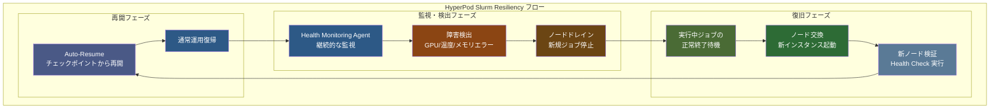
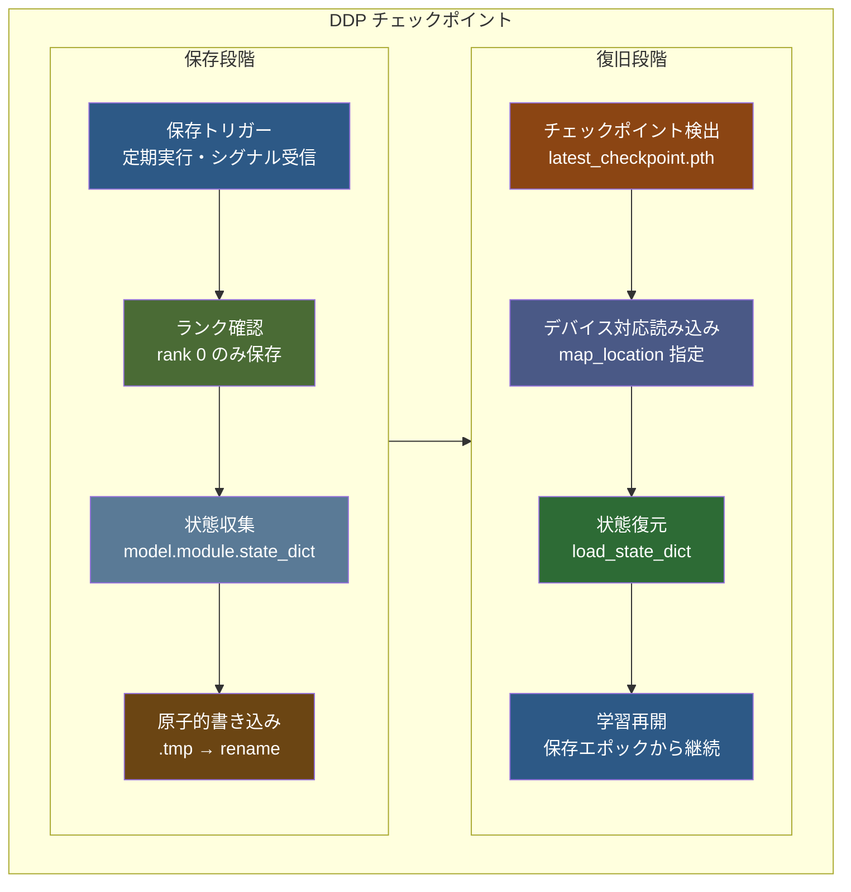

::::details 前提
:::message
**対象読者**: Amazon SageMaker HyperPod Slurm 環境を構築済みで、実際の resiliency 機能と observability の動作を確認したい方。分散学習の運用面に興味がある方。
:::
:::message
**ライセンス**: © 2025 littlemex.
本文および自作図表: CC BY 4.0
※公式ドキュメントからの引用や翻訳部分は原典の著作権に従います。
引用画像: 各画像の出典に記載されたライセンスに従います。
:::
:::message
一部 AI を用いて文章を作成します。レビューは実施しますが、見逃せない重大な間違いなどがあれば[こちらの Issue](https://github.com/littlemex/samples/issues) から連絡をお願いします。
:::
::::

:::message
実装が変更される可能性があるため必要に応じて[公式ドキュメント](https://awslabs.github.io/ai-on-sagemaker-hyperpod/docs/validation-and-testing/resiliency/overview)を確認してください。
:::

**本章では Amazon SageMaker HyperPod Slurm 環境における障害対応力の検証と可視化について実践します。**

---

[HyperPod Resiliency テストガイド](https://awslabs.github.io/ai-on-sagemaker-hyperpod/docs/validation-and-testing/resiliency/slurm-resiliency)と [Observability 設定手順](https://awslabs.github.io/ai-on-sagemaker-hyperpod/docs/add-ons/Observability/observability-slurm)、および[環境検証ガイド](https://awslabs.github.io/ai-on-sagemaker-hyperpod/docs/validation-and-testing/environment-validation/pytorch-environment-validation)を参照しながら、意図的な障害注入によるレジリエンシーの実験を実施します。

# 障害対応力検証

Amazon SageMaker HyperPod では、大規模な分散学習における障害からの自動復旧が重要な機能として実装されていることはすでにこれまでの章で解説しました。

本章では Amazon SageMaker HyperPod の Slurm 環境において、意図的な障害注入により障害対応力を実際に検証し、observability システムを通じて復旧プロセスを可視化します。制御された環境での障害シミュレーション、Auto-Resume 機能による自動復旧、そして Grafana ダッシュボードでのリアルタイム監視により、大規模学習環境における障害対応メカニズムの実効性を確認します。


## Node Recovery の動作フロー

[HyperPod の Automatic Node Recovery](https://docs.aws.amazon.com/sagemaker/latest/dg/sagemaker-hyperpod-resiliency-slurm-auto-resume.html) は、Health Monitoring Agent（HMA）による障害検出から始まります。HMA が GPU の温度異常、メモリエラー、NVLink 障害などのハードウェア問題を検出すると、該当ノードは自動的にドレイン状態にマークされます。実行中のジョブがすべて終了した後、問題のあるノードは新しいインスタンスに自動的に交換されます。

重要な点として、Slurm 環境での auto-resume 機能使用時は、問題のあるノードを常に交換し、リブートは実行されません。



## Auto-Resume とチェックポイントの関係

Auto-resume 機能は、[`--auto-resume=1` フラグを付けて投入されたジョブ](https://awslabs.github.io/ai-on-sagemaker-hyperpod/docs/validation-and-testing/resiliency/slurm-resiliency)に対して自動的に動作します。この機能が有効なジョブでは、ノード障害が発生した際に最後に保存されたチェックポイントから自動的に学習が再開されます。

チェックポイントの保存は、学習スクリプト内で定期的に実行される必要があります。PyTorch の `torch.save()` 関数を使用してモデルの state_dict、オプティマイザーの状態、現在のエポック数を保存することで、障害発生時の学習進捗の損失を最小限に抑えることができます。

::::details アプリケーション側チェックポイント実装の詳細

:::message
**重要**: HyperPod の Auto-Resume 機能は、インフラストラクチャレベルでのノード交換とジョブ再開を自動化しますが、学習状態の保存と復元はアプリケーション側で実装する必要があります。チェックポイント機能が適切に実装されていない場合、ノードが復旧してもゼロから学習を開始することになります。
:::

[PyTorch DistributedDataParallel (DDP)](https://docs.pytorch.org/tutorials/beginner/ddp_series_multigpu.html) でのチェックポイント保存と復旧の実装例を紹介しますが、FSDP の場合は[こちら](https://docs.pytorch.org/tutorials/recipes/distributed_checkpoint_recipe.html)を確認しましょう。



**1. DDP でのチェックポイント保存実装**

[PyTorch 公式 DDP チュートリアル](https://docs.pytorch.org/tutorials/beginner/ddp_series_multigpu.html)に従った標準的なチェックポイント保存パターンです。

```python
import torch
import torch.distributed as dist
import os

def save_checkpoint(model, optimizer, epoch, loss, checkpoint_dir):
    """DDP 対応チェックポイント保存"""
    # rank 0 のみがチェックポイントを保存
    if dist.get_rank() == 0:
        checkpoint_state = {
            'epoch': epoch,
            'model': model.module.state_dict(),  # DDP wrapper対応
            'optimizer': optimizer.state_dict(),
            'loss': loss,
            'world_size': dist.get_world_size(),
        }
        
        # 原子的保存で破損ファイルを防ぐ（重要な概念）
        checkpoint_path = os.path.join(checkpoint_dir, f"checkpoint_epoch_{epoch}.pth")
        tmp_path = f"{checkpoint_path}.tmp"
        
        # 1. 一時ファイルに完全に書き込み
        torch.save(checkpoint_state, tmp_path)
        
        # 2. 原子的操作で瞬時に置換
        # os.rename() はファイルシステムレベルで「All or Nothing」を保証
        # → 完全なファイルのみが存在し、部分的に書き込まれた破損ファイルは作られない
        os.rename(tmp_path, checkpoint_path)
        
        print(f"Checkpoint saved: {checkpoint_path}")
```

**2. DDP でのチェックポイント読み込み実装**

[PyTorch DDP ベストプラクティス](https://docs.pytorch.org/tutorials/beginner/ddp_series_multigpu.html#save-and-load-checkpoints)に従った復旧処理です。

```python
def load_checkpoint(model, optimizer, rank, checkpoint_path):
    """DDP 対応チェックポイント読み込み"""
    # 各rankに適切なデバイスマッピングを指定
    map_location = {'cuda:%d' % 0: 'cuda:%d' % rank}
    checkpoint_state = torch.load(checkpoint_path, map_location=map_location)
    
    # モデルとオプティマイザーの状態復元
    model.module.load_state_dict(checkpoint_state['model'])
    optimizer.load_state_dict(checkpoint_state['optimizer'])
    
    start_epoch = checkpoint_state['epoch'] + 1
    loss = checkpoint_state['loss']
    
    print(f"Resumed from epoch {start_epoch} on rank {rank}")
    return start_epoch, loss
```

**3. Auto-Resume との統合ポイント**

HyperPod の [`--auto-resume=1` フラグ](https://docs.aws.amazon.com/sagemaker/latest/dg/sagemaker-hyperpod-resiliency-slurm-auto-resume.html)と DDP を組み合わせるための実装パターンです。

```python
import signal

def setup_checkpoint_handler(model, optimizer, checkpoint_dir):
    """HyperPod Auto-Resume 対応のシグナルハンドラー"""
    def emergency_checkpoint_save(signum, frame):
        if dist.get_rank() == 0:
            emergency_path = os.path.join(checkpoint_dir, "emergency_checkpoint.pth")
            emergency_state = {
                'model': model.module.state_dict(),
                'optimizer': optimizer.state_dict(),
                'emergency': True
            }
            torch.save(emergency_state, emergency_path)
            print(f"Emergency checkpoint saved: {emergency_path}")
        exit(0)
    
    signal.signal(signal.SIGTERM, emergency_checkpoint_save)
    signal.signal(signal.SIGINT, emergency_checkpoint_save)

# 学習ループでの使用例（実際のマウントポイントを確認）
# FSx_MOUNT=$(df -h | grep fsx_lustre | awk '{print $NF}')
setup_checkpoint_handler(ddp_model, optimizer, f"{FSX_MOUNT}/checkpoints")
```

**4. 実運用での推奨設定**

- **保存頻度**: 5-15 分間隔または 100-500 ステップごと
- **保存場所**: FSx for Lustre の共有ディレクトリ (`/fsx/checkpoints/`)
- **デバイスマッピング**: 各 rank に適切な map_location 指定
- **DDP 対応**: `model.module.state_dict()` による正しい状態取得

DDP の詳細な実装方法については [PyTorch DDP チュートリアル](https://docs.pytorch.org/tutorials/beginner/ddp_series_multigpu.html)、HyperPod 環境での実践については本書の [PyTorch DDP 章](./pytorch-ddp.md) を参照してください。
::::

## Observability の階層構造

[HyperPod Slurm 環境での observability](https://awslabs.github.io/ai-on-sagemaker-hyperpod/docs/add-ons/Observability/observability-slurm) は、Amazon Managed Service for Prometheus と Amazon Managed Grafana を手動で統合することで実現されます。EKS 環境のワンクリック統合とは異なり、メトリクスエクスポーターの手動インストールと設定が必要となります。

Observability の階層は、前の章で説明した**統合テレメトリ**の概念を具現化したものです。クラスターレベルでは Slurm のジョブキューの状態、パーティション情報、ノードの利用率を監視します。ノードレベルでは GPU の温度、メモリ使用量、電力消費量、ネットワークトラフィックを追跡します。アプリケーションレベルでは学習の進捗、損失関数の値、スループットを記録します。

これらの多層的な監視により、障害の根本原因を迅速に特定し、予防的な対策を講じることが可能になります。例えば、特定の GPU で温度上昇が継続的に観測される場合、ハードウェア障害の予兆として事前にノードを交換することができます。

---

# Amazon SageMaker HyperPod Slurm での実装

ここからは、実際に HyperPod Slurm 環境で resiliency と observability を確認します。前章で構築したクラスターを基盤として、実際の障害注入から復旧までの一連の動作を検証しましょう。

## 前提条件

::::details インフラストラクチャ要件

:::message
**Slurm クラスターの準備**

本章の実践には、前章で構築した Amazon SageMaker HyperPod Slurm クラスターが稼働している必要があります。クラスターが削除されている場合は、[Amazon SageMaker HyperPod Getting Started by SLURM](./amazon-sagemaker-hyperpod-slurm-tutorial) を参照してクラスターを再作成してください。
:::

:::message
AWS CLI v2 とSSM Session Manager プラグインが適切に設定されていることを確認してください。また、Amazon Managed Service for Prometheus と Amazon Managed Grafana のワークスペースを作成する権限が必要です。
:::


## 推奨クラスター構成（resiliency テスト用）

実際の resiliency テストには GPU インスタンスの追加を推奨します。GPU 固有の障害パターンとその復旧動作を確認するためです。前章の CPU インスタンス構成に加えて、Worker グループに `ml.g5.xlarge` インスタンスを 2 台追加することで、より実践的なテスト環境を構築します。

### provisioning_parameters.json 自動更新スクリプト

この `provisioning_parameters.json` ファイルは `slurm.conf` という slurm の設定ファイルを Hyperpod が自動生成する際に利用されます。Quick Setup 時には勝手にこのファイルが作成されるため意識しませんでしたが、GPU インスタンスを追加する場合には**このファイルをアップデートする**必要があります。以下のスクリプトで GPU インスタンスグループを設定に追加し、S3 上の json ファイルを自動更新できます。

```bash
curl -sSL https://raw.githubusercontent.com/littlemex/samples/main/ml_distributed_experiment_collection/amazon-sagemaker-hyperpod-slurm-observability/update_provisioning_params.sh -o update_provisioning_params.sh
chmod +x update_provisioning_params.sh
```

スクリプトを実行する前に、`BUCKET_NAME` を実際の S3 バケット名に変更してください。本チュートリアルと異なるインスタンスタイプを指定する場合も手動でスクリプトを修正してください。

```bash
# スクリプト内のバケット名を更新してから実行
sed -i 's/your-hyperpod-bucket-name/actual-bucket-name-here/' update_provisioning_params.sh
./update_provisioning_params.sh
```

このスクリプトにより、GPU インスタンスグループ設定が適用されます。
::::

::::details GPU インスタンスの追加方法

:::message alert
`ml.g5.xlarge for cluster usage` などの Service Quotas を確認して必要に応じて追加リクエストしましょう。
:::

前章で作成した CPU ベースのクラスターに GPU インスタンスを追加する場合は、クラスター更新機能を使用します。既存のクラスターを削除することなく、新しいインスタンスグループを追加できます。


SageMaker HyperPod クラスター管理コンソールから対象クラスターを選択し、「Edit」を選択します。「Create instance group」を選択し、「gpu-worker」という名前で `ml.g5.xlarge` を 2 台追加します。更新には約 10 数分かかり、既存の CPU ワーカーノードに影響を与えることなく GPU ノードが追加されます。GPU ノードでは CUDA ドライバと NCCL ライブラリが自動的にインストールされ、分散学習に必要な環境が整備されます。
::::

::::details 調査中: パーティション自動作成の不具合

パーティションは Slurm において**計算ノードの論理的なグループ**です。クラスター内の計算リソースを目的や特性に応じて分類・管理するための仕組みです。特定のパーティションのみにジョブを割り振りたいようなケースで利用できます。

```
# 特定のパーティションでジョブ実行
sbatch --partition=gpu myjob.sh

# または slurm スクリプト内で指定
#SBATCH --partition=gpu
```

:::message alert
`provisioning_parameters.json` でパーティションが正しく設定されていても、HyperPod Agent が GPU インスタンス用の専用パーティション（例：`ml.g5.xlarge`）を slurm.conf に反映しない場合があります。GPU ノードは認識され、Slurm で利用可能ですが、すべて `dev` パーティションに配置される状況が発生します。
:::

以下のコマンドで手動でパーティション設定を追加できます。Nodes の IP アドレスはご自身の環境に合わせて変更してください。ただし本来であれば HyperPod Agent が自動管理する slurm.conf を直接編集することの推奨度は不明です。HyperPod Agent による設定更新のタイミングや頻度は現在調査中です。設定がクリアされる可能性もあるため自己判断で設定し、重要なワークロードではクラスターから作り直すことを推奨します。

```bash
# GPU パーティションを手動追加
echo "PartitionName=ml.g5.xlarge Nodes=ip-10-3-135-7,ip-10-3-96-49 Default=NO MaxTime=INFINITE State=UP" | sudo tee -a /opt/slurm/etc/slurm.conf
sudo scontrol reconfigure

# 設定確認
sinfo
```

### 確認された動作例
```bash
# 手動設定後の sinfo 出力例
sinfo
PARTITION     AVAIL  TIMELIMIT  NODES  STATE NODELIST
dev*             up   infinite      2  alloc ip-10-4-33-25,ip-10-4-198-29
dev*             up   infinite      2   idle ip-10-3-96-49,ip-10-3-135-7
ml.c5.4xlarge    up   infinite      2  alloc ip-10-4-33-25,ip-10-4-198-29
ml.g5.xlarge     up   infinite      2   idle ip-10-3-96-49,ip-10-3-135-7
```

手動設定により、インスタンスタイプに対応した専用パーティションが正常に作成され、適切なノードが割り当てられることを確認しています。

以下のように g5 グループは正常に `nvidia-smi` が実行できていることがわかります。

```bash
# CPU インスタンスで Driver がないのでコマンド失敗
srun --partition=ml.c5.4xlarge nvidia-smi
NVIDIA-SMI has failed because it couldn't communicate with the NVIDIA driver. Make sure that the latest NVIDIA driver is installed and running.

srun: error: ip-10-4-33-25: task 0: Exited with exit code 9

# GPU インスタンスでコマンド成功
ubuntu@ip-10-4-109-244:~$ srun --partition=ml.g5.xlarge nvidia-smi
Mon Dec 22 17:29:56 2025       
+-----------------------------------------------------------------------------------------+
| NVIDIA-SMI 580.95.05              Driver Version: 580.95.05      CUDA Version: 13.0     |
+-----------------------------------------+------------------------+----------------------+
| GPU  Name                 Persistence-M | Bus-Id          Disp.A | Volatile Uncorr. ECC |
| Fan  Temp   Perf          Pwr:Usage/Cap |           Memory-Usage | GPU-Util  Compute M. |
|                                         |                        |               MIG M. |
|=========================================+========================+======================|
|   0  NVIDIA A10G                    On  |   00000000:00:1E.0 Off |                    0 |
|  0%   17C    P8             11W /  300W |       0MiB /  23028MiB |      0%      Default |
|                                         |                        |                  N/A |
+-----------------------------------------+------------------------+----------------------+

+-----------------------------------------------------------------------------------------+
| Processes:                                                                              |
|  GPU   GI   CI              PID   Type   Process name                        GPU Memory |
|        ID   ID                                                               Usage      |
|=========================================================================================|
|  No running processes found                                                             |
+-----------------------------------------------------------------------------------------+
```
::::

## SageMaker Studio Integration の設定

[Amazon SageMaker Studio](https://docs.aws.amazon.com/sagemaker/latest/dg/studio.html) は、機械学習の統合開発環境（IDE）です。Web ベースの インターフェースにより、データサイエンティストや研究者が単一の環境で ML ライフサイクル全体を管理できます。柔軟にインスタンスタイプを選択でき、FSx for Lustre のファイル共有、MLflow 統合など多様な機能を有しています。

::::details Studio 補足情報
Studio と HyperPod の統合により、**開発環境と実行環境のシームレスな連携**が実現されます。具体的には、Studio の Code Editor でスクリプトを開発し、同じ環境のターミナルから `sbatch` コマンドで HyperPod クラスターにジョブを投入できます。FSx for Lustre の共有により、Studio で作成したコードやデータセットが HyperPod クラスター全体で即座に利用可能になります。自身のローカルのエディタの方が使いやすい場合はローカルエディタから Studio の Code Editor に接続することが可能です。そして [Presigned URL](https://docs.aws.amazon.com/sagemaker/latest/APIReference/API_CreatePresignedDomainUrl.html) でコンソールアクセスなしで CLI から Studio にアクセスすることも可能です。

ただし、Studio Code Editor では Docker がデフォルトでは無効であり、[Docker in Docker アーキテクチャ](https://docs.aws.amazon.com/sagemaker/latest/dg/studio-updated-local-get-started.html)となっているためネットワークモードや namespace に制約がかかっておりコンテナ開発には不向きです。
::::

:::message
- [ ] 1. Studio Domain の作成
- [ ] 2. User Profile の作成（CLI）
- [ ] 3. SageMaker Studio の設定
- [ ] 4. FSx for Lustre との統合確認
:::

::::details 1. Studio Domain の作成

:::message
なんのための作業か: awsome-distributed-training リポジトリの CloudFormation テンプレートを使用して、SageMaker Studio Domain と FSx for Lustre の完全統合環境を構築します。
:::

:::message
次のステップに進む条件: CloudFormation スタックが CREATE_COMPLETE 状態になり、Studio Domain が作成されていること。
:::

[awsome-distributed-training の CloudFormation テンプレート](https://github.com/aws-samples/awsome-distributed-training/blob/main/1.architectures/5.sagemaker-hyperpod/slurm-studio/studio-slurm.yaml)を使用することで、FSx for Lustre 統合、Slurm クライアントインストール、セキュリティ設定の自動化が実現されます。

## 自動化スクリプト（推奨方法）

既存の HyperPod クラスター情報から必要なパラメータを自動取得し、CloudFormation をデプロイするスクリプトを提供します：

```bash
curl -sSL https://raw.githubusercontent.com/littlemex/samples/main/ml_distributed_experiment_collection/amazon-sagemaker-hyperpod-slurm-observability/create_studio_domain.sh -o create_studio_domain.sh
chmod +x create_studio_domain.sh

# ご自身の環境に合わせて変更してください
# sed -i 's/cpu-slurm-cluster/your-actual-cluster-name/' create_studio_domain.sh
# sed -i 's/us-east-1/your-region/' create_studio_domain.sh

# スクリプト実行
./create_studio_domain.sh
```

このスクリプトにより、FSx for Lustre の完全統合、Slurm クライアントの自動インストール、セキュリティ設定の自動化が実現されます。以下のように SageMaker AI コンソールで正常に作成されたことが確認できます。


::::

::::details 2. User Profile の作成（CLI）

:::message
なんのための作業か: Studio Domain 作成後に User Profile を追加し、FSx パーティションの自動作成とアクセス権限設定を実行します。
:::

:::message
次のステップに進む条件: User Profile が InService 状態になり、FSx パーティションが自動作成されていること。
:::

CloudFormation による Domain 作成が完了したら、User Profile を作成します。FSx for Lustre ファイルシステムは `/fsx/shared/` ディレクトリを通じて HyperPod クラスターと Studio 環境間で共有されます。

## User Profile 作成スクリプト

```bash
# ダウンロードして内容確認
curl -sSL https://raw.githubusercontent.com/littlemex/samples/main/ml_distributed_experiment_collection/amazon-sagemaker-hyperpod-slurm-observability/create_user_profile.sh -o create_user_profile.sh

# スクリプト内容の確認
head -20 create_user_profile.sh

chmod +x create_user_profile.sh
```

## 実行手順

```bash
# デフォルトユーザーで作成
./create_user_profile.sh

# または特定のユーザー名を指定
./create_user_profile.sh data-scientist-1
```

User Profile 作成後、SageMaker コンソールから該当プロファイルでログインし、JupyterLab を起動できます。


::::

::::details 3. SageMaker Studio の設定

:::message
なんのための作業か: 作成した Studio 環境で Slurm コマンド、HyperPod クラスターとの連携が正常に動作することを確認します。
:::

:::message
次のステップに進む条件: Studio 内から FSx ファイルシステムにアクセスでき、Slurm コマンドが実行できること。
:::

## Code Editor Space の作成

:::message alert
User Profile を作成しただけでは FSx や Slurm クライアントにアクセスできません。以下の手順で Code Editor Space を手動作成し、FSx とライフサイクル設定をアタッチする必要があります。
:::

1. **SageMaker Studio にアクセス**
   - User Profile から Studio にログイン

2. **Code Editor Space の作成**
   - "Code Editor" をクリック
   - "Create Code Editor Space" をクリック
   - Space 名を入力（例：`hyperpod-workspace`）

3. **重要：FSx とライフサイクル設定のアタッチ**
   - "Attach custom filesystem - optional" ドロップダウンから **FSx for Lustre volume を選択**
   - "Lifecycle configuration" ドロップダウンから **利用可能なライフサイクル設定を選択**
   - "Run Space" をクリック

4. **Space の起動**
   - Code Editor が起動するまで数分待機
   - 正常に作成されたら "Open Code Editor" で Editor を起動


## Slurm コマンドの実行方法

Studio Code Editor では、**2 つのアプローチ**で Slurm コマンドを実行できます。

### 方法1: Login ノード経由のSSH

```bash
# GitHub から easy-ssh.sh を取得
curl -O https://raw.githubusercontent.com/aws-samples/awsome-distributed-training/main/1.architectures/5.sagemaker-hyperpod/easy-ssh.sh
chmod +x easy-ssh.sh

# SSH Key 生成（未作成の場合）
ssh-keygen -t rsa -b 4096 -f "$HOME/.ssh/id_rsa" -N ""

# Login ノードに接続設定
./easy-ssh.sh -c login cpu-slurm-cluster

# SSH 経由での Slurm 操作
ssh cpu-slurm-cluster sinfo
```

### 方法2: Studio Code Editor 内での直接実行

:::message alert
**制約事項**: Studio Code Editor はコンテナ環境で動作し、MUNGE 認証に課題があります。以下の手順は技術検証用であり、本番利用には方法 1 を推奨します。
:::

[MUNGE (MUNGE Uid 'N' Gid Emporium)](https://dun.github.io/munge/) は、Slurm クラスターにおける認証システムです。クラスター内の全ノード間で安全な通信を確保し、ユーザーがジョブを投入する際の認証に使用されます。MUNGE の動作には、すべてのノードで同じ秘密鍵（MUNGE キー）を共有する必要があり、この鍵の同期が Slurm コマンド実行の前提条件となります。

Studio Code Editor 内での Slurm クライアント直接実行には、HyperPod クラスターから MUNGE キーを取得し、Studio 環境で MUNGE デーモンを起動する必要があります。

```bash
curl -sSL https://raw.githubusercontent.com/littlemex/samples/main/ml_distributed_experiment_collection/amazon-sagemaker-hyperpod-slurm-observability/setup_slurm_munge_studio.sh -o setup_slurm_munge_studio.sh
chmod +x setup_slurm_munge_studio.sh

./setup_slurm_munge_studio.sh

# slurm コマンドの動作確認
sinfo
```
::::

::::details 3. FSx for Lustre との統合確認

:::message
なんのための作業か: Studio 環境から FSx for Lustre ファイルシステムへのアクセスを確認し、大容量データセットや学習結果の効率的な管理方法を習得します。
:::

:::message
次のステップに進む条件: Studio から FSx ファイルシステムにアクセスでき、ファイルの読み書きと共有が正常に動作すること。
:::

FSx for Lustre ファイルシステムは、Slurm クラスター内の全ノードで `/fsx` ディレクトリとしてマウントしました。User Profile 作成スクリプトの設定によって Studio 環境からも共有ディレクトリにアクセス可能です。Slurm Login ノードに接続して `/fsx` ディレクトリの権限設定を行いましょう。これによって Studio 側からも権限が許可されたディレクトリにアクセス可能です。

```bash
# HyperPod クラスターに SSH 接続
ssh cpu-slurm-cluster

# FSx の権限確認
ls -la /fsx

# Studio ユーザー向け共有ディレクトリの作成と権限設定
sudo mkdir -p /fsx/shared/studio-workspace
sudo chmod 755 /fsx/shared/studio-workspace 
sudo chown 10001:1001 /fsx/shared/studio-workspace

# 確認
ls -la /fsx/shared
```

権限設定後、Studio Code Editor から再度アクセスを試行します。

```bash
# Studio ターミナルから再試行
FSX_MOUNT=$(df -h | grep fsx_lustre | awk '{print $NF}')
touch $FSX_MOUNT/studio-workspace/testfile && ls -la $FSX_MOUNT/studio-workspace
```
::::

## Observability システムの構築

:::message
1. Amazon Managed Prometheus workspace の作成
2. Amazon Managed Grafana workspace の作成
3. メトリクスエクスポーターのインストール
4. カスタムダッシュボードの設定
5. アラート設定の構築
:::

::::details 1. Amazon Managed Prometheus workspace の作成

:::message
なんのための作業か: HyperPod クラスターのメトリクス収集基盤として Amazon Managed Prometheus workspace を作成し、時系列データの効率的な保存と検索を可能にします。
:::

:::message
次のステップに進む条件: Prometheus workspace が Active 状態になり、エンドポイント URL が利用可能になること。
:::

[Amazon Managed Service for Prometheus](https://docs.aws.amazon.com/prometheus/) は、Prometheus のメトリクス収集とクエリ機能をマネージド形式で提供します。AWS コンソールから Amazon Managed Service for Prometheus を選択し、新しい workspace を作成します。

Workspace 名として「hyperpod-slurm-metrics」など、目的を明確にした名前を設定します。この workspace では、クラスターから収集される GPU メトリクス、Slurm ジョブ統計、ネットワーク性能データ、システムリソース使用量が時系列データとして保存されます。Prometheus の retention period はデフォルトで 150 日に設定されており、長期間のトレンド分析が可能です。

Workspace 作成後、IAM ロールを設定してクラスターノードからのメトリクス送信を許可します。AmazonPrometheusRemoteWriteAccess ポリシーを含むロールを作成し、HyperPod クラスターのインスタンスプロファイルに追加します。これにより、各ノードで動作するメトリクスエクスポーターが Prometheus workspace にデータを送信できるようになります。
::::

::::details 2. Amazon Managed Grafana workspace の作成

:::message
なんのための作業か: Prometheus で収集したメトリクスを可視化するため、Amazon Managed Grafana workspace を作成し、リアルタイム監視ダッシュボードを構築します。
:::

:::message
次のステップに進む条件: Grafana workspace が Active 状態になり、Web UI にアクセスしてダッシュボードを作成できること。
:::

[Amazon Managed Grafana](https://docs.aws.amazon.com/grafana/) は、Grafana のダッシュボード機能をマネージド形式で提供します。AWS コンソールから Amazon Managed Grafana を選択し、新しい workspace を作成します。認証方式として AWS IAM Identity Center（旧 AWS SSO）を選択することで、組織内でのアクセス管理を統一できます。

Grafana workspace の作成時に、データソースとして前のステップで作成した Amazon Managed Prometheus workspace を指定します。この連携により、Prometheus に蓄積された時系列データを Grafana ダッシュボードで可視化できます。また、Amazon CloudWatch をデータソースとして追加することで、AWS サービスレベルのメトリクスも同一ダッシュボード内で監視できます。

Workspace が Active になったら、Grafana Web UI にアクセスしてデフォルトダッシュボードを確認します。HyperPod 向けのダッシュボードテンプレートをインポートし、GPU 使用率、メモリ消費量、ネットワークトラフィック、Slurm ジョブ統計を可視化します。これらのダッシュボードは、クラスター運用における意思決定の重要な情報源となります。
::::

::::details 3. メトリクスエクスポーターのインストール

:::message
なんのための作業か: クラスターの各ノードにメトリクスエクスポーターをインストールし、システムおよびアプリケーションレベルのメトリクスを Prometheus に送信する仕組みを構築します。
:::

:::message
次のステップに進む条件: 各ノードでエクスポーターが正常に動作し、Prometheus workspace にメトリクスが送信されていること。
:::

[メトリクスエクスポーターのインストール](https://awslabs.github.io/ai-on-sagemaker-hyperpod/docs/add-ons/Observability/observability-slurm-install-exporters)では、複数のエクスポーターをクラスター全体に配布する必要があります。最初に Node Exporter をインストールして、CPU、メモリ、ディスク、ネットワークの基本的なシステムメトリクスを収集します。

GPU ノードには NVIDIA DCGM Exporter を追加インストールし、GPU 固有のメトリクスを収集します。DCGM Exporter は GPU の温度、電力消費量、メモリ使用量、利用率をリアルタイムで監視し、障害の予兆検出に重要な役割を果たします。

Slurm 固有のメトリクスには Slurm Exporter を使用します。このエクスポーターは、ジョブキューの長さ、パーティション別のノード使用状況、ユーザー別のリソース消費量を追跡します。これらの情報は、クラスター運用の効率性評価と容量計画に活用されます。

各エクスポーターの設定ファイルで、前のステップで作成した Prometheus workspace の remote write エンドポイント URL を指定します。エクスポーター起動後、`curl` コマンドでローカルメトリクスエンドポイントにアクセスし、データが正しく収集されていることを確認します。
::::

::::details 4. カスタムダッシュボードの設定

:::message
なんのための作業か: HyperPod Slurm 環境に特化したカスタムダッシュボードを作成し、運用に必要な重要メトリクスを効率的に監視できる環境を整備します。
:::

:::message
次のステップに進む条件: GPU Health、Slurm Jobs、Network Performance の各ダッシュボードが作成され、リアルタイムデータが表示されること。
:::

Grafana Web UI でカスタムダッシュボードを作成し、HyperPod Slurm 環境の特性に合わせたパネル構成を実装します。GPU Health ダッシュボードでは、各 GPU の温度、電力消費量、メモリ使用率をノード別に表示します。しきい値ベースの色分けにより、異常状態を視覚的に識別できるよう設定します。

Slurm Jobs ダッシュボードでは、実行中ジョブ数、待機中ジョブ数、完了ジョブ数を時系列グラフで表示します。パーティション別、ユーザー別の内訳により、リソース利用状況の詳細分析が可能になります。また、ジョブの平均実行時間と待機時間をヒストグラムで表示し、スケジューリング効率の評価指標とします。

Network Performance ダッシュボードでは、ノード間通信の帯域幅使用量とレイテンシを監視します。特に分散学習で重要な All-Reduce 通信パターンを識別し、ネットワークボトルネックの早期発見を支援します。InfiniBand や EFA のメトリクスを組み合わせることで、高性能通信ネットワークの状態を包括的に把握できます。

各ダッシュボードには時間範囲選択機能を設定し、過去 1 時間から過去 30 日までの柔軟な期間分析を可能にします。また、ダッシュボードの自動更新間隔を 30 秒に設定し、リアルタイム監視を実現します。
::::

::::details 5. アラート設定の構築

:::message
なんのための作業か: 異常状態の自動検出とアラート通知システムを構築し、障害の早期発見と迅速な対応を可能にします。
:::

:::message
次のステップに進む条件: GPU 温度、ジョブ待機時間、ノード障害に関するアラートが設定され、テスト通知が正常に送信されること。
:::

Grafana のアラート機能を使用して、クリティカルな状態の自動検出システムを構築します。GPU 温度アラートでは、85°C を超える温度が 5 分間継続した場合にアラートを発火するよう設定します。この閾値は NVIDIA GPU の標準的な動作温度範囲を考慮した設定であり、ハードウェア障害の予兆を早期に検出します。

ジョブ待機時間アラートでは、特定のパーティションでジョブが 30 分以上待機状態にある場合にアラートを送信します。これにより、リソース不足やスケジューリングの問題を迅速に識別できます。また、ノード数の急激な減少を検出するアラートも設定し、複数ノードの同時障害や意図しない削除を監視します。

アラート通知は Amazon SNS を通じて電子メールや Slack チャンネルに送信されます。通知メッセージには問題の詳細情報、推奨される対応手順、関連するダッシュボードへのリンクを含めることで、迅速な問題解決を支援します。アラートの重要度に応じて通知頻度を調整し、重要でないアラートによる通知疲れを防ぎます。
::::

## まとめ

本章では、Amazon SageMaker HyperPod の Slurm 環境における observability 機能を追加しました。

Amazon Managed Prometheus と Grafana を用いた統合監視システムにより、障害の予兆検出から復旧プロセスの可視化まで、包括的な observability が実現されます。特に GPU 温度監視による予防的アラートは、深刻な障害を未然に防ぐ有効な手段として機能します。多層的なメトリクス収集により、クラスター、ノード、アプリケーションの各レベルでの問題を迅速に特定できます。次回は続きとして今回導入した observability 機能を活用していきましょう。
