::::details 前提
:::message
**対象読者**: Amazon SageMaker HyperPod Slurm 環境を構築済みで、実際の resiliency 機能と observability の動作を確認したい方。分散学習の運用面に興味がある方。
:::
:::message
**ライセンス**: © 2025 littlemex.
本文および自作図表: CC BY 4.0
※公式ドキュメントからの引用や翻訳部分は原典の著作権に従います。
引用画像: 各画像の出典に記載されたライセンスに従います。
:::
:::message
一部 AI を用いて文章を作成します。レビューは実施しますが、見逃せない重大な間違いなどがあれば[こちらの Issue](https://github.com/littlemex/samples/issues) から連絡をお願いします。
:::
::::

:::message
実装が変更される可能性があるため必要に応じて[公式ドキュメント](https://awslabs.github.io/ai-on-sagemaker-hyperpod/docs/validation-and-testing/resiliency/overview)を確認してください。
:::

**本章では Amazon SageMaker HyperPod Slurm 環境における障害対応力の検証と可視化について実践します。**

---

[HyperPod Resiliency テストガイド](https://awslabs.github.io/ai-on-sagemaker-hyperpod/docs/validation-and-testing/resiliency/slurm-resiliency)と [Observability 設定手順](https://awslabs.github.io/ai-on-sagemaker-hyperpod/docs/add-ons/Observability/observability-slurm)、および[環境検証ガイド](https://awslabs.github.io/ai-on-sagemaker-hyperpod/docs/validation-and-testing/environment-validation/pytorch-environment-validation)を参照しながら、意図的な障害注入によるレジリエンシーの実験を実施します。

# 障害対応力検証

Amazon SageMaker HyperPod では、大規模な分散学習における障害からの自動復旧が重要な機能として実装されていることはすでにこれまでの章で解説しました。

本章では Amazon SageMaker HyperPod の Slurm 環境において、意図的な障害注入により障害対応力を実際に検証し、observability システムを通じて復旧プロセスを可視化します。制御された環境での障害シミュレーション、Auto-Resume 機能による自動復旧、そして Grafana ダッシュボードでのリアルタイム監視により、大規模学習環境における障害対応メカニズムの実効性を確認します。


## Node Recovery の動作フロー

[HyperPod の Automatic Node Recovery](https://docs.aws.amazon.com/sagemaker/latest/dg/sagemaker-hyperpod-resiliency-slurm-auto-resume.html) は、Health Monitoring Agent（HMA）による障害検出から始まります。HMA が GPU の温度異常、メモリエラー、NVLink 障害などのハードウェア問題を検出すると、該当ノードは自動的にドレイン状態にマークされます。実行中のジョブがすべて終了した後、問題のあるノードは新しいインスタンスに自動的に交換されます。

重要な点として、Slurm 環境での auto-resume 機能使用時は、問題のあるノードを常に交換し、リブートは実行されません。

```mermaid
graph TB
    subgraph "HyperPod Slurm Resiliency フロー"
        subgraph "監視・検出フェーズ"
            HMA[Health Monitoring Agent<br/>継続的な監視]
            DETECT[障害検出<br/>GPU/温度/メモリエラー]
            DRAIN[ノードドレイン<br/>新規ジョブ停止]
        end
        
        subgraph "復旧フェーズ"
            WAIT[実行中ジョブの<br/>正常終了待機]
            REPLACE[ノード交換<br/>新インスタンス起動]
            VALIDATE[新ノード検証<br/>Health Check 実行]
        end
        
        subgraph "再開フェーズ"
            RESUME[Auto-Resume<br/>チェックポイントから再開]
            NORMAL[通常運用復帰]
        end
        
        HMA --> DETECT
        DETECT --> DRAIN
        DRAIN --> WAIT
        WAIT --> REPLACE
        REPLACE --> VALIDATE
        VALIDATE --> RESUME
        RESUME --> NORMAL
        
        NORMAL --> HMA
    end
    
    style HMA fill:#2d5986,color:#fff
    style DETECT fill:#8b4513,color:#fff
    style DRAIN fill:#6b4513,color:#fff
    style WAIT fill:#4a6b35,color:#fff
    style REPLACE fill:#2d6b35,color:#fff
    style VALIDATE fill:#5a7a96,color:#fff
    style RESUME fill:#4a5986,color:#fff
    style NORMAL fill:#2d5986,color:#fff
```



## Auto-Resume とチェックポイントの関係

Auto-resume 機能は、[`--auto-resume=1` フラグを付けて投入されたジョブ](https://awslabs.github.io/ai-on-sagemaker-hyperpod/docs/validation-and-testing/resiliency/slurm-resiliency)に対して自動的に動作します。この機能が有効なジョブでは、ノード障害が発生した際に最後に保存されたチェックポイントから自動的に学習が再開されます。

チェックポイントの保存は、学習スクリプト内で定期的に実行される必要があります。PyTorch の `torch.save()` 関数を使用してモデルの state_dict、オプティマイザーの状態、現在のエポック数を保存することで、障害発生時の学習進捗の損失を最小限に抑えることができます。

::::details アプリケーション側チェックポイント実装の詳細

:::message
**重要**: HyperPod の Auto-Resume 機能は、インフラストラクチャレベルでのノード交換とジョブ再開を自動化しますが、学習状態の保存と復元はアプリケーション側で実装する必要があります。チェックポイント機能が適切に実装されていない場合、ノードが復旧してもゼロから学習を開始することになります。
:::

[PyTorch DistributedDataParallel (DDP)](https://docs.pytorch.org/tutorials/beginner/ddp_series_multigpu.html) でのチェックポイント保存と復旧の実装例を紹介しますが、FSDP の場合は[こちら](https://docs.pytorch.org/tutorials/recipes/distributed_checkpoint_recipe.html)を確認しましょう。

```mermaid
graph TB
    subgraph "DDP チェックポイント"
        subgraph S["保存段階"]
            SAVE_TRIGGER[保存トリガー<br/>定期実行・シグナル受信]
            RANK_CHECK[ランク確認<br/>rank 0 のみ保存]
            STATE_COLLECT[状態収集<br/>model.module.state_dict]
            ATOMIC_WRITE[原子的書き込み<br/>.tmp → rename]
        end
        
        subgraph R["復旧段階"]
            DETECT[チェックポイント検出<br/>latest_checkpoint.pth]
            MAP_LOAD[デバイス対応読み込み<br/>map_location 指定]
            STATE_RESTORE[状態復元<br/>load_state_dict]
            RESUME[学習再開<br/>保存エポックから継続]
        end
        
        SAVE_TRIGGER --> RANK_CHECK
        RANK_CHECK --> STATE_COLLECT
        STATE_COLLECT --> ATOMIC_WRITE
        
        DETECT --> MAP_LOAD
        MAP_LOAD --> STATE_RESTORE
        STATE_RESTORE --> RESUME
        S --> R
    end
    
    style SAVE_TRIGGER fill:#2d5986,color:#fff
    style RANK_CHECK fill:#4a6b35,color:#fff
    style STATE_COLLECT fill:#5a7a96,color:#fff
    style ATOMIC_WRITE fill:#6b4513,color:#fff
    style DETECT fill:#8b4513,color:#fff
    style MAP_LOAD fill:#4a5986,color:#fff
    style STATE_RESTORE fill:#2d6b35,color:#fff
    style RESUME fill:#2d5986,color:#fff
```



**1. DDP でのチェックポイント保存実装**

[PyTorch 公式 DDP チュートリアル](https://docs.pytorch.org/tutorials/beginner/ddp_series_multigpu.html)に従った標準的なチェックポイント保存パターンです。

```python
import torch
import torch.distributed as dist
import os

def save_checkpoint(model, optimizer, epoch, loss, checkpoint_dir):
    """DDP 対応チェックポイント保存"""
    # rank 0 のみがチェックポイントを保存
    if dist.get_rank() == 0:
        checkpoint_state = {
            'epoch': epoch,
            'model': model.module.state_dict(),  # DDP wrapper対応
            'optimizer': optimizer.state_dict(),
            'loss': loss,
            'world_size': dist.get_world_size(),
        }
        
        # 原子的保存で破損ファイルを防ぐ（重要な概念）
        checkpoint_path = os.path.join(checkpoint_dir, f"checkpoint_epoch_{epoch}.pth")
        tmp_path = f"{checkpoint_path}.tmp"
        
        # 1. 一時ファイルに完全に書き込み
        torch.save(checkpoint_state, tmp_path)
        
        # 2. 原子的操作で瞬時に置換
        # os.rename() はファイルシステムレベルで「All or Nothing」を保証
        # → 完全なファイルのみが存在し、部分的に書き込まれた破損ファイルは作られない
        os.rename(tmp_path, checkpoint_path)
        
        print(f"Checkpoint saved: {checkpoint_path}")
```

**2. DDP でのチェックポイント読み込み実装**

[PyTorch DDP ベストプラクティス](https://docs.pytorch.org/tutorials/beginner/ddp_series_multigpu.html#save-and-load-checkpoints)に従った復旧処理です。

```python
def load_checkpoint(model, optimizer, rank, checkpoint_path):
    """DDP 対応チェックポイント読み込み"""
    # 各rankに適切なデバイスマッピングを指定
    map_location = {'cuda:%d' % 0: 'cuda:%d' % rank}
    checkpoint_state = torch.load(checkpoint_path, map_location=map_location)
    
    # モデルとオプティマイザーの状態復元
    model.module.load_state_dict(checkpoint_state['model'])
    optimizer.load_state_dict(checkpoint_state['optimizer'])
    
    start_epoch = checkpoint_state['epoch'] + 1
    loss = checkpoint_state['loss']
    
    print(f"Resumed from epoch {start_epoch} on rank {rank}")
    return start_epoch, loss
```

**3. Auto-Resume との統合ポイント**

HyperPod の [`--auto-resume=1` フラグ](https://docs.aws.amazon.com/sagemaker/latest/dg/sagemaker-hyperpod-resiliency-slurm-auto-resume.html)と DDP を組み合わせるための実装パターンです。

```python
import signal

def setup_checkpoint_handler(model, optimizer, checkpoint_dir):
    """HyperPod Auto-Resume 対応のシグナルハンドラー"""
    def emergency_checkpoint_save(signum, frame):
        if dist.get_rank() == 0:
            emergency_path = os.path.join(checkpoint_dir, "emergency_checkpoint.pth")
            emergency_state = {
                'model': model.module.state_dict(),
                'optimizer': optimizer.state_dict(),
                'emergency': True
            }
            torch.save(emergency_state, emergency_path)
            print(f"Emergency checkpoint saved: {emergency_path}")
        exit(0)
    
    signal.signal(signal.SIGTERM, emergency_checkpoint_save)
    signal.signal(signal.SIGINT, emergency_checkpoint_save)

# 学習ループでの使用例（実際のマウントポイントを確認）
# FSx_MOUNT=$(df -h | grep fsx_lustre | awk '{print $NF}')
setup_checkpoint_handler(ddp_model, optimizer, f"{FSX_MOUNT}/checkpoints")
```

**4. 実運用での推奨設定**

- **保存頻度**: 5-15 分間隔または 100-500 ステップごと
- **保存場所**: FSx for Lustre の共有ディレクトリ (`/fsx/checkpoints/`)
- **デバイスマッピング**: 各 rank に適切な map_location 指定
- **DDP 対応**: `model.module.state_dict()` による正しい状態取得

DDP の詳細な実装方法については [PyTorch DDP チュートリアル](https://docs.pytorch.org/tutorials/beginner/ddp_series_multigpu.html)、HyperPod 環境での実践については本書の [PyTorch DDP 章](./pytorch-ddp.md) を参照してください。
::::

## Observability の階層構造

[HyperPod Slurm 環境での observability](https://awslabs.github.io/ai-on-sagemaker-hyperpod/docs/add-ons/Observability/observability-slurm) は、Amazon Managed Service for Prometheus と Amazon Managed Grafana を手動で統合することで実現されます。EKS 環境のワンクリック統合とは異なり、メトリクスエクスポーターの手動インストールと設定が必要となります。

Observability の階層は、前の章で説明した**統合テレメトリ**の概念を具現化したものです。クラスターレベルでは Slurm のジョブキューの状態、パーティション情報、ノードの利用率を監視します。ノードレベルでは GPU の温度、メモリ使用量、電力消費量、ネットワークトラフィックを追跡します。アプリケーションレベルでは学習の進捗、損失関数の値、スループットを記録します。

これらの多層的な監視により、障害の根本原因を迅速に特定し、予防的な対策を講じることが可能になります。例えば、特定の GPU で温度上昇が継続的に観測される場合、ハードウェア障害の予兆として事前にノードを交換することができます。

---

# Amazon SageMaker HyperPod Slurm での実装

ここからは、実際に HyperPod Slurm 環境で resiliency と observability を確認します。前章で構築したクラスターを基盤として、実際の障害注入から復旧までの一連の動作を検証しましょう。

## 前提条件

::::details インフラストラクチャ要件

:::message
**Slurm クラスターの準備**

本章の実践には、前章で構築した Amazon SageMaker HyperPod Slurm クラスターが稼働している必要があります。クラスターが削除されている場合は、[Amazon SageMaker HyperPod Getting Started by SLURM](./amazon-sagemaker-hyperpod-slurm-tutorial) を参照してクラスターを再作成してください。
:::

:::message
AWS CLI v2 とSSM Session Manager プラグインが適切に設定されていることを確認してください。また、Amazon Managed Service for Prometheus と Amazon Managed Grafana のワークスペースを作成する権限が必要です。
:::


## 推奨クラスター構成（resiliency テスト用）

実際の resiliency テストには GPU インスタンスの追加を推奨します。GPU 固有の障害パターンとその復旧動作を確認するためです。前章の CPU インスタンス構成に加えて、Worker グループに `ml.g5.xlarge` インスタンスを 2 台追加することで、より実践的なテスト環境を構築します。

### provisioning_parameters.json 自動更新スクリプト

この `provisioning_parameters.json` ファイルは `slurm.conf` という slurm の設定ファイルを Hyperpod が自動生成する際に利用されます。Quick Setup 時には勝手にこのファイルが作成されるため意識しませんでしたが、GPU インスタンスを追加する場合には**このファイルをアップデートする**必要があります。以下のスクリプトで GPU インスタンスグループを設定に追加し、S3 上の json ファイルを自動更新できます。

```bash
curl -sSL https://raw.githubusercontent.com/littlemex/samples/main/ml_distributed_experiment_collection/amazon-sagemaker-hyperpod-slurm-observability/update_provisioning_params.sh -o update_provisioning_params.sh
chmod +x update_provisioning_params.sh
```

スクリプトを実行する前に、`BUCKET_NAME` を実際の S3 バケット名に変更してください。本チュートリアルと異なるインスタンスタイプを指定する場合も手動でスクリプトを修正してください。

```bash
# スクリプト内のバケット名を更新してから実行
sed -i 's/your-hyperpod-bucket-name/actual-bucket-name-here/' update_provisioning_params.sh
./update_provisioning_params.sh
```

このスクリプトにより、GPU インスタンスグループ設定が適用されます。
::::

::::details GPU インスタンスの追加方法

:::message alert
`ml.g5.xlarge for cluster usage` などの Service Quotas を確認して必要に応じて追加リクエストしましょう。
:::

前章で作成した CPU ベースのクラスターに GPU インスタンスを追加する場合は、クラスター更新機能を使用します。既存のクラスターを削除することなく、新しいインスタンスグループを追加できます。


SageMaker HyperPod クラスター管理コンソールから対象クラスターを選択し、「Edit」を選択します。「Create instance group」を選択し、「gpu-worker」という名前で `ml.g5.xlarge` を 2 台追加します。更新には約 10 数分かかり、既存の CPU ワーカーノードに影響を与えることなく GPU ノードが追加されます。GPU ノードでは CUDA ドライバと NCCL ライブラリが自動的にインストールされ、分散学習に必要な環境が整備されます。
::::

::::details 調査中: パーティション自動作成の不具合

パーティションは Slurm において**計算ノードの論理的なグループ**です。クラスター内の計算リソースを目的や特性に応じて分類・管理するための仕組みです。特定のパーティションのみにジョブを割り振りたいようなケースで利用できます。

```
# 特定のパーティションでジョブ実行
sbatch --partition=gpu myjob.sh

# または slurm スクリプト内で指定
#SBATCH --partition=gpu
```

:::message alert
`provisioning_parameters.json` でパーティションが正しく設定されていても、HyperPod Agent が GPU インスタンス用の専用パーティション（例：`ml.g5.xlarge`）を slurm.conf に反映しない場合があります。GPU ノードは認識され、Slurm で利用可能ですが、すべて `dev` パーティションに配置される状況が発生します。
:::

以下のコマンドで手動でパーティション設定を追加できます。Nodes の IP アドレスはご自身の環境に合わせて変更してください。ただし本来であれば HyperPod Agent が自動管理する slurm.conf を直接編集することの推奨度は不明です。HyperPod Agent による設定更新のタイミングや頻度は現在調査中です。設定がクリアされる可能性もあるため自己判断で設定し、重要なワークロードではクラスターから作り直すことを推奨します。

```bash
# GPU パーティションを手動追加
echo "PartitionName=ml.g5.xlarge Nodes=ip-10-3-135-7,ip-10-3-96-49 Default=NO MaxTime=INFINITE State=UP" | sudo tee -a /opt/slurm/etc/slurm.conf
sudo scontrol reconfigure

# 設定確認
sinfo
```

### 確認された動作例
```bash
# 手動設定後の sinfo 出力例
sinfo
PARTITION     AVAIL  TIMELIMIT  NODES  STATE NODELIST
dev*             up   infinite      2  alloc ip-10-4-33-25,ip-10-4-198-29
dev*             up   infinite      2   idle ip-10-3-96-49,ip-10-3-135-7
ml.c5.4xlarge    up   infinite      2  alloc ip-10-4-33-25,ip-10-4-198-29
ml.g5.xlarge     up   infinite      2   idle ip-10-3-96-49,ip-10-3-135-7
```

手動設定により、インスタンスタイプに対応した専用パーティションが正常に作成され、適切なノードが割り当てられることを確認しています。

以下のように g5 グループは正常に `nvidia-smi` が実行できていることがわかります。

```bash
# CPU インスタンスで Driver がないのでコマンド失敗
srun --partition=ml.c5.4xlarge nvidia-smi
NVIDIA-SMI has failed because it couldn't communicate with the NVIDIA driver. Make sure that the latest NVIDIA driver is installed and running.

srun: error: ip-10-4-33-25: task 0: Exited with exit code 9

# GPU インスタンスでコマンド成功
ubuntu@ip-10-4-109-244:~$ srun --partition=ml.g5.xlarge nvidia-smi
Mon Dec 22 17:29:56 2025       
+-----------------------------------------------------------------------------------------+
| NVIDIA-SMI 580.95.05              Driver Version: 580.95.05      CUDA Version: 13.0     |
+-----------------------------------------+------------------------+----------------------+
| GPU  Name                 Persistence-M | Bus-Id          Disp.A | Volatile Uncorr. ECC |
| Fan  Temp   Perf          Pwr:Usage/Cap |           Memory-Usage | GPU-Util  Compute M. |
|                                         |                        |               MIG M. |
|=========================================+========================+======================|
|   0  NVIDIA A10G                    On  |   00000000:00:1E.0 Off |                    0 |
|  0%   17C    P8             11W /  300W |       0MiB /  23028MiB |      0%      Default |
|                                         |                        |                  N/A |
+-----------------------------------------+------------------------+----------------------+

+-----------------------------------------------------------------------------------------+
| Processes:                                                                              |
|  GPU   GI   CI              PID   Type   Process name                        GPU Memory |
|        ID   ID                                                               Usage      |
|=========================================================================================|
|  No running processes found                                                             |
+-----------------------------------------------------------------------------------------+
```
::::

## SageMaker Studio Integration の設定

[Amazon SageMaker Studio](https://docs.aws.amazon.com/sagemaker/latest/dg/studio.html) は、機械学習の統合開発環境（IDE）です。Web ベースの インターフェースにより、データサイエンティストや研究者が単一の環境で ML ライフサイクル全体を管理できます。柔軟にインスタンスタイプを選択でき、FSx for Lustre のファイル共有、MLflow 統合など多様な機能を有しています。

::::details Studio 補足情報
Studio と HyperPod の統合により、**開発環境と実行環境のシームレスな連携**が実現されます。具体的には、Studio の Code Editor でスクリプトを開発し、同じ環境のターミナルから `sbatch` コマンドで HyperPod クラスターにジョブを投入できます。FSx for Lustre の共有により、Studio で作成したコードやデータセットが HyperPod クラスター全体で即座に利用可能になります。自身のローカルのエディタの方が使いやすい場合はローカルエディタから Studio の Code Editor に接続することが可能です。そして [Presigned URL](https://docs.aws.amazon.com/sagemaker/latest/APIReference/API_CreatePresignedDomainUrl.html) でコンソールアクセスなしで CLI から Studio にアクセスすることも可能です。

ただし、Studio Code Editor では Docker がデフォルトでは無効であり、[Docker in Docker アーキテクチャ](https://docs.aws.amazon.com/sagemaker/latest/dg/studio-updated-local-get-started.html)となっているためネットワークモードや namespace に制約がかかっておりコンテナ開発には不向きです。
::::

:::message
- [ ] 1. Studio Domain の作成
- [ ] 2. User Profile の作成（CLI）
- [ ] 3. SageMaker Studio の設定
- [ ] 4. FSx for Lustre との統合確認
:::

::::details 1. Studio Domain の作成

:::message
なんのための作業か: awsome-distributed-training リポジトリの CloudFormation テンプレートを使用して、SageMaker Studio Domain と FSx for Lustre の完全統合環境を構築します。
:::

:::message
次のステップに進む条件: CloudFormation スタックが CREATE_COMPLETE 状態になり、Studio Domain が作成されていること。
:::

[awsome-distributed-training の CloudFormation テンプレート](https://github.com/aws-samples/awsome-distributed-training/blob/main/1.architectures/5.sagemaker-hyperpod/slurm-studio/studio-slurm.yaml)を使用することで、FSx for Lustre 統合、Slurm クライアントインストール、セキュリティ設定の自動化が実現されます。

## 自動化スクリプト（推奨方法）

既存の HyperPod クラスター情報から必要なパラメータを自動取得し、CloudFormation をデプロイするスクリプトを提供します：

```bash
curl -sSL https://raw.githubusercontent.com/littlemex/samples/main/ml_distributed_experiment_collection/amazon-sagemaker-hyperpod-slurm-observability/create_studio_domain.sh -o create_studio_domain.sh
chmod +x create_studio_domain.sh

# ご自身の環境に合わせて変更してください
# sed -i 's/cpu-slurm-cluster/your-actual-cluster-name/' create_studio_domain.sh
# sed -i 's/us-east-1/your-region/' create_studio_domain.sh

# スクリプト実行
./create_studio_domain.sh
```

このスクリプトにより、FSx for Lustre の完全統合、Slurm クライアントの自動インストール、セキュリティ設定の自動化が実現されます。以下のように SageMaker AI コンソールで正常に作成されたことが確認できます。


::::

::::details 2. User Profile の作成（CLI）

:::message
なんのための作業か: Studio Domain 作成後に User Profile を追加し、FSx パーティションの自動作成とアクセス権限設定を実行します。
:::

:::message
次のステップに進む条件: User Profile が InService 状態になり、FSx パーティションが自動作成されていること。
:::

CloudFormation による Domain 作成が完了したら、User Profile を作成します。FSx for Lustre ファイルシステムは `/fsx/shared/` ディレクトリを通じて HyperPod クラスターと Studio 環境間で共有されます。

## User Profile 作成スクリプト

```bash
# ダウンロードして内容確認
curl -sSL https://raw.githubusercontent.com/littlemex/samples/main/ml_distributed_experiment_collection/amazon-sagemaker-hyperpod-slurm-observability/create_user_profile.sh -o create_user_profile.sh

# スクリプト内容の確認
head -20 create_user_profile.sh

chmod +x create_user_profile.sh
```

## 実行手順

```bash
# デフォルトユーザーで作成
./create_user_profile.sh

# または特定のユーザー名を指定
./create_user_profile.sh data-scientist-1
```

User Profile 作成後、SageMaker コンソールから該当プロファイルでログインし、JupyterLab を起動できます。


::::

::::details 3. SageMaker Studio の設定

:::message
なんのための作業か: 作成した Studio 環境で Slurm コマンド、HyperPod クラスターとの連携が正常に動作することを確認します。
:::

:::message
次のステップに進む条件: Studio 内から FSx ファイルシステムにアクセスでき、Slurm コマンドが実行できること。
:::

## Code Editor Space の作成

:::message alert
User Profile を作成しただけでは FSx や Slurm クライアントにアクセスできません。以下の手順で Code Editor Space を手動作成し、FSx とライフサイクル設定をアタッチする必要があります。
:::

1. **SageMaker Studio にアクセス**
   - User Profile から Studio にログイン

2. **Code Editor Space の作成**
   - "Code Editor" をクリック
   - "Create Code Editor Space" をクリック
   - Space 名を入力（例：`hyperpod-workspace`）

3. **重要：FSx とライフサイクル設定のアタッチ**
   - "Attach custom filesystem - optional" ドロップダウンから **FSx for Lustre volume を選択**
   - "Lifecycle configuration" ドロップダウンから **利用可能なライフサイクル設定を選択**
   - "Run Space" をクリック

4. **Space の起動**
   - Code Editor が起動するまで数分待機
   - 正常に作成されたら "Open Code Editor" で Editor を起動


## Slurm コマンドの実行方法

Studio Code Editor では、**2 つのアプローチ**で Slurm コマンドを実行できます。

### 方法1: Login ノード経由のSSH

```bash
# GitHub から easy-ssh.sh を取得
curl -O https://raw.githubusercontent.com/aws-samples/awsome-distributed-training/main/1.architectures/5.sagemaker-hyperpod/easy-ssh.sh
chmod +x easy-ssh.sh

# SSH Key 生成（未作成の場合）
ssh-keygen -t rsa -b 4096 -f "$HOME/.ssh/id_rsa" -N ""

# Login ノードに接続設定
./easy-ssh.sh -c login cpu-slurm-cluster

# SSH 経由での Slurm 操作
ssh cpu-slurm-cluster sinfo
```

### 方法2: Studio Code Editor 内での直接実行

:::message alert
**制約事項**: Studio Code Editor はコンテナ環境で動作し、MUNGE 認証に課題があります。以下の手順は技術検証用であり、本番利用には方法 1 を推奨します。
:::

[MUNGE (MUNGE Uid 'N' Gid Emporium)](https://dun.github.io/munge/) は、Slurm クラスターにおける認証システムです。クラスター内の全ノード間で安全な通信を確保し、ユーザーがジョブを投入する際の認証に使用されます。MUNGE の動作には、すべてのノードで同じ秘密鍵（MUNGE キー）を共有する必要があり、この鍵の同期が Slurm コマンド実行の前提条件となります。

Studio Code Editor 内での Slurm クライアント直接実行には、HyperPod クラスターから MUNGE キーを取得し、Studio 環境で MUNGE デーモンを起動する必要があります。

```bash
curl -sSL https://raw.githubusercontent.com/littlemex/samples/main/ml_distributed_experiment_collection/amazon-sagemaker-hyperpod-slurm-observability/setup_slurm_munge_studio.sh -o setup_slurm_munge_studio.sh
chmod +x setup_slurm_munge_studio.sh

./setup_slurm_munge_studio.sh

# slurm コマンドの動作確認
sinfo
```
::::

::::details 4. FSx for Lustre との統合確認

:::message
なんのための作業か: Studio 環境から FSx for Lustre ファイルシステムへのアクセスを確認し、大容量データセットや学習結果の効率的な管理方法を習得します。
:::

:::message
次のステップに進む条件: Studio から FSx ファイルシステムにアクセスでき、ファイルの読み書きと共有が正常に動作すること。
:::

FSx for Lustre ファイルシステムは、Slurm クラスター内の全ノードで `/fsx` ディレクトリとしてマウントしました。User Profile 作成スクリプトの設定によって Studio 環境からも共有ディレクトリにアクセス可能です。Slurm Login ノードに接続して `/fsx` ディレクトリの権限設定を行いましょう。これによって Studio 側からも権限が許可されたディレクトリにアクセス可能です。

```bash
# HyperPod クラスターに SSH 接続
ssh cpu-slurm-cluster

# FSx の権限確認
ls -la /fsx

# Studio ユーザー向け共有ディレクトリの作成と権限設定
sudo mkdir -p /fsx/shared/studio-workspace
sudo chmod 755 /fsx/shared/studio-workspace 
sudo chown 10001:1001 /fsx/shared/studio-workspace

# 確認
ls -la /fsx/shared
```

権限設定後、Studio Code Editor から再度アクセスを試行します。

```bash
# Studio ターミナルから再試行
FSX_MOUNT=$(df -h | grep fsx_lustre | awk '{print $NF}')
touch $FSX_MOUNT/studio-workspace/testfile && ls -la $FSX_MOUNT/studio-workspace
```
::::

## Observability システムの構築

:::message
**更新された推奨手順**
- [ ] 1. Open Source Grafana + Amazon Managed Prometheus 環境のデプロイ
- [ ] 2. Grafana へのアクセス
- [ ] 3. Grafana データソースの設定
- [ ] 4. HyperPod クラスターへの Observability コンポーネントインストール
- [ ] 5. ダッシュボードのインポート
:::

HyperPod Slurm Observability は、Amazon Managed Service for Prometheus と Grafana を組み合わせて実現します。


:::message alert
**重要**: Amazon Managed Grafana は AWS Organizations の**管理アカウント**でのみ完全に利用できます。メンバーアカウントでは IAM Identity Center の制限により Amazon Managed Grafana ワークスペースの作成ができません。
:::

ワークショップ用のアカウントなど Organization の管理アカウントが利用できないケースを想定して本章では OSS ベースの Grafana を EC2 にデプロイして利用します。管理アカウントを利用できるケースでは[こちら](https://awslabs.github.io/ai-on-sagemaker-hyperpod/docs/add-ons/Observability/observability-slurm)の手順でフルマネージドの Grafana + Prometheus 構成を実現することも可能です。本番環境ではこちらを利用することを推奨します。

::::details  1. Open Source Grafana + Amazon Managed Prometheus 環境のデプロイ

CloudFormation テンプレートを使用して OSS Grafana と Amazon Managed Prometheus を構築します。

:::message
EC2 インスタンスのセキュリティグループの inbound アクセス制限をかけるために許可する IP アドレスを指定することができます。
:::

```bash
# スクリプトと依存ファイルをダウンロード
curl -sSL https://raw.githubusercontent.com/littlemex/samples/main/ml_distributed_experiment_collection/amazon-sagemaker-hyperpod-slurm-observability/setup_hyperpod_observability_oss.sh -o setup_hyperpod_observability_oss.sh
curl -sSL https://raw.githubusercontent.com/littlemex/samples/main/ml_distributed_experiment_collection/amazon-sagemaker-hyperpod-slurm-observability/ecr-policy.json -o ecr-policy.json
curl -sSL https://raw.githubusercontent.com/littlemex/samples/main/ml_distributed_experiment_collection/amazon-sagemaker-hyperpod-slurm-observability/cluster-observability-with-os-grafana.yaml -o cluster-observability-with-os-grafana.yaml

# 実行権限を付与
chmod +x setup_hyperpod_observability_oss.sh

# 基本実行（IP アドレス自動検出）
./setup_hyperpod_observability_oss.sh

# または特定の IP アドレスを指定
./setup_hyperpod_observability_oss.sh --ip 192.168.1.100
```

作成の完了を待って Grafana ダッシュボード URL を確認しましょう。

```bash
# 作成状況の確認
./setup_hyperpod_observability_oss.sh --check-status
==============================================
HyperPod Slurm Open Source Grafana Setup
==============================================
....
🌐 Grafana Access Information:
   URL: http://XXX:3000
   Default Login: admin/admin
   Security: Access restricted to XXX/32

🔗 Direct Browser Access:
   Copy this URL to your browser: http://XXX:3000

📋 Next Steps:
   1. Access Grafana and change default password
   2. Configure Prometheus data source
   3. Import observability dashboards

===============================================
```

## 補足: SigV4 認証の設定

テンプレートでは、Grafana の SigV4 認証が事前設定されます。

```bash
# CloudFormation UserData で設定される環境変数
export AWS_SDK_LOAD_CONFIG=true
export GF_AUTH_SIGV4_AUTH_ENABLED=true

# Grafana 設定ファイルでの SigV4 有効化
[auth.sigv4]
enabled = true
verbose_logging = false
```
::::

::::details 2. Grafana へのアクセス


- [ ] ブラウザで取得した URL にアクセス
- [ ] デフォルト認証情報でログイン：`admin / admin`
- [ ] Grafana ホームダッシュボードが表示されることを確認


::::

::::details  3. Grafana データソースの設定

:::message alert
**重要**: Grafana の通常の Prometheus データソースの SigV4 認証は**非推奨**となりました。Amazon Managed Service for Prometheus 専用プラグインを使用する必要があります。
:::

Grafana と Amazon Managed Prometheus workspace を接続するための Prometheus エンドポイント URL を取得しましょう。

```bash
# Prometheus エンドポイント URL を取得（query用URL）
aws cloudformation describe-stacks \
  --stack-name HyperpodSlurmOSObservability \
  --region us-east-1 \
  --query 'Stacks[0].Outputs[?OutputKey==`PrometheusQueryURL`].OutputValue' \
  --output text

# 出力例: https://aps-workspaces.us-east-1.amazonaws.com/workspaces/ws-97d9f0f9-95bb-4779-9908-d42c2cd2a288/
```


- [ ] 1. **Connections > Data Sources** を選択
- [ ] 2. **Add data source** をクリック


- [ ] 3. ⚠️ **Amazon Managed Service for Prometheus** を選択（通常の Prometheus ではない）


- [ ] 4. **以下の設定を入力**：
   - [ ] **Prometheus server URL**: 上記で取得した URL
   - [ ] **Authentication Provider**: `AWS SDK Default` を選択
   - [ ] **Default Region**: `us-east-1` を入力
- [ ] 5. **Save & test** でテスト成功を確認
::::

::::details 4. HyperPod クラスターへの Observability コンポーネントインストール

:::message
なんのための作業か: HyperPod クラスターの全ノードにメトリクス収集コンポーネントをインストールし、Amazon Managed Prometheus への送信を開始します。
:::

:::message
次のステップに進む条件: 全ノードでメトリクスエクスポーター（Node Exporter、DCGM Exporter、Slurm Exporter）が稼働し、Prometheus にメトリクスが送信されていること。
:::

:::message alert
**OSS 版での簡略化**: `setup_hyperpod_observability_oss.sh` スクリプトにより、IAM 権限の追加とライフサイクルスクリプトの更新は自動実行済みです。手動での設定は不要です。
:::

## HyperPod クラスターでの手動インストール

既存クラスターに Observability コンポーネントを追加インストールする場合の手順です。

```bash
# 1. HyperPod クラスターのヘッドノードにアクセス
ssh cpu-slurm-cluster

# 2. 環境変数の設定（OSS版CloudFormationスタックから取得）
export NUM_WORKERS=2  # 実際のワーカーノード数に調整

# OSS版スタックからPrometheus remote write URLを取得
export PROMETHEUS_REMOTE_WRITE_URL=$(aws cloudformation describe-stacks \
  --stack-name HyperpodSlurmOSObservability \
  --region us-east-1 \
  --query 'Stacks[0].Outputs[?OutputKey==`PrometheusRemoteWriteURL`].OutputValue' \
  --output text)

# 高度なメトリクス収集を有効化
export ARG_ADVANCED=--advanced

# 設定確認
echo "Worker nodes: $NUM_WORKERS"
echo "Prometheus URL: $PROMETHEUS_REMOTE_WRITE_URL"
```

## Observability インストールスクリプトの準備

```bash
# 3. 共有ファイルシステム上にリポジトリをクローン
mkdir -p ~/observability-setup
cd ~/observability-setup
git clone https://github.com/aws-samples/awsome-distributed-training.git
cd awsome-distributed-training/1.architectures/5.sagemaker-hyperpod/LifecycleScripts/base-config/observability

# 4. sudo 権限の確認
sudo hostname
srun -N $NUM_WORKERS sudo hostname
```

## 既存サービスの停止と新規インストール

```bash
# 5. 既存の Observability サービスを停止、初回インストール時にはエラーするが問題なし
sudo python3 stop_observability.py --node-type controller || true
srun -N $NUM_WORKERS sudo python3 stop_observability.py --node-type compute || true

# 6. Controller ノード（ヘッドノード）に Observability コンポーネントをインストール
sudo python3 install_observability.py \
  --node-type controller \
  --prometheus-remote-write-url $PROMETHEUS_REMOTE_WRITE_URL \
  $ARG_ADVANCED

# 7. 全 Worker ノードに Observability コンポーネントをインストール
srun -N $NUM_WORKERS sudo python3 install_observability.py \
  --node-type compute \
  --prometheus-remote-write-url $PROMETHEUS_REMOTE_WRITE_URL \
  $ARG_ADVANCED
```

## インストール確認

```bash
# Controller ノードでの確認（Docker コンテナ方式）
docker ps

# Worker ノードでの確認
srun -N $NUM_WORKERS docker ps
```

**成功時の出力例**

**Controller ノード（ヘッドノード）**:
```
CONTAINER ID   IMAGE                                                                                 COMMAND                  CREATED              STATUS              PORTS     NAMES
a0e5f004b876   602401143452.dkr.ecr.us-east-1.amazonaws.com/hyperpod/otel_collector:v1754424030352   "/app/otelcollector …"   About a minute ago   Up About a minute             otel-collector
ef0511862528   602401143452.dkr.ecr.us-east-1.amazonaws.com/hyperpod/node_exporter:v1.9.1            "/bin/node_exporter …"   About a minute ago   Up About a minute             node-exporter
```

**Worker ノード**:
```
CONTAINER ID   IMAGE                                                                                  COMMAND                  CREATED          STATUS          PORTS     NAMES
5fc5d5ca2167   602401143452.dkr.ecr.us-east-1.amazonaws.com/hyperpod/otel_collector:v1754424030352    "/app/otelcollector …"   36 seconds ago   Up 36 seconds             otel-collector
05d54ddc42ff   602401143452.dkr.ecr.us-east-1.amazonaws.com/hyperpod/efa_exporter:1.0.0               "./node_exporter --p…"   40 seconds ago   Up 39 seconds             efa-exporter
9ef32f2ec5c3   602401143452.dkr.ecr.us-east-1.amazonaws.com/hyperpod/dcgm_exporter:4.1.1-4.0.4-ubi9   "/usr/local/dcgm/dcg…"   45 seconds ago   Up 41 seconds             dcgm-exporter
f685adb74e4e   602401143452.dkr.ecr.us-west-2.amazonaws.com/hyperpod/node_exporter:v1.9.1             "/bin/node_exporter …"   53 seconds ago   Up 53 seconds             node-exporter
```

:::message
**Slurm Exporter について**: 最新の実装では、Slurm Exporter は systemd サービスではなく Docker コンテナまたは別の方式で動作する場合があります。メトリクスの送信が正常に行われていることは `docker ps` 出力で `otel_collector` コンテナが Up 状態であることで確認できます。
:::

:::message
**自動化による簡略化**: `setup_hyperpod_observability_oss.sh` スクリプトは以下の処理を自動実行します。
- IAM 権限の自動追加（AmazonPrometheusRemoteWriteAccess、ECR アクセス）
- ライフサイクルスクリプト自動更新（enable_observability=True、Prometheus URL 設定）
- S3 への自動アップロード
:::

## Slurm Exporter 動作確認

:::message alert
**重要**: 上記の手順でインストール完了後、Slurm Exporter が正常に動作していることを必ず確認してください。Slurm Exporter が動作していない場合、Grafana の Slurm ダッシュボードで "No data" が表示されます。
:::

**インストール完了後の確認手順**：
```bash
# Slurm Exporter サービス状態確認
ssh cpu-slurm-cluster "systemctl status slurm_exporter.service"

# 期待される状態
● slurm_exporter.service - Prometheus SLURM Exporter
     Loaded: loaded (/etc/systemd/system/slurm_exporter.service; enabled)
     Active: active (running)
```

**Slurm Exporter サービスが存在しない場合の対処法**：

:::message
**原因**: Controller ノード向けのインストール（ステップ 6）が何らかの理由で不完全だった場合、Slurm Exporter がインストールされない可能性があります。
:::

```bash
# Slurm Exporter バイナリの存在確認
ssh cpu-slurm-cluster "which slurm_exporter"

# 存在しない場合、Controller ノード向けインストールを再実行
ssh cpu-slurm-cluster "cd ~/observability-setup/awsome-distributed-training/1.architectures/5.sagemaker-hyperpod/LifecycleScripts/base-config/observability && export PROMETHEUS_REMOTE_WRITE_URL=\$(aws cloudformation describe-stacks --stack-name HyperpodSlurmOSObservability --region us-east-1 --query 'Stacks[0].Outputs[?OutputKey==\`PrometheusRemoteWriteURL\`].OutputValue' --output text) && sudo python3 install_observability.py --node-type controller --prometheus-remote-write-url \$PROMETHEUS_REMOTE_WRITE_URL --advanced"
```

**Slurm メトリクスの生成確認**：
```bash
# メトリクスエンドポイントへのアクセス確認
ssh cpu-slurm-cluster "curl -s http://localhost:9341/metrics | grep -E '^slurm_' | head -10"

# 期待される出力例（豊富なクラスター固有メトリクス）
slurm_cpus_idle 40
slurm_cpus_total 40  
slurm_gpus_idle 2
slurm_gpus_total 2
slurm_nodes_total 4
slurm_partition_cpus_idle{partition="dev"} 40
slurm_node_status{node="ip-10-4-33-25",partition="dev*",status="idle"} 1
slurm_rpc_stats{operation="REQUEST_NODE_INFO"} 26426
```
::::

::::details 5. ダッシュボードのインポート

Prometheus データソース設定完了後、以下の公式ダッシュボードテンプレートをインポートします。

:::message
FSx ダッシュボード用には追加で Amazon CloudWatch データソースの設定が必要です。今回は割愛します。
:::


- [ ] 1. **Dashboards > New > Import** を選択


- [ ] 2. 以下の URL を順次インポート
  - [ ] **Slurm Exporter Dashboard**:
    https://grafana.com/grafana/dashboards/4323-slurm-dashboard/
  - [ ] **Node Exporter Dashboard**:
    https://grafana.com/grafana/dashboards/1860-node-exporter-full/
  - [ ] **DCGM Exporter Dashboard**（GPU メトリクス）:
    https://grafana.com/grafana/dashboards/12239-nvidia-dcgm-exporter-dashboard/
  - [ ] **FSx for Lustre Dashboard**:
    https://grafana.com/grafana/dashboards/20906-fsx/


::::

## まとめ

本章では、SageMaker Studio 統合と Amazon SageMaker HyperPod の Slurm 環境における observability 機能を追加しました。

Amazon Managed Prometheus と Grafana を用いた**統合メトリクス**により、障害の予兆検出から復旧プロセスの可視化まで、包括的な observability が実現されます。次回は続きとして今回導入した observability 機能を活用してレジリエンシーの確認をしていきましょう。
