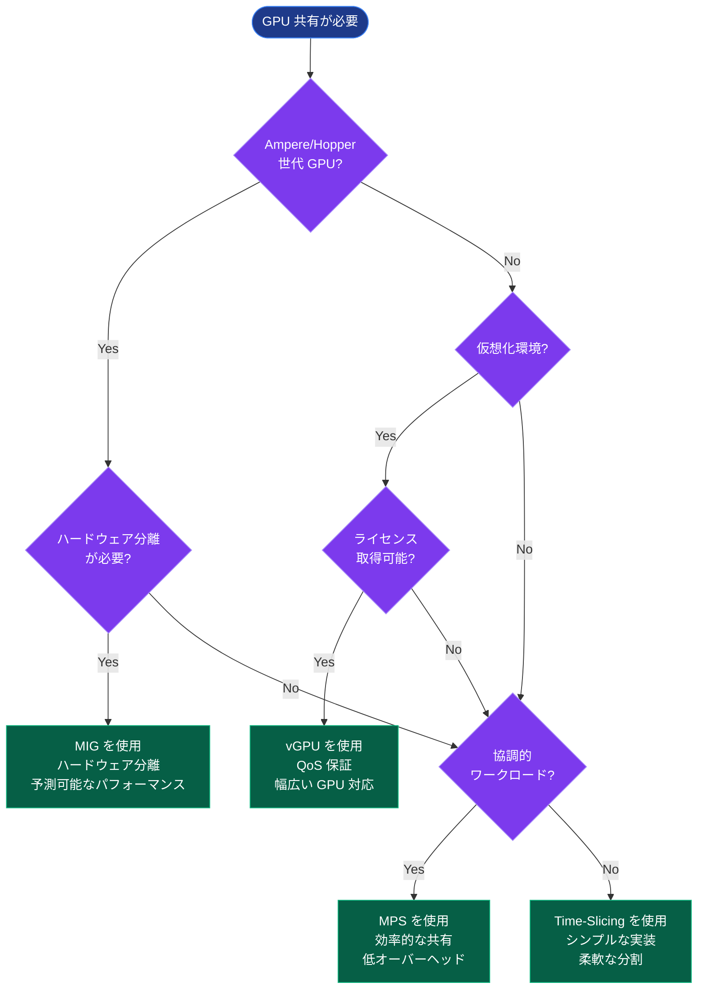
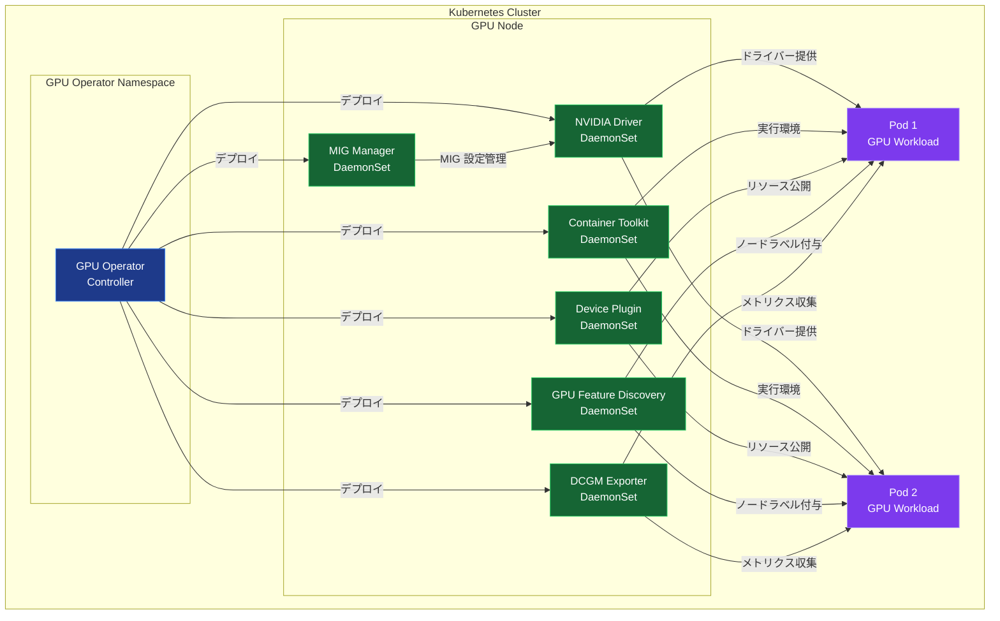
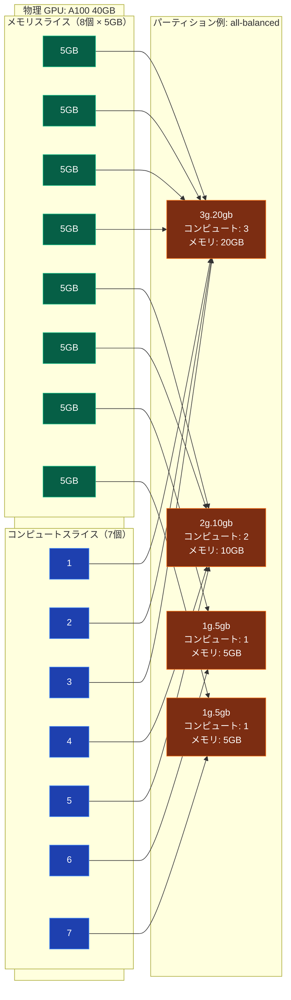
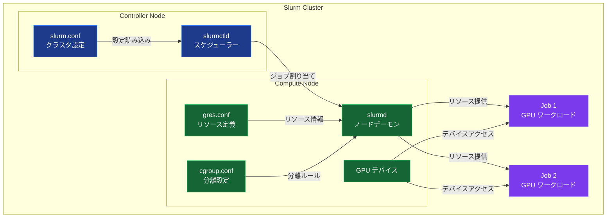
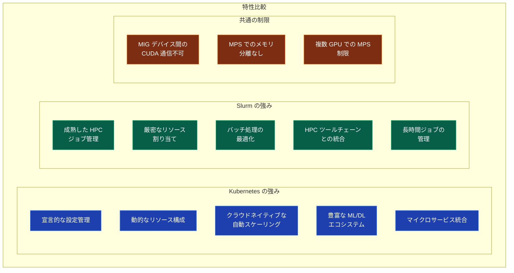

::::details GPU リソースの効率的な活用

分散学習環境において、物理 GPU を複数のワークロード間で効率的に共有することは、コスト削減とリソース利用率の向上に不可欠です。NVIDIA は GPU 共有のための複数の技術を提供しており、これらをオーケストレーションプラットフォームと統合することで、柔軟なリソース管理が可能になります。本セクションでは、Kubernetes と Slurm における GPU 共有技術の実装と、それぞれの特性を解説します。

#### GPU 共有技術の概要

NVIDIA が提供する主要な GPU 共有技術には、以下の 4 つがあります。

**Multi-Instance GPU (MIG)**: ハードウェアレベルで GPU を分割し、完全に分離された複数のインスタンスを作成します。Ampere および Hopper 世代の GPU（A100、H100 など）でサポートされ、予測可能なパフォーマンスと強固な分離を提供します。

**vGPU (Virtual GPU)**: 仮想化環境向けのエンタープライズソリューションで、QoS 保証とモニタリング機能を備えています。Maxwell 世代以降の幅広い GPU をサポートしますが、ライセンスが必要です。

**Time-Slicing**: 最もシンプルな GPU 共有方式で、複数のプロセスがラウンドロビン方式で GPU を使用します。セットアップが容易で幅広い GPU 世代に対応しますが、メモリ分離がなく、パフォーマンスの予測可能性が低いという欠点があります。

**Multi-Process Service (MPS)**: Hyper-Q 機能を活用して、複数のプロセスが単一 GPU 上で効率的に協調実行できるようにします。Time-Slicing よりも効率的ですが、メモリ分離は提供しません。

これらの技術の特性を比較したフローチャートを以下に示します。

#### Kubernetes における GPU 共有の実装

##### NVIDIA GPU Operator

NVIDIA GPU Operator は、Kubernetes の Operator フレームワークを活用して、GPU ノードの管理に必要な全てのソフトウェアコンポーネントを自動化するツールです。従来の手動セットアップに代わり、GPU ノードを CPU ノードと同じように標準的な OS で管理できるようにします。

GPU Operator が管理する主要なコンポーネントには、NVIDIA ドライバー（コンテナとして実行）、Kubernetes Device Plugin（GPU リソースの公開）、NVIDIA Container Toolkit（実行環境）、GPU Feature Discovery（自動ラベル付与）、DCGM Exporter（メトリクス収集）、MIG Manager（MIG 設定の自動化）が含まれます。

以下の図は、GPU Operator のアーキテクチャを示しています。

##### Kubernetes での MIG 設定

Kubernetes における MIG の設定は、GPU Operator を通じて宣言的に行われます。管理者は Helm チャートのパラメータで MIG 戦略（single または mixed）を指定し、ノードにラベルを付与することで動的に MIG プロファイルを変更できます。

MIG Manager が MIG の有効化、プロファイルの作成、GPU の再構成を自動的に処理します。設定変更時にはノードの GPU ポッドが一時的に終了されますが、設定完了後は新しい MIG 構成で再スケジュールされます。

以下の図は、A100 GPU における MIG パーティション構成の例を示しています。

ワークロードは、Pod の仕様で `resources.limits` に MIG リソースタイプ（例として `nvidia.com/mig-1g.5gb`）を指定することで、特定の MIG インスタンスを要求できます。Kubernetes スケジューラーは、ノードラベルと利用可能なリソースに基づいて、適切なノードに Pod を配置します。

##### Kubernetes での Time-Slicing と MPS

Time-Slicing は、GPU Operator の Device Plugin 設定を通じて有効化されます。ConfigMap で各 GPU のレプリカ数を定義し、クラスタポリシーでこの設定を参照することで、GPU が複数のリソースとして公開されます。

MPS のサポートは現在も進化中ですが、特定のユースケースでは Time-Slicing の代替として MPS を活用できます。ただし、Kubernetes における MPS の公式サポートは Time-Slicing ほど成熟していません。

#### Slurm における GPU 共有の実装

##### Slurm の GRES メカニズム

Slurm は、Generic Resource (GRES) スケジューリング機構を通じて GPU を管理します。GRES は任意のリソースタイプを定義・スケジュールできる柔軟な仕組みで、GPU、MIG、MPS などを統一的に扱えます。

設定は主に 3 つのファイルで行われます。`slurm.conf` で管理する GRES タイプを宣言し（例として `GresTypes=gpu,mps`）、各ノードで利用可能なリソースを定義します（例として `Gres=gpu:1,mps:100`）。`gres.conf` でノード上の物理リソースの詳細（デバイスファイル、コアアフィニティなど）を指定します。`cgroup.conf` でリソース分離のための cgroup 設定を定義します。

以下の図は、Slurm の GRES アーキテクチャを示しています。

##### Slurm での MIG 設定

Slurm はバージョン 21.08 以降、MIG をネイティブにサポートしています。MIG 検出ツールを使用して、システム上の MIG デバイスを自動的に検出し、適切な `gres.conf` と `cgroup_allowed_devices_file.conf` を生成できます。

各 MIG デバイスは、その容量に応じた型（例として `1g.6gb`、`3g.20gb`、`4g.24gb` など）で分類されます。ジョブ投入時に `sbatch --gres=gpu:1g.6gb:2` のように要求することで、特定のサイズの MIG インスタンスを取得できます。

Slurm は cgroup と `CUDA_VISIBLE_DEVICES` 環境変数を使用して、各ジョブに割り当てられた MIG デバイスを適切に分離します。これにより、複数のユーザーやジョブが単一の物理 GPU を競合なく使用できます。

ただし、重要な制限として、CUDA の現在の実装では、複数の MIG デバイス間での直接通信がサポートされていません。`CUDA_VISIBLE_DEVICES` は最初の MIG デバイスのみを認識するため、複数の MIG デバイスにまたがる分散学習ジョブは実行できません。各 MIG デバイスは独立した CUDA プロセスとして実行する必要があります。

##### Slurm での MPS 設定

Slurm は MPS を GRES の一種として完全にサポートしています。`gres.conf` で各 GPU に対して MPS 共有数を定義します（例として `Name=mps Count=100 File=/dev/nvidia0`）。この設定により、GPU が複数の MPS シェアに分割されます。

ジョブは `sbatch --gres=mps:25` のように MPS シェアを要求できます。この例では、GPU の 25% を使用することを意味します。Slurm は自動的に `CUDA_MPS_ACTIVE_THREAD_PERCENTAGE` 環境変数を設定し、各ジョブの GPU 使用率を制御します。

ジョブスクリプト内で MPS 制御デーモンを起動し、ワークロード実行後にクリーンアップする必要があります。複数のジョブが同時に実行される場合、それぞれが独自の MPS パイプディレクトリとログディレクトリを持つように設定します。

複数 GPU 環境での MPS 使用には注意が必要です。Slurm の cgroup による GPU 分離と `CUDA_VISIBLE_DEVICES` の設定が、MPS が複数 GPU にアクセスすることを妨げる場合があります。単一 GPU あたり複数ジョブの実行は効率的ですが、複数 GPU にまたがる単一ジョブでの MPS 利用は制限されます。

#### Kubernetes と Slurm の比較

以下の表は、Kubernetes と Slurm における GPU 共有機能の比較をまとめたものです。

| 側面 | Kubernetes | Slurm |
|------|-----------|-------|
| **MIG サポート** | GPU Operator による自動管理、ノードラベルによる動的構成変更 | バージョン 21.08 以降でネイティブサポート、静的設定ファイルベース |
| **MPS サポート** | Time-Slicing を通じた部分的サポート、MPS 自体のサポートは発展途上 | GRES として完全サポート、ジョブごとの MPS デーモン管理 |
| **vGPU サポート** | 通常の GPU として透過的に使用可能、特別な設定不要 | 仮想化ノード上で通常の GPU として扱う、直接的なサポートなし |
| **Time-Slicing** | Device Plugin の拡張オプションで実装、ConfigMap ベースの設定 | GRES のオーバーサブスクリプション機能で実現可能 |
| **設定管理** | 宣言的設定、Git による管理、動的な変更が可能 | 静的設定ファイル、変更時はノードの再起動が必要な場合あり |
| **リソース分離** | Kubernetes の cgroup、Device Plugin による制御 | Slurm の cgroup、GRES による制御 |
| **スケジューリング** | Pod アフィニティ、taint/toleration、リソースクオータ | パーティション、QoS、アカウントポリシー、優先度 |
| **動的スケーリング** | Cluster Autoscaler との統合、クラウドネイティブ | 動的ノード管理機能あり、HPC 環境向けに最適化 |
| **モニタリング** | Prometheus、Grafana、DCGM Exporter | 従来の HPC モニタリングツール、sacct、sstat |
| **エコシステム** | Kubeflow、MLflow、Argo などの ML プラットフォーム | モジュールシステム、並列ファイルシステム、HPC ツールチェーン |

以下の図は、両プラットフォームの特性を視覚的に比較したものです。

##### 選択のガイドライン

**Kubernetes を選択すべき場合**、開発環境やプロトタイピングで柔軟性が必要な場合、短時間の実験を多数実行する場合（ハイパーパラメータチューニングなど）、ML 推論サービスや Web アプリケーションと統合する場合、クラウド環境で動的なスケーリングが必要な場合、マイクロサービスアーキテクチャの一部として GPU ワークロードを実行する場合が挙げられます。

**Slurm を選択すべき場合**、数日から数週間にわたる長期的な学習ジョブを実行する場合、厳密なリソース割り当てとアカウンティングが必要な場合、既存の HPC インフラストラクチャと統合する場合、複数のユーザーやプロジェクト間で公平なリソース共有が必要な場合、バッチ処理中心のワークロードを実行する場合が適しています。

分散学習の文脈では、両者とも MIG と MPS をサポートしていますが、それぞれの強みが異なります。Kubernetes は、細粒度のリソース割り当てによるマルチテナント環境の実現、GPU Operator による自動化されたインフラストラクチャ管理、開発と実験の迅速なイテレーションを提供します。Slurm は、大規模で長期的な学習ジョブの安定実行、厳密なリソース管理と公平性の保証、従来の HPC ワークフローとのシームレスな統合を提供します。

AWS SageMaker HyperPod は両方のバックエンドをサポートしており、ユーザーは自身のワークロードの特性に基づいて最適な環境を選択できます。HyperPod Slurm 版は長期的な学習ジョブと厳密なリソース管理に、HyperPod EKS 版は柔軟な開発環境と ML プラットフォームとの統合に適しています。
::::