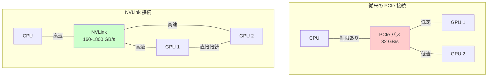
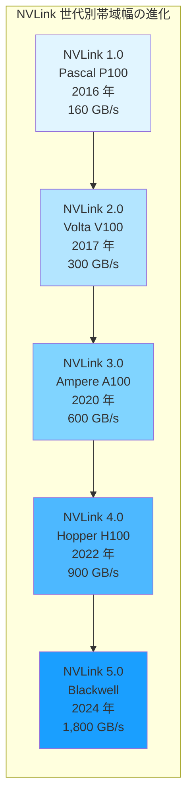
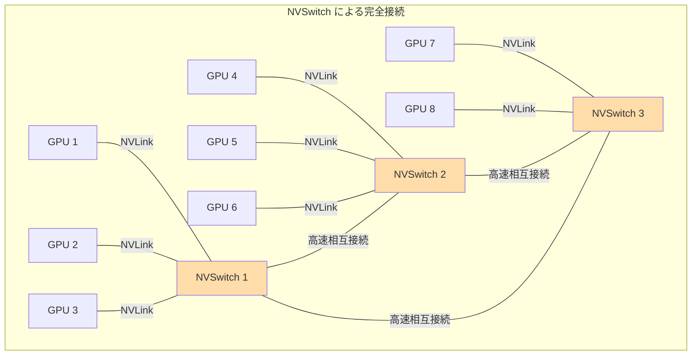
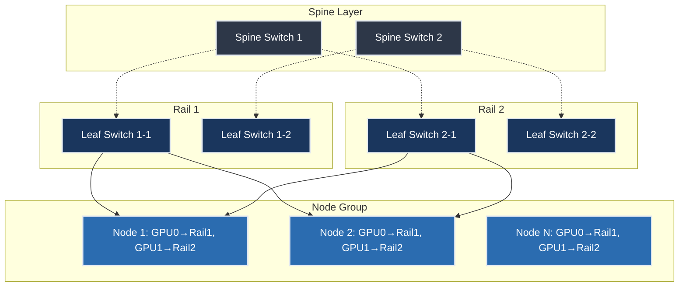

::::details Brief Discussion on NVIDIA NVLink Network
https://www.naddod.com/blog/brief-discussion-on-nvidia-nvlink-network?srsltid=AfmBOoojJEtRq6YZbz9wOLuItU8Xd5K40ZP_YaGAHo8AK_jkV8yNqS2o

# NVIDIA NVLink 技術 -- 入門: GPU 間高速通信の仕組みと進化

## はじめに

AI や高性能計算の分野では、複数の GPU を連携させて処理を行うことが一般的になっています。しかし、従来の GPU 間通信技術である PCIe（PCI Express）には帯域幅の限界があり、GPU の計算能力を十分に活かしきれないという課題がありました。NVIDIA が開発した NVLink は、この課題を解決するために設計された高速通信技術です。

本記事では、NVLink の基本的な仕組みから、PCIe との違い、世代ごとの進化、そして実際の応用例まで、初学者にも理解しやすい形で解説します。

## NVLink とは何か

NVLink は、NVIDIA が 2016 年に導入した GPU 間および GPU と CPU 間の専用高速通信技術です。従来の PCIe バスを補完または置き換える形で、データセンターや HPC（高性能計算）環境において GPU 間の通信速度を大幅に向上させます。

NVLink の主な特徴は以下の通りです。

**高帯域幅通信**: PCIe の数倍から十数倍の帯域幅を実現し、大量のデータを高速に転送できます。例えば、NVLink 1.0 は 160 GB/s の双方向帯域幅を提供し、PCIe Gen3 x16 の約 32 GB/s と比較して 5 倍の性能を達成しました。

**ユニファイドメモリアーキテクチャ**: 複数の GPU が単一のメモリ空間を共有できるため、GPU 間でのデータコピーが不要になります。これにより、プログラミングモデルが簡素化され、開発者はメモリ管理の複雑さから解放されます。

**低レイテンシ**: ポイントツーポイント接続により、データ転送時の遅延を最小限に抑えます。これは AI モデルの学習や推論において、GPU 間の同期処理を高速化する上で重要です。

**キャッシュコヒーレンス**: NVLink 2.0 以降では、GPU 間でキャッシュの一貫性が保たれるため、データの整合性を手動で管理する必要がありません。

## なぜ NVLink が必要なのか

GPU の計算性能は年々向上していますが、従来の PCIe バスの帯域幅はこの進化に追いついていませんでした。

**PCIe の限界**: PCIe Gen3 x16 の理論帯域幅は約 32 GB/s（双方向）です。一方、現代の GPU が搭載する HBM（High Bandwidth Memory）は 1 TB/s を超える内部帯域幅を持ちます。この 30 倍以上の差が、GPU 間通信のボトルネックとなっていました。

**AI ワークロードの特性**: 大規模な言語モデルや画像生成モデルの学習では、数百 GB から数 TB のパラメータを複数の GPU 間で同期する必要があります。PCIe の帯域幅では、この同期処理に多くの時間がかかり、GPU の計算能力が十分に活用できませんでした。

**スケーラビリティの課題**: 複数の GPU を効率的に連携させるためには、全ての GPU 間で高速な通信が必要です。PCIe を介した通信では、GPU の数が増えるほど通信のオーバーヘッドが増大し、スケーラビリティが制限されていました。

## NVLink の技術的な仕組み

NVLink は、以下の技術的特徴により高速通信を実現しています。

**ポイントツーポイント接続**: NVLink は GPU 間を直接接続するポイントツーポイントの通信方式を採用しています。PCIe のような共有バス方式ではないため、複数の GPU が同時に通信しても帯域幅が競合しません。

**マルチレーン設計**: NVLink の各接続は複数のレーン（差動ペア）で構成されており、これらのレーンが並列にデータを転送します。例えば、NVLink 1.0 では 1 つの接続あたり 4 レーンを使用し、各レーンが 20 GB/s の速度でデータを転送していました。

**柔軟なトポロジー**: NVLink は様々な接続形態をサポートします。初期の実装では、GPU 同士を直接接続するメッシュトポロジーが使われていました。後に導入された NVSwitch により、より複雑な接続パターンが可能になりました。

**プロトコル層**: NVLink は専用のプロトコルを使用しており、データ転送の効率性と信頼性を確保しています。このプロトコルは、エラー検出・訂正機能を持ち、高い信頼性を提供します。

## NVLink の世代ごとの進化

NVLink は GPU アーキテクチャの進化とともに改良が重ねられてきました。

### NVLink 1.0（Pascal 世代、2016 年）

- **GPU**: Tesla P100
- **リンク速度**: 20 GB/s（片方向）、40 GB/s（双方向）
- **GPU あたりの総帯域幅**: 160 GB/s（4 リンク使用時）
- **主な特徴**: GPU-GPU 接続と GPU-CPU（IBM POWER8）接続をサポート。HPC 分野で初めて GPU 間の高速通信を実現しました。

### NVLink 2.0（Volta 世代、2017 年）

- **GPU**: Tesla V100
- **リンク速度**: 25 GB/s（片方向）、50 GB/s（双方向）
- **GPU あたりの総帯域幅**: 300 GB/s（6 リンク使用時）
- **主な特徴**: キャッシュコヒーレンスとユニファイドアドレス空間をサポート。IBM POWER9 CPU との統合により、CPU と GPU が相互にメモリをアクセス可能になりました。

### NVLink 3.0（Ampere 世代、2020 年）

- **GPU**: A100
- **リンク速度**: 50 GB/s（片方向）、100 GB/s（双方向）
- **GPU あたりの総帯域幅**: 600 GB/s（12 リンク使用時）
- **主な特徴**: Volta 世代の 2 倍の帯域幅を実現。DGX A100 や NVIDIA HGX システムで採用され、AI ワークロードの性能を大幅に向上させました。

### NVLink 4.0（Hopper 世代、2022 年）

- **GPU**: H100
- **リンク速度**: 50 GHz（100 GB/s 片方向）、200 GB/s（双方向）
- **GPU あたりの総帯域幅**: 900 GB/s（18 リンク使用時）
- **主な特徴**: PCIe Gen5 の 3 倍の速度を達成。NVLink Switch System により、複数ノード間での NVLink 通信が可能になりました。

### NVLink 5.0（Blackwell 世代、2024 年）

- **GPU**: Blackwell
- **リンク速度**: 100 GB/s（片方向）、200 GB/s（双方向）
- **GPU あたりの総帯域幅**: 1,800 GB/s（18 リンク使用時）
- **主な特徴**: 前世代の 2 倍の帯域幅を実現。GB300 NVL72 システムでは、72 個の GPU を単一のラック内で接続し、130 TB/s の総帯域幅を達成しています。

## PCIe との性能比較

NVLink と PCIe の性能差を具体的に見てみましょう。

| 項目 | PCIe Gen3 x16 | PCIe Gen4 x16 | PCIe Gen5 x16 | NVLink 1.0 | NVLink 4.0 | NVLink 5.0 |
|------|--------------|--------------|--------------|-----------|-----------|-----------|
| 帯域幅（双方向） | 32 GB/s | 64 GB/s | 128 GB/s | 160 GB/s | 900 GB/s | 1,800 GB/s |
| PCIe Gen3 比 | 1x | 2x | 4x | 5x | 28x | 56x |
| レイテンシ | 高 | 高 | 中 | 低 | 極低 | 極低 |

**帯域幅の圧倒的な差**: NVLink 5.0 は PCIe Gen3 x16 の 56 倍、最新の PCIe Gen5 x16 と比較しても 14 倍の帯域幅を提供します。

**レイテンシの改善**: NVLink は直接接続方式のため、PCIe のような複数の中間ステップを経由しません。これにより、データ転送の遅延が大幅に削減されます。

**エネルギー効率**: 同じデータ量を転送する場合、NVLink は PCIe よりも電力効率が高いとされています。これは、データセンターの運用コスト削減に貢献します。

## NVSwitch の役割

NVSwitch は、NVLink 接続を拡張し、複数の GPU を完全接続するスイッチング技術です。

**完全接続トポロジー**: NVSwitch を使用することで、各 GPU が他の全ての GPU と直接通信できるようになります。これにより、GPU 間の通信パターンに関わらず一定の性能が保証されます。

**スケーラビリティの向上**: 初期の NVLink 実装では 8 GPU 程度の接続が限界でしたが、NVSwitch により数百台の GPU を接続できるようになりました。NVLink 5.0 と NVSwitch の組み合わせにより、最大 576 GPU の相互接続が可能です。

**世代ごとの進化**:
- **NVSwitch 第 1 世代（Volta）**: 4.8 TB/s の総帯域幅
- **NVSwitch 第 2 世代（Ampere）**: 7.2 TB/s の総帯域幅
- **NVSwitch 第 3 世代（Hopper）**: 14.4 TB/s の総帯域幅
- **NVSwitch 第 4 世代（Blackwell）**: 1 PB/s の総帯域幅

**NVIDIA の統合システム**: DGX-2、DGX A100、DGX H100 などのシステムでは、NVSwitch が標準で組み込まれており、複数の GPU を単一の巨大なアクセラレータとして扱うことができます。

## 主な用途と応用分野

NVLink は様々な分野で活用されています。

### AI モデルのトレーニングと推論

大規模言語モデル（LLM）やマルチモーダルモデルの学習では、数千億から数兆のパラメータを扱います。NVLink により、これらのパラメータを複数の GPU 間で効率的に同期でき、学習時間を大幅に短縮できます。

例えば、GPT-3 クラスのモデルは 1,750 億のパラメータを持ち、単一の GPU のメモリには収まりません。NVLink のユニファイドメモリ機能により、複数の GPU のメモリを統合して扱うことで、このような巨大モデルの学習が可能になります。

### 高性能計算（HPC）

科学技術計算や気象シミュレーション、分子動力学シミュレーションなどの HPC ワークロードでは、大量のデータを GPU 間で交換する必要があります。NVLink により、これらの計算が高速化され、より複雑なシミュレーションが実行可能になります。

### データ分析とビッグデータ処理

大規模なデータセットをリアルタイムで分析する際、NVLink の高帯域幅により複数の GPU 間でデータを効率的に分散・集約できます。これにより、データウェアハウスやビジネスインテリジェンスツールの性能が向上します。

### 科学研究

天体物理学、気候モデリング、創薬など、計算集約的な科学研究分野でも NVLink が活用されています。Oak Ridge National Laboratory の Summit スーパーコンピュータは、NVLink により 27,648 個の NVIDIA Volta V100 GPU を接続し、前世代のシステムの 8 倍の性能を 4 分の 1 のノード数で実現しました。

## 実際の導入事例

### Oak Ridge National Laboratory - Summit

2018 年に稼働開始した Summit スーパーコンピュータは、NVLink 2.0 を採用した最初の大規模システムの一つです。IBM POWER9 CPU と NVIDIA Volta V100 GPU を NVLink で接続し、従来の Titan スーパーコンピュータの 8 倍の性能を 4 分の 1 のノード数で達成しました。

### Microsoft Azure GPU クラスタ

Microsoft は 2025 年に、IBM Grace CPU と接続された 4,608 個の GPU からなる NVLink クラスタを Azure 上に展開しました。NVLink 5.0 ファブリックにより、1 ラックあたり 72 GPU を接続し、92.1 exaFLOPS の FP4 推論性能を実現しています。

### NVIDIA GB300 NVL72 システム

Blackwell アーキテクチャを採用した GB300 NVL72 は、単一ラック内に 72 個の GPU を配置し、130 TB/s の GPU 間帯域幅を提供します。このシステムは、兆パラメータ規模の AI モデルの推論を高速化することを目的としており、NVLink 5.0 と NVSwitch の組み合わせにより、データセンター規模の GPU クラスタを実現しています。

## NVLink の今後の展望

NVIDIA は NVLink の進化を続けており、以下の方向性が示されています。

**NVLink Fusion**: 複数のチップレットやダイを NVLink の帯域幅で接続する技術です。これにより、異なるベンダーの ASIC や CPU を統合した「スーパーチップ」の構築が可能になります。

**ネットワークスケールの NVLink**: サーバー間を NVLink で接続する技術が開発されており、複数のサーバーラックにまたがる GPU クラスタを単一のシステムとして扱えるようになります。

**より高い帯域幅**: 今後の世代では、さらなる帯域幅の向上が期待されています。GPU の計算性能の向上に合わせて、通信性能も進化を続けています。

## まとめ

NVLink は、GPU 間通信の課題を解決し、AI や HPC の性能を劇的に向上させる技術です。PCIe の限界を超える帯域幅、低レイテンシ、ユニファイドメモリアーキテクチャにより、複数の GPU を効率的に連携させることができます。

5 世代にわたる進化を経て、NVLink は単なる GPU 間接続技術から、データセンター全体を統合する基盤技術へと発展しました。AI モデルの規模が拡大し続ける中、NVLink のような高性能通信技術の重要性はますます高まっています。

今後も NVLink の進化により、より大規模で複雑な AI モデルや科学計算が可能になり、研究開発や産業応用の新たな可能性が開かれることが期待されます。

## 参考文献

- [NVIDIA NVLink 公式ページ](https://www.nvidia.com/en-us/data-center/nvlink/)
- [NVIDIA NVLink Explained: A Guide to the GPU Interconnect - Intuition Labs](https://intuitionlabs.ai/articles/nvidia-nvlink-gpu-interconnect)
- [Unveiling the Evolution of NVIDIA NVLink Technology](https://network-switch.com/blogs/networking/the-evolution-of-nvidia-nvlink-technology)
- [NVIDIA NVLink: How It Works, Use Cases & Critical Best Practices - Atlantic.Net](https://www.atlantic.net/gpu-server-hosting/nvidia-nvlink-how-it-works-use-cases-and-critical-best-practices/)
::::

::::details Rail-Optimized Clos Topology -- 入門: AI クラスタ向けネットワーク設計の革新

## 概要

Rail-optimized Clos Topology とは、従来の Clos ネットワーク設計を大規模な GPU クラスタ環境に最適化したネットワークアーキテクチャです。この設計は特に大規模言語モデル（LLM）の訓練において、効率的な通信パターンを実現し、コストと電力消費の大幅な削減を可能にします。

## 従来の Clos ネットワークとの相違点

従来の Clos ネットワークは、データセンター内の任意のノード間での通信を可能にする汎用的な設計でした。これは Leaf-Spine 構造を用いて全対全（any-to-any）接続を提供し、予測不可能で突発的な CPU 集約型ワークロードに対応していました。

一方、Rail-optimized 設計では、GPU の「ランク」という概念を導入し、同一ランクの GPU を同一の Rail に配置します。この配置により、AI ワークロード特有の通信パターンに特化した最適化が実現されます。

## アーキテクチャの詳細構成

Rail-optimized 設計では、K 個の GPU を持つプラットフォーム（例：NVIDIA DGX H100 の 8 GPU システム）において、K 本の論理的な「Rail」を構成します。各ノードの第 1 GPU は Rail-1 に、第 2 GPU は Rail-2 に配置されるという規則的な配置を採用します。

この設計により、同一 Rail 内の GPU 間では最小レイテンシでの通信が実現され、異なる Rail 間での通信が必要な場合のみ Spine スイッチを経由します。

## 通信パターンの分析と最適化

MIT Computer Science and Artificial Intelligence Laboratory (CSAIL) と Meta Platforms の共同研究により、LLM 訓練時の通信パターンについて重要な発見がなされました。分析の結果、大規模言語モデルの訓練において、通信トラフィックの約 73.5% が Rail 内に留まり、高コストな Spine スイッチを経由する通信は限定的であることが判明しました。

この発見により、従来必須とされていた全対全接続の必要性が疑問視され、Rail-only アーキテクチャという革新的な設計が提案されました。Pipeline Parallelism、Tensor Parallelism、Data Parallelism のいずれの並列化戦略においても、同様の通信パターンが観測されています。

## Rail-Only アーキテクチャへの発展

通信パターン分析の結果を受けて開発された Rail-only 設計では、Spine 層を完全に排除し、各 HGX ノード内の NVSwitch を利用した Rail 間通信を実現します。この設計により以下の効果が得られます。

### コスト削減効果

- ネットワークコストを 38% から 77% 削減
- 電力消費を 37% から 75% 削減
- 128 ノードの DGX H100 クラスタにおいて、20 台のスイッチを 8 台に削減
- トランシーバー数を 2,688 個から 1,152 個に削減

### 性能への影響

- LLM 訓練の 3D Parallelism において性能低下なし
- All-to-all 通信において 11.2% の性能オーバーヘッド
- 全体の通信性能への影響は約 2.86%

## 実装事例と使用ケース

### NVIDIA DGX SuperPOD での実装

NVIDIA DGX SuperPOD は Rail-optimized 設計の代表的な実装例です。127 ノード構成において、各 32 ノードグループが Rail 単位で構成され、InfiniBand ファブリックを使用した高帯域幅接続を実現しています。各 Rail 内のトラフィックは常に 1 ホップ以内で到達可能であり、異なる Rail 間やノード間の通信のみが Spine 層を経由します。

### Meta Platforms での Llama 訓練

Meta Platforms では 24,576 GPU を使用した Llama 3.1 405B モデルの訓練において Rail-optimized 設計を採用しています。次世代モデルでは 32,768 GPU への拡張が計画されており、この規模においても Rail-optimized 設計の効果的な運用が期待されています。

## 技術的制約と考慮事項

### 利点

1. **AI ワークロード特化の最適化**: LLM 訓練の通信パターンに特化した設計により、無駄なネットワーク資源を削減
2. **レイテンシの最小化**: 同一 Rail 内での通信における最小遅延の実現
3. **コスト効率の大幅改善**: ネットワーク機器とトランシーバー数の削減による資本支出の削減
4. **電力効率の向上**: 不要なスイッチ機器の排除による運用コストの削減
5. **スケーラビリティ**: 大規模クラスタでの効率的な拡張性

### 制約事項

1. **ワークロード依存性**: LLM 訓練以外の汎用的なデータセンターアプリケーションには適用困難
2. **プラットフォーム依存性**: NVIDIA NVLink や AMD Infinity Fabric などの高帯域幅内部接続に依存
3. **配置制約**: Tensor Parallelism と Data Parallelism のシャードとレプリカを同一 Rail に配置する必要
4. **故障耐性**: Rail 単位での冗長性設計が必要

## Mixture-of-Expert モデルへの対応

Rail-only 設計は、Mixture-of-Expert（MoE）モデルにおける All-to-all 通信にも対応可能です。フォワーディング機能を使用することで、All-to-all トラフィックに対して 4.1% から 5.6% の完了時間オーバーヘッドで動作することが実証されています。

## 今後の発展方向

Rail-optimized 設計は、次世代の AI インフラストラクチャにおいて重要な役割を果たすことが予想されます。特に以下の分野での発展が期待されています。

1. **更なるコスト最適化**: トランシーバー技術の進歩と併せた総所有コストの削減
2. **新しい並列化戦略への適応**: 次世代の分散学習アルゴリズムに対応した設計の進化
3. **異なる GPU アーキテクチャへの拡張**: AMD や Intel などの GPU プラットフォームへの適用研究
4. **エッジコンピューティングへの応用**: 小規模な分散 AI システムにおける効率化

## 参考文献とリソース

### 主要論文
- [Rail-only: A Low-Cost High-Performance Network for Training LLMs with Trillion Parameters](https://arxiv.org/html/2307.12169v4) - MIT CSAIL と Meta による革新的な研究論文

### 技術解説記事
- [This AI Network Has No Spine - And That's A Good Thing](https://www.nextplatform.com/2024/08/23/this-ai-network-has-no-spine-and-thats-a-good-thing/) - The Next Platform による詳細な技術分析
- [Rail-Optimised Networking: How NVIDIA is Rethinking AI Network Design](https://vespertec.com/news/rail-optimised-networking-how-nvidia-is-rethinking-ai-network-design-data-centre/) - Vespertec による業界動向分析
- [Backend Network Topologies for AI Fabrics](https://nwktimes.blogspot.com/2025/04/ai-fabric-backend-network-topologies.html) - Network Times による AI ファブリック設計指針

### 公式技術文書
- [NVIDIA DGX SuperPOD: Network Fabrics](https://docs.nvidia.com/dgx-superpod/reference-architecture-scalable-infrastructure-h100/latest/network-fabrics.html) - NVIDIA による公式設計ガイドライン
- [Distributed Model Training at Scale: Part TWO — Topology Design](https://medium.com/@ming.gao.gm/distributed-model-training-at-scale-part-two-topology-design-bb14c0e69cb1) - 分散モデル訓練における実践的な設計考慮事項

### NVIDIA 開発者ブログ
- [Doubling all2all Performance with NVIDIA Collective Communication Library 2.12](https://developer.nvidia.com/blog/doubling-all2all-performance-with-nvidia-collective-communication-library-2-12/) - NCCL における PXN 機能と Rail-optimized 設計の活用

## 結論

Rail-optimized Clos Topology は、AI ワークロードの特性を深く理解した上で設計された革新的なネットワークアーキテクチャです。従来の汎用的な Clos 設計から脱却し、LLM 訓練における実際の通信パターンに基づいた最適化により、大幅なコスト削減と効率向上を実現しています。

特に Rail-only アーキテクチャへの発展は、AI インフラストラクチャの経済性を根本的に改善する可能性を秘めており、今後の大規模 AI システムの標準的な設計パラダイムとなることが予想されます。ただし、この設計は AI ワークロードに特化しているため、汎用的なデータセンターアプリケーションとは異なる設計思想であることを理解し、適切な適用範囲での採用が重要です。
::::
