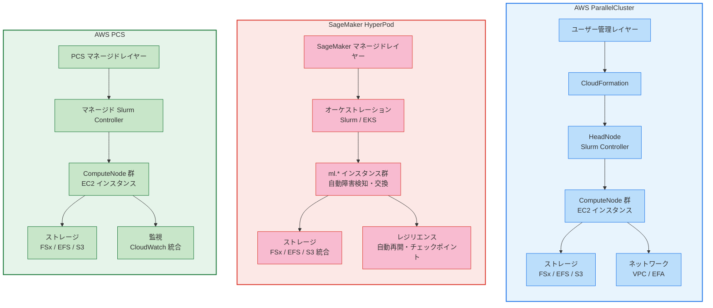

## はじめに

:::message alert
**本章のスコープ**: 本章は **ML（機械学習）ワークロードに焦点を当てた**オーケストレーションサービスの比較です。HPC（High Performance Computing）ワークロードの詳細は扱いません。
:::

AWS で ML 分散学習ワークロードを実行する際、オーケストレーション基盤の選択は運用コストやチームの生産性に直接影響します。AWS は現在、AWS ParallelCluster、Amazon SageMaker HyperPod、AWS PCS（Parallel Computing Service）の 3 つの主要なサービス/ソリューションを提供しており、それぞれ異なる設計思想と強みを持っています。

この記事では、ML ワークロードにおける 3 つのサービスの機能比較を整理します。各サービスのできること・できないことを明確にし、要件に応じた選定の参考情報を提供することを目的としています。

**想定読者**: AWS で ML 分散学習環境を構築・運用する技術者

:::message
**執筆時点**: 2026 年 2 月

AWS のサービスは頻繁に更新されます。機能や料金については、必ず AWS 公式ドキュメントを確認してください。比較記事のため参照 URL がかなり多く、目視チェックしていますがミスがあるかもしれません。
:::

## 3 つのサービス概要

| サービス | タイプ | 主な用途 | 対応エンジン |
|---------|-------|----------|------------|
| **AWS ParallelCluster** | [オープンソースツール](https://github.com/aws/aws-parallelcluster) | ML 汎用 | [Slurm, AWS Batch](https://docs.aws.amazon.com/parallelcluster/latest/ug/schedulers-v3.html) |
| **Amazon SageMaker HyperPod** | [マネージドサービス](https://docs.aws.amazon.com/sagemaker/latest/dg/sagemaker-hyperpod.html) | ML 専用（LLM/FM） | [Slurm, EKS](https://docs.aws.amazon.com/sagemaker/latest/dg/sagemaker-hyperpod-eks.html) |
| **AWS PCS** | [マネージドサービス](https://aws.amazon.com/pcs/) | ML 汎用 | [Slurm](https://aws.amazon.com/pcs/pricing/) |

### アーキテクチャ比較図

以下の図は、3 つのサービスのアーキテクチャと管理レイヤーの違いを視覚的に示しています。

ParallelCluster はユーザーが CloudFormation を通じて全レイヤーを管理します。HyperPod と PCS では管理レイヤーが AWS 側で自動化されます。HyperPod は ML に特化したレジリエンス機能を備え、PCS はマネージド Slurm 環境を提供します。

ML 分散学習では、マネージドとセルフマネージの選択基準が一般的なケースと異なります。訓練ワークロードはエンドユーザー向けではなく研究的用途が多いため、マネージドサービスによる制御の制約と運用コスト削減のトレードオフを慎重に評価する必要があります。自身のユースケースにおいて、構築・運用コストとカスタマイズ性のバランスを確認することが重要です。

## 詳細比較表

以下の比較表では、各サービスの主要な機能を項目ごとに整理しています。各サービスの強みと制約を把握するための参考としてください。

| 項目 | ParallelCluster | HyperPod | PCS |
|------|----------------|----------|-----|
| **サービス形態** | [セルフマネージド](https://docs.aws.amazon.com/parallelcluster/latest/ug/what-is-aws-parallelcluster.html) | [フルマネージド](https://docs.aws.amazon.com/sagemaker/latest/dg/sagemaker-hyperpod.html) | [フルマネージド](https://docs.aws.amazon.com/pcs/latest/userguide/what-is-service.html) |
| **管理が必要な項目** | [Slurm 設定、ノード管理、障害対応](https://docs.aws.amazon.com/parallelcluster/latest/ug/what-is-aws-parallelcluster.html) | [最小限（IAM ロール、ネットワーク設定、ライフサイクルスクリプト）](https://docs.aws.amazon.com/sagemaker/latest/dg/sagemaker-hyperpod-operate.html) | [最小限（Launch Template、ネットワーク設定）](https://docs.aws.amazon.com/pcs/latest/userguide/getting-started.html) |
| **料金体系** | [EC2 リソース料金のみ](https://docs.aws.amazon.com/parallelcluster/latest/ug/what-is-aws-parallelcluster.html) | [ml.\* インスタンス料金](https://aws.amazon.com/sagemaker/pricing/) | [EC2 料金 + クラスタ管理料金](https://aws.amazon.com/pcs/pricing/) |

::::details 料金についての補足

**ParallelCluster** は EC2 インスタンス料金のみで、ツール自体は無料のオープンソースです。

**HyperPod** は `ml.*` インスタンス料金を [SageMaker 料金ページ](https://aws.amazon.com/sagemaker/pricing/) で参照してください。

**PCS** は EC2 インスタンス料金に加え、管理料金が発生します。管理料金はクラスタコントローラー料金（時間単位、サイズ tier に応じて変動）、ノード管理料金（各 EC2 インスタンスについて時間単位）、および Slurm Accounting Storage 料金（オプション、有効化した場合のみ）で構成されます。詳細は [AWS PCS 料金ページ](https://aws.amazon.com/pcs/pricing/) を参照してください。

**料金削減オプションの比較**

| オプション | ParallelCluster | HyperPod | PCS |
|----------|----------------|----------|-----|
| **Savings Plans** | [EC2 Savings Plans](https://aws.amazon.com/savingsplans/pricing/) | [SageMaker Savings Plans](https://aws.amazon.com/savingsplans/ml-pricing/) | [EC2 Savings Plans](https://aws.amazon.com/savingsplans/pricing/) |
| **Capacity Block for ML** | [対応](https://docs.aws.amazon.com/AWSEC2/latest/UserGuide/ec2-capacity-blocks.html) | [非対応](https://docs.aws.amazon.com/AWSEC2/latest/UserGuide/ec2-capacity-blocks.html) | [対応](https://docs.aws.amazon.com/pcs/latest/userguide/capacity-blocks.html) |
| **Spot インスタンス** | 対応 | [対応](https://docs.aws.amazon.com/sagemaker/latest/dg/sagemaker-hyperpod-spot.html) | 対応 |

:::message
**Savings Plans について**: ParallelCluster と PCS では Compute Savings Plans（最大 66% 割引）または EC2 Instance Savings Plans（最大 72% 割引）を利用できます。HyperPod では SageMaker Savings Plans を利用できます（割引率はインスタンスタイプにより異なります。詳細は [SageMaker Savings Plans 料金](https://aws.amazon.com/savingsplans/ml-pricing/) を参照）。

**Capacity Block for ML**: P4, P5, P5e, P6, Trainium インスタンスで利用可能な短期予約オプション（最大 28 日間）です。ParallelCluster、EKS、EC2 で対応していますが、HyperPod は非対応です（HyperPod は ml.* インスタンスを使用するため、EC2 Capacity Block の対象外）（[Capacity Blocks for ML ドキュメント](https://docs.aws.amazon.com/AWSEC2/latest/UserGuide/ec2-capacity-blocks.html)）。

**HyperPod の Spot インスタンス**: HyperPod は Spot インスタンスに対応しており、コスト削減が可能です（割引率はインスタンスタイプや需要状況により異なります）。Spot インスタンスは中断に対する自動リトライ機能を持ち、長時間の訓練ジョブにも適用できます。詳細は [HyperPod Spot インスタンスドキュメント](https://docs.aws.amazon.com/sagemaker/latest/dg/sagemaker-hyperpod-spot.html) を参照してください。

**HyperPod の Flexible Training**: HyperPod は Flexible Training に対応しており、訓練ジョブをより柔軟にスケジュールすることでアイドルリソースを活用し、コスト効率を向上させることができます。詳細は [HyperPod Flexible Training Plans（AWS Blog）](https://aws.amazon.com/blogs/aws/meet-your-training-timelines-and-budgets-with-new-amazon-sagemaker-hyperpod-flexible-training-plans/) を参照してください。

**最新情報の確認**: 料金削減オプションは頻繁に更新されます。利用前に AWS 公式ドキュメントで最新の対応状況を確認してください。
:::
::::

### インスタンスタイプ

| 項目 | ParallelCluster | HyperPod | PCS |
|------|----------------|----------|-----|
| **対応インスタンス** | [通常の EC2 インスタンス](https://docs.aws.amazon.com/parallelcluster/latest/ug/Scheduling-v3.html)（`p4d`, `p5`, `trn1` など） | [ML インスタンス](https://docs.aws.amazon.com/sagemaker/latest/APIReference/API_ClusterInstanceGroupSpecification.html)（`ml.p4d`, `ml.p5`, `ml.trn1` など） | [通常の EC2 インスタンス](https://docs.aws.amazon.com/pcs/latest/userguide/key-concepts.html) |
| **CPU インスタンス** | [対応](https://docs.aws.amazon.com/parallelcluster/latest/ug/Scheduling-v3.html)（Hpc7a, C6i など） | [対応](https://docs.aws.amazon.com/sagemaker/latest/APIReference/API_ClusterInstanceGroupSpecification.html) | [対応](https://aws.amazon.com/pcs/pricing/) |
| **UltraServers** | [対応（v3.14.0+）](https://github.com/aws/aws-parallelcluster/releases/tag/v3.14.0) | [対応](https://docs.aws.amazon.com/sagemaker/latest/dg/sagemaker-hyperpod.html) | 未確認 |

:::message
HyperPod は `ml.*` プレフィックスのインスタンスを使用するのに対し、ParallelCluster と PCS は通常の EC2 インスタンスを使用します。
:::

### ネットワーキング

| 項目 | ParallelCluster | HyperPod | PCS |
|------|----------------|----------|-----|
| **EFA（Elastic Fabric Adapter）サポート** | [対応](https://docs.aws.amazon.com/parallelcluster/latest/ug/efa-v3.html) | [対応](https://docs.aws.amazon.com/sagemaker/latest/dg/sagemaker-hyperpod-prerequisites.html) | [対応](https://docs.aws.amazon.com/pcs/latest/userguide/working-with_networking_efa.html) |
| **配置グループ** | [手動設定](https://docs.aws.amazon.com/parallelcluster/latest/ug/Scheduling-v3.html) | マネージド配置 | [手動設定（Launch Template 経由）](https://docs.aws.amazon.com/pcs/latest/userguide/working-with_networking_placement-groups.html) |
| **Topology-aware** | [対応（Slurm トポロジープラグイン）](https://github.com/aws/aws-parallelcluster/releases/tag/v3.14.0) | [自動（UltraServers）](https://docs.aws.amazon.com/sagemaker/latest/dg/sagemaker-hyperpod-topology.html) | Slurm ネイティブ機能のみ |
| **マルチ AZ** | [対応（v3.4.0 以降）](https://docs.aws.amazon.com/parallelcluster/latest/ug/Scheduling-v3.html) | [対応](https://docs.aws.amazon.com/sagemaker/latest/dg/sagemaker-hyperpod-prerequisites.html) | [対応](https://aws.amazon.com/pcs/features/) |

:::message
**Topology-aware 機能の比較**: ParallelCluster は v3.14.0 以降で P6e-GB200 UltraServers 向けに Slurm トポロジープラグインを自動セットアップします。HyperPod は UltraServers に最適化された自動 Topology 管理を提供します。
:::

### オーケストレーション

| 項目 | ParallelCluster | HyperPod | PCS |
|------|----------------|----------|-----|
| **Slurm** | [対応](https://docs.aws.amazon.com/parallelcluster/latest/ug/Scheduling-v3.html) | [対応](https://docs.aws.amazon.com/sagemaker/latest/dg/sagemaker-hyperpod-operate-slurm.html) | [対応](https://aws.amazon.com/pcs/features/) |
| **AWS Batch** | [対応](https://docs.aws.amazon.com/parallelcluster/latest/ug/Scheduling-v3.html) | 非対応 | 非対応 |
| **Kubernetes/EKS** | 非対応 | [対応](https://docs.aws.amazon.com/sagemaker/latest/dg/sagemaker-hyperpod-eks.html) | 非対応 |
| **Slurm バージョン管理** | 手動 | マネージド更新 | [マネージド更新](https://aws.amazon.com/pcs/features/) |

### カスタマイズとライフサイクル管理

| 項目 | ParallelCluster | HyperPod | PCS |
|------|----------------|----------|-----|
| **ノード起動時スクリプト** | [OnNodeStart, OnNodeConfigured, OnNodeUpdated](https://docs.aws.amazon.com/parallelcluster/latest/ug/custom-bootstrap-actions-v3.html) | ライフサイクルスクリプト | Launch Template のみ |
| **カスタム AMI (Amazon Machine Image)** | [対応](https://docs.aws.amazon.com/parallelcluster/latest/ug/building-custom-amis.html) | [対応](https://docs.aws.amazon.com/sagemaker/latest/dg/hyperpod-custom-ami-support.html) | [対応](https://docs.aws.amazon.com/pcs/latest/userguide/working-with_ami_custom.html) |
| **スクリプト実行タイミング** | [起動直後/設定完了後/更新後](https://docs.aws.amazon.com/parallelcluster/latest/ug/custom-bootstrap-actions-v3.html) | 起動時 | Launch Template 経由 |
| **動的設定変更** | 限定的 | 対応 | 限定的 |

:::message alert
**PCS の制約**: ParallelCluster のカスタムブートストラップアクション（OnNodeStart 等）のような柔軟なスクリプト実行は PCS ではサポートされていません。
:::

### レジリエンスと可用性

| 項目 | ParallelCluster | HyperPod | PCS |
|------|----------------|----------|-----|
| **自動障害検知** | [対応（組み込み）](https://docs.aws.amazon.com/parallelcluster/latest/ug/troubleshooting-v3-cluster-health-metrics.html) | [対応（組み込み）](https://docs.aws.amazon.com/sagemaker/latest/dg/sagemaker-hyperpod-resiliency-slurm-cluster-health-check.html) | [対応（組み込み）](https://docs.aws.amazon.com/pcs/latest/userguide/monitoring-cloudwatch.html) |
| **自動ノード交換** | [対応（clustermgtd による自動検出・交換）](https://github.com/aws/aws-parallelcluster/blob/develop/CHANGELOG.md) | [対応（自動）](https://docs.aws.amazon.com/sagemaker/latest/dg/sagemaker-hyperpod-resiliency-slurm-auto-resume.html) | [マネージドコントローラーによる対応](https://docs.aws.amazon.com/pcs/latest/userguide/monitoring-cloudwatch.html) |
| **ジョブ自動再開** | Slurm --requeue 対応 | [対応（Slurm/EKS）](https://docs.aws.amazon.com/sagemaker/latest/dg/sagemaker-hyperpod-resiliency-slurm-auto-resume.html) | [slurm --requeue](https://docs.aws.amazon.com/pcs/latest/userguide/slurm.html) |
| **ヘルスチェック** | [組み込み](https://docs.aws.amazon.com/parallelcluster/latest/ug/troubleshooting-v3-cluster-health-metrics.html) | 自動組み込み | [自動組み込み](https://docs.aws.amazon.com/pcs/latest/userguide/monitoring-cloudwatch.html) |
| **チェックポイント** | アプリ依存 | [マネージド機能あり](https://docs.aws.amazon.com/sagemaker/latest/dg/sagemaker-hyperpod-resiliency-slurm-auto-resume.html) | アプリ依存 |

:::message
**ParallelCluster のレジリエンス**: ParallelCluster は clustermgtd（クラスター管理デーモン）と computemgtd（コンピュートノード管理デーモン）により、不健全なノードの自動検出と交換に対応しています。詳細は [Cluster health metrics](https://docs.aws.amazon.com/parallelcluster/latest/ug/troubleshooting-v3-cluster-health-metrics.html) および [CHANGELOG](https://github.com/aws/aws-parallelcluster/blob/develop/CHANGELOG.md) を参照してください。ただし、ジョブの自動再開にはアプリケーション側でのチェックポイント実装が必要です。HyperPod のような SageMaker 統合の高度なレジリエンス機能（自動チェックポイント管理）とは異なります。

**PCS のジョブ再開**: Slurm のネイティブな `--requeue` 機能を利用したジョブ再開は可能ですが、HyperPod のような SageMaker 統合のチェックポイントベースの自動再開とは異なります。アプリケーション側でチェックポイントを実装する必要があります。
:::

HyperPod は障害検知からジョブ再開まで全自動で対応します。PCS と ParallelCluster は自動ノード交換まで対応しますが、ジョブ再開は Slurm のネイティブ機能（--requeue）に依存します。ParallelCluster の clustermgtd は不健全なノードを自動的に検出・交換します。

### 監視と可観測性

| 項目 | ParallelCluster | HyperPod | PCS |
|------|----------------|----------|-----|
| **組み込みモニタリング** | [限定的（CloudWatch Logs 転送）](https://docs.aws.amazon.com/parallelcluster/latest/ug/Monitoring-v3.html) | [対応（CloudWatch）](https://docs.aws.amazon.com/sagemaker/latest/dg/sagemaker-hyperpod.html) | [対応（組み込み）](https://docs.aws.amazon.com/pcs/latest/userguide/monitoring-overview.html) |
| **カスタムメトリクス** | [手動（Prometheus など）](https://docs.aws.amazon.com/parallelcluster/latest/ug/Monitoring-v3.html) | CloudWatch 統合 | [CloudWatch 統合](https://docs.aws.amazon.com/pcs/latest/userguide/monitoring-overview.html) |
| **ログ管理** | [CloudWatch Logs 自動転送あり](https://docs.aws.amazon.com/parallelcluster/latest/ug/Monitoring-v3.html) | 自動集約 | [自動集約](https://docs.aws.amazon.com/pcs/latest/userguide/monitoring-overview.html) |
| **ダッシュボード** | [手動構築](https://docs.aws.amazon.com/parallelcluster/latest/ug/Monitoring-v3.html) | SageMaker Console | [AWS Console](https://docs.aws.amazon.com/pcs/latest/userguide/monitoring-overview.html) |

### ストレージ統合

| 項目 | ParallelCluster | HyperPod | PCS |
|------|----------------|----------|-----|
| **Amazon FSx for Lustre** | [対応](https://docs.aws.amazon.com/parallelcluster/latest/ug/SharedStorage-v3.html#yaml-SharedStorage-FsxLustreSettings) | [対応](https://docs.aws.amazon.com/sagemaker/latest/dg/sagemaker-hyperpod-prerequisites.html) | [対応](https://docs.aws.amazon.com/pcs/latest/userguide/working-with_file-systems.html) |
| **Amazon EFS** | [対応](https://docs.aws.amazon.com/parallelcluster/latest/ug/SharedStorage-v3.html#yaml-SharedStorage-EfsSettings) | [対応](https://docs.aws.amazon.com/sagemaker/latest/dg/sagemaker-hyperpod.html) | [対応](https://docs.aws.amazon.com/pcs/latest/userguide/working-with_file-systems.html) |
| **Amazon S3** | [対応](https://docs.aws.amazon.com/parallelcluster/latest/ug/SharedStorage-v3.html#yaml-SharedStorage-FsxLustreSettings) | [対応](https://docs.aws.amazon.com/sagemaker/latest/dg/sagemaker-hyperpod.html) | [対応](https://docs.aws.amazon.com/pcs/latest/userguide/working-with_file-systems.html) |
| **共有ファイルシステム** | [宣言的設定可能（SharedStorage）](https://docs.aws.amazon.com/parallelcluster/latest/ug/SharedStorage-v3.html) | [自動設定](https://docs.aws.amazon.com/sagemaker/latest/dg/sagemaker-hyperpod-prerequisites.html) | [自動設定](https://docs.aws.amazon.com/pcs/latest/userguide/working-with_file-systems.html) |

### スケーリング

**ParallelCluster** は Slurm の自動スケーリング機能と連携し、ジョブキューの状況に応じて EC2 インスタンスを起動します。起動時には指定した AMI のロードと postinstall.sh などの初期化スクリプトが実行されます。AMI のサイズやスクリプトの複雑さによって起動時間が変動します。

**HyperPod** はマネージドなインスタンス管理により、スケールアウトが最適化されています。ml.* インスタンスの起動プロセスが AWS 側で管理されます。

**PCS** はマネージドコントローラーが Slurm と連携し、インスタンス起動を最適化します。Launch Template で定義された設定に基づいてノードが起動します。

実際のスケールアウト時間はインスタンスタイプ、リージョン、キャパシティ状況によって変動します。具体的な性能については、AWS 公式ドキュメントやベンチマークテストを参照してください。

## まとめ

AWS で ML 分散学習ワークロードを実行する際に、AWS ParallelCluster、Amazon SageMaker HyperPod、AWS PCS の 3 つのサービスから適切なものを選定できるよう、機能比較、ユースケース別の機能対応を整理しました。

## 参考リンク

- [AWS ParallelCluster Documentation](https://docs.aws.amazon.com/parallelcluster/)
- [Amazon SageMaker HyperPod Documentation](https://docs.aws.amazon.com/sagemaker/latest/dg/sagemaker-hyperpod.html)
- [AWS PCS Documentation](https://docs.aws.amazon.com/pcs/)
- [AWS PCS Pricing](https://aws.amazon.com/pcs/pricing/)
- [Amazon SageMaker Pricing](https://aws.amazon.com/sagemaker/pricing/)
- [Amazon EC2 Pricing](https://aws.amazon.com/ec2/pricing/)
- [AWS ParallelCluster (GitHub)](https://github.com/aws/aws-parallelcluster)
- [Slurm Workload Manager](https://slurm.schedmd.com/)
- [Elastic Fabric Adapter (EFA)](https://aws.amazon.com/hpc/efa/)
- [awsome-distributed-training (GitHub)](https://github.com/aws-samples/awsome-distributed-training)

