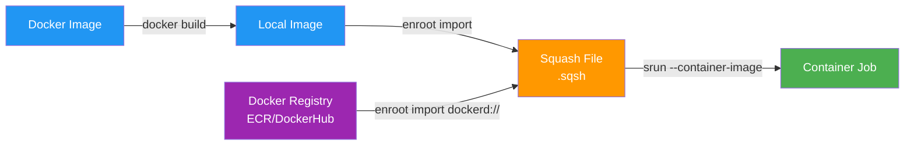

::::details 前提
:::message
**対象読者**: 大規模基盤モデルがどういうものかを理解している方、これからモデル学習を行う方
:::
:::message
**ライセンス**: © 2025 littlemex.
本文および自作図表: CC BY 4.0
※公式ドキュメントからの引用や翻訳部分は原典の著作権に従います。
引用画像: 各画像の出典に記載されたライセンスに従います。
:::
:::message
一部 AI を用いて文章を作成します。レビューは実施しますが、見逃せない重大な間違いなどがあれば[こちらのIssue](https://github.com/littlemex/samples/issues)から連絡をお願いします。
:::
::::

**本章では AWS ParallelCluster を実際に試してみましょう。以下のリポジトリをマスターとして説明に一部補足を加えて実施します。**

:::message
実装が変更される可能性があるため必要に応じてリポジトリの README を確認ください
:::

https://github.com/aws-samples/awsome-distributed-training/tree/main/1.architectures/2.aws-parallelcluster

英語に抵抗がない方は以下のワークショップもおすすめです。

https://catalog.workshops.aws/ml-on-aws-parallelcluster/en-US

---

# AWS ParallelCluster による分散学習環境の構築

本章では、AWS ParallelCluster 環境の構築方法を解説します。本章では最低限の動作確認を目的とした構成を紹介します（Head Node: m5.2xlarge、Compute Node: m5.xlarge × 3 台）。実際の分散学習では GPU インスタンス（p5.48xlarge など）を使用し、より大規模な構成が必要になります。

## アーキテクチャ概要

AWS ParallelCluster は 2 層のインフラストラクチャで構成されます。


::::details 各コンポーネント

## Head Node
- ログインノードとしてユーザーがクラスター接続する際のエントリーポイント
- Slurm スケジューラのコントローラーとして、ジョブ管理とリソース割り当てを実行
- 管理サービス（監視、ログ収集など）を実行
- 推奨インスタンスタイプは m5.8xlarge（32 vCPU、128 GiB メモリ）

## Compute Node
- 実際の計算ワークロードを実行するワーカーノード
- GPU インスタンス（P4d、P5、Trn など）または CPU インスタンスを使用
- Slurm スケジューラからのジョブ要求に応じて動的にプロビジョニング
- EFA（Elastic Fabric Adapter）により低レイテンシのノード間通信を実現

## Shared Storage

**FSx for Lustre**（/fsx マウントポイント）
- 高性能な並列ファイルシステムで、トレーニングデータとチェックポイント保存に使用
- S3 バケットとの Data Repository Association（DRA）により自動的なデータ同期が可能
- `PERSISTENT_2` デプロイメントタイプを使用することで、高可用性と高パフォーマンスを両立

**FSx for OpenZFS**（/home マウントポイント）
- ホームディレクトリの保存に使用
- ユーザー設定、スクリプト、小規模なファイルの管理に最適
- NFS プロトコルをサポートし、POSIX 準拠のファイルシステム
::::

## 事前準備

必要なツールをローカルもしくはクラウド IDE 環境にインストールしてください。

::::details 必要なツール

AWS CloudShell から作業することも可能です。


以下のツールをインストールする必要があります。

**Git**
- リポジトリのクローンとバージョン管理に使用します
- インストール: [Git ダウンロードページ](https://git-scm.com/downloads)
- AWS CloudShell の場合はすでにインストールされています

**Python 3.8 以降**
- AWS ParallelCluster CLI の実行に必要です
- インストール: [Python ダウンロードページ](https://www.python.org/downloads/)
- 確認コマンド: `python3 --version`
- AWS CloudShell の場合はすでにインストールされています

**yq**
- YAML ファイルの処理に使用する軽量コマンドラインツールです
- インストール方法
  - macOS: `brew install yq`
  - Linux: `sudo snap install yq` または `sudo apt-get install yq`
  - Windows: `choco install yq`
  - AWS CloudShell: `sudu yum install yq`
- 確認コマンド: `yq --version`
::::

## 1. 環境変数の設定

:::message
- [ ] 1-1. サンプルリポジトリのクローン
:::

::::details 1-1. サンプルリポジトリのクローン

:::message
なんのための作業か: 
:::

:::message
次のステップに進む条件:
:::

サンプルリポジトリをクローンして作業ディレクトリに移動します。

```bash
git clone https://github.com/aws-samples/awsome-distributed-training.git
cd awsome-distributed-training/1.architectures/2.aws-parallelcluster
```
::::

::::details 1-2. クラスター設定ファイルの作成
次に、クラスター設定ファイルを保存するディレクトリを作成します。

```bash
export AWS_REGION=ap-northeast-1
export CLUSTER_NAME=ml-cluster
export PCLUSTER_VERSION=3.13.1
export CONFIG_DIR="${HOME}/${CLUSTER_NAME}_${AWS_REGION}_${PCLUSTER_VERSION}"

mkdir -p ${CONFIG_DIR}
touch ${CONFIG_DIR}/config.yaml
yq -i ".CLUSTER_NAME = \"$CLUSTER_NAME\"" ${CONFIG_DIR}/config.yaml
yq -i ".AWS_REGION = \"$AWS_REGION\"" ${CONFIG_DIR}/config.yaml
yq -i ".PCLUSTER_VERSION = \"$PCLUSTER_VERSION\"" ${CONFIG_DIR}/config.yaml
```
::::

### AWS ParallelCluster CLI のインストール

AWS ParallelCluster CLI は Python 仮想環境にインストールすることを推奨します。

```bash
export VIRTUAL_ENV_PATH=~/pcluster_${PCLUSTER_VERSION}_env
# pip と virtualenv モジュールの更新
python3 -m pip install --upgrade pip
python3 -m pip install --user --upgrade virtualenv
python3 -m virtualenv ${VIRTUAL_ENV_PATH}
source ${VIRTUAL_ENV_PATH}/bin/activate
pip3 install awscli
pip3 install aws-parallelcluster==${PCLUSTER_VERSION}
```

### Capacity Reservation の準備

分散学習では通常、P または Trn インスタンスが必要ですが、これらは需要が高く、オンデマンドプールから起動することが困難な場合があります。On-Demand Capacity Reservation（ODCR）または EC2 Capacity Blocks（CB）を使用してキャパシティを予約することを強く推奨します。

ODCR は EC2 インスタンスを起動せずにキャパシティを予約するツールです。P または Trn インスタンスの ODCR は通常 AWS によって作成されます。

[Amazon EC2 Capacity Blocks for ML](https://aws.amazon.com/ec2/capacityblocks/) は、ML ワークロード用の計算キャパシティを予約する別の方法です。ODCR とは異なり、Capacity Blocks では特定の時間ウィンドウ（1 日から 14 日間）と開始時刻を指定してキャパシティを予約できます。

最低限の動作確認では、以下の環境変数を設定します。

```bash
# 最低限の動作確認用構成
export AZ=<your-availability-zone>  # 例: ap-northeast-1a
export NUM_INSTANCES=3  # Compute Node 数
export INSTANCE=m5.xlarge  # Compute Node のインスタンスタイプ

yq -i ".AZ = \"$AZ\"" ${CONFIG_DIR}/config.yaml
yq -i ".NUM_INSTANCES = \"$NUM_INSTANCES\"" ${CONFIG_DIR}/config.yaml
yq -i ".INSTANCE = \"$INSTANCE\"" ${CONFIG_DIR}/config.yaml
```

GPU インスタンスを使用する場合は、Capacity Reservation が必要です。

```bash
export CAPACITY_RESERVATION_ID=<your-capacity-reservation-id>  # 例: cr-0123456789abcdef0
export AZ=<your-availability-zone>  # 例: ap-northeast-1a
export NUM_INSTANCES=<number-of-instances>  # 例: 8
export INSTANCE=<instance-type>  # 例: p5.48xlarge

yq -i ".CAPACITY_RESERVATION_ID = \"$CAPACITY_RESERVATION_ID\"" ${CONFIG_DIR}/config.yaml
yq -i ".AZ = \"$AZ\"" ${CONFIG_DIR}/config.yaml
yq -i ".NUM_INSTANCES = \"$NUM_INSTANCES\"" ${CONFIG_DIR}/config.yaml
yq -i ".INSTANCE = \"$INSTANCE\"" ${CONFIG_DIR}/config.yaml
```

### EC2 Key Pair の作成

EC2 Key Pair を使用して、SSH または AWS Systems Manager 経由でクラスターの Head Node に接続できます。

既存の Key Pair がない場合は、以下のコマンドで作成します。

```bash
export KEYPAIR_NAME=<your-keypair-name>
yq -i ".KEYPAIR_NAME = \"$KEYPAIR_NAME\"" ${CONFIG_DIR}/config.yaml

# Key Pair の作成と秘密鍵の保存
pushd ~/.ssh
aws ec2 create-key-pair \
    --key-name ${KEYPAIR_NAME} \
    --query KeyMaterial \
    --key-type ed25519 \
    --region ${AWS_REGION} \
    --output text > ${KEYPAIR_NAME}.pem

# 秘密鍵のパーミッション設定
chmod 600 ${KEYPAIR_NAME}.pem
popd
```

作成を確認するには、以下のコマンドを実行します。

```bash
aws ec2 describe-key-pairs --region ${AWS_REGION}
```

### S3 バケットの作成（オプション）

S3 バケットは、トレーニングデータ、モデルチェックポイント、その他のアーティファクトをクラスターのデプロイメント間で永続化するために使用できます。後で FSx for Lustre との Data Repository Association（DRA）を通じて統合できます。

CloudFormation テンプレートを使用してデプロイします。

1. 以下のボタンをクリックして CloudFormation スタックを起動します

   [1-Click Deploy 🚀](https://console.aws.amazon.com/cloudformation/home#/stacks/quickcreate?templateUrl=https://awsome-distributed-training.s3.amazonaws.com/templates/0.private-bucket.yaml&stackName=cluster-data-bucket)

2. CloudFormation コンソールで以下を入力します
   - スタック名（例: `cluster-data-bucket`）
   - バケット名
   - "Create stack" をクリック

3. スタック作成が完了したら、Outputs タブからバケット名を取得します

```bash
export DATA_BUCKET_NAME=$(aws cloudformation describe-stacks \
    --stack-name cluster-data-bucket \
    --query 'Stacks[0].Outputs[?OutputKey==`S3BucketName`].OutputValue' \
    --region ${AWS_REGION} \
    --output text)

echo "Your data bucket name is: ${DATA_BUCKET_NAME}"
yq -i ".DATA_BUCKET_NAME = \"$DATA_BUCKET_NAME\"" ${CONFIG_DIR}/config.yaml
```

## クラスターのデプロイ

### Step 1: 前提条件インフラのデプロイ

VPC、セキュリティグループ、FSx for Lustre、FSx for OpenZFS などのインフラストラクチャを CloudFormation テンプレートを使用してデプロイします。

1. 以下のリンクをクリックして CloudFormation にデプロイします

   [1-Click Deploy 🚀](https://console.aws.amazon.com/cloudformation/home#/stacks/quickcreate?templateUrl=https://awsome-distributed-training.s3.amazonaws.com/templates/parallelcluster-prerequisites.yaml&stackName=parallelcluster-prerequisites)

   **重要**: リンクを開く際、Compute リソースが配置されるリージョンとアベイラビリティーゾーンを指定する必要があります。スタックを作成する際に、正しいリージョンを選択し、"Availability Zone configuration for the subnets" フィールドに入力してください。

2. CloudFormation スタックのデプロイが完了したら、スタック名を環境変数としてエクスポートします

```bash
export STACK_ID_VPC=parallelcluster-prerequisites
yq -i ".STACK_ID_VPC = \"$STACK_ID_VPC\"" ${CONFIG_DIR}/config.yaml
```

### Data Repository Association の作成（オプション）

S3 バケットをデプロイした場合、FSx for Lustre ファイルシステムとの間に Data Repository Association（DRA）を作成できます。

```bash
export FSX_ID=$(aws cloudformation describe-stacks \
    --stack-name ${STACK_ID_VPC} \
    --query 'Stacks[0].Outputs[?OutputKey==`FSxLustreFilesystemId`].OutputValue' \
    --region ${AWS_REGION} \
    --output text)

aws fsx create-data-repository-association \
    --file-system-id ${FSX_ID} \
    --file-system-path "/data" \
    --data-repository-path s3://${DATA_BUCKET_NAME} \
    --s3 AutoImportPolicy='{Events=[NEW,CHANGED,DELETED]},AutoExportPolicy={Events=[NEW,CHANGED,DELETED]}' \
    --batch-import-meta-data-on-create \
    --region ${AWS_REGION}
```

DRA の作成ステータスは以下のコマンドで確認できます。

```bash
aws fsx describe-data-repository-associations \
    --filters "Name=file-system-id,Values=${FSX_ID}" \
    --query "Associations[0].Lifecycle" \
    --output text \
    --region ${AWS_REGION}
```

出力が `AVAILABLE` になるまで待ちます。

### Step 2: クラスター設定ファイルの生成

仮想環境が有効になっていることを確認します。

```bash
source ${VIRTUAL_ENV_PATH}/bin/activate
```

設定ファイルの内容を確認します。

```bash
cat ${CONFIG_DIR}/config.yaml
```

出力例（環境によって値は異なります）は以下のようになります。

```yaml
CLUSTER_NAME: ml-cluster
AWS_REGION: ap-northeast-1
PCLUSTER_VERSION: 3.13.1
CAPACITY_RESERVATION_ID: cr-XXXXXXXXXXXXXXXXX
AZ: ap-northeast-1a
NUM_INSTANCES: "8"
INSTANCE: p5.48xlarge
KEYPAIR_NAME: my-keypair
DATA_BUCKET_NAME: cluster-data-bucket-ap-northeast-1-XXXXXXXXXXXX
STACK_ID_VPC: parallelcluster-prerequisites
```

CloudFormation スタックから追加の環境変数を取得し、クラスター設定を生成します。

```bash
# CloudFormation スタックの出力を取得
aws cloudformation describe-stacks \
    --stack-name $STACK_ID_VPC \
    --query 'Stacks[0].Outputs[?contains(@.OutputKey, ``)].{OutputKey:OutputKey, OutputValue:OutputValue}' \
    --region ${AWS_REGION} \
    --output json | yq e '.[] | .OutputKey + ": " + .OutputValue' - > ${CONFIG_DIR}/stack_outputs.yaml

# config.yaml とマージ
yq eval-all 'select(fileIndex == 0) * select(fileIndex == 1)' ${CONFIG_DIR}/config.yaml ${CONFIG_DIR}/stack_outputs.yaml > ${CONFIG_DIR}/config_updated.yaml
mv ${CONFIG_DIR}/config_updated.yaml ${CONFIG_DIR}/config.yaml
rm ${CONFIG_DIR}/stack_outputs.yaml

# 環境変数として読み込み
eval $(yq e 'to_entries | .[] | "export " + .key + "=\"" + .value + "\""' ${CONFIG_DIR}/config.yaml)

# 設定ファイルを生成
cat cluster-templates/cluster-vanilla.yaml | envsubst > ${CONFIG_DIR}/cluster.yaml
```

### クラスター設定ファイルの詳細

生成された `cluster.yaml` ファイルには以下の主要な設定が含まれています。

#### Head Node 設定

最低限の動作確認では、以下のように設定します。

```yaml
HeadNode:
  InstanceType: m5.2xlarge  # 8 vCPU, 32 GiB メモリ（動作確認用）
  Networking:
    SubnetId: ${PublicSubnet}
    AdditionalSecurityGroups:
      - ${SecurityGroup}
  Ssh:
    KeyName: ${KEYPAIR_NAME}
  LocalStorage:
    RootVolume:
      Size: 500  # GB
      DeleteOnTermination: true
  Iam:
    AdditionalIamPolicies:
      - Policy: arn:aws:iam::aws:policy/AmazonSSMManagedInstanceCore
      - Policy: arn:aws:iam::aws:policy/AmazonS3ReadOnlyAccess
      - Policy: arn:aws:iam::aws:policy/AmazonEC2ContainerRegistryReadOnly
  CustomActions:
    OnNodeConfigured:
      Sequence:
        - Script: 'https://raw.githubusercontent.com/aws-samples/aws-parallelcluster-post-install-scripts/main/docker/postinstall.sh'
        - Script: 'https://raw.githubusercontent.com/aws-samples/aws-parallelcluster-post-install-scripts/main/nccl/postinstall.sh'
          Args:
            - v2.26.6-1  # NCCL バージョン
            - v1.14.2    # AWS OFI NCCL バージョン
        - Script: 'https://raw.githubusercontent.com/aws-samples/aws-parallelcluster-post-install-scripts/main/pyxis/postinstall.sh'
```

**設定のポイント**
- `InstanceType`: Head Node のインスタンスタイプ。管理タスクに十分な CPU とメモリを確保します
- `Ssh.KeyName`: SSH 接続用の Key Pair
- `RootVolume.Size`: ルートボリュームのサイズ。Docker イメージやログの保存に使用します
- `AdditionalIamPolicies`: SSM、S3、ECR へのアクセスを許可する IAM ポリシー
- `CustomActions.OnNodeConfigured`: ノード起動時に実行されるスクリプト。Docker、NCCL、Pyxis をインストールします

#### Compute Node 設定

```yaml
Scheduling:
  Scheduler: slurm
  SlurmSettings:
    ScaledownIdletime: 60  # アイドル 60 秒後にスケールダウン
    QueueUpdateStrategy: DRAIN
  SlurmQueues:
    - Name: compute-gpu
      CapacityType: ONDEMAND
      Networking:
        SubnetIds:
          - ${PrimaryPrivateSubnet}
        PlacementGroup:
          Enabled: false  # AWS 提供の ODCR/CB を使用する場合は false に設定
        AdditionalSecurityGroups:
          - ${SecurityGroup}
      ComputeSettings:
        LocalStorage:
          EphemeralVolume:
            MountDir: /scratch  # インスタンス NVMe ローカルストレージ
          RootVolume:
            Size: 512  # GB
      ComputeResources:
        - Name: distributed-ml
          InstanceType: ${INSTANCE}  # 例: p5.48xlarge
          MinCount: ${NUM_INSTANCES}  # 最小インスタンス数
          MaxCount: ${NUM_INSTANCES}  # 最大インスタンス数
          Efa:
            Enabled: true  # EFA を有効化
          CapacityReservationTarget:
            CapacityReservationId: ${CAPACITY_RESERVATION_ID}
```

**設定のポイント**
- `ScaledownIdletime`: ノードがアイドル状態になってからスケールダウンするまでの時間（秒）
- `PlacementGroup.Enabled`: AWS 提供の ODCR/CB を使用する場合は `false` に設定。ユーザーが調達した ODCR を使用する場合は `true` に設定し、Placement Group 名を指定します
- `MinCount`/`MaxCount`: 両方を同じ値に設定すると、キャパシティが維持されスケールダウンしません
- `Efa.Enabled`: 低レイテンシのノード間通信のために EFA を有効化します
- `CapacityReservationId`: 使用する Capacity Reservation の ID

#### Shared Storage 設定

```yaml
SharedStorage:
  - Name: HomeDirs
    MountDir: /home
    StorageType: FsxOpenZfs
    FsxOpenZfsSettings:
      VolumeId: ${FSxORootVolumeId}
  - MountDir: /fsx
    Name: fsx
    StorageType: FsxLustre
    FsxLustreSettings:
      FileSystemId: ${FSxLustreFilesystemId}
```

**設定のポイント**
- `/home`: FSx for OpenZFS。ユーザーのホームディレクトリとして使用
- `/fsx`: FSx for Lustre。トレーニングデータとチェックポイントの保存に使用

### Step 3: クラスターの作成

生成された設定ファイルを使用してクラスターを作成します。

```bash
pcluster create-cluster \
    --cluster-name ${CLUSTER_NAME} \
    --cluster-configuration ${CONFIG_DIR}/cluster.yaml \
    --region ${AWS_REGION} \
    --rollback-on-failure false
```

出力例は以下のようになります。

```json
{
  "cluster": {
    "clusterName": "ml-cluster",
    "cloudformationStackStatus": "CREATE_IN_PROGRESS",
    "cloudformationStackArn": "arn:aws:cloudformation:ap-northeast-1:123456789012:stack/ml-cluster/abcd1234-...",
    "region": "ap-northeast-1",
    "version": "3.13.1",
    "clusterStatus": "CREATE_IN_PROGRESS",
    "scheduler": {
      "type": "slurm"
    }
  }
}
```

### クラスター作成の監視

クラスターの作成進行状況は複数の方法で監視できます。

**AWS ParallelCluster CLI を使用**

```bash
pcluster list-clusters --region ${AWS_REGION}
```

**CloudFormation コンソールを使用**
1. [CloudFormation コンソール](https://console.aws.amazon.com/cloudformation)に移動
2. クラスターのスタックを選択
3. "Events" タブでリアルタイムの更新を監視

クラスターの作成には通常 15 から 20 分かかります。ステータスが "CREATE_COMPLETE" になるまで待ってから次に進みます。

## クラスターへの接続

クラスターが **CREATE_COMPLETE** 状態になったら、SSM または SSH のいずれかの方法で Head Node に接続できます。

### SSM Session Manager での接続

SSM Session Manager は、Head Node への迅速なターミナルアクセスに最適です。ポートを開く必要がなく、インスタンスが実行されている AWS アカウントでの認証のみが必要です。

1. [EC2 コンソール](https://console.aws.amazon.com/ec2/)に移動
2. Head Node インスタンスを見つける
3. "Connect" ボタンをクリック
4. "Session Manager" タブを選択
5. "Connect" をクリック

接続後、ubuntu ユーザーに切り替えます。

```bash
sudo su - ubuntu
```

### SSH での接続

SSH を使用して標準的な SSH クライアントからクラスターに接続することもできます。

Head Node の IP アドレスを取得します。

```bash
pcluster ssh --region ${AWS_REGION} --cluster-name ${CLUSTER_NAME} --identity_file ~/.ssh/${KEYPAIR_NAME}.pem --dryrun true
```

出力例は以下のようになります。

```json
{
  "command": "ssh ubuntu@18.183.235.248 --identity_file /Users/username/.ssh/my-keypair.pem"
}
```

出力されたコマンドを実行して接続します。

```bash
ssh ubuntu@18.183.235.248 -i ~/.ssh/my-keypair.pem
```

## Slurm の基本操作

Slurm は HPC クラスターで広く使用されているジョブスケジューラです。ここでは、分散学習ジョブを実行するための基本的なコマンドを解説します。

### クラスターの状態確認

**ノードの状態を確認**

```bash
sinfo
```

出力例は以下のようになります。

```
PARTITION AVAIL  TIMELIMIT  NODES  STATE NODELIST
compute-gpu*  up   infinite      8   idle compute-gpu-distributed-ml-[1-8]
```

- `PARTITION`: キュー名
- `AVAIL`: パーティションの利用可能性
- `NODES`: ノード数
- `STATE`: ノードの状態（idle、allocated、down など）

**詳細なノード情報を確認**

```bash
sinfo -N -l
```

### srun: 対話的なジョブ実行

`srun` コマンドは、ジョブを対話的に実行するために使用します。コマンドを実行すると、リソースが割り当てられ、即座に実行されます。

**基本的な使用例**

```bash
# 単一ノードで hostname を実行
srun hostname

# 2 ノード、各ノード 1 タスクで実行
srun --nodes=2 --ntasks-per-node=1 hostname

# GPU 情報の確認
srun --nodes=1 --ntasks=1 --gpus-per-node=8 nvidia-smi
```

**MPI プログラムの実行**

```bash
# 2 ノード、各ノード 8 GPU で MPI プログラムを実行
srun --nodes=2 \
     --ntasks-per-node=8 \
     --gpus-per-node=8 \
     --mpi=pmix \
     --cpu-bind=none \
     ./my-training-script.sh
```

**主要なオプション**
- `--nodes`: 使用するノード数
- `--ntasks-per-node`: ノードあたりのタスク数（通常は GPU 数と同じ）
- `--gpus-per-node`: ノードあたりの GPU 数
- `--mpi`: MPI の実装（pmix、pmi2 など）
- `--cpu-bind`: CPU バインディングの方法（none、cores、threads など）

### sbatch: バッチジョブの投入

`sbatch` コマンドは、バッチジョブをキューに投入するために使用します。スクリプトファイルを指定し、ジョブはスケジューラーによって管理されます。

**バッチスクリプトの例**（nccl-test.sbatch）

```bash
#!/bin/bash

#SBATCH --job-name=nccl-test
#SBATCH --nodes=2
#SBATCH --ntasks-per-node=8
#SBATCH --gpus-per-node=8
#SBATCH --output=%x_%j.out
#SBATCH --error=%x_%j.err
#SBATCH --exclusive
#SBATCH --wait-all-nodes=1

# ジョブの内容
srun --mpi=pmix /opt/nccl-tests/build/all_reduce_perf -b 8 -e 2G -f 2 -g 1
```

**ジョブの投入**

```bash
sbatch nccl-test.sbatch
```

出力例は以下のようになります。

```
Submitted batch job 123
```

**主要な #SBATCH ディレクティブ**
- `--job-name`: ジョブの名前
- `--nodes`: 使用するノード数
- `--ntasks-per-node`: ノードあたりのタスク数
- `--gpus-per-node`: ノードあたりの GPU 数
- `--output`: 標準出力のファイル名（%x はジョブ名、%j はジョブ ID）
- `--error`: 標準エラー出力のファイル名
- `--exclusive`: ノード全体を専有する
- `--wait-all-nodes`: 全ノードが準備完了するまで待機

### salloc: リソースの対話的な割り当て

`salloc` コマンドは、対話的なセッション用にリソースを割り当てます。割り当てられたリソース上で複数のコマンドを実行できます。

**基本的な使用例**

```bash
# 2 ノード、各ノード 8 GPU を割り当て
salloc --nodes=2 --ntasks-per-node=8 --gpus-per-node=8

# 割り当てられたリソース上でコマンドを実行
srun hostname
srun nvidia-smi

# セッションを終了
exit
```

`salloc` は開発やデバッグ時に便利です。リソースを割り当てたまま、複数のコマンドを試すことができます。

### ジョブの管理

**ジョブの状態を確認**（squeue）

```bash
# 全ジョブの状態を表示
squeue

# 自分のジョブのみを表示
squeue -u $USER

# 詳細な情報を表示
squeue -l
```

出力例は以下のようになります。

```
JOBID PARTITION     NAME     USER ST       TIME  NODES NODELIST(REASON)
  123 compute-g nccl-tes   ubuntu  R       1:23      2 compute-gpu-distributed-ml-[1-2]
```

- `JOBID`: ジョブ ID
- `ST`: ジョブの状態（R: Running、PD: Pending、CG: Completing など）
- `TIME`: 実行時間
- `NODES`: 使用しているノード数
- `NODELIST`: 使用しているノードのリスト

**ジョブをキャンセル**（scancel）

```bash
# ジョブ ID を指定してキャンセル
scancel 123

# 自分の全ジョブをキャンセル
scancel -u $USER

# 特定のジョブ名をキャンセル
scancel --name=nccl-test
```

**ジョブの詳細情報を確認**（scontrol）

```bash
# ジョブの詳細を表示
scontrol show job 123

# ノードの詳細を表示
scontrol show node compute-gpu-distributed-ml-1
```

## コンテナを使ったジョブ実行

AWS ParallelCluster では、Enroot と Pyxis を使用してコンテナ化されたワークロードを Slurm 上で実行できます。これにより、環境の再現性と移植性が向上します。

### Enroot と Pyxis の概要

**Enroot**
- NVIDIA が開発したコンテナランタイムです
- Docker イメージを Squash ファイル形式に変換します
- 高性能な HPC ワークロード向けに最適化されています

**Pyxis**
- Enroot を Slurm と統合する Slurm プラグインです
- `srun` コマンドで `--container-image` オプションを使用してコンテナを実行できます

### コンテナイメージの準備

コンテナを使用するための基本的なワークフローは以下の通りです。



### enroot import: Docker イメージから Squash ファイルへの変換

`enroot import` コマンドは、Docker イメージを Squash ファイル形式（.sqsh）に変換します。Squash ファイルは読み取り専用の圧縮ファイルシステムイメージで、HPC 環境での配布と実行に最適化されています。

**ローカルの Docker イメージから変換**

```bash
# Docker イメージをビルド
docker build -t my-training-image:latest .

# Squash ファイルに変換
enroot import -o /fsx/my-training-image.sqsh dockerd://my-training-image:latest
```

**Docker レジストリから直接変換**

```bash
# Docker Hub から変換
enroot import -o /fsx/pytorch.sqsh docker://nvcr.io/nvidia/pytorch:24.07-py3

# AWS ECR から変換
enroot import -o /fsx/my-image.sqsh \
  dockerd://123456789012.dkr.ecr.ap-northeast-1.amazonaws.com/my-image:latest

# パブリック ECR から変換
enroot import -o /fsx/nccl-tests.sqsh \
  dockerd://public.ecr.aws/hpc-cloud/nccl-tests:latest
```

**変換プロセス**
1. Docker イメージの全レイヤーをダウンロード
2. レイヤーを統合
3. Squash ファイルシステムとして圧縮
4. 指定されたパスに保存

変換には数分から数十分かかる場合があります。進行状況は標準出力に表示されます。

### srun --container-image: コンテナでジョブを実行

`srun` コマンドに `--container-image` オプションを追加することで、コンテナ内でジョブを実行できます。

**基本的な使用例**

```bash
# 単純なコマンドをコンテナ内で実行
srun --nodes=1 \
     --ntasks=1 \
     --container-image=/fsx/pytorch.sqsh \
     python --version

# GPU を使用してコマンドを実行
srun --nodes=1 \
     --ntasks=1 \
     --gpus-per-node=8 \
     --container-image=/fsx/pytorch.sqsh \
     nvidia-smi
```

**ボリュームのマウント**（--container-mounts）

ホストのディレクトリをコンテナ内にマウントするには、`--container-mounts` オプションを使用します。

```bash
# /fsx ディレクトリをマウント
srun --container-image=/fsx/pytorch.sqsh \
     --container-mounts=/fsx:/fsx \
     python /fsx/train.py

# 複数のディレクトリをマウント
srun --container-image=/fsx/pytorch.sqsh \
     --container-mounts=/fsx:/fsx,/home/ubuntu:/workspace \
     python /workspace/train.py

# カレントディレクトリをマウント
srun --container-image=/fsx/pytorch.sqsh \
     --container-mounts=$PWD:/work \
     python /work/train.py
```

**環境変数の設定**

```bash
# 環境変数を設定してコンテナを実行
export NCCL_DEBUG=INFO
export NCCL_SOCKET_IFNAME=eth0

srun --container-image=/fsx/pytorch.sqsh \
     --container-mounts=/fsx:/fsx \
     --export=ALL \
     python /fsx/train.py
```

`--export=ALL` オプションは、ホストの全環境変数をコンテナに渡します。

**MPI を使用した分散実行**

```bash
# 2 ノード、各ノード 8 GPU で分散学習を実行
srun --nodes=2 \
     --ntasks-per-node=8 \
     --gpus-per-node=8 \
     --mpi=pmix \
     --cpu-bind=none \
     --container-image=/fsx/pytorch.sqsh \
     --container-mounts=/fsx:/fsx \
     python /fsx/train.py
```

**主要なオプション**
- `--container-image`: 使用する Squash ファイルのパス
- `--container-mounts`: ホストからコンテナへのマウントポイント（`host_path:container_path` 形式）
- `--export`: 環境変数のエクスポート方法（ALL、NONE、または特定の変数名）
- `--mpi`: MPI の実装タイプ

## 実践例：NCCL テスト

NCCL（NVIDIA Collective Communications Library）テストは、GPU 間の通信性能を評価するためのベンチマークツールです。ここでは、AWS ParallelCluster 上で NCCL テストを実行する手順を解説します。

### NCCL テストの概要

NCCL テストは以下の通信パターンを評価できます。

| テスト名 | 説明 |
|---------|------|
| all_reduce_perf | 全 GPU でデータを集約し、結果を全 GPU に配布 |
| all_gather_perf | 全 GPU からデータを収集し、全 GPU に配布 |
| broadcast_perf | 1 つの GPU から全 GPU にデータをブロードキャスト |
| reduce_perf | 全 GPU からデータを集約し、1 つの GPU に結果を配布 |
| reduce_scatter_perf | データを分割して各 GPU に配布 |
| alltoall_perf | 全 GPU 間でデータを交換 |
| scatter_perf | 1 つの GPU から全 GPU にデータを分散 |
| gather_perf | 全 GPU からデータを収集し、1 つの GPU に集約 |

### コンテナイメージの準備

まず、NCCL テスト用のコンテナイメージを準備します。

**方法 1: パブリック ECR から取得**

```bash
# パブリック ECR から NCCL テストイメージを取得
enroot import -o /fsx/nccl-tests.sqsh \
  dockerd://public.ecr.aws/hpc-cloud/nccl-tests:efa1.43.2-ofi1.16.3-nccl2.27.7-1-tests2.16.9
```

**方法 2: 自分でビルド**

サンプルリポジトリには Dockerfile が含まれています。

```bash
# リポジトリディレクトリに移動
cd awsome-distributed-training/micro-benchmarks/nccl-tests

# バージョンを指定
export GDRCOPY_VERSION=v2.5.1
export EFA_INSTALLER_VERSION=1.43.2
export AWS_OFI_NCCL_VERSION=v1.16.3
export NCCL_VERSION=v2.27.7-1
export NCCL_TESTS_VERSION=v2.16.9
export TAG="efa${EFA_INSTALLER_VERSION}-ofi${AWS_OFI_NCCL_VERSION}-nccl${NCCL_VERSION}-tests${NCCL_TESTS_VERSION}"

# Docker イメージをビルド
docker build -f nccl-tests.Dockerfile \
  --build-arg="EFA_INSTALLER_VERSION=${EFA_INSTALLER_VERSION}" \
  --build-arg="AWS_OFI_NCCL_VERSION=${AWS_OFI_NCCL_VERSION}" \
  --build-arg="NCCL_VERSION=${NCCL_VERSION}" \
  --build-arg="NCCL_TESTS_VERSION=${NCCL_TESTS_VERSION}" \
  -t nccl-tests:${TAG} \
  .

# Squash ファイルに変換
enroot import -o /fsx/nccl-tests.sqsh dockerd://nccl-tests:${TAG}
```

### Slurm スクリプトの作成

以下のような Slurm スクリプトを作成します（`nccl-test.sbatch`）。

```bash
#!/bin/bash

#SBATCH --job-name=nccl-allreduce
#SBATCH --nodes=2
#SBATCH --ntasks-per-node=8
#SBATCH --gpus-per-node=8
#SBATCH --output=%x_%j.out
#SBATCH --error=%x_%j.err
#SBATCH --exclusive
#SBATCH --wait-all-nodes=1
#SBATCH --ntasks-per-core=1

# 環境変数の設定
export APPS_PATH=/fsx
export IMAGE=${APPS_PATH}/nccl-tests.sqsh
export NCCL_TESTS_PATH=/opt/nccl-tests/build

# EFA の設定
export FI_PROVIDER=efa
export FI_EFA_FORK_SAFE=1

# NCCL の設定
export NCCL_DEBUG=INFO

# パフォーマンス最適化
export NCCL_BUFFSIZE=8388608
export NCCL_P2P_NET_CHUNKSIZE=524288
export NCCL_TUNER_PLUGIN=/opt/amazon/ofi-nccl/lib/$(uname -m)-linux-gnu/libnccl-ofi-tuner.so

# ホスト名とインスタンス ID を表示
mpirun -N 1 bash -c 'echo $(hostname): $(cat /sys/devices/virtual/dmi/id/board_asset_tag | tr -d " ")'

# NCCL テストを実行
srun --mpi=pmix \
     --cpu-bind=none \
     --container-image=${IMAGE} \
     ${NCCL_TESTS_PATH}/all_reduce_perf \
     -b 8 -e 16G -f 2 -g 1 -c 1 -n 100
```

**スクリプトの説明**

- `-b 8`: テストの開始サイズ（8 バイト）
- `-e 16G`: テストの終了サイズ（16 GB）
- `-f 2`: サイズの増加係数（2 倍ずつ増加）
- `-g 1`: GPU あたりのテスト数
- `-c 1`: チェックを有効化
- `-n 100`: 各サイズでのイテレーション数

**重要な環境変数**

- `FI_PROVIDER=efa`: EFA を通信プロバイダーとして使用
- `FI_EFA_FORK_SAFE=1`: フォーク後の EFA 使用を許可
- `NCCL_DEBUG=INFO`: NCCL のデバッグ情報を出力
- `NCCL_BUFFSIZE`: 送信キューの深さを増やし、通信を非ブロッキング化
- `NCCL_P2P_NET_CHUNKSIZE`: P2P 通信のバッファサイズを最適化
- `NCCL_TUNER_PLUGIN`: AWS 最適化されたチューニングプラグインを使用

### ジョブの投入と結果の確認

```bash
# ジョブを投入
sbatch nccl-test.sbatch

# ジョブの状態を確認
squeue

# 出力ファイルを確認
tail -f nccl-allreduce_<job-id>.out
```

### 結果の解釈

テストが完了すると、以下のような出力が得られます（p5.48xlarge × 2 ノードの例）。

```
#       size         count      type   redop    root     time   algbw   busbw #wrong
#        (B)    (elements)                               (us)  (GB/s)  (GB/s)       
           8             2     float     sum      -1    69.12    0.00    0.00      0
          16             4     float     sum      -1    72.64    0.00    0.00      0
         ...
    67108864      16777216     float     sum      -1    601.5  111.57  209.19      0
   134217728      33554432     float     sum      -1    870.3  154.22  289.16      0
   268435456      67108864     float     sum      -1   1468.2  182.83  342.81      0
   536870912     134217728     float     sum      -1   2559.2  209.78  393.34      0
  1073741824     268435456     float     sum      -1   4607.6  233.04  436.95      0
  2147483648     536870912     float     sum      -1   9074.5  236.65  443.72      0
  4294967296    1073741824     float     sum      -1  17286.0  248.46  465.87      0
  8589934592    2147483648     float     sum      -1  33605.0  255.62  479.28      0
 17179869184    4294967296     float     sum      -1  66132.0  259.78  487.09      0
```

**列の説明**

- `size`: 転送するデータサイズ（バイト）
- `count`: 要素数
- `type`: データ型（float、half など）
- `time`: 操作の実行時間（マイクロ秒）
- `algbw`: アルゴリズム帯域幅（GB/s）。データサイズを時間で割った値
- `busbw`: バス帯域幅（GB/s）。実際のネットワークトラフィックを反映した値
- `#wrong`: エラーの数

**パフォーマンスの評価**

all_reduce では、バス帯域幅は以下の式で計算されます。

```
busbw = algbw × (2 × (n - 1) / n)
```

ここで n はランク数（GPU 数）です。

p5.48xlarge インスタンスの理論的な EFA 帯域幅は以下の通りです。

- インスタンス内（NVLink）: 900 GB/s
- インスタンス間（EFA）: 3200 Gbps（400 GB/s）

大きなデータサイズ（数 GB 以上）での busbw が 400 GB/s に近い値を示していれば、ネットワーク性能が十分に発揮されていることを示します。

### 他の通信パターンのテスト

all_reduce 以外の通信パターンをテストするには、スクリプト内の実行ファイルを変更します。

```bash
# all_gather をテスト
${NCCL_TESTS_PATH}/all_gather_perf -b 8 -e 16G -f 2 -g 1

# broadcast をテスト
${NCCL_TESTS_PATH}/broadcast_perf -b 8 -e 16G -f 2 -g 1

# reduce_scatter をテスト
${NCCL_TESTS_PATH}/reduce_scatter_perf -b 8 -e 16G -f 2 -g 1

# alltoall をテスト
${NCCL_TESTS_PATH}/alltoall_perf -b 8 -e 16G -f 2 -g 1
```

## まとめ

本章では、AWS ParallelCluster を使用した分散学習環境の構築と運用方法について解説しました。

**主要なポイント**

1. **アーキテクチャ**: Head Node と Compute Node の 2 層構造により、効率的なリソース管理を実現します
2. **Shared Storage**: FSx for Lustre による高性能ストレージと FSx for OpenZFS によるホームディレクトリの分離により、用途に応じた最適なストレージを使用できます
3. **Slurm コマンド**: srun、sbatch、salloc などのコマンドにより、柔軟なジョブ管理が可能です
4. **コンテナ統合**: Enroot と Pyxis により、コンテナ化されたワークロードを効率的に実行できます
5. **パフォーマンス検証**: NCCL テストにより、ネットワーク性能を定量的に評価できます

AWS ParallelCluster は、オンプレミスの HPC クラスターと同様の使用感を保ちながら、AWS のスケーラビリティと柔軟性を活用できる強力なツールです。本章で学んだ内容をもとに、実際の分散学習ワークロードを効率的に実行できるようになります。
