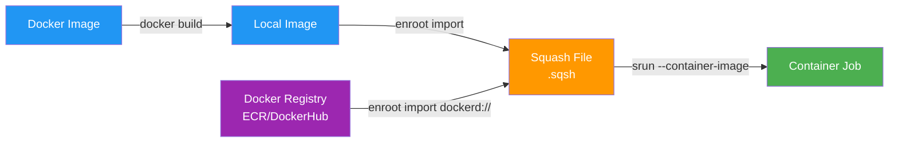

::::details 前提
:::message
**対象読者**: 大規模基盤モデルがどういうものかを理解している方、これからモデル学習を行う方
:::
:::message
**ライセンス**: © 2025 littlemex.
本文および自作図表: CC BY 4.0
※公式ドキュメントからの引用や翻訳部分は原典の著作権に従います。
引用画像: 各画像の出典に記載されたライセンスに従います。
:::
:::message
一部 AI を用いて文章を作成します。レビューは実施しますが、見逃せない重大な間違いなどがあれば[こちらのIssue](https://github.com/littlemex/samples/issues)から連絡をお願いします。
:::
::::

**本章では AWS ParallelCluster を実際に試してみましょう。以下のリポジトリをマスターとして説明に一部補足を加えて実施します。**

:::message
実装が変更される可能性があるため必要に応じてリポジトリの README を確認ください
:::

https://github.com/aws-samples/awsome-distributed-training/tree/main/1.architectures/2.aws-parallelcluster

英語に抵抗がない方は以下のワークショップもおすすめです。

https://catalog.workshops.aws/ml-on-aws-parallelcluster/en-US

エラーが発生した際にはトラブルシューティングを参考にしてください。

https://docs.aws.amazon.com/ja_jp/parallelcluster/latest/ug/troubleshooting-v3.html

---

# AWS ParallelCluster による分散学習環境の構築

本章では、AWS ParallelCluster 環境の構築方法を解説します。本章では最低限の動作確認を目的とした構成を紹介します（Head Node: m5.2xlarge、Compute Node: m5.xlarge × 3 台）。実際の分散学習では GPU インスタンス（p5.48xlarge など）を使用し、より大規模な構成が必要になります。

## アーキテクチャ概要

AWS ParallelCluster は 2 層のインフラストラクチャで構成されます。


::::details 各コンポーネントの詳細

### Head Node
- ログインノードとしてユーザーがクラスター接続する際のエントリーポイント
- Slurm スケジューラのコントローラーとして、ジョブ管理とリソース割り当てを実行
- 管理サービス（監視、ログ収集など）を実行
- 推奨インスタンスタイプは m5.8xlarge（32 vCPU、128 GiB メモリ）

### Compute Node
- 実際の計算ワークロードを実行するワーカーノード
- GPU インスタンス（P4d、P5、Trn など）または CPU インスタンスを使用
- Slurm スケジューラからのジョブ要求に応じて動的にプロビジョニング
- EFA（Elastic Fabric Adapter）により低レイテンシのノード間通信を実現

### Shared Storage

**FSx for Lustre**（/fsx マウントポイント）
- 高性能な並列ファイルシステムで、トレーニングデータとチェックポイント保存に使用
- S3 バケットとの Data Repository Association（DRA）により自動的なデータ同期が可能
- `PERSISTENT_2` デプロイメントタイプを使用することで、高可用性と高パフォーマンスを両立

**FSx for OpenZFS**（/home マウントポイント）
- ホームディレクトリの保存に使用
- ユーザー設定、スクリプト、小規模なファイルの管理に最適
- NFS プロトコルをサポートし、POSIX 準拠のファイルシステム
::::

## 事前準備

必要なツールをローカルもしくはクラウド IDE 環境にインストールしてください。

::::details 必要なツール

AWS CloudShell から作業することも可能です。


以下のツールをインストールする必要があります。

**Git**
- リポジトリのクローンとバージョン管理に使用
- インストール: [Git ダウンロードページ](https://git-scm.com/downloads)
- AWS CloudShell の場合はすでにインストール済み

**Python 3.8 以降**
- AWS ParallelCluster CLI の実行に必要
- インストール: [Python ダウンロードページ](https://www.python.org/downloads/)
- 確認コマンド: `python3 --version`
- AWS CloudShell の場合はすでにインストール済み

**yq**
- YAML ファイルの処理に使用する軽量コマンドラインツール
- インストール方法
  - macOS: `brew install yq`
  - Linux: `sudo snap install yq` または `sudo apt-get install yq`
  - Windows: `choco install yq`
  - AWS CloudShell: `sudo yum install yq`
- 確認コマンド: `yq --version`
::::

## 1. 環境変数の設定

:::message
- [ ] 1-1. サンプルリポジトリのクローン
- [ ] 1-2. クラスター設定ファイルの作成
:::

::::details 1-1. サンプルリポジトリのクローン

:::message
なんのための作業か: AWS ParallelCluster のサンプル設定ファイルとスクリプトを取得します。このリポジトリには、クラスター構築に必要な CloudFormation テンプレートと設定ファイルが含まれています。
:::

:::message
次のステップに進む条件: `awsome-distributed-training/1.architectures/2.aws-parallelcluster` ディレクトリに移動でき、`cluster-templates` ディレクトリが存在すること。
:::

サンプルリポジトリをクローンして作業ディレクトリに移動します。

```bash
git clone https://github.com/aws-samples/awsome-distributed-training.git
cd awsome-distributed-training/1.architectures/2.aws-parallelcluster
```

リポジトリの内容を確認します。

```bash
ls -la
```
::::

::::details 1-2. クラスター設定ファイルの作成

:::message
なんのための作業か: クラスター設定を管理するためのディレクトリと設定ファイルを作成します。後続の手順で使用する環境変数を YAML ファイルに保存し、設定の一元管理を実現します。
:::

:::message
次のステップに進む条件: `${CONFIG_DIR}/config.yaml` ファイルが作成され、基本的な設定（CLUSTER_NAME、AWS_REGION、PCLUSTER_VERSION）が保存されていること。`cat ${CONFIG_DIR}/config.yaml` で内容を確認できること。
:::

クラスター設定ファイルを保存するディレクトリを作成します。

```bash
export AWS_REGION=ap-northeast-1
export CLUSTER_NAME=ml-cluster
export PCLUSTER_VERSION=3.13.1
export CONFIG_DIR="${HOME}/${CLUSTER_NAME}_${AWS_REGION}_${PCLUSTER_VERSION}"

mkdir -p ${CONFIG_DIR}
touch ${CONFIG_DIR}/config.yaml
yq -i ".CLUSTER_NAME = \"$CLUSTER_NAME\"" ${CONFIG_DIR}/config.yaml
yq -i ".AWS_REGION = \"$AWS_REGION\"" ${CONFIG_DIR}/config.yaml
yq -i ".PCLUSTER_VERSION = \"$PCLUSTER_VERSION\"" ${CONFIG_DIR}/config.yaml
```

設定内容を確認します。

```bash
cat ${CONFIG_DIR}/config.yaml
```
::::

## 2. AWS ParallelCluster CLI のインストール

::::details AWS ParallelCluster CLI とは

`pcluster` は AWS ParallelCluster のコマンドラインインターフェース（CLI）ツールです。

## 主な用途

**HPC クラスターの管理**
- AWS クラウド上で HPC クラスターの起動、管理、削除を実行
- クラスターのライフサイクル全体を CLI から制御可能

**カスタム AMI イメージの作成と管理**
- クラスターで使用するカスタム AMI の構築
- 特定のソフトウェアやライブラリを事前インストールしたイメージを作成可能

## 主要なコマンド

**クラスター管理**
- `create-cluster`: 新しいクラスターを作成
- `delete-cluster`: クラスターを削除
- `update-cluster`: クラスターの設定を更新
- `describe-cluster`: クラスターの詳細情報を取得
- `list-clusters`: 既存のクラスター一覧を表示

**イメージ管理**
- `build-image`: カスタム AMI をビルド
- `delete-image`: イメージを削除
- `describe-image`: イメージの詳細情報を取得
- `list-images`: イメージ一覧を表示

**接続とデバッグ**
- `ssh`: クラスターに SSH 接続
- `dcv-connect`: NICE DCV セッションに接続
- `export-cluster-logs`: クラスターのログをエクスポート
- `get-cluster-log-events`: ログイベントを取得

**Compute Fleet 管理**
- `describe-compute-fleet`: Compute ノードの状態を確認
- `update-compute-fleet`: Compute ノードの起動/停止を制御

## 必要な権限

pcluster CLI を使用するには、適切な IAM ロールと権限が必要です。クラスターの作成、更新、削除などの操作には、VPC、EC2、CloudFormation、FSx などのリソースへのアクセス権限が求められます。
::::

:::message
- [ ] 2-1. Python 仮想環境のセットアップと CLI インストール
:::

::::details 2-1. Python 仮想環境のセットアップと CLI インストール

:::message
なんのための作業か: AWS ParallelCluster CLI を Python 仮想環境にインストールします。仮想環境を使用することで、システムの Python 環境に影響を与えずに必要なパッケージを管理できます。
:::

:::message
次のステップに進む条件: `pcluster version` コマンドが正常に実行でき、指定したバージョン（例: 3.13.1）が表示されること。
:::

AWS ParallelCluster CLI を Python 仮想環境にインストールします。

```bash
export VIRTUAL_ENV_PATH=~/pcluster_${PCLUSTER_VERSION}_env
# pip と virtualenv モジュールの更新
python3 -m pip install --upgrade pip
python3 -m pip install --user --upgrade virtualenv
python3 -m virtualenv ${VIRTUAL_ENV_PATH}
source ${VIRTUAL_ENV_PATH}/bin/activate
pip3 install awscli
pip3 install aws-parallelcluster==${PCLUSTER_VERSION}
```

インストールを確認します。

```bash
pcluster version
```

出力例は以下のようになります。

```
{
  "version": "3.13.1"
}
```
::::

## 3. インスタンスとキャパシティの設定

:::message
- [ ] 3-1. Compute Node の設定
:::

::::details 3-1. Compute Node の設定

:::message
なんのための作業か: Compute Node のインスタンスタイプ、ノード数、アベイラビリティーゾーンを設定します。最低限の動作確認では m5.xlarge を使用し、GPU インスタンスを使用する場合は Capacity Reservation の設定も行います。
:::

:::message
次のステップに進む条件: `cat ${CONFIG_DIR}/config.yaml` で AZ、NUM_INSTANCES、INSTANCE の設定が確認できること。GPU を使用する場合は CAPACITY_RESERVATION_ID も設定されていること。
:::

最低限の動作確認では、以下の環境変数を設定します。

```bash
# 最低限の動作確認用構成
export AZ=ap-northeast-1a  # 使用するアベイラビリティーゾーン
export NUM_INSTANCES=3  # Compute Node 数
export INSTANCE=m5.xlarge  # Compute Node のインスタンスタイプ

yq -i ".AZ = \"$AZ\"" ${CONFIG_DIR}/config.yaml
yq -i ".NUM_INSTANCES = \"$NUM_INSTANCES\"" ${CONFIG_DIR}/config.yaml
yq -i ".INSTANCE = \"$INSTANCE\"" ${CONFIG_DIR}/config.yaml
```

設定を確認します。

```bash
cat ${CONFIG_DIR}/config.yaml
```

GPU インスタンスを使用する場合は、追加で Capacity Reservation を設定します。

```bash
export CAPACITY_RESERVATION_ID=cr-0123456789abcdef0  # Capacity Reservation ID
export AZ=ap-northeast-1a  # アベイラビリティーゾーン
export NUM_INSTANCES=8  # ノード数
export INSTANCE=p5.48xlarge  # インスタンスタイプ

yq -i ".CAPACITY_RESERVATION_ID = \"$CAPACITY_RESERVATION_ID\"" ${CONFIG_DIR}/config.yaml
yq -i ".AZ = \"$AZ\"" ${CONFIG_DIR}/config.yaml
yq -i ".NUM_INSTANCES = \"$NUM_INSTANCES\"" ${CONFIG_DIR}/config.yaml
yq -i ".INSTANCE = \"$INSTANCE\"" ${CONFIG_DIR}/config.yaml
```
::::

## 4. SSH 接続の準備

:::message
- [ ] 4-1. EC2 Key Pair の作成
:::

::::details 4-1. EC2 Key Pair の作成

:::message
なんのための作業か: クラスターの Head Node に SSH 接続するための EC2 Key Pair を作成します。既存の Key Pair がある場合は、その名前を環境変数に設定するだけでこのステップをスキップできます。
:::

:::message
次のステップに進む条件: `aws ec2 describe-key-pairs --region ${AWS_REGION}` コマンドで指定した Key Pair が確認でき、秘密鍵ファイル（.pem）が `~/.ssh` ディレクトリに保存されていること。
:::

Key Pair 名を環境変数に設定します。

```bash
export KEYPAIR_NAME=my-keypair
yq -i ".KEYPAIR_NAME = \"$KEYPAIR_NAME\"" ${CONFIG_DIR}/config.yaml
```

既存の Key Pair がない場合は、新規作成します。

```bash
# .ssh ディレクトリを作成（存在しない場合）
mkdir -p ~/.ssh

# Key Pair の作成と秘密鍵の保存
aws ec2 create-key-pair \
    --key-name ${KEYPAIR_NAME} \
    --query KeyMaterial \
    --key-type ed25519 \
    --region ${AWS_REGION} \
    --output text > ~/.ssh/${KEYPAIR_NAME}.pem

# 秘密鍵のパーミッション設定
chmod 600 ~/.ssh/${KEYPAIR_NAME}.pem
```

作成を確認します。

```bash
aws ec2 describe-key-pairs --region ${AWS_REGION}
ls -la ~/.ssh/${KEYPAIR_NAME}.pem
```
::::

## 5. S3 バケットの作成（オプション）

:::message alert
S3、DRA を設定するのに 10 分以上かかるためハンズオン等の時間の限られる状態ではスキップすることを推奨します。
:::

:::message
- [ ] 5-1. S3 バケットの作成
- [ ] 5-2. バケット名の取得と設定
:::

::::details 5-1. S3 バケットの作成

:::message
なんのための作業か: トレーニングデータやモデルチェックポイントを永続化するための S3 バケットを作成します。後で FSx for Lustre と Data Repository Association（DRA）で連携させることができます。このステップはオプションです。
:::

:::message
次のステップに進む条件: CloudFormation スタックが CREATE_COMPLETE 状態になり、S3 バケットが正常に作成されたこと。`aws cloudformation describe-stacks` コマンドでスタックの状態を確認できること。
:::

CloudFormation テンプレートを使用して S3 バケットを作成します。

```bash
# スタック名とバケット名を設定
export S3_STACK_NAME=cluster-data-bucket
export S3_BUCKET_NAME=${S3_STACK_NAME}-${AWS_REGION}-$(date +%s)

# CloudFormation スタックを作成（バケット名をパラメータで指定）
aws cloudformation create-stack \
    --stack-name ${S3_STACK_NAME} \
    --template-url https://awsome-distributed-training.s3.amazonaws.com/templates/0.private-bucket.yaml \
    --parameters ParameterKey=S3BucketName,ParameterValue=${S3_BUCKET_NAME} \
    --region ${AWS_REGION}

echo "CloudFormation スタックの作成を開始しました"

# スタック作成の完了を待機（通常 1 から 2 分）
aws cloudformation wait stack-create-complete \
    --stack-name ${S3_STACK_NAME} \
    --region ${AWS_REGION}

echo "S3 バケットの作成が完了しました"
```

作成を確認します。

```bash
aws cloudformation describe-stacks \
    --stack-name ${S3_STACK_NAME} \
    --region ${AWS_REGION} \
    --query 'Stacks[0].StackStatus' \
    --output text
```
::::

::::details 5-2. バケット名の取得と設定

:::message
なんのための作業か: 作成した S3 バケットの名前を CloudFormation の出力から取得し、設定ファイルに保存します。
:::

:::message
次のステップに進む条件: `echo ${DATA_BUCKET_NAME}` でバケット名が表示され、`config.yaml` にバケット名が保存されていること。
:::

CloudFormation の Outputs からバケット名を取得します。

```bash
export DATA_BUCKET_NAME=$(aws cloudformation describe-stacks \
    --stack-name cluster-data-bucket \
    --query 'Stacks[0].Outputs[?OutputKey==`S3BucketName`].OutputValue' \
    --region ${AWS_REGION} \
    --output text)

echo "Your data bucket name is: ${DATA_BUCKET_NAME}"
yq -i ".DATA_BUCKET_NAME = \"$DATA_BUCKET_NAME\"" ${CONFIG_DIR}/config.yaml
```
::::

## 6. VPC とストレージの作成

:::message
- [ ] 6-1. VPC とストレージのデプロイ
- [ ] 6-2. スタック名の設定
:::

::::details 6-1. VPC とストレージのデプロイ

:::message
なんのための作業か: VPC、セキュリティグループ、FSx for Lustre、FSx for OpenZFS などの基盤インフラストラクチャを CloudFormation で一括デプロイします。これらはクラスターのネットワークとストレージ基盤として機能します。
:::

:::message
次のステップに進む条件: CloudFormation スタックが CREATE_COMPLETE 状態になり、全てのリソース（VPC、Subnet、FSx ファイルシステムなど）が正常に作成されたこと。スタック作成には 15 から 20 分かかります。
:::

CloudFormation テンプレートを使用してインフラをデプロイします。

```bash
# スタック名を設定
export STACK_ID_VPC=parallelcluster-prerequisites

# CloudFormation スタックを作成（アベイラビリティーゾーンをパラメータで指定）
aws cloudformation create-stack \
    --stack-name ${STACK_ID_VPC} \
    --template-url https://awsome-distributed-training.s3.amazonaws.com/templates/parallelcluster-prerequisites.yaml \
    --parameters ParameterKey=PrimarySubnetAZ,ParameterValue=${AZ} \
    --region ${AWS_REGION}

echo "CloudFormation スタックの作成を開始しました"
echo "スタック作成には 15 から 20 分かかります"

# スタック作成の完了を待機
aws cloudformation wait stack-create-complete \
    --stack-name ${STACK_ID_VPC} \
    --region ${AWS_REGION}

echo "インフラストラクチャの作成が完了しました"
```

作成を確認します。

```bash
aws cloudformation describe-stacks \
    --stack-name ${STACK_ID_VPC} \
    --region ${AWS_REGION} \
    --query 'Stacks[0].StackStatus' \
    --output text
```
::::

::::details 6-2. スタック名の設定

:::message
なんのための作業か: 作成した CloudFormation スタックの名前を環境変数に保存します。後続の手順でこのスタックから VPC ID や FSx ID などの情報を取得するために使用します。
:::

:::message
次のステップに進む条件: `config.yaml` に STACK_ID_VPC が保存され、`cat ${CONFIG_DIR}/config.yaml` で確認できること。
:::

CloudFormation スタック名を環境変数として設定します。

```bash
export STACK_ID_VPC=parallelcluster-prerequisites
yq -i ".STACK_ID_VPC = \"$STACK_ID_VPC\"" ${CONFIG_DIR}/config.yaml
```

設定を確認します。

```bash
cat ${CONFIG_DIR}/config.yaml
```
::::

## 7. Data Repository Association の作成（オプション）

:::message
- [ ] 7-1. FSx for Lustre と S3 の連携設定
:::

::::details 7-1. FSx for Lustre と S3 の連携設定

:::message
なんのための作業か: FSx for Lustre ファイルシステムと S3 バケットの間に Data Repository Association（DRA）を作成します。これにより、S3 に保存されたデータが FSx に自動的にインポートされ、FSx の変更が S3 に自動的にエクスポートされます。このステップは S3 バケットを作成した場合のみ実施します。
:::

:::message
次のステップに進む条件: DRA の Lifecycle ステータスが `AVAILABLE` になること。ステータス確認コマンドで `AVAILABLE` が表示されること。
:::

FSx for Lustre のファイルシステム ID を取得します。

```bash
export FSX_ID=$(aws cloudformation describe-stacks \
    --stack-name ${STACK_ID_VPC} \
    --query 'Stacks[0].Outputs[?OutputKey==`FSxLustreFilesystemId`].OutputValue' \
    --region ${AWS_REGION} \
    --output text)

echo "FSx ID: ${FSX_ID}"
```

Data Repository Association を作成します。

```bash
aws fsx create-data-repository-association \
    --file-system-id ${FSX_ID} \
    --file-system-path "/data" \
    --data-repository-path s3://${DATA_BUCKET_NAME} \
    --s3 AutoImportPolicy='{Events=[NEW,CHANGED,DELETED]},AutoExportPolicy={Events=[NEW,CHANGED,DELETED]}' \
    --batch-import-meta-data-on-create \
    --region ${AWS_REGION}
```

DRA の作成ステータスを確認します（`AVAILABLE` になるまで待機）。

```bash
aws fsx describe-data-repository-associations \
    --filters "Name=file-system-id,Values=${FSX_ID}" \
    --query "Associations[0].Lifecycle" \
    --output text \
    --region ${AWS_REGION}
```
::::

## 8. クラスター設定ファイルの生成

:::message
- [ ] 8-1. CloudFormation 出力の取得とマージ
- [ ] 8-2. クラスター設定ファイルの生成
:::

::::details 8-1. CloudFormation 出力の取得とマージ

:::message
なんのための作業か: CloudFormation スタックから VPC ID、Subnet ID、FSx ID などの情報を取得し、既存の config.yaml にマージします。これらの情報はクラスター設定ファイルの生成に必要です。
:::

:::message
次のステップに進む条件: `config.yaml` に CloudFormation の全出力（PublicSubnet、PrimaryPrivateSubnet、FSxLustreFilesystemId、FSxORootVolumeId、SecurityGroup など）が追加されていること。
:::

仮想環境が有効になっていることを確認します。

```bash
source ${VIRTUAL_ENV_PATH}/bin/activate
```

CloudFormation スタックの出力を取得し、config.yaml にマージします。

```bash
# CloudFormation スタックの出力を取得
aws cloudformation describe-stacks \
    --stack-name $STACK_ID_VPC \
    --query 'Stacks[0].Outputs[?contains(@.OutputKey, ``)].{OutputKey:OutputKey, OutputValue:OutputValue}' \
    --region ${AWS_REGION} \
    --output json | yq e '.[] | .OutputKey + ": " + .OutputValue' - > ${CONFIG_DIR}/stack_outputs.yaml

# config.yaml とマージ
yq eval-all 'select(fileIndex == 0) * select(fileIndex == 1)' ${CONFIG_DIR}/config.yaml ${CONFIG_DIR}/stack_outputs.yaml > ${CONFIG_DIR}/config_updated.yaml
mv ${CONFIG_DIR}/config_updated.yaml ${CONFIG_DIR}/config.yaml
rm ${CONFIG_DIR}/stack_outputs.yaml
```

マージされた設定を確認します。

```bash
cat ${CONFIG_DIR}/config.yaml
```

出力例は以下のようになります。

```yaml
CLUSTER_NAME: ml-cluster
AWS_REGION: ap-northeast-1
PCLUSTER_VERSION: 3.13.1
AZ: ap-northeast-1a
NUM_INSTANCES: "3"
INSTANCE: m5.xlarge
KEYPAIR_NAME: my-keypair
DATA_BUCKET_NAME: cluster-data-bucket-ap-northeast-1-1765267989
STACK_ID_VPC: parallelcluster-prerequisites
PrimaryPrivateSubnet: subnet-0fe2476bb2e98a579
FSxLustreFilesystemMountname: 6syhhbev
FSxORootVolumeId: fsvol-057e2427d7dcbc766
FSxLustreFilesystemDNSname: fs-002917c15943993c7.fsx.ap-northeast-1.amazonaws.com
VPC: vpc-0c2cf596e382deb91
FSxLustreFilesystemId: fs-002917c15943993c7
SecurityGroup: sg-09f73a7cc2a170abc
PublicSubnet: subnet-00738f6db68fa46d2
```
::::

::::details 8-2. クラスター設定ファイルの生成

:::message
なんのための作業か: テンプレートファイルと環境変数を使用して、実際にデプロイするクラスター設定ファイル（cluster.yaml）を生成します。このファイルには Head Node、Compute Node、Shared Storage の詳細な設定が含まれます。
:::

:::message
次のステップに進む条件: `${CONFIG_DIR}/cluster.yaml` ファイルが生成され、`cat ${CONFIG_DIR}/cluster.yaml` で設定内容を確認できること。環境変数が正しく展開されていること（例: `${AWS_REGION}` が `ap-northeast-1` に置き換わっていること）。
:::

環境変数を読み込みます。

```bash
eval $(yq e 'to_entries | .[] | "export " + .key + "=\"" + .value + "\""' ${CONFIG_DIR}/config.yaml)
```

envsubst コマンドをインストールします（AWS CloudShell の場合）。

```bash
# envsubst が利用可能か確認
if ! command -v envsubst &> /dev/null; then
    echo "envsubst をインストールします"
    sudo yum install -y gettext
fi
```

テンプレートから設定ファイルを生成します。

```bash
cat cluster-templates/cluster-vanilla.yaml | envsubst > ${CONFIG_DIR}/cluster.yaml
```

生成された設定ファイルを確認します。

```bash
cat ${CONFIG_DIR}/cluster.yaml
```
::::

::::details クラスター設定ファイルの詳細解説

生成された `cluster.yaml` の主要な設定項目を解説します。

### Head Node 設定

```yaml
HeadNode:
  InstanceType: m5.2xlarge  # 8 vCPU, 32 GiB メモリ（動作確認用）
  Networking:
    SubnetId: ${PublicSubnet}
  Ssh:
    KeyName: ${KEYPAIR_NAME}
  LocalStorage:
    RootVolume:
      Size: 500  # GB
  Iam:
    AdditionalIamPolicies:
      - Policy: arn:aws:iam::aws:policy/AmazonSSMManagedInstanceCore
      - Policy: arn:aws:iam::aws:policy/AmazonS3ReadOnlyAccess
      - Policy: arn:aws:iam::aws:policy/AmazonEC2ContainerRegistryReadOnly
  CustomActions:
    OnNodeConfigured:
      Sequence:
        - Script: '.../docker/postinstall.sh'
        - Script: '.../nccl/postinstall.sh'
        - Script: '.../pyxis/postinstall.sh'
```

**設定のポイント**
- `InstanceType`: 動作確認では m5.2xlarge、本番では m5.8xlarge 以上を推奨
- `AdditionalIamPolicies`: SSM、S3、ECR へのアクセスを許可
- `CustomActions.OnNodeConfigured`: Docker、NCCL、Pyxis を自動インストール

### Compute Node 設定

```yaml
Scheduling:
  Scheduler: slurm
  SlurmSettings:
    ScaledownIdletime: 60  # アイドル 60 秒後にスケールダウン
  SlurmQueues:
    - Name: compute-gpu
      ComputeResources:
        - Name: distributed-ml
          InstanceType: m5.xlarge  # 動作確認用
          MinCount: 3  # 最小ノード数
          MaxCount: 3  # 最大ノード数
```

**設定のポイント**
- `ScaledownIdletime`: ノードがアイドル状態になってからスケールダウンするまでの時間
- `MinCount`/`MaxCount`: 同じ値に設定するとキャパシティを維持
- GPU インスタンスを使用する場合は `Efa.Enabled: true` と `CapacityReservationId` を設定

### Shared Storage 設定

```yaml
SharedStorage:
  - Name: HomeDirs
    MountDir: /home
    StorageType: FsxOpenZfs
  - MountDir: /fsx
    Name: fsx
    StorageType: FsxLustre
```

**設定のポイント**
- `/home`: ユーザーのホームディレクトリ（FSx for OpenZFS）
- `/fsx`: トレーニングデータとチェックポイント（FSx for Lustre）
::::

## 9. クラスターの作成

:::message
- [ ] 9-1. クラスターの作成実行
- [ ] 9-2. クラスター作成の監視
:::

::::details 9-1. クラスターの作成実行

:::message
なんのための作業か: 生成した設定ファイルを使用して AWS ParallelCluster を実際にデプロイします。このコマンドにより、Head Node、Compute Node、ネットワーク設定などが自動的に構築されます。
:::

:::message
次のステップに進む条件: pcluster create-cluster コマンドが正常に実行され、clusterStatus が "CREATE_IN_PROGRESS" になること。
:::

生成された設定ファイルを使用してクラスターを作成します。

```bash
pcluster create-cluster \
    --cluster-name ${CLUSTER_NAME} \
    --cluster-configuration ${CONFIG_DIR}/cluster.yaml \
    --region ${AWS_REGION} \
    --rollback-on-failure false
```

出力例は以下のようになります。

```json
{
  "cluster": {
    "clusterName": "ml-cluster",
    "cloudformationStackStatus": "CREATE_IN_PROGRESS",
    "cloudformationStackArn": "arn:aws:cloudformation:ap-northeast-1:123456789012:stack/ml-cluster/abcd1234-...",
    "region": "ap-northeast-1",
    "version": "3.13.1",
    "clusterStatus": "CREATE_IN_PROGRESS",
    "scheduler": {
      "type": "slurm"
    }
  }
}
```
::::

::::details 9-2. クラスター作成の監視

:::message
なんのための作業か: クラスターの作成進行状況を監視し、CREATE_COMPLETE 状態になることを確認します。
:::

:::message
次のステップに進む条件: `pcluster list-clusters` コマンドでクラスターのステータスが "CREATE_COMPLETE" になること。通常 15 から 20 分かかります。
:::

AWS ParallelCluster CLI を使用して作成状況を確認します。

```bash
pcluster list-clusters --region ${AWS_REGION}
```

または CloudFormation コンソールで監視できます。

1. [CloudFormation コンソール](https://console.aws.amazon.com/cloudformation)に移動
2. クラスターのスタックを選択
3. "Events" タブでリアルタイムの更新を監視
::::

## 10. クラスターへの接続

:::message
- [ ] 10-1. SSM Session Manager での接続
- [ ] 10-2. SSH での接続（オプション）
:::

::::details 10-1. SSM Session Manager での接続

:::message
なんのための作業か: AWS Systems Manager Session Manager を使用して Head Node に接続します。ポートを開く必要がなく、AWS アカウントでの認証のみで安全に接続できます。
:::

:::message
次のステップに進む条件: Head Node に接続でき、ubuntu ユーザーに切り替えて `hostname` コマンドが実行できること。
:::

SSM Session Manager を使用して接続します。

1. [EC2 コンソール](https://console.aws.amazon.com/ec2/)に移動
2. Head Node インスタンスを見つける（インスタンス名に "HeadNode" を含む）
3. "Connect" ボタンをクリック
4. "Session Manager" タブを選択
5. "Connect" をクリック

接続後、ubuntu ユーザーに切り替えます。

```bash
sudo su - ubuntu
```

ホームディレクトリを確認します。

```bash
pwd
hostname
```
::::

::::details 10-2. SSH での接続（オプション）

:::message
なんのための作業か: SSH クライアントを使用して Head Node に接続します。ローカルのターミナルから直接接続したい場合に使用します。
:::

:::message
次のステップに進む条件: SSH 接続が成功し、Head Node のシェルにアクセスできること。
:::

Head Node の IP アドレスを取得します。

```bash
pcluster ssh --region ${AWS_REGION} --cluster-name ${CLUSTER_NAME} --identity_file ~/.ssh/${KEYPAIR_NAME}.pem --dryrun true
```

出力例は以下のようになります。

```json
{
  "command": "ssh ubuntu@18.183.235.248 -i ~/.ssh/my-keypair.pem"
}
```

出力されたコマンドを実行して接続します。

```bash
ssh ubuntu@18.183.235.248 -i ~/.ssh/my-keypair.pem
```
::::

## 11. Slurm の基本操作

Slurm は HPC クラスターで広く使用されているジョブスケジューラです。

:::message
- [ ] 11-1. クラスターの状態確認
- [ ] 11-2. srun による対話的なジョブ実行
- [ ] 11-3. sbatch によるバッチジョブの投入
- [ ] 11-4. salloc によるリソースの対話的な割り当て
:::

::::details 11-1. クラスターの状態確認

:::message
なんのための作業か: Slurm クラスターのノード状態を確認し、Compute Node が正常に起動して利用可能な状態であることを確認します。
:::

:::message
次のステップに進む条件: `sinfo` コマンドでノードの STATE が "idle" または "alloc" と表示され、設定したノード数が確認できること。
:::

ノードの状態を確認します。

```bash
sinfo
```

出力例は以下のようになります。

```
PARTITION AVAIL  TIMELIMIT  NODES  STATE NODELIST
compute-gpu*  up   infinite      3   idle compute-gpu-distributed-ml-[1-3]
```

詳細なノード情報を確認します。

```bash
sinfo -N -l
```
::::

::::details 11-2. srun による対話的なジョブ実行

:::message
なんのための作業か: `srun` コマンドを使用して、リソースを即座に割り当ててコマンドを実行します。開発やテスト時に便利なコマンドです。
:::

:::message
次のステップに進む条件: `srun hostname` コマンドが正常に実行され、Compute Node のホスト名が表示されること。
:::

基本的な使用例を試します。

```bash
# 単一ノードで hostname を実行
srun hostname

# 3 ノードで hostname を実行
srun --nodes=3 --ntasks-per-node=1 hostname

# 2 ノード、各ノード 2 タスクで実行
srun --nodes=2 --ntasks-per-node=2 hostname
```

**主要なオプション**
- `--nodes`: 使用するノード数
- `--ntasks-per-node`: ノードあたりのタスク数
- `--mpi`: MPI の実装（pmix、pmi2 など）
- `--cpu-bind`: CPU バインディングの方法（none、cores、threads など）
::::

::::details 11-3. sbatch によるバッチジョブの投入

:::message
なんのための作業か: `sbatch` コマンドを使用して、バッチジョブをキューに投入します。スクリプトファイルを作成し、ジョブをスケジューラーに管理させることで、長時間実行するジョブを効率的に処理できます。
:::

:::message
次のステップに進む条件: `sbatch` コマンドでジョブが正常に投入され、ジョブ ID が返されること。`squeue` コマンドでジョブの状態が確認できること。
:::

バッチスクリプトを作成します（test-job.sbatch）。

```bash
cat << 'EOF' > test-job.sbatch
#!/bin/bash

#SBATCH --job-name=test-job
#SBATCH --nodes=2
#SBATCH --ntasks-per-node=2
#SBATCH --output=%x_%j.out
#SBATCH --error=%x_%j.err

# ジョブの内容
srun hostname
srun sleep 10
srun date
EOF
```

ジョブを投入します。

```bash
sbatch test-job.sbatch
```

出力例は以下のようになります。

```
Submitted batch job 123
```

ジョブの状態を確認します。

```bash
squeue
```

**主要な #SBATCH ディレクティブ**
- `--job-name`: ジョブの名前
- `--nodes`: 使用するノード数
- `--ntasks-per-node`: ノードあたりのタスク数
- `--output`: 標準出力のファイル名（%x はジョブ名、%j はジョブ ID）
- `--error`: 標準エラー出力のファイル名
::::

::::details 11-4. salloc によるリソースの対話的な割り当て

:::message
なんのための作業か: `salloc` コマンドを使用して、対話的なセッション用にリソースを割り当てます。リソースを割り当てたまま複数のコマンドを試すことができ、開発やデバッグ時に便利です。
:::

:::message
次のステップに進む条件: `salloc` コマンドでリソースが割り当てられ、割り当てられたリソース上で `srun` コマンドが実行できること。
:::

リソースを割り当てます。

```bash
# 2 ノードを割り当て
salloc --nodes=2 --ntasks-per-node=2
```

割り当てられたリソース上でコマンドを実行します。

```bash
srun hostname
srun date
```

セッションを終了します。

```bash
exit
```
::::

::::details ジョブ管理コマンドの参考

**ジョブの状態を確認**（squeue）

```bash
# 全ジョブの状態を表示
squeue

# 自分のジョブのみを表示
squeue -u $USER

# 詳細な情報を表示
squeue -l
```

**ジョブをキャンセル**（scancel）

```bash
# ジョブ ID を指定してキャンセル
scancel 123

# 自分の全ジョブをキャンセル
scancel -u $USER
```

**ジョブの詳細情報を確認**（scontrol）

```bash
# ジョブの詳細を表示
scontrol show job 123

# ノードの詳細を表示
scontrol show node compute-gpu-distributed-ml-1
```
::::

## 12. コンテナを使ったジョブ実行

AWS ParallelCluster では、Enroot と Pyxis を使用してコンテナ化されたワークロードを Slurm 上で実行できます。

:::message
- [ ] 12-1. enroot import によるコンテナイメージの準備
- [ ] 12-2. srun --container-image によるコンテナジョブの実行
:::

::::details Enroot と Pyxis の概要

**Enroot**
- NVIDIA が開発したコンテナランタイム
- Docker イメージを Squash ファイル形式に変換
- 高性能な HPC ワークロード向けに最適化

**Pyxis**
- Enroot を Slurm と統合する Slurm プラグイン
- `srun` コマンドで `--container-image` オプションを使用してコンテナを実行可能

### コンテナワークフロー


::::

::::details 12-1. enroot import によるコンテナイメージの準備

:::message
なんのための作業か: Docker イメージを Squash ファイル形式（.sqsh）に変換します。Squash ファイルは読み取り専用の圧縮ファイルシステムイメージで、HPC 環境での配布と実行に最適化されています。
:::

:::message
次のステップに進む条件: `/fsx` ディレクトリに .sqsh ファイルが作成され、`ls -lh /fsx/*.sqsh` で確認できること。
:::

Docker レジストリから直接 Squash ファイルに変換します。

```bash
# Docker Hub から変換
enroot import -o /fsx/pytorch.sqsh docker://nvcr.io/nvidia/pytorch:24.07-py3

# パブリック ECR から変換
enroot import -o /fsx/ubuntu.sqsh dockerd://public.ecr.aws/ubuntu/ubuntu:22.04
```

ローカルの Docker イメージから変換する場合は以下のようにします。

```bash
# Docker イメージをビルド
docker build -t my-image:latest .

# Squash ファイルに変換
enroot import -o /fsx/my-image.sqsh dockerd://my-image:latest
```

作成されたファイルを確認します。

```bash
ls -lh /fsx/*.sqsh
```
::::

::::details 12-2. srun --container-image によるコンテナジョブの実行

:::message
なんのための作業か: `srun` コマンドに `--container-image` オプションを追加して、コンテナ内でジョブを実行します。ホストのディレクトリをマウントしたり、環境変数を設定したりできます。
:::

:::message
次のステップに進む条件: コンテナ内でコマンドが正常に実行され、期待する出力が得られること。
:::

基本的な使用例を試します。

```bash
# コンテナ内でコマンドを実行
srun --nodes=1 \
     --ntasks=1 \
     --container-image=/fsx/ubuntu.sqsh \
     cat /etc/os-release
```

ホストのディレクトリをマウントして実行します。

```bash
# /fsx ディレクトリをマウント
srun --container-image=/fsx/ubuntu.sqsh \
     --container-mounts=/fsx:/fsx \
     ls -la /fsx

# カレントディレクトリをマウント
srun --container-image=/fsx/ubuntu.sqsh \
     --container-mounts=$PWD:/work \
     ls -la /work
```

環境変数を設定して実行します。

```bash
# 環境変数を設定
export MY_VAR="test value"

srun --container-image=/fsx/ubuntu.sqsh \
     --export=ALL \
     bash -c 'echo $MY_VAR'
```

**主要なオプション**
- `--container-image`: 使用する Squash ファイルのパス
- `--container-mounts`: ホストからコンテナへのマウント（`host_path:container_path` 形式、複数指定可能）
- `--export`: 環境変数のエクスポート方法（ALL、NONE、または特定の変数名）
::::

## 13. 実践例：簡易的な分散ジョブの実行

:::message
- [ ] 13-1. 分散ジョブスクリプトの作成と実行
:::

::::details 13-1. 分散ジョブスクリプトの作成と実行

:::message
なんのための作業か: 複数ノードにまたがる簡単な分散ジョブを実行して、Slurm の動作を確認します。MPI を使用した並列実行の基本を理解します。
:::

:::message
次のステップに進む条件: ジョブが正常に実行され、全ノードからの出力が確認できること。
:::

分散ジョブスクリプトを作成します。

```bash
cat << 'EOF' > distributed-job.sbatch
#!/bin/bash

#SBATCH --job-name=distributed-test
#SBATCH --nodes=3
#SBATCH --ntasks-per-node=2
#SBATCH --output=%x_%j.out
#SBATCH --error=%x_%j.err

echo "=== ジョブ開始 ==="
echo "ジョブ ID: $SLURM_JOB_ID"
echo "ノード数: $SLURM_JOB_NUM_NODES"
echo "総タスク数: $SLURM_NTASKS"

# 各ノードでホスト名を表示
srun hostname

# 各ノードで簡単な計算を実行
srun bash -c 'echo "Node: $(hostname), Task: $SLURM_PROCID, Result: $((SLURM_PROCID * 100))"'

echo "=== ジョブ終了 ==="
EOF
```

ジョブを投入します。

```bash
sbatch distributed-job.sbatch
```

ジョブの状態を確認します。

```bash
squeue
```

出力ファイルを確認します（ジョブ ID は実際の値に置き換えてください）。

```bash
cat distributed-test_*.out
```
::::

## 14. クラスターの削除

:::message
- [ ] 14-1. クラスターの削除
- [ ] 14-2. 前提条件インフラの削除（オプション）
:::

::::details 14-1. クラスターの削除

:::message
なんのための作業か: 使用が終わったクラスターを削除して、コストの発生を停止します。Head Node と Compute Node が削除されます。
:::

:::message
次のステップに進む条件: `pcluster list-clusters` コマンドでクラスターのステータスが "DELETE_COMPLETE" になること。削除には 5 から 10 分かかります。
:::

クラスターを削除します。

```bash
pcluster delete-cluster \
    --cluster-name ${CLUSTER_NAME} \
    --region ${AWS_REGION}
```

削除の進行状況を確認します。

```bash
pcluster list-clusters --region ${AWS_REGION}
```
::::

::::details 14-2. 前提条件インフラの削除（オプション）

:::message
なんのための作業か: VPC、FSx ファイルシステムなどの基盤インフラストラクチャを削除します。これらのリソースは他のクラスターでも再利用できるため、必要に応じて削除してください。
:::

:::message
次のステップに進む条件: CloudFormation コンソールでスタックが DELETE_COMPLETE 状態になること。
:::

CloudFormation スタックを削除します。

1. [CloudFormation コンソール](https://console.aws.amazon.com/cloudformation)に移動
2. `parallelcluster-prerequisites` スタックを選択
3. "Delete" をクリック
4. 削除の完了を待機（10 から 15 分）

S3 バケットを作成した場合は、同様に `cluster-data-bucket` スタックも削除できます（バケット内のオブジェクトを事前に削除する必要があります）。
::::

## まとめ

本章では、AWS ParallelCluster を使用した分散学習環境の構築と運用方法について解説しました。

**主要なポイント**

1. **アーキテクチャ**: Head Node と Compute Node の 2 層構造により、効率的なリソース管理を実現
2. **Shared Storage**: FSx for Lustre による高性能ストレージと FSx for OpenZFS によるホームディレクトリの分離により、用途に応じた最適なストレージを使用可能
3. **Slurm コマンド**: srun、sbatch、salloc などのコマンドにより、柔軟なジョブ管理が可能
4. **コンテナ統合**: Enroot と Pyxis により、コンテナ化されたワークロードを効率的に実行可能
5. **段階的な構築**: ::::details と :::message を使用した明確な手順により、各ステップの目的と次への条件が明確

AWS ParallelCluster は、オンプレミスの HPC クラスターと同様の使用感を保ちながら、AWS のスケーラビリティと柔軟性を活用できる強力なツールです。本章で学んだ内容をもとに、実際の分散学習ワークロードを効率的に実行できるようになります。
