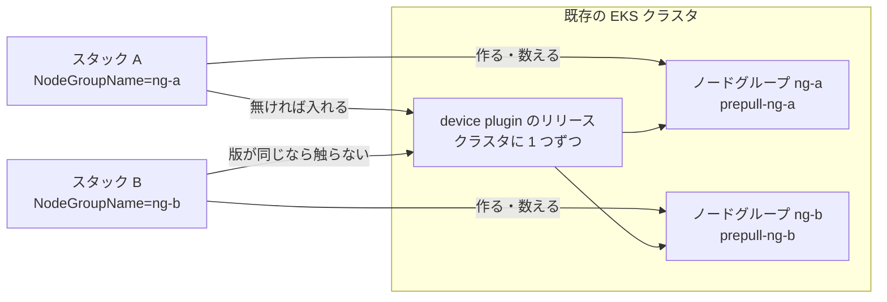

## はじめに

本章では、EKS の GPU クラスタを CloudFormation で作る経路を足した [PR #1269](https://github.com/awslabs/awsome-distributed-ai/pull/1269) をまとめる。先行する [#1259](https://github.com/awslabs/awsome-distributed-ai/pull/1259) の 1 つのテンプレートを 5 つに分け、GPU のノードグループだけを既存のクラスタに足せるようにし、ノードの AMI を作る経路も足した。

この PR を始めた時点では、g7 のインスタンスの GPU を、EKS が用意する AL2023 の NVIDIA の AMI のドライバが認識しなかった。ノードは Ready になっても GPU を資源として出さないので、g7 を使うには自前の AMI を焼く必要があった。実装の途中で EKS の AMI が対応し、PR の試験では、自前の AMI を使わずに `g7.12xlarge` を起動したスタックが `CREATE_COMPLETE` になり、各ノードが GPU を 2 つ資源として出した。それでも AMI を足す経路は残した。既に自分の AMI を持っている人がそれを使えるうえ、次に出る GPU で同じことが起きたときの逃げ道になるからである。そのほかにも、この実装では次の設計の狙いを意識した。

| 設計の狙い | 背景 | 実装での形 |
| --- | --- | --- |
| 自前の AMI を持ち込める | g7 の GPU を当時の EKS の AMI が認識せず、自前の AMI が必要だった。対応した後も、既に持っている AMI を使いたい場面がある | `NodeAmiId` で既にある AMI を指定する |
| 1 回のスタックの作成で AMI まで作れる | root のテンプレート 1 つで全部を作るには、AMI のビルドもスタックの作成の中で行う必要がある | この実装では EC2 Image Builder を使い、パッケージから作る経路と、既にあるレシピから作る経路を用意した。`NodeAmiId` と合わせた 3 つの経路は、`NodeAmiId`、`NodeImagePackages`、`NodeImageRecipeArn` のどれを埋めたかで決まる。2 つ以上を埋めると作成の前に拒み、すべて空なら EKS が用意する AMI を使う |
| GPU のノードグループを複数足せる | g7 と g7e のように種類の違う GPU を同じクラスタに混ぜ、prefill と decode を別の GPU で処理する分離推論（disaggregated inference）で使い分ける可能性がある | GPU のノードグループのテンプレートで `NodeGroupName` を入力にし、名前を変えてスタックを足す（root は `gpu` に固定）。ノードの確認はノードグループごとに数える。このテンプレートが入れる device plugin の Helm のリリースは、版が一致するときだけ共有し、一致しなければ止める。イメージの事前取得はノードグループごとの DaemonSet にする |
| 容量の取り方を選べる | GPU の容量の取り方は、On-Demand、targeted の On-Demand Capacity Reservation、Capacity Block と人によって違う | `CapacityReservationId` と `CapacityReservationType` で選ぶ。Capacity Block では `CapacityType` を `CAPACITY_BLOCK` にし、予約を使うときは placement group を作らない |
| 既存のクラスタに足せる | 既にクラスタと VPC を持ち、GPU だけを足したい人がいる | テンプレートを 5 つに分け、GPU のノードグループのテンプレートを単独で使えるようにした。クラスタを操作する権限はノードグループの側に置く。S3 のバケット無しで `--template-body` で出せるよう、テンプレートが上限の 95% を超えたら lint を失敗させる |
| GPU と EFA の資源の登録をスタックの成功の条件にする | g7 の件のように、ノードが Ready でも GPU を資源として出さないことがある | `GpuNodeCount` が 0 でなければ、グループのノードの数が一致し、各ノードが Ready で、期待する数の GPU と EFA を出すまで成功を返さない。CUDA や学習が動くことまでは確かめない。失敗したときも CloudFormation に失敗を知らせ、CloudFormation が応答を待つ上限を 45 分にした |
| リポジトリが保守する版を少なくする | kubectl と Helm の版を、Kubernetes の版ごとに選ぶ選択肢のリストとしてテンプレートに持つと、EKS が新しい版を出すたびにリストに足す必要がある | kubectl と Helm の版をパラメータにし、試した版を既定値にした。device plugin のチャートもパラメータだが、ドライバとの組み合わせで正しさが決まるので、既定では試した版に固定する |


上の図は、GPU のノードの AMI がどこから来るかを、入力ごとに並べたものである。緑の 2 つの経路は、root が `eks-gpu-node-ami.yaml` の子のスタックを作り、その中で EC2 Image Builder が AMI を作る。パッケージから作るときは、AMI の中にあるべきパスを `NodeImageAssertPaths` に必ず指定する。自前の AMI を使う 3 つの経路では、launch template が AMI の ID を指定するので、ノードグループの `AmiType` は `CUSTOM` になり、ユーザーデータにはノードがクラスタに参加するための設定をすべて書く。3 つの入力がすべて空なら、launch template は AMI の ID を持たず、ノードグループの `AmiType` から EKS が AMI を選ぶ。


上の図は、root が子のスタックとして作る `gpu` に、`eks-add-gpu-nodegroup.yaml` を単独で使うスタックで `ng-g7` と `ng-p5en` を足した例である。足すときは root ではなくこのテンプレートを使い、同じクラスタを指定して、スタック名と `NodeGroupName` を既にあるものと重ならない名前にする。インスタンスタイプと容量の組み合わせは説明のための例で、この組み合わせで 3 つを同時に動かした試験はしていない。device plugin の Helm のリリースは、最初のスタックの bootstrap が入れ、プラグインごとにクラスタで 1 つを共有する。後から足すスタックは、指定した版が一致するときだけ共有し、一致しなければデプロイを止める。一方、ノードグループ、ノードの確認の対象、事前取得の DaemonSet はスタックごとに分かれる。

:::details Design principles (English)
When this PR started, the driver in the EKS-optimized AL2023 NVIDIA AMI did not enumerate the GPUs of g7 instances. Nodes went `Ready` but advertised no GPUs, so using g7 required building a custom AMI. EKS added support while the PR was in progress: in the PR's test runs, a stack launching `g7.12xlarge` without a custom AMI reached `CREATE_COMPLETE`, and each node advertised 2 GPUs. The custom AMI path stayed anyway. It lets people use AMIs they already have, and it is the way out when the next GPU type hits the same gap.

| Principle | Background | How the implementation does it |
| --- | --- | --- |
| Bring your own AMI | The EKS AMI did not recognize g7 GPUs at the time, so a custom AMI was required. Even after support landed, some users already maintain their own AMIs | `NodeAmiId` points the node group at an existing AMI |
| Build the AMI within a single stack deployment | Creating everything from one root template means the AMI build has to happen during stack creation | This implementation uses EC2 Image Builder, building from a package list or from an existing recipe. Together with `NodeAmiId`, the three paths are selected by which of `NodeAmiId`, `NodeImagePackages` and `NodeImageRecipeArn` is set. Setting more than one is rejected before any resource is created; leaving all three empty uses the EKS-provided AMI |
| Add more than one GPU node group | Mixed GPU types such as g7 and g7e may share a cluster and be assigned different roles in disaggregated inference, where prefill and decode run on different GPUs | `NodeGroupName` is a parameter of the node group template, and each additional group is another stack with a different name (the root fixes the name to `gpu`). Node checks are counted per node group. The device plugin Helm releases this template installs are shared only when the pinned versions match, and a mismatch stops the deploy. Image pre-pull uses one DaemonSet per node group |
| Choose how capacity is obtained | Users get GPU capacity as On-Demand, as a targeted On-Demand Capacity Reservation, or as a Capacity Block | `CapacityReservationId` and `CapacityReservationType` select the mode. A Capacity Block sets `CapacityType` to `CAPACITY_BLOCK`, and no placement group is created when a reservation is used |
| Add GPUs to an existing cluster | Some users already run a cluster and a VPC and only want GPU capacity | The deploy is split into five templates, and the GPU node group template deploys on its own. The permission to act on the cluster lives on the node group stack. So that the template can be passed with `--template-body` without a bucket, the lint fails once it passes 95% of that limit |
| Make GPU and EFA registration the success condition | As with g7, a node can be `Ready` and still advertise no GPUs | When `GpuNodeCount` is nonzero, the stack succeeds only when the group has exactly that many nodes, each `Ready` and advertising the expected GPU and EFA counts. It does not verify that CUDA or training runs. On failure the bootstrap reports the failure to CloudFormation, and CloudFormation waits at most 45 minutes for that response |
| Keep the versions the repository maintains few | A list of kubectl and Helm versions to choose from per Kubernetes version needs a new entry every time EKS ships a release | kubectl and Helm versions are parameters with the tested versions as defaults. The device plugin charts are parameters too, but stay pinned to the tested versions by default, because their correctness depends on the node's driver |
:::

:::details EKS のノードグループと device plugin
EKS は Kubernetes のコントロールプレーンを AWS が運用するサービスで、ワーカーのノードはノードグループとしてまとめて作る。GPU や EFA を Pod から使うには、各ノードで device plugin が動き、`nvidia.com/gpu` や `vpc.amazonaws.com/efa` という資源としてノードに登録する必要がある。CloudFormation のネストしたスタックは、親のテンプレートが子のテンプレートを URL で呼び出してまとめて作る仕組みである。
:::

## Issue と PR の概要


| 項目 | 内容 |
| --- | --- |
| 解決したいこと | 既存の EKS クラスタに GPU を足したい人が使える経路が、テンプレートにも eksctl のマニフェストにも無い |
| やったこと | テンプレートを 5 つに分け、AMI の 3 つの入手の方法と、ノードの能力の確認を足した |
| テスト | レビューの後の版で、lint（11 の検査で失敗 0）、Kubernetes 1.34 から 1.36 の root の作成、既存のクラスタへの追加、Capacity Block、API の endpoint が private だけのクラスタ、AMI の更新、EFA の通信などを確かめた |
| マージ | [d432521](https://github.com/awslabs/awsome-distributed-ai/commit/d432521298a4c05afa2077ac1d12dfba69fb0050) |

## 何を解決しようとしたか

#1259 のテンプレートは、VPC からクラスタ、ノードまでを 1 つで作った。デプロイは毎回ゼロから始まるとは限らない。すでに EKS のクラスタと VPC を持っていて、GPU だけを足したい人には、全部を作るテンプレートは使えない。

## どうやったか

[architectures/amazon-eks/assets](https://github.com/awslabs/awsome-distributed-ai/tree/d432521298a4c05afa2077ac1d12dfba69fb0050/architectures/amazon-eks/assets) に、ネットワーク、クラスタ、GPU のノードグループ、ノードの AMI、それらを子のスタックとして作る root の 5 つのテンプレートを置いた。主な判断は次のとおりである。

| 判断 | 選んだもの | 比べた方向と、選んだ理由 |
| --- | --- | --- |
| テンプレートの分け方 | 5 つに分け、root が URL で子を作る | 1 つのテンプレートに条件を足す方法は、読むファイルが 1 つで済む。ただ、持ち込めるものが増えるたびに分岐が増え、一部の分岐でしか効かないパラメータが他と同じ一覧に並ぶ。分けた代わりに、変更を試すには子を S3 に置く手間が増える |
| クラスタを触る権限 | GPU のノードグループの側に access entry を置く | device plugin を入れる処理が Kubernetes の API を使う。ノードグループ側に置けば単独で作るときも権限を持ち込め、クラスタ側に置くと GPU を使わないクラスタにも権限が残る |
| 版の固定 | kubectl と Helm はパラメータ（既定は試した版）、device plugin のチャートは既定で固定。root もこれらを受け取って子に渡す | kubectl と Helm の版を Kubernetes の版ごとの選択肢のリストとして持つと、EKS が新しい版を出すたびにリストに足す必要がある。device plugin はノードのドライバとの組み合わせで正しさが決まるので、既定では固定する |
| GPU のノードの taint | 自前の AMI の分岐では、ノードグループの設定と kubelet のフラグの両方で付ける | フラグを外して登録の直後から観察すると、taint が付く前に `nvidia.com/gpu` を出す瞬間があった。フラグは登録の時点で効くので残した |
| AMI の入手 | 既存の AMI、ここで作る AMI に入れるパッケージ、外で管理するレシピのどれかを、埋めた入力から決める | 入手の方法を名前で選ぶパラメータは読みやすいが、「レシピ」を選んでパッケージも埋める矛盾を別の規則で止める必要がある。入力から決めれば、この組み合わせは書けない。2 つの入力を同時に埋める誤りは、別の規則が作成の前に拒む。代償は、画面で方法が明示されず、テンプレートの中の条件が増えること |

最後に、ノードの能力を確かめる処理を入れた。GPU のノードグループの各ノードが Ready になり、インスタンスタイプに合った数の `nvidia.com/gpu` と `vpc.amazonaws.com/efa` を出していなければ、スタックを失敗させる。ドライバがその GPU を認識できない AMI では、ノードは Ready になっても GPU を出さないので、この確認で止まる。この確認は Kubernetes の資源としての登録を見るもので、CUDA や学習が動くことまでは見ない。

## #1259 からファイルごとに何をなぜ変えたか

[#1259](https://github.com/awslabs/awsome-distributed-ai/pull/1259) は KeitaW さんが書いた PR で、[eks-gpu-cluster.yaml](https://github.com/awslabs/awsome-distributed-ai/blob/6e432ce6fcf707a2a896bdb17b73945c1b3f6136/architectures/amazon-eks/assets/eks-gpu-cluster.yaml)（943 行）の 1 つのテンプレートが、VPC からクラスタ、GPU のノードグループ、device plugin の導入までを作った。#1259 はマージされず、#1269 がその内容を引き継いでマージされた。#1269 は #1259 のパラメータを同じ名前と意味のまま残し、中身を次のように分けた。

| #1259 の中の部分 | マージした版での置き場所 | 主な変更 |
| --- | --- | --- |
| VPC、サブネット、NAT、S3 の endpoint、ノードの security group | `eks-cluster-prerequisites.yaml` | ECR の endpoint、FSx for Lustre、`VpcCidr` の検査を足した |
| クラスタ、add-on、system のノードグループ | `eks-cluster.yaml` | Service CIDR を入力にし、system のノードの数と AMI の種類を入力にした |
| GPU のノードグループ、launch template、CodeBuild の bootstrap | `eks-add-gpu-nodegroup.yaml` | 既存のクラスタに何度でも足せるようにした。道具と device plugin の版を指定できるようにし、ノードの確認と CloudFormation への応答を厳しくした |
| （無し） | `eks-gpu-node-ami.yaml` | ノードの AMI を EC2 Image Builder で作る経路を新しく足した |
| （無し） | `eks-gpu-cluster-deploy-all.yaml` | 上の 4 つを子のスタックとして作る root を足した |
| （無し） | `tests/`、`docs/PARAMETERS.md` | lint、ネットワークカードの記述の生成器、実機の試験手順、パラメータの説明を足した |

以下では、ファイルごとに #1259 のコードとマージした版のコードを並べ、比べた選択肢と選んだ理由を書く。行へのリンクは、#1259 は [6e432ce](https://github.com/awslabs/awsome-distributed-ai/commit/6e432ce6fcf707a2a896bdb17b73945c1b3f6136)、マージした版は [d432521](https://github.com/awslabs/awsome-distributed-ai/commit/d432521298a4c05afa2077ac1d12dfba69fb0050) に固定している。KeitaW さんの指摘で直した点は、そのつど「KeitaW さんの指摘」と書く。中心の論点は、同じクラスタに GPU のノードグループを何度でも足せるようにしたことで、`eks-add-gpu-nodegroup.yaml` ①で扱う。

以下で使う言葉を先に決めておく。bootstrap は、CodeBuild が device plugin を入れて確かめる処理である。custom resource は、CloudFormation が作成や更新のたびに外の処理を呼び、その処理から成功か失敗の答えが届くまで待つ資源で、bootstrap はこれで起動する。Helm のリリースは、チャートをクラスタに入れた 1 つの単位である。DaemonSet は、条件に合うすべてのノードで Pod を 1 つずつ動かす仕組みである。access entry は、IAM のロールにクラスタの中の権限を与える EKS の設定である。taint はノードに付ける印で、それを許容する設定（toleration）を持つ Pod しかそのノードに載れない。

:::details eks-cluster-prerequisites.yaml: ネットワークを切り出し、ECR と FSx の通り道を足した
このテンプレートは VPC、3 つのサブネット、NAT gateway、endpoint、ノードの security group を作る。クラスタと分けたのは、クラスタを作り直しても VPC を作り直さずに済み、2 つ目のクラスタが同じ VPC を使えるようにするためである。aws-pcs の `ml-cluster-prerequisites.yaml` と同じ分け方にそろえた。

**ECR の endpoint を足した**。#1259 は S3 の gateway endpoint だけを持っていた。推論のコンテナイメージは大きく、GPU のノードがそれぞれ取りに行くので、endpoint が無いとその通信がすべて NAT gateway を通る。マージした版は [ECR の 2 つの interface endpoint](https://github.com/awslabs/awsome-distributed-ai/blob/d432521298a4c05afa2077ac1d12dfba69fb0050/architectures/amazon-eks/assets/eks-cluster-prerequisites.yaml#L198) を足した。

```yaml:eks-cluster-prerequisites.yaml（マージした版）
  EcrApiEndpoint:
    Type: AWS::EC2::VPCEndpoint
    Properties:
      VpcId: !Ref VPC
      ServiceName: !Sub "com.amazonaws.${AWS::Region}.ecr.api"
      VpcEndpointType: Interface
      PrivateDnsEnabled: true
      SubnetIds: [!Ref PrivateSubnet]
      SecurityGroupIds: [!Ref EndpointSecurityGroup]
```

効くのはそのリージョンの private な ECR だけで、`public.ecr.aws` からの取得は今までどおり NAT gateway を通る。

**`VpcCidr` に形の検査を足した**。KeitaW さんの指摘で直した点である。#1259 の `VpcCidr` は自由な文字列で、サブネットは `!Cidr [VpcCidr, 8, 12]` で切り出していた。これは VPC を /20 の 8 つの区画に分ける式なので、/16 か /17 の VPC にしか収まらない。#1269 の最初の版は CIDR の書き方の形だけを見て、/ の後の長さを縛らない検査を入れ、筆者は PR で「厳しすぎて、`Fn::Cidr` が受け付ける書き方まで弾くかもしれない」と意見を求めた。KeitaW さんは実際にスタックを作って確かめ、逆に検査が緩すぎると指摘した。/18 は検査を通ってから `invalid count (8) of subnets requested` で失敗する。マージした版は [/16 と /17 だけを通す](https://github.com/awslabs/awsome-distributed-ai/blob/d432521298a4c05afa2077ac1d12dfba69fb0050/architectures/amazon-eks/assets/eks-cluster-prerequisites.yaml#L41)。

```yaml:eks-cluster-prerequisites.yaml（マージした版）
  VpcCidr:
    Type: String
    Default: 10.0.0.0/16
    AllowedPattern: ^(\d{1,3}\.){3}\d{1,3}/1[67]$
```

| 選択肢 | 良い点 | 困る点 |
| --- | --- | --- |
| 検査しない（#1259） | 入力の自由が最大 | 間違った値はスタックが途中まで進んでから、パラメータ名も CIDR も出ないエラーで巻き戻る |
| CIDR の形だけ見る（#1269 の最初の版） | 明らかな打ち間違いは提出の時点で止まる | /18 から /32 も通り、それらはすべて失敗する |
| /16 と /17 だけ通す（採用） | `!Cidr [VpcCidr, 8, 12]` が 8 つの /20 を切り出せる範囲と一致する | サブネットの切り方を変えたら、この検査も一緒に変える必要がある |

**FSx for Lustre を選べるようにした**。#1259 には無く、筆者が #1269 で足した。`DeployFsxLustre=true` でファイルシステムを作る。最初の版は、FSx 側の security group にはノードからの 988 番と 1018〜1023 番の受信を許可していた。一方、ノード側の security group は自分のメンバーからの通信しか受けなかった。FSx の文書は、クライアント側にもファイルシステムの security group からの同じポートの受信を求めている。この受信の規則は、KeitaW さんの指摘で足した。KeitaW さんは、筆者の試験が通ったのはおそらく、クライアントから接続を始めることが多く security group が戻りの通信を通すからだとし、潜在的な抜けだと指摘した。マージした版は [2 つの受信の規則](https://github.com/awslabs/awsome-distributed-ai/blob/d432521298a4c05afa2077ac1d12dfba69fb0050/architectures/amazon-eks/assets/eks-cluster-prerequisites.yaml#L284) を足した。この抜けで実際に失敗する場面は、規則がある試験でも無い試験でも再現していない。
:::

:::details eks-cluster.yaml: クラスタから GPU を外し、自前の AMI に要る値を外に出した
このテンプレートはクラスタ、add-on、system のノードグループを作り、GPU に関わるものを 1 つも持たない。GPU は `eks-add-gpu-nodegroup.yaml` が後から足す。こうすると、GPU のノードグループを作り直したり 2 つ目を足したりしても、クラスタには触れない。

**Service CIDR を入力にした**。#1259 は Service の IP の範囲を EKS に選ばせていた。マージした版は [`ServiceIpv4Cidr`](https://github.com/awslabs/awsome-distributed-ai/blob/d432521298a4c05afa2077ac1d12dfba69fb0050/architectures/amazon-eks/assets/eks-cluster.yaml#L92) を受け取り、クラスタに渡したうえで出力にも出す。

```yaml:eks-cluster.yaml（マージした版）
      KubernetesNetworkConfig:
        ServiceIpv4Cidr: !Ref ServiceIpv4Cidr
```

入力にしたのは、自前の AMI を使うノードにこの値を渡す必要があるからである。launch template が AMI を指定すると、EKS はノードの起動の設定を足さなくなる。そのため、ノードにはクラスタの endpoint、証明書、Service CIDR を自分で渡す必要がある。前の 2 つはクラスタの属性として読めるが、EKS が選んだ IPv4 の Service CIDR は CloudFormation のクラスタの属性に無く、子のスタックへ渡せない（IPv6 のほうは読める）。既存のクラスタに単独で足すときは、利用者が `aws eks describe-cluster` で読んで入力する。

| 選択肢 | 良い点 | 困る点 |
| --- | --- | --- |
| EKS に選ばせる（#1259） | 入力が 1 つ減り、EKS が衝突を避けて選ぶ | 選ばれた値を CloudFormation の中で読めず、root から自前の AMI のノードに渡せない |
| テンプレートに固定する | 入力が減る | `VpcCidr` は入力なので、利用者が選んだ正しい `VpcCidr` と重なる場合が出る |
| 入力にする（採用） | 2 つの範囲を同じ人が同じ画面で見て決められる | 2 つの値が重ならないように利用者が気を付ける必要がある。既定値の `172.20.0.0/16` は VPC の既定の範囲の外に置いた |

**system のノードの既定を `m7i.xlarge` にした**。筆者が調べた 19 のリージョンで、`m6i.xlarge` は 17 で、`m7i.xlarge` は 19 すべてで提供されていた。`m6i.xlarge` のほうが 1 時間あたり $0.192 と、$0.2016 より安い。それでも、`m6i.xlarge` を提供しない 2 つのリージョンの 1 つは、`g7.12xlarge` の試験をした `eu-south-2` だった。提供されていないリージョンでは、system のノードグループが `Unsupported` とだけ言うエラーで失敗する。そこで 2 台で 1 時間あたり $0.0192 を多く払い、`m7i.xlarge` を既定にした。筆者は PR で、この判断は逆でもよいと書いた。台数（`SystemNodeCount`）と AMI の種類（`SystemAmiType`）も入力にした。

**GPU に関わる権限をここに置かなかった**。#1259 は bootstrap の access entry（CodeBuild にクラスタの管理者の権限を与える設定）をクラスタの部分に置いていた。マージした版はそれを GPU のノードグループの側へ移した。理由は `eks-add-gpu-nodegroup.yaml` の節で書く。
:::

:::details eks-add-gpu-nodegroup.yaml ①: 1 つのクラスタに GPU のノードグループを何個でも足せるようにした
このテンプレートが #1269 の中心である。既存のクラスタに GPU のノードグループを 1 つ足し、device plugin を入れ、各ノードが GPU と EFA を出したことを確かめる。違うインスタンスタイプや違う予約の GPU を同じクラスタで使いたいときは、`NodeGroupName` を変えてこのスタックをもう 1 つ作る。#1259 は 1 つのスタックがクラスタと 1 つのノードグループを作る形で、既存のクラスタに足す経路は無かった。その書き方のまま、同じクラスタへ繰り返し足せる形にすると、次の 5 か所でぶつかる。



**1 つ目は、ノードグループの名前である**。#1259 は [`NodegroupName: gpu`](https://github.com/awslabs/awsome-distributed-ai/blob/6e432ce6fcf707a2a896bdb17b73945c1b3f6136/architectures/amazon-eks/assets/eks-gpu-cluster.yaml#L727) と書き込んでいたので、同じクラスタに 2 つ目を作ると名前がぶつかる。マージした版は [`NodeGroupName`](https://github.com/awslabs/awsome-distributed-ai/blob/d432521298a4c05afa2077ac1d12dfba69fb0050/architectures/amazon-eks/assets/eks-add-gpu-nodegroup.yaml#L101) を入力にした。既定は `gpu` のままなので、1 つだけ作る人の手順は変わらない。

**2 つ目は、確認のときにどのノードを数えるかである**。#1259 は `role=gpu` のラベルが付いたノードを数えていた。

```bash:eks-gpu-cluster.yaml（#1259）
ready=$(kubectl get nodes -l role=gpu -o json | python3 -c '...')
[ "$ready" -ge "$GPU_NODE_COUNT" ] && break
```

GPU のノードグループが 2 つあると、両方のノードに `role=gpu` が付いているので、もう一方のグループのノードまで数えてしまう。数が「以上」で比べられているので、新しいグループのノードが 1 台も起きていなくても、先にあったグループのノードで確認が通り得る。マージした版は EKS がノードに付ける [`eks.amazonaws.com/nodegroup` のラベルで自分のグループだけを数え](https://github.com/awslabs/awsome-distributed-ai/blob/d432521298a4c05afa2077ac1d12dfba69fb0050/architectures/amazon-eks/assets/eks-add-gpu-nodegroup.yaml#L896)、数はちょうど一致することを求める。

```bash:eks-add-gpu-nodegroup.yaml（マージした版）
ready=$(kubectl get nodes -l "eks.amazonaws.com/nodegroup=$NODE_GROUP_NAME" -o json | python3 -c '...')
[ "$ready" -eq "$GPU_NODE_COUNT" ] && [ "$total" -eq "$GPU_NODE_COUNT" ] && break
```

**3 つ目は、device plugin の導入である**。device plugin（NVIDIA の GPU 用と EFA 用の 2 つ）は Helm のリリースとしてクラスタに 1 つずつ入り、すべての GPU のノードグループがそれを共有する。#1259 は毎回 `helm upgrade --install` を版の指定なしで実行していた。1 つのスタックがクラスタも作る #1259 ではこれで困らないが、2 つ目のスタックが同じことをすると、1 つ目のグループが使っている device plugin をその時点の最新版へ動かしてしまう。どう扱うかの選択肢を次の表に並べる。PR とレビューに記録があるのは 1 行目と 4 行目で、2 行目と 3 行目は本章で補った比較である。

| 選択肢 | 良い点 | 困る点 |
| --- | --- | --- |
| 毎回入れ直す（#1259） | 手順が単純で、いつも最新になる | 後から足したスタックが、先にあったグループの device plugin の版を勝手に変える |
| ノードグループごとに別のリリースを入れる | リリースの名前はぶつからない | 名前を分けても載せる先は分かれず、同じ GPU のノードに 2 つの device plugin が載って競合する |
| 入っていれば何もしない | 先にあったグループを壊さない | 版が違っても黙って通り、利用者は自分が指定した版で動いていると思い込む |
| 無ければ入れ、同じ版なら触らず、違う版なら止める（採用） | 誰も勝手に版を動かさない。食い違いは bootstrap が見つけてスタックを失敗させ、既存のリリースはそのまま残る | 版を上げるときは、Helm で先にリリースを上げてから各スタックの指定をそろえる手順が要る（README の 10 節） |

マージした版の [`plugin()`](https://github.com/awslabs/awsome-distributed-ai/blob/d432521298a4c05afa2077ac1d12dfba69fb0050/architectures/amazon-eks/assets/eks-add-gpu-nodegroup.yaml#L867) がこの 3 通りを分ける。

```bash:eks-add-gpu-nodegroup.yaml（マージした版）
if [ -z "$have" ]; then
  helm upgrade --install "$rel" "$chart" --version "$ver" ... || fail "helm install $rel"
elif [ "${have#v}" = "${ver#v}" ]; then
  echo "$rel $ver is already installed; leaving it alone"
else
  fail "the cluster runs $rel $have and this stack pins $ver. ..."
fi
```

KeitaW さんは、最初の版の README に書いた「版を上げるには、既にあるスタックの版を先に上げる」という手順では上げられないと指摘した。既にあるスタックを更新しても、そのスタック自身が「入っている版と違う」と止まるからである。マージした版の README は、Helm の `--reset-then-reuse-values` でリリースを先に上げ、その後で各スタックの指定をそろえる手順にした。筆者は `0.20.0` から `0.20.1` への移行をこの手順で試し、2 つのスタックがどちらも `UPDATE_COMPLETE` になった。KeitaW さんはもう 1 つ、この確認はこのテンプレートが付けるリリース名しか見ないので、GPU Operator など別の方法で入れた device plugin は見えず、2 つ目を入れてしまうと指摘した。これは README の 10 節に書いた。

**4 つ目は、イメージの事前取得である**。KeitaW さんの指摘で直した点である。#1259 と #1269 の最初の版は `kube-system/prepull` という 1 つの DaemonSet を `role: gpu` のノードに置いていた。2 つ目のスタックが別のイメージを指定すると、同じ名前の DaemonSet を上書きし、1 つ目のグループのノードにも新しいイメージを取りに行かせる。マージした版は [名前にノードグループの名前を入れ](https://github.com/awslabs/awsome-distributed-ai/blob/d432521298a4c05afa2077ac1d12dfba69fb0050/architectures/amazon-eks/assets/eks-add-gpu-nodegroup.yaml#L955)、そのグループのノードだけを選ぶ。

```bash:eks-add-gpu-nodegroup.yaml（マージした版）
PREPULL="prepull-$(echo "$NODE_GROUP_NAME" | tr 'A-Z_' 'a-z-')"
...
nodeSelector: { eks.amazonaws.com/nodegroup: "$NODE_GROUP_NAME" }
```

KeitaW さんの提案は `prepull-${NODE_GROUP_NAME}` だったが、`NodeGroupName` は `_` や大文字を許し、DaemonSet の名前はそれを許さない。`NodeGroupName` の検査を厳しくする方法もあったが、既存のクラスタで既に使っている名前を拒むことになる。そこで名前に入れるときだけ小文字にし、`_` を `-` に変えた。代償は、`ng_B` と `ng-b` の 2 つが同じ名前になることである。その場合、2 つ目のスタックの事前取得は始まらず、bootstrap は警告を出して完了する。

**5 つ目は、権限である**。CodeBuild がクラスタを操作するための access entry を、[ノードグループのスタックの側](https://github.com/awslabs/awsome-distributed-ai/blob/d432521298a4c05afa2077ac1d12dfba69fb0050/architectures/amazon-eks/assets/eks-add-gpu-nodegroup.yaml#L761) に置いた。クラスタの側に置くと、既存のクラスタに足すときにその権限を持ち込めず、GPU を使わないクラスタにも管理者の権限が残る。ノードのロールも `NodeRoleArn` で既存のものを渡せるようにした。

**削除では、device plugin のリリースを消さない**。ほかのグループがまだ使っているからである。#1259 の削除も何もしなかったが、マージした版ではその理由が「リリースはクラスタのもの」になった。README の 10 節は、ノードグループのスタックを消した後にクラスタに残る次の 3 種類を挙げ、access entry の消し方を示している。

- ほかのグループが使い続ける device plugin の 2 つのリリース
- どのノードにも合わなくなった事前取得の DaemonSet
- EKS がノードのロールに作った access entry
:::

:::details eks-add-gpu-nodegroup.yaml ②: 道具と device plugin の版をパラメータにし、Kubernetes 1.34 で device plugin が載らない不具合を直した
**kubectl と Helm の版をパラメータにした**。#1259 は、CodeBuild の実行手順を書く buildspec の中に [`KUBECTL_VERSION: "1.34.1"`](https://github.com/awslabs/awsome-distributed-ai/blob/6e432ce6fcf707a2a896bdb17b73945c1b3f6136/architectures/amazon-eks/assets/eks-gpu-cluster.yaml#L807) と `HELM_VERSION: "3.19.0"` を書き込んでいた。kubectl はクラスタとの版の差が 1 つまでと決まっているので、クラスタの版を変えると buildspec も書き換える必要がある。マージした版は [`KubectlVersion`、`HelmVersion`、2 つのチャートの版](https://github.com/awslabs/awsome-distributed-ai/blob/d432521298a4c05afa2077ac1d12dfba69fb0050/architectures/amazon-eks/assets/eks-add-gpu-nodegroup.yaml#L136) をパラメータにし、試した版を既定値にした。

| 選択肢 | 良い点 | 困る点 |
| --- | --- | --- |
| buildspec に書き込む（#1259） | 読む場所が 1 つで済む | クラスタの版を変えるたびにテンプレートの修正とレビューが要る |
| Kubernetes の版ごとの対応表（Mappings）を持つ | 利用者は何も選ばなくてよい | EKS が新しい版を出すと、誰かが表に行を足すまでその版にデプロイできない |
| パラメータにし、試した版を既定にする（採用） | EKS が版を出してもテンプレートを変えずに済み、利用者は自分のクラスタに合わせられる | 利用者が kubectl とクラスタの版の差に気を付ける必要がある。lint が確かめるのは既定値同士が 1 つ以内に収まることだけである |

device plugin のチャートもパラメータだが、既定値には試した版を書き、空（最新）にはしなかった。版を書かずに入れると、その時点でチャートの置き場所が公開している最新版が入る。これは実質的に `latest` と同じで、device plugin が正しく動くかはノードのドライバとの組み合わせで決まる。別の版を使いたい利用者は、パラメータで上書きすればよい。

**root からも版を渡せるようにした**。KeitaW さんの指摘で直した点である。最初の版の文書は「kubectl の版は root のパラメータで決める」と書いていたのに、root は `KubectlVersion` を持っていなかった。そのため root で `KubernetesVersion=1.34` にすると、kubectl はクラスタより 2 つ新しい 1.36.4 のまま動いた。マージした版の root は [`KubectlVersion` を受け取って子に渡す](https://github.com/awslabs/awsome-distributed-ai/blob/d432521298a4c05afa2077ac1d12dfba69fb0050/architectures/amazon-eks/assets/eks-gpu-cluster-deploy-all.yaml#L404)。KeitaW さんは、kubectl は渡すこと、`HelmVersion` と 2 つのチャートの版は渡すか「root では既定のまま」と文書に書くかのどちらかを求めた。筆者は 4 つとも渡すことにした。①で書いた版の上げ方は、最後にクラスタ上のすべてのスタックが新しい版を指定する状態で終わるが、root がこれらを受け取れないと、root で作ったスタックだけがその状態にできないからである。

**Kubernetes 1.34 で device plugin がどのノードにも載らなかった**。KeitaW さんがマージの前に直すべきとした 1 件目である。NVIDIA の device plugin の DaemonSet は、次の 3 つのラベルのどれかを持つノードにだけ載る。

- `feature.node.kubernetes.io/pci-10de.present`。チャートに同梱の node-feature-discovery（ノードのハードウェアを調べてラベルを付ける仕組み）のワーカーが付ける
- `feature.node.kubernetes.io/cpu-model.vendor_id=NVIDIA`
- `nvidia.com/gpu.present=true`。Kubernetes 1.35 以降は、ノードの起動を担う nodeadm が付ける

1.36 では nodeadm が付ける 3 つ目のラベルがあるので、device plugin が載った。1.34 にはそのラベルが無い。代わりになる 1 つ目のラベルを付けるはずの node-feature-discovery のワーカーも、GPU のノードの taint に合う toleration を持っていなかったので、GPU のノードに載れなかった。#1259 も最初の版も、チャートの `tolerations` を上書きしていた。

```bash:eks-gpu-cluster.yaml（#1259）
helm upgrade --install nvdp nvdp/nvidia-device-plugin ... \
  --set gfd.enabled=true \
  --set-json 'tolerations=[{"key":"nvidia.com/gpu","operator":"Exists","effect":"NoSchedule"}]'
```

ところがこの値はチャート自身の DaemonSet にしか届かず、同梱のサブチャートである node-feature-discovery のワーカーは、サブチャートの既定の toleration（`nvidia.com/gpu=present`）のままだった。GPU のノードの taint は `nvidia.com/gpu=true` なので合わない。KeitaW さんは `helm template` で描いてこれを確かめ、1.34 のクラスタで手で値を足すと 20 秒以内に GPU が出ることも確かめた。マージした版は [サブチャートにも同じ toleration を渡す](https://github.com/awslabs/awsome-distributed-ai/blob/d432521298a4c05afa2077ac1d12dfba69fb0050/architectures/amazon-eks/assets/eks-add-gpu-nodegroup.yaml#L884)。

```bash:eks-add-gpu-nodegroup.yaml（マージした版）
TOL='[{"key":"nvidia.com/gpu","operator":"Exists","effect":"NoSchedule"}]'
plugin nvdp nvidia-device-plugin "$NVIDIA_DEVICE_PLUGIN_CHART_VERSION" nvdp/nvidia-device-plugin \
  --set gfd.enabled=true --set-json "tolerations=$TOL" --set-json "nfd.worker.tolerations=$TOL"
```

筆者はこの後、root を 1.34 と `g4dn.8xlarge` 2 台で作り、node-feature-discovery のワーカーが GPU のノードで動いて `pci-10de.present=true` が付くことを確かめた。#1259 の PR 本文に書かれた全体の実行は `GpuNodeCount=0` で、GPU のノードが無ければこの問題は起きない。
:::

:::details eks-add-gpu-nodegroup.yaml ③: 予約と Capacity Block の扱いを直した
**Capacity Block のノードグループに `CapacityType` を付けた**。KeitaW さんがマージの前に直すべきとした 2 件目である。Capacity Block は、GPU を決まった期間だけ予約して使う仕組みである。#1259 と最初の版は、launch template に `MarketType: capacity-block` を入れるだけで、ノードグループには `CapacityType` を書いていなかった。そのためノードグループは既定の `ON_DEMAND` で作られていた。EKS の文書は、Capacity Block を使うノードグループに `CAPACITY_BLOCK` を求めている。これがあると、EKS はブロックが終わる 40 分前にノードグループを 0 台へ縮める予定を自分で入れる。マージした版は [予約の種類に応じて入れる](https://github.com/awslabs/awsome-distributed-ai/blob/d432521298a4c05afa2077ac1d12dfba69fb0050/architectures/amazon-eks/assets/eks-add-gpu-nodegroup.yaml#L699)。

```yaml:eks-add-gpu-nodegroup.yaml（マージした版）
      AmiType: !If [HasCustomAmi, CUSTOM, !Ref AmiType]
      CapacityType: !If [IsCapacityBlock, CAPACITY_BLOCK, ON_DEMAND]
```

筆者は `p5en.48xlarge` の Capacity Block で、ブロックの開始の前にスタックを作り、開始の後に `CREATE_COMPLETE` になること、ブロックの終わる 40 分前に EKS がノードグループを 0 台にすることを確かめた。KeitaW さんは、ブロックの開始の前に作ったスタックは確認の待ちで失敗するので、開始の後に作るよう README に書くことを提案した。実機では、開始までは起動が `Capacity Reservation ... is not yet active` で失敗して再試行され、開始の数分前に作ったスタックは完了した。そこで README には、決まりごとではなく観察した挙動として、開始の後か、開始の数分前に作ればよいと書いた。

**予約を使うときは placement group を作らないことにした**。これは指摘の外で足した変更である。placement group は、ノード同士を物理的に近くに置くための指定である。#1259 は Capacity Block のときだけ placement group を外していた。

```yaml:eks-gpu-cluster.yaml（#1259）
  UsePlacementGroup: !Not [!Condition IsCapacityBlock]
```

KeitaW さんは、予約したインスタンスはこのスタックが作る placement group の中に無いので、両方を指定してよいのか不安だったが、実際には 2 台とも起動したと報告した。筆者はそれでも、両方を指定すると予約に空きが残っているのに 2 台目が `InsufficientInstanceCapacity` で失敗する場合があると考え、[予約があるときは placement group を作らない](https://github.com/awslabs/awsome-distributed-ai/blob/d432521298a4c05afa2077ac1d12dfba69fb0050/architectures/amazon-eks/assets/eks-add-gpu-nodegroup.yaml#L325) ようにした。

```yaml:eks-add-gpu-nodegroup.yaml（マージした版）
  UsePlacementGroup: !Not [!Condition HasReservation]
```

代償は、予約に入ったノードの置き場所を placement group ではなく予約が決めることである。

**`GpuNodeCount` の上限を 4 から 8 に上げた**。8 台の予約は珍しくなく、実際にデプロイの大きさを決めるのは予約なので、上限は持っている予約を拒まない程度に緩ければよい。インスタンスタイプも 9 から 16 に増やし、`g4dn.8xlarge` など eksctl のマニフェストにある `g` 系も選べるようにした。
:::

:::details eks-add-gpu-nodegroup.yaml ④: ネットワークカードごとの記述を、手で書かず生成するようにした
EFA は、ネットワークカード 1 枚につきネットワークインターフェースを 1 つ付けて使う。カードの枚数はインスタンスタイプで決まり、`g7e.12xlarge` は 1 枚、`p5.48xlarge` は 32 枚である。CloudFormation の標準の書き方には繰り返しが無いので（変換を使う `Fn::ForEach` は表で比べる）、launch template には 32 枚分の記述を並べ、そのタイプに無いカードの分は `AWS::NoValue` で消す。ここまでは #1259 と同じ考え方である。

**#1259 は、カードごとに条件を 1 つずつ持っていた**。[`HasCard1` から `HasCard31`](https://github.com/awslabs/awsome-distributed-ai/blob/6e432ce6fcf707a2a896bdb17b73945c1b3f6136/architectures/amazon-eks/assets/eks-gpu-cluster.yaml#L102) までの 31 個で、それぞれが「そのカードを持つ枚数」を列挙する。

```yaml:eks-gpu-cluster.yaml（#1259）
  HasCard2: !Or
    - !Equals [!FindInMap [NicLayout, !Ref GpuInstanceType, Cards], "4"]
    - !Equals [!FindInMap [NicLayout, !Ref GpuInstanceType, Cards], "8"]
    - !Equals [!FindInMap [NicLayout, !Ref GpuInstanceType, Cards], "16"]
    - !Equals [!FindInMap [NicLayout, !Ref GpuInstanceType, Cards], "17"]
    - !Equals [!FindInMap [NicLayout, !Ref GpuInstanceType, Cards], "32"]
```

カードの枚数は 1、2、4、8、16、17、32 の 7 通りしか無いので、31 個の条件の多くは同じ中身の繰り返しになる。マージした版は条件を「N 枚以上か」の [6 個のしきい値](https://github.com/awslabs/awsome-distributed-ai/blob/d432521298a4c05afa2077ac1d12dfba69fb0050/architectures/amazon-eks/assets/eks-add-gpu-nodegroup.yaml#L331) にまとめ、32 枚分の記述は [tests/render-nic-block.py](https://github.com/awslabs/awsome-distributed-ai/blob/d432521298a4c05afa2077ac1d12dfba69fb0050/architectures/amazon-eks/tests/render-nic-block.py) が出力したものを [印の間](https://github.com/awslabs/awsome-distributed-ai/blob/d432521298a4c05afa2077ac1d12dfba69fb0050/architectures/amazon-eks/assets/eks-add-gpu-nodegroup.yaml#L411) に貼る。

```yaml:eks-add-gpu-nodegroup.yaml（マージした版）
          # BEGIN GENERATED by tests/render-nic-block.py -- do not edit by hand
          - !If
            - Cards4Plus
            - DeviceIndex: !If [SecondaryDeviceIndexIsZero, 0, 1]
              NetworkCardIndex: 2
              InterfaceType: efa
              Groups: [!Ref NodeSecurityGroupId, !Ref ClusterSecurityGroupId]
            - !Ref 'AWS::NoValue'
```

| 選択肢 | 良い点 | 困る点 |
| --- | --- | --- |
| 31 個の条件と 32 個の記述を手で書く（#1259） | 生成器を用意せず、テンプレートだけを直せば済む | ほぼ同じ記述が 30 回並び、1 か所の書き間違いを差分のレビューで見つけにくい |
| `AWS::LanguageExtensions` の `Fn::ForEach` で展開する | 元になる記述が 1 つで済み、差分に生成物が出ない | リストの要素として展開しようとすると `Duplicate key 'DeviceIndex' when merging keys to parent object in Fn::ForEach` で拒まれた |
| 生成した記述を貼り、lint で一致を確かめる（採用） | 変換の仕組みが要らず、生成器は 81 行で読める | 生成器を変えたら貼り直す必要がある。lint は貼った記述と生成器の出力が違えば失敗する |

**lint が条件の中身を見ていなかった**。KeitaW さんの指摘で直した点である。最初の版の lint は、条件の名前に書かれた数（`Cards4Plus` の 4）を読むだけで、条件の中身を確かめていなかった。KeitaW さんは試しに `Cards4Plus` から `"17"` を消し、`p6-b300.48xlarge` でカード番号 2 と 3（0 から数えるので 3 枚目と 4 枚目）が落ちて EFA が 16 ではなく 14 になるのに lint が通ることを示した。マージした版の lint は、[各条件の中身をすべての枚数について評価し](https://github.com/awslabs/awsome-distributed-ai/blob/d432521298a4c05afa2077ac1d12dfba69fb0050/architectures/amazon-eks/tests/lint-templates.sh#L643)、`CardsNPlus` がちょうど「N 枚以上」のときに真になることを確かめる。

**2 枚目以降のカードの device index をタイプごとに持つようにした**。#1259 は 2 枚目以降のカードをすべて `DeviceIndex: 1` にしていた。マージした版は `NicLayout` に `SecondaryDeviceIndex` を足し、`p6-b300.48xlarge` だけ 0 にした。生成器のコメントは、device index はカードごとに数えるのでどちらも正しい要求だとし、aws-pcs の `add-cng-p6-b300.yaml` が B300 の実機で動かした並びにそろえたと書いている。この PR では `p6-b300.48xlarge` を起動しておらず、`SecondaryDeviceIndex` は `describe-instance-types` でも答えが得られないので、lint は未検証と報告する。`NicLayout` とは別の対応表として、GPU の数を持つ `GpuCount` も足した。確認で GPU の数をちょうど比べるためである。
:::

:::details eks-add-gpu-nodegroup.yaml ⑤: 自前の AMI のノードに、起動の設定と taint を自分で渡すようにした
**自前の AMI のときは、ユーザーデータに起動の設定をすべて書く**。EKS が用意する AMI を使うとき、EKS は launch template のユーザーデータに、ノードがクラスタに参加するための設定を自分で足す。launch template が AMI を指定すると、EKS はこれをやめる。そこでマージした版は [`NodeAmiId` があるときだけ別のユーザーデータを使い](https://github.com/awslabs/awsome-distributed-ai/blob/d432521298a4c05afa2077ac1d12dfba69fb0050/architectures/amazon-eks/assets/eks-add-gpu-nodegroup.yaml#L637)、クラスタの endpoint、証明書、Service CIDR、containerd の既定のランタイム、kubelet のフラグを書く。

```yaml:eks-add-gpu-nodegroup.yaml（マージした版、自前の AMI の分岐）
                cluster:
                  name: ${ClusterName}
                  apiServerEndpoint: ${ClusterEndpoint}
                  certificateAuthority: ${ClusterCertificateAuthority}
                  cidr: ${ClusterServiceCidr}
                ...
                kubelet:
                  flags:
                    - --node-labels=role=gpu,eks.amazonaws.com/nodegroup=${NodeGroupName}
                    - --register-with-taints=nvidia.com/gpu=true:NoSchedule
```

containerd の設定をイメージの中ではなくここに書くのは、nodeadm が起動のたびに containerd の設定を書き直すからである。3 つの値の入れ忘れは、[作成の前に規則で止める](https://github.com/awslabs/awsome-distributed-ai/blob/d432521298a4c05afa2077ac1d12dfba69fb0050/architectures/amazon-eks/assets/eks-add-gpu-nodegroup.yaml#L195)。EKS が用意する AMI の分岐は、#1259 と同じく NVMe を RAID0 にする設定だけを持つ。

**taint をノードグループの設定と kubelet のフラグの両方で付ける**。GPU のノードには `nvidia.com/gpu=true:NoSchedule` の taint を付け、GPU を求める Pod だけが載るようにしている。ノードグループの設定にも taint があるので、自前の AMI の分岐の kubelet のフラグは重複に見える。筆者はフラグを外して登録の直後から観察し、参加から 7 秒後の標本で、taint の無いノードが `nvidia.com/gpu: 1` を出しているのを見た。taint は次の標本で付いた。PR は、この観察をどちらの分岐で取ったかを書いていない。フラグは登録の時点で効くので、自前の AMI の分岐に残した。代償は、2 か所の宣言をそろえ続ける手間である。ラベルの `eks.amazonaws.com/nodegroup` もここで付けるのは、EKS が用意する AMI ではこのラベルを EKS が付けるが、自前の AMI では付かず、①の確認がノードを数えられなくなるからである。

KeitaW さんの実機の観察（taint が作成の 1 秒後から付いていて、GPU はその約 60 秒後に出た）は、EKS が用意する AMI の root の作成で取ったものである。この分岐のユーザーデータには、KeitaW さんが試した [69f4f4e6 の版](https://github.com/awslabs/awsome-distributed-ai/blob/69f4f4e6e01e858f690c7775091a29b95eb59be7/architectures/amazon-eks/assets/eks-add-gpu-nodegroup.yaml#L683) でもマージした版でもフラグが無いので、この観察はフラグの効果ではなく、EKS が用意する AMI の経路で taint が間に合っていることを示す。自前の AMI の分岐でフラグを入れた状態の同じ観察は、PR には記録が無い。
:::

:::details eks-add-gpu-nodegroup.yaml ⑥: 確認を厳密にし、失敗したときに CloudFormation へ答え損ねにくくした
この部分の仕組みは #1259 と同じである。Lambda は CodeBuild を起動して CloudFormation の応答先の URL を渡すだけで、CodeBuild が device plugin を入れて確認し、自分で CloudFormation に答える。Lambda の 15 分の上限に縛られないのがこの形の利点で、KeitaW さんもレビューで良い点に挙げた。#1269 が変えたのは、確認の厳しさと、失敗したときの答え方である。

**確認は、ノードごと、資源ごとに、数がちょうど合うことを求める**。#1259 は、GPU と EFA の資源が 0 でないノードの数が、`GpuNodeCount` 以上なら通していた。このやり方では、8 GPU のタイプで 1 つしか出ていないノードも数えられ、ノードが Ready かどうかも見ない。`GpuNodeCount=0` のときは「0 台以上」なのですぐに通る。マージした版は、[Ready で、`GpuCount` の数の GPU と `NicLayout` の数の EFA をちょうど出すノード](https://github.com/awslabs/awsome-distributed-ai/blob/d432521298a4c05afa2077ac1d12dfba69fb0050/architectures/amazon-eks/assets/eks-add-gpu-nodegroup.yaml#L890) を数え、その数とグループのノードの総数がどちらも `GpuNodeCount` に等しいことを求める。`GpuNodeCount=0` のときは、確認をしなかったことを理由に書いて成功を返す。

**ダウンロードも、失敗を拾う仕組みの内側で行う**。#1259 は kubectl と Helm のダウンロードを buildspec の `install` の段階で行い、失敗を CloudFormation に知らせる `trap` は `build` の段階で設定していた。ダウンロードが失敗すると誰も答えず、CloudFormation は custom resource の既定の 1 時間を待ち続ける。その間も GPU のノードは動いていて、料金がかかる。マージした版は [すべての処理を `build` の段階に入れ](https://github.com/awslabs/awsome-distributed-ai/blob/d432521298a4c05afa2077ac1d12dfba69fb0050/architectures/amazon-eks/assets/eks-add-gpu-nodegroup.yaml#L830)、どの段階で失敗したかを `STAGE` に入れて理由に書く。さらに 3 つの保険を足した。1 つ目に、`trap` が拾えなかった失敗も、`post_build` が失敗として答える。2 つ目に、custom resource に `ServiceTimeout: 2700`（45 分）を付け、答えが届かなくても CloudFormation が待つのは 1 時間ではなく 45 分になった。3 つ目に、CodeBuild の上限を #1259 の 60 分から 40 分に縮めた。ビルドが時間切れで止まっても、45 分の前に `post_build` が答える時間を残すためである。それでも応答先へ届かない状態が続けば答えは届かないので、2 つ目の上限が最後の止め役になる。

**応答の送信に失敗したら「送った」と記録しない**。KeitaW さんの指摘で直した点である。最初の版の `send()` は、送信が成功したかどうかに関係なく「送った」という印のファイルを作っていた。`post_build` はその印を見て何もしないので、送信が失敗すると CloudFormation は 45 分を待ち切るまで結果を知らない。KeitaW さんは同じ関数を届かない URL に向けて実行し、`curl` が失敗しても印ができることを再現した。マージした版は、送信を 3 回まで再試行し、成功したときだけ印を作る。

```bash:eks-add-gpu-nodegroup.yaml（マージした版）
curl -fsS --retry 3 --retry-all-errors -X PUT -H 'Content-Type:' --data-binary @/tmp/resp.json \
  "${CFN_RESPONSE_URL}" && touch "$RESPONDED"
```

筆者は 403 を返す URL と正しい URL の両方で試し、403 では成功の報告と失敗の報告がそれぞれ 4 回試され、正しい URL では 1 回だけ届いて `post_build` が何も送らないことを確かめた。

**GPU が見えないときの診断で、実際に数を受け取る**。KeitaW さんの指摘で直した点である。GPU を出さないノードには、ハードウェアが無い場合、ドライバが認識していない場合、device plugin が載っていない場合があり、外からは同じに見える。マージした版は、ノードの PCI のデバイスとして NVIDIA の GPU がいくつ見えるかを数え、手がかりとして出す。PCI に GPU が見えて資源が 0 なら、ハードウェアは有るので、ドライバか device plugin を調べればよい。数える方法を EC2 の API に聞かなかったのは、IAM の権限、ノードからの通信、スロットリングへの対処が、もう何かが失敗している経路に増えるからである。最初の版は `kubectl debug` に `--attach` を付けていなかったので、コマンドは Pod を作るだけですぐ戻り、数はいつも「不明」になっていた。KeitaW さんの 1.34 の作成でも、T4 を持つノードが「不明」と出た。マージした版は [`--attach=true` を付け](https://github.com/awslabs/awsome-distributed-ai/blob/d432521298a4c05afa2077ac1d12dfba69fb0050/architectures/amazon-eks/assets/eks-add-gpu-nodegroup.yaml#L930)、診断の Pod を後で消す。Pod はスタックが作る `nvidia-device-plugin` の namespace で動かし、ノードの名前を含む名前で消す。`default` の namespace で消すと、同じノードで誰かが動かしている別の診断の Pod まで消し得るからである。筆者はこの診断を `g4dn.8xlarge` と `p5en.48xlarge` で動かし、`PCI reports 8 accelerator(s) ... the node advertises 0` のように数が出ることを確かめた。

**イメージの事前取得は、成功を返した後に始める**。#1259 は事前取得の DaemonSet の完了を最大 40 分待ってから成功を返していた。大きなイメージの取得が遅いと、クラスタごと巻き戻る。マージした版は [確認が通った時点で成功を返し](https://github.com/awslabs/awsome-distributed-ai/blob/d432521298a4c05afa2077ac1d12dfba69fb0050/architectures/amazon-eks/assets/eks-add-gpu-nodegroup.yaml#L948)、事前取得は始めるだけで待たない。始められなかったときも警告を出すだけにした。

**何が変わったら確認をやり直すか**。custom resource の [プロパティ](https://github.com/awslabs/awsome-distributed-ai/blob/d432521298a4c05afa2077ac1d12dfba69fb0050/architectures/amazon-eks/assets/eks-add-gpu-nodegroup.yaml#L1066) に launch template の版と各ツールの版を足した。CloudFormation は custom resource のプロパティが変わったときだけ更新を送るので、AMI を変えてノードが入れ替わっても、プロパティに無ければ新しいノードは確かめられない。
:::

:::details eks-gpu-node-ami.yaml: ノードの AMI を作る経路を新しく足した
#1259 の GPU のノードは、EKS が用意する AL2023 の NVIDIA の AMI だけを使った。その AMI のドライバが新しい GPU を認識しない場合や、監視のエージェントやファイルシステムのクライアントを入れたい場合に、打つ手が無かった。このテンプレートは EC2 Image Builder で AMI を作り、その ID を返す。単独でも、root の子としても作れる。

**自前の AMI の入手の方法は 3 つで、埋めた入力から決める**。入力をすべて空にすると、EKS が用意する AMI を使う。自前の AMI を使うときは、既にある AMI を使う（`NodeAmiId`）、ここで組むレシピにパッケージを入れる（`NodeImagePackages`）、外で管理するレシピを使う（`NodeImageRecipeArn`）の 3 つである。root は [どれが埋まっているかで方法を決め](https://github.com/awslabs/awsome-distributed-ai/blob/d432521298a4c05afa2077ac1d12dfba69fb0050/architectures/amazon-eks/assets/eks-gpu-cluster-deploy-all.yaml#L287)、2 つ以上を埋めると [作成の前に拒む](https://github.com/awslabs/awsome-distributed-ai/blob/d432521298a4c05afa2077ac1d12dfba69fb0050/architectures/amazon-eks/assets/eks-gpu-cluster-deploy-all.yaml#L293)。

```yaml:eks-gpu-cluster-deploy-all.yaml（マージした版）
Conditions:
  UsesGivenAmi: !Not [!Equals [!Ref NodeAmiId, ""]]
  BuildsAnImage: !Or
    - !Not [!Equals [!Ref NodeImagePackages, ""]]
    - !Not [!Equals [!Ref NodeImageRecipeArn, ""]]
```

| 選択肢 | 良い点 | 困る点 |
| --- | --- | --- |
| 方法の名前を選ぶパラメータ（例: `NodeImageSource=recipe`） | 画面で読みやすく、エラーで何が期待されたかを言える | 「recipe」を選んでパッケージも埋める矛盾が書けてしまい、それを弾く規則が別に要る |
| `nvidia-driver-595` のような名前をパッケージの一覧に展開する | 利用者がパッケージの一覧を組まずに済む | パッケージの版をこのリポジトリが持つことになり、新しいドライバを使うたびにここへの PR とレビューが要る |
| 埋めた入力から決める（採用） | 名前と入力が食い違う組み合わせはそもそも書けない | 画面で方法が明示されず、テンプレートの中の条件が増える。2 つを同時に埋める誤りは別の規則が止める |

カンマ区切りの入力を `CommaDelimitedList` ではなく `String` にしたのも、この規則のためである。規則は「空かどうか」で書いてあり、リストは空かどうかを調べられない。代償は、テンプレートの中でカンマを分ける処理である。

**パッケージから作るときは、作った AMI の中にあるべきファイルのパスを必須の入力にした**。`test` の段階がそのパスの存在を確かめ、無ければビルドを失敗させる。[部品](https://github.com/awslabs/awsome-distributed-ai/blob/d432521298a4c05afa2077ac1d12dfba69fb0050/architectures/amazon-eks/assets/eks-gpu-node-ami.yaml#L209) は、リポジトリを足し、署名の鍵を入れ、版を固定したパッケージを 1 回の処理で入れて再起動する。確かめる処理は [`test` の段階](https://github.com/awslabs/awsome-distributed-ai/blob/d432521298a4c05afa2077ac1d12dfba69fb0050/architectures/amazon-eks/assets/eks-gpu-node-ami.yaml#L301) に置いた。`test` は、作った AMI から起動したインスタンスで動くので、ビルドに使ったインスタンスの状態ではなく、公開する AMI の中身を確かめられる。親の AMI は NVIDIA 版ではなく [標準版](https://github.com/awslabs/awsome-distributed-ai/blob/d432521298a4c05afa2077ac1d12dfba69fb0050/architectures/amazon-eks/assets/eks-gpu-node-ami.yaml#L345) にした。NVIDIA 版に重ねると、ドライバが 2 つ入るからである。

**ビルドの権限は instance profile ごと受け取れるようにした**。ビルドのインスタンスは、入れるものを取りに行く。private な S3 のバケットやレジストリから取るには、このテンプレートが前もって知り得ない権限が要る。筆者は同じレシピと同じ private なオブジェクトで、既定の経路が `HeadObject` の 403 で巻き戻り、[`BuildInstanceProfileName`](https://github.com/awslabs/awsome-distributed-ai/blob/d432521298a4c05afa2077ac1d12dfba69fb0050/architectures/amazon-eks/assets/eks-gpu-node-ami.yaml#L49) で profile を渡すと AMI ができることを確かめた。

| 選択肢 | 良い点 | 困る点 |
| --- | --- | --- |
| 足す policy の ARN の一覧を受け取る | 入力が小さく、ロールはこのスタックが持つ | ロールの名前が自動で決まるので、別のアカウントのリソース側の許可にロールの名前を前もって書けない |
| Image Builder のインフラの設定ごと受け取る | 権限も動かす場所も、利用者がまとめて決められる | サブネットと security group も一緒に渡すことになり、ビルドをどこで動かすかをこのスタックが決められなくなる |
| instance profile だけを受け取る（採用） | 権限だけを利用者に移し、動かす場所はこのスタックが決め続ける | 利用者が instance profile を用意し、その権限を管理する必要がある |

**KeitaW さんの指摘で 2 つ直した**。1 つ目は、このテンプレートだけが `KubernetesVersion` を `1.35` と `1.36` の列挙にしていたことである。ほかの 3 つは形の検査なので、root で `1.34` を選び、AMI を作る入力も与えると、提出の検査は通り、VPC を作った後でこのスタックの作成が失敗する。マージした版は [同じ形の検査](https://github.com/awslabs/awsome-distributed-ai/blob/d432521298a4c05afa2077ac1d12dfba69fb0050/architectures/amazon-eks/assets/eks-gpu-node-ami.yaml#L62) にそろえ、lint は既定値だけでなく検査の中身も 4 つのテンプレートで比べる。2 つ目は、ライセンスのヘッダが無かったことである。

**Fabric Manager はテンプレートに足さず、README に書いた**。標準版の親から README の例のパッケージで作った AMI を `p5en.48xlarge` で使うと、スタックは `CREATE_COMPLETE` になったが、CUDA が `system not yet initialized` で失敗した。NVSwitch で GPU をつなぐタイプには、ドライバと同じ版の `nvidia-fabricmanager` が要る。テンプレートが足すと、利用者のドライバの版に合わせるべき Fabric Manager の版をこのリポジトリが持つことになるので、README に書くことにした。
:::

:::details eks-gpu-cluster-deploy-all.yaml: 4 つの子をまとめて作る root を足した
root は、ネットワーク、AMI、クラスタ、GPU のノードグループの 4 つを [S3 の URL から子のスタックとして作る](https://github.com/awslabs/awsome-distributed-ai/blob/d432521298a4c05afa2077ac1d12dfba69fb0050/architectures/amazon-eks/assets/eks-gpu-cluster-deploy-all.yaml#L347)。利用者が提出するのは root の 1 つだけで、Launch のボタンも root を開く。aws-pcs と SageMaker HyperPod EKS の root と同じ形にそろえた。

```yaml:eks-gpu-cluster-deploy-all.yaml（マージした版）
  PrerequisitesStack:
    Type: AWS::CloudFormation::Stack
    Properties:
      TemplateURL: !Sub "https://${S3BucketName}.s3.amazonaws.com/${S3KeyPrefix}eks-cluster-prerequisites.yaml"
```

| 選択肢 | 良い点 | 困る点 |
| --- | --- | --- |
| 1 つのテンプレートに条件を足し続ける（#1259 の延長） | 公開するファイルも読むファイルも 1 つで、URL をそろえる必要も無い | 持ち込めるもの（既存のクラスタ、VPC、AMI）が増えるたびに分岐が増え、1 つの分岐でしか意味の無いパラメータが、いつも意味のあるパラメータと同じ一覧に並ぶ |
| 子を独立させ、root を作らない | テンプレートは分かれ、URL も要らない | 全部を作りたい人は 4 つのスタックを順に作り、出力を手で次へ渡す必要がある |
| 子に分け、root が URL で子を作る（採用） | 全部を作る人は root を 1 つ出すだけで、一部を持ち込む人は子を直接作れる | 変更を試すには、先に 5 つを S3 に置く必要がある。手順は README の 8 節に書いた |

**AMI のスタックはネットワークだけに依存させた**。[`NodeImageStack`](https://github.com/awslabs/awsome-distributed-ai/blob/d432521298a4c05afa2077ac1d12dfba69fb0050/architectures/amazon-eks/assets/eks-gpu-cluster-deploy-all.yaml#L360) はネットワークの出力だけを使うので、AMI のビルドとクラスタの作成が並んで進む。全体の時間は、2 つのうち長いほうで決まる。

**root はノードグループの名前を `gpu` に固定している**。root は `NodeGroupName` を子に渡さない。そのため、root で作ったスタックで EKS の AMI と自前の AMI を切り替えると、ノードグループの置き換えが同じ名前の古いグループとぶつかり、`NodeGroup already exists` で失敗する。README の 7 節は、root ではスタックを作り直すこと、単独のノードグループのスタックでは同じ更新で `NodeGroupName` を変えることを書いている。
:::

:::details tests/、README.md、docs/PARAMETERS.md、.github/: 機械の検査と実機の手順を足し、公開に載せた
**`tests/lint-templates.sh` を足した**。[11 の検査](https://github.com/awslabs/awsome-distributed-ai/blob/d432521298a4c05afa2077ac1d12dfba69fb0050/architectures/amazon-eks/tests/lint-templates.sh) が、2 つの対応表と許可するインスタンスタイプの一致、生成した記述と生成器の出力の一致、各パラメータが `docs/PARAMETERS.md` にあること、`KubernetesVersion` の既定と検査がテンプレートの間でそろうこと、FSx の security group の規則、リンク、版の固定などを確かめる。AWS の認証情報があれば、`validate-template` と、`NicLayout` のカードと EFA の数を `ec2:DescribeInstanceTypes` と比べる検査も走る。チャートの版は lint の中に書かず、テンプレートから読む。lint が自分で版の写しを持つと、テンプレートの版が変わった時点で検査が意味を失うからである。

KeitaW さんは、lint の検査が狙った間違いを本当に見つけるかを試した。taint のキーを `nvidia.com/gpus` に変えても、部分一致で比べていたので検査が通った。`Cards4Plus` の中身を壊しても通った（④）。マージした版は両方を直し、筆者は今回足したり厳しくしたりした検査を、狙った間違いを入れた写しに対して走らせ、それぞれが失敗することを確かめた。

**テンプレートの大きさに予算を設けた**。CLI の `--template-body` は 51,200 バイトまでしか受け付けない。README の 10 節は、既存のクラスタに GPU を足す人に S3 のバケットを求めないように、ノードグループのテンプレートを `--template-body` で出す。版のパラメータを足したときにファイルが 51,540 バイトになってこの手順が壊れたが、それまでの lint は大きさを読むだけで失敗にしていなかった。筆者は PR を出す前に、lint が [上限の 95%](https://github.com/awslabs/awsome-distributed-ai/blob/d432521298a4c05afa2077ac1d12dfba69fb0050/architectures/amazon-eks/tests/lint-templates.sh#L679) を超えたら失敗するように変えた。KeitaW さんはレビューで、次にファイルを大きくする人がデプロイの失敗ではなく lint で気付ける点を良い点に挙げた。マージした版のファイルは 47,807 バイトである。

| 選択肢 | 良い点 | 困る点 |
| --- | --- | --- |
| 大きくなるに任せ、README を `--template-url` にする | S3 の URL から出せば 1 MB まで置け、大きさを気にせず説明を書ける | 既存のクラスタに GPU を足すだけの人に、先にバケットを作らせることになる |
| コメントを縮めて上限の下に保ち、95% で lint を失敗させる（採用） | バケット無しの手順が残り、次に足す人は lint で気付く | 説明の一部をテンプレートの外（`docs/PARAMETERS.md`）に移す必要がある |

**`tests/gpu-efa-test.md` を足した**。API では答えられない GPU と EFA の主張を、実機で確かめる手順である。ノードの Ready と taint、資源の数、RAID0、EFA を求めた Pod だけに `/dev/infiniband` が見えること、`fi_pingpong` で EFA の計数が動くことを順に見る。KeitaW さんは、最初の版の手順 0 が root を `--template-body` で出していて、子は公開済みの `main` の版を取りに行くので、試したい変更を試していないと指摘した。マージした版の手順 0 は、README の 8 節と同じく変更をバケットに置いてから root を出す。NCCL の試験は任意の手順にし、固定したイメージの NCCL が `sm_80` から `sm_103` の向けにだけ作られているので `g4dn`、`g7`、`g7e` では動かないことを書いた。

**README と `docs/PARAMETERS.md` も直した**。README の 3 節の表に、KeitaW さんの提案で「Launched」の列を足し、どのタイプを、どのリージョンで、いつ起動したかを書いた。最初の版の説明は「README の 3 節で verified とされたタイプだけを起動した」と書いていたのに、表にその列が無かった。ほかに KeitaW さんの指摘で、次の 3 点を直した。`EfaCards` という存在しないキー名、レシピの例の親（標準版のままでは GPU のドライバの無い AMI ができるので NVIDIA 版にした）、API の endpoint が private だけのクラスタ向けの説明である。最後の点は、提案された「回避策の説明を消す」に加えて `BootstrapVpcId` を足し、CodeBuild を VPC の中で動かせるようにした。パラメータの細かい理由は、テンプレートの大きさを抑えるために `docs/PARAMETERS.md` へ移した。

**公開の設定を足した**。`.github/template-publish-manifest.yml` に 5 つのテンプレートを載せ、`publish-architecture-templates.yml` に、EKS の変更の検出と lint の実行を足した。両方が無いと、Launch のリンクで開いた root が子を取りに行く URL に、テンプレートが置かれない。KeitaW さんの指摘で、公開の一覧（manifest）だけを変えたコミットでも lint が走るように、検出する対象に manifest とワークフロー自身を足した。lint は aws-pcs の公開と同じジョブの中で走るので、EKS の lint が失敗すると aws-pcs の公開も止まる。最初の版の PR の本文はこれを逆に説明していた。筆者は本文を書き換えず、返答のコメントで、本文のこの点はもう成り立たないと訂正した。動作は、半端に公開される状態を避けるためにこのまま残した。eksctl のマニフェストを `eksctl/` に移したのとトップの README の 1 行は、#1259 と同じである。
:::

## テストをどうしたか

レビューの後の版で、筆者は次を確かめた（[PR の返答](https://github.com/awslabs/awsome-distributed-ai/pull/1269)の Test results for this revision）。[tests/lint-templates.sh](https://github.com/awslabs/awsome-distributed-ai/blob/d432521298a4c05afa2077ac1d12dfba69fb0050/architectures/amazon-eks/tests/lint-templates.sh) は、認証情報を与えて 11 の検査が失敗 0 で終わった。`describe-instance-types` が答えない一部の項目は、lint が未検証と報告する。

| 確かめたこと | 結果 |
| --- | --- |
| Kubernetes 1.34、g4dn.8xlarge 2 台の root | `CREATE_COMPLETE`。GPU のノードで node-feature-discovery のワーカーが動き、`gpu: 1`、`efa: 1` を出した。root の `KubectlVersion` がノードグループに届いた |
| 1.35 と 1.36 の root | `CREATE_COMPLETE` |
| g7.12xlarge 2 台で EFA の試験の手順 | `fi_pingpong` が終了コード 0 で、EFA の計数が 2,720,004 バイト増えた |
| p5en.48xlarge の Capacity Block | `CapacityType` が `CAPACITY_BLOCK` で、ブロックの開始の後に `CREATE_COMPLETE`。`gpu: 8`、`efa: 16` |
| p5en.48xlarge、README のパッケージから作った AMI | スタックは `CREATE_COMPLETE` だが CUDA が `system not yet initialized` で失敗した。`nvidia-fabricmanager` を足すと NCCL の `all_reduce_perf` が終わった |
| ノードグループだけを、eksctl で作った 1.35 のクラスタに足す | `CREATE_COMPLETE` |
| API の endpoint が private だけのクラスタ | `BootstrapVpcId` が無いと拒まれ、あると `CREATE_COMPLETE` |
| すべてのスタックの削除 | 完了した |

筆者の試験では、g7e.12xlarge（既定）と、ネットワークカードが 4 枚以上の p5en.48xlarge 以外のインスタンスタイプは、確かめたリージョンで容量が無く試していない。g7e.12xlarge は、KeitaW さんがレビューの対象の版で予約を使って 2 台を作成し、`CREATE_COMPLETE` を報告している。

## レビューで直したこと

KeitaW さんは、レビューの前に README の手順で g7e.12xlarge の予約と Kubernetes 1.36、g4dn.8xlarge と 1.34 で作成し、6 回に分けて指摘した。マージの前に直すべきとされたのは 2 件だった。

- **Kubernetes 1.34 の device plugin**。同梱の node-feature-discovery のワーカーが GPU のノードの taint に合う toleration を持たず、1.34 では device plugin がどのノードにも載らなかった。マージした版では `nfd.worker.tolerations` にも同じ toleration を渡す（詳しくは `eks-add-gpu-nodegroup.yaml` ②）。
- **Capacity Block の容量の種類**。Capacity Block のノードグループに `CapacityType: CAPACITY_BLOCK` が無かった。マージした版では、予約の種類に応じて `CAPACITY_BLOCK` か `ON_DEMAND` を入れる（詳しくは `eks-add-gpu-nodegroup.yaml` ③）。

ほかに、CloudFormation への応答の送信に失敗しても送信済みとして記録していた処理（マージした版は送信が成功したときだけ記録する）、FSx for Lustre のクライアントが受けるべき通信の許可の不足、2 つのノードグループのスタックが 1 つの事前取得の DaemonSet を共有していたこと（マージした版はノードグループの名前を付けた DaemonSet にする）、などを直した。

## 技術的な要点

- **Ready と GPU の資源と計算**。GPU のノードは Ready になっても、GPU を資源として出しているとは限らない。資源として出していても、CUDA が動くとは限らない（p5en.48xlarge では `nvidia-fabricmanager` が要った）。資源の数を確かめたうえで、使う AMI とインスタンスタイプで計算も試す。スタックの成功を、ノードが期待した数の `nvidia.com/gpu` と `vpc.amazonaws.com/efa` を出したことで判定する。
- **登録の直後の taint**。自前の AMI のノードでは、kubelet のフラグでも taint を付ける。フラグを外した観察では、登録の直後に taint の無い瞬間があった。EKS が用意する AMI の経路では、レビューの観察で作成の 1 秒後から taint が付いていた。
- **Helm のサブチャートに届く値**。親のチャートの `tolerations` を上書きしても、同梱のサブチャートの DaemonSet には届かない。`helm template` で描き、DaemonSet ごとの toleration を確かめる。
- **テンプレートに書く版**。テンプレートに版を書くと、その版の保守を引き受けることになる。利用者のほうがよく知る値はパラメータにし、正しさに効く組み合わせだけを既定で固定する。
- **入手の方法を選ぶパラメータ**。方法の名前を選ばせず、埋めた入力から方法を決めると、名前と入力が食い違う組み合わせは書けなくなる。複数の入力を同時に埋める誤りは残るので、それを止める規則は別に置く。
- **試していない経路の一覧**。試していない経路は、PR に「試していない」と一覧で書く。レビューはそこから見るので、見落としが減る。

## まとめ

1 つのテンプレートを 5 つに分けたことで、既存のクラスタに GPU のノードグループだけを足す経路ができた。レビューの実機の作成で、EKS が用意する AMI の経路で登録の直後から taint が付くことと device plugin の版の確かめ方が裏づけられ、Kubernetes 1.34 の node-feature-discovery の toleration と Capacity Block の `CapacityType` の 2 件がマージの前に直された。
