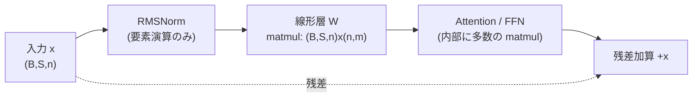

## 概要

RMSNorm（Root Mean Square Normalization）は、LLaMA、Gemma、Qwen、Mistral など現代の主要な Transformer が採用している正規化（Normalization）層です。本章では LayerNorm との実装比較には立ち入らず、**RMSNorm 自体が数理的に何をしているのか**を最短距離で理解することを目指します。

結論を一言で述べると、RMSNorm がやっているのは次の 2 段階です。

1. **方向の正規化**: 入力ベクトルを、その大きさ（RMS）で割ることで、原点からの距離を一定に揃える（向きの情報だけを残す）
2. **大きさのスケーリング**: 学習可能なゲイン $g$ を各次元に掛けて、正規化で潰した「次元ごとの大きさ」をモデルが再獲得できるようにする

この章では、この 2 段階を数式・幾何・コードの 3 面から捉え、forward だけでなく backward（逆伝播）まで CPU 上で動く NumPy 実装として与えます。すべての式は数値微分と PyTorch の autograd で一致を確認済みです。

:::message
本章のコードは GPU を必要とせず、`numpy` だけで動きます（検証パートのみ `torch` を使用）。手元の CPU でそのまま実行できます。
:::

## そもそも Transformer で「正規化」は何を意味するのか

Transformer の各サブ層（Attention、FFN）は、入力に対して線形変換や非線形変換を何度も重ねます。層を深くすると、各トークンの特徴ベクトルの**大きさ（ノルム）が層ごとに増減し、暴走**しやすくなります。ノルムが大きくなりすぎれば勾配爆発、小さくなりすぎれば勾配消失につながり、学習が不安定になります。

正規化層の役割は、この「特徴ベクトルの大きさ」を各層の入口（Pre-Norm の場合）で**一定のスケールに揃え直す**ことです。ここで重要なのは、正規化が作用する単位です。

- RMSNorm は **1 トークンの特徴ベクトル（次元 $n$、隠れ次元）ごとに独立**して正規化します
- バッチ内の他のトークンや、他のサンプルは一切参照しません（BatchNorm との決定的な違い）

つまり、形状 $(B, S, n)$ のテンソル（バッチ $B$ × 系列長 $S$ × 隠れ次元 $n$）に対して、最後の軸 $n$ に沿ってのみ統計量を取ります。$B \times S$ 個のトークンそれぞれが、独立に「自分自身の大きさ」で正規化されるのです。

この「トークンごと・特徴次元に沿った演算」という性質は、後述するように分散学習でのシャーディング（Sequence Parallelism）とも密接に関係します。

## RMSNorm の定義

入力を 1 トークン分の特徴ベクトル $x = (x_1, \dots, x_n) \in \mathbb{R}^n$ とします。RMSNorm は次式で定義されます。

まず、ベクトルの **RMS（二乗平均平方根）** を計算します。

$$
\mathrm{RMS}(x) = \sqrt{\frac{1}{n} \sum_{i=1}^{n} x_i^2}
$$

これは幾何的にはユークリッドノルム $\|x\|_2 = \sqrt{\sum_i x_i^2}$ を $\sqrt{n}$ で割ったもの、すなわち $\mathrm{RMS}(x) = \|x\|_2 / \sqrt{n}$ です。「次元数で規格化したベクトルの長さ」だと思えば十分です。

次に、入力を RMS で割って正規化し、学習可能なゲイン $g = (g_1, \dots, g_n) \in \mathbb{R}^n$ を要素ごとに掛けます。

$$
y_i = \frac{x_i}{\mathrm{RMS}(x)} \cdot g_i
$$

数値安定性のため、実装では平方根の中に微小量 $\epsilon$（例: $10^{-5}$）を加えます。

$$
y_i = \frac{x_i}{\sqrt{\frac{1}{n}\sum_{j=1}^{n} x_j^2 + \epsilon}} \cdot g_i
$$

ここで $\epsilon$ は、入力がゼロベクトルに近いときのゼロ除算を防ぐ役割を持ちます。ゲイン $g$ は学習対象のパラメータで、初期値は通常 $g_i = 1$（全次元 1）です。

:::message
LayerNorm と違い、RMSNorm には**平均の引き算（re-centering）がなく、バイアス項もありません**。統計量は「二乗平均」だけです。この省略が何を意味するのかは、次節の「本質的な意味」で扱います。
:::

## 本質的な意味: 方向を正規化し、大きさをゲインで制御する

RMSNorm の 2 段階を、幾何的に丁寧に見ていきます。

### 第 1 段階: RMS で割る = 半径 √n の超球面への射影

正規化されたベクトルを $\hat{x} = x / \mathrm{RMS}(x)$ と書きます。このノルムを計算してみましょう。

$$
\|\hat{x}\|_2 = \frac{\|x\|_2}{\mathrm{RMS}(x)} = \frac{\|x\|_2}{\|x\|_2 / \sqrt{n}} = \sqrt{n}
$$

**入力 $x$ が何であろうと、$\hat{x}$ のノルムは必ず $\sqrt{n}$ になります。** つまり RMS で割る操作は、任意の入力ベクトルを **半径 $\sqrt{n}$ の超球面（hypersphere）上に射影する**ことに相当します。

このとき保存されるのは $x$ の**向き（方向）だけ**で、元の大きさの情報は完全に捨てられます。実際、任意の正のスカラー $\alpha > 0$ に対して、

$$
\mathrm{RMS}(\alpha x) = |\alpha|\, \mathrm{RMS}(x), \qquad \frac{\alpha x}{\mathrm{RMS}(\alpha x)} = \frac{\alpha x}{\alpha\, \mathrm{RMS}(x)} = \frac{x}{\mathrm{RMS}(x)} = \hat{x}
$$

が成り立ちます。これが **re-scaling invariance（再スケーリング不変性）** です。入力を 2 倍にしようが 100 倍にしようが、正規化後の出力は変わりません。層の入口で特徴ベクトルの大きさが暴走しても、RMSNorm がそれを吸収して一定スケールに戻す、というのが正規化の効き目の本体です。

RMSNorm を提案した論文（Zhang & Sennrich, 2019, [arXiv:1910.07467](https://arxiv.org/abs/1910.07467)）の主張はまさにここにあります。「正規化が学習を安定させる効果の本質は、平均を引く re-centering ではなく、大きさを揃える re-scaling invariance にある」。だから平均の引き算を省いても性能はほぼ変わらず、計算だけ軽くなる、というわけです。

### 第 2 段階: ゲイン g = 大きさをモデルに取り戻させる

第 1 段階で、すべてのトークンは半径 $\sqrt{n}$ の超球面上に押し込められました。しかしこれでは「どの特徴次元が重要か（大きくあるべきか）」という情報まで一律に潰れてしまいます。

そこで学習可能なゲイン $g$ を要素ごとに掛け、**各次元の大きさをモデルが自由に再スケールできる**ようにします。$y_i = g_i \hat{x}_i$ は、超球面上の点を次元ごとに引き伸ばし・縮める操作（対角行列 $\mathrm{diag}(g)$ の適用）です。

役割分担を整理すると次のようになります。

| 段階 | 操作 | 何を決めるか | 学習可能か |
|------|------|------------|-----------|
| 第 1 段階 | $x \mapsto x / \mathrm{RMS}(x)$ | **方向**（超球面上の位置） | 不可（入力で決まる） |
| 第 2 段階 | $\hat{x} \mapsto g \odot \hat{x}$ | **各次元の大きさ**（超球面をどう歪めるか） | 可（$g$ を学習） |

「方向は入力データが決め、大きさはモデルが学習で制御する」——この分離こそが RMSNorm の数理的な意味です。

## 計算コストの主役 matmul はどこにあるか

大規模モデルの分散学習・推論では、計算コストの大半を matmul（行列積）が占めます。並列化の主対象も matmul です。だから本シリーズでは各コンポーネントを見るとき「matmul はどこにあり、どこに無いか」を必ず確認します。RMSNorm もこの観点で見てみましょう。

結論から言うと、**RMSNorm のコア演算そのものに matmul は含まれません**。RMSNorm の内部は次の要素演算だけで構成されます。

- 二乗（要素ごと）、平均（reduction）、平方根、除算（ブロードキャスト）、ゲイン乗算（要素ごと）

これらはすべて $O(n)$ の帯域律速（memory-bound）な演算で、行列積のような $O(n^2)$ 以上の計算律速（compute-bound）演算ではありません。では肝心の matmul はどこにあるのか。RMSNorm 自体には無く、**その「前後」に隣接して現れます**。Transformer の Pre-Norm ブロックの典型的な計算フローを見ると明確です。



ポイントは次の 2 つです。

1. **RMSNorm 自体は matmul を含まない**（要素演算と reduction のみ）
2. **RMSNorm の直後に必ず線形層（重み行列 $W$ との matmul）が来る**

この隣接関係には数理的な含意があります。RMSNorm の出力 $y = g \odot \hat{x}$ が次の線形層に入ると、$W y = W (g \odot \hat{x}) = W\, \mathrm{diag}(g)\, \hat{x}$ となります。**ゲイン $g$ は実質的に「後続の重み行列 $W$ の列スケーリング」として吸収できる**のです。つまり RMSNorm のゲインと線形層の matmul は数学的に地続きで、これが一部の推論最適化で「RMSNorm のゲインを隣の GEMM に畳み込む（fold する）」融合が可能な理由になっています。

なお、RMSNorm の**外側**、すなわち Attention の QKV 射影・出力射影、FFN の 2 つの線形層こそが matmul の本体（計算コストの大半）です。RMSNorm はその狭間に挟まる軽量な「スケール調整器」だと捉えると、システム全体での位置づけが正確になります。

## backward（逆伝播）: 微分する前に「何を伝えるべきか」

backward がやりたいのは、「出力 $y$ をこう動かしたい」という上流の要求 $dy = \partial L / \partial y$ を、「入力 $x$ をこう動かせ」という要求 $\partial L / \partial x$ に翻訳することです。RMSNorm の場合、これは連鎖律で $\delta_{ik}$ を機械的に展開しなくても、**forward の性質から直接読めます**。表記は $r = \mathrm{RMS}(x)$、$\hat{x} = x / r$ とします。

### まずゲインを剥がす（ここは自明）

$y = g \odot \hat{x}$ なので、正規化後のベクトル $\hat{x}$ が受け取る要求は $z := dy \odot g$ です。ゲイン自身への勾配は $y_i = g_i \hat{x}_i$ から即座に出ます（バッチ内で $g$ は共有なのでトークン方向に総和）。

$$
\frac{\partial L}{\partial g_i} = \sum_{\text{tokens}} (dy)_i\, \hat{x}_i
$$

残るは正規化 $x \mapsto \hat{x} = x/r$ の逆伝播だけです。

### もし r が定数なら、逆スケールで終わり

$\hat{x} = x / r$ の $r$ を定数とみなせば、backward はただの逆スケール $\partial L/\partial x = z / r$ で終わりです。話が非自明になるのは、**$r$ 自身が $x$ に依存する**——$x$ を動かすと分母も一緒に動く——この一点だけです。ここを $\delta_{ik}$ の偏微分で押し切ることもできますが、その必要はありません。

### スケール不変性が「伝えても無駄な方向」を教える

ここで forward の性質を使います。RMSNorm はスケール不変、$y(\alpha x) = y(x)$ でした。これは「$x$ を**自分自身の方向** $u = x / \|x\|_2$ に沿って伸縮させても、出力は 1 ミリも動かない」という意味です。

出力が動かない方向の入力変化は、損失に影響しません。ということは、その方向へ「$x$ をこう動かせ」と勾配を返しても**無意味**です。だから backward がやるべきことは 1 つ——上流の要求 $z$ から $u$ 方向の成分を捨て、残り（球面に接する方向）だけを $1/r$ 倍して返す。それが答えそのものになります。

$$
\frac{\partial L}{\partial x} = \frac{1}{r}\big(z - \langle z, u\rangle\, u\big) = \frac{1}{r}\, P z,
\qquad P = I - u u^\top,\quad u = \frac{x}{\|x\|_2}
$$

$P = I - u u^\top$ は「$u$ 方向を消して直交成分だけ残す」**直交射影**です。forward が「半径 $\sqrt{n}$ の球面へ射影（半径方向を捨てる）」なら、backward は「その球面の接平面へ射影（半径方向の勾配を捨てる）」。**同じ射影が順伝播と逆伝播の両方に現れます**。実際、正規化部のヤコビアンは $\frac{1}{r} P$ という対称行列で、対称だからこそ順・逆どちらの適用も同じ $\frac{1}{r} P$ を掛けるだけで済みます（数値実験で $J x = 0$ と対称性 $J = J^\top$ を確認済み。検証パート参照）。

なお $u = \hat{x} / \sqrt{n}$ なので、$\hat{x}$ で書き直すと $\frac{1}{r}\big(z - \hat{x}\,\langle z, \hat{x}\rangle / n\big)$ となります。中身は同一で、実装（分母に $\epsilon$ を含む $r$ が既にある）ではこちらの形が扱いやすいので後述のコードでは $\hat{x}$ 版を使います。

:::message
「微分して確かめたい」派のために、$\delta_{ik}$ を使う厳密な連鎖律版も残しておきます（結果は上と一致）。
:::

::::details 連鎖律による厳密導出（クリックで展開）
$z_i := (dy)_i\, g_i = \partial L / \partial \hat{x}_i$ とおきます。$\hat{x}_i = x_i r^{-1}$ で $r$ も $x$ に依存するので、まず $r^2 = \frac{1}{n}\sum_j x_j^2 + \epsilon$ を微分して $\dfrac{\partial r}{\partial x_k} = \dfrac{1}{n}\dfrac{x_k}{r} = \dfrac{\hat{x}_k}{n}$。これを使い、

$$
\frac{\partial \hat{x}_i}{\partial x_k}
= \frac{\delta_{ik}}{r} - \frac{x_i}{r^2}\frac{\partial r}{\partial x_k}
= \frac{1}{r}\left(\delta_{ik} - \frac{\hat{x}_i \hat{x}_k}{n}\right)
$$

したがって

$$
\frac{\partial L}{\partial x_k} = \sum_i z_i \frac{\partial \hat{x}_i}{\partial x_k}
= \frac{1}{r}\left( z_k - \hat{x}_k \cdot \frac{1}{n}\sum_i z_i \hat{x}_i \right)
$$

ベクトル形式で $\dfrac{\partial L}{\partial x} = \dfrac{1}{r}\big(z - \hat{x}\,\langle z, \hat{x}\rangle / n\big)$。$u = \hat{x}/\sqrt{n}$ を代入すれば $\frac{1}{r}(z - \langle z, u\rangle u)$ に一致し、射影として読んだ形と厳密に同じものになります。
::::

### 1/r 倍 = 暗黙の学習率調整

この $1/r$ 倍という因子も示唆的です。入力の大きさ $r$ が大きいほど入力への勾配は小さくなる。これが論文の言う **implicit learning rate adaptation（暗黙的な学習率調整）** の正体で、大きな活性を持つトークンほど更新が控えめになり、学習が安定します。

## CPU で動く実装（forward + backward）

以上の数理をそのまま NumPy に落とします。形状 $(B, n)$（$B$ 個のトークン × 隠れ次元 $n$）を受け取る実装です。

```python
import numpy as np

def rmsnorm_forward(x, g, eps=1e-5):
    """x: (B, n) 各行が 1 トークンの特徴ベクトル / g: (n,) 学習可能ゲイン"""
    ms = np.mean(x * x, axis=-1, keepdims=True)   # mean(x^2)   (B,1)
    r = np.sqrt(ms + eps)                         # RMS(x)      (B,1)
    xhat = x / r                                  # 方向の正規化 (B,n)  ||xhat||=sqrt(n)
    y = g * xhat                                  # 大きさをゲインで制御 (B,n)
    cache = (g, r, xhat)
    return y, cache

def rmsnorm_backward(dy, cache):
    """dy: (B, n) 上流勾配 dL/dy"""
    g, r, xhat = cache
    n = xhat.shape[-1]
    z = dy * g                                    # dL/dxhat            (B,n)
    dot = np.sum(z * xhat, axis=-1, keepdims=True)  # <z, xhat>         (B,1)
    dx = (z - xhat * dot / n) / r                 # dL/dx              (B,n)
    dg = np.sum(dy * xhat, axis=0)                # dL/dg (トークン方向に合計) (n,)
    return dx, dg
```

forward は定義そのまま、backward は前節の射影の式そのままです（`dot / n` の項が $u$ 方向成分の除去、`/ r` が $1/r$ 倍に対応）。`cache` に順伝播の中間量（$g, r, \hat{x}$）を保存し、逆伝播で再利用しています。

### 正しさの検証

この実装が正しいことを、4 つの独立な方法で確認します。以下は実際に手元の CPU で実行した結果です。

**(1) 数値微分（中心差分）との一致**: 解析的勾配と、$\frac{L(x+h)-L(x-h)}{2h}$ による数値微分を比較します。

```
max|dx - dx_num| = 1.30e-09
max|dg - dg_num| = 2.66e-10
```

中心差分の打ち切り誤差（$O(h^2)$）の範囲で完全に一致しています。

**(2) PyTorch の autograd との一致**: 同じ計算を PyTorch で組み、自動微分の結果と比較します。

```
max|y  - y_torch |  = 2.22e-16
max|dx - dx_torch|  = 8.88e-16
max|dg - dg_torch|  = 4.44e-16
```

倍精度の機械イプシロン（約 $2.2\times10^{-16}$）の水準で一致、すなわち完全一致です。

**(3) スケール不変性の確認**: $\epsilon = 0$ とし、入力を $\alpha$ 倍しても出力が変わらないことを確認します。

```
alpha=  0.1 : max|y(ax) - y(x)| = 1.11e-16
alpha=  3.0 : max|y(ax) - y(x)| = 1.11e-16
alpha=100.0 : max|y(ax) - y(x)| = 2.22e-16
```

入力を 0.1〜100 倍しても出力は機械精度で不変。前節で示した re-scaling invariance が数値的にも確認できます。あわせて $\|\hat{x}\|_2 = \sqrt{n}$ も厳密に成立していることを確認しました（$n=8$ で全トークン $2.8284\ldots$）。

**(4) 「スケール不変 ⟹ backward は射影」の確認**: backward セクションの主張の核心です。まず、入力方向 $u$ に沿った変化に対して出力ヤコビアン $J$ が $J x = 0$ となる（＝入力方向の勾配は伝わらない）ことを、$y(x + \alpha x)$ の $\alpha$ 微分で確認します。次に正規化部のヤコビアン $J_0$ を数値的に構成し、対称であること・$\frac{1}{r}(I - u u^\top)$ に一致することを確認します。

```
max|J x| (0 のはず) = 1.11e-10
max|J0 - J0^T|      = 1.67e-10   # 対称
max|J0 - (1/r)P|    = 1.66e-10   # 射影 P=I-uu^T に一致
```

$J x = 0$ が成り立つ（入力方向の勾配は消える）こと、そして backward が射影 $\frac{1}{r}(I - u u^\top)$ そのものであることが数値的に確認できました。連鎖律の展開なしに backward が導けた理由がここにあります。

### 検証コード全体

上記の検証をまとめて再現するスクリプトは次の通りです。`numpy` と（照合用に）`torch` があれば CPU でそのまま動きます。

```python
import numpy as np

def rmsnorm_forward(x, g, eps=1e-5):
    ms = np.mean(x * x, axis=-1, keepdims=True)
    r = np.sqrt(ms + eps)
    xhat = x / r
    y = g * xhat
    return y, (g, r, xhat)

def rmsnorm_backward(dy, cache):
    g, r, xhat = cache
    n = xhat.shape[-1]
    z = dy * g
    dot = np.sum(z * xhat, axis=-1, keepdims=True)
    dx = (z - xhat * dot / n) / r
    dg = np.sum(dy * xhat, axis=0)
    return dx, dg

rng = np.random.default_rng(0)
B, n, eps = 4, 8, 1e-5
x  = rng.standard_normal((B, n))
g  = rng.standard_normal(n)
dy = rng.standard_normal((B, n))   # 上流勾配 (任意)。L = <dy, y> とすれば dL/dy = dy

y, cache = rmsnorm_forward(x, g, eps)
dx, dg = rmsnorm_backward(dy, cache)

# (1) 数値微分
def loss(x, g):
    y, _ = rmsnorm_forward(x, g, eps)
    return np.sum(dy * y)

h = 1e-6
dx_num = np.zeros_like(x)
for i in range(B):
    for j in range(n):
        xp = x.copy(); xp[i, j] += h
        xm = x.copy(); xm[i, j] -= h
        dx_num[i, j] = (loss(xp, g) - loss(xm, g)) / (2 * h)
dg_num = np.zeros_like(g)
for j in range(n):
    gp = g.copy(); gp[j] += h
    gm = g.copy(); gm[j] -= h
    dg_num[j] = (loss(x, gp) - loss(x, gm)) / (2 * h)
print("max|dx - dx_num| =", np.max(np.abs(dx - dx_num)))
print("max|dg - dg_num| =", np.max(np.abs(dg - dg_num)))

# (2) PyTorch autograd 照合
import torch
xt = torch.tensor(x, requires_grad=True)
gt = torch.tensor(g, requires_grad=True)
rt = torch.sqrt(torch.mean(xt * xt, dim=-1, keepdim=True) + eps)
yt = gt * (xt / rt)
yt.backward(torch.tensor(dy))
print("max|dx - dx_torch| =", np.max(np.abs(dx - xt.grad.numpy())))
print("max|dg - dg_torch| =", np.max(np.abs(dg - gt.grad.numpy())))

# (3) スケール不変性 (eps=0 で厳密)
y0, _ = rmsnorm_forward(x, g, 0.0)
for alpha in [0.1, 3.0, 100.0]:
    ya, _ = rmsnorm_forward(alpha * x, g, 0.0)
    print(f"alpha={alpha:6.1f}: max|y(ax)-y(x)| = {np.max(np.abs(ya - y0)):.2e}")

# (4) スケール不変 => 入力方向の勾配は消える (J x = 0)、backward は射影 (1/r)(I-uu^T)
ej = 1e-6
yp, _ = rmsnorm_forward(x * (1 + ej), g, 0.0)
ym, _ = rmsnorm_forward(x * (1 - ej), g, 0.0)
print("max|J x| (0 のはず) =", np.max(np.abs((yp - ym) / (2 * ej))))  # d y(x+a x)/da|_0 = J x

xi = x[0]                                     # 1 トークンで正規化部ヤコビアン J0 を構成 (g=1)
ri = np.sqrt(np.mean(xi * xi))                # eps=0
J0 = np.zeros((n, n))
for k in range(n):
    e = np.zeros(n); e[k] = h
    yp, _ = rmsnorm_forward((xi + e)[None], np.ones(n), 0.0)
    ym, _ = rmsnorm_forward((xi - e)[None], np.ones(n), 0.0)
    J0[:, k] = (yp[0] - ym[0]) / (2 * h)
ui = xi / np.linalg.norm(xi)
P_over_r = (np.eye(n) - np.outer(ui, ui)) / ri
print("max|J0 - J0^T|   =", np.max(np.abs(J0 - J0.T)))       # 対称
print("max|J0 - (1/r)P| =", np.max(np.abs(J0 - P_over_r)))   # 射影に一致
```

## まとめ

RMSNorm の数理的な意味を、比較に頼らず本質だけを取り出すと次の通りです。

- **やっていること**: 入力ベクトルを RMS で割って半径 $\sqrt{n}$ の超球面に射影し（方向のみ保持）、学習可能なゲイン $g$ で各次元の大きさを制御する
- **方向と大きさの分離**: 方向は入力データが、大きさはモデル（$g$）が決める。これが 2 段階構成の核心
- **re-scaling invariance**: 入力を定数倍しても出力は不変。層間で暴走する活性の大きさを吸収するのが正規化の効き目の本体
- **matmul の位置**: RMSNorm のコアは要素演算・reduction のみで matmul を含まない。matmul は直後の線形層に現れ、ゲイン $g$ はその重み行列の列スケーリングとして吸収できる
- **backward**: 微分の力技は不要。スケール不変性から「入力方向 $u$ の勾配は伝えても無駄」→除去、と読めて $\partial L/\partial x = \frac{1}{r}(z - \langle z,u\rangle u) = \frac{1}{r}Pz$（$P=I-uu^\top$）。forward の球面への射影と同じ射影が backward にも現れ、$1/r$ 因子が暗黙の学習率調整として働く
- **ハードフレンドリー化**: L1（MAD）正規化なら二乗を abs に・補正を符号選択に落とせる（射影先は球面から正八面体へ、ヤコビアンは非対称化）。実測でも L1 は L2 と同等に学習が収束し低精度でも安定するが、明確な優位はなく、採用理由はハードウェア制約側にある。一方、四分の一平方や偏極恒等式で乗算を二乗器に還元するトリックは、桁落ち（誤差 $\sim u\kappa$）とオーバーフロー（レンジ半減）で低精度では破綻する

すべての式は数値微分・PyTorch autograd・スケール不変性テストで裏取り済みです。発展節の L1-RMSNorm・ヤコビアン非対称性・桁落ちも同様に数値検証しています。

## 発展: 乗算器のないハードウェアで RMSNorm を再現できるか

ここからは応用的な問いを扱います。**乗算器を持たない（あるいは乗算が非常に高価な）ハードウェア**を仮定します。加算・減算・絶対値・シフト、そして L2 ノルム（二乗和）程度のプリミティブは使えるものとします。このとき RMSNorm の forward/backward をどこまで再現できるでしょうか。これは架空の設定ではなく、FPGA や DSP、アナログ・インメモリ計算といった "multiplier-less" な設計で実際に問われる課題です。

RMSNorm 内の乗算を洗い出すと、(a) 二乗和（統計量 $r$ の計算）、(b) スカラー逆数 $1/r$、(c) 要素ごとのスケーリング（$x_i / r$、$g_i \cdot$）、(d) backward の内積 $\langle dy, y\rangle$——の 4 種です。これらを乗算器なしで代替できるかを、2 つの方向から検討します。**L1 化**（乗算そのものを減らす）と、**恒等式による乗算の置換**（乗算を二乗＋加算に変換する）です。先に結論を言うと、前者は有望・後者は低精度で破綻します。その破綻を数式と可視化で解剖するのが本節の主眼です。

### 方向1: L1-RMSNorm — 二乗を絶対値に置き換える

RMS の代わりに**平均絶対値**（MAD: Mean Absolute Deviation）で正規化する変種を考えます。

$$
s(x) = \frac{1}{n}\sum_{i=1}^{n} |x_i|, \qquad y_i = \frac{x_i}{s(x)} \cdot g_i
$$

統計量が二乗を含まず **abs と加算だけ**で計算できます。二乗器すら不要で、最もハードフレンドリーです。この L1 版も RMSNorm と同じ本質的性質を保ちます。

**スケール不変性**: $s(\alpha x) = |\alpha| s(x)$ なので $y(\alpha x) = y(x)$。L2 版と同様、入力の大きさを吸収します（数値実験で $10^{-16}$ 精度で確認）。

**幾何**: L2 が「$\|\hat{x}\|_2 = \sqrt{n}$ の球面」への射影だったのに対し、L1 は「$\|\hat{x}\|_1 = n$ の**L1 球面（正八面体）**」への射影になります。$\hat{x} = x / s$ とすると $\sum_i |\hat{x}_i| = \sum_i |x_i| / s = n$ が常に成り立ちます。


上図は $n=3$ で、大きさがバラバラの入力ベクトル群がそれぞれの等ノルム面に射影される様子です。左の L2 は滑らかな球面、右の L1 は角張った正八面体（$|x|+|y|+|z|=n$ の面）に点が載ります。正規化とは「等ノルム面への射影」であり、ノルムの種類を変えると射影先の**面の形が変わる**——これが L1 と L2 の幾何的な違いです。

**backward**: $s$ の勾配は $\partial |x_i| / \partial x_i = \mathrm{sign}(x_i)$ を使い、L2 と同じ論理（スケール不変 → 補正項）で導けます。

$$
\frac{\partial L}{\partial x} = \frac{1}{s}\Big(g \odot dy - \mathrm{sign}(x)\, c\Big), \qquad c = \frac{\langle dy, y\rangle}{n}
$$

L2 版の $\hat{x}$ が $\mathrm{sign}(x)$ に置き換わった形です。ここに**乗算削減の妙味**があります。補正項 $\mathrm{sign}(x)\, c$ は「スカラー $c$ を、各要素の符号ビットに応じて $+c$ か $-c$ で配るだけ」——乗算ではなく**符号選択**で済みます。残る乗算は $g \odot dy$ と全体の $1/s$ 倍のみです。

### L1 と L2 の決定的な違い: backward ヤコビアンの対称性

L1 版には、L2 版にない際立った性質があります。**正規化部のヤコビアンが非対称になる**のです。

- L2: $J = \frac{1}{r}\big(I - \hat{x}\hat{x}^\top / n\big)$ — 外積 $\hat{x}\hat{x}^\top$ は**対称**なので $J = J^\top$
- L1: $J = \frac{1}{s}\big(I - \hat{x}\,\mathrm{sign}(x)^\top / n\big)$ — 外積 $\hat{x}\,\mathrm{sign}(x)^\top$ は左右の因子が違うため**非対称**、$J \neq J^\top$

これは可視化するとはっきりします。次の図は、支配的な恒等項 $I$ を除いた rank-1 補正項 $C = J - \frac{1}{\text{scale}} I$ だけを 3D 表示したものです（$I$ を残すと対角の尖りが支配的で補正項の構造が埋もれるため）。


左の L2 は補正項が対称な椀型（$C_{ij} = C_{ji}$、数値的に $\|C - C^\top\| = 0$）。右の L1 は $\mathrm{sign}(x)$ が階段状のため、行方向と列方向で構造が食い違う非対称なリッジになります（$\|C - C^\top\| = 0.14$）。

この非対称性は実務上の含意を持ちます。forward が対称ヤコビアンを持つ L2 では、VJP（backward）と JVP（forward-mode）が同じ演算子で書けます。L1 ではこれが崩れるため、forward-mode 微分を使う場合は転置を意識する必要があります。ハードフレンドリーさ（二乗を消せる）と引き換えに、この対称性を失う——これが L1 化のトレードオフです。

なお L1 正規化の代償として、正規化のスケールが L2 と定数倍ずれます。ガウス分布入力では $\mathrm{RMS}/\mathrm{MAD} = \sqrt{\pi/2} \approx 1.2533$ です（数値実験で $1.257$ を確認）。ただしこの定数倍は後続のゲイン $g$ が学習で吸収するため、実用上の障害にはなりません。

### 方向2: 恒等式で乗算を「二乗＋加算」に置き換える — そして失敗する

L1 化しても $g \odot dy$ や $1/s$ 倍といった乗算は残ります。これらすべてを消せないか。古典的な 2 つの恒等式が候補になります。

**偏極恒等式**（内積を L2 ノルムだけで）:

$$
\langle a, b\rangle = \frac{1}{4}\Big(\|a + b\|_2^2 - \|a - b\|_2^2\Big)
$$

backward で全次元を結合する唯一の内積 $\langle dy, y\rangle$ が、L2 ノルム 2 回・減算・シフト（$\div 4$）だけで書けます。乗算器ゼロです。

**四分の一平方乗算**（要素積を二乗器だけで）:

$$
a \cdot b = \frac{1}{4}\Big((a + b)^2 - (a - b)^2\Big)
$$

任意の要素積が「二乗・減算・シフト」に落ちます。二乗器（$\mathrm{L2}$ の中身と同じ回路）が 1 つあれば、乗算はすべてこれで代替できる——理論上は。実際、これはアナログ計算機の時代に実在した乗算手法です。

**ところが、これは低精度で壊滅的に破綻します。** float64 では機械精度で正しく動くのに（恒等式なので当然です）、fp16 では使い物になりません。理由は 2 つあり、どちらも数式から予言できます。

**破綻要因1: 桁落ち（catastrophic cancellation）**。$(a+b)^2 - (a-b)^2$ は「近い大きな数どうしの引き算」です。相対誤差は入力の**アスペクト比**で決まり、条件数として書けます。

$$
\kappa(a, b) = \frac{a^2 + b^2}{2|ab|} = \cosh\!\big(\ln|a/b|\big)
$$

四分の一平方の相対誤差は概ね $u \cdot \kappa$（$u$ は丸め単位）で上から抑えられます。$a \approx b$ なら $\kappa = 1$ で最良ですが、$|a/b|$ が 1 から離れると $\kappa$ は指数的に増大します。fp16（$u = 2^{-11}$）で $|a/b| = 1000$ なら $\kappa \approx 500$、上界 $u\cdot\kappa \approx 24\%$、実測 median でも相対誤差は約 14% に達します（本節末尾の検証コード出力を参照）。

この振る舞いを 3D の誤差地形として可視化します。


$(\log_2|a|, \log_2|b|)$ 平面上に、四分の一平方の fp16 相対誤差を高さで描いたものです。色付きの曲面が理論値 $u \cdot \kappa$、底面の黒点が fp16 実測の median で、両者はよく一致します。対角線 $a \approx b$ に沿った**谷**が条件数最小の安全地帯、そこから両翼に離れるほど**桁落ちの斜面**を駆け上がり、右奥の**絶壁**がオーバーフロー領域（次項）です。要素積が「二つの近い大きさの数」でない限り、精度が崩れることが一目で分かります。

**破綻要因2: オーバーフロー（ダイナミックレンジ半減）**。$(a+b)^2$ は入力の**二乗**なので、直接乗算 $a \cdot b$ より早くオーバーフローします。fp16 の最大値は $65504$ なので、$|a+b| > \sqrt{65504} \approx 256$ で $(a+b)^2$ が $\infty$ になります。指数部のレンジを実質半分（1 ビット分）失うのです。

精度とスケールを掃引した崩壊面を見ると、この 2 要因の役割分担が明確になります。


高さが相対誤差、色がオーバーフロー率です（各点で $a, b \sim \mathcal{N}(0, 1)$ に scale を掛けた分布からサンプル）。手前の **fp32** は全スケールで安定。奥の **fp16** はスケールを上げると絶壁のようにオーバーフローで崩壊します（scale=512 でオーバーフロー率 92%）。中列の **bf16** は二律背反を示します。bf16 の仮数は 7 ビットしかなく（fp16 は 10 ビット、$u = 2^{-8}$ vs $2^{-11}$）、桁落ち誤差は fp16 より**約 8 倍悪化**します。その一方で、fp32 と同じ 8 ビット指数を持つため**オーバーフローはしません**（scale=512 でも 0%）。つまり bf16 は「レンジは救われるが桁落ちはさらに悪い」——どちらの精度でも四分の一平方は使いものにならず、低精度不適合がむしろ鮮明になります。

**結論: 恒等式トリックは筋が悪い。** 皮肉なことに、四分の一平方や偏極恒等式は「乗算器を省きたい低精度ハードウェア」でこそ機能しません。float64 で機械精度一致したのは「恒等式が代数的に真」であることの再確認にすぎず、ハードウェア適性を何も保証しないのです。乗算を二乗器に**還元**しても、桁落ちとオーバーフローという別のコストに化けるだけでした。

生き残る方向は明確です。恒等式で乗算を消すのではなく、(1) backward を rank-1 補正の**簡単形** $\frac{1}{r}(g \odot dy - c\hat{x})$ に代数簡約して演算数そのものを減らす（精度に中立）、(2) **L1 化**で二乗を abs に、補正を符号選択に落とす（オーバーフロー耐性はむしろ向上）。ハードフレンドリーな RMSNorm の本命は、トリッキーな乗算置換ではなく、これら地道な簡約と L1 化にあります。

### L1-RMSNorm は実用になるのか（実測）

ここまでは L1-RMSNorm の数理的性質（正しさ・スケール不変・幾何）を見てきました。しかし「数式が綺麗」と「実用になる」は別問題です。そこで、L2-RMSNorm・正規化なしと比較して、実際に学習が回るかを実験しました。タスクは合成回帰、モデルは深さ 40 の Pre-Norm 残差 MLP（正規化がないと学習が不安定になる深さ）です。


左が学習曲線（val MSE、対数軸）です。**正規化なし**（灰）は val MSE が $10^4$ 以上で乱高下し収束しません。一方 **L2**（青）と **L1**（赤）はほぼ重なって $0.1$ 前後まで綺麗に収束します。L1-RMSNorm は正規化層として問題なく機能し、性能も L2 と同等（この設定では L1 が僅かに良い程度）です。

右は低精度での安定性です。正規化の内部計算を bf16 / fp16 で明示的に行っても、L1・L2 とも 4 シード中 1 度も発散せず、L1 は L2 と同等以下の val MSE を保ちました。L1 化の動機（低精度ハードでも安定に回る）は満たされています。

ただし、正直に限界も述べておきます。

- **L1 が L2 を明確に上回る決定的優位は、この実験では出ませんでした。** 差はいずれも小さく、「互角」というのが公平な評価です。
- 「L1 は二乗しないので外れ値にロバスト」という直感は、**中程度の外れ値では L1 微有利、強い外れ値ではむしろ L2 有利**という混合結果でした（正規化の分母は確かにロバスト化するが、正規化後も外れ値次元は残るため）。
- これは 8 次元・合成タスク・MLP での結果です。LLM の実 activation（外れ値チャンネル、数千次元、Attention との相互作用）に一般化できる保証はありません。

**結論**: L1-RMSNorm は「動く・安定する・L2 と同等」です。乗算や二乗を避けたいハードウェア制約があるなら、精度をほとんど落とさずに採用できる現実的な選択肢になります。逆に言えば、L2 を積極的に置き換える理由は（少なくとも通常の GPU/TPU では）薄く、主流が L2-RMSNorm のままなのは「互角なら枯れた方を使う」という妥当な判断だと解釈できます。L1 の出番は、あくまでハードウェア側に制約があるときです。

### 発展節の検証コード

本節の主張（L1-RMSNorm の正しさ・ヤコビアン非対称性・四分の一平方の桁落ち）を再現するコードです。以下は実際の実行結果とともに示します。

```python
import numpy as np
import torch

# ===== L1-RMSNorm forward / backward =====
def l1_forward(x, g, eps=1e-5):
    s = np.mean(np.abs(x), axis=-1, keepdims=True) + eps   # MAD (abs + add のみ)
    return g * (x / s), (g, s, x / s)

def l1_backward(dy, x, cache):
    g, s, xhat = cache
    n = xhat.shape[-1]
    c = np.sum(dy * (g * xhat), axis=-1, keepdims=True) / n  # c = <dy,y>/n
    dx = (g * dy - np.sign(x) * c) / s                       # sign(x)·c = 符号選択
    dg = np.sum(dy * xhat, axis=0)
    return dx, dg

rng = np.random.default_rng(0)
B, n, eps = 4, 8, 1e-5
x = rng.standard_normal((B, n)); g = rng.standard_normal(n); dy = rng.standard_normal((B, n))
y, cache = l1_forward(x, g, eps); dx, dg = l1_backward(dy, x, cache)

xt = torch.tensor(x, requires_grad=True); gt = torch.tensor(g, requires_grad=True)
st = torch.mean(torch.abs(xt), dim=-1, keepdim=True) + eps
(gt * (xt / st)).backward(torch.tensor(dy))
print("[L1] backward vs PyTorch :", np.max(np.abs(dx - xt.grad.numpy())))
y0, _ = l1_forward(x, g, 0.0)
print("[L1] scale invariance    :", max(np.max(np.abs(l1_forward(a*x, g, 0.0)[0]-y0)) for a in [0.1,3,100]))
print("[L1] ||xhat||_1 (=n) :", np.round(np.sum(np.abs(x/np.mean(np.abs(x),-1,keepdims=True)),-1), 4))

# ===== ヤコビアン非対称性 (g=1): L2 対称 / L1 非対称 =====
h = 1e-6; xi = x[0]
def jac(fn):
    J = np.zeros((n, n))
    for k in range(n):
        e = np.zeros(n); e[k] = h
        J[:, k] = (fn((xi+e)[None])[0] - fn((xi-e)[None])[0]) / (2*h)
    return J
J_L2 = jac(lambda v: v / np.sqrt(np.mean(v*v, -1, keepdims=True)))
J_L1 = jac(lambda v: v / np.mean(np.abs(v), -1, keepdims=True))
print("[L2] 非対称度 |J-J^T| =", np.max(np.abs(J_L2 - J_L2.T)))
print("[L1] 非対称度 |J-J^T| =", np.max(np.abs(J_L1 - J_L1.T)))

# ===== 四分の一平方の桁落ち: 相対誤差 ~ u*kappa, fp16 vs bf16 =====
def qs(a, b, prec):                           # prec: np.float16 か "bf16"
    cast = (lambda v: np.float16(v)) if prec is np.float16 else \
           (lambda v: float(torch.tensor(float(v), dtype=torch.bfloat16)))
    a, b = cast(a), cast(b)
    return cast(cast(cast(a+b)**2 - cast(a-b)**2) / 4)
print("[QS] a*b=((a+b)^2-(a-b)^2)/4  median rel-err (fp16 vs bf16):")
for r in [1, 10, 100, 1000]:
    ef, eb = [], []
    for _ in range(4000):                     # 厳密表現を避けるため乱数摂動 + 符号ランダム
        a0 = r * (1 + 0.3*rng.standard_normal()) * rng.choice([-1, 1])
        b0 = 1.0 * (1 + 0.3*rng.standard_normal()) * rng.choice([-1, 1])
        ex = np.float64(a0) * np.float64(b0)
        if abs(ex) < 1e-6: continue
        ef.append(abs(qs(a0, b0, np.float16) - ex) / abs(ex))
        eb.append(abs(qs(a0, b0, "bf16") - ex) / abs(ex))
    kappa = (r**2 + 1) / (2*r)
    print(f"  |a/b|~{r:5d}: kappa={kappa:7.1f}  fp16={np.median(ef):.2e}  "
          f"bf16={np.median(eb):.2e}  (u*kappa[fp16]={2**-11*kappa:.2e})")
```

実行結果:

```
[L1] backward vs PyTorch : 4.44e-16
[L1] scale invariance    : 4.44e-16
[L1] ||xhat||_1 (=n) : [8. 8. 8. 8.]
[L2] 非対称度 |J-J^T| = 1.67e-10      # 対称
[L1] 非対称度 |J-J^T| = 0.557         # 非対称
[QS] a*b=((a+b)^2-(a-b)^2)/4  median rel-err (fp16 vs bf16):
  |a/b|~    1: kappa=    1.0  fp16=4.49e-04  bf16=3.62e-03  (u*kappa[fp16]=4.88e-04)
  |a/b|~   10: kappa=    5.0  fp16=1.56e-03  bf16=1.22e-02  (u*kappa[fp16]=2.47e-03)
  |a/b|~  100: kappa=   50.0  fp16=1.50e-02  bf16=1.20e-01  (u*kappa[fp16]=2.44e-02)
  |a/b|~ 1000: kappa=  500.0  fp16=1.42e-01  bf16=1.00e+00  (u*kappa[fp16]=2.44e-01)
```

L1-RMSNorm は PyTorch と機械精度一致・スケール不変・$\|\hat{x}\|_1 = n$ を満たし、ヤコビアンは L2 が対称・L1 が非対称。四分の一平方の相対誤差は条件数 $\kappa$ に比例して増大し、fp16 では $|a/b| = 1000$ で 14% に達します。bf16 は仮数が 3 ビット少ない分、同じ条件で誤差が約 8 倍（$|a/b|=1000$ で 100%）に悪化します。すべて本文の主張どおりです。

実用性の実験（深さ 40 MLP の学習比較）は次のコードで再現できます。

```python
import numpy as np
import torch, torch.nn as nn

def l2norm(x, g, eps=1e-5): return g * (x / torch.sqrt(torch.mean(x*x, -1, keepdim=True) + eps))
def l1norm(x, g, eps=1e-5): return g * (x / (torch.mean(torch.abs(x), -1, keepdim=True) + eps))

class MLP(nn.Module):
    def __init__(self, d=128, depth=40, norm="l2", blow=1.5):
        super().__init__(); self.norm, self.blow = norm, blow
        self.inp = nn.Linear(8, d)
        self.lins = nn.ModuleList([nn.Linear(d, d) for _ in range(depth)])
        self.gs = nn.ParameterList([nn.Parameter(torch.ones(d)) for _ in range(depth)])
        self.out = nn.Linear(d, 1)
    def forward(self, x):
        h = self.inp(x)
        f = {"l2": l2norm, "l1": l1norm}.get(self.norm)   # none なら恒等
        for lin, g in zip(self.lins, self.gs):
            hn = f(h, g) if f else h
            h = h + self.blow * torch.relu(lin(hn))       # blow>1 で活性を暴走させる
        return self.out(h)

def data(n, seed):
    gen = torch.Generator().manual_seed(seed)
    X = torch.randn(n, 8, generator=gen)
    y = torch.tanh(X @ torch.linspace(-1, 1, 8).unsqueeze(1))
    return X, y

def train(norm, seed=0, epochs=80, lr=3e-3):
    torch.manual_seed(seed)
    X, y = data(2000, seed); Xv, yv = data(500, seed+100)
    m = MLP(norm=norm); opt = torch.optim.Adam(m.parameters(), lr=lr); lf = nn.MSELoss()
    for _ in range(epochs):
        opt.zero_grad(); loss = lf(m(X), y)
        if not torch.isfinite(loss): return float("nan")
        loss.backward(); opt.step()
    with torch.no_grad(): return lf(m(Xv), yv).item()

for norm in ["none", "l2", "l1"]:
    fs = [train(norm, s) for s in range(4)]
    print(f"{norm:4s}: val MSE = {np.mean([f for f in fs if np.isfinite(f)]):.4f}")
```

実行結果:

```
none: val MSE = 626895.4954    # 正規化なしは発散し収束しない
l2  : val MSE = 0.0986
l1  : val MSE = 0.0838         # L1 も L2 と同等に収束
```

正規化なしは深さ 40 で発散する一方、L1・L2 はともに収束し、L1 は L2 と同等（この設定では僅かに良い）です。

## 参考文献

- Biao Zhang, Rico Sennrich. "Root Mean Square Layer Normalization." NeurIPS 2019. [arXiv:1910.07467](https://arxiv.org/abs/1910.07467)
- 四分の一平方乗算（quarter-square multiplication）: $ab = \frac{1}{4}((a+b)^2 - (a-b)^2)$。二乗テーブルを用いた古典的なアナログ／ディジタル乗算手法。
- 偏極恒等式（polarization identity）: 内積をノルムで表す線形代数の基本恒等式。
- 桁落ち（catastrophic cancellation）と条件数については数値計算の標準的な教科書（例: N. J. Higham, "Accuracy and Stability of Numerical Algorithms"）を参照。
