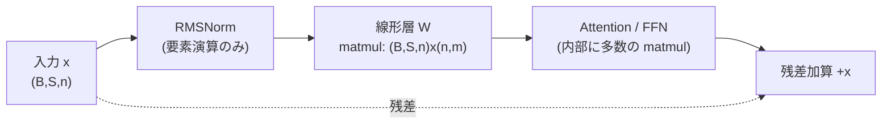

## 概要

RMSNorm（Root Mean Square Normalization）は、LLaMA、Gemma、Qwen、Mistral など現代の主要な Transformer が採用している正規化（Normalization）層です。本章では LayerNorm との実装比較には立ち入らず、**RMSNorm 自体が数理的に何をしているのか**を最短距離で理解することを目指します。

結論を一言で述べると、RMSNorm がやっているのは次の 2 段階です。

1. **方向の正規化**: 入力ベクトルを、その大きさ（RMS）で割ることで、原点からの距離を一定に揃える（向きの情報だけを残す）
2. **大きさのスケーリング**: 学習可能なゲイン $g$ を各次元に掛けて、正規化で潰した「次元ごとの大きさ」をモデルが再獲得できるようにする

この章では、この 2 段階を数式・幾何・コードの 3 面から捉え、forward だけでなく backward（逆伝播）まで CPU 上で動く NumPy 実装として与えます。すべての式は数値微分と PyTorch の autograd で一致を確認済みです。

:::message
本章のコードは GPU を必要とせず、`numpy` だけで動きます（検証パートのみ `torch` を使用）。手元の CPU でそのまま実行できます。
:::

## そもそも Transformer で「正規化」は何を意味するのか

Transformer の各サブ層（Attention、FFN）は、入力に対して線形変換や非線形変換を何度も重ねます。層を深くすると、各トークンの特徴ベクトルの**大きさ（ノルム）が層ごとに増減し、暴走**しやすくなります。ノルムが大きくなりすぎれば勾配爆発、小さくなりすぎれば勾配消失につながり、学習が不安定になります。

正規化層の役割は、この「特徴ベクトルの大きさ」を各層の入口（Pre-Norm の場合）で**一定のスケールに揃え直す**ことです。ここで重要なのは、正規化が作用する単位です。

- RMSNorm は **1 トークンの特徴ベクトル（次元 $n$、隠れ次元）ごとに独立**して正規化します
- バッチ内の他のトークンや、他のサンプルは一切参照しません（BatchNorm との決定的な違い）

つまり、形状 $(B, S, n)$ のテンソル（バッチ $B$ × 系列長 $S$ × 隠れ次元 $n$）に対して、最後の軸 $n$ に沿ってのみ統計量を取ります。$B \times S$ 個のトークンそれぞれが、独立に「自分自身の大きさ」で正規化されるのです。

この「トークンごと・特徴次元に沿った演算」という性質は、後述するように分散学習でのシャーディング（Sequence Parallelism）とも密接に関係します。

## RMSNorm の定義

入力を 1 トークン分の特徴ベクトル $x = (x_1, \dots, x_n) \in \mathbb{R}^n$ とします。RMSNorm は次式で定義されます。

まず、ベクトルの **RMS（二乗平均平方根）** を計算します。

$$
\mathrm{RMS}(x) = \sqrt{\frac{1}{n} \sum_{i=1}^{n} x_i^2}
$$

これは幾何的にはユークリッドノルム $\|x\|_2 = \sqrt{\sum_i x_i^2}$ を $\sqrt{n}$ で割ったもの、すなわち $\mathrm{RMS}(x) = \|x\|_2 / \sqrt{n}$ です。「次元数で規格化したベクトルの長さ」だと思えば十分です。

次に、入力を RMS で割って正規化し、学習可能なゲイン $g = (g_1, \dots, g_n) \in \mathbb{R}^n$ を要素ごとに掛けます。

$$
y_i = \frac{x_i}{\mathrm{RMS}(x)} \cdot g_i
$$

数値安定性のため、実装では平方根の中に微小量 $\epsilon$（例: $10^{-5}$）を加えます。

$$
y_i = \frac{x_i}{\sqrt{\frac{1}{n}\sum_{j=1}^{n} x_j^2 + \epsilon}} \cdot g_i
$$

ここで $\epsilon$ は、入力がゼロベクトルに近いときのゼロ除算を防ぐ役割を持ちます。ゲイン $g$ は学習対象のパラメータで、初期値は通常 $g_i = 1$（全次元 1）です。

:::message
LayerNorm と違い、RMSNorm には**平均の引き算（re-centering）がなく、バイアス項もありません**。統計量は「二乗平均」だけです。この省略が何を意味するのかは、次節の「本質的な意味」で扱います。
:::

## 本質的な意味: 方向を正規化し、大きさをゲインで制御する

RMSNorm の 2 段階を、幾何的に丁寧に見ていきます。

### 第 1 段階: RMS で割る = 半径 √n の超球面への射影

正規化されたベクトルを $\hat{x} = x / \mathrm{RMS}(x)$ と書きます。このノルムを計算してみましょう。

$$
\|\hat{x}\|_2 = \frac{\|x\|_2}{\mathrm{RMS}(x)} = \frac{\|x\|_2}{\|x\|_2 / \sqrt{n}} = \sqrt{n}
$$

**入力 $x$ が何であろうと、$\hat{x}$ のノルムは必ず $\sqrt{n}$ になります。** つまり RMS で割る操作は、任意の入力ベクトルを **半径 $\sqrt{n}$ の超球面（hypersphere）上に射影する**ことに相当します。

このとき保存されるのは $x$ の**向き（方向）だけ**で、元の大きさの情報は完全に捨てられます。実際、任意の正のスカラー $\alpha > 0$ に対して、

$$
\mathrm{RMS}(\alpha x) = |\alpha|\, \mathrm{RMS}(x), \qquad \frac{\alpha x}{\mathrm{RMS}(\alpha x)} = \frac{\alpha x}{\alpha\, \mathrm{RMS}(x)} = \frac{x}{\mathrm{RMS}(x)} = \hat{x}
$$

が成り立ちます。これが **re-scaling invariance（再スケーリング不変性）** です。入力を 2 倍にしようが 100 倍にしようが、正規化後の出力は変わりません。層の入口で特徴ベクトルの大きさが暴走しても、RMSNorm がそれを吸収して一定スケールに戻す、というのが正規化の効き目の本体です。

RMSNorm を提案した論文（Zhang & Sennrich, 2019, [arXiv:1910.07467](https://arxiv.org/abs/1910.07467)）の主張はまさにここにあります。「正規化が学習を安定させる効果の本質は、平均を引く re-centering ではなく、大きさを揃える re-scaling invariance にある」。だから平均の引き算を省いても性能はほぼ変わらず、計算だけ軽くなる、というわけです。

### 第 2 段階: ゲイン g = 大きさをモデルに取り戻させる

第 1 段階で、すべてのトークンは半径 $\sqrt{n}$ の超球面上に押し込められました。しかしこれでは「どの特徴次元が重要か（大きくあるべきか）」という情報まで一律に潰れてしまいます。

そこで学習可能なゲイン $g$ を要素ごとに掛け、**各次元の大きさをモデルが自由に再スケールできる**ようにします。$y_i = g_i \hat{x}_i$ は、超球面上の点を次元ごとに引き伸ばし・縮める操作（対角行列 $\mathrm{diag}(g)$ の適用）です。

役割分担を整理すると次のようになります。

| 段階 | 操作 | 何を決めるか | 学習可能か |
|------|------|------------|-----------|
| 第 1 段階 | $x \mapsto x / \mathrm{RMS}(x)$ | **方向**（超球面上の位置） | 不可（入力で決まる） |
| 第 2 段階 | $\hat{x} \mapsto g \odot \hat{x}$ | **各次元の大きさ**（超球面をどう歪めるか） | 可（$g$ を学習） |

「方向は入力データが決め、大きさはモデルが学習で制御する」——この分離こそが RMSNorm の数理的な意味です。

## matmul はどこに挟まるのか

「行列積（matmul）がどこに挟まるか」を明確にします。結論から言うと、**RMSNorm のコア演算そのものに matmul は含まれません**。RMSNorm の内部は次の要素演算だけで構成されます。

- 二乗（要素ごと）、平均（reduction）、平方根、除算（ブロードキャスト）、ゲイン乗算（要素ごと）

これらはすべて $O(n)$ の帯域律速（memory-bound）な演算で、行列積のような $O(n^2)$ 以上の計算律速（compute-bound）演算ではありません。ではなぜ matmul の話が出るのか。matmul は **RMSNorm の「前後」に隣接して現れます**。Transformer の Pre-Norm ブロックの典型的な計算フローを見ると明確です。



ポイントは次の 2 つです。

1. **RMSNorm 自体は matmul を含まない**（要素演算と reduction のみ）
2. **RMSNorm の直後に必ず線形層（重み行列 $W$ との matmul）が来る**

この隣接関係には数理的な含意があります。RMSNorm の出力 $y = g \odot \hat{x}$ が次の線形層に入ると、$W y = W (g \odot \hat{x}) = W\, \mathrm{diag}(g)\, \hat{x}$ となります。**ゲイン $g$ は実質的に「後続の重み行列 $W$ の列スケーリング」として吸収できる**のです。つまり RMSNorm のゲインと線形層の matmul は数学的に地続きで、これが一部の推論最適化で「RMSNorm のゲインを隣の GEMM に畳み込む（fold する）」融合が可能な理由になっています。

なお、RMSNorm の**外側**、すなわち Attention の QKV 射影・出力射影、FFN の 2 つの線形層こそが matmul の本体（計算コストの大半）です。RMSNorm はその狭間に挟まる軽量な「スケール調整器」だと捉えると、システム全体での位置づけが正確になります。

## backward（逆伝播）の導出

学習には勾配が必要です。上流から $\partial L / \partial y_i =: (dy)_i$ が来たとき、入力 $x$ とゲイン $g$ への勾配を求めます。表記を簡潔にするため $r = \mathrm{RMS}(x) = \sqrt{\frac{1}{n}\sum_j x_j^2 + \epsilon}$、$\hat{x}_i = x_i / r$ とおきます。

### ゲイン g への勾配

$y_i = g_i \hat{x}_i$ より、$g_i$ は $y_i$ にだけ効くので、

$$
\frac{\partial L}{\partial g_i} = \frac{\partial L}{\partial y_i}\cdot \hat{x}_i = (dy)_i\, \hat{x}_i
$$

実際にはミニバッチ内の全トークンで $g$ が共有されるため、トークン方向に総和します。

$$
\frac{\partial L}{\partial g_i} = \sum_{\text{tokens}} (dy)_i\, \hat{x}_i
$$

### 入力 x への勾配

まず上流勾配をゲイン込みで受けた量 $z_i := (dy)_i\, g_i = \partial L / \partial \hat{x}_i$ を定義します。$\hat{x}_i = x_i \cdot r^{-1}$ で、かつ $r$ 自身が全ての $x_j$ に依存する点に注意して連鎖律を適用します。

$r$ の偏微分は、$r^2 = \frac{1}{n}\sum_j x_j^2 + \epsilon$ を微分して

$$
\frac{\partial r}{\partial x_k} = \frac{1}{n}\cdot\frac{x_k}{r} = \frac{\hat{x}_k}{n}
$$

これを使って $\hat{x}_i = x_i / r$ を $x_k$ で微分すると、

$$
\frac{\partial \hat{x}_i}{\partial x_k}
= \frac{\delta_{ik}}{r} - \frac{x_i}{r^2}\frac{\partial r}{\partial x_k}
= \frac{\delta_{ik}}{r} - \frac{x_i}{r^2}\cdot\frac{\hat{x}_k}{n}
= \frac{1}{r}\left(\delta_{ik} - \frac{\hat{x}_i \hat{x}_k}{n}\right)
$$

（$\delta_{ik}$ はクロネッカーのデルタ。$x_i / r = \hat{x}_i$ を使った。）したがって、

$$
\frac{\partial L}{\partial x_k} = \sum_i z_i \frac{\partial \hat{x}_i}{\partial x_k}
= \frac{1}{r}\left( z_k - \hat{x}_k\cdot\frac{1}{n}\sum_i z_i \hat{x}_i \right)
$$

ベクトル形式でまとめると、次の簡潔な式になります。

$$
\frac{\partial L}{\partial x} = \frac{1}{r}\left( z - \hat{x}\,\frac{\langle z, \hat{x}\rangle}{n} \right),
\qquad z = dy \odot g
$$

ここで $\langle z, \hat{x}\rangle = \sum_i z_i \hat{x}_i$ は内積です。この式の構造には明確な幾何的意味があります。第 2 項 $\hat{x}\,\langle z, \hat{x}\rangle / n$ は、上流勾配 $z$ のうち $\hat{x}$ **方向の成分を差し引く射影**になっています。RMSNorm は $x$ を半径固定の超球面に載せる操作なので、その逆伝播は「球面の半径を変える方向（＝ $\hat{x}$ 方向）の勾配成分を除去し、球面に接する方向の勾配だけを $1/r$ 倍して返す」——forward の「半径への不変性」が、backward では「半径方向勾配の除去」として現れるのです。

この $1/r$ 倍という因子も示唆的です。入力の大きさ $r$ が大きいほど入力への勾配は小さくなる。これが論文の言う **implicit learning rate adaptation（暗黙的な学習率調整）** の正体で、大きな活性を持つトークンほど更新が控えめになり、学習が安定します。

## CPU で動く実装（forward + backward）

以上の数理をそのまま NumPy に落とします。形状 $(B, n)$（$B$ 個のトークン × 隠れ次元 $n$）を受け取る実装です。

```python
import numpy as np

def rmsnorm_forward(x, g, eps=1e-5):
    """x: (B, n) 各行が 1 トークンの特徴ベクトル / g: (n,) 学習可能ゲイン"""
    ms = np.mean(x * x, axis=-1, keepdims=True)   # mean(x^2)   (B,1)
    r = np.sqrt(ms + eps)                         # RMS(x)      (B,1)
    xhat = x / r                                  # 方向の正規化 (B,n)  ||xhat||=sqrt(n)
    y = g * xhat                                  # 大きさをゲインで制御 (B,n)
    cache = (g, r, xhat)
    return y, cache

def rmsnorm_backward(dy, cache):
    """dy: (B, n) 上流勾配 dL/dy"""
    g, r, xhat = cache
    n = xhat.shape[-1]
    z = dy * g                                    # dL/dxhat            (B,n)
    dot = np.sum(z * xhat, axis=-1, keepdims=True)  # <z, xhat>         (B,1)
    dx = (z - xhat * dot / n) / r                 # dL/dx              (B,n)
    dg = np.sum(dy * xhat, axis=0)                # dL/dg (トークン方向に合計) (n,)
    return dx, dg
```

forward は定義そのまま、backward は前節で導いた 2 本の式そのままです。`cache` に順伝播の中間量（$g, r, \hat{x}$）を保存し、逆伝播で再利用しています。

### 正しさの検証

この実装が正しいことを、3 つの独立な方法で確認します。以下は実際に手元の CPU で実行した結果です。

**(1) 数値微分（中心差分）との一致**: 解析的勾配と、$\frac{L(x+h)-L(x-h)}{2h}$ による数値微分を比較します。

```
max|dx - dx_num| = 1.30e-09
max|dg - dg_num| = 2.66e-10
```

中心差分の打ち切り誤差（$O(h^2)$）の範囲で完全に一致しています。

**(2) PyTorch の autograd との一致**: 同じ計算を PyTorch で組み、自動微分の結果と比較します。

```
max|y  - y_torch |  = 2.22e-16
max|dx - dx_torch|  = 8.88e-16
max|dg - dg_torch|  = 4.44e-16
```

倍精度の機械イプシロン（約 $2.2\times10^{-16}$）の水準で一致、すなわち完全一致です。

**(3) スケール不変性の確認**: $\epsilon = 0$ とし、入力を $\alpha$ 倍しても出力が変わらないことを確認します。

```
alpha=  0.1 : max|y(ax) - y(x)| = 1.11e-16
alpha=  3.0 : max|y(ax) - y(x)| = 1.11e-16
alpha=100.0 : max|y(ax) - y(x)| = 2.22e-16
```

入力を 0.1〜100 倍しても出力は機械精度で不変。前節で示した re-scaling invariance が数値的にも確認できます。あわせて $\|\hat{x}\|_2 = \sqrt{n}$ も厳密に成立していることを確認しました（$n=8$ で全トークン $2.8284\ldots$）。

### 検証コード全体

上記の検証をまとめて再現するスクリプトは次の通りです。`numpy` と（照合用に）`torch` があれば CPU でそのまま動きます。

```python
import numpy as np

def rmsnorm_forward(x, g, eps=1e-5):
    ms = np.mean(x * x, axis=-1, keepdims=True)
    r = np.sqrt(ms + eps)
    xhat = x / r
    y = g * xhat
    return y, (g, r, xhat)

def rmsnorm_backward(dy, cache):
    g, r, xhat = cache
    n = xhat.shape[-1]
    z = dy * g
    dot = np.sum(z * xhat, axis=-1, keepdims=True)
    dx = (z - xhat * dot / n) / r
    dg = np.sum(dy * xhat, axis=0)
    return dx, dg

rng = np.random.default_rng(0)
B, n, eps = 4, 8, 1e-5
x  = rng.standard_normal((B, n))
g  = rng.standard_normal(n)
dy = rng.standard_normal((B, n))   # 上流勾配 (任意)。L = <dy, y> とすれば dL/dy = dy

y, cache = rmsnorm_forward(x, g, eps)
dx, dg = rmsnorm_backward(dy, cache)

# (1) 数値微分
def loss(x, g):
    y, _ = rmsnorm_forward(x, g, eps)
    return np.sum(dy * y)

h = 1e-6
dx_num = np.zeros_like(x)
for i in range(B):
    for j in range(n):
        xp = x.copy(); xp[i, j] += h
        xm = x.copy(); xm[i, j] -= h
        dx_num[i, j] = (loss(xp, g) - loss(xm, g)) / (2 * h)
dg_num = np.zeros_like(g)
for j in range(n):
    gp = g.copy(); gp[j] += h
    gm = g.copy(); gm[j] -= h
    dg_num[j] = (loss(x, gp) - loss(x, gm)) / (2 * h)
print("max|dx - dx_num| =", np.max(np.abs(dx - dx_num)))
print("max|dg - dg_num| =", np.max(np.abs(dg - dg_num)))

# (2) PyTorch autograd 照合
import torch
xt = torch.tensor(x, requires_grad=True)
gt = torch.tensor(g, requires_grad=True)
rt = torch.sqrt(torch.mean(xt * xt, dim=-1, keepdim=True) + eps)
yt = gt * (xt / rt)
yt.backward(torch.tensor(dy))
print("max|dx - dx_torch| =", np.max(np.abs(dx - xt.grad.numpy())))
print("max|dg - dg_torch| =", np.max(np.abs(dg - gt.grad.numpy())))

# (3) スケール不変性 (eps=0 で厳密)
y0, _ = rmsnorm_forward(x, g, 0.0)
for alpha in [0.1, 3.0, 100.0]:
    ya, _ = rmsnorm_forward(alpha * x, g, 0.0)
    print(f"alpha={alpha:6.1f}: max|y(ax)-y(x)| = {np.max(np.abs(ya - y0)):.2e}")
```

## まとめ

RMSNorm の数理的な意味を、比較に頼らず本質だけを取り出すと次の通りです。

- **やっていること**: 入力ベクトルを RMS で割って半径 $\sqrt{n}$ の超球面に射影し（方向のみ保持）、学習可能なゲイン $g$ で各次元の大きさを制御する
- **方向と大きさの分離**: 方向は入力データが、大きさはモデル（$g$）が決める。これが 2 段階構成の核心
- **re-scaling invariance**: 入力を定数倍しても出力は不変。層間で暴走する活性の大きさを吸収するのが正規化の効き目の本体
- **matmul の位置**: RMSNorm のコアは要素演算・reduction のみで matmul を含まない。matmul は直後の線形層に現れ、ゲイン $g$ はその重み行列の列スケーリングとして吸収できる
- **backward**: $\partial L/\partial x = \frac{1}{r}(z - \hat{x}\,\langle z,\hat{x}\rangle/n)$。$\hat{x}$ 方向（＝半径方向）の勾配成分を除去する射影構造を持ち、$1/r$ 因子が暗黙の学習率調整として働く

すべての式は数値微分・PyTorch autograd・スケール不変性テストで裏取り済みです。

## 参考文献

- Biao Zhang, Rico Sennrich. "Root Mean Square Layer Normalization." NeurIPS 2019. [arXiv:1910.07467](https://arxiv.org/abs/1910.07467)
