# DeepSeek V3.2 の革新的技術: DeepSeek Sparse Attention (DSA)

## 概要

DeepSeek V3.2は、**DeepSeek Sparse Attention (DSA)** という革新的なアテンション機構を導入しました。これは**V3.2における唯一のアーキテクチャ変更**であり、それがいかに重要な技術であるかを物語っています。

## 1. DSAが解決する問題

### 従来のAttentionの課題

標準的なアテンション機構は**2次の計算複雑度**を持ちます。数学的に表現すると、コンテキスト長を $L$ としたとき、計算量は以下のように表されます：

$$
\text{計算量} = O(L^2)
$$

この2次関数的な増加は実用上深刻な問題をもたらします。具体的には、コンテキスト長を2倍にすると計算量は4倍に増加し、3倍にすると9倍に増加します。特に128Kのような長いコンテキストを扱う場合、推論コストが急激に増大するという課題があります。

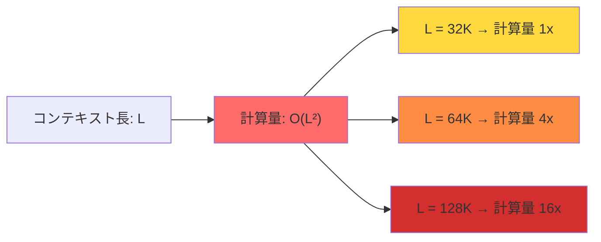

### DSAによる解決

DSAは計算複雑度を劇的に削減します。従来の $O(L^2)$ から $O(Lk)$ へと変換することで、線形スケーリングに近い特性を実現しています：

$$
\text{従来の計算量: } O(L^2) \quad \rightarrow \quad \text{DSAの計算量: } O(Lk)
$$

ここで $k$ は固定値（2,048トークン）であり、コンテキスト長 $L$ に依存しません。この革新により、$L$ が増加しても計算量は線形的にしか増えないため、長いコンテキストでも効率的な処理が可能になります。

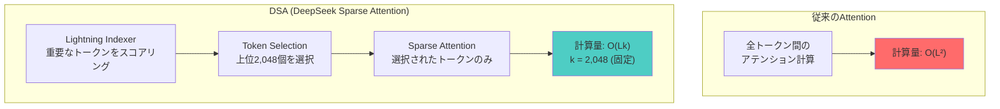

## 2. DSAの仕組み

### アーキテクチャの全体像

DSAは3つの主要コンポーネントから構成されています。最初のLightning Indexerが各トークンの重要度をスコアリングし、次にToken Selectionが上位kトークンを選択し、最後にSparse Attentionが選択されたトークンのみで注意機構を計算します。

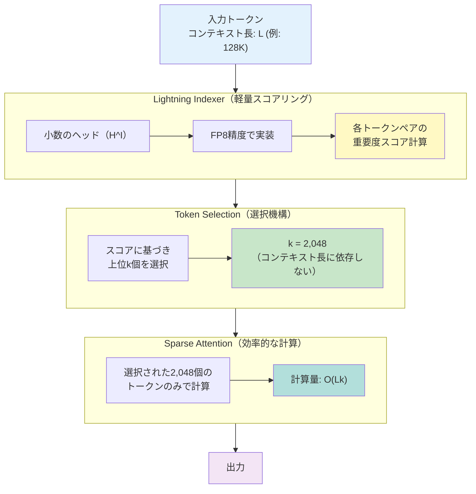

### 詳細な処理フロー

#### Step 1: Lightning Indexer - 重要度スコアの計算

Lightning Indexerは、各クエリトークン $\mathbf{h}_t \in \mathbb{R}^d$ と先行トークン $\mathbf{h}_s \in \mathbb{R}^d$ の間の関連性をスコアリングします。このスコア $I_{t,s}$ は以下の数式で計算されます：

$$
I_{t,s} = \sum_{j=1}^{H^I} w_{t,j}^I \cdot \text{ReLU}\left(\mathbf{q}_{t,j}^I \cdot \mathbf{k}_s^I\right)
$$

ここで、$H^I$ はIndexerのヘッド数を表します。各項について詳しく見ていきましょう。$\mathbf{q}_{t,j}^I \in \mathbb{R}^{d^I}$ はクエリトークン $\mathbf{h}_t$ から導出されるクエリベクトル、$\mathbf{k}_s^I \in \mathbb{R}^{d^I}$ は先行トークン $\mathbf{h}_s$ から導出されるキーベクトル、そして $w_{t,j}^I \in \mathbb{R}$ は各ヘッドの重みを表します。

この設計には3つの重要な特徴があります。第一に、少数のヘッド（$H^I$）のみを使用することで計算量を抑制しています。第二に、FP8（8ビット浮動小数点）精度で実装することで、メモリ帯域幅を削減し高速化を実現しています。第三に、活性化関数としてReLUを採用することで、GPUでの計算スループットを最大化しています。ReLUは計算が単純であるため、ハードウェアでの実装効率が非常に高いのです。

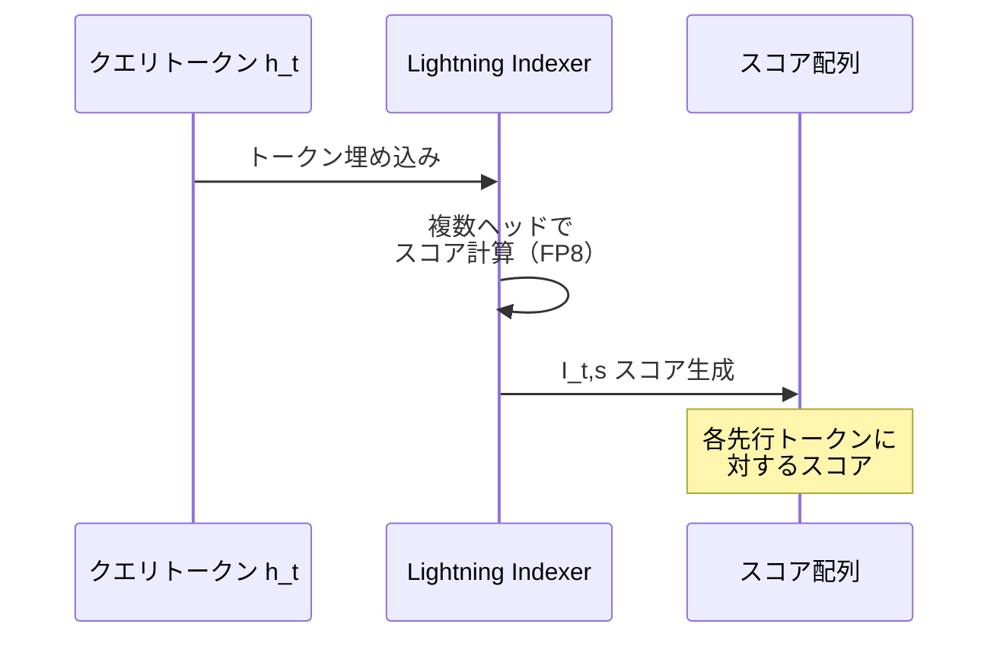

#### Step 2: Token Selection - 上位トークンの選択

計算された重要度スコア $\{I_{t,s}\}$ に基づいて、上位 $k$ 個のKey-Valueエントリを選択します。選択後のアテンション出力 $\mathbf{u}_t$ は以下のように計算されます：

$$
\mathbf{u}_t = \text{Attn}\left(\mathbf{h}_t, \left\{\mathbf{c}_s \mid I_{t,s} \in \text{Top-k}(I_{t,:})\right\}\right)
$$

ここで $\mathbf{c}_s$ は選択されたKey-Valueエントリを表します。この式の意味するところは、クエリトークン $\mathbf{h}_t$ が、インデックススコアが上位 $k$ 個に入る先行トークンのKey-Valueエントリとのみアテンション計算を行うということです。

重要なのは、$k = 2,048$ という値が固定されており、コンテキスト長 $L$ に関係なく一定であることです。これにより、たとえコンテキスト長が128,000トークンであっても、実際のアテンション計算は2,048トークンのみで行われます。この設計により、計算複雑度が $O(L \cdot k) = O(L \cdot 2048)$ となり、実質的に線形スケーリングを実現しています。

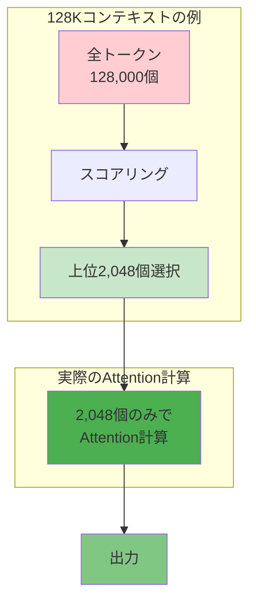

### 数学的な計算量の詳細分析

従来のアテンション機構では、各クエリトークンが全ての先行トークンとの関係を計算する必要があります。位置 $t$ のトークンに対して、$t$ 個の先行トークンとの内積計算が必要になります。全体では以下のような計算量になります：

$$
\text{総計算量} = \sum_{t=1}^{L} t = \frac{L(L+1)}{2} \approx O(L^2)
$$

一方、DSAでは各クエリトークンが固定数 $k$ のトークンとのみ計算を行います：

$$
\text{DSAの総計算量} = \sum_{t=1}^{L} \min(t, k) \approx L \cdot k = O(Lk)
$$

$k = 2,048$ という固定値を使用するため、$L$ が大きくなっても計算量は線形的にしか増加しません。

## 3. コスト削減の実績

### H800 GPU上での実測値

実際のH800 GPUクラスター上での測定結果を見ると、DSAの効果は顕著です。GPUレンタル価格を1時間あたり2 USDとして計算した場合、128Kコンテキストでのトークン処理コストは大幅に削減されています。

プレフィリング（prefilling）フェーズでは、DeepSeek-V3.1が100万トークンあたり0.65ドルだったのに対し、DeepSeek-V3.2は0.35ドルとなり、約46%のコスト削減を実現しています。さらに劇的なのはデコーディング（decoding）フェーズで、2.4ドルから0.8ドルへと約67%もの削減を達成しています。

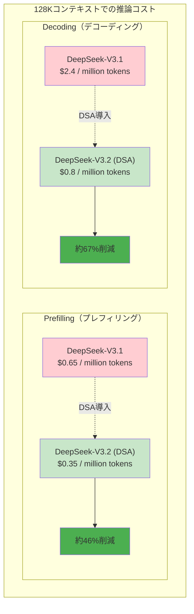

### トークン位置ごとのコスト推移

コンテキスト内のトークン位置が増加するにつれて、従来のAttentionでは計算コストが2次関数的に増加します。一方、DSAではほぼ線形的な増加に抑えられています。

```mermaid
xychart-beta
    title "推論コストの比較（トークン位置による変化）"
    x-axis "トークン位置" [0, 32K, 64K, 96K, 128K]
    y-axis "相対コスト" 0 --> 16
    line [1, 4, 9, 13, 16] "V3.1 (O(L²))"
    line [1, 2, 3, 4, 5] "V3.2 DSA (O(Lk))"
```

### 具体的な計算例で理解する

32Kコンテキストの場合を考えてみましょう。従来のアテンションでは $32K \times 32K = 1,024M$ の計算が必要ですが、DSAでは $32K \times 2K = 64M$ の計算で済みます。これは約93.75%の削減率です。

128Kコンテキストではさらに顕著で、従来の $128K \times 128K = 16,384M$ 計算に対し、DSAは $128K \times 2K = 256M$ で済むため、98.44%もの削減を実現しています。

削減率を数式で表すと：

$$
\text{削減率} = 1 - \frac{L \cdot k}{L^2} = 1 - \frac{k}{L}
$$

$L$ が大きくなるほど削減率は100%に近づきます。たとえば $L = 128K$ で $k = 2K$ の場合：

$$
\text{削減率} = 1 - \frac{2K}{128K} = 1 - 0.015625 = 0.984375 = 98.44\%
$$

### 性能への影響

驚くべきことに、このような大幅なコスト削減にもかかわらず、性能は維持されています。それどころか、一部のベンチマークでは向上さえしています。これは、重要なトークンのみに焦点を当てることで、むしろノイズが減少したためと考えられます。全てのトークンを同等に扱うのではなく、本当に重要な情報に計算リソースを集中させることで、効率と精度の両立を実現しているのです。

## 4. トレーニングプロセス

### 2段階学習の必要性

DSAの導入には慎重に設計された2段階のトレーニングプロセスが必要でした。単純にスパースアテンションを導入するだけでは、モデルの性能が大きく劣化してしまう可能性があります。そのため、段階的に学習を進める戦略が採用されました。

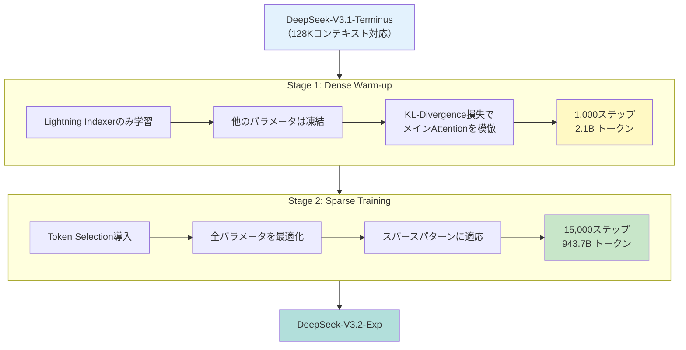

### Stage 1: Dense Warm-up（密な初期化）

第一段階の目的は、Lightning IndexerがメインAttentionの動作パターンを学習することです。この段階では、密なAttentionを維持したまま、Indexerのパラメータのみを学習します。他のモデルパラメータは全て凍結され、更新されません。

この学習にはKL-Divergence（Kullback-Leibler Divergence）損失が使用されます。具体的には、位置 $t$ のクエリトークンに対して、まずメインアテンションの全ヘッドにわたるアテンションスコアを合計し、L1正規化によって確率分布 $p_{t,:} \in \mathbb{R}^t$ を作成します。Indexerはこの分布を模倣するように学習されます：

$$
\mathcal{L}^I = \sum_{t} \mathbb{D}_{\text{KL}}\left(p_{t,:} \parallel \text{Softmax}(I_{t,:})\right)
$$

KL-Divergenceは2つの確率分布の差異を測定する指標であり、以下のように定義されます：

$$
\mathbb{D}_{\text{KL}}(P \parallel Q) = \sum_{i} P(i) \log \frac{P(i)}{Q(i)}
$$

この損失を最小化することで、Indexerの出力分布 $\text{Softmax}(I_{t,:})$ がターゲット分布 $p_{t,:}$ に近づいていきます。学習率は $10^{-3}$ と比較的高めに設定され、わずか1,000ステップ（合計2.1Bトークン）という短期間で初期化を完了します。

### Stage 2: Sparse Training（疎な学習）

第二段階では、Token Selection機構を導入し、モデル全体をスパースなアテンションパターンに適応させます。この段階では全てのモデルパラメータが最適化の対象となります。

Indexerの学習も継続されますが、損失関数が修正されます。今度は、選択されたトークン集合 $\mathcal{S}_t = \{s \mid I_{t,s} \in \text{Top-k}(I_{t,:})\}$ のみを考慮します：

$$
\mathcal{L}^I = \sum_{t} \mathbb{D}_{\text{KL}}\left(p_{t,\mathcal{S}_t} \parallel \text{Softmax}(I_{t,\mathcal{S}_t})\right)
$$

ここで $p_{t,\mathcal{S}_t}$ と $I_{t,\mathcal{S}_t}$ は、それぞれ選択されたトークン集合 $\mathcal{S}_t$ に対応する要素のみを含む部分ベクトルです。

重要な実装詳細として、Indexerの入力は計算グラフから切り離され（detach）、独立して最適化されます。Indexerは損失 $\mathcal{L}^I$ のみから訓練信号を受け取り、メインモデルは言語モデリング損失のみに基づいて最適化されます。この分離により、両者の学習が安定します。

この段階では学習率を $7.3 \times 10^{-6}$ に下げ、各クエリトークンに対して $k = 2,048$ 個のKey-Valueトークンを選択します。15,000ステップ（合計943.7Bトークン）という大規模な学習により、モデルはスパースパターンに完全に適応します。

## 5. DSAの技術的な工夫

### MLA (Multi-head Latent Attention) との統合

DeepSeek-V3.2は、以前のバージョンから導入されているMLA（Multi-head Latent Attention）とDSAを統合しています。MLAは、複数のアテンションヘッドのKey-Value情報を低次元の潜在ベクトルに圧縮することで、メモリ効率を向上させる技術です。

DSAをMLAに統合する際、MQA（Multi-Query Attention）モードが採用されました。このモードでは、各潜在ベクトル（MLAのKey-Valueエントリ）が、クエリトークンの全てのクエリヘッドで共有されます。この設計により、カーネルレベルでの実装効率が向上します。なぜなら、各Key-Valueエントリを複数のクエリで共有することで、メモリアクセスパターンが最適化されるためです。

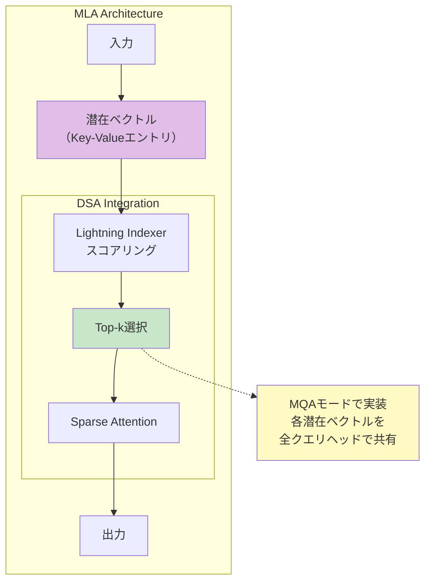

### 短いコンテキストでの最適化

DSAは長いコンテキストで特に効果的ですが、短いシーケンスでは必ずしも最適ではありません。そこで、短いシーケンス用にMasked MHA（Multi-Head Attention）モードが実装されています。このモードは、DSAの動作をシミュレートしつつ、短いコンテキストでの計算効率を最大化します。コンテキスト長に応じて、システムは自動的に最適なモードを選択します。

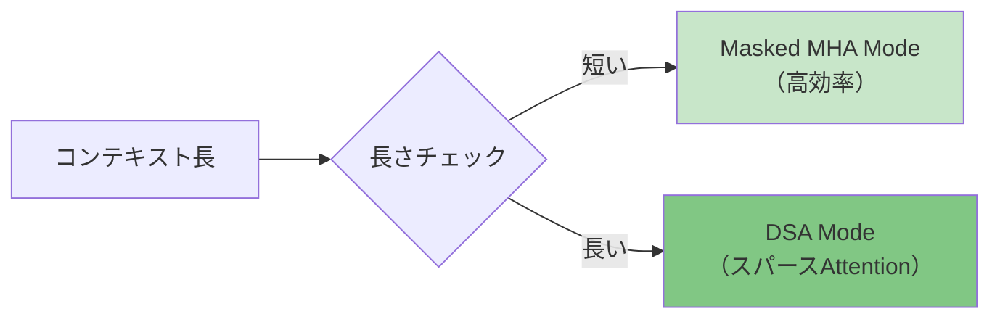

## 6. 実世界での影響

### なぜこれが重要か

OpenAIの共同創業者であるIlya Sutskeverは最近のポッドキャストで重要な指摘をしています。彼によれば、データとコンピュートのスケーリングには物理的な限界があります。より多くのGPUを投入することはできても、自然なデータは有限です。次の大きな飛躍は、単なるスケーリングではなく、アーキテクチャのブレークスルーと研究から来るというのです。

DSAはまさにこの方向性を示す技術です。ハードウェアを増やすのではなく、アルゴリズムを根本的に改善することで、効率と性能の両立を実現しています。これは、今後の大規模言語モデル開発における重要な指針となるでしょう。

### 性能比較

DeepSeek-V3.2は、GPT-5と同等の性能を達成しています。数学タスクのAIME 2025では93.1%、コーディングタスクのLiveCodeBenchでは83.3%という高いスコアを記録しています。さらにエージェントタスクにおいても、Terminal Bench 2.0で46.4%、SWE-Verifiedで73.1%と、実用的なレベルに達しています。

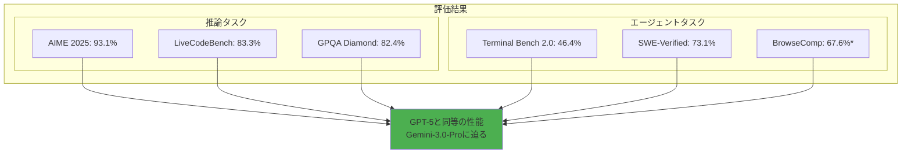

## 7. まとめ

### DSAの革新性

DSAは複数の次元で革新をもたらしています。計算効率の面では、$O(L^2)$ から $O(Lk)$ への変換により、コストを46-67%削減しながら長いコンテキストに対応しています。性能の面では、品質を犠牲にすることなく、むしろ一部のベンチマークで向上を達成し、金メダル級の性能を実現しています。スケーラビリティの面では、固定値 $k = 2,048$ を使用することでコンテキスト長に依存しない実用的な実装を可能にしています。学習方法の面では、2段階トレーニングとKL-Divergenceの活用により、安定した収束を実現しています。

```mermaid
mindmap
  root((DSA<br/>革新性))
    計算効率
      O(L²) → O(Lk)
      コスト46-67%削減
      長いコンテキスト対応
    性能維持
      品質低下なし
      一部で向上
      金メダル級性能
    スケーラビリティ
      固定k=2,048
      コンテキスト長に依存しない
      実用的な実装
    学習方法
      2段階トレーニング
      KL-Divergence活用
      安定した収束
```

### 重要ポイント

DeepSeek-V3.2において、DSAは唯一のアーキテクチャ変更として導入されました。この一つの変更だけで、推論コストを46-67%削減しながら、品質を犠牲にすることなく効率化を実現しています。実際のサービスで稼働中の実証済みの技術であり、長いコンテキストを扱う大規模言語モデルの未来を示しています。

### 今後の展望

DSAは、スパースアテンションを実用化する重要なマイルストーンです。今後の方向性として、さらなるトークン効率の改善が期待されます。また、より広範な知識を獲得するためのプレトレーニングの拡大も重要です。複雑なタスクでのさらなる性能向上により、オープンソースモデルとクローズドソースモデルの性能差を埋めていくことが可能になるでしょう。

---

## 参考文献

[DeepSeek-V3.2 論文](https://arxiv.org/html/2512.02556v1)では、DSAの詳細な技術仕様と評価結果が公開されています。H800 GPU上での実測データにより、実環境での効果が実証されています。各種ベンチマーク評価結果は、数学、コーディング、エージェントタスクなど多岐にわたる分野での性能を示しています。

## 補足: 計算複雑度の比較

### 具体例で理解する

32Kコンテキストの場合を詳しく見てみましょう。従来のアテンションでは、$32,768 \times 32,768 = 1,073,741,824$ 回の計算が必要です。一方、DSAでは $32,768 \times 2,048 = 67,108,864$ 回の計算で済みます。計算削減率を求めると：

$$
\text{削減率}_{32K} = 1 - \frac{67,108,864}{1,073,741,824} = 1 - 0.0625 = 0.9375 = 93.75\%
$$

128Kコンテキストではさらに劇的です。従来の $131,072 \times 131,072 = 17,179,869,184$ 回に対し、DSAは $131,072 \times 2,048 = 268,435,456$ 回です：

$$
\text{削減率}_{128K} = 1 - \frac{268,435,456}{17,179,869,184} = 1 - 0.015625 = 0.984375 = 98.44\%
$$

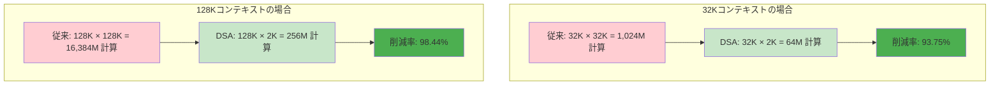

このように、コンテキストが長くなるほど、DSAの効果はより顕著になります。削減率の一般式 $1 - \frac{k}{L}$ からわかるように、$L$ が無限大に近づくと削減率は100%に漸近します。これは、DSAが長いコンテキストに対して特に有効であることを数学的に保証しています。
