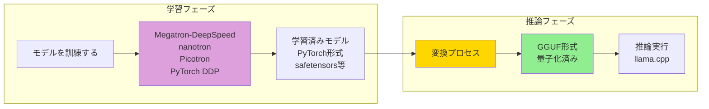
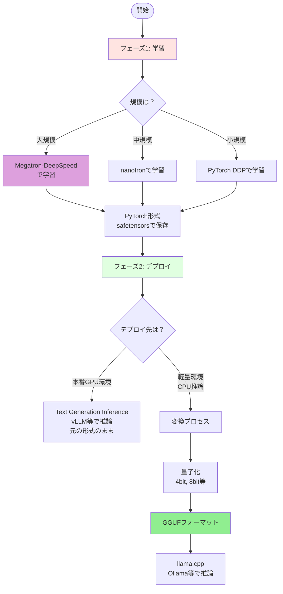
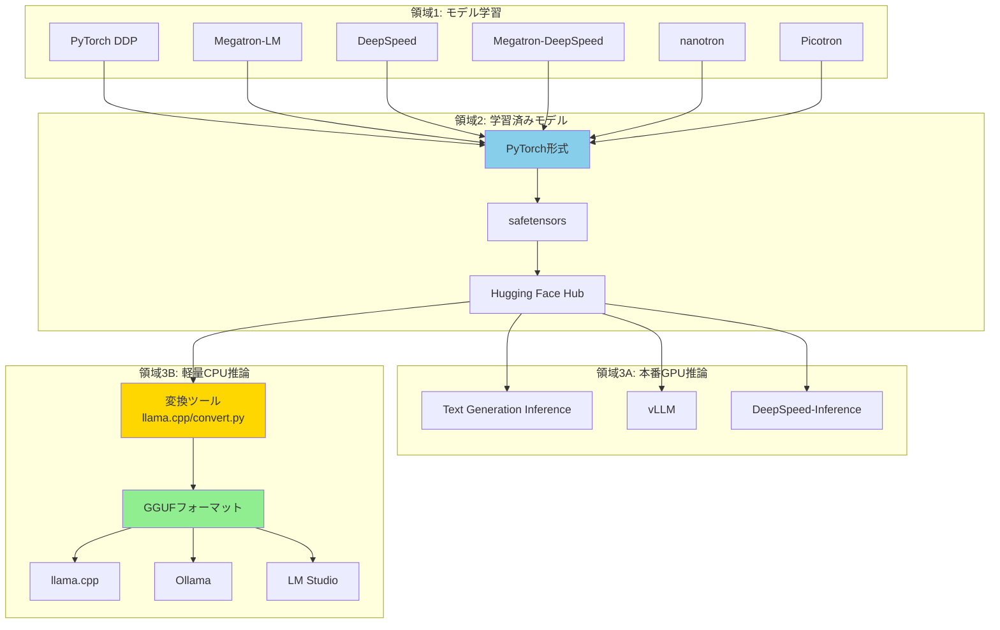

素晴らしい質問です！GGUFは**全く異なる目的**のものです。

## GGUF vs 学習フレームワークの関係

### 重要な区別：学習 vs 推論



### GGUFとは

**GGUF (GPT-Generated Unified Format)** は：

- **推論専用**のモデルフォーマット
- **llama.cpp** プロジェクト用に設計
- **量子化**（8bit, 4bit, 2bitなど）されたモデルを格納
- **CPU推論**に最適化（GPUも使える）
- モバイル、ノートPC、サーバーなど幅広く使用可能

**特徴**：
- ✅ 推論が軽量・高速
- ✅ メモリ使用量が少ない
- ✅ 特別なGPU不要（CPUで動く）
- ❌ 学習・ファインチューニングには使えない

### 完全なライフサイクル



### 具体例：Llama-3の場合

#### 1️⃣ 学習フェーズ
```
Meta社がMegatron-DeepSpeedで学習
↓
学習済みモデルを保存（safetensors形式）
↓
Hugging Face Hubに公開
```

#### 2️⃣ 配布・推論フェーズ

**パターンA: 本番環境（高性能GPU）**
```
元の形式のまま使用
↓
vLLM, TGI, DeepSpeed-Inference等で推論
↓
高速だがGPUメモリが必要
```

**パターンB: 軽量環境（CPU/小型GPU）**
```
GGUFに変換 + 量子化
↓
llama.cpp, Ollama, LM Studio等で推論
↓
遅いがメモリ使用量が少ない
```

### 関係性の全体図



### 実際の使い分け

| ユースケース | 使用技術 | 理由 |
|-------------|---------|------|
| **モデルを学習する** | Megatron-DeepSpeed, nanotron, Picotron | 大規模分散学習が必要 |
| **クラウドでAPI提供** | vLLM, TGI（元の形式） | 最高性能、GPUが豊富 |
| **ローカルPC実行** | GGUF + llama.cpp | CPU/小型GPUで動く |
| **モバイルアプリ** | GGUF（4bit量子化） | 極小メモリで動く |
| **エッジデバイス** | GGUF + Ollama | 組み込み環境対応 |

### まとめ

**GGUF ≠ 学習フレームワーク**

GGUFは：
- 学習後の**最終成果物**
- 推論を軽量化するための**配布形式**
- Megatron等で学習したモデルを**変換して使う**

学習フレームワーク（Megatron等）は：
- モデルを**作る**ためのツール
- 学習が終わったら役目終了
- その後GGUFに変換してデプロイ可能

**つまり別々の目的を持つ補完的な技術です！**

この情報も含めて整理しましょうか？