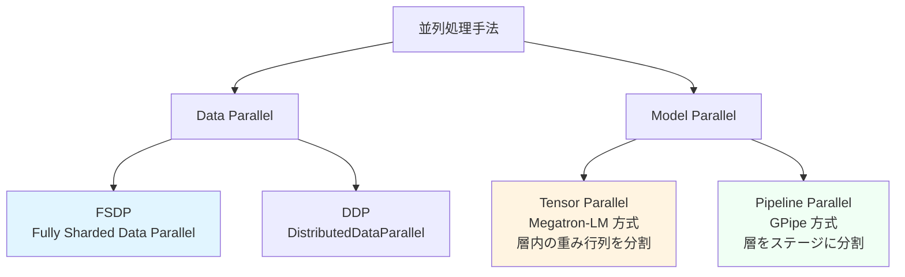
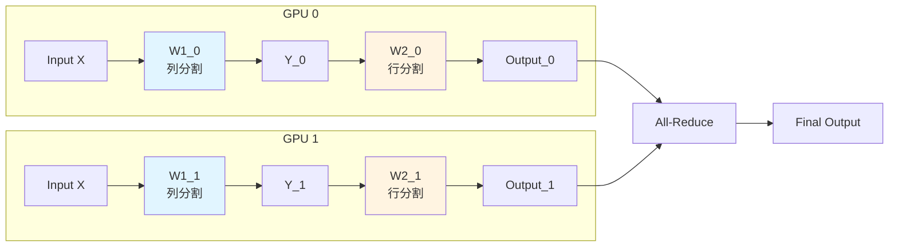
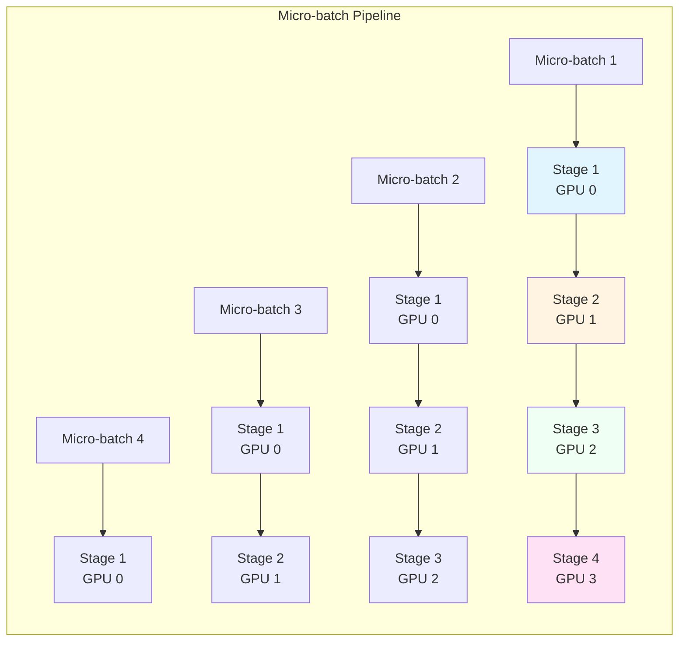

https://zenn.dev/turing_motors/articles/0e6e2baf72ebbc


# 分散学習における並列処理手法の概要

前章で説明した通り、大規模基盤モデルの学習には膨大なコンピュート、ネットワーク、ストレージが必要です。単一の GPU では処理しきれないモデルサイズやバッチサイズに対応するため、複数の並列処理手法を組み合わせて使用します。本章では、各並列処理手法の動作原理とインフラストラクチャ要件を詳しく整理します。



主要な並列処理手法は以下の 2 つに大別されます。

- **Data Parallel (DP)**: 複数の GPU で異なるデータバッチを処理し、勾配を集約する方式
  - FSDP (Fully Sharded Data Parallel): Parameters、Gradients、Optimizer States をシャーディング
  - DDP (DistributedDataParallel): 各 GPU がモデルの完全なコピーを保持

- **Model Parallel (MP)**: モデル自体を複数の GPU に分割する方式
  - Tensor Parallel (TP): 個々の層の重み行列を複数の GPU に分割
  - Pipeline Parallel (PP): モデルを複数のステージに分割し、異なる GPU で実行

これらを組み合わせた 2D Parallel (TP + FSDP) や 3D Parallel (TP + PP + FSDP) も実用化されています。

# Data Parallel: FSDP (Fully Sharded Data Parallel)

## FSDP の動作原理

FSDP は PyTorch が提供する Fully Sharded Data Parallel の実装で、ZeRO (Zero Redundancy Optimizer) Stage 3 の概念に基づいています。従来の Data Parallel (DDP) では各 GPU がモデルの完全なコピーを保持していましたが、FSDP ではモデルのパラメータ、勾配、オプティマイザ状態をすべて複数の GPU に分散します。

FSDP の詳細は [PyTorch 公式ドキュメント](https://pytorch.org/docs/stable/fsdp.html) および [Getting Started with FSDP](https://pytorch.org/tutorials/intermediate/FSDP_tutorial.html) に記載されています。

```mermaid
sequenceDiagram
    participant GPU0 as GPU 0
    participant GPU1 as GPU 1
    participant GPU2 as GPU 2
    participant GPU3 as GPU 3
    
    Note over GPU0,GPU3: Forward Pass
    GPU0->>GPU0,GPU1,GPU2,GPU3: All-Gather<br/>パラメータを収集
    GPU0->>GPU0: Forward 計算
    GPU0->>GPU0: パラメータを解放
    
    Note over GPU0,GPU3: Backward Pass
    GPU0->>GPU0,GPU1,GPU2,GPU3: All-Gather<br/>パラメータを再収集
    GPU0->>GPU0: Gradient 計算
    GPU0->>GPU0,GPU1,GPU2,GPU3: Reduce-Scatter<br/>勾配を分散
    GPU0->>GPU0: パラメータを解放
```

### メモリ削減のメカニズム

FSDP が削減するメモリは以下の 3 つです。

| 要素 | 従来の DDP | FSDP | 削減率 |
|------|-----------|------|--------|
| **Parameters** | 全 GPU で完全コピー | シャード分のみ | 1/N |
| **Gradients** | 全 GPU で完全コピー | シャード分のみ | 1/N |
| **Optimizer States** | 全 GPU で完全コピー | シャード分のみ | 1/N |

N は FSDP の world size (GPU 数) です。例えば 8 GPU で FSDP を使用すると、各 GPU が保持するメモリは理論上 1/8 になります。

Llama 3 70B (70B パラメータ) を BF16 精度で学習する場合の具体例を示します。

**従来の DDP (各 GPU が完全コピーを保持)**:
- Parameters: 140GB (70B × 2 bytes)
- Gradients: 140GB
- Optimizer States (Adam): 280GB (momentum + variance)
- **合計: 560GB / GPU**

**FSDP with 8 GPUs (1/8 にシャーディング)**:
- Parameters: 17.5GB (140GB / 8)
- Gradients: 17.5GB (140GB / 8)
- Optimizer States: 35GB (280GB / 8)
- **合計: 70GB / GPU** (8 倍のメモリ削減)

この削減により、H100 80GB GPU で 70B モデルの学習が可能になります。

## FSDP のインフラストラクチャ要件

### 1. GPU メモリ容量の考慮

FSDP を使用する場合、各 GPU が保持すべきメモリは以下の式で概算できます。

**必要メモリ = (Parameters + Gradients + Optimizer States) / N + Activations**

Activations (活性化関数の中間値) はシャーディングされないため、別途考慮が必要です。Activations のサイズは、バッチサイズ、シーケンス長、隠れ層のサイズに依存します。

典型的な Transformer モデルでの Activations メモリは以下の式で近似できます。

**Activations ≈ batch_size × seq_length × hidden_size × num_layers × 16**

係数 16 は、Self-Attention と Feed-Forward の中間テンソルを考慮した経験的な値です。

### 2. ネットワーク帯域幅の要件

FSDP では、forward と backward の各ステップで All-Gather と Reduce-Scatter を実行します。これらの通信量は以下の通りです。

**Forward All-Gather 通信量**: Parameters × (N-1) / N  
**Backward Reduce-Scatter 通信量**: Gradients × (N-1) / N

Llama 3 70B (140GB の Parameters/Gradients) を 8 GPU で学習する場合の 1 iteration あたりの通信量は以下の通りです。

- Forward All-Gather: 140GB × 7/8 = 122.5GB
- Backward Reduce-Scatter: 140GB × 7/8 = 122.5GB
- **合計: 245GB / iteration**

iteration time を 1 秒とすると、必要な帯域幅は **245GB/s = 1,960Gbps** となります。

AWS の P5 インスタンス (8x H100) では、EFA (Elastic Fabric Adapter) により 3,200Gbps の帯域幅を提供しているため、十分に対応可能です。

### 3. FSDP の設定パラメータ決定

#### reshard_after_forward の選択

`reshard_after_forward` は forward 後にパラメータを解放するかどうかを制御します。

- **True**: forward 後にパラメータを解放し、backward で再度 All-Gather する
  - メモリ使用量: 最小
  - 通信量: 増加 (backward で追加の All-Gather)
  - 推奨: 中間層、メモリが逼迫している場合
  
- **False**: forward 後もパラメータを保持し、backward での All-Gather を省略
  - メモリ使用量: 増加
  - 通信量: 削減
  - 推奨: ルートモジュール、メモリに余裕がある場合

#### シャーディング戦略の選択

FSDP では以下のシャーディング戦略を選択できます。

| 戦略 | 説明 | メモリ削減 | 通信量 |
|------|------|-----------|--------|
| **FULL_SHARD** | Parameters、Gradients、Optimizer States をすべてシャード | 最大 | 高い |
| **SHARD_GRAD_OP** | Gradients と Optimizer States のみシャード | 中程度 | 中程度 |
| **NO_SHARD** (DDP) | シャードしない | なし | 低い |
| **HYBRID_SHARD** | ノード内 FSDP、ノード間 DDP | 中程度 | 低い |

**HYBRID_SHARD** は、ノード内通信 (NVLink) を活用し、ノード間通信 (EFA) を削減する戦略です。例えば 8-GPU ノード × 4 台 (32 GPU) の構成では、ノード内で FSDP、ノード間で DDP を適用することで、通信効率を最適化できます。

#### Mixed Precision の設定

Mixed Precision により、計算とメモリをさらに最適化できます。

```python
from torch.distributed.fsdp import MixedPrecision

mp_policy = MixedPrecision(
    param_dtype=torch.bfloat16,      # パラメータを BF16 で保持
    reduce_dtype=torch.float32,      # 勾配の Reduce は FP32
    buffer_dtype=torch.bfloat16,     # バッファを BF16
)
```

**BF16 (bfloat16)** は FP16 よりも数値範囲が広く、Loss Scaling が不要なため、大規模モデル学習で推奨されます。

# Tensor Parallel: Megatron-LM 方式

## Tensor Parallel の動作原理

Tensor Parallel (TP) は、個々の層の重み行列を複数の GPU に分割する手法です。[Megatron-LM 論文](https://arxiv.org/abs/1909.08053) で提案され、Transformer の Feed-Forward 層と Self-Attention 層に適用されます。

PyTorch の Tensor Parallel API は [公式ドキュメント](https://pytorch.org/tutorials/intermediate/TP_tutorial.html) で詳しく説明されています。

### Feed-Forward 層への適用

Feed-Forward 層は 2 つの線形層から構成されます。

**Y = GeLU(X × W1)**  
**Output = Y × W2**

Tensor Parallel では、W1 を列方向、W2 を行方向に分割します。



この分割により、各 GPU は重み行列の 1/N のみを保持し、計算も 1/N になります。最後に All-Reduce で結果を集約します。

### Self-Attention 層への適用

Self-Attention 層の Q, K, V 射影と Output 射影に Tensor Parallel を適用します。

**Q, K, V = X × Wq, X × Wk, X × Wv** (列方向分割)  
**Output = Attention(Q, K, V) × Wo** (行方向分割)

Attention の計算は各 GPU で独立して実行され、最後の Wo で All-Reduce が発生します。

## Tensor Parallel のインフラストラクチャ要件

### 1. GPU メモリ削減の見積もり

Tensor Parallel により削減されるメモリは、主にモデルパラメータです。

**Parameters メモリ削減率: 1/N**

ただし、Activations はシャーディングされないため、バッチサイズが大きい場合は Activations がボトルネックになる可能性があります。

Llama 3 70B を TP=8 で実行する場合:
- Parameters: 140GB / 8 = **17.5GB / GPU**
- Gradients: 140GB / 8 = **17.5GB / GPU**
- Optimizer States: 280GB (FSDP などと組み合わせない場合は削減されない)

Tensor Parallel 単体では Optimizer States は削減されないため、FSDP との併用が推奨されます。

### 2. ネットワーク帯域幅の要件

Tensor Parallel では、各層の forward と backward で All-Reduce が発生します。

**通信量 per layer**: Hidden_size × Batch_size × Seq_length × 2 bytes

Llama 3 70B (hidden_size=8192, 80 layers) をバッチサイズ 8、シーケンス長 4096 で学習する場合:

- 1 層あたりの通信量: 8192 × 8 × 4096 × 2 bytes = 536MB
- 80 層での合計通信量: 536MB × 80 = **42.9GB / iteration**

TP は通信が頻繁に発生するため、**高速なノード内通信 (NVLink)** が不可欠です。NVIDIA H100 は NVLink 4.0 (900GB/s) を提供しており、TP に最適です。

### 3. Tensor Parallel のサイズ決定

TP のサイズは以下の制約から決定されます。

#### GPU メモリ制約

**TP_size ≥ (Parameters + Gradients) / (GPU_memory - Activations)**

Llama 3 70B (280GB) を H100 80GB で学習する場合、Activations を 20GB と仮定すると:

**TP_size ≥ 280GB / (80GB - 20GB) = 4.67 → 8 GPU**

#### ノード構成との整合性

TP はノード内通信を前提とするため、**TP サイズはノード内の GPU 数の約数**にすべきです。

- 8 GPU/ノード: TP=1, 2, 4, 8
- 4 GPU/ノード: TP=1, 2, 4

#### 計算効率とのトレードオフ

TP サイズが大きすぎると、通信オーバーヘッドが増加し、GPU 利用率が低下します。一般的に、**TP=8** が実用的な上限です。

# Pipeline Parallel: GPipe 方式

## Pipeline Parallel の動作原理

Pipeline Parallel (PP) は、モデルを複数のステージに分割し、各ステージを異なる GPU に配置します。各ステージは、前のステージからの出力を受け取り、次のステージに出力を渡します。

[GPipe 論文](https://arxiv.org/abs/1811.06965) および [PyTorch 公式ドキュメント](https://pytorch.org/docs/stable/distributed.pipelining.html) で詳細が説明されています。



### Micro-batch によるパイプライン効率化

Pipeline Parallel では、ミニバッチを複数の Micro-batch に分割し、各ステージで並列処理します。これにより、GPU のアイドル時間 (bubble) を削減します。

**Bubble Time ≈ (P - 1) / (M + P - 1)**

- P: パイプラインのステージ数
- M: Micro-batch の数

例えば、P=4, M=8 の場合:
**Bubble Time ≈ 3 / 11 = 27.3%**

Micro-batch 数を増やすことで bubble を削減できますが、Micro-batch サイズが小さすぎると GPU 利用率が低下します。

## Pipeline Parallel のインフラストラクチャ要件

### 1. GPU メモリ削減の見積もり

Pipeline Parallel により、各 GPU は全体の 1/P のレイヤーのみを保持します。

**Parameters メモリ削減率: 1/P**

ただし、Activations は各 Micro-batch ごとに保持する必要があるため、メモリ使用量は増加します。

**Activations メモリ = Activations_per_microbatch × M**

### 2. ネットワーク帯域幅の要件

Pipeline Parallel では、ステージ間で Activations を転送します。

**通信量 per microbatch**: Hidden_size × Batch_size_per_microbatch × Seq_length × 2 bytes

Llama 3 70B をバッチサイズ 8、M=8 (1 microbatch = 1 sample) で学習する場合:

- 1 microbatch あたりの通信量: 8192 × 1 × 4096 × 2 bytes = 67MB
- 8 microbatch での合計: 67MB × 8 = **536MB / iteration**

Pipeline Parallel の通信は **ノード間通信 (EFA)** で実行されるため、低レイテンシかつ高帯域幅のネットワークが必要です。

### 3. Pipeline Parallel のサイズとスケジュール決定

#### ステージ数 (P) の決定

ステージ数は、GPU メモリ制約と bubble オーバーヘッドのトレードオフで決定します。

**P ≤ GPU_memory / (Parameters_per_stage + Activations_per_stage)**

一般的に、**P=2~8** が実用的です。

#### Micro-batch 数 (M) の決定

Micro-batch 数は、bubble とメモリのトレードオフで決定します。

**M ≥ 4 × P** (経験的な目安)

例えば P=4 の場合、M ≥ 16 が推奨されます。

#### スケジュールの選択

Pipeline Parallel では、以下のスケジュールが利用可能です。

| スケジュール | 説明 | Bubble | メモリ |
|-------------|------|--------|--------|
| **GPipe** | シンプルな forward → backward | 高い | 低い |
| **1F1B** (1-Forward-1-Backward) | forward と backward を交互に実行 | 低い | 中程度 |
| **Interleaved 1F1B** | 複数のステージを interleave | 最低 | 高い |

**1F1B** が最も一般的に使用されます。

# 2D Parallel と 3D Parallel

## 2D Parallel: Tensor Parallel + FSDP

Tensor Parallel と FSDP を組み合わせることで、両方のメリットを享受できます。

- **Tensor Parallel (TP)**: ノード内通信 (NVLink) を活用し、層内の重み行列を分割
- **FSDP**: ノード間通信 (EFA) を活用し、残りのメモリを分散

PyTorch Lightning の [2D Parallel 例](https://lightning.ai/docs/pytorch/stable/advanced/model_parallel/tp_fsdp.html) が参考になります。

```python
from torch.distributed.device_mesh import init_device_mesh
from torch.distributed.tensor.parallel import parallelize_module, ColwiseParallel, RowwiseParallel
from torch.distributed._composable.fsdp.fully_shard import fully_shard

# 2D Device Mesh: [Data Parallel, Tensor Parallel]
device_mesh = init_device_mesh("cuda", (4, 8))  # 4 DP groups × 8 TP GPUs
tp_mesh = device_mesh["tensor_parallel"]
dp_mesh = device_mesh["data_parallel"]

# Tensor Parallel を適用
plan = {
    "w1": ColwiseParallel(),
    "w2": RowwiseParallel(),
}
parallelize_module(model, tp_mesh, plan)

# FSDP を適用
fully_shard(model, mesh=dp_mesh)
```

### 2D Parallel の設定決定

32 GPU (8-GPU ノード × 4 台) で Llama 3 70B を学習する場合の推奨設定:

- **TP=8**: ノード内で重み行列を分割 (NVLink 活用)
- **DP=4**: ノード間で FSDP を適用 (EFA 活用)

この構成により、ノード内の高速通信と、ノード間の効率的なメモリ分散を両立します。

## 3D Parallel: Tensor Parallel + Pipeline Parallel + FSDP

さらに大規模なモデル (Llama 3.1 405B など) では、3D Parallel を使用します。

- **Tensor Parallel (TP)**: ノード内で層内の重み行列を分割
- **Pipeline Parallel (PP)**: ノード間でレイヤーをステージに分割
- **FSDP**: 残りのメモリを分散

### 3D Parallel の設定決定

1024 GPU (8-GPU ノード × 128 台) で Llama 3.1 405B を学習する場合の推奨設定:

- **TP=8**: ノード内で重み行列を分割
- **PP=16**: 16 ステージに分割 (各ステージ = 8 ノード)
- **DP=8**: 残りの 8 方向で FSDP を適用

合計: 8 (TP) × 16 (PP) × 8 (DP) = **1024 GPU**

# インフラストラクチャ要件のまとめ

## 並列処理手法ごとのインフラ要件

| 手法 | 主な通信 | 通信場所 | 帯域幅要件 | メモリ削減 | 推奨用途 |
|------|---------|---------|-----------|-----------|----------|
| **FSDP** | All-Gather<br/>Reduce-Scatter | ノード間 | 高い<br/>(3,200Gbps) | Parameters<br/>Gradients<br/>Optimizer States | 大規模モデル<br/>ノード間並列 |
| **Tensor Parallel** | All-Reduce | ノード内 | 超高速<br/>(900GB/s NVLink) | Parameters<br/>Gradients | 中規模モデル<br/>ノード内並列 |
| **Pipeline Parallel** | Point-to-Point | ノード間 | 中程度<br/>(400Gbps) | Parameters | 超大規模モデル<br/>多段並列 |

## 設定決定のガイドライン

### ステップ 1: GPU メモリ制約の確認

**必要メモリ = Parameters + Gradients + Optimizer States + Activations**

この合計が単一 GPU のメモリを超える場合、並列処理が必要です。

### ステップ 2: 並列処理手法の選択

1. **TP のみ**: モデルが 8 GPU (1 ノード) に収まる場合
2. **FSDP のみ**: モデルが複数ノードに収まるが、TP が不要な場合
3. **TP + FSDP (2D)**: モデルが複数ノードに収まり、ノード内 TP が効果的な場合
4. **TP + PP + FSDP (3D)**: 超大規模モデルで、複数の並列化が必要な場合

### ステップ 3: 並列度の決定

#### Tensor Parallel サイズ

**TP_size = min(GPUs_per_node, ceil((Parameters + Gradients) / (GPU_memory - Activations)))**

#### Pipeline Parallel ステージ数

**PP_stages = ceil(Total_GPUs / (TP_size × DP_size))**

#### Data Parallel サイズ

**DP_size = Total_GPUs / (TP_size × PP_stages)**

### ステップ 4: ネットワーク帯域幅の検証

計算した並列度で必要な帯域幅が、利用可能なネットワーク帯域幅を超えないことを確認します。

## Amazon EC2 UltraClusters における最適構成

AWS の P5 インスタンス (8x H100 80GB) では、以下の構成が推奨されます。

| モデルサイズ | TP | PP | DP | 合計 GPU | ノード数 |
|-------------|----|----|-------|---------|---------|
| **7B - 13B** | 1 | 1 | 8-16 | 8-128 | 1-16 |
| **70B** | 8 | 1 | 4-8 | 32-64 | 4-8 |
| **405B** | 8 | 4 | 8-16 | 256-512 | 32-64 |

これらの構成により、AWS の高速ネットワーク (NVLink + EFA) を最大限に活用できます。

# 次章への導入

本章では、分散学習のための主要な並列処理手法 (FSDP, Tensor Parallel, Pipeline Parallel) とそれぞれのインフラストラクチャ要件を整理しました。各手法の動作原理を理解し、GPU メモリ制約やネットワーク帯域幅から最適な並列度を決定する方法を解説しました。

**本章で学んだ主要なポイント:**

1. **FSDP**: Parameters、Gradients、Optimizer States をシャーディングし、最大のメモリ削減を実現。ノード間通信 (EFA) が重要。
2. **Tensor Parallel**: 層内の重み行列を分割し、ノード内通信 (NVLink) を活用。TP=8 が実用的な上限。
3. **Pipeline Parallel**: モデルをステージに分割し、Micro-batch でパイプライン化。bubble とメモリのトレードオフを考慮。
4. **2D/3D Parallel**: 複数の並列化手法を組み合わせ、AWS UltraClusters の高速ネットワークを最大限に活用。

次章では、これらの並列処理手法を実際に HyperPod 上で実装し、動作確認を行います。具体的なコード例とともに、HyperPod の設定方法、ジョブの投入方法、モニタリング方法を解説します。

## まとめ

https://aws.amazon.com/jp/blogs/news/beyond-accelerators-lessons-from-building-foundation-models-on-aws-with-japans-geniac-program/

ここまでの解説でなかなかに難易度の高くあまり目にしない技術を分散学習インフラストラクチャでは適用していることがわかりましたね。次章では今回解説したインフラストラクチャを統制するコントロールレイヤについて整理します。

::::details AI インフラ事例

https://speakerdeck.com/markunet/aiinhurawokao-eru

このスライドは AI インフラストラクチャの全体感を把握するのに非常に有用です。
::::