# LLM Viewer 調査報告書

調査日時: 2025年12月19日  
調査URL: http://llm-viewer.com/  
ツール: Chrome DevTools (Browser Action)

---

## 概要

**LLM Viewer v0.4.0** は、Large Language Model（大規模言語モデル）の推論性能を分析・可視化するためのWebベースのツールです。

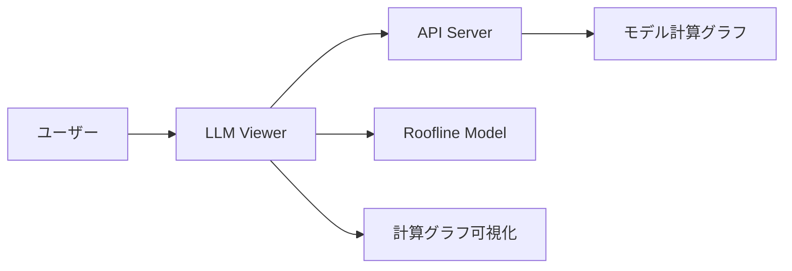

---

## UIレイアウト構成

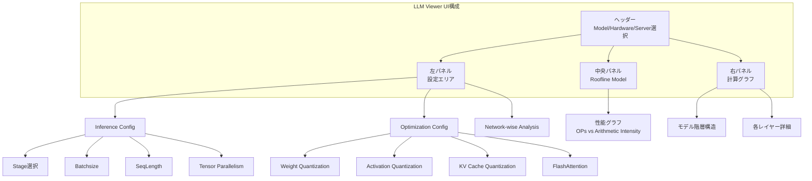

---

## 主要機能

### 1. モデル・ハードウェア選択

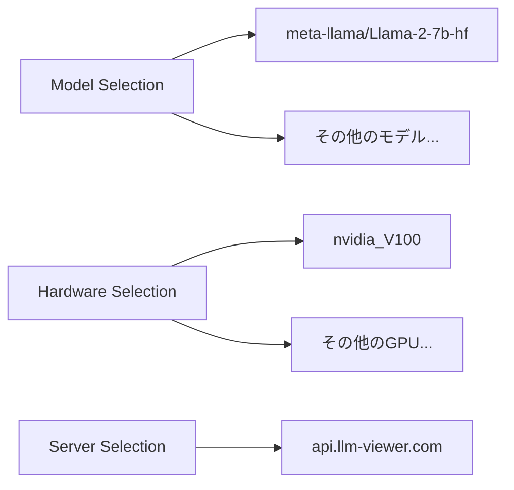

**機能説明**:
- **Model**: 分析対象のLLMモデルを選択
- **Hardware**: 実行環境のハードウェアを選択
- **Server**: APIエンドポイントを選択（デフォルトはapi.llm-viewer.com）

### 2. Inference Config（推論設定）

| 設定項目 | 説明 | デフォルト値 |
|---------|------|-------------|
| Stage | 推論ステージ（Decode/Prefill/Chat） | Decode |
| Batchsize | バッチサイズ | 1 |
| SeqLength | シーケンス長 | 1024 |
| Tensor parallelism | テンソル並列度 | 1 |

### 3. Optimization Config（最適化設定）

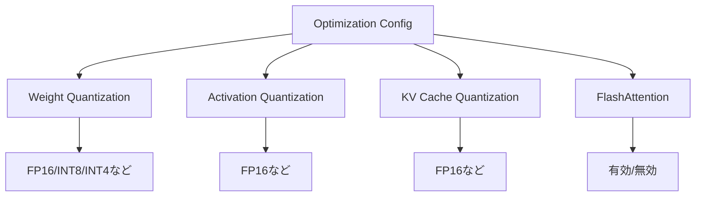

### 4. Roofline Model（性能分析）

**グラフの見方**:
- **X軸**: Arithmetic Intensity (OPs/byte) - 演算強度
- **Y軸**: Performance (OPs) - 性能

このグラフにより、選択したハードウェア上でのモデルの理論的な性能上限を可視化します。

### 5. 計算グラフビューア

モデルの内部構造を階層的に表示：

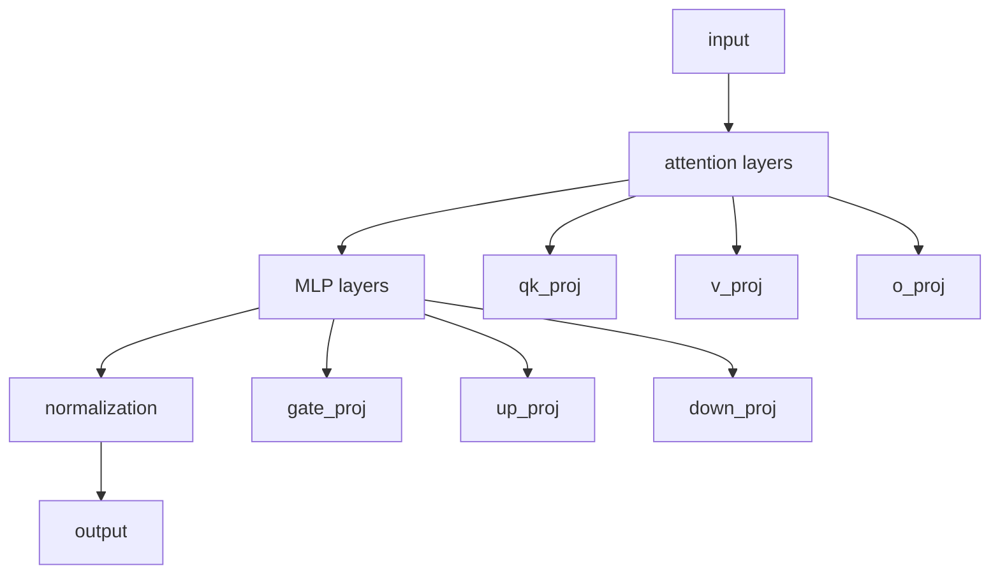

---

## 使用フロー

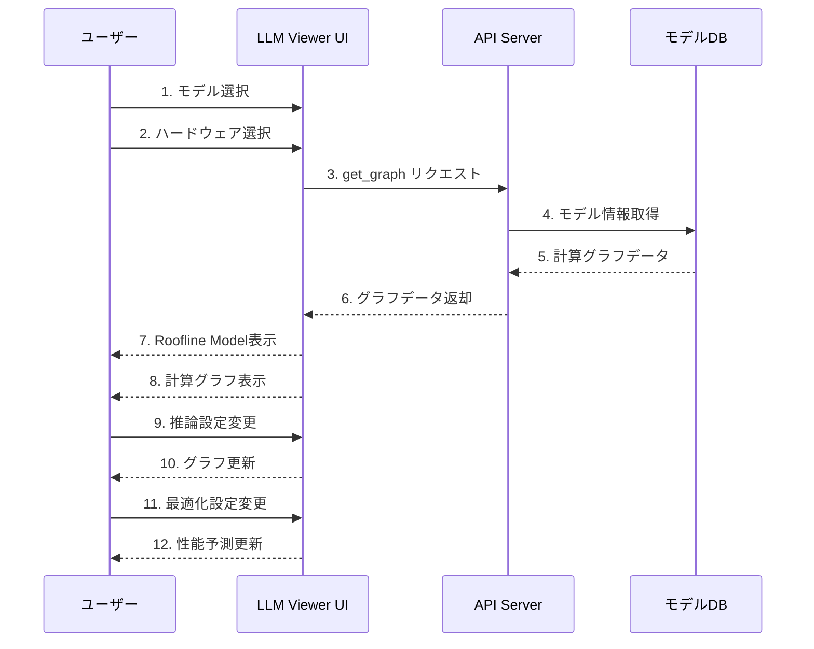

---

## システムアーキテクチャ

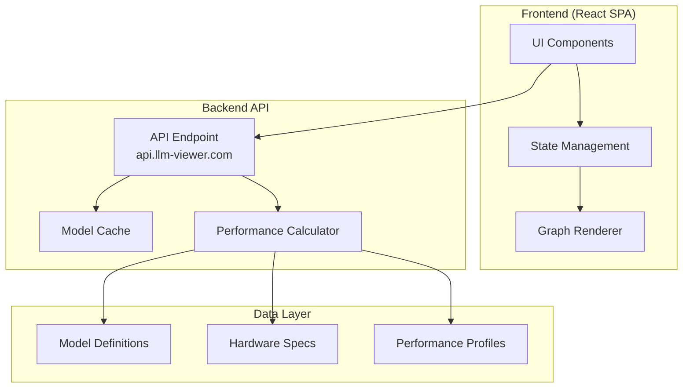

---

## 技術スタック

### フロントエンド
- **フレームワーク**: React
- **タイプ**: SPA (Single Page Application)
- **可視化**: カスタムグラフレンダリング

### バックエンド
- **APIエンドポイント**: `http://api.llm-viewer.com/get_graph`
- **通信**: REST API

### コンソールログから判明した情報
```
Header mounted
LeftControl onMounted meta-llama/Llama-2-7b-hf
graphUpdate http://api.llm-viewer.com/get_graph
```

---

## 主なユースケース

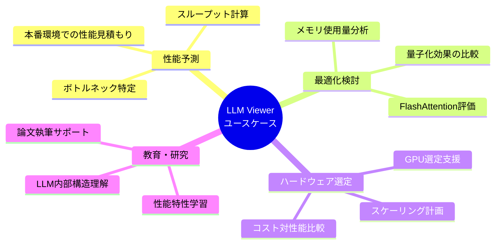

---

## 具体的な使い方

### ステップバイステップガイド

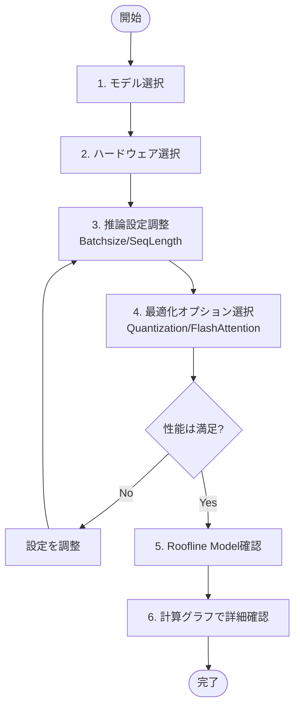

### 例：Llama-2-7bの性能分析

1. **モデル選択**: `meta-llama/Llama-2-7b-hf`
2. **ハードウェア**: `nvidia_V100`
3. **推論設定**:
   - Stage: `Decode`
   - Batchsize: `1`
   - SeqLength: `1024`
4. **最適化**:
   - Weight Quantization: `FP16`
   - FlashAttention: `有効`
5. **結果確認**:
   - Roofline Modelで性能上限を確認
   - 計算グラフでボトルネックレイヤーを特定

---

## データフロー

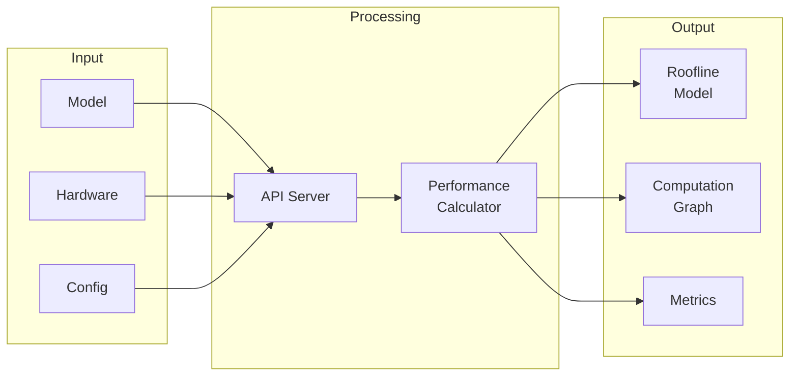

---

## 性能指標の解釈

### Roofline Modelの読み方

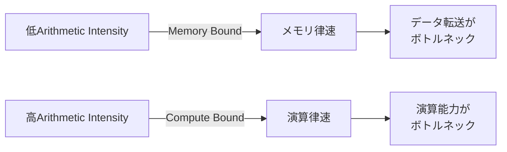

**最適化のヒント**:
- **Memory Bound**: 量子化やキャッシュ最適化が有効
- **Compute Bound**: より高性能なGPUへの移行を検討

---

## トラブルシューティング

### よくある問題

| 問題 | 原因 | 解決策 |
|------|------|--------|
| グラフが表示されない | APIへの接続失敗 | ネットワーク確認・サーバー選択変更 |
| 性能が異常に低い | 不適切な設定 | Batchsize/SeqLengthの調整 |
| 計算グラフが複雑すぎる | 大規模モデル | 検索機能で特定レイヤーに絞る |

---

## まとめ

LLM Viewerは、以下のような用途で非常に有用なツールです：

✅ **LLM推論性能の事前評価**  
✅ **最適化戦略の検討と比較**  
✅ **ハードウェアの選定支援**  
✅ **モデル構造の理解と教育**

特に本番環境でのデプロイ前に、様々な設定での性能を比較検討できる点が強力です。

---

## 参考情報

- **公式サイト**: http://llm-viewer.com/
- **APIエンドポイント**: http://api.llm-viewer.com/get_graph
- **バージョン**: v0.4.0
- **GitHub**: リンク情報は画面に表示あり
- **Project**: リンク情報は画面に表示あり
- **Paper**: リンク情報は画面に表示あり

---

## 調査方法

本調査は以下の手順で実施しました：

1. Chrome DevToolsを使用してサイトにアクセス
2. UIのスクリーンショット取得
3. コンソールログの確認
4. ネットワーク通信の分析
5. インタラクティブ要素の調査

---

*調査完了*

