::::details 前提
:::message
**対象読者**: 大規模基盤モデルの分散学習に興味があり、並列化手法について理解を深めたい方。機械学習の基礎知識があると理解しやすい内容です。GPU を用いた学習の経験があるとより理解が深まります。
:::
:::message
**初学者の方へ - 読み方ガイド**
この章には詳細な技術情報が含まれていますが、最初はすべてを理解する必要はありません。
1. まず各セクションの概要部分（冒頭の説明）を読んで全体像を把握してください
2. `::::details` タグで折りたたまれた詳細情報は、興味のある部分のみ読めば十分です
3. mermaid 図を中心に視覚的に理解することをお勧めします
4. わからない用語は各所の詳細セクションを参照してください
:::
:::message
**ライセンス**: © 2025 littlemex.
本文および自作図表: CC BY 4.0
※公式ドキュメントからの引用や翻訳部分は原典の著作権に従います。
引用画像: 各画像の出典に記載されたライセンスに従います。
:::
:::message
一部 AI を用いて文章を作成します。レビューは実施しますが、見逃せない重大な間違いなどがあれば[こちらの Issue](https://github.com/littlemex/samples/issues) から連絡をお願いします。
:::
::::

**本章では大規模基盤モデル学習を効率的に実行するためのマルチ GPU 処理手法について整理します。**

## 前提知識

:::message
**Point !** ***大規模モデルは単一 GPU では学習できない***
:::

background 章で確認した通り、Llama 3 70B のような大規模モデルを BF16 精度で学習するには約 0.6TB の GPU メモリが必要です。しかし、[NVIDIA H100 GPU](https://www.nvidia.com/ja-jp/data-center/h100/) でも 1 台あたり 80GB のメモリしかありません。つまり、理論上最小でも 8 台の GPU が必要であり、実用的には 10～14 台が必要です。

このような大規模モデルを複数の GPU に分散して学習するための手法が**分散学習**であり、その中核となるのが**並列化手法**です。

### 基本用語の説明

::::details 読み進める上で必須の用語
- **ノード**: GPU を搭載した計算機（サーバー）の単位。例えば [NVIDIA DGX H100](https://www.nvidia.com/en-us/data-center/dgx-h100/) は 8 つの H100 GPU を搭載した 1 ノードです。
- **ランク (Rank)**: 分散学習における各プロセスの識別番号。通常は GPU 1 台につき 1 つのランクが割り当てられます。
- **ワールドサイズ (World Size)**: 分散学習に参加する全プロセス（ランク）の総数。8 台の GPU で学習する場合、ワールドサイズは 8 です。
- **Forward Pass (順伝播)**: 入力データをモデルに通して予測結果を出力する処理。
- **Backward Pass (逆伝播)**: 予測と正解の誤差を計算し、各パラメータの勾配を求める処理。
- **All-Reduce**: 全 GPU が持つ値（例えば勾配）を集約し、全 GPU に結果を配布する通信操作。
- **Activation (活性化値)**: ニューラルネットワークの各層における中間計算結果。逆伝播時に再利用されます。
::::

::::details 分散学習に関する参考情報
- [PyTorch Distributed Overview](https://docs.pytorch.org/tutorials/beginner/dist_overview.html)
- [Colossal-AI: Distributed Training](https://colossalai.org/docs/concepts/distributed_training)
- [Colossal-AI: Paradigms of Parallelism](https://colossalai.org/docs/concepts/paradigms_of_parallelism)
::::

## 分散学習における並列化手法

大規模モデルの学習を複数 GPU に分散する手法には、主に以下の 4 つのパラダイムがあります。

1. **Data Parallelism (データ並列)**：データを分割
2. **Pipeline Parallelism (パイプライン並列)**：モデルを層ごとに分割
3. **Tensor Parallelism (テンソル並列)**：モデルをテンソル単位で分割
4. **Hybrid Parallelism (ハイブリッド並列)**：複数手法の組み合わせ

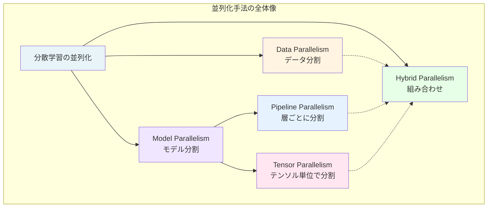

### Data Parallelism（データ並列）

::::details 概要
Data Parallelism は、最もシンプルで広く使われている並列化手法です。各 GPU が**モデル全体のコピー**を保持し、異なるデータバッチを処理します。
::::

**基本的な動作フロー**

1. **初期化**: 全 GPU が同じモデルパラメータを持つ
2. **Forward Pass**: 各 GPU が異なるデータバッチで順伝播を実行
3. **Backward Pass**: 各 GPU が勾配を計算
4. **All-Reduce**: 全 GPU の勾配を平均化
5. **Parameter Update**: 全 GPU が同じ勾配でパラメータを更新

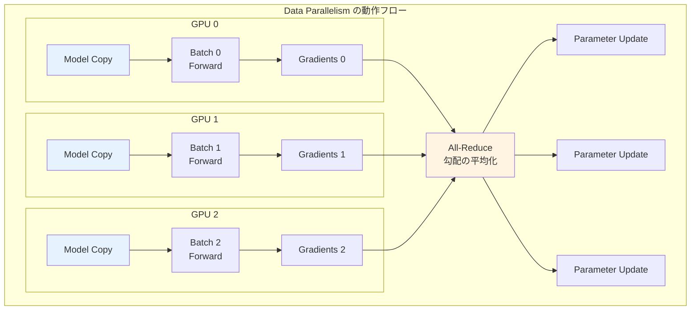

**利点と制約**

::::details 利点
- 実装がシンプル
- 既存のコードを容易に分散化できる
- 線形スケーリングが期待できる（理想的には GPU 数に比例した高速化）
- PyTorch の [DistributedDataParallel (DDP)](https://pytorch.org/docs/stable/notes/ddp.html) など、成熟したライブラリが利用可能
::::

::::details 制約
- 各 GPU がモデル全体を保持する必要があるため、メモリ効率が悪い
- モデルが大きすぎると単一 GPU のメモリに収まらない
- 勾配の All-Reduce 通信がボトルネックになる可能性がある
- 70B パラメータ以上の大規模モデルでは単独では不十分
::::

### Pipeline Parallelism（パイプライン並列）

::::details 概要
Pipeline Parallelism は、モデルを**層ごとに分割**し、異なる GPU に配置する手法です。各 GPU は自分に割り当てられた層のみを保持し、計算結果を次の GPU に渡していきます。
::::

**基本的な動作フロー**

1. モデルを連続する層のグループに分割
2. 各グループを異なる GPU に配置
3. データを小さなマイクロバッチに分割
4. パイプライン方式で処理（前段の GPU の出力を次段の GPU が処理）

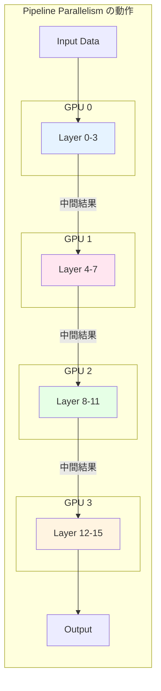

**パイプラインバブルの問題**

素朴な実装では、各 GPU が前段の GPU からの出力を待つ間アイドル状態になります。この無駄な待ち時間を**パイプラインバブル**と呼びます。

```mermaid
gantt
    title Pipeline Parallelism のバブル問題
    dateFormat X
    axisFormat %s
    
    section GPU 0
    Batch 1 F0 :a1, 0, 1
    Batch 2 F0 :a2, 1, 2
    Batch 3 F0 :a3, 2, 3
    Batch 1 B0 :a4, 6, 7
    Batch 2 B0 :a5, 7, 8
    Batch 3 B0 :a6, 8, 9
    
    section GPU 1
    Idle :b0, 0, 1
    Batch 1 F1 :b1, 1, 2
    Batch 2 F1 :b2, 2, 3
    Batch 3 F1 :b3, 3, 4
    Batch 1 B1 :b4, 5, 6
    Batch 2 B1 :b5, 6, 7
    Batch 3 B1 :b6, 7, 8
    Idle :b7, 8, 9
    
    section GPU 2
    Idle :c0, 0, 2
    Batch 1 F2 :c1, 2, 3
    Batch 2 F2 :c2, 3, 4
    Batch 3 F2 :c3, 4, 5
    Batch 1 B2 :c4, 5, 6
    Batch 2 B2 :c5, 6, 7
    Idle :c6, 7, 9
    
    section GPU 3
    Idle :d0, 0, 3
    Batch 1 F3 :d1, 3, 4
    Batch 2 F3 :d2, 4, 5
    Batch 3 F3 :d3, 5, 6
    Idle :d4, 6, 9
```

::::details パイプラインバブル削減手法
[GPipe](https://arxiv.org/abs/1811.06965) や [PipeDream](https://arxiv.org/abs/1806.03377) などの手法では、バッチをさらに小さなマイクロバッチに分割し、複数のマイクロバッチを並行処理することでバブルを削減します。

**マイクロバッチによる効率化**
- バッチサイズ 32 を 8 つのマイクロバッチ（各 4 サンプル）に分割
- 各マイクロバッチを順次パイプラインに投入
- 前段の GPU が次のマイクロバッチを処理している間に、後段の GPU が前のマイクロバッチを処理
::::

**利点と制約**

::::details 利点
- モデルサイズの制約を突破できる（各 GPU は一部の層のみ保持）
- GPU 間の通信量が少ない（層の境界でのみ通信）
- 既存のモデルを比較的容易に分割可能
::::

::::details 制約
- パイプラインバブルによる GPU 利用効率の低下
- マイクロバッチの管理が複雑
- 層の分割バランスが性能に大きく影響
- Forward と Backward で異なるバージョンのパラメータを使用する場合の収束性の課題
::::

### Tensor Parallelism（テンソル並列）

::::details 概要
Tensor Parallelism は、モデルの**各層内のテンソル演算を分割**し、複数 GPU で並行処理する手法です。[Megatron-LM](https://arxiv.org/abs/1909.08053) で提唱され、Transformer モデルの効率的な並列化を実現します。
::::

**Transformer における Tensor Parallelism**

Transformer の Self-Attention と MLP (Multi-Layer Perceptron) 層は、大きな行列積演算で構成されています。Tensor Parallelism では、これらの行列を列方向または行方向に分割します。

**Self-Attention の分割例**

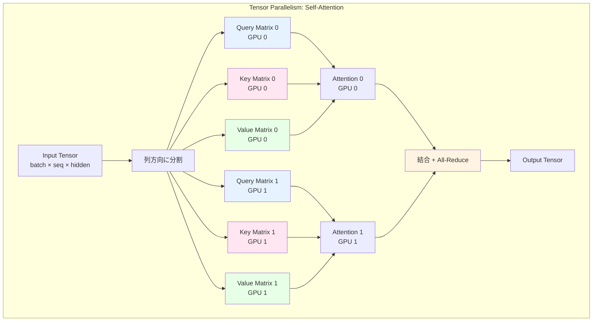

**MLP 層の分割例**

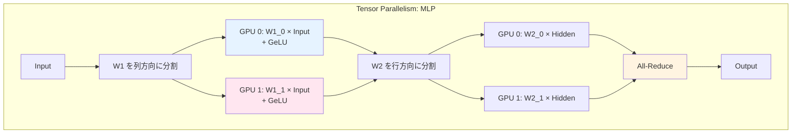

::::details 通信パターンの最適化
Megatron-LM の重要な工夫は、通信回数を最小化することです。

**Forward Pass での工夫**
1. Self-Attention 出力の結合時に All-Reduce
2. MLP の第 1 層では通信なし（列分割なので各 GPU が独立に計算可能）
3. MLP の第 2 層出力で All-Reduce

**Backward Pass での工夫**
- Forward の逆順で通信が発生
- 通信と計算をオーバーラップさせることで効率化

結果として、1 つの Transformer ブロックあたり **2 回の All-Reduce** のみで並列化が実現されます。
::::

**利点と制約**

::::details 利点
- パイプラインバブルがない（全 GPU が常に計算を実行）
- モデル並列の中で最も効率が良い
- 通信量を最小化できる（Megatron-LM の場合）
- Transformer アーキテクチャとの相性が良い
::::

::::details 制約
- 実装が複雑（モデルの内部構造を深く理解する必要がある）
- GPU 間の高速な通信が必要（NVLink や InfiniBand が推奨）
- 通常は 1 ノード内（8 GPU 程度）での並列化に限定される
- ノードをまたぐ場合は通信オーバーヘッドが増大
::::

### Hybrid Parallelism（ハイブリッド並列）

::::details 概要
実際の大規模学習では、Data Parallelism、Pipeline Parallelism、Tensor Parallelism を組み合わせた **Hybrid Parallelism** が使用されます。これにより、数千から数万の GPU を効率的に活用できます。
::::

**典型的な組み合わせ**

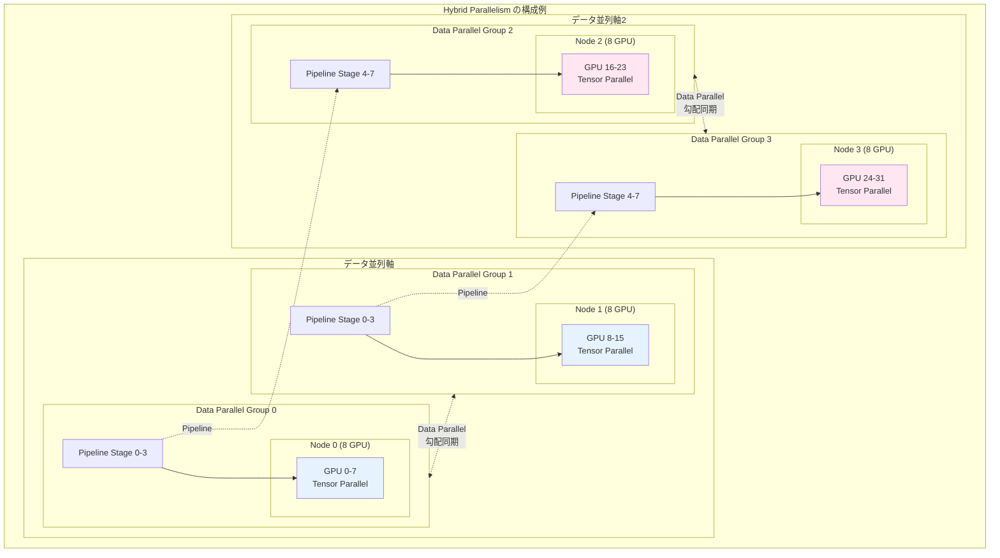

**具体例: Llama 3 405B の学習構成**

::::details 16,000 GPU での構成
Meta が [Llama 3 のトレーニング](https://ai.meta.com/blog/meta-training-inference-generative-ai-llama-3/) で使用した構成（推定）

- **Total GPUs**: 16,000 (H100-80GB)
- **Tensor Parallelism**: 8 (1 ノード内)
- **Pipeline Parallelism**: 16 (モデルを 16 段階に分割)
- **Data Parallelism**: 125 (16,000 ÷ 8 ÷ 16 = 125)

**構成の意図**
1. **Tensor Parallelism = 8**: 1 ノード内の 8 GPU 間の高速通信 (NVLink) を活用
2. **Pipeline Parallelism = 16**: 405B パラメータを 16 段階に分割してメモリに収める
3. **Data Parallelism = 125**: 残りの 125 グループで異なるデータを並行処理
::::

**利点**

- 各手法の利点を組み合わせられる
- 数万 GPU 規模にスケール可能
- 通信パターンを最適化できる
- ハードウェアトポロジーに適合させられる

## ZeRO: Zero Redundancy Optimizer

::::details 概要
ZeRO (Zero Redundancy Optimizer) は Microsoft Research が開発した、Data Parallelism におけるメモリ効率を大幅に改善する手法です。[DeepSpeed](https://www.deepspeed.ai/) ライブラリで実装されており、大規模モデルの学習を可能にします。
:::

### Data Parallelism のメモリ課題

通常の Data Parallelism では、各 GPU が以下を保持する必要があります。

1. **Model Parameters** (モデルパラメータ)
2. **Gradients** (勾配)
3. **Optimizer States** (オプティマイザ状態: Momentum + Variance)

これは**メモリの冗長性**を意味します。例えば 8 GPU で学習する場合、同じモデルパラメータが 8 つの GPU に重複して保存されています。

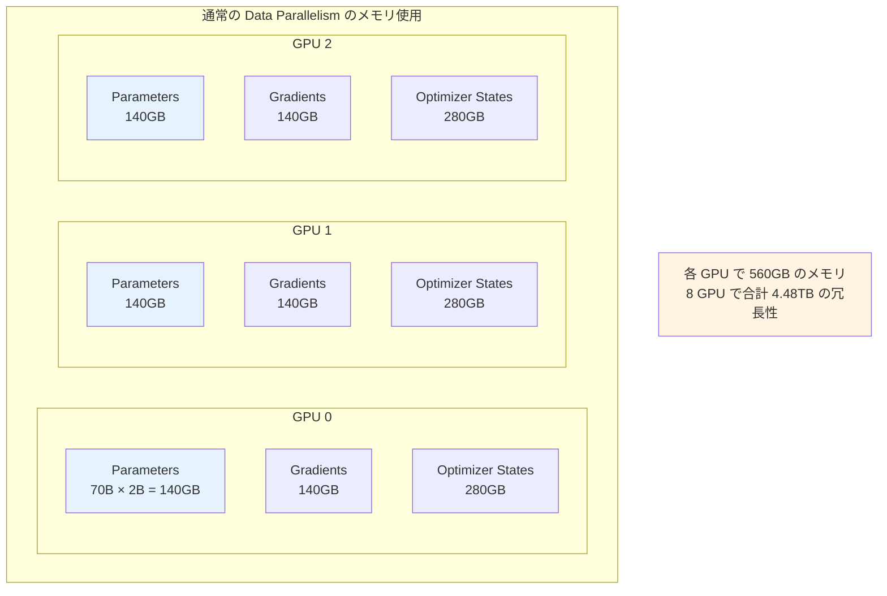

### ZeRO の基本アイデア

ZeRO は、この冗長性を排除するために、Parameters、Gradients、Optimizer States を GPU 間で**分割 (Partition)** します。各 GPU は自分に割り当てられた部分のみを保持し、必要に応じて他の GPU から取得します。

ZeRO には 3 つのステージがあり、段階的にメモリを削減します。

### ZeRO Stage 1: Optimizer State Partitioning

**Optimizer States のみを分割**

Optimizer States（AdamW の Momentum と Variance）は Parameters や Gradients と比べて最もメモリを消費します（2 倍）。Stage 1 では、これを GPU 間で分割します。

```mermaid
graph TB
    subgraph "ZeRO Stage 1: Optimizer State Partitioning"
        subgraph GPU0["GPU 0"]
            P0[Parameters<br/>140GB 全体]
            G0[Gradients<br/>140GB 全体]
            O0[Optimizer States<br/>35GB (1/8)]
        end
        
        subgraph GPU1["GPU 1"]
            P1[Parameters<br/>140GB 全体]
            G1[Gradients<br/>140GB 全体]
            O1[Optimizer States<br/>35GB (1/8)]
        end
        
        subgraph GPU2["GPU 2"]
            P2[Parameters<br/>140GB 全体]
            G2[Gradients<br/>140GB 全体]
            O2[Optimizer States<br/>35GB (1/8)]
        end
        
        note1[各 GPU で 315GB のメモリ<br/>標準の 560GB から 44% 削減]
    end
    
    style O0 fill:#e6f3ff
    style O1 fill:#ffe6f0
    style O2 fill:#e6ffe6
    style note1 fill:#fff4e1
```

**動作の流れ**

1. Forward & Backward Pass: 各 GPU が全 Gradients を計算
2. All-Reduce: 全 GPU で Gradients を平均化
3. Parameter Update: 各 GPU は自分が担当する Parameters のみを更新
4. Broadcast: 更新された Parameters を全 GPU に配布

**メモリ削減効果（70B モデル、8 GPU の場合）**
- 標準 Data Parallelism: 560GB/GPU
- ZeRO Stage 1: 315GB/GPU（**44% 削減**）

### ZeRO Stage 2: Gradient Partitioning

**Optimizer States と Gradients を分割**

Stage 2 では、Gradients も分割します。各 GPU は Backward Pass で計算した Gradients のうち、自分が担当する部分のみを保持します。

```mermaid
graph TB
    subgraph "ZeRO Stage 2: Gradient Partitioning"
        subgraph GPU0["GPU 0"]
            P0[Parameters<br/>140GB 全体]
            G0[Gradients<br/>17.5GB (1/8)]
            O0[Optimizer States<br/>35GB (1/8)]
        end
        
        subgraph GPU1["GPU 1"]
            P1[Parameters<br/>140GB 全体]
            G1[Gradients<br/>17.5GB (1/8)]
            O1[Optimizer States<br/>35GB (1/8)]
        end
        
        subgraph GPU2["GPU 2"]
            P2[Parameters<br/>140GB 全体]
            G2[Gradients<br/>17.5GB (1/8)]
            O2[Optimizer States<br/>35GB (1/8)]
        end
        
        note2[各 GPU で 192.5GB のメモリ<br/>標準の 560GB から 66% 削減]
    end
    
    style G0 fill:#e6f3ff
    style G1 fill:#ffe6f0
    style G2 fill:#e6ffe6
    style note2 fill:#fff4e1
```

**動作の流れ**

1. Forward Pass: 各 GPU が自分のデータバッチで順伝播
2. Backward Pass: 各 GPU が Gradients を計算
3. Reduce-Scatter: 各 GPU が自分の担当部分の Gradients のみを集約
4. Parameter Update: 各 GPU が自分の担当部分のみを更新
5. All-Gather: 更新された Parameters を全 GPU で共有

**メモリ削減効果（70B モデル、8 GPU の場合）**
- 標準 Data Parallelism: 560GB/GPU
- ZeRO Stage 2: 192.5GB/GPU（**66% 削減**）

### ZeRO Stage 3: Parameter Partitioning

**Optimizer States、Gradients、Parameters すべてを分割**

Stage 3 では、Parameters も分割します。これが ZeRO の最も積極的なメモリ削減手法です。各 GPU は計算に必要な Parameters を動的に他の GPU から取得します。

```mermaid
graph TB
    subgraph "ZeRO Stage 3: Parameter Partitioning"
        subgraph GPU0["GPU 0"]
            P0[Parameters<br/>17.5GB (1/8)]
            G0[Gradients<br/>17.5GB (1/8)]
            O0[Optimizer States<br/>35GB (1/8)]
        end
        
        subgraph GPU1["GPU 1"]
            P1[Parameters<br/>17.5GB (1/8)]
            G1[Gradients<br/>17.5GB (1/8)]
            O1[Optimizer States<br/>35GB (1/8)]
        end
        
        subgraph GPU2["GPU 2"]
            P2[Parameters<br/>17.5GB (1/8)]
            G2[Gradients<br/>17.5GB (1/8)]
            O2[Optimizer States<br/>35GB (1/8)]
        end
        
        note3[各 GPU で 70GB のメモリ<br/>標準の 560GB から 87.5% 削減]
    end
    
    style P0 fill:#e6f3ff
    style P1 fill:#ffe6f0
    style P2 fill:#e6ffe6
    style note3 fill:#fff4e1
```

**動作の流れ**

1. Forward Pass 開始前: 必要な層の Parameters を All-Gather で収集
2. Forward Pass: 計算を実行
3. Forward Pass 完了後: Parameters を破棄（他の GPU が保持）
4. Backward Pass: 同様に Parameters を All-Gather → 計算 → 破棄
5. Reduce-Scatter: 自分の担当 Gradients を集約
6. Parameter Update: 自分の担当 Parameters を更新

**メモリ削減効果（70B モデル、8 GPU の場合）**
- 標準 Data Parallelism: 560GB/GPU
- ZeRO Stage 3: 70GB/GPU（**87.5% 削減**）

### ZeRO のトレードオフ

::::details 通信量の増加
ZeRO はメモリを削減する代わりに、GPU 間通信が増加します。

| Stage | メモリ削減 | 追加通信量 | 適用場面 |
|-------|-----------|-----------|----------|
| **Stage 1** | 44% | 最小 | 通信帯域幅が限られている場合 |
| **Stage 2** | 66% | 中程度 | バランスの取れた選択 |
| **Stage 3** | 87.5% | 大きい | メモリが最大の制約の場合 |

通信帯域幅が十分にある環境（NVLink、InfiniBand）では、Stage 3 でも効率的に動作します。
::::

::::details ZeRO-Offload と ZeRO-Infinity
DeepSpeed は ZeRO をさらに拡張した機能を提供しています。

**ZeRO-Offload**
- Optimizer States を CPU メモリにオフロード
- GPU メモリをさらに削減
- GPU と CPU 間の通信が必要

**ZeRO-Infinity**
- Parameters、Gradients、Optimizer States を NVMe SSD にもオフロード可能
- 事実上無制限のモデルサイズに対応
- ただし I/O のオーバーヘッドが発生

これらの手法により、1 兆パラメータ以上のモデルも学習可能になります。
::::

## 分散学習フレームワークの比較

大規模モデルの学習を実現するための主要なフレームワークとツールを比較します。

### PyTorch DDP (Distributed Data Parallel)

::::details 概要
PyTorch の標準的な分散学習機能です。Data Parallelism のみをサポートしますが、シンプルで使いやすく、多くのプロジェクトで採用されています。PyTorch 1.0 から標準搭載され、業界標準の分散学習エントリーポイントとして広く認知されています。
::::

**特徴**
- PyTorch に標準搭載（追加の依存関係不要）
- Data Parallelism のみ（シンプルで理解しやすい）
- Ring All-Reduce アルゴリズムによる効率的な勾配同期
- Gradient bucketing による通信と計算のオーバーラップ
- プロセスグループの柔軟な管理
- 既存コードへの統合が容易（数行の変更で対応可能）

**PyTorch エコシステムにおける位置付け**

DDP は PyTorch の分散学習における基盤技術であり、以下の特徴があります。

- **業界標準のエントリーポイント**: ほぼすべての PyTorch ユーザーが最初に使う分散学習機能
- **Production での実績**: OpenAI、Anthropic、Cohere など多くの企業で使用
- **高い互換性**: PyTorch の全機能と完全に統合
- **安定性**: 長期間の開発と使用により高い安定性を実現
- **デバッグのしやすさ**: エラーメッセージが明確で問題の特定が容易

**技術的詳細**

::::details Ring All-Reduce と最適化
DDP は効率的な通信パターンを実装しています。

**Ring All-Reduce**
- 各 GPU が隣接 GPU とのみ通信
- 通信量が GPU 数に依存しない（O(N) ではなく O(1)）
- 帯域幅を最大限活用

**Gradient Bucketing**
- 勾配を複数のバケットにグループ化
- バケット単位で通信を開始（全勾配の計算完了を待たない）
- 通信と計算のオーバーラップにより効率化

**通信の最適化**
- 小さな勾配テンソルをまとめて通信（通信回数を削減）
- FP16 勾配の圧縮通信（帯域幅を節約）
- NCCL バックエンドによる GPU 間通信の最適化
::::

**適用場面**

- **小〜中規模モデル**（10B パラメータ以下）が単一 GPU メモリに収まる場合
- **シンプルな分散学習**を実現したい場合
- **既存の PyTorch コード**を最小限の変更で分散化したい場合
- **デバッグのしやすさ**を重視する場合
- **追加の依存関係を避けたい**場合

**他フレームワークとの比較における位置付け**

| 観点 | DDP | FSDP | DeepSpeed |
|------|-----|------|-----------|
| メモリ効率 | 低 | 高 | 高 |
| 実装の複雑さ | 低 | 中 | 高 |
| デバッグのしやすさ | 高 | 中 | 低 |
| 依存関係 | なし | なし | あり |
| モデルサイズ上限 | 〜10B | 〜100B | 100B+ |
| 学習曲線 | 緩やか | 中程度 | 急 |

**採用事例**

- Hugging Face Transformers のデフォルト分散学習機能
- PyTorch Lightning での標準バックエンド
- 多くの研究機関での標準的な選択肢
- 中小規模のスタートアップでの実用例多数

::::details 参考情報
- [PyTorch DDP Tutorial](https://pytorch.org/tutorials/intermediate/ddp_tutorial.html)
- [Getting Started with Distributed Data Parallel](https://pytorch.org/tutorials/intermediate/ddp_series_intro.html)
- [DDP API Documentation](https://pytorch.org/docs/stable/generated/torch.nn.parallel.DistributedDataParallel.html)
- [PyTorch Distributed Overview](https://pytorch.org/docs/stable/distributed.html)
::::

### DeepSpeed

::::details 概要
Microsoft Research が開発した、大規模モデル学習に特化したライブラリです。ZeRO を実装しており、メモリ効率の高い学習を実現します。
::::

**特徴**
- ZeRO Stage 1-3 による積極的なメモリ最適化
- ZeRO-Offload、ZeRO-Infinity によるさらなるメモリ削減
- Pipeline Parallelism のサポート
- FP16/BF16 Mixed Precision Training
- Gradient Accumulation
- 3D Parallelism（Data + Pipeline + Tensor）のサポート

**適用場面**
- 大規模モデル（数十億～数兆パラメータ）の学習
- GPU メモリが制約となる場合
- 複数の並列化手法を組み合わせたい場合

::::details 参考情報
- [DeepSpeed 公式サイト](https://www.deepspeed.ai/)
- [DeepSpeed 概要（日本語 PDF）](https://www.deepspeed.ai/assets/files/DeepSpeed_Overview_Japanese_2023Jun7th.pdf)
- [DeepSpeed GitHub](https://github.com/microsoft/DeepSpeed)
::::

### Megatron-LM

::::details 概要
NVIDIA が開発した、Transformer モデルに特化した Tensor Parallelism の実装です。効率的なモデル並列化を実現します。
::::

**特徴**
- 高効率な Tensor Parallelism の実装
- Transformer アーキテクチャに最適化
- Pipeline Parallelism のサポート
- Distributed Optimizer（ZeRO-1 相当）
- FlashAttention などの最適化カーネル統合

**適用場面**
- Transformer ベースの大規模モデル学習
- ノード内（8 GPU）での効率的なモデル並列化
- NVIDIA GPU と InfiniBand 環境

::::details 参考情報
- [Megatron-LM GitHub](https://github.com/NVIDIA/Megatron-LM)
- [Megatron-LM 論文](https://arxiv.org/abs/1909.08053)
- [Efficient Large-Scale Language Model Training](https://arxiv.org/abs/2104.04473)
::::

### Megatron-DeepSpeed

::::details 概要
Megatron-LM と DeepSpeed を統合したフレームワークです。Tensor Parallelism、Pipeline Parallelism、ZeRO を組み合わせた 3D Parallelism を実現します。
::::

**特徴**
- Megatron の Tensor Parallelism + DeepSpeed の ZeRO
- 3D Parallelism（Tensor + Pipeline + Data）
- 超大規模モデル（数百億～数兆パラメータ）に対応
- 複数の最適化手法の統合

**適用場面**
- 超大規模モデルの学習（100B+ パラメータ）
- 数千～数万 GPU での学習
- 最高の効率が求められる場合

::::details 参考情報
- [Megatron-DeepSpeed GitHub](https://github.com/microsoft/Megatron-DeepSpeed)
- [Using DeepSpeed and Megatron to Train Megatron-Turing NLG 530B](https://arxiv.org/abs/2201.11990)
::::

### GPT-NeoX

::::details 概要
EleutherAI が開発した、大規模言語モデル学習に特化したライブラリです。Megatron-LM と DeepSpeed をベースに、usability と最適化を大幅に向上させています。
::::

**特徴**
- Megatron の Tensor Parallelism と DeepSpeed の ZeRO を統合
- 3D Parallelism（Data + Tensor + Pipeline）のサポート
- 多様なシステムとランチャー対応（Slurm、MPI、IBM Job Step Manager）
- AWS、CoreWeave、ORNL Summit/Frontier、LUMI などで大規模運用実績
- Flash Attention、Transformer Engine 統合
- Rotary/ALiBi positional embeddings、parallel feedforward attention layers
- 事前設定済みアーキテクチャ（Pythia、PaLM、Falcon、LLaMA 1&2）
- Curriculum Learning サポート
- Hugging Face エコシステムとの連携（tokenizers、transformers、Evaluation Harness）

**2024 年の主要アップデート**
- Transformer Engine 統合（2024 年 10 月）
- DPO、KTO による preference learning、Comet ML 統合（2024 年 9 月）
- RWKV with pipeline parallelism（2024 年 5 月）
- Mixture-of-Experts (MoE)、AMD MI250X GPU サポート（2024 年 3 月）
- Mamba with tensor parallelism（2024 年 3 月）

**採用実績**
Oak Ridge National Lab、CarperAI、Stability AI、Together.ai、Korea University、Carnegie Mellon University、University of Tokyo など、学術機関、産業界、政府研究所で広く採用されています。

**適用場面**
- 大規模言語モデルの事前学習（数十億〜数百億パラメータ）
- 学術研究や実験的プロジェクト
- Megatron-DeepSpeed よりも使いやすさを重視する場合
- 多様なハードウェア環境での運用

**注意点**
- 数十億パラメータ以上のモデルをスクラッチから学習する用途に特化
- 推論やファインチューニングには Hugging Face transformers の使用を推奨

::::details 参考情報
- [GPT-NeoX GitHub](https://github.com/EleutherAI/gpt-neox)
- [GPT-NeoX-20B: An Open-Source Autoregressive Language Model](https://arxiv.org/abs/2204.06745)
- [GPT-NeoX Documentation](https://www.eleuther.ai/artifacts/gpt-neox)
::::

### Nanotron

::::details 概要
Hugging Face が開発した、モダンで使いやすい分散学習フレームワークです。Llama などの人気モデルの学習に使用されています。
::::

**特徴**
- クリーンで保守性の高いコードベース
- 3D Parallelism のサポート
- Hugging Face エコシステムとの統合
- アクティブな開発とコミュニティサポート

**適用場面**
- 研究・実験での使用
- Hugging Face モデルの継続学習やファインチューニング
- コードの可読性と保守性を重視する場合

::::details 参考情報
- [Nanotron GitHub](https://github.com/huggingface/nanotron)
::::

### Picotron

::::details 概要
Hugging Face が 2025 年にリリースした教育・実験用の分散学習フレームワークです。NanoGPT の精神（ミニマリスト、hackable）を継承し、分散学習技術の学習に最適化されています。
::::

**特徴**
- 極めてシンプルなコード構成（各ファイルが 300 行未満）
- 4D Parallelism（Data + Tensor + Pipeline + Context parallel）
- ステップバイステップのチュートリアル動画とコードベース
- 教育目的に特化した設計
- Llama-like モデルの事前学習をサポート

**パフォーマンス**
- LLaMA-2-7B: 38% MFU（64 H100 GPU）
- SmolLM-1.7B: 50% MFU（8 H100 GPU）
- 性能より学習効果を優先した設計

**Nanotron との違い**
- **Picotron**: 教育・学習用途に特化、コードの読みやすさと理解しやすさを最優先
- **Nanotron**: 研究・実験用途、production レベルのパフォーマンスと機能を提供

**適用場面**
- 分散学習技術の学習・教育
- 並列化手法の実験と理解
- 大規模モデル学習の入門

**注意点**
- 性能は他のフレームワークより劣る（教育目的のため）
- 2025 年リリースの非常に新しいプロジェクト

::::details 参考情報
- [Picotron GitHub](https://github.com/huggingface/picotron)
- [Picotron Tutorial (Playlist)](https://www.youtube.com/playlist?list=PLo2EIpI_JMQtNtKNFFSMNIZwspj8H7-sQ)
::::

### PyTorch FSDP (Fully Sharded Data Parallel)

::::details 概要
PyTorch 1.11 以降で標準搭載された、ZeRO Stage 3 相当の機能を提供する分散学習機能です。Meta が DeepSpeed ZeRO の研究成果を PyTorch ネイティブに実装したものであり、Llama 2、Llama 3 などの大規模モデル学習で実際に使用されています。
::::

**特徴**
- ZeRO Stage 3 と同等のメモリ最適化（Parameters、Gradients、Optimizer States を分割）
- PyTorch ネイティブの実装（追加の依存関係不要）
- 柔軟な Sharding Strategy（FULL_SHARD、SHARD_GRAD_OP、HYBRID_SHARD など）
- Mixed Precision Training のサポート（BF16、FP16）
- Activation Checkpointing との統合
- CPU Offloading のオプション
- Transformer Auto Wrap Policy による自動モデル分割

**PyTorch エコシステムにおける位置付け**

FSDP は、PyTorch における次世代の分散学習機能として位置付けられています。

- **DDP の進化版**: メモリ効率を大幅に改善しながら DDP の使いやすさを維持
- **Meta の公式選択**: Llama シリーズの学習で実際に使用
- **PyTorch の戦略的機能**: PyTorch チームが積極的に開発・改善
- **エコシステムとの統合**: Hugging Face Transformers、PyTorch Lightning などでサポート拡大
- **長期的なサポート**: PyTorch の標準機能として継続的なメンテナンス

**ZeRO Stage 3 との関係**

FSDP は DeepSpeed ZeRO Stage 3 と同じコンセプトを PyTorch ネイティブに実装したものです。

| 機能 | FSDP | DeepSpeed ZeRO-3 |
|------|------|------------------|
| Parameter Sharding | ✅ | ✅ |
| Gradient Sharding | ✅ | ✅ |
| Optimizer State Sharding | ✅ | ✅ |
| CPU Offloading | ✅ | ✅（ZeRO-Offload） |
| NVMe Offloading | ❌ | ✅（ZeRO-Infinity） |
| Pipeline Parallelism | ❌ | ✅ |
| 依存関係 | PyTorch のみ | DeepSpeed ライブラリ |

**DeepSpeed との比較**

::::details メモリ効率と機能の比較
**メモリ最適化**
- FSDP: ZeRO Stage 3 相当（87.5% 削減）
- DeepSpeed: ZeRO Stage 1-3 を選択可能、ZeRO-Infinity で NVMe も活用

**実装の複雑さ**
- FSDP: PyTorch の標準 API で直感的
- DeepSpeed: 設定ファイルによる詳細な制御（学習曲線が急）

**パフォーマンス**
- 両者ともほぼ同等のスループット
- 環境やモデルによって優劣が変わる
- FSDP は PyTorch との統合により最適化の余地

**機能の豊富さ**
- FSDP: 基本的なメモリ最適化に特化
- DeepSpeed: Pipeline Parallelism、ZeRO-Infinity、DeepSpeed-Chat など多機能

**適用範囲**
- FSDP: 10B～100B パラメータのモデルに最適
- DeepSpeed: 100B+ パラメータの超大規模モデルにも対応
::::

**Meta での使用例**

Meta は自社の大規模モデル学習で FSDP を積極的に採用しています。

::::details Llama シリーズでの実績
**Llama 2 (7B, 13B, 70B)**
- FSDP を使用して効率的に学習
- 数百〜数千 GPU での学習実績

**Llama 3 (8B, 70B, 405B)**
- FSDP による大規模分散学習
- 16,000 H100 GPU での 405B モデル学習
- PyTorch ネイティブのメリットを活用

**Meta の選択理由**
1. PyTorch の開発元としての知見を活用
2. 自社インフラとの深い統合
3. 長期的なメンテナンス保証
4. コミュニティへのフィードバック循環
::::

**技術的詳細**

::::details Sharding Strategy
FSDP は複数の sharding strategy を提供しています。

**FULL_SHARD（デフォルト）**
- Parameters、Gradients、Optimizer States すべてを分割
- 最大のメモリ削減（ZeRO Stage 3 相当）
- 通信量は最大

**SHARD_GRAD_OP**
- Gradients と Optimizer States のみを分割
- ZeRO Stage 2 相当
- メモリと通信のバランス

**HYBRID_SHARD**
- ノード内で FULL_SHARD、ノード間で SHARD_GRAD_OP
- ノード内の高速通信（NVLink）とノード間通信のバランス
- 大規模クラスタで効果的

**NO_SHARD**
- 分割なし（DDP と同等）
- メモリ削減なし、通信オーバーヘッド最小
::::

::::details CPU Offloading と最適化
**CPU Offloading**
- Parameters と Gradients を CPU メモリにオフロード可能
- GPU メモリをさらに削減
- PCIe 帯域幅がボトルネックになる可能性

**Transformer Auto Wrap Policy**
- Transformer ブロック単位で自動的にモデルをラップ
- 手動でのモジュール指定が不要
- Hugging Face モデルとの相性が良い

**通信の最適化**
- Backward Prefetch: 次の層の Parameters を先読み
- Forward Prefetch: Forward 中に次の層を準備
- 通信と計算のオーバーラップを最大化
::::

**適用場面**

- **中〜大規模モデル**（10B～100B パラメータ）でメモリが制約となる場合
- **PyTorch エコシステム**で完結させたい場合
- **DeepSpeed の依存関係**を避けたい場合
- **Meta のベストプラクティス**に従いたい場合
- **継続的なサポート**が必要な production 環境
- **Hugging Face モデル**を使用する場合

**DDP からの移行**

::::details FSDP への移行ガイド
DDP から FSDP への移行は比較的容易です。

**必要な変更（最小限）**
```python
# DDP の場合
from torch.nn.parallel import DistributedDataParallel as DDP
model = DDP(model, device_ids=[rank])

# FSDP の場合
from torch.distributed.fsdp import FullyShardedDataParallel as FSDP
model = FSDP(model)
```

**段階的な移行戦略**
1. まず DDP で動作確認
2. メモリが不足する場合に FSDP へ移行
3. Sharding Strategy を調整してパフォーマンス最適化
4. 必要に応じて CPU Offloading を有効化

**移行のメリット**
- モデルサイズの制約を突破
- 同じ GPU 数でより大きなバッチサイズ
- PyTorch の最新機能を活用
::::

**制約事項**

- Pipeline Parallelism は未対応（Data Parallelism のみ）
- NVMe へのオフロード機能なし（DeepSpeed ZeRO-Infinity 相当の機能は未実装）
- 一部の PyTorch 機能との互換性に注意が必要（compile、TorchScript など）
- DeepSpeed と比較すると機能は限定的

::::details 参考情報
- [PyTorch FSDP Tutorial](https://pytorch.org/tutorials/intermediate/FSDP_tutorial.html)
- [FSDP API Documentation](https://pytorch.org/docs/stable/fsdp.html)
- [Getting Started with FSDP](https://pytorch.org/blog/introducing-pytorch-fully-sharded-data-parallel-api/)
- [Meta's FSDP Best Practices](https://pytorch.org/tutorials/intermediate/FSDP_adavnced_tutorial.html)
- [Hugging Face: Training with FSDP](https://huggingface.co/docs/transformers/main/en/fsdp)
::::

### Monarch

::::details 概要
Meta（Facebook）が開発した PyTorch 向けの分散プログラミングフレームワークです。複数の GPU やコンピュータを使った大規模な機械学習を、簡単に・安全に・高速に実行できるようにするツールです。
::::

**特徴**
- 高レベルの抽象化により分散プログラミングを簡素化
- 複数の並列化戦略を統一的に扱える
- PyTorch の torch.distributed API との互換性
- エラーハンドリングと障害復旧機能の強化

**適用場面**
- Meta の大規模学習インフラストラクチャ
- 複雑な分散学習パターンの実装
- 障害が頻繁に発生する大規模クラスタ環境

::::details 参考情報
- [Monarch に関する Zenn スクラップ](https://zenn.dev/tosshi/scraps/d36bb9b3168809)
::::

### フレームワーク比較表

| フレームワーク | Data Parallel | Tensor Parallel | Pipeline Parallel | ZeRO | 難易度 | 主な用途 |
|--------------|---------------|-----------------|-------------------|------|--------|----------|
| **PyTorch DDP** | ✅ | ❌ | ❌ | ❌ | 低 | 標準的な分散学習 |
| **PyTorch FSDP** | ✅ | ❌ | ❌ | ✅ (Stage 3) | 低 | メモリ効率重視 |
| **DeepSpeed** | ✅ | ❌ | ✅ | ✅ (Stage 1-3) | 中 | 大規模モデル学習 |
| **Megatron-LM** | ✅ | ✅ | ✅ | 部分的 | 高 | Transformer 最適化 |
| **Megatron-DeepSpeed** | ✅ | ✅ | ✅ | ✅ | 高 | 超大規模モデル |
| **GPT-NeoX** | ✅ | ✅ | ✅ | ✅ | 中〜高 | 研究・学術用途 |
| **Nanotron** | ✅ | ✅ | ✅ | ✅ | 中 | 研究・実験 |
| **Picotron** | ✅ | ✅ | ✅ | ✅ | 低〜中 | 教育・学習用途 |
| **Monarch** | ✅ | ✅ | ✅ | - | 中 | Meta 内部使用 |

### PyTorch ネイティブフレームワークの選択ガイド

PyTorch エコシステム内で分散学習を行う場合、DDP と FSDP のどちらを選ぶべきかを判断するためのガイドです。

**モデルサイズによる選択**

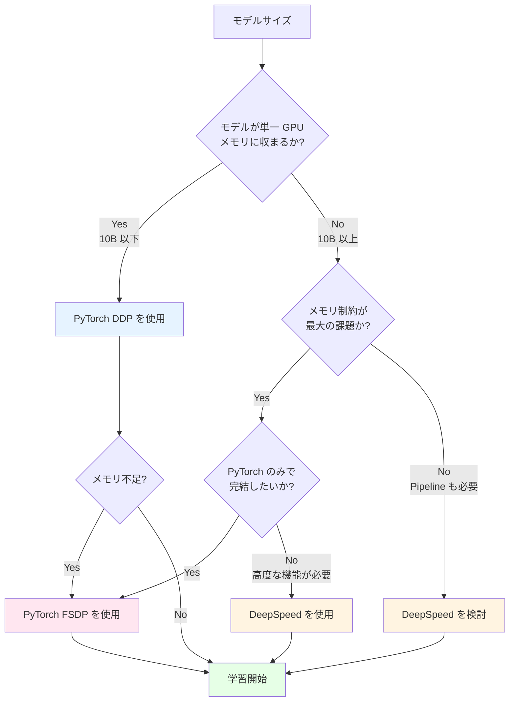

**使用ケース別の推奨**

| ユースケース | 推奨フレームワーク | 理由 |
|------------|-----------------|------|
| 研究・プロトタイピング | **DDP** → **FSDP** | シンプルさを優先、必要に応じて FSDP へ |
| 小規模モデル（<10B） | **DDP** | メモリが十分なら DDP で十分 |
| 中規模モデル（10B-70B） | **FSDP** | メモリ効率と使いやすさのバランス |
| 大規模モデル（70B-100B） | **FSDP** または **DeepSpeed** | FSDP で十分な場合も多い |
| 超大規模モデル（100B+） | **DeepSpeed** または **Megatron-DeepSpeed** | Pipeline Parallelism が必要 |
| Hugging Face モデル | **FSDP** | Transformers との統合が良好 |
| 教育・学習目的 | **DDP** → **Picotron** | 理解しやすさを重視 |
| Production 環境 | **DDP** または **FSDP** | 安定性とサポートを重視 |

**段階的な移行パス**

多くのプロジェクトは以下のパスを辿ります。

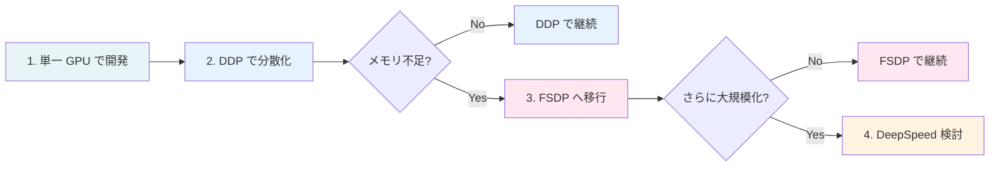

**実践的な判断基準**

::::details いつ DDP から FSDP に移行すべきか

**移行を検討すべきサイン**
1. OOM (Out of Memory) エラーが頻発
2. バッチサイズを 1 にしてもメモリ不足
3. Gradient Accumulation を使っても不十分
4. より大きなモデルを試したい

**移行しない方が良い場合**
1. 現状で問題なく学習できている
2. デバッグを頻繁に行う必要がある（DDP の方が簡単）
3. チーム全員が DDP に慣れている
4. 既存のワークフローを変更したくない

**移行のコスト**
- コード変更: 小（数行〜数十行）
- 学習曲線: 中（Sharding Strategy の理解が必要）
- デバッグ難易度: やや上昇
- パフォーマンス調整: 必要（Sharding Strategy の選択）
::::

::::details いつ DeepSpeed を選ぶべきか

**DeepSpeed が必須の場合**
1. 100B+ パラメータの超大規模モデル
2. Pipeline Parallelism が必要
3. ZeRO-Infinity（NVMe offloading）が必要
4. DeepSpeed-Chat による RLHF を実装したい
5. 3D Parallelism（Data + Tensor + Pipeline）が必要

**DeepSpeed が有利な場合**
1. メモリ最適化を極限まで追求したい
2. Microsoft エコシステムとの統合
3. 豊富な設定オプションによる細かいチューニング
4. ZeRO Stage 1-3 を柔軟に切り替えたい

**FSDP で十分な場合**
1. 10B～70B パラメータのモデル
2. PyTorch のみで完結させたい
3. シンプルさを重視
4. Meta のベストプラクティスに従いたい
::::

**パフォーマンス比較の目安**

| モデルサイズ | GPU 数 | DDP | FSDP | DeepSpeed | 推奨 |
|------------|--------|-----|------|-----------|------|
| 1B | 8 | ✅✅✅ | ✅✅ | ✅✅ | **DDP** |
| 7B | 8 | ✅✅ | ✅✅✅ | ✅✅✅ | **DDP** または **FSDP** |
| 13B | 8 | ⚠️ | ✅✅✅ | ✅✅✅ | **FSDP** |
| 30B | 16 | ❌ | ✅✅✅ | ✅✅✅ | **FSDP** または **DeepSpeed** |
| 70B | 64 | ❌ | ✅✅ | ✅✅✅ | **FSDP** または **DeepSpeed** |
| 175B | 256 | ❌ | ⚠️ | ✅✅✅ | **DeepSpeed** |

**凡例**
- ✅✅✅: 最適
- ✅✅: 適切
- ✅: 可能だが非効率
- ⚠️: 困難
- ❌: 不可能

## 学習手法とフレームワーク対応

大規模言語モデルの開発には、複数の学習フェーズがあります。ここでは主要な学習手法とフレームワークの対応状況を整理します。

### 学習手法の概要

::::details 事前学習 (Pre-training)
**事前学習**は、大量の未ラベルテキストデータからモデルが言語の統計的パターンを学習するフェーズです。

**特徴**
- 次トークン予測 (Next Token Prediction) による自己教師あり学習
- 数兆トークンの大規模データセット（例: The Pile、Common Crawl）
- 最も計算コストが高い（数千～数万 GPU × 数週間～数ヶ月）
- モデルの基礎的な言語理解能力を獲得

**例**
- GPT-3、LLaMA、Mistral などの基盤モデル
- Llama 3 405B: 16,000 H100 GPU で約 15 兆トークンを学習
::::

::::details SFT (Supervised Fine-Tuning / 教師あり微調整)
**SFT** は、事前学習済みモデルを特定のタスクや形式に適応させるフェーズです。

**特徴**
- 高品質な教師データ（質問-回答ペア、指示-応答ペアなど）を使用
- データ量は比較的少ない（数千～数十万サンプル）
- 計算コストは事前学習より大幅に低い
- モデルを特定の用途（チャットボット、コード生成など）に特化

**例**
- ChatGPT の指示追従能力の学習
- コード生成モデル（Codex）の特化学習
- ドメイン特化モデル（医療、法律など）の構築
::::

::::details DPO (Direct Preference Optimization / 直接選好最適化)
**DPO** は、人間の選好を直接モデルに学習させる手法で、RLHF (Reinforcement Learning from Human Feedback) の代替として注目されています。

**特徴**
- 人間が選んだ「好ましい応答」と「好ましくない応答」のペアを使用
- RLHF より実装がシンプル（報酬モデルや RL が不要）
- 計算コストは SFT と同程度
- モデルの応答品質、安全性、有用性を向上

**RLHF との違い**
- RLHF: 報酬モデルを別途学習 → RL で最適化（複雑、不安定）
- DPO: 選好データから直接最適化（シンプル、安定）

**関連手法**
- KTO (Kahneman-Tversky Optimization): DPO の改良版
- PPO (Proximal Policy Optimization): RLHF で使われる RL アルゴリズム

**例**
- GPT-4 の人間の価値観との整合性向上
- Claude の有害出力の抑制
::::

### フレームワークの学習手法対応表

| フレームワーク | 事前学習 | SFT | DPO/RLHF | 備考 |
|--------------|---------|-----|----------|------|
| **PyTorch DDP** | ✅ | ✅ | ✅ | 標準的な PyTorch コードで全手法に対応可能 |
| **PyTorch FSDP** | ✅ | ✅ | ✅ | PyTorch ネイティブで全手法に対応 |
| **DeepSpeed** | ✅ | ✅ | ✅ | DeepSpeed-Chat で RLHF/DPO をサポート |
| **Megatron-LM** | ✅ | ✅ | ❌ | 事前学習と SFT に特化、DPO は未対応 |
| **Megatron-DeepSpeed** | ✅ | ✅ | ✅ | DeepSpeed の機能により DPO/RLHF 可能 |
| **GPT-NeoX** | ✅ | ⚠️ | ✅ | 事前学習が主目的、SFT は Transformers 推奨、DPO/KTO 対応（2024/9） |
| **Nanotron** | ✅ | ✅ | ⚠️ | 事前学習と SFT に対応、DPO は限定的 |
| **Picotron** | ✅ | ❌ | ❌ | 教育用のため事前学習のみ対応 |
| **Monarch** | ✅ | ✅ | ✅ | Meta 内部で全フェーズに使用 |

**凡例**
- ✅: 公式にサポート
- ⚠️: 部分的サポートまたは他ツールとの組み合わせが必要
- ❌: 未対応または非推奨

::::details 各フレームワークの詳細

**DeepSpeed の強み**
- [DeepSpeed-Chat](https://github.com/microsoft/DeepSpeedExamples/tree/master/applications/DeepSpeed-Chat) で RLHF の全ステップを統合
- DPO、PPO、KTO などの preference learning をサポート
- ZeRO により大規模モデルの効率的な学習が可能

**GPT-NeoX の選好学習対応**
- 2024 年 9 月に DPO、KTO、reward modeling を追加
- 事前学習後の alignment フェーズにも対応可能に

**Megatron-LM の制約**
- 事前学習と SFT に特化した設計
- Preference learning には Megatron-DeepSpeed の使用を推奨

**教育用フレームワーク**
- Picotron は事前学習の学習に特化しており、SFT/DPO は対象外
::::

### 学習フェーズ別の計算コスト比較

典型的な 70B パラメータモデルの例（概算）

| フェーズ | GPU 数 | 学習時間 | データ量 | 相対コスト |
|---------|--------|----------|----------|-----------|
| **事前学習** | 1,000-10,000 | 数週間～数ヶ月 | 数兆トークン | 100× |
| **SFT** | 8-64 | 数時間～数日 | 数千～数十万サンプル | 1× |
| **DPO/RLHF** | 8-64 | 数時間～数日 | 数千～数十万ペア | 1-2× |

**ポイント**
- 事前学習は圧倒的に高コスト（全体の 95% 以上）
- SFT と DPO は比較的低コストで実施可能
- 多くの場合、事前学習済みモデルから開始し、SFT/DPO のみ実施

## 大規模モデル学習の技術的課題

### Backpropagation における双方向依存性

::::details 概要
大規模基盤モデルの学習で最も複雑な側面の 1 つが、Forward Pass と Backward Pass の相互依存関係です。この双方向依存性（bi-directional, interdependent）が、効率的な分散学習を困難にしています。
::::

**Forward Pass と Backward Pass の関係**

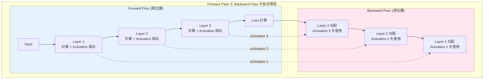

**メモリの課題**

Backward Pass で勾配を計算するためには、Forward Pass で計算した Activation（中間結果）が必要です。しかし、すべての Activation を保持すると膨大なメモリが必要になります。

**Llama 3 70B での Activation メモリの例**
- バッチサイズ 1、シーケンス長 2048 の場合
- 1 層あたり約 1GB の Activation
- 80 層で約 80GB
- バッチサイズを増やすと線形に増加

### Activation Checkpointing（勾配チェックポイント）

::::details 解決策
Activation Checkpointing は、メモリと計算のトレードオフを調整する手法です。すべての層の Activation を保存する代わりに、一部の層のみを保存し、必要に応じて再計算します。
::::

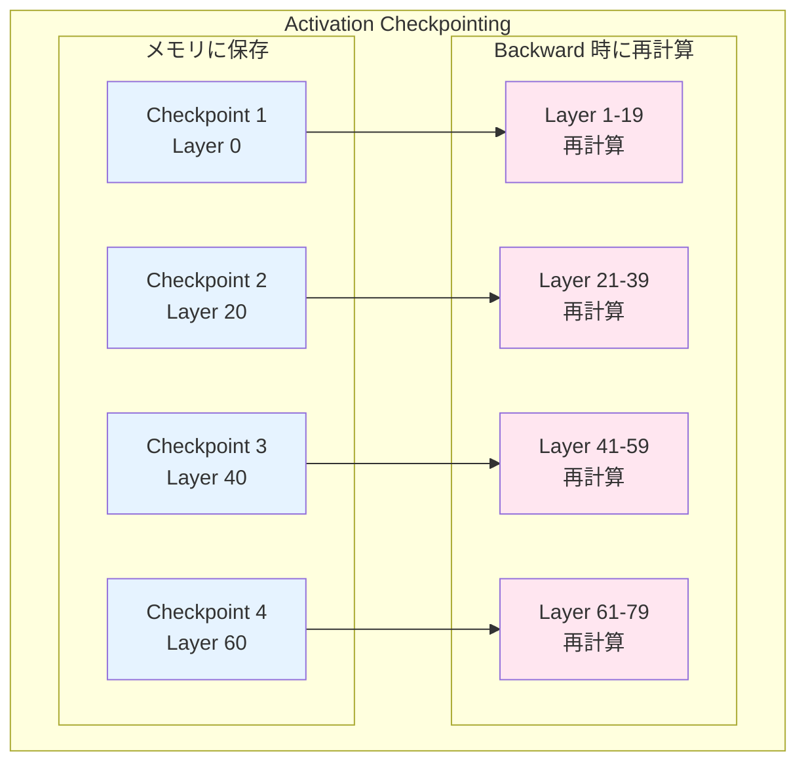

**トレードオフ**
- **メモリ削減**: 約 1/√N（N はチェックポイント数）
- **計算増加**: 約 33%（最適な分割の場合）
- 実用的には許容可能なオーバーヘッド

### 通信とメモリのボトルネック

分散学習では、以下の 2 つのボトルネックが同時に発生します。

**メモリボトルネック**
1. Parameters（モデルパラメータ）
2. Gradients（勾配）
3. Optimizer States（オプティマイザ状態）
4. Activations（中間結果）

**通信ボトルネック**
1. All-Reduce（勾配集約）
2. All-Gather（Parameter 収集、ZeRO Stage 3）
3. Reduce-Scatter（勾配分散、ZeRO Stage 2/3）
4. Point-to-Point（Pipeline Parallelism）

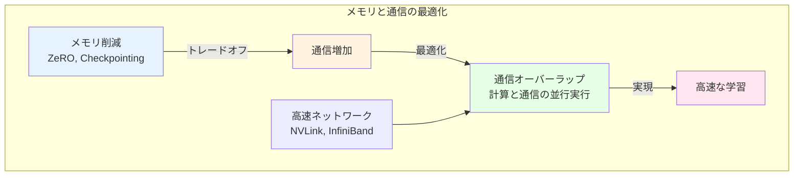

## 発展: 低レイヤーでの最適化

大規模モデル学習の効率化は、並列化手法だけでなく、CUDA Kernel レベルでの最適化も重要です。

### Kernel Fusion

::::details 概要
複数の演算を 1 つの CUDA Kernel にまとめることで、GPU メモリへのアクセス回数を削減し、性能を向上させる手法です。
::::

**標準的な実装**
```
x = input
y = LayerNorm(x)      # GPU メモリ ← 書き込み
z = GELU(y)           # GPU メモリ ← 読み込み/書き込み
output = Linear(z)    # GPU メモリ ← 読み込み
```

**Kernel Fusion 後**
```
output = FusedLayerNormGELULinear(input)  # 1回の Kernel 起動
```

メモリアクセスが削減され、2-3倍の高速化が可能です。

### FlashAttention

::::details 概要
[FlashAttention](https://arxiv.org/abs/2205.14135) は、Self-Attention の計算を大幅に効率化する手法です。メモリアクセスパターンを最適化することで、高速化とメモリ削減を同時に実現します。
::::

**標準的な Attention の問題**
- O(N²) のメモリが必要（N はシーケンス長）
- GPU の HBM（High Bandwidth Memory）への頻繁なアクセス

**FlashAttention の工夫**
1. Attention 計算をタイル（ブロック）に分割
2. GPU の SRAM（高速メモリ）を活用
3. タイルごとに計算を完了してから次のタイルへ
4. 中間結果を HBM に書き戻さない

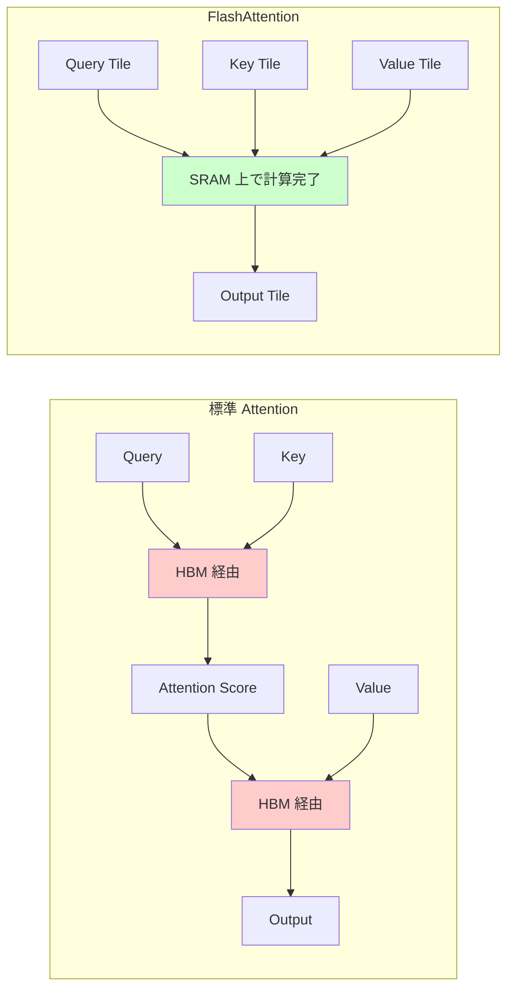

**効果**
- 2-4倍の高速化
- メモリ使用量の削減
- より長いシーケンスの処理が可能

::::details 参考情報
- [FlashAttention 論文](https://arxiv.org/abs/2205.14135)
- [FlashAttention-2](https://arxiv.org/abs/2307.08691)
- [FlashAttention GitHub](https://github.com/Dao-AILab/flash-attention)
::::

### その他の最適化手法

::::details Mixed Precision Training
FP32（単精度）と FP16/BF16（半精度）を組み合わせることで、メモリ使用量を削減しながら学習の安定性を保つ手法です。

**仕組み**
1. Forward/Backward は FP16/BF16 で実行
2. Parameters の Master Copy は FP32 で保持
3. Gradient Scaling で数値の安定性を確保

**効果**
- メモリ使用量が約半分
- 計算速度が 2-3倍（Tensor Core 活用）
::::

::::details Gradient Accumulation
バッチサイズを疑似的に大きくする手法です。複数の小さなバッチで勾配を計算・蓄積し、まとめてパラメータを更新します。

**メリット**
- GPU メモリが限られていても大きなバッチサイズ相当の学習が可能
- 学習の安定性向上

**トレードオフ**
- パラメータ更新の頻度が下がる
- 収束までのステップ数は変わらない
::::

## まとめ

本章では、大規模基盤モデル学習を実現するためのマルチ GPU 処理手法について整理しました。

**重要なポイント**

1. **並列化手法の理解**
   - Data Parallelism、Pipeline Parallelism、Tensor Parallelism、Hybrid Parallelism
   - それぞれにトレードオフがあり、状況に応じた選択が重要

2. **ZeRO によるメモリ最適化**
   - Stage 1-3 で段階的にメモリを削減
   - 通信量とのトレードオフを理解する

3. **フレームワークの選択**
   - モデルサイズ、GPU 数、要求される効率に応じて適切なフレームワークを選択
   - PyTorch DDP、DeepSpeed、Megatron-LM など

4. **技術的課題への対処**
   - Backpropagation の双方向依存性
   - Activation Checkpointing によるメモリ削減
   - 通信と計算のオーバーラップ

5. **低レイヤーでの最適化**
   - Kernel Fusion、FlashAttention などの CUDA レベルの最適化
   - Mixed Precision Training、Gradient Accumulation

これらの技術を組み合わせることで、数千から数万の GPU を使用した超大規模モデルの学習が実現可能になります。

::::details 参考資料

**分散学習の基礎**
- [PyTorch Distributed Overview](https://docs.pytorch.org/tutorials/beginner/dist_overview.html)
- [Colossal-AI: Distributed Training](https://colossalai.org/docs/concepts/distributed_training)
- [Colossal-AI: Paradigms of Parallelism](https://colossalai.org/docs/concepts/paradigms_of_parallelism)

**並列化手法**
- [A Beginner-Friendly Guide to Multi-GPU Model Training](https://www.dailydoseofds.com/a-beginner-friendly-guide-to-multi-gpu-model-training/)
- [Turing Motors: 分散学習の基礎](https://zenn.dev/turing_motors/articles/d00c46a79dc976)
- [Turing Motors: Pipeline Parallelism](https://zenn.dev/turing_motors/articles/0e6e2baf72ebbc)
- [Turing Motors: Tensor Parallelism](https://zenn.dev/turing_motors/articles/04c1328bf6095a)
- [Turing Motors: ZeRO の詳細](https://zenn.dev/turing_motors/articles/da7fa101ecb9a1)

**DeepSpeed と ZeRO**
- [DeepSpeed 公式サイト](https://www.deepspeed.ai/)
- [DeepSpeed ブログ](https://www.deepspeed.ai/posts/)
- [DeepSpeed 概要（日本語 PDF）](https://www.deepspeed.ai/assets/files/DeepSpeed_Overview_Japanese_2023Jun7th.pdf)
- [ZeRO: Memory Optimizations Toward Training Trillion Parameter Models](https://arxiv.org/abs/1910.02054)

**Megatron-LM**
- [Megatron-LM: Training Multi-Billion Parameter Language Models Using Model Parallelism](https://arxiv.org/abs/1909.08053)
- [Efficient Large-Scale Language Model Training on GPU Clusters](https://arxiv.org/abs/2104.04473)

**Pipeline Parallelism**
- [GPipe: Easy Scaling with Micro-Batch Pipeline Parallelism](https://arxiv.org/abs/1811.06965)
- [PipeDream: Generalized Pipeline Parallelism for DNN Training](https://arxiv.org/abs/1806.03377)

**最適化手法**
- [FlashAttention: Fast and Memory-Efficient Exact Attention with IO-Awareness](https://arxiv.org/abs/2205.14135)
- [FlashAttention-2: Faster Attention with Better Parallelism and Work Partitioning](https://arxiv.org/abs/2307.08691)
- [Mixed Precision Training (NVIDIA)](https://docs.nvidia.com/deeplearning/performance/mixed-precision-training/index.html)

**Monarch**
- [Monarch に関する Zenn スクラップ](https://zenn.dev/tosshi/scraps/d36bb9b3168809)

**その他の有用な資料**
- [ARISE Analytics: 生成 AI の分散学習技術入門](https://www.ariseanalytics.com/tech-info/20231210)

::::


---


# NVIDIA NeMo Megatron Bridge 完全ガイド

## 📋 目次

1. [概要](#概要)
2. [PyTorch、Hugging Face、Megatronの関係](#pytorch-hugging-face-megatronの関係)
3. [NeMo Megatron Bridgeの詳細](#nemo-megatron-bridgeの詳細)
4. [主要機能](#主要機能)
5. [サポートモデル](#サポートモデル)
6. [使用例](#使用例)
7. [技術的詳細](#技術的詳細)
8. [パフォーマンス](#パフォーマンス)
9. [比較表](#比較表)
10. [まとめ](#まとめ)
11. [参考リンク](#参考リンク)

---

## 概要

**NeMo Megatron Bridge**は、NeMo Framework内のPyTorchネイティブなライブラリで、大規模言語モデル（LLM）とビジョン言語モデル（VLM）のプリトレーニング、教師あり微調整（SFT）、LoRAをサポートしています。

### 主な目的

1. **🤗 Hugging FaceとMegatron Core間の橋渡し**
   - 双方向のチェックポイント変換を提供
   - 他のプロジェクトがMegatron Coreの並列化機能を活用可能に
   - 検証メカニズムにより変換精度を保証

2. **高性能なトレーニング基盤**
   - Megatron Coreを活用した最先端のトレーニングスループット
   - テンソル並列化とパイプライン並列化をサポート
   - 混合精度（FP8, BF16, FP4など）に対応

---

## PyTorch、Hugging Face、Megatronの関係

### 階層構造

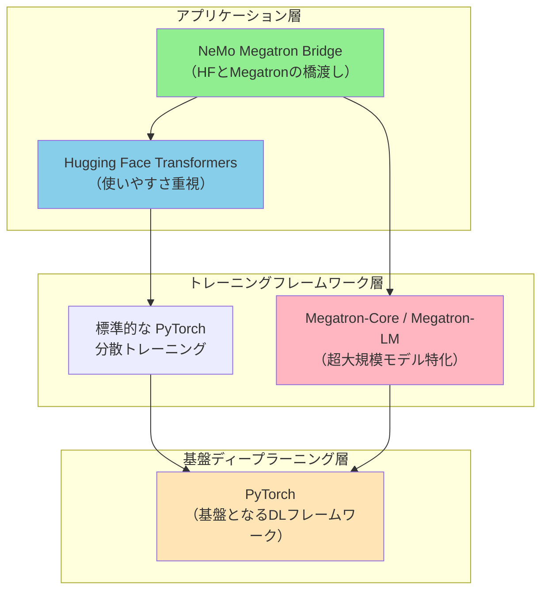

### 各層の役割

#### 1️⃣ PyTorch（基盤層）

**役割**: ディープラーニングの基盤フレームワーク

- **提供するもの**:
  - テンソル演算（GPU対応）
  - 自動微分（Autograd）
  - ニューラルネットワークの基本構成要素（nn.Module）
  - 基本的な分散トレーニング機能（DDP, FSDP）

- **特徴**:
  - Pythonネイティブで使いやすい
  - 研究者に人気（柔軟性が高い）
  - 基本的な分散トレーニングは可能だが、超大規模モデルには限界がある

**例**:
```python
import torch
import torch.nn as nn

# 基本的なニューラルネットワーク
class SimpleModel(nn.Module):
    def __init__(self):
        super().__init__()
        self.linear = nn.Linear(768, 768)
    
    def forward(self, x):
        return self.linear(x)
```

#### 2️⃣ Hugging Face Transformers（使いやすさ重視）

**役割**: Transformerモデルのエコシステム

- **提供するもの**:
  - 事前学習済みモデルの巨大なHub（モデルの"GitHub"）
  - 簡単に使えるAPI（`from_pretrained`で数行でモデル読み込み）
  - トークナイザー、データセット、トレーニングユーティリティ
  - 推論に最適化された設計

- **特徴**:
  - **使いやすさ最優先**: 研究者やエンジニアが素早くプロトタイプを作成できる
  - **標準化**: 異なるモデル（BERT, GPT, T5など）を統一インターフェースで扱える
  - **コミュニティ**: 10万以上のモデルが共有されている
  - **制約**: 超大規模モデル（100B+パラメータ）のトレーニングには不向き

**例**:
```python
from transformers import AutoModelForCausalLM, AutoTokenizer

# たった2行でモデルを読み込める
model = AutoModelForCausalLM.from_pretrained("meta-llama/Llama-3.2-1B")
tokenizer = AutoTokenizer.from_pretrained("meta-llama/Llama-3.2-1B")

# 推論も簡単
outputs = model.generate(**tokenizer("Hello", return_tensors="pt"))
```

#### 3️⃣ Megatron-LM / Megatron-Core（超大規模特化）

**役割**: 超大規模モデルの効率的なトレーニング

- **提供するもの**:
  - **テンソル並列化（Tensor Parallelism, TP)**: モデルの層を複数GPUに分割
  - **パイプライン並列化（Pipeline Parallelism, PP)**: 層を縦に分割
  - **エキスパート並列化（Expert Parallelism, EP)**: MoEモデル用
  - **シーケンス並列化、コンテキスト並列化**など高度な並列化技術
  - メモリ最適化技術（勾配チェックポイント、FP8など）

- **特徴**:
  - **スケール重視**: 数千GPUでの超大規模トレーニングに最適化
  - **高スループット**: 準線形スケーラビリティ（GPUを増やせば性能もほぼ比例）
  - **複雑**: 設定が難しく、専門知識が必要
  - **NVIDIAが開発**: GPT-3、ChatGPTの基盤モデルのトレーニングに使用

**並列化の例**:
```
モデルが大きすぎて1つのGPUに載らない場合:

[テンソル並列化 (TP)]
   層の重み行列を横に分割
   GPU1: [W の前半]
   GPU2: [W の後半]
   → 計算結果を統合

[パイプライン並列化 (PP)]
   層を縦に分割
   GPU1: [Layer 0-11]
   GPU2: [Layer 12-23]
   GPU3: [Layer 24-35]
   → パイプライン的に処理
```

#### 4️⃣ NeMo Megatron Bridge（橋渡し役）

**役割**: Hugging FaceとMegatronの"翻訳者"

### 解決する問題

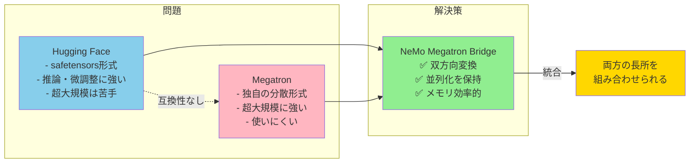

---

## NeMo Megatron Bridgeの詳細

### アーキテクチャ

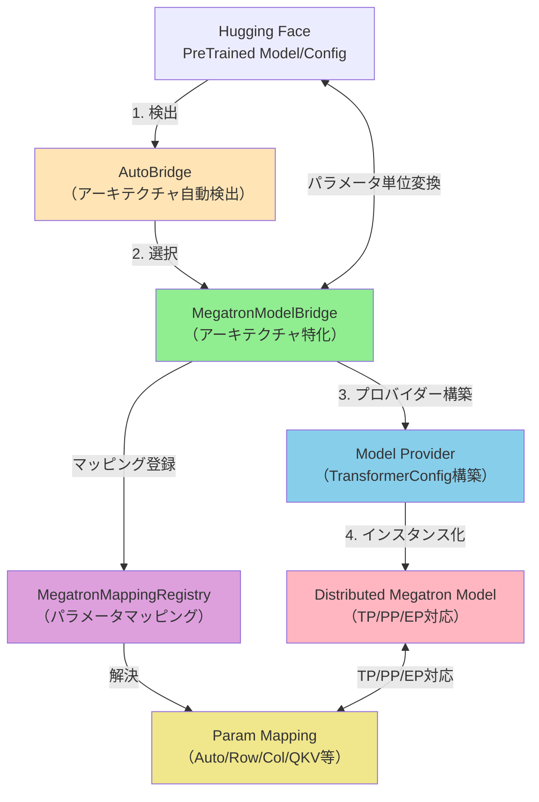

### 変換ワークフロー

```mermaid
sequenceDiagram
    participant User
    participant AutoBridge
    participant Bridge as MegatronModelBridge
    participant Registry as MappingRegistry
    participant Model as Megatron Model(s)
    
    User->>AutoBridge: from_hf_pretrained(path)
    AutoBridge->>Bridge: アーキテクチャ検出・選択
    
    Note over User,Model: HF → Megatron 変換
    
    User->>AutoBridge: load_hf_weights(model)
    AutoBridge->>Bridge: load_hf_weights(model)
    Bridge->>Model: パラメータ列挙（全PP rank）
    Bridge->>Bridge: グローバル名を収集・ソート
    
    loop 各Megatronパラメータ
        Bridge->>Registry: マッピング解決
        Registry-->>Bridge: マッピング返却
        Bridge->>Bridge: HFテンソル取得（safetensors）
        Bridge->>Bridge: 変換（QKV/MLP/Row/Col等）
        Bridge->>Model: TP/EP scatter、PP broadcast
        Bridge->>Model: 宛先テンソルにコピー
    end
    
    Bridge-->>User: ウェイト読み込み完了
    
    Note over User,Model: Megatron → HF 変換
    
    User->>AutoBridge: save_hf_pretrained(model, path)
    AutoBridge->>Bridge: export_hf_weights(model)
    
    loop 各Megatronパラメータ
        Bridge->>Model: PP所有rankから読み取り
        Bridge->>Model: TP/EP gather
        Bridge->>Bridge: 逆変換（split QKV/MLP等）
        Bridge-->>User: (hf_name, tensor) yield
    end
    
    Bridge-->>User: エクスポート完了
```

---

## 主要機能

### 🚀 1. Hugging Faceとの統合

- ✅ シームレスな双方向変換（HF ⇔ Megatron）
- ✅ 中間チェックポイント不要のオンライン変換
- ✅ 並列化を考慮した変換（TP/PP/VPP/CP/EP/ETP）
- ✅ メモリ効率的なパラメータ単位のストリーミング
- ✅ AutoBridge APIによる自動アーキテクチャ検出
- ✅ Transformer Engine使用時の最適化パス

### 🛠️ 2. 柔軟なカスタマイズ

- 軽量なカスタムトレーニングループ
- データローディング、分散トレーニング、チェックポイント、評価、ロギングのカスタマイズが容易
- PyTorchネイティブな設計

### 🎓 3. ファインチューニング（SFT & PEFT）

- Megatronベースモデル専用のSFT実装
- LoRA、DoRAなどのPEFT手法をサポート
- ユーザー定義のPEFTメソッドも可能

### 📚 4. 最先端のトレーニングレシピ

- Llama 3などの人気モデル向けに最適化されたレシピ
- 本番環境対応の設定とハイパーパラメータ
- YAML駆動のワークフローサポート

### ⚡ 5. パフォーマンス最適化

- FP8トレーニングのビルトインサポート
- モデル並列化とメモリ効率化技術
- 通信オーバーラップ最適化
- 数千ノードへの準線形スケーラビリティ

---

## サポートモデル

### 大規模言語モデル（LLM）

| モデルファミリー | チェックポイント変換 | プリトレーニングレシピ | SFT & LoRAレシピ |
|-----------------|---------------------|----------------------|------------------|
| **Llama 2** | ✅ | ✅ (7B) | Coming soon |
| **Llama 3** | ✅ | ✅ (8B/70B) | ✅ (8B/70B) |
| **Llama 3.1** | ✅ | ✅ (8B/70B/405B) | ✅ (8B/70B/405B) |
| **Llama 3.2** | ✅ | ✅ (1B/3B) | ✅ (1B/3B) |
| **Llama 3.3** | ✅ | Coming soon | Coming soon |
| **Qwen2** | ✅ | ✅ (500M-72B) | ✅ (500M-72B) |
| **Qwen2.5** | ✅ | ✅ (500M-72B) | ✅ (500M-72B) |
| **Qwen3** | ✅ | ✅ (600M-32B) | ✅ (600M-32B) |
| **Qwen3-MoE** | ✅ | ✅ (A3B/A22B) | ✅ (A3B/A22B) |
| **DeepSeek V2** | ✅ | ✅ (v2) | Coming soon |
| **DeepSeek V3** | ✅ | ✅ (v3) | Coming soon |
| **Gemma 3** | ✅ | ✅ (1B) | ✅ (1B) |
| **GLM-4.5** | ✅ | ✅ (106B/355B) | ✅ (106B/355B) |
| **Mistral** | ✅ | Coming soon | Coming soon |
| **Ministral** | ✅ | ✅ (3B/8B/14B) | ✅ (3B/8B/14B) |
| **Nemotron-3** | ✅ | ✅ (A3B) | ✅ (A3B) |
| **OlMoE** | ✅ | ✅ (7B) | ✅ (7B) |

### ビジョン言語モデル（VLM）

- **Gemma 3-VL**: ✅ (4B/12B/27B) - SFT & LoRA
- **Qwen2.5-VL**: ✅ (3B/7B/32B/72B) - SFT & LoRA
- **Qwen3-VL**: ✅ (8B/A3B-A30B-MoE) - SFT & LoRA
- **Nemotron Nano v2 VL**: ✅ (9B/12B) - SFT & LoRA

---

## 使用例

### 1. 変換のみのクイックスタート

```python
from megatron.bridge import AutoBridge

# 1) HFモデルからブリッジを作成
bridge = AutoBridge.from_hf_pretrained(
    "meta-llama/Llama-3.2-1B", 
    trust_remote_code=True
)

# 2) Megatronプロバイダーを取得し並列化を設定
provider = bridge.to_megatron_provider()
provider.tensor_model_parallel_size = 1
provider.pipeline_model_parallel_size = 1
provider.finalize()

# 3) Megatron Coreモデルをインスタンス化
model = provider.provide_distributed_model(wrap_with_ddp=False)

# 4a) Megatron → Hugging Face へエクスポート（完全なHFフォルダ）
bridge.save_hf_pretrained(model, "./hf_exports/llama32_1b")

# 4b) またはウェイトのみストリーミング
for name, weight in bridge.export_hf_weights(model, cpu=True):
    print(name, tuple(weight.shape))
```

### 2. トレーニングのクイックスタート

```python
from megatron.bridge.recipes.llama import llama32_1b_pretrain_config
from megatron.bridge.training.gpt_step import forward_step
from megatron.bridge.training.pretrain import pretrain

if __name__ == "__main__":
    # Llama 3.2 1Bモデル設定を使用
    cfg = llama32_1b_pretrain_config(seq_length=1024)
    
    # トレーニングパラメータをオーバーライド
    cfg.train.train_iters = 10
    cfg.scheduler.lr_decay_iters = 10000
    cfg.model.vocab_size = 8192
    cfg.tokenizer.vocab_size = cfg.model.vocab_size
    
    pretrain(cfg, forward_step)
```

**起動コマンド**:
```bash
torchrun --nproc-per-node=8 /path/to/script.py
```

### 3. 実際のワークフロー例

```mermaid
graph TD
    A["1. Hugging Face<br/>モデル選択:<br/>Llama-3.1-70B"] --> B["2. NeMo Bridge<br/>HF → Megatron変換<br/>TP=8, PP=4<br/>（32GPU使用）"]
    B --> C["3. Megatron<br/>効率的な大規模トレーニング<br/>- FP8混合精度<br/>- 最適化された通信<br/>- 高スループット"]
    C --> D["4. NeMo Bridge<br/>Megatron → HF変換"]
    D --> E["5. Hugging Face<br/>推論エンジンで展開<br/>- vLLM<br/>- TensorRT-LLM<br/>- ONNX Runtime"]
    
    style A fill:#87CEEB
    style B fill:#90EE90
    style C fill:#FFB6C1
    style D fill:#90EE90
    style E fill:#87CEEB
```

---

## 技術的詳細

### 変換アーキテクチャの特徴

#### 1. パラメータ単位のストリーミング
- 現在処理中のウェイトのみをメモリに保持
- 完全なモデルのロードは不要
- メモリ効率的な変換を実現

#### 2. 並列化対応
- **TP（テンソル並列化）**: 重み行列を分割
- **PP（パイプライン並列化）**: 層を縦に分割
- **EP（エキスパート並列化）**: MoEモデルの専門家を分散
- **VPP（仮想パイプライン並列化）**: より細かい粒度での分割
- **CP（コンテキスト並列化）**: シーケンス長の分割

#### 3. 決定論的マッピング
- ワイルドカードサポートを含む名前解決
- MegatronMappingRegistryによる一元管理
- グローバルな順序を保証

#### 4. 型変換とFP8サポート
- HFとMegatronのdtype間で自動変換
- エクスポート時のFP8逆量子化
- 警告を伴う安全な型変換

### パラメータマッピングの種類

```mermaid
graph TB
    subgraph Mappings["パラメータマッピングの種類"]
        Auto["AutoMapping<br/>（自動検出・汎用1:1）"]
        Column["ColumnParallelMapping<br/>（出力次元で分割）"]
        Row["RowParallelMapping<br/>（入力次元で分割）"]
        QKV["QKVMapping<br/>（Q, K, V統合/分割）"]
        Gated["GatedMLPMapping<br/>（gate, up統合/分割）"]
        Replicated["ReplicatedMapping<br/>（完全複製）"]
    end
    
    Auto --> Column
    Auto --> Row
    Auto --> Replicated
    
    style Auto fill:#FFE4B5
    style Column fill:#90EE90
    style Row fill:#87CEEB
    style QKV fill:#DDA0DD
    style Gated fill:#F0E68C
    style Replicated fill:#FFB6C1
```

#### 各マッピングの詳細

1. **AutoMapping**: 
   - レイヤー/モジュールタイプに基づいて自動的にColumn/Row/Replicatedに振り分け
   - ワイルドカードサポート

2. **ColumnParallelMapping**: 
   - 出力次元（dim 0）で分割
   - 例: 線形層の出力投影

3. **RowParallelMapping**: 
   - 入力次元（dim 1）で分割
   - 例: アテンションの出力投影

4. **QKVMapping**: 
   - HFの独立したQ, K, V投影をMegatronのインターリーブQKV形式に統合
   - 逆変換も対応

5. **GatedMLPMapping**: 
   - gateとup投影を連結/分割
   - Llama、Mistralなどで使用

6. **ReplicatedMapping**: 
   - TPランク全体で完全複製
   - 例: LayerNorm、埋め込み層

### 変換プロセス（ColumnParallelMappingの例）

```mermaid
sequenceDiagram
    participant HF as Hugging Face
    participant R0 as TP Rank 0
    participant R1 as TP Rank 1
    participant R2 as TP Rank 2
    participant R3 as TP Rank 3
    
    Note over HF,R3: HF → Megatron (import)
    
    HF->>R0: 完全なテンソル読み込み
    R0->>R0: dim 0で分割（4つのチャンク）
    R0->>R0: チャンク 0 保持
    R0->>R1: チャンク 1 送信
    R0->>R2: チャンク 2 送信
    R0->>R3: チャンク 3 送信
    
    Note over HF,R3: Megatron → HF (export)
    
    Note over R0,R3: 所有PP stageが全PPランクにブロードキャスト
    
    R0->>R0: ローカルシャード準備
    R1->>R1: ローカルシャード準備
    R2->>R2: ローカルシャード準備
    R3->>R3: ローカルシャード準備
    
    R0->>R0: all_gather開始
    R1->>R0: シャード送信
    R2->>R0: シャード送信
    R3->>R0: シャード送信
    
    R0->>R0: dim 0で連結
    R0->>HF: 完全なテンソル書き出し
```

---

## パフォーマンス

### ベンチマーク環境

NVIDIAの公式ドキュメントでは、以下のシステムでのパフォーマンスベンチマークが提供されています：

- **DGX-GB200**: 最新のBlackwellアーキテクチャ
- **DGX-B200**: Blackwell GPU搭載
- **DGX-H100**: Hopper GPU搭載

### スケーラビリティ

- **準線形スケーラビリティ**: GPUを増やすとスループットもほぼ比例して向上
- **数千ノード対応**: 超大規模トレーニングに最適化
- **高GPU利用率**: 最適化された通信とメモリ管理

### 最適化技術

1. **混合精度トレーニング**
   - FP8: 最高の効率
   - BF16: バランス型
   - FP4: 極限の圧縮

2. **通信オーバーラップ**
   - 計算と通信を並行実行
   - レイテンシの隠蔽

3. **メモリ最適化**
   - 勾配チェックポイント
   - アクティベーション再計算
   - メモリ効率的なアテンション

4. **カーネル最適化**
   - Transformer Engine統合
   - FlashAttentionサポート
   - カスタムCUDAカーネル

---

## プロジェクト構造

```
Megatron-Bridge/
├── examples/
│   ├── models/              # Bridgeの使用例
│   └── recipes/             # トレーニングサンプル
├── src/megatron/bridge/
│   ├── data/                # データローダーとイテレーター
│   ├── models/              # HF Bridge基盤とモデル固有実装
│   │   ├── llama/           # Llamaモデルプロバイダー
│   │   ├── qwen/            # Qwenモデルプロバイダー
│   │   └── .../             # その他のモデル
│   ├── peft/                # PEFT変換とラッパー
│   ├── recipes/             # 完全なトレーニングレシピ
│   ├── training/            # トレーニングループコンポーネント
│   │   ├── tokenizers/      # トークナイザーライブラリ
│   │   └── utils/           # トレーニング固有ユーティリティ
│   └── utils/               # リポジトリ全体用の汎用ユーティリティ
└── tests/                   # 包括的なテストスイート
```

---

## コミュニティと採用事例

### 🌟 最近の成果

- **Mind Lab**: 64台のH800で兆パラメータモデルのGRPO LoRAトレーニングに成功
- **Nemotron-3-Nano-30B-A3B-FP8**: Day 0サポート（2025/12/15）

### 🤝 コミュニティ採用

1. **veRL**: Megatron-Coreへのコネクタとして採用
2. **slime**: Megatron-Coreチェックポイントコンバーターとして採用
3. **SkyRL**: Megatron-Coreコネクタとして採用、Megatron-Bridgeへ移行中
4. **Nemo-RL**: Megatron-Coreコネクタとして採用

### 🙏 コミュニティコントリビューション

特別な感謝：
- **Guanyou He** および **Junyu Wu** (Weixin Group Infrastructure Center)

---

## 比較表

### PyTorch、Hugging Face、Megatron、NeMo Bridgeの比較

| 特徴 | PyTorch | Hugging Face | Megatron | NeMo Bridge |
|-----|---------|-------------|----------|-------------|
| **主な用途** | DL基盤 | プロトタイプ<br/>推論 | 超大規模<br/>トレーニング | HF⇔Megatron<br/>変換 |
| **使いやすさ** | ⭐⭐⭐ | ⭐⭐⭐⭐⭐ | ⭐⭐ | ⭐⭐⭐ |
| **スケール性** | ⭐⭐⭐ | ⭐⭐ | ⭐⭐⭐⭐⭐ | - |
| **モデルHub** | - | ⭐⭐⭐⭐⭐<br/>(10万以上) | - | 両方使える |
| **学習曲線** | 緩やか | 非常に緩やか | 急 | 中程度 |
| **並列化** | DDP/FSDP | 基本的 | TP/PP/EP<br/>VPP/CP | TP/PP/EP対応 |
| **最大モデルサイズ** | 〜10B | 〜70B | 数千B+ | 変換のみ |
| **GPU効率** | ⭐⭐⭐ | ⭐⭐ | ⭐⭐⭐⭐⭐ | - |
| **コミュニティ** | 巨大 | 巨大 | 専門家向け | 成長中 |
| **企業サポート** | Meta | Hugging Face | NVIDIA | NVIDIA |
| **適用場面** | 研究・開発 | プロトタイプ<br/>推論展開 | 大規模<br/>トレーニング | 両方の統合 |

### 使用シーンごとの推奨

```mermaid
graph TD
    Start["モデルトレーニングの要件"]
    
    Start --> Q1{"モデルサイズは?"}
    
    Q1 -->|< 10B| Small["小〜中規模モデル"]
    Q1 -->|10B-70B| Medium["中〜大規模モデル"]
    Q1 -->|> 70B| Large["超大規模モデル"]
    
    Small --> HF_Simple["Hugging Face Transformers<br/>✅ 最も簡単<br/>✅ 迅速な開発"]
    
    Medium --> Q2{"利用可能なGPU数は?"}
    Q2 -->|1-8| HF_Med["Hugging Face + FSDP<br/>⚠️ メモリに注意"]
    Q2 -->|8+| Bridge_Med["NeMo Bridge + Megatron<br/>✅ より効率的"]
    
    Large --> Bridge_Large["NeMo Bridge + Megatron<br/>✅ 必須の選択肢<br/>✅ 最高のスケーラビリティ"]
    
    style HF_Simple fill:#87CEEB
    style HF_Med fill:#87CEEB
    style Bridge_Med fill:#90EE90
    style Bridge_Large fill:#90EE90
```

---

## まとめ

### 🎯 重要なポイント

1. **PyTorch**: すべての基盤となるディープラーニングフレームワーク
   - テンソル演算、自動微分、基本的な分散トレーニング機能を提供
   - 柔軟で使いやすいが、超大規模モデルには限界がある

2. **Hugging Face**: 使いやすさとコミュニティを重視
   - 10万以上の事前学習済みモデル
   - 統一されたAPI、簡単なプロトタイピング
   - 推論・微調整に最適だが、100B+パラメータのトレーニングには不向き

3. **Megatron**: 超大規模モデルのトレーニングに特化
   - 高度な並列化技術（TP/PP/EP/VPP/CP）
   - 準線形スケーラビリティ、数千GPU対応
   - 最高のスループットだが、設定が複雑

4. **NeMo Megatron Bridge**: HFとMegatronの「通訳」
   - 双方向変換、並列化を保持
   - パラメータ単位のストリーミングでメモリ効率的
   - 両者の強みを組み合わせられる

### 💡 使い分けのガイドライン

**Hugging Faceを選ぶべき場合:**
- プロトタイプを素早く作りたい
- モデルサイズが10B未満
- コミュニティモデルを活用したい
- 推論に重点を置いている

**Megatron + Bridgeを選ぶべき場合:**
- モデルサイズが70B以上
- 複数GPUノードでのトレーニングが必要
- 最高のトレーニングスループットが必要
- 大規模な本番環境でのトレーニング

**理想的なワークフロー:**
1. Hugging Faceで実験・プロトタイピング
2. NeMo Bridgeで変換
3. Megatronで大規模トレーニング
4. NeMo Bridgeで再変換
5. Hugging Faceエコシステムで推論展開

### 🔄 これらは競合ではなく補完関係

```mermaid
mindmap
  root((AI/ML<br/>エコシステム))
    PyTorch
      基盤フレームワーク
      柔軟性
      研究者に人気
    Hugging Face
      使いやすさ
      コミュニティ
      モデルHub
      推論最適化
    Megatron
      超大規模
      並列化
      スケーラビリティ
      本番トレーニング
    NeMo Bridge
      相互運用性
      変換
      統合
      両方の長所
```

### 🚀 今後の展望

NeMo Megatron Bridgeは、以下の点で AI/ML エコシステムにおいて重要な役割を果たしています：

1. **オープンサイエンスの促進**: HFの豊富なモデルをMegatronでトレーニング可能に
2. **技術の民主化**: 超大規模トレーニングへのアクセスを容易に
3. **エンタープライズ対応**: 本番環境でのスケーラブルなトレーニング
4. **イノベーションの加速**: 研究から本番へのパスを短縮

---

## 参考リンク

### 📚 公式ドキュメント

- **NeMo Megatron Bridge**
  - [GitHub Repository](https://github.com/NVIDIA-NeMo/Megatron-Bridge)
  - [公式ドキュメント](https://docs.nvidia.com/nemo/megatron-bridge/latest/)
  - [変換技術詳細](https://docs.nvidia.com/nemo/megatron-bridge/latest/bridge-tech-details.html)

- **Hugging Face**
  - [Transformers Documentation](https://huggingface.co/docs/transformers)
  - [Model Hub](https://huggingface.co/models)

- **Megatron-LM**
  - [GitHub Repository](https://github.com/NVIDIA/Megatron-LM)
  - [Megatron-Core](https://github.com/NVIDIA/Megatron-Core)

- **PyTorch**
  - [PyTorch Documentation](https://pytorch.org/docs/)
  - [Distributed Training](https://pytorch.org/tutorials/beginner/dist_overview.html)

### 🎓 チュートリアルとガイド

- [NeMo Bridge クイックスタート](https://docs.nvidia.com/nemo/megatron-bridge/latest/#quickstart)
- [Using Recipes Guide](https://docs.nvidia.com/nemo/megatron-bridge/latest/recipes.html)
- [Performance Summary](https://docs.nvidia.com/nemo/megatron-bridge/latest/performance.html)

### 🌟 コミュニティリソース

- [Mind Lab Tech Blog - GRPO LoRA Training](https://mindcorner.com/grpo-lora-trillion-parameter-model)
- [NeMo Framework User Guide](https://docs.nvidia.com/nemo-framework/user-guide/)

### 🐳 コンテナイメージ

```bash
# NeMo Framework コンテナ
docker pull nvcr.io/nvidia/nemo:${TAG}

# Nemotron-3-Nano 用カスタムコンテナ
docker pull nvcr.io/nvidia/nemo:25.11.nemotron_3_nano
```

### 💻 インストール

```bash
# Hugging Face CLI
pip install huggingface_hub
huggingface-cli login

# NeMo Megatron Bridge (開発版)
git clone https://github.com/NVIDIA-NeMo/Megatron-Bridge
cd Megatron-Bridge
pip install -e .
```

---

**作成日**: 2025年12月19日  
**バージョン**: 1.0  
**調査対象**: NVIDIA NeMo Megatron Bridge (GitHub: NVIDIA-NeMo/Megatron-Bridge)

このドキュメントは、NeMo Megatron Bridgeの公式ドキュメントとGitHubリポジトリの情報に基づいて作成されました。最新情報については、上記の公式リンクを参照してください。
