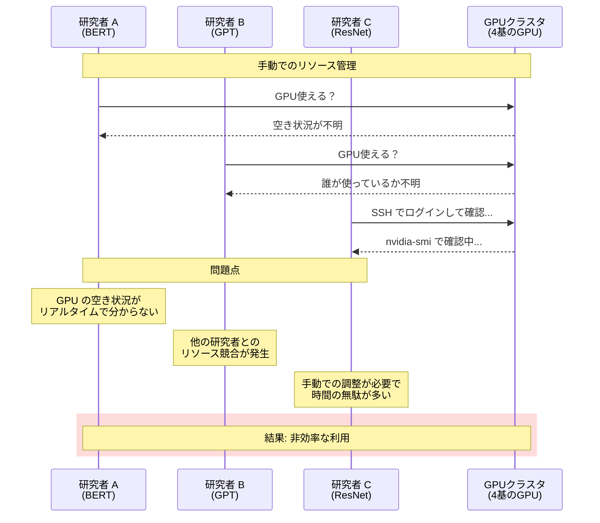
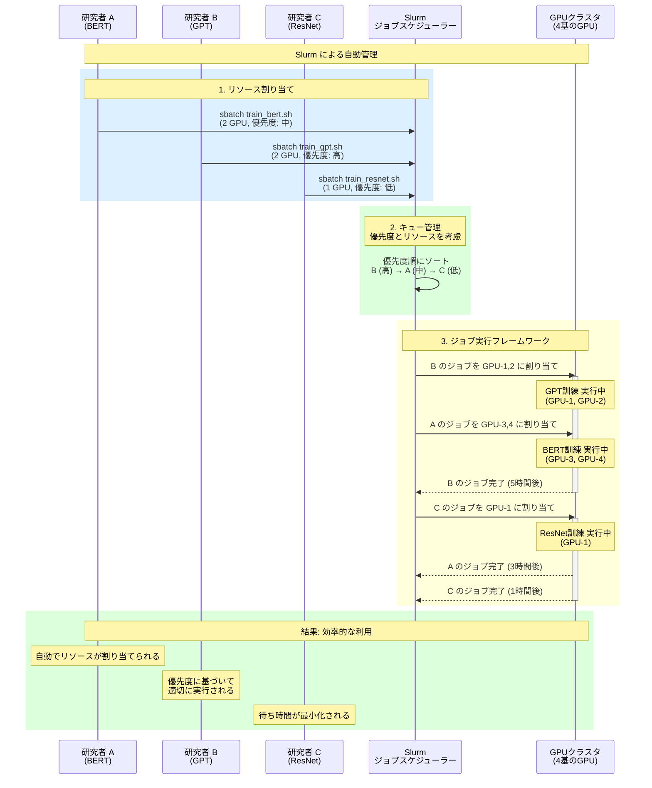
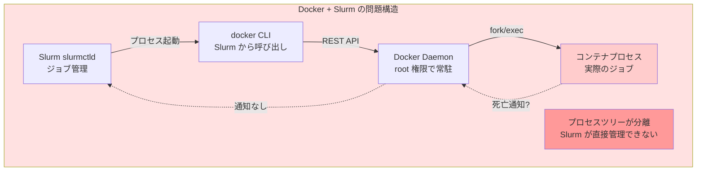
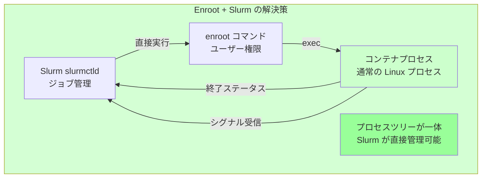

::::details 前提
:::message
**対象読者**: 大規模基盤モデルがどういうものかを理解している方、これからモデル学習を行う方
:::
:::message
**ライセンス**: © 2025 littlemex.
本文および自作図表: CC BY 4.0
※公式ドキュメントからの引用や翻訳部分は原典の著作権に従います。
引用画像: 各画像の出典に記載されたライセンスに従います。
:::
:::message
一部 AI を用いて文章を作成します。レビューは実施しますが、見逃せない重大な間違いなどがあれば[こちらのIssue](https://github.com/littlemex/samples/issues)から連絡をお願いします。
:::
::::

**本章では大規模基盤モデル学習に求められるオーケストレーションについて整理します。**

---

AWS Principle WW Solutions Architect,GenAI, Keita Watanabe さんの [Scalable Infrastructure for Large-Scale AI Training with AWS Sagemaker Hyperpod](https://speakerdeck.com/keitaw/scalable-infrastructure-for-large-scale-ai-training-with-aws-sagemaker-hyperpod-at-singapore-ai-hour) 資料の流れを参照しながら初学者向けに情報を整理します。

# オーケストレーション

:::message
***Point! 分散学習のためのインフラストラクチャをオーケストレーションする主要なツールは Slurm と kubernetes***
:::

## Slurm

[Slurm](https://slurm.schedmd.com/overview.html) は、オープンソースのジョブスケジューラー兼リソースマネージャーです。[Wikipedia](https://ja.wikipedia.org/wiki/Slurm_Workload_Manager) によると Slurmは、TOP500 の約 60% のスーパーコンピューターでワークロードマネージャーとして使用されています。

### Slurm の 3 つの主要機能

Slurm は以下の 3 つの主要機能を提供します。

**1. リソース割り当て**: 計算ノードに対する排他的または非排他的なアクセスを一定期間ユーザーに割り当て、ジョブの実行を可能にします。複数のジョブが同一リソースを要求した場合、Slurm が調停し、適切なタイミングでリソースを割り当てます。

**2. ジョブ実行フレームワーク**: 割り当てられたノード上でジョブを開始、実行、監視するためのフレームワークを提供します。並列ジョブの起動、プロセス間通信の設定、ジョブのステータス監視などを一元的に管理します。

**3. キュー管理**: 保留中のジョブをキューで管理し、リソースの競合を調停します。ジョブの優先度、ユーザーのクォータ、リソースの制約などに基づいて、実行順序を決定します。

これらの機能により、Slurm は数百から数万の GPU を含む大規模クラスタでも効率的にリソースを管理できます。

::::details Slurm の価値を具体例で確認！
## モデル学習における Slurm の実例

Slurm のメリットを理解するために、具体的にモデル学習のシナリオを見てみましょう。

**シナリオ**: 3 人の研究者が同じ GPU クラスタ（4 基の GPU）を使って、異なる機械学習モデルを学習したいと考えています。

- 研究者 A: BERT モデル（2 GPU 必要、所要時間 3 時間、優先度: 中）
- 研究者 B: GPT モデル（2 GPU 必要、所要時間 5 時間、優先度: 高）
- 研究者 C: ResNet モデル（1 GPU 必要、所要時間 1 時間、優先度: 低）

### Slurm なしの場合



この方式では、研究者が各自で GPU の空き状況を確認し、手動でジョブを開始する必要があります。これにより以下の問題が発生します。

- リソースの可視性が低く、空き GPU を見つけるのに時間がかかる
- 複数の研究者が同時に同じ GPU を使おうとして競合が発生する可能性がある
- 優先度の概念がなく、重要なジョブが待たされることがある
- GPU の利用率が低下し、アイドル時間が増える

### Slurm ありの場合



Slurm を使用することで、以下のメリットが得られます。

**リソース割り当ての自動化**: 研究者は `sbatch` コマンドでジョブを投入するだけで、Slurm が自動的に利用可能な GPU を割り当てます。手動での空き確認は不要です。

**優先度ベースのスケジューリング**: ジョブの優先度に基づいて実行順序が決定されます。この例では、優先度が高い研究者 B の GPT 訓練が最初に実行され、次に研究者 A の BERT 訓練が並行して実行されます。研究者 C の ResNet 訓練は優先度が低いため、リソースが空くまで待機します。

**並列実行の最適化**: Slurm は利用可能なリソースを最大限に活用します。この例では、4 基の GPU すべてを同時に使用し（研究者 B が 2 GPU、研究者 A が 2 GPU）、リソースのアイドル時間を最小化します。

**ジョブの自動管理**: ジョブの開始、実行、完了を Slurm が自動的に管理します。研究者 B のジョブが完了すると、待機中の研究者 C のジョブが自動的に開始されます。

**公平性の保証**: キュー管理により、すべての研究者が適切にリソースにアクセスできます。優先度、ユーザーのクォータ、過去の利用履歴などを考慮した公平な割り当てが可能です。

このように、
:::message
Slurm は大規模な GPU クラスタでも複数のユーザーが効率的にリソースを共有できる環境を提供します。手動でのリソース管理と比較して、管理の手間を大幅に削減し、GPU の利用率を向上させることができます。
:::
::::

### Slurm のアーキテクチャ


> https://slurm.schedmd.com/overview.html より引用

Slurm は中央集権型のアーキテクチャを採用しており、上図のコンポーネントで構成されます。

::::details 各コンポーネントについて

**slurmctld (中央マネージャー)**: クラスタ全体のリソースとジョブを監視する中央デーモンです。ジョブのスケジューリング、ノードの状態管理、リソース割り当ての決定などを担当します。高可用性のために、バックアップマネージャーを配置することも可能です。

**slurmd (計算ノードデーモン)**: 各計算ノードで実行されるデーモンで、リモートシェルのように動作します。ジョブの受信、実行、ステータス報告、次のジョブの待機というサイクルを繰り返します。slurmd 間は耐障害性のある階層的な通信を行います。

**slurmdbd (データベースデーモン)**: オプションのコンポーネントで、複数の Slurm クラスタのアカウンティング情報を単一のデータベースに記録します。ジョブの実行履歴、リソース使用量、課金情報などを一元管理できます。

**slurmrestd (REST API デーモン)**: オプションのコンポーネントで、REST API を通じて Slurm と対話できます。外部システムとの統合や、カスタムダッシュボードの構築に利用されます。

::::

::::details Slurm のユーザーツールとプラグインシステム

### ユーザーツール

Slurm は豊富なコマンドラインツールを提供しています。

**srun**: ジョブを投入し、実行します。並列ジョブの起動、MPI プログラムの実行、インタラクティブなシェルセッションの開始などに使用されます。

**scancel**: キューイング中または実行中のジョブを終了します。ジョブ ID や ユーザー名を指定して、特定のジョブをキャンセルできます。

**sinfo**: クラスタ全体のシステム状態を報告します。ノードの可用性、パーティションの状態、リソースの使用状況などを確認できます。

**squeue**: ジョブの状態を報告します。実行中のジョブ、キューイング中のジョブ、優先度などの情報を表示します。

**sacct**: 実行中または完了したジョブのアカウンティング情報を取得します。ジョブの実行時間、使用リソース、終了ステータスなどを確認できます。

**scontrol**: 管理者向けのツールで、クラスタの設定や状態を監視・変更します。ノードのドレイン、ジョブの優先度変更、パーティションの設定などが可能です。

**sview**: グラフィカルにシステムとジョブの状態を表示します。ネットワークトポロジーの可視化にも対応しています。

### プラグインシステム

Slurm は汎用的なプラグインメカニズムを提供しており、さまざまなインフラストラクチャに対応できます。主要なプラグインには以下があります。

**Accounting Storage**: ジョブの履歴データを保存します。SlurmDBD と組み合わせることで、リミットベースのシステムや履歴的なシステムステータスを提供できます。

**Authentication**: Slurm の各コンポーネント間の認証メカニズムを提供します。

**Generic Resources**: GPU などの汎用リソースを制御するインターフェースを提供します。

**Job Submit**: ジョブ投入時にサイト固有の要件を適用するカスタムプラグインです。

**MPI**: さまざまな MPI 実装に対応するフックを提供します。MPI 固有の環境変数の設定などが可能です。

**Priority**: ジョブの優先度を決定します。エージング、フェアシェア、QoS などの要素を組み合わせた多要素優先度アルゴリズムをサポートします。

**Scheduler**: ジョブのスケジューリング方法を決定します。バックフィルスケジューリング、ギャングスケジューリングなどが利用可能です。

**Network Topology**: ネットワークトポロジーに基づいてリソース選択を最適化します。ジョブ割り当てと高度な予約の両方に使用されます。

### Slurm の設定例

以下は Slurm の設定ファイル (`/etc/slurm.conf`) の抜粋例です。

```bash
# 中央マネージャーの設定
SlurmctldHost=linux0001  # プライマリサーバー
SlurmctldHost=linux0002  # バックアップサーバー

# 認証とプラグイン
AuthType=auth/munge
PluginDir=/usr/local/slurm/lib

# ノード設定
NodeName=DEFAULT CPUs=4 TmpDisk=16384 State=IDLE
NodeName=lx[0001-0002] State=DRAINED
NodeName=lx[0003-8000] RealMemory=2048 Weight=2
NodeName=lx[8001-9999] RealMemory=4096 Weight=6 Feature=video

# パーティション設定
PartitionName=DEFAULT MaxTime=30 MaxNodes=2
PartitionName=debug Nodes=lx[0003-0030] State=UP Default=YES
PartitionName=batch Nodes=lx[0041-9999] MaxTime=UNLIMITED MaxNodes=4096
```

この設定では、ノードをグループ化してパーティション (ジョブキュー) を定義しています。各パーティションには、ジョブの最大実行時間、最大ノード数、アクセス権限などの制約を設定できます。
::::

分散学習においては、Slurm は前章でモデル学習の並列処理手法を適用したジョブを効率的にスケジューリングし、GPU リソースを最大限に活用します。Slurm のジョブスクリプトでは、必要な GPU 数、ノード数、実行時間などを指定し、Slurm がリソースが利用可能になった時点でジョブを実行します。Slurm と並列処理手法の連携方法については別途並列処理手法の章で解説します。

## Kubernetes

Kubernetes は、ご存知の方も多いかと思いますが、コンテナ化されたアプリケーションのデプロイ、スケーリング、管理を自動化するオープンソースのコンテナオーケストレーションプラットフォームです。ここでは特に細かく説明しませんが、コンテナベースであること、宣言的な設定が可能であること、コンテナ障害検知・再スケジューリングのセルフヒーリング（k8s コアコンセプトの Reconciliation Loop による宣言的設定へのリソースの追従性）、などが特徴的です。コンテナはパフォーマンスオーバーヘッドが発生しますが、それでもエコシステムが豊富であり MLOps の仕組みを包括的に構築・提供するケースや Amazon SageMaker HyperPod のようなマネージドサービスを使うケースではリソース活用の柔軟性が向上するため非常に強力です。

## Slurm と Kubernetes の使い分け

:::message
Point! どちらかに優劣があるものではなくユースケースで選択
:::

それぞれの違いについて考察してみます。Slurm は HPC で十分な実績を持つバッチ処理システムであり、決定論的なスケジューリングとオーバーヘッドの低い学習処理を実行します。一方で Kubernetes はクラウドネイティブな動的オーケストレーターであり、そもそもは密結合ワークロードのバッチ処理を意識した存在ではありません。一方でクラウドネイティブかつオープンなスタンスから Kubernetes は AI/ML のプラットフォーム周りのエコシステムとの親和性が高いです。

Google の 130,000 ノードクラスターの[実験成功ブログ](https://cloud.google.com/blog/products/containers-kubernetes/how-we-built-a-130000-node-gke-cluster/?hl=en)、Slurm の TOP 500 での採用から考えるとクラスターのノード規模はほとんどのケースで考慮する必要がない程度には十分なサイズまで拡張が可能でしょう。オーケストレーターの仕様上は上限がない場合でも、それをマネージドとして提供する Amazon EKS、AWS ParallelCluster、Amazon SageMaker HyperPod などのクォータ制限は別で存在するため、自分たちの実現したいクラスター規模を満たせるのか、インフラストラクチャの構成やトポロジーはどのようなものに対応・最適化しているのか、などの考慮が必要でしょう。Amazon EKS は [AWS ブログ](https://aws.amazon.com/jp/blogs/news/under-the-hood-amazon-eks-ultra-scale-clusters/)で最大 10 万ノードまで対応していると言及されています。

いくつかのユースケースで使い分けを考えてみましょう。

::::details 使い分けの検討
:::message alert
個人的な勝手な考えなのであくまで参考程度で読んでください。
:::
:::message
**考慮ポイント**
- [ ] **Point 1**: 分散学習・推論、どちらのワークロードを対象とするのかを考慮
- [ ] **Point 2**: Kubernetes のキャッチアップコストを考慮
- [ ] **Point 3**: インフラストラクチャがオンプレかクラウド利用か
- [ ] **Point 4**: コンテナ統合
:::

個人の意見ですが大規模基盤モデルの学習のためだけに利用するのであれば、第一の選択肢は Slurm だと思います。比較的キャッチアップコストが低く構築も容易であることから導入・運用・キャッチアップコストが低く、決定論的なスケジューリングと密結合ワークロードでの実績があり、デフォルト状態で十分に学習のための管理機能が揃っています。特にオンプレミスの場合は GPU サーバー台数が固定であり、Kubernetes の強みとする動的ノード追加や多様なインスタンスを使い分けるといったニーズは少ないため、しっかりとした MLOps を構築するフェーズまでは Kubernetes を使う強い意義はあまりないように感じます。ただし、予備学習や動作確認、軽量な GPU 処理が必要な場合には開発環境として研究者ごとにある程度 GPU 数がスケールする環境を与えたいケースがあります。このようなケースにおいてはクラスターのノードサイズは可変の方が嬉しいケースもあり、Kubernetes の動的ノード追加や GPU Time-Slicing/MIG などの GPU の柔軟な共有が簡易に適用できることは魅力的かもしれません。組織の体制やニーズ状況に応じて柔軟に選択すべきでしょう。

大規模基盤モデルの推論のために利用する、もしくは、学習と推論を同一の環境でユーザーに提供するような場合はどうでしょうか。推論の場合は、多様なモデルをサービングする可能性があり、必要とされる GPU サーバーの種類、Spot/Ondemand などの購入タイプの違い、リクエスト不可に応じたオートスケーリング、コンテナ利用、などを考慮すると Kubernetes 一択です。クラウドの場合は、Amazon SageMaker AI の推論エンドポイントなども選択肢に入ってきます。例えば、夜間は学習バッチを回し、昼間の営業時間のみ推論が必要、といったワークロードであれば Kubernetes を利用してリソースアロケーションを夜間と昼間で柔軟に変更するような使い方をすることができ、このようなケースでは Kubernetes は良い選択肢になるでしょう。

:::message alert
コンテナをどうしても利用したい場合、Kubernetes は当然問題なく利用できますが、Slurm については注意が必要なため後述します。
:::
::::

:::message alert
Docker と Slurm は相性が悪い
:::

ということを Slurm 選定時には配慮する必要があります。

::::details 重要: Docker と Slurm のプロセス制御問題
## 問題の本質

:::message alert
Slurm は Docker daemon が異常終了しても検知できず、コンテナを正常に終了できない。
:::



### 問題ポイント

1. **プロセスツリーの分離**
   - Slurm は `docker run` コマンドを実行
   - 実際のコンテナは Docker daemon の子プロセスで Slurm のプロセスツリーに含まれない

2. **状態通知の欠如**
   - コンテナがクラッシュしても Slurm に直接通知されない
   - Docker daemon が異常終了しても検知困難

3. **ゾンビプロセスのリスク**
   - Slurm がジョブを kill しても、Docker daemon が生きていればコンテナは残る

## Slurm OCI サポートの制限

Slurm 公式ドキュメントから、この問題への対処法が明記されています。1. create/start: Slurm がコンテナの状態を常時ポーリングで確認、2. run: コンテナプロセスが直接 Slurm の子プロセスになる、の二種類の解決策があり、run 方式が推奨される。ポーリングの場合、ジョブ内で CPU リソースを消費し、ポーリング頻度によってコンテナ終了検知が遅れる可能性があります。

## Enroot による根本的解決



### Enroot の設計原則

:::message
**[公式ドキュメント](https://instinct.docs.amd.com/projects/container-toolkit/en/release-1.1.x/container-runtime/enroot-pyxis-installation.html)からの重要な記述**:
> "With Enroot, users can convert Docker images into a simple **unpacked filesystem tree** and run containers **as a regular Linux process**."
:::

つまり、
- **デーモンレス**: 常駐プロセス不要
- **直接実行**: Slurm が fork/exec で直接起動
- **通常のプロセス**: 特殊な仮想化なし

まとめると、

| 項目 | Docker + Slurm | Enroot + Slurm |
|------|---------------|----------------|
| **プロセス制御** | 間接的（daemon 経由） | 直接的（親子関係） |
| **終了検知** | ポーリング必要 | 即座に検知 |
| **シグナル伝播** | 複雑 | 直接伝播 |
| **ゾンビ化リスク** | 高い | 低い |
| **リソースリーク** | 発生しやすい | 発生しにくい |
| **root 権限** | 必要（daemon） | 不要 |

:::message
**[公式ドキュメント](https://github.com/NVIDIA/enroot)の記述**
> "Little to no isolation (__no performance overhead__, simplifies HPC deployments)"

さらに、性能オーバーヘッドはほぼゼロと NVIDIA から発表されています。
:::

## Pyxis の役割

:::message
Slurm SPANK は Slurm のプラグインシステムで、Slurm のジョブライフサイクルの特定のポイントで追加の処理を実行できる仕組み
:::

Slurm SPANK はわかりやすく説明すると Kubernetes の Hooks と類似の概念ですが、実装レベルはコンテナレベルではなくジョブレベルです。**Pyxis は Slurm SPANK プラグイン**として、Enroot を Slurm に統合します。

**重要な機能**
1. **排他的 GPU 割り当て**: 各ジョブに専用の GPU デバイスファイルを付与
2. **自動クリーンアップ**: ジョブ終了時に確実にリソースを解放
3. **プロセスツリー管理**: Slurm のジョブ制御に完全統合

## Enroot + Pyxis を使った場合の動作

```bash
# ユーザーがジョブを投入
$ sbatch --container-image=myimage.sqsh myjob.sh

# バックグラウンドで...
# 1. Pyxis が Enroot を呼び出し
# 2. Enroot がコンテナを直接起動（Slurm の子プロセス）
# 3. コンテナがクラッシュ
# 4. 終了シグナルが即座に Slurm に伝播
# 5. Slurm がジョブを「失敗」として記録
# 6. リソースが確実に解放される
```

:::message
Apptainer という Enroot + Pyxis と類似の仕組みも存在
:::
::::

## AWS での Slurm/Kubernetes ソリューション

:::message
AWS ソリューションと AWS サービスが混在しているのでソリューションと呼称します。
:::

AWS は、Slurm と Kubernetes の両方をベースとしたソリューションを提供しています。

### 4 つのソリューション比較

以下の表は、各ソリューションの主要な特徴を比較したものです。

| 項目 | HyperPod (Slurm) | HyperPod (EKS) | AWS ParallelCluster | Amazon EKS |
|------|-----------------|----------------|-----------------|-----|
| **オーケストレーター** | Slurm | Kubernetes | Slurm/SGE/Torque | Kubernetes |
| **管理レベル** | フルマネージド | フルマネージド | セルフマネージド | マネージド K8s |
| **自動リカバリー** | ✅ 自動 | ✅ 自動 | ❌ 手動 | ❌ 手動 |
| **ヘルスモニタリング** | GPU/EFA/Storage | GPU/EFA/Storage | 基本的な死活監視 | カスタム実装 |
| **Spot インスタンス** | ❌ 未対応 | ✅ 自動管理 | 手動設定 | 手動設定 |
| **MIG サポート** | ❌ 未対応 | ✅ 自動管理 | 手動設定 | 手動設定 |
| **主な用途** | 長期間 ML 訓練 | コンテナベース ML | HPC/バッチ処理 | 汎用コンテナ |

AWS Parallel Cluster のみ本章で紹介し、Amazon SageMaker HyperPod はまるまる一章使って解説します。プレーンな Amazon EKS であえて学習環境を構築するニーズは少ないため割愛します。この他にも AWS Parallel Computing Service(AWS PCS) というフルマネージドで Slurm を利用できるサービスがあり、クラスター管理をマネージドにできますが、マネージドであるが故にクラスター作成数や Slurm 設定のカスタマイズ性などに制限があります。大規模基盤モデル開発においては研究用途としてどのようなカスタマイズが入るのかわからないこと、サービス提供するわけではないのでテンプレートさえ用意してしまえばマネージドの必然性が低いことなどを考えると個人の意見ですが大規模基盤モデル開発においては AWS Parallel Cluster を利用する方針で良いのではないかと思います。

## AWS ParallelCluster

AWS ParallelCluster は、HPC 向けのクラスター管理ツールで、CloudFormation による自動デプロイを提供します。HPC ワークロードや研究機関での利用に最適化されています。


::::details 主要な特徴
## 特徴
**複数のジョブスケジューラーサポート**: Slurm, SGE (Sun Grid Engine), Torque をサポートします。既存の HPC 環境からの移行が容易です。
**CloudFormation による自動デプロイ**: インフラストラクチャをコードとして管理し、一貫性のあるクラスタ環境を構築できます。設定ファイル (YAML) でクラスタの構成を定義し、コマンド一つでデプロイできます。
**カスタム AMI とスクリプト**: カスタム Amazon Machine Image (AMI) や起動スクリプトにより、環境を柔軟にカスタマイズできます。特定のソフトウェアやライブラリをプリインストールしたイメージを作成できます。
**[Auto Scaling](https://docs.aws.amazon.com/parallelcluster/latest/ug/what-is-aws-parallelcluster.html)**: ジョブの負荷に応じて計算ノードを自動的に追加・削除し、コストを最適化します。アイドル状態のノードは自動的にシャットダウンされます。

## 制約と考慮事項

ParallelCluster はセルフマネージドであり、以下の点に注意が必要です。

**自動リカバリー**: EC2 ヘルスチェックに基づく基本的な自動リカバリーが実装されています。ノード障害を検知すると自動的にドレイン処理を行い、ジョブ完了後に新しいノードへ置換します。
**ヘルスチェック**: ノード死活監視は自動的に行われ、有効化すれば ParallelCluster 3.6.0 以降では、[DCGM Level 2](https://docs.nvidia.com/datacenter/dcgm/latest/user-guide/dcgm-diagnostics.html) による GPU ヘルスチェック機能が利用可能
**ML 特化機能の限定**: HyperPod のような ML 特化の機能 (Checkpointless Training, Elastic Training など) は提供されません。
::::

## まとめ

大規模基盤モデル学習のインフラオーケストレーションには、Slurm と Kubernetes という 2 つの主要な選択肢があることを紹介しました。そしてそれらの選択の判断基準を示しました。ただし Slurm でコンテナを利用する場合は、Docker との相性問題に注意が必要であり、Enroot と Pyxis の組み合わせによる解決策が推奨されます。

AWS は Slurm/Kubernetes をオーケストレーターとした 4 つのソリューションを提供しており、用途に応じた選択が可能です。Amazon SageMaker HyperPod は Slurm 版と EKS 版の両方を提供し、自動ヘルスモニタリング、自動リカバリー、Checkpointless Training によるリカバリー時間の 80% 削減など、フルマネージドの利点を活かした機能を備えています。特に EKS 版は MIG サポート、Spot インスタンス対応、Managed Tiered KV Cache による推論最適化など、クラウドネイティブな機能が充実しています。AWS ParallelCluster は従来の HPC ワークロード向けにセルフマネージドな柔軟性を提供し、Amazon EKS は汎用的なコンテナオーケストレーションとして位置づけられます。

次章では AWS ParallelCluster のシンプルなハンズオンを実施します。

## FAQ

::::details AWS ParallelCluster FAQ
:::message
https://aws.amazon.com/jp/hpc/faqs/#aws-parallelcluster
FAQ は日本語翻訳ですので変更の可能性があります。公式ページを確認ください。
:::

### なぜ AWS ParallelCluster を使用すべきですか？
AWS でセルフマネージド HPC クラスターを実行および運用したい場合は、AWS ParallelCluster を使用すべきです。AWS ParallelCluster を使用して、HPC アプリケーションのテスト環境を構築したり、クラウドで HPC インフラストラクチャを構築するための出発点として使用したりできます。

### AWS ParallelCluster を使用することで恩恵を受けるアプリケーションのタイプは何ですか？
MPI アプリケーションや NCCL を使用する機械学習アプリケーションなど、クラウド内で使い慣れたクラスターのような環境を必要とするハイパフォーマンスコンピューティングアプリケーションが、AWS ParallelCluster から最も恩恵を受ける可能性が高いです。

### AWS ParallelCluster は他の AWS サービスとどのように関連/連携しますか？
AWS ParallelCluster は、完全マネージド型の AWS バッチスケジューラーである AWS Batch と統合されています。AWS Batch は、リソースプロビジョニングという追加の利点を備えた、オンプレミスのバッチスケジューラーの「クラウドネイティブ」な代替と考えることができます。

AWS ParallelCluster はまた、HPC クラスターのノード間で低レイテンシーのネットワーキングを必要とするアプリケーション向けの Elastic Fabric Adapter（EFA） とも統合されています。AWS ParallelCluster は、コンピューティングワークロード向けのスケーラブルなストレージを備えた高性能ファイルシステムである Amazon FSx for Lustre、および Amazon Elastic File System とも統合されています。

### AWS ParallelCluster がクラスターを構築する際に何を作成しますか？
AWS ParallelCluster は、ビルドと制御のためのヘッドノード、コンピュートインスタンスのクラスター、共有ファイルシステム、バッチスケジューラーをプロビジョニングします。カスタムのプレインストールおよびポストインストールブートストラップアクションを使用して、ユースケースを拡張およびカスタマイズすることもできます。

### AWS ParallelCluster ではどのバッチスケジューラーが動作しますか？
AWS ParallelCluster は、AWS の完全マネージド型クラウドネイティブバッチスケジューラーである AWS Batch をサポートし、SLURM とも互換性があります。

### AWS ParallelCluster ではどの Linux ディストリビューションがサポートされていますか？
AWS ParallelCluster は現在、Amazon Linux 2、Ubuntu 18.04、CentOS 7、CentOS 8 と互換性があります。AWS ParallelCluster は、使用できるデフォルトの AMI のリスト（互換性のある Linux ディストリビューションごとにリージョンごとに 1 つ）を提供します。GovCloud および China パーティションでは、Linux ディストリビューションの可用性がより制限されていることに注意してください。https://docs.aws.amazon.com/parallelcluster/latest/ug/cluster-definition.html#base-os で AWS ParallelCluster ユーザーガイドを確認することで、ディストリビューションの互換性について詳しく知ることができます。

さらに、クラスターが Amazon Linux 上で実行されている間、Python と AWS ParallelCluster パッケージのダウンロードが可能な任意のコンピューターから、AWS ParallelCluster コマンドラインツールを実行してクラスターを作成および管理できます。

### AWS ParallelCluster で独自の AMI を使用できますか？
AWS ParallelCluster AMI をカスタマイズする方法は 3 つあります。既存の AWS ParallelCluster AMI を取得して変更するか、既存のカスタマイズされた AMI を取得してその上に AWS ParallelCluster に必要な変更を適用するか、実行時に独自のカスタム AMI を使用できます。詳細については、https://aws-parallelcluster.readthedocs.io/en/latest/tutorials/02_ami_customization.html をご覧ください。

### AWS ParallelCluster は Windows をサポートしていますか？
AWS ParallelCluster は Windows クラスターの構築をサポートしていません。ただし、Windows マシン上で AWS ParallelCluster コマンドラインツールを実行することはできます。詳細については、https://docs.aws.amazon.com/parallelcluster/latest/ug/install-windows.html をご覧ください。

### AWS ParallelCluster はリザーブドインスタンスとスポットインスタンスをサポートしていますか？
はい。AWS ParallelCluster は、オンデマンド、リザーブド、スポットインスタンスをサポートしています。スポットインスタンスで行われた作業は中断される可能性があることに注意してください。スポットインスタンスは、フォールトトレラントで柔軟なアプリケーションにのみ使用することをお勧めします。

### クラスターのコンピュートノードに複数のインスタンスタイプを持つことができますか？
はい。複数のキューを持つことができ、キューごとに複数のインスタンスを持つことができます。

### AWS ParallelCluster でどの程度の大きさのクラスターを構築できますか？
AWS ParallelCluster で構築できるクラスターのサイズに組み込みの制限はありません。ただし、アカウントに存在するインスタンス制限など、考慮すべきいくつかの制約があります。一部のインスタンスタイプでは、デフォルトの制限が予想される HPC クラスターサイズよりも小さい場合があり、クラスターを構築する前に制限引き上げリクエストが必要になります。EC2 の制限の詳細については、https://docs.aws.amazon.com/AWSEC2/latest/UserGuide/ec2-resource-limits.html を参照してください。

### AWS ParallelCluster はプレースメントグループの使用をサポートしていますか？
はい。AWS ParallelCluster はデフォルトでプレースメントグループを使用しませんが、既存のプレースメントグループを AWS ParallelCluster に提供するか、AWS ParallelCluster が起動時に新しいプレースメントグループを作成できるようにすることで有効にできます。クラスター全体またはコンピュートノードのみがプレースメントグループを使用するように構成することもできます。詳細については、https://cfncluster.readthedocs.io/en/latest/configuration.html#placement-group を参照してください。

### AWS ParallelCluster ではどのような共有ストレージを使用できますか？
デフォルトでは、AWS ParallelCluster は、クラスターのマスターノードに接続され、Network File System（NFS） を介してクラスターのコンピュートノードにエクスポートされる 15 GB の Elastic Block Storage（EBS） の外部ボリュームを自動的に構成します。EBS ストレージの構成については、https://docs.aws.amazon.com/parallelcluster/latest/ug/ebs-section.html で詳細を確認できます。この共有ストレージのボリュームは、ニーズに合わせて構成できます。

AWS ParallelCluster は、Amazon Elastic File System（EFS）、RAID、Amazon FSx for Lustre ファイルシステムとも互換性があります。AWS ParallelCluster を、ジョブ入力のソースまたはジョブ出力の宛先として Amazon S3 オブジェクトストレージで構成することも可能です。これらすべてのストレージオプションを AWS ParallelCluster で構成する方法の詳細については、https://docs.aws.amazon.com/parallelcluster/latest/ug/configuration.html をご覧ください。

### AWS ParallelCluster のコストはいくらですか？
AWS ParallelCluster は追加料金なしで利用でき、アプリケーションの実行に必要な AWS リソースに対してのみ支払います。

### AWS ParallelCluster はどのリージョンで利用できますか？
AWS ParallelCluster は以下のリージョンで利用できます：米国東部（バージニア北部）、米国東部（オハイオ）、米国西部（北カリフォルニア）、米国西部（オレゴン）、欧州（ストックホルム）、欧州（パリ）、欧州（ロンドン）、欧州（フランクフルト）、欧州（アイルランド）、欧州（ミラノ）、アフリカ（ケープタウン）、中東（バーレーン）、アジアパシフィック（ムンバイ）、アジアパシフィック（ソウル）、アジアパシフィック（東京）、アジアパシフィック（シンガポール）、アジアパシフィック（シドニー）、アジアパシフィック（香港）、AWS GovCloud（US-Gov-East）、AWS GovCloud（US-Gov-West）、中国（北京）、中国（寧夏）。

### AWS ParallelCluster はどのようにサポートされていますか？
EC2 インスタンスとバッチスケジューラーの必要なメンテナンス、セキュリティパッチ適用、ユーザー管理、MPIトラブルシューティングを含む、クラスターの運用はお客様の責任となります。AWS ParallelCluster のサポートは、リソースの構築と　AWS Batch 統合に関連する問題に限定されます。AWS Batch スケジューラーの問題は、AWS Batch サービスチームによってサポートされます。他の非 AWS スケジューラーに関する質問は、それぞれのサポートコミュニティに向けてください。AWS ParallelCluster のデフォルト AMI の代わりにカスタム AMI を使用する場合、AWS ParallelCluster はカスタム AMI の使用に関連する OS の問題をサポートしないことに注意してください。

### AWS ParallelCluster はどのようにリリースされますか？
AWS ParallelCluster は、Python Package Index（PyPI）を介してリリースされ、pip 経由でインストールできます。AWS ParallelCluster のソースコードは、GitHub の Amazon Web Services でホストされています：https://github.com/aws/aws-parallelcluster 。
::::